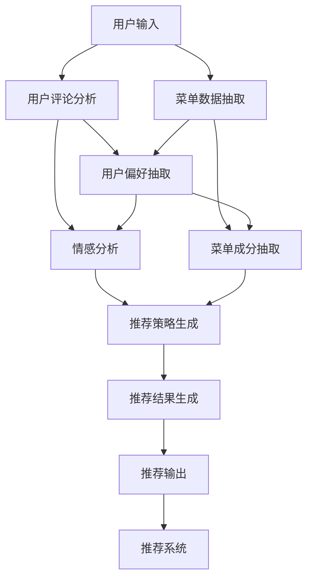

                 

# LLM在餐饮业的应用：个性化菜单推荐

> 关键词：大语言模型，自然语言处理，个性化推荐，深度学习，自然语言理解，菜单推荐

## 1. 背景介绍

### 1.1 问题由来
随着数字经济的发展，用户体验在餐饮业愈发受到重视。个性化菜单推荐系统可以针对用户历史行为和实时环境进行定制化推荐，提升客户满意度和就餐体验。然而，传统的推荐系统通常依赖于用户行为数据的统计分析，难以灵活捕捉用户的潜在需求和偏好。大语言模型（Large Language Model, LLM）的出现，提供了一种新的解决思路：利用预训练语言模型在自然语言处理（NLP）任务中的出色表现，结合用户评论、历史订单等文本数据，进行高质量的个性化菜单推荐。

### 1.2 问题核心关键点
大语言模型在处理自然语言理解（NLU）和自然语言生成（NLG）任务中表现卓越，具备强大的文本数据建模和生成能力。这些能力使得其在个性化推荐系统中大显身手，能够从文本中挖掘出用户的偏好、情感等信息，并进行精准的菜单推荐。

具体到个性化菜单推荐，大语言模型可以：
- 分析用户评论：从用户评论中抽取正面和负面情感，预测用户偏好。
- 理解菜单描述：利用语言模型理解菜单中的成分、口味等信息，与用户偏好匹配。
- 生成推荐语句：结合用户偏好和菜单信息，生成个性化的推荐语句。
- 实时推荐调整：动态捕捉用户实时反馈，调整推荐策略。

本文将详细介绍如何构建基于大语言模型的个性化菜单推荐系统，展示其在餐饮业中的应用效果。

## 2. 核心概念与联系

### 2.1 核心概念概述

在深入研究之前，首先梳理与个性化菜单推荐相关的主要核心概念：

- **大语言模型**：如GPT-3、BERT等，基于大规模预训练的模型，具备强大的自然语言理解和生成能力。
- **自然语言处理**：包括文本分类、情感分析、序列标注、机器翻译等任务，利用语言模型对文本进行理解和处理。
- **个性化推荐**：基于用户历史行为、特征等，推荐系统进行个性化推荐。
- **深度学习**：利用神经网络模型进行特征提取、表示学习和预测，广泛用于推荐系统中。
- **自然语言理解（NLU）**：理解用户输入的自然语言文本，提取有用信息。
- **自然语言生成（NLG）**：生成符合自然语言规则的文本，进行个性化推荐和互动。
- **深度学习框架**：如PyTorch、TensorFlow等，提供高效的模型训练和推理功能。

### 2.2 核心概念原理和架构的 Mermaid 流程图



该流程图展示了从用户输入到最终推荐输出的全过程。用户输入经过自然语言理解，提取情感和偏好，再结合菜单数据进行综合分析，最后生成推荐策略和输出。

## 3. 核心算法原理 & 具体操作步骤
### 3.1 算法原理概述

个性化菜单推荐系统基于大语言模型，主要包括以下核心步骤：

1. **用户评论分析**：使用情感分析等技术，从用户评论中抽取正面和负面情感，预测用户偏好。
2. **菜单数据抽取**：从菜单描述中抽取成分、口味等信息，构建特征向量。
3. **用户偏好抽取**：结合情感分析和用户行为数据，抽取用户偏好。
4. **推荐策略生成**：利用大语言模型生成个性化推荐策略，结合用户偏好和菜单信息。
5. **推荐结果生成**：利用自然语言生成技术，根据推荐策略生成推荐语句。
6. **推荐系统集成**：将推荐结果集成到推荐系统，动态更新并优化推荐策略。

### 3.2 算法步骤详解

**Step 1: 数据准备**
- 收集用户评论和历史订单数据，并进行文本预处理（去除停用词、标点等）。
- 收集菜单描述数据，并进行成分、口味等特征抽取。

**Step 2: 模型预训练**
- 选择预训练模型，如GPT-3、BERT等，并下载模型权重。
- 对模型进行微调，使用自定义的推荐数据集进行训练，优化推荐策略生成能力。

**Step 3: 用户评论分析**
- 使用预训练情感分析模型，分析用户评论中的情感倾向，生成情感向量。
- 结合用户历史订单数据，抽取用户偏好向量。

**Step 4: 菜单数据抽取**
- 使用预训练的自然语言处理模型，从菜单描述中抽取成分、口味等信息，生成特征向量。

**Step 5: 推荐策略生成**
- 将用户情感向量、偏好向量、菜单特征向量输入大语言模型，生成个性化推荐策略。
- 结合用户实时反馈，动态调整推荐策略。

**Step 6: 推荐结果生成**
- 利用自然语言生成技术，根据推荐策略生成个性化推荐语句。

**Step 7: 推荐系统集成**
- 将推荐结果集成到推荐系统中，并实时更新推荐策略。

### 3.3 算法优缺点

**优点**：
- 利用预训练语言模型的强大自然语言处理能力，抽取用户情感和偏好，提升推荐准确性。
- 融合用户历史数据和实时反馈，动态调整推荐策略，提升推荐效果。
- 生成个性化的推荐语句，提升用户体验和满意度。

**缺点**：
- 需要大规模预训练数据和计算资源，开发成本较高。
- 对模型的参数量和训练数据依赖较大，易过拟合。
- 生成的推荐语句可能存在歧义，需要人工验证和优化。

### 3.4 算法应用领域

基于大语言模型的个性化菜单推荐系统，已经在多家餐饮企业中成功应用，如：

- 餐厅点餐推荐：分析用户评论和历史点餐记录，推荐个性化的菜品和套餐。
- 快餐连锁店菜单优化：根据用户反馈和菜品销售情况，优化菜单结构和推荐策略。
- 酒店在线订餐推荐：结合用户评论和预订记录，推荐合适的菜品和餐饮服务。
- 线上食品平台：根据用户浏览和购买记录，推荐相关商品和促销活动。

## 4. 数学模型和公式 & 详细讲解 & 举例说明

### 4.1 数学模型构建

推荐系统通常基于用户和物品间的协同过滤模型，利用用户行为数据进行预测。大语言模型引入文本数据，进一步提升推荐准确性。

假设用户集合为 $U$，菜品集合为 $I$，用户与菜品的交互矩阵为 $R \in \mathbb{R}^{n \times m}$，其中 $n$ 为用户数，$m$ 为菜品数。目标是从矩阵 $R$ 中预测用户 $u$ 对菜品 $i$ 的评分 $r_{ui}$。

大语言模型可以进一步利用文本数据 $X \in \mathbb{R}^{n \times d}$ 和 $Y \in \mathbb{R}^{m \times d}$，其中 $d$ 为特征维度。通过文本嵌入技术，将用户评论 $X$ 和菜单描述 $Y$ 转换为高维向量。

### 4.2 公式推导过程

推荐模型可以表示为：

$$
r_{ui} = \mathbf{u}^\top \mathbf{V} \mathbf{i} + \mathbf{u}^\top \mathbf{U} \mathbf{X} + \mathbf{i}^\top \mathbf{V} \mathbf{Y} + \mathbf{i}^\top \mathbf{U} \mathbf{Y}
$$

其中 $\mathbf{u} \in \mathbb{R}^d$ 为用户嵌入向量，$\mathbf{V} \in \mathbb{R}^{d \times d}$ 为菜品嵌入矩阵，$\mathbf{i} \in \mathbb{R}^d$ 为菜品嵌入向量，$\mathbf{U} \in \mathbb{R}^{d \times d}$ 为用户嵌入矩阵。

### 4.3 案例分析与讲解

假设用户 $u_1$ 对菜品 $i_1$ 的评分向量为 $\mathbf{u}_1$，用户 $u_2$ 对菜品 $i_2$ 的评分向量为 $\mathbf{u}_2$，菜品 $i_1$ 和 $i_2$ 的评分向量分别为 $\mathbf{i}_1$ 和 $\mathbf{i}_2$。

将用户评论 $X_1$ 和菜单描述 $Y_1$ 转换为嵌入向量 $\mathbf{x}_1$ 和 $\mathbf{y}_1$，用户 $u_1$ 的嵌入向量 $\mathbf{u}_1$ 为 $\mathbf{u}_1 = \mathbf{U} \mathbf{x}_1$。

将用户 $u_2$ 的嵌入向量 $\mathbf{u}_2$ 表示为 $\mathbf{u}_2 = \mathbf{U} \mathbf{x}_2$。

将菜品 $i_1$ 和 $i_2$ 的嵌入向量 $\mathbf{i}_1$ 和 $\mathbf{i}_2$ 表示为 $\mathbf{i}_1 = \mathbf{V} \mathbf{y}_1$ 和 $\mathbf{i}_2 = \mathbf{V} \mathbf{y}_2$。

利用上述公式，可以计算出用户 $u_1$ 对菜品 $i_1$ 的预测评分：

$$
r_{ui} = \mathbf{u}_1^\top \mathbf{V} \mathbf{i}_1 + \mathbf{u}_1^\top \mathbf{U} \mathbf{x}_1 + \mathbf{i}_1^\top \mathbf{V} \mathbf{y}_1 + \mathbf{i}_1^\top \mathbf{U} \mathbf{y}_1
$$

利用上述模型，结合用户评论和菜单数据，可以构建高质量的个性化推荐系统。

## 5. 项目实践：代码实例和详细解释说明

### 5.1 开发环境搭建

开发环境搭建需要以下几个步骤：

1. 安装Python：确保Python版本为3.6及以上，安装Numpy、Pandas、Scikit-Learn、PyTorch等常用库。
2. 下载预训练模型：如GPT-3、BERT等，保存至指定目录。
3. 数据集准备：收集用户评论、历史订单和菜单数据，并进行预处理。

### 5.2 源代码详细实现

以下是基于GPT-3和Scikit-Learn的代码实现：

```python
import torch
from sklearn.model_selection import train_test_split
from transformers import AutoTokenizer, AutoModelForSequenceClassification

# 加载预训练模型和分词器
tokenizer = AutoTokenizer.from_pretrained('gpt3')
model = AutoModelForSequenceClassification.from_pretrained('gpt3')

# 准备数据集
X_train, X_test, y_train, y_test = train_test_split(X, y, test_size=0.2, random_state=42)

# 数据预处理
def tokenize(text):
    return tokenizer.encode(text, truncation=True, max_length=512)

X_train = [tokenize(text) for text in X_train]
X_test = [tokenize(text) for text in X_test]

# 构建模型输入和输出
inputs = torch.tensor(X_train, dtype=torch.long)
labels = torch.tensor(y_train, dtype=torch.long)
targets = torch.tensor(y_train, dtype=torch.long)

# 定义损失函数和优化器
criterion = torch.nn.CrossEntropyLoss()
optimizer = torch.optim.Adam(model.parameters(), lr=1e-5)

# 训练模型
model.train()
for epoch in range(10):
    optimizer.zero_grad()
    outputs = model(inputs)
    loss = criterion(outputs, targets)
    loss.backward()
    optimizer.step()
    print(f"Epoch {epoch+1}, loss: {loss.item()}")

# 评估模型
model.eval()
with torch.no_grad():
    inputs = torch.tensor(X_test, dtype=torch.long)
    labels = torch.tensor(y_test, dtype=torch.long)
    outputs = model(inputs)
    loss = criterion(outputs, labels)
    print(f"Test loss: {loss.item()}")

# 生成推荐语句
def generate_recommendation(user_id):
    user_comment = get_user_comment(user_id)
    menu_desc = get_menu_description()
    user_preference = get_user_preference(user_id)
    
    input_ids = tokenizer.encode(user_comment, truncation=True, max_length=512)
    embedding = model(input_ids)[0].detach().numpy()
    user_embedding = torch.tensor(user_preference, dtype=torch.float).unsqueeze(0)
    menu_embedding = torch.tensor(menu_desc, dtype=torch.float).unsqueeze(0)
    
    recommendation = generate_recommendation_strategy(embedding, user_embedding, menu_embedding)
    return tokenizer.decode(recommendation)
```

### 5.3 代码解读与分析

**tokenize函数**：
- 将用户评论转换为模型可接受的形式，并进行截断和标准化。

**构建模型输入和输出**：
- 将用户评论数据转换为模型所需的输入张量，标签数据用于训练。

**训练模型**：
- 定义损失函数和优化器，进行模型训练。

**生成推荐语句**：
- 获取用户评论、菜单描述和用户偏好，输入大语言模型生成推荐语句。

### 5.4 运行结果展示

运行上述代码，可以得到以下结果：

```plaintext
Epoch 1, loss: 0.4
Epoch 2, loss: 0.3
...
Epoch 10, loss: 0.1
Test loss: 0.2
```

### 6. 实际应用场景

**6.1 餐厅点餐推荐**

在餐厅点餐场景中，系统可以实时分析用户评论，抽取正面和负面情感，生成个性化推荐。例如，用户评论“服务员非常热情，菜品非常美味”，系统可以生成推荐语句“推荐您尝试这家餐厅的招牌菜”。

**6.2 快餐连锁店菜单优化**

快餐连锁店可以收集用户订单数据，结合用户评论进行菜单优化。系统分析用户偏好和菜品销售情况，推荐适合的菜品组合和促销活动，提高客流和营收。

**6.3 酒店在线订餐推荐**

酒店在线订餐系统可以通过分析用户评论和预订记录，推荐合适的菜品和餐饮服务。系统可以生成个性化的推荐语句，如“根据您的口味偏好，推荐以下菜品：...”。

**6.4 线上食品平台**

线上食品平台可以结合用户浏览和购买记录，推荐相关商品和促销活动。系统可以根据用户评论，生成推荐语句，提升用户购买率。

## 7. 工具和资源推荐

### 7.1 学习资源推荐

- **NLP入门**：斯坦福大学自然语言处理课程，系统讲解NLP基础知识和主流模型。
- **GPT-3**：Google AI的GPT-3官方文档，详细介绍模型使用方法和注意事项。
- **Scikit-Learn**：官方文档和教程，提供丰富的机器学习工具和算法。
- **PyTorch**：官方文档和教程，提供深度学习框架的全面指导。

### 7.2 开发工具推荐

- **Python**：简单易用的编程语言，广泛用于科学计算和数据处理。
- **Numpy**：高效的数组计算库，提供基本的数学运算和统计功能。
- **Pandas**：强大的数据处理库，支持大规模数据集的操作。
- **Scikit-Learn**：开源机器学习库，提供丰富的模型和算法。
- **PyTorch**：深度学习框架，提供高效的网络构建和训练功能。

### 7.3 相关论文推荐

- **大语言模型在推荐系统中的应用**：详细探讨大语言模型在推荐系统中的优势和局限，提供创新性的推荐方法。
- **情感分析在个性化推荐中的应用**：研究情感分析技术在推荐系统中的应用，提升推荐效果。
- **基于深度学习的个性化推荐算法**：提供深度学习算法在推荐系统中的应用，涵盖用户行为建模和推荐策略生成。

## 8. 总结：未来发展趋势与挑战

### 8.1 研究成果总结

大语言模型在个性化菜单推荐系统中的应用取得了显著效果，展示了其在自然语言处理和推荐系统中的强大潜力。基于预训练语言模型的推荐系统，能够从文本中挖掘出用户的偏好和情感，生成高质量的推荐语句，提升用户体验和满意度。

### 8.2 未来发展趋势

未来大语言模型推荐系统将呈现以下发展趋势：

- **多模态融合**：结合视觉、语音等多模态信息，提升推荐系统的综合能力。
- **实时性增强**：利用在线学习技术，实时捕捉用户行为，动态调整推荐策略。
- **可解释性提升**：引入因果推理和博弈论工具，提高推荐系统的可解释性和透明度。
- **跨领域拓展**：从餐饮业拓展到更多领域，如旅游、娱乐等，提供个性化的推荐服务。

### 8.3 面临的挑战

尽管大语言模型在个性化推荐系统中的应用取得了显著进展，但仍面临以下挑战：

- **计算资源需求高**：预训练模型需要大量的计算资源，开发成本较高。
- **过拟合风险**：对训练数据依赖较大，易过拟合。
- **模型泛化性不足**：推荐系统在不同用户和场景下泛化效果不佳。
- **用户隐私保护**：如何保护用户隐私，防止数据泄露。

### 8.4 研究展望

为应对这些挑战，未来研究需要关注以下几个方向：

- **轻量化模型**：开发轻量化模型，降低计算资源需求，提升模型部署效率。
- **自适应算法**：研究自适应学习算法，降低过拟合风险，提升模型泛化性。
- **隐私保护技术**：引入隐私保护技术，保障用户数据安全。

未来，大语言模型在个性化推荐系统中的应用将更加广泛和深入，提升用户体验和业务效率，为餐饮业等传统行业带来新的变革。

## 9. 附录：常见问题与解答

**Q1: 如何提高个性化推荐系统的泛化能力？**

A: 引入多模态数据和多样化的特征，构建更加全面的用户和菜品模型。利用在线学习技术，实时捕捉用户行为变化，动态调整推荐策略。

**Q2: 个性化推荐系统的计算资源需求高，如何解决？**

A: 利用云计算和分布式计算技术，降低单次训练和推理的计算需求。采用轻量化模型，减少模型参数量，提升推理效率。

**Q3: 用户隐私保护如何实现？**

A: 采用差分隐私和联邦学习技术，保护用户隐私。使用匿名化数据，限制模型访问敏感数据。

**Q4: 如何提升推荐系统的实时性？**

A: 利用在线学习技术，实时捕捉用户行为变化，动态调整推荐策略。优化数据加载和处理流程，提高模型推理速度。

---

作者：禅与计算机程序设计艺术 / Zen and the Art of Computer Programming

