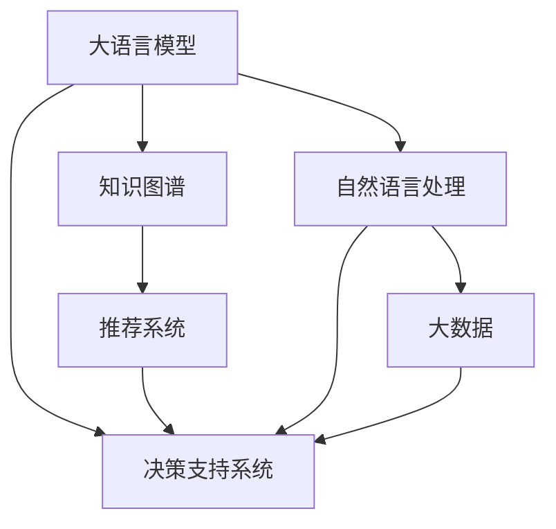

                 

# LLM对传统决策支持系统的挑战

> 关键词：
- 大语言模型
- 自然语言处理
- 决策支持系统
- 智能决策
- 知识图谱
- 推荐系统
- 大数据

## 1. 背景介绍

### 1.1 问题由来

在信息爆炸的现代社会，企业决策变得越来越复杂，需要处理的数据量迅速增加，决策支持系统的需求日益凸显。传统的决策支持系统（DSS），如专家系统、规则引擎、业务智能（BI）等，主要依靠手工编写的规则、模型和算法，缺乏自我学习和智能适应能力，已无法满足业务场景的快速变化和复杂性要求。

大语言模型（Large Language Model, LLM），如BERT、GPT等，在处理自然语言数据方面展现了卓越的性能，能够进行复杂的语义理解和推理，具备强大的知识获取和逻辑推理能力。基于大语言模型，企业可以构建全新的智能决策支持系统，大幅提升决策的效率和准确性，实现智能化转型。

### 1.2 问题核心关键点

大语言模型对传统决策支持系统的挑战主要集中在以下几个方面：

- **智能决策**：大语言模型可以自主学习和推理，大幅提升决策的智能化水平。
- **实时响应**：大语言模型能够快速处理海量数据，实现实时化决策支持。
- **跨领域知识融合**：大语言模型能够灵活整合不同领域的知识，提供更全面、深入的决策支持。
- **自动生成**：大语言模型能够自动生成报告、策略、方案等，减少人工工作量。
- **个性化服务**：大语言模型可以根据用户偏好和历史数据，提供高度个性化的决策建议。

这些优势使得大语言模型成为新一代智能决策支持系统的核心引擎，为传统DSS的升级和改造提供了新的技术路径。

## 2. 核心概念与联系

### 2.1 核心概念概述

要理解大语言模型对传统决策支持系统的挑战，首先需要明确以下关键概念：

- **决策支持系统（DSS）**：辅助决策者进行高效、科学的决策，提供基于数据的分析和建议。
- **大语言模型（LLM）**：通过大规模无标签数据预训练，学习到丰富语言知识和常识，具备强大的自然语言处理能力。
- **知识图谱（KG）**：以图结构表示实体和关系，用于存储和查询各种知识信息。
- **推荐系统（Recommendation System）**：根据用户历史行为和兴趣，推荐个性化内容。
- **自然语言处理（NLP）**：使计算机理解、处理和生成自然语言，包括语义理解、文本生成等。
- **大数据（Big Data）**：包含结构化和非结构化数据，用于支持大规模数据分析和处理。

这些概念之间存在密切联系，共同构成了智能决策支持系统的基础。大语言模型作为其中的核心引擎，能够处理和整合各种来源的数据，自主学习知识，并基于这些知识提供智能化的决策建议。

### 2.2 核心概念原理和架构的 Mermaid 流程图



这个流程图展示了不同概念之间的联系：大语言模型从知识图谱、推荐系统和自然语言处理中获取信息，结合大数据，最终支持决策系统的智能决策。

## 3. 核心算法原理 & 具体操作步骤

### 3.1 算法原理概述

大语言模型对传统DSS的挑战，主要体现在以下几个方面：

- **智能推理与决策**：大语言模型可以理解和推理复杂的语义，进行逻辑推理和假设验证，辅助决策者制定策略。
- **知识抽取与融合**：大语言模型可以从知识图谱、文档、文本中抽取知识，并整合多源信息，提供更全面的决策依据。
- **用户互动与个性化服务**：大语言模型能够与用户进行自然语言交互，根据用户反馈实时调整决策建议，提供个性化服务。

### 3.2 算法步骤详解

以下是基于大语言模型的决策支持系统的主要操作步骤：

**Step 1: 准备数据**

- 收集和整理决策支持所需的各种数据，包括结构化数据（如表格、文档）和非结构化数据（如文本、音频、视频）。
- 清洗数据，去除噪声和异常值，保证数据的质量。
- 将数据转化为模型可处理的格式，如TensorFlow的TFRecords格式，或Pandas DataFrame格式。

**Step 2: 构建知识图谱**

- 使用如Wikidata、Freebase等开放数据源构建知识图谱，或使用专有领域的知识库（如金融、医疗等）。
- 定义实体类型和关系类型，将数据转化为图结构，使用Turtle、RDF等格式表示。
- 对知识图谱进行丰富和扩展，引入领域专家的知识，进行实体抽取、关系识别和推理。

**Step 3: 训练大语言模型**

- 选择适合的语言模型架构（如BERT、GPT、T5等），使用大规模无标签数据进行预训练。
- 使用标注数据对预训练模型进行微调，使其能够进行特定的决策任务（如分类、推理、生成等）。
- 使用合适的优化算法（如AdamW、SGD等）和超参数，控制训练过程。

**Step 4: 构建决策引擎**

- 根据具体的决策任务，设计模型结构，包括输入、输出和中间层。
- 将训练好的模型部署到决策引擎中，实现决策模型的推理和预测功能。
- 使用分布式计算框架（如TensorFlow Serving、Flask等），提升推理性能。

**Step 5: 实时监测与优化**

- 实时监控决策模型的性能，使用A/B测试等手段评估模型效果。
- 定期更新知识图谱和大语言模型，引入最新的数据和知识。
- 进行模型调优，优化超参数，提升决策支持的准确性和效率。

### 3.3 算法优缺点

基于大语言模型的决策支持系统具有以下优点：

- **高效性**：大语言模型能够快速处理和推理海量数据，实现实时化决策支持。
- **灵活性**：大语言模型具备自主学习和推理能力，能够灵活适应不同领域的决策需求。
- **可解释性**：大语言模型能够提供决策依据的解释和推理过程，增强决策的透明性。
- **扩展性**：大语言模型可以不断扩展和优化，适应业务场景的变化。

但同时，该方法也存在以下缺点：

- **数据依赖**：大语言模型对数据质量、规模和多样性要求较高，需要大量高质量的数据进行预训练和微调。
- **可解释性不足**：大语言模型的决策过程通常缺乏可解释性，难以对其推理逻辑进行分析和调试。
- **计算资源需求高**：大语言模型参数量大，计算资源需求高，需要高性能的计算设备和算法优化。
- **伦理与隐私问题**：大语言模型可能学习到有害信息或偏见，引发伦理和隐私问题。

### 3.4 算法应用领域

基于大语言模型的决策支持系统已经在诸多领域得到了应用，例如：

- **金融决策**：分析股票市场走势、投资组合、风险管理等。
- **医疗诊断**：辅助医生进行疾病诊断、治疗方案推荐等。
- **企业运营**：优化生产流程、供应链管理、客户关系管理等。
- **智能客服**：提供自动化问答、故障排查、用户情绪分析等服务。
- **市场营销**：分析消费者行为、广告投放优化、个性化推荐等。
- **安全监控**：实时监测异常行为、威胁分析、事件响应等。

这些应用领域展示了大语言模型在智能决策支持系统中的强大潜力，为各行业的智能化转型提供了新的解决方案。

## 4. 数学模型和公式 & 详细讲解 & 举例说明

### 4.1 数学模型构建

以下是基于大语言模型的决策支持系统的主要数学模型：

- **知识图谱表示模型**：
  - **实体-关系图**：$G=(V,E)$，其中$V$为节点集合，$E$为边集合，每条边表示实体之间的关系。
  - **实体嵌入向量**：$e_i \in \mathbb{R}^d$，表示实体的向量表示。
  - **关系嵌入向量**：$r_{ij} \in \mathbb{R}^d$，表示关系的向量表示。

- **语言模型训练模型**：
  - **自回归模型**：$P(x_i|x_{<i})=\prod_{i=1}^{T}P(x_i|x_{<i})$，表示当前单词$x_i$的条件概率。
  - **自编码模型**：$P(x_i|x_{<i})=\prod_{i=1}^{T}P(x_i|x_{<i-1})$，表示当前单词$x_i$的生成概率。

### 4.2 公式推导过程

以下是知识图谱表示模型的推导过程：

- **实体嵌入表示**：
  - $e_i$ 可以通过多维神经网络训练得到，例如：
    $$
    e_i = \text{Transformer}(x_i)
    $$
  - 其中$x_i$为实体$i$的特征向量。

- **关系嵌入表示**：
  - $r_{ij}$ 可以通过多维神经网络训练得到，例如：
    $$
    r_{ij} = \text{Transformer}(x_i, x_j)
    $$
  - 其中$x_i, x_j$为实体$i$和$j$的特征向量。

- **实体关系图推理**：
  - 使用图神经网络（GNN）对知识图谱进行推理，例如：
    $$
    y_{ij} = \text{GNN}(e_i, r_{ij}, e_j)
    $$
  - 其中$y_{ij}$表示实体$i$和$j$之间的关系。

- **语言模型训练过程**：
  - 使用最大似然估计（MLE）训练语言模型，例如：
    $$
    \max_{\theta} \sum_{i=1}^{T} \log P(x_i|x_{<i})
    $$
  - 其中$\theta$为模型参数，$T$为训练序列长度。

### 4.3 案例分析与讲解

以金融风险评估为例，展示大语言模型在决策支持系统中的应用。

假设有一个银行贷款审批系统，需要根据客户的信用记录、财务状况等数据进行风险评估和贷款审批。可以使用大语言模型结合知识图谱构建智能决策支持系统：

- **数据准备**：收集客户的历史贷款记录、信用评分、收入情况等数据。
- **知识图谱构建**：定义实体和关系类型，如客户、贷款、信用评分等，构建知识图谱。
- **模型训练**：使用大语言模型对贷款申请文本进行文本表示，提取关键特征。
- **决策推理**：使用图神经网络对知识图谱进行推理，评估贷款申请的风险等级。
- **结果输出**：将风险等级与审批策略相结合，自动生成贷款审批建议。

这个案例展示了大语言模型在智能决策支持系统中的作用：通过处理和整合各种数据，提供智能化的决策支持。

## 5. 项目实践：代码实例和详细解释说明

### 5.1 开发环境搭建

在进行基于大语言模型的决策支持系统开发前，需要准备以下开发环境：

1. **安装Python**：
   - 使用Anaconda或Miniconda安装Python，并设置虚拟环境。
   ```bash
   conda create -n dss-env python=3.8
   conda activate dss-env
   ```

2. **安装相关库**：
   - 安装TensorFlow、PyTorch、PyTorch Serving、Flask等深度学习库。
   ```bash
   conda install torch torchvision torchaudio -c pytorch -c conda-forge
   conda install tensorflow -c tensorflow
   conda install torch-serving flask
   ```

3. **安装知识图谱构建工具**：
   - 使用RDFlib或Gephgraph等工具进行知识图谱构建和推理。
   ```bash
   conda install rdflib
   conda install geopython
   ```

4. **安装大语言模型库**：
   - 使用Transformers库加载预训练模型，并进行微调。
   ```bash
   pip install transformers
   ```

### 5.2 源代码详细实现

以下是一个基于BERT和Flask的决策支持系统的代码实现：

```python
from transformers import BertForSequenceClassification, BertTokenizer
from flask import Flask, request, jsonify
import pandas as pd
import rdflib
import geopython

# 初始化Flask应用
app = Flask(__name__)

# 加载BERT模型和分词器
model = BertForSequenceClassification.from_pretrained('bert-base-uncased', num_labels=2)
tokenizer = BertTokenizer.from_pretrained('bert-base-uncased')

# 构建知识图谱
g = rdflib.Graph()
g.parse('data/rdffile.ttl', format='Turtle')
g.serialize('data/ntfile.nt', format='N-Triples')

# 定义决策推理函数
def predict_decision(text):
    # 分词和编码
    inputs = tokenizer.encode_plus(text, max_length=512, return_tensors='pt', padding='max_length', truncation=True)
    # 推理
    outputs = model(**inputs)
    labels = outputs.logits.argmax(dim=1)
    return labels.item()

# 定义Flask路由
@app.route('/predict', methods=['POST'])
def predict():
    data = request.get_json(force=True)
    text = data['text']
    label = predict_decision(text)
    return jsonify(label=label)

if __name__ == '__main__':
    app.run(host='0.0.0.0', port=5000)
```

### 5.3 代码解读与分析

上述代码展示了基于BERT的决策支持系统的基本实现。主要包括：

- **Flask应用**：使用Flask搭建一个简单的API，接收文本输入，返回决策结果。
- **BERT模型**：使用预训练的BERT模型进行决策推理。
- **知识图谱**：使用RDFlib构建知识图谱，并进行推理。

## 6. 实际应用场景

### 6.1 智能金融决策

在金融领域，智能决策支持系统能够帮助银行、保险公司等金融机构，提高风险评估和客户服务的智能化水平。通过大语言模型，金融机构可以自动分析客户的历史数据，进行信用评分、贷款审批等决策。例如，可以使用大语言模型结合知识图谱，实时监控市场动态，预测股票价格走势，辅助投资决策。

### 6.2 医疗智能诊断

医疗领域面临复杂的诊断和治疗决策，传统方法依赖于医生的经验和知识。智能决策支持系统能够整合电子病历、影像数据等，辅助医生进行诊断和治疗方案推荐。例如，可以使用大语言模型结合知识图谱，分析患者的症状、病史等数据，推荐合适的治疗方案，提供个性化的医疗服务。

### 6.3 智能推荐系统

推荐系统广泛应用于电商、视频、音乐等领域，帮助用户发现感兴趣的内容。智能推荐系统可以通过大语言模型，分析用户的浏览、购买、评分等行为数据，进行个性化的推荐。例如，可以使用大语言模型结合知识图谱，推荐相关的产品、电影、书籍等，提升用户满意度。

### 6.4 智能客服

智能客服系统能够24小时不间断地为用户提供咨询服务，解决用户的问题。智能客服系统可以通过大语言模型，结合知识图谱，理解用户的问题，并提供精准的解答。例如，可以使用大语言模型结合知识图谱，构建智能客服系统，处理用户的常见问题，提高客户满意度。

### 6.5 智能安防

智能安防系统能够实时监控视频、音频等数据，进行异常检测和预警。智能安防系统可以通过大语言模型，分析监控数据，识别出异常行为，提供及时的预警。例如，可以使用大语言模型结合知识图谱，实时监控视频数据，检测出可疑行为，提供预警信息。

## 7. 工具和资源推荐

### 7.1 学习资源推荐

- **《深度学习理论与实践》**：这本书详细介绍了深度学习的基本概念和应用，适合初学者入门。
- **《自然语言处理综论》**：这本书全面介绍了NLP的基本理论和最新进展，适合进阶学习。
- **《知识图谱：概念、技术与应用》**：这本书介绍了知识图谱的基本概念和技术，适合了解知识图谱的应用。
- **《智能推荐系统》**：这本书详细介绍了推荐系统的工作原理和实现方法，适合了解推荐系统。

### 7.2 开发工具推荐

- **TensorFlow**：用于深度学习和模型训练，支持分布式计算和模型部署。
- **PyTorch**：用于深度学习和模型训练，支持动态计算图和模型优化。
- **Transformers**：用于自然语言处理任务的模型封装，支持多种预训练模型。
- **RDFlib**：用于知识图谱的构建和推理，支持多种数据格式。
- **Flask**：用于构建API和Web应用，支持快速开发和部署。

### 7.3 相关论文推荐

- **《Knowledge-Graph-Based Decision Support Systems》**：这篇文章介绍了知识图谱在决策支持系统中的应用。
- **《Deep Learning for Natural Language Processing》**：这篇文章介绍了深度学习在NLP中的应用，包括大语言模型的训练和推理。
- **《Recommendation Systems with Deep Learning》**：这篇文章介绍了深度学习在推荐系统中的应用。

## 8. 总结：未来发展趋势与挑战

### 8.1 研究成果总结

本文对大语言模型在决策支持系统中的应用进行了详细探讨，展示了其在智能决策、实时响应、知识融合等方面的优势。通过将大语言模型与知识图谱、推荐系统等结合，构建了多个领域的智能决策支持系统，展示了其在金融、医疗、电商等领域的实际应用效果。

### 8.2 未来发展趋势

未来，基于大语言模型的决策支持系统将呈现以下几个发展趋势：

1. **知识图谱的丰富和扩展**：未来的知识图谱将更加丰富和全面，涵盖更多领域和实体，提高决策支持的准确性。
2. **大语言模型的自监督学习**：未来的大语言模型将更多采用自监督学习方式进行预训练，减少对标注数据的依赖。
3. **深度强化学习**：未来的决策支持系统将更多采用深度强化学习方式，提升决策的智能化水平。
4. **联邦学习和隐私保护**：未来的决策支持系统将更多采用联邦学习和隐私保护技术，保护用户隐私和数据安全。
5. **跨领域应用**：未来的决策支持系统将更多应用于跨领域场景，如医疗、金融、电商等，提高系统覆盖面和适用性。

### 8.3 面临的挑战

虽然基于大语言模型的决策支持系统取得了显著进展，但在实际应用中仍面临诸多挑战：

1. **数据质量和多样性**：决策支持系统对数据质量、规模和多样性要求较高，如何获取和处理高质量的数据，仍是一个难题。
2. **模型可解释性**：大语言模型的决策过程缺乏可解释性，如何增强模型的可解释性和透明度，仍是一个挑战。
3. **计算资源需求**：大语言模型参数量大，计算资源需求高，如何优化模型和算法，提高计算效率，仍是一个挑战。
4. **伦理和隐私问题**：大语言模型可能学习到有害信息或偏见，如何保护用户隐私和伦理，仍是一个挑战。

### 8.4 研究展望

未来的研究需要在以下几个方面进行深入探讨：

1. **数据增强技术**：探索更多数据增强技术，如数据生成、回译、数据扩充等，提高数据质量。
2. **模型压缩技术**：探索更多模型压缩技术，如知识蒸馏、剪枝、量化等，减少计算资源需求。
3. **可解释性技术**：探索更多可解释性技术，如特征归约、解释生成、可视化等，增强模型透明度。
4. **隐私保护技术**：探索更多隐私保护技术，如差分隐私、联邦学习、安全多方计算等，保护用户隐私。
5. **跨领域融合技术**：探索更多跨领域融合技术，如跨领域知识图谱、跨领域预训练等，提高系统适应性。

总之，基于大语言模型的决策支持系统具有广阔的应用前景，未来的研究需要全面考虑数据、模型、算法、伦理等各方面因素，才能实现真正智能化的决策支持。

## 9. 附录：常见问题与解答

**Q1: 大语言模型和决策支持系统有什么区别？**

A: 大语言模型是一种预训练的语言模型，能够进行自然语言理解和生成，具备强大的语言处理能力。决策支持系统是一种辅助决策的智能系统，利用数据、模型和算法提供决策支持。大语言模型可以作为决策支持系统的一个组件，用于处理和理解文本数据，提供智能化的决策建议。

**Q2: 如何选择合适的预训练模型？**

A: 选择合适的预训练模型需要考虑以下几个因素：
1. 任务类型：不同任务需要不同类型的预训练模型，如BERT适用于文本分类、语言模型，GPT适用于生成任务。
2. 数据规模：大数据预训练模型通常表现更好，但计算资源需求也更高。
3. 可解释性：某些任务需要高度可解释的模型，如医疗、金融等领域。
4. 领域相关性：某些任务需要领域特定的预训练模型，如医学、法律等领域。

**Q3: 如何优化知识图谱构建过程？**

A: 优化知识图谱构建过程可以从以下几个方面进行：
1. 数据质量：确保数据的质量和完整性，避免噪声和异常值。
2. 实体和关系类型定义：明确实体和关系的类型，避免歧义。
3. 知识抽取技术：使用自动化工具进行实体抽取和关系识别，提高效率和准确性。
4. 知识推理技术：使用图神经网络等技术进行知识推理，提升知识融合能力。

**Q4: 如何提高大语言模型的可解释性？**

A: 提高大语言模型的可解释性可以从以下几个方面进行：
1. 特征归约：对模型输出的特征进行归约，提取关键信息。
2. 解释生成：使用可解释性生成技术，如LIME、SHAP等，生成模型的解释信息。
3. 可视化技术：使用可视化技术，如t-SNE、LDA等，展示模型输出和特征分布。
4. 模型简化：通过剪枝、量化等技术，简化模型结构，提高可解释性。

**Q5: 如何保护用户隐私？**

A: 保护用户隐私可以从以下几个方面进行：
1. 差分隐私：使用差分隐私技术，限制模型对用户数据的访问。
2. 联邦学习：使用联邦学习技术，在本地设备上进行模型训练，保护用户数据隐私。
3. 安全多方计算：使用安全多方计算技术，多方协同计算，保护用户数据隐私。
4. 数据加密：对用户数据进行加密存储和传输，保护数据安全。

总之，大语言模型在决策支持系统中具有广泛的应用前景，但如何优化数据质量、模型结构、算法性能，提高可解释性和隐私保护，仍是一个重要的研究方向。

---

作者：禅与计算机程序设计艺术 / Zen and the Art of Computer Programming

