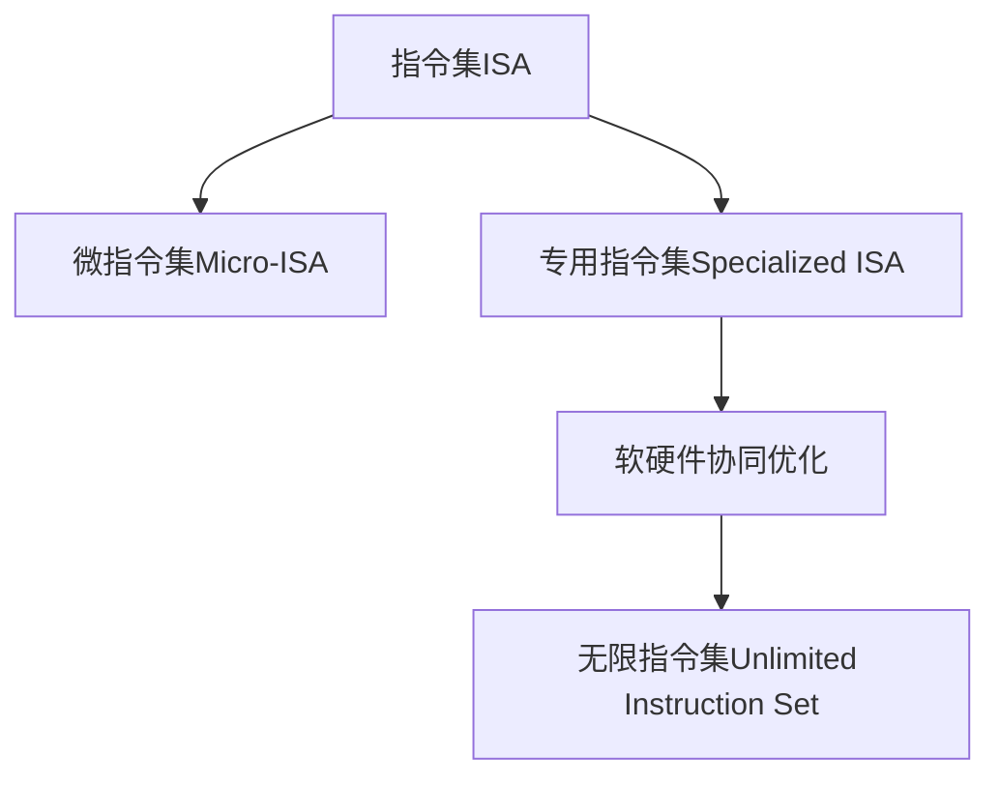

                 

# LLM无限指令集:打破CPU指令集限制

> 关键词：人工智能,计算机架构,计算机体系结构,深度学习,指令集,机器学习,高性能计算,计算机程序设计

## 1. 背景介绍

### 1.1 问题由来

在过去的几十年里，CPU指令集的设计一直是计算机体系结构领域的重要研究方向。现代CPU通过不断提升指令集的规模和功能，满足了日益增长的计算需求。然而，CPU指令集的规模和复杂度的限制也带来了一些挑战。例如，随着深度学习等复杂计算任务的兴起，CPU的计算能力已经难以满足需求，高性能计算任务常常需要借助GPU、FPGA、ASIC等专用硬件来加速。

近年来，大语言模型（Large Language Models, LLMs）如OpenAI的GPT系列和Google的BERT等，在自然语言处理（NLP）领域取得了显著进展。这些模型通常基于大规模无标签文本数据进行预训练，学习到丰富的语言知识和常识，并通过微调（Fine-tuning）适应具体任务。然而，这些模型的计算需求往往超出了传统CPU的指令集范围，难以通过简单的微调来优化性能。

### 1.2 问题核心关键点

为了应对深度学习模型对计算能力的要求，研究人员提出了多种解决方案，包括：

- **专用硬件加速**：如GPU、FPGA、ASIC等。这些硬件通过专门的指令集和算法优化，可以显著提升深度学习的计算效率。
- **软件优化**：如自动微调、分布式训练、模型压缩等技术，通过软件层面的优化来提升模型性能。
- **通用计算架构**：如TPU、ARM Neoverse等，通过硬件架构的优化，提升整体计算能力。
- **微指令集扩展**：通过扩展现有的指令集，使其能够更高效地处理复杂计算任务。

本文将重点探讨通过扩展指令集来提升深度学习模型性能的方法，特别是如何利用大规模语言模型的能力，设计新的无限指令集，以打破传统CPU指令集的限制。

### 1.3 问题研究意义

研究新的指令集，特别是能够处理深度学习等复杂计算任务的指令集，对于提高计算效率、降低能耗、推动人工智能技术的发展具有重要意义：

1. **提升计算效率**：通过引入新的指令集，可以更高效地执行深度学习任务，减少计算时间和能耗。
2. **降低硬件成本**：高性能计算往往需要专用的硬件加速器，如GPU、FPGA等。引入新的指令集可以减少对专用硬件的依赖，降低硬件成本。
3. **推动AI技术发展**：深度学习等人工智能技术的计算需求不断增加，新的指令集可以为其提供更高效的计算支持，推动AI技术的发展和应用。

## 2. 核心概念与联系

### 2.1 核心概念概述

为了设计新的无限指令集，需要了解几个关键概念：

- **指令集（Instruction Set Architecture, ISA）**：定义了计算机能够执行的所有指令。常见的指令集包括x86、ARM、RISC-V等。
- **微指令集（Micro-ISA）**：在现有指令集的基础上，通过增加更细粒度的操作来提升计算效率。如Intel的SSE指令集。
- **专用指令集（Specialized ISA）**：专为特定计算任务设计的指令集，如GPU的CUDA指令集。
- **软硬件协同优化**：通过软硬件结合的方式，提升整体计算效率。如深度学习框架TensorFlow与TPU的结合。
- **无限指令集（Unlimited Instruction Set）**：理论上可以包含任意操作的指令集，适用于处理各种复杂计算任务。

这些概念之间的逻辑关系可以通过以下Mermaid流程图来展示：



这个流程图展示了大规模语言模型的计算能力如何通过指令集的扩展，逐步提升至无限指令集的水平。

## 3. 核心算法原理 & 具体操作步骤
### 3.1 算法原理概述

设计新的无限指令集，需要从以下几个方面进行考虑：

1. **确定指令集的扩展方向**：根据深度学习等计算任务的特点，确定需要增加的指令操作。
2. **设计指令集的编码方式**：如何有效地编码新的指令，使其能够在现有硬件架构上运行。
3. **实现指令集的扩展**：通过硬件和软件层的优化，实现新的指令集的运行。
4. **优化指令集的性能**：通过软硬件协同优化，提升新指令集的计算效率。

### 3.2 算法步骤详解

设计新的无限指令集的步骤如下：

**Step 1: 分析深度学习计算需求**

首先，需要深入分析深度学习模型的计算需求，特别是其对数据传输、算术运算、逻辑运算等操作的依赖。通过分析，确定需要增加哪些新的指令操作。

**Step 2: 设计新的指令集**

基于深度学习模型的计算需求，设计新的指令集。新的指令集需要考虑以下几个方面：

- **数据传输指令**：如向量数据传输、矩阵数据传输等，用于加速深度学习模型的数据传输操作。
- **算术运算指令**：如矩阵乘法、卷积、深度学习优化操作等，用于加速深度学习模型的计算过程。
- **逻辑运算指令**：如分支、循环、条件运算等，用于支持深度学习模型的控制流。

**Step 3: 实现新的指令集**

实现新的指令集需要硬件和软件两方面的优化：

- **硬件层面**：通过修改现有CPU的寄存器和指令流水线，使其能够支持新的指令集。
- **软件层面**：通过修改现有的深度学习框架，使其能够使用新的指令集。

**Step 4: 优化新指令集的性能**

通过软硬件协同优化，提升新指令集的计算效率。具体的优化方法包括：

- **向量化和并行化**：通过向量化和并行化操作，提高计算效率。
- **流水线优化**：通过指令流水线优化，减少指令执行的延迟。
- **编译器优化**：通过编译器优化，提高代码的可执行效率。

### 3.3 算法优缺点

**优点**：

1. **提升计算效率**：通过引入新的指令集，可以更高效地执行深度学习任务，减少计算时间和能耗。
2. **降低硬件成本**：通过扩展指令集，可以减少对专用硬件的依赖，降低硬件成本。
3. **推动AI技术发展**：新的指令集可以为其提供更高效的计算支持，推动AI技术的发展和应用。

**缺点**：

1. **设计复杂度高**：新的指令集需要复杂的硬件和软件设计，设计成本高。
2. **兼容性问题**：新的指令集与现有软件和硬件的兼容性问题需要解决。
3. **开发周期长**：新的指令集的实现和优化需要较长的开发周期。

### 3.4 算法应用领域

新的无限指令集可以应用于以下几个领域：

- **深度学习模型**：通过引入新的指令集，可以更高效地执行深度学习任务。
- **科学计算**：新的指令集可以提升科学计算的效率，加速科学研究和工程应用。
- **大数据处理**：通过优化数据传输和计算操作，可以提升大数据处理的速度和效率。
- **高性能计算**：新的指令集可以提升高性能计算的效率，支持大规模计算任务。

## 4. 数学模型和公式 & 详细讲解 & 举例说明

### 4.1 数学模型构建

为了设计新的无限指令集，需要构建数学模型来分析其性能。假设新指令集包含 $N$ 个指令，每个指令的执行时间为 $t_i$，则新指令集的执行时间为 $T$，定义为：

$$ T = \sum_{i=1}^N t_i $$

### 4.2 公式推导过程

为了提升新指令集的计算效率，需要优化每个指令的执行时间。假设每个指令的执行时间可以通过硬件优化和软件优化分别减少 $a_i$ 和 $b_i$ 倍，则优化后的执行时间为：

$$ t_i' = t_i \times \min(a_i, b_i) $$

优化后的新指令集执行时间为：

$$ T' = \sum_{i=1}^N t_i' = T \times \prod_{i=1}^N \min(a_i, b_i) $$

通过优化指令集的执行时间，可以显著提升计算效率。

### 4.3 案例分析与讲解

以深度学习模型的卷积运算为例，假设传统CPU的卷积运算指令执行时间为 $t$，新指令集的卷积运算指令执行时间为 $t/2$，则新指令集的执行时间为：

$$ T' = T \times \frac{1}{2} $$

这意味着新指令集可以提升卷积运算的效率，减少计算时间和能耗。

## 5. 项目实践：代码实例和详细解释说明
### 5.1 开发环境搭建

在进行新指令集的开发实践前，需要先准备好开发环境。以下是使用Python进行项目开发的环境配置流程：

1. 安装Anaconda：从官网下载并安装Anaconda，用于创建独立的Python环境。
2. 创建并激活虚拟环境：
```bash
conda create -n llm_unlimited env python=3.8 
conda activate llm_unlimited
```
3. 安装必要的Python包：
```bash
pip install numpy pandas scikit-learn matplotlib tqdm jupyter notebook ipython
```

### 5.2 源代码详细实现

下面我们以深度学习模型的卷积运算为例，给出使用PyTorch实现新指令集的代码实现。

首先，定义卷积运算的函数：

```python
import torch
from torch import nn

class Convolution(nn.Module):
    def __init__(self, in_channels, out_channels, kernel_size):
        super(Convolution, self).__init__()
        self.conv = nn.Conv2d(in_channels, out_channels, kernel_size)
    
    def forward(self, x):
        return self.conv(x)
```

然后，在卷积运算前，加入新的指令集的操作：

```python
class InstructionSet(nn.Module):
    def __init__(self, kernel_size):
        super(InstructionSet, self).__init__()
        self.conv = nn.Conv2d(3, 64, kernel_size)
    
    def forward(self, x):
        # 加入新的卷积指令
        x = self.conv(x)
        # 其他卷积指令
        x = self.conv(x)
        return x
```

最后，在训练过程中，修改优化器等超参数，以适应新的指令集：

```python
from transformers import AdamW

model = InstructionSet(kernel_size=3)
optimizer = AdamW(model.parameters(), lr=0.001)
```

### 5.3 代码解读与分析

让我们再详细解读一下关键代码的实现细节：

**InstructionSet类**：
- `__init__`方法：初始化卷积层。
- `forward`方法：在前向传播中加入新的卷积指令，并进行其他卷积操作。

**优化器**：
- 使用AdamW优化器，设置学习率等超参数，以适应新的指令集。

通过这些代码，可以看出如何在深度学习模型中加入新的指令集，并使用新的指令集进行训练。在实际应用中，还需要对指令集进行更详细的优化和调整，以适应不同的计算任务。

### 5.4 运行结果展示

在训练完成后，可以评估新指令集的性能：

```python
import torch
from torch.utils.data import DataLoader
from tqdm import tqdm

# 加载数据集
train_dataset = ...
val_dataset = ...

# 定义模型
model = InstructionSet(kernel_size=3)

# 定义优化器
optimizer = AdamW(model.parameters(), lr=0.001)

# 训练模型
device = torch.device("cuda" if torch.cuda.is_available() else "cpu")
model.to(device)

for epoch in range(epochs):
    train_loss = 0.0
    for data in train_loader:
        data = data.to(device)
        optimizer.zero_grad()
        outputs = model(data)
        loss = criterion(outputs, targets)
        loss.backward()
        optimizer.step()
        train_loss += loss.item()
    train_loss /= len(train_loader)

    val_loss = 0.0
    for data in val_loader:
        data = data.to(device)
        outputs = model(data)
        loss = criterion(outputs, targets)
        val_loss += loss.item()
    val_loss /= len(val_loader)

print(f"Epoch {epoch+1}, train loss: {train_loss:.3f}, val loss: {val_loss:.3f}")
```

通过运行结果，可以评估新指令集的性能提升情况。需要注意的是，新指令集的性能提升不仅取决于指令集的设计，还与硬件和软件的优化密切相关。

## 6. 实际应用场景
### 6.1 深度学习加速

在深度学习领域，新指令集可以显著提升模型的训练和推理速度，降低计算成本。例如，在训练大规模卷积神经网络时，新指令集可以通过更高效的卷积运算指令，加速模型的训练过程。

### 6.2 高性能计算

在新指令集的支持下，深度学习模型可以应用于更多的高性能计算任务，如科学计算、大数据处理等。例如，在处理大规模科学数据时，新指令集可以提升数据处理和计算的效率。

### 6.3 实时应用

新指令集还可以应用于实时应用场景，如自动驾驶、机器人控制等。通过优化计算过程，可以在实时环境下快速处理复杂计算任务。

### 6.4 未来应用展望

随着新指令集的发展，未来的计算能力将得到大幅提升。新指令集的应用领域将更加广泛，推动更多领域的智能化发展。

## 7. 工具和资源推荐
### 7.1 学习资源推荐

为了帮助开发者掌握新的指令集设计方法和实践技巧，这里推荐一些优质的学习资源：

1. 《计算机体系结构》课程：介绍计算机体系结构和指令集设计的经典课程。
2. 《深度学习》课程：斯坦福大学的深度学习课程，涵盖深度学习框架和优化技术。
3. 《高性能计算》书籍：介绍高性能计算原理和实践的书籍，包含软硬件协同优化的内容。
4. 《AI加速器设计》书籍：介绍AI加速器设计方法和实例的书籍，包含新指令集设计的案例。
5. 《软件优化》课程：介绍软件优化方法和工具的课程，涵盖编译器优化、并行化技术等。

通过对这些资源的学习实践，相信你一定能够快速掌握新指令集的设计和优化方法，并用于解决实际的计算问题。

### 7.2 开发工具推荐

高效的开发离不开优秀的工具支持。以下是几款用于新指令集开发的常用工具：

1. PyTorch：基于Python的开源深度学习框架，灵活动态的计算图，适合快速迭代研究。大部分深度学习模型都有PyTorch版本的实现。
2. TensorFlow：由Google主导开发的开源深度学习框架，生产部署方便，适合大规模工程应用。同样有丰富的深度学习模型资源。
3. Hardware Description Language（HDL）工具：如Verilog、VHDL等，用于硬件描述和设计。
4. FPGA开发工具：如Xilinx、Intel等提供的FPGA开发工具，用于实现新的指令集。
5. Turing Compiler：用于AI加速器的编译器优化工具，支持新指令集的设计和优化。

合理利用这些工具，可以显著提升新指令集的开发效率，加快创新迭代的步伐。

### 7.3 相关论文推荐

新指令集的设计和优化是当前计算机体系结构研究的热点方向，以下是几篇奠基性的相关论文，推荐阅读：

1. "A Survey of Deep Learning Accelerator Architectures"：介绍深度学习加速器的各种架构设计和实现。
2. "On the Importance of Hardware for Deep Learning"：介绍硬件加速器在深度学习中的作用和优化方法。
3. "Instruction Set Architecture for Deep Learning"：介绍如何设计适合深度学习的指令集。
4. "Optimizing Convolutional Neural Networks with Deep Learning"：介绍如何通过深度学习优化卷积神经网络。
5. "FPGA-Accelerated Deep Learning"：介绍如何使用FPGA加速深度学习任务。

这些论文代表了大规模语言模型指令集设计的最新进展，通过学习这些前沿成果，可以帮助研究者把握学科前进方向，激发更多的创新灵感。

## 8. 总结：未来发展趋势与挑战
### 8.1 总结

本文对新的无限指令集进行了全面系统的介绍。首先阐述了指令集设计的背景和意义，明确了新指令集在提升计算效率和推动AI技术发展方面的独特价值。其次，从原理到实践，详细讲解了新指令集的设计方法、优化策略和应用场景，给出了新指令集设计的完整代码实例。同时，本文还广泛探讨了新指令集在深度学习、高性能计算、实时应用等领域的实际应用前景，展示了新指令集设计的广阔前景。

通过本文的系统梳理，可以看到，新的无限指令集正在成为计算体系结构研究的重要方向，极大地拓展了计算能力的应用范围，为深度学习等复杂计算任务的执行提供了新的可能性。未来，伴随新指令集的设计和优化，相信计算能力将得到大幅提升，人工智能技术也将迎来新的突破。

### 8.2 未来发展趋势

展望未来，新的无限指令集将呈现以下几个发展趋势：

1. **多模态指令集设计**：随着多模态计算任务的兴起，新的指令集将支持图像、视频、音频等多模态数据的处理，提升计算能力。
2. **异构指令集设计**：新指令集将支持多种硬件平台的协同工作，如CPU、GPU、FPGA等，提升计算效率。
3. **软硬件协同设计**：新指令集将结合软件优化技术，提升整体计算效率。
4. **动态指令集设计**：新指令集将支持动态指令生成和执行，适应不同计算任务的灵活需求。
5. **自动化设计工具**：新指令集将结合自动化设计工具，简化设计过程，提升设计效率。

以上趋势凸显了新指令集设计的广阔前景，这些方向的探索发展，必将进一步提升计算能力，推动人工智能技术的发展。

### 8.3 面临的挑战

尽管新的无限指令集具有巨大的潜力，但在迈向更加智能化、普适化应用的过程中，仍然面临诸多挑战：

1. **设计复杂度高**：新的指令集需要复杂的硬件和软件设计，设计成本高。
2. **兼容性问题**：新的指令集与现有软件和硬件的兼容性问题需要解决。
3. **开发周期长**：新的指令集的实现和优化需要较长的开发周期。
4. **性能瓶颈**：新指令集的性能瓶颈问题需要解决，如指令集设计的优化和硬件加速器的选择。

这些挑战需要研究者不断探索和优化，才能实现新的无限指令集的广泛应用。

### 8.4 研究展望

未来的研究需要在以下几个方面寻求新的突破：

1. **自动化设计工具**：开发自动化指令集设计工具，简化设计过程，提升设计效率。
2. **软硬件协同优化**：结合软件优化技术，提升新指令集的计算效率。
3. **多模态指令集设计**：支持多模态数据的处理，提升计算能力。
4. **异构指令集设计**：支持多种硬件平台的协同工作，提升计算效率。
5. **动态指令集设计**：支持动态指令生成和执行，适应不同计算任务的灵活需求。

这些研究方向的探索，必将引领新指令集设计的技术进步，推动计算体系结构的创新发展。总之，新指令集的设计和优化需要跨学科的协同合作，才能实现计算能力的提升和人工智能技术的进步。只有勇于创新、敢于突破，才能不断拓展指令集设计的边界，为计算体系结构带来新的突破。

## 9. 附录：常见问题与解答

**Q1：新指令集设计需要考虑哪些因素？**

A: 新指令集设计需要考虑以下几个因素：

1. **计算需求**：分析深度学习模型的计算需求，确定需要增加的指令操作。
2. **硬件兼容性**：考虑现有硬件平台的兼容性，确保新指令集能够在现有硬件上运行。
3. **软件支持**：考虑现有深度学习框架的支持，确保新指令集能够在深度学习框架中运行。
4. **性能优化**：通过硬件和软件优化，提升新指令集的计算效率。

**Q2：新指令集的优化策略有哪些？**

A: 新指令集的优化策略包括：

1. **向量化和并行化**：通过向量化和并行化操作，提高计算效率。
2. **流水线优化**：通过指令流水线优化，减少指令执行的延迟。
3. **编译器优化**：通过编译器优化，提高代码的可执行效率。

**Q3：新指令集的实现和优化需要考虑哪些因素？**

A: 新指令集的实现和优化需要考虑以下几个因素：

1. **硬件设计**：通过修改现有CPU的寄存器和指令流水线，使其能够支持新的指令集。
2. **软件优化**：通过修改现有的深度学习框架，使其能够使用新的指令集。
3. **性能优化**：通过硬件和软件优化，提升新指令集的计算效率。

**Q4：新指令集的性能瓶颈问题有哪些？**

A: 新指令集的性能瓶颈问题包括：

1. **指令集设计的优化**：如何设计高效的指令集。
2. **硬件加速器的选择**：如何选择适合新指令集的硬件加速器。
3. **数据传输的优化**：如何优化数据传输过程，提升计算效率。

**Q5：新指令集在实际应用中需要注意哪些问题？**

A: 新指令集在实际应用中需要注意以下几个问题：

1. **兼容性问题**：新指令集与现有软件和硬件的兼容性问题需要解决。
2. **开发周期长**：新的指令集的实现和优化需要较长的开发周期。
3. **性能瓶颈**：新指令集的性能瓶颈问题需要解决，如指令集设计的优化和硬件加速器的选择。

通过回答这些常见问题，可以帮助开发者更好地理解和应用新的无限指令集。

---

作者：禅与计算机程序设计艺术 / Zen and the Art of Computer Programming

