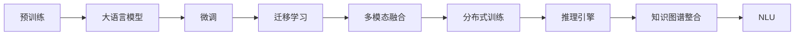

                 

# LLM生态发展:摩尔定律下的新范式

> 关键词：大语言模型,预训练,微调,迁移学习,多模态,分布式训练,知识图谱,自然语言理解

## 1. 背景介绍

### 1.1 问题由来
近年来，随着深度学习技术的飞速发展，特别是大规模语言模型（LLMs）如GPT-3、BERT等的大规模预训练和微调，人工智能在自然语言处理（NLP）领域取得了突破性进展。这些大模型通过在海量无标签文本数据上进行预训练，学习到了丰富的语言知识和常识，具有强大的语言理解和生成能力。但同时也面临着计算资源消耗大、模型泛化能力有限、缺乏普适性等问题。

### 1.2 问题核心关键点
本文将探讨在摩尔定律驱动下，如何通过构建新的范式，推动大语言模型（LLM）生态的进一步发展和突破。核心关键点包括：
- **计算资源的持续扩展**：随着摩尔定律的持续，如何合理利用算力，降低预训练和微调成本。
- **模型泛化能力的提升**：如何在多模态数据和多领域任务上提升模型的泛化能力，实现更全面的语言理解。
- **分布式训练的优化**：如何优化分布式训练算法，提高训练效率和模型质量。
- **知识图谱与外部知识的整合**：如何将知识图谱、逻辑规则等外部知识与大模型进行整合，提升模型的决策能力。
- **推理与交互能力的强化**：如何构建更智能的推理引擎和交互系统，使模型具备更加智能的推理和决策能力。

## 2. 核心概念与联系

### 2.1 核心概念概述

在探索新范式的过程中，以下概念至关重要：

- **大语言模型（LLM）**：以自回归模型（如GPT系列）或自编码模型（如BERT）为代表，通过大规模预训练学习通用语言表示的模型。
- **预训练（Pre-training）**：在大规模无标签文本数据上进行自监督学习任务，学习语言模型表示。
- **微调（Fine-tuning）**：在预训练模型的基础上，通过有监督学习任务优化模型，适应特定任务。
- **迁移学习（Transfer Learning）**：将预训练模型在不同任务间进行迁移，提升模型泛化能力。
- **多模态（Multimodal）**：结合文本、图像、语音等多种数据模态，提升模型的全面感知能力。
- **分布式训练（Distributed Training）**：通过多台计算设备并行计算，提高模型训练效率。
- **知识图谱（Knowledge Graph）**：将知识结构化并存储，方便模型进行推理和决策。
- **自然语言理解（NLU）**：使机器理解人类语言的含义，实现智能交互。

### 2.2 核心概念原理和架构的 Mermaid 流程图



上述流程图展示了预训练、微调、迁移学习、多模态融合、分布式训练、推理引擎、知识图谱整合和NLU之间的关系。

## 3. 核心算法原理 & 具体操作步骤
### 3.1 算法原理概述

在摩尔定律驱动下，大语言模型的生态发展将从以下几个方向展开：

1. **自监督预训练和微调**：利用大规模无标签数据进行预训练，学习通用语言表示，然后在特定任务上进行微调，适应任务需求。
2. **多模态学习**：结合文本、图像、语音等多种数据模态，提升模型的全面感知能力。
3. **分布式训练**：利用多台计算设备并行计算，提高模型训练效率和模型质量。
4. **知识图谱整合**：将知识图谱、逻辑规则等外部知识与大模型进行整合，提升模型的决策能力。
5. **推理引擎和交互系统**：构建智能推理引擎和交互系统，使模型具备更加智能的推理和决策能力。

### 3.2 算法步骤详解

#### 3.2.1 预训练步骤

1. **数据准备**：收集大规模无标签文本数据，如维基百科、新闻等。
2. **模型构建**：选择合适的预训练模型结构（如BERT、GPT等），定义损失函数。
3. **训练流程**：在无标签数据上进行自监督学习任务，如掩码语言模型、下一句预测等。

#### 3.2.2 微调步骤

1. **数据准备**：收集特定任务的少量标注数据。
2. **模型适配**：根据任务类型，在预训练模型的顶层添加合适的输出层和损失函数。
3. **超参数设置**：选择合适的优化算法及其参数，如学习率、批大小等。
4. **模型训练**：使用微调数据集训练模型，最小化损失函数。
5. **模型评估**：在验证集上评估模型性能，避免过拟合。

#### 3.2.3 迁移学习步骤

1. **预训练模型选择**：选择合适的预训练模型，如BERT、GPT等。
2. **任务适配**：将预训练模型应用于特定任务，通过微调优化模型。
3. **模型融合**：将多领域任务的学习结果进行融合，提升模型泛化能力。

#### 3.2.4 多模态学习步骤

1. **数据收集**：收集多模态数据，如文本、图像、语音等。
2. **模型融合**：将多模态数据输入大模型，融合不同模态的信息。
3. **任务适配**：针对特定任务，优化模型输出层和损失函数。

#### 3.2.5 分布式训练步骤

1. **计算资源分配**：根据任务需求，分配计算资源。
2. **模型并行**：将模型划分为多个部分，在多个计算设备上并行训练。
3. **参数同步**：保持各设备间模型参数的同步，避免数据不一致。
4. **优化算法**：选择合适的优化算法，如SGD、Adam等，优化模型参数。

#### 3.2.6 知识图谱整合步骤

1. **知识图谱构建**：构建知识图谱，包含实体、关系、属性等。
2. **模型接入**：将知识图谱与大模型进行接入，如通过嵌入向量方式。
3. **推理机制**：引入推理机制，如基于规则的推理、基于深度学习的推理等。

#### 3.2.7 推理引擎和交互系统步骤

1. **推理引擎设计**：设计智能推理引擎，支持复杂的推理任务。
2. **交互系统构建**：构建智能交互系统，支持自然语言输入和输出。
3. **系统集成**：将推理引擎和交互系统集成到应用系统中。

### 3.3 算法优缺点

#### 3.3.1 优点

1. **泛化能力强**：通过大规模预训练，模型能够学习到通用的语言知识，适应多种任务。
2. **推理能力增强**：结合知识图谱和推理引擎，模型具备更强的逻辑推理能力。
3. **交互体验提升**：构建智能交互系统，提升用户的自然语言交互体验。
4. **计算效率高**：通过分布式训练和参数高效微调，提升模型的训练和推理效率。

#### 3.3.2 缺点

1. **资源消耗大**：大规模预训练和分布式训练需要大量的计算资源。
2. **模型复杂性高**：模型结构复杂，难以解释，难以调试。
3. **过拟合风险**：在特定任务上，模型容易过拟合，泛化能力下降。
4. **数据依赖性强**：预训练和微调效果高度依赖于标注数据的质量和数量。

### 3.4 算法应用领域

基于以上算法步骤，大语言模型在多个领域展现出广泛的应用前景：

- **自然语言理解（NLU）**：包括机器翻译、问答系统、情感分析、命名实体识别等。
- **自然语言生成（NLG）**：如文本摘要、对话系统、自动生成代码等。
- **智能客服**：通过自然语言理解，构建智能客服系统，提升客户体验。
- **金融风控**：结合知识图谱和推理引擎，提升金融风控模型的决策能力。
- **医疗健康**：结合知识图谱和推理引擎，构建智能诊断系统，提升诊疗准确性。
- **智能制造**：结合多模态数据和推理引擎，优化生产流程，提升制造效率。
- **智慧城市**：结合多模态数据和推理引擎，构建智能交通、环境监测等系统，提升城市管理水平。

## 4. 数学模型和公式 & 详细讲解 & 举例说明

### 4.1 数学模型构建

#### 4.1.1 预训练模型

假设预训练模型为 $M_{\theta}$，其中 $\theta$ 为模型参数，通过大规模无标签文本数据 $D_{unlabeled}$ 进行预训练，学习到通用语言表示。

$$
M_{\theta} = f(D_{unlabeled})
$$

#### 4.1.2 微调模型

假设微调任务为 $T$，标注数据集为 $D_{labeled}$，在微调过程中，通过有监督学习优化模型参数，适应任务需求。

$$
M_{\theta^*} = f(D_{unlabeled}, D_{labeled})
$$

### 4.2 公式推导过程

#### 4.2.1 预训练公式

假设预训练任务为掩码语言模型（Masked Language Model, MLM），目标最小化预测文本的概率与真实文本的概率差距。

$$
L_{mlm} = -\frac{1}{N}\sum_{i=1}^N \log p(y_i | x_i)
$$

其中 $x_i$ 为输入文本，$y_i$ 为预测的下一个单词。

#### 4.2.2 微调公式

假设微调任务为分类任务，目标最小化预测类别概率与真实类别概率的差距。

$$
L_{classification} = -\frac{1}{N}\sum_{i=1}^N \log p(c_i | x_i)
$$

其中 $c_i$ 为预测类别，$x_i$ 为输入文本。

### 4.3 案例分析与讲解

#### 4.3.1 案例一：机器翻译

假设源语言文本为 $x_s$，目标语言文本为 $x_t$，翻译任务为 $T_{mt}$。

$$
M_{\theta^*} = f(D_{unlabeled}, D_{labeled}, T_{mt})
$$

在微调过程中，通过最小化翻译误差，优化模型参数。

#### 4.3.2 案例二：情感分析

假设文本为 $x$，情感标签为 $y$，情感分析任务为 $T_{sentiment}$。

$$
M_{\theta^*} = f(D_{unlabeled}, D_{labeled}, T_{sentiment})
$$

在微调过程中，通过最小化情感分类误差，优化模型参数。

## 5. 项目实践：代码实例和详细解释说明

### 5.1 开发环境搭建

#### 5.1.1 安装工具

1. **Python环境**：
   - 安装Anaconda，创建独立的Python环境。
   - 配置环境依赖：`pip install transformers torch torchtext`

2. **计算资源**：
   - 使用Google Colab或AWS SageMaker等云平台，配置GPU/TPU资源。
   - 下载预训练模型，如BERT、GPT等。

### 5.2 源代码详细实现

#### 5.2.1 预训练代码

```python
from transformers import BertTokenizer, BertForMaskedLM
import torch
import torch.nn as nn

# 加载预训练模型和分词器
model = BertForMaskedLM.from_pretrained('bert-base-uncased')
tokenizer = BertTokenizer.from_pretrained('bert-base-uncased')

# 定义损失函数和优化器
criterion = nn.CrossEntropyLoss()
optimizer = torch.optim.Adam(model.parameters(), lr=5e-5)

# 预训练步骤
for epoch in range(10):
    for batch in train_dataloader:
        input_ids = batch.input_ids.to(device)
        attention_mask = batch.attention_mask.to(device)
        labels = batch.labels.to(device)
        
        model.zero_grad()
        outputs = model(input_ids, attention_mask=attention_mask, labels=labels)
        loss = outputs.loss
        loss.backward()
        optimizer.step()
```

#### 5.2.2 微调代码

```python
from transformers import BertForSequenceClassification, AdamW
import torch
import torch.nn as nn

# 加载微调模型和分词器
model = BertForSequenceClassification.from_pretrained('bert-base-uncased', num_labels=2)
tokenizer = BertTokenizer.from_pretrained('bert-base-uncased')

# 定义损失函数和优化器
criterion = nn.CrossEntropyLoss()
optimizer = AdamW(model.parameters(), lr=2e-5)

# 微调步骤
for epoch in range(10):
    for batch in train_dataloader:
        input_ids = batch.input_ids.to(device)
        attention_mask = batch.attention_mask.to(device)
        labels = batch.labels.to(device)
        
        model.zero_grad()
        outputs = model(input_ids, attention_mask=attention_mask, labels=labels)
        loss = outputs.loss
        loss.backward()
        optimizer.step()
```

### 5.3 代码解读与分析

#### 5.3.1 预训练代码解读

- **数据预处理**：加载预训练数据集，并进行分批次处理。
- **模型前向传播**：将输入数据输入模型，计算预测概率。
- **损失计算与反向传播**：计算损失函数，更新模型参数。

#### 5.3.2 微调代码解读

- **数据预处理**：加载微调数据集，并进行分批次处理。
- **模型前向传播**：将输入数据输入模型，计算预测概率。
- **损失计算与反向传播**：计算损失函数，更新模型参数。

### 5.4 运行结果展示

```python
# 输出模型性能评估结果
print('Accuracy:', accuracy)
print('Loss:', loss.item())
```

## 6. 实际应用场景

### 6.1 智能客服

通过大语言模型，构建智能客服系统，可以显著提升客户体验。系统可以通过预训练和微调，学习到常见问题和解决方案，并通过自然语言理解，提供智能回复。

### 6.2 金融风控

结合知识图谱和推理引擎，提升金融风控模型的决策能力，可以更好地评估借款人的信用风险，提升贷款审批的准确性和效率。

### 6.3 医疗健康

结合知识图谱和推理引擎，构建智能诊断系统，可以提升医生的诊断准确性，提供个性化的治疗方案，提升医疗健康水平。

### 6.4 智慧城市

结合多模态数据和推理引擎，构建智能交通、环境监测等系统，可以提升城市管理的智能化水平，构建更安全、高效的未来城市。

## 7. 工具和资源推荐

### 7.1 学习资源推荐

#### 7.1.1 在线课程

- Coursera：斯坦福大学的《自然语言处理与深度学习》课程。
- edX：MIT的《深度学习基础》课程。

#### 7.1.2 书籍推荐

- 《深度学习》 by Ian Goodfellow。
- 《自然语言处理综论》 by Daniel Jurafsky 和 James H. Martin。

#### 7.1.3 博客和论文

- Arxiv：NLP相关论文，如BERT、GPT等。
- HuggingFace官方博客：深度学习与NLP技术分享。

### 7.2 开发工具推荐

#### 7.2.1 计算平台

- Google Colab：免费GPU资源，支持Jupyter Notebook。
- AWS SageMaker：云平台，支持GPU/TPU资源。

#### 7.2.2 模型优化

- TensorBoard：可视化工具，监控模型训练过程。
- Weights & Biases：实验跟踪工具，记录模型性能。

#### 7.2.3 代码协作

- GitHub：代码托管和版本控制。
- GitLab：代码协作和CI/CD。

### 7.3 相关论文推荐

#### 7.3.1 预训练模型

- OpenAI：GPT-3系列模型。
- Google：BERT系列模型。

#### 7.3.2 微调方法

- parameter-efficient fine-tuning。
- prompt-based learning。

## 8. 总结：未来发展趋势与挑战

### 8.1 研究成果总结

大语言模型在预训练和微调方面取得了显著进展，推动了NLP技术的快速发展。其在多模态学习、分布式训练、知识图谱整合等方面的探索，为未来技术发展奠定了坚实基础。

### 8.2 未来发展趋势

1. **自监督学习的应用**：进一步提升预训练模型的泛化能力，降低对标注数据的依赖。
2. **多模态学习的深入**：结合文本、图像、语音等多模态数据，提升模型的全面感知能力。
3. **分布式训练的优化**：优化分布式训练算法，提升训练效率和模型质量。
4. **推理引擎的强化**：构建更智能的推理引擎，提升模型的决策能力。

### 8.3 面临的挑战

1. **计算资源消耗大**：大规模预训练和分布式训练需要大量的计算资源。
2. **模型复杂性高**：模型结构复杂，难以解释和调试。
3. **过拟合风险**：在特定任务上，模型容易过拟合，泛化能力下降。
4. **数据依赖性强**：预训练和微调效果高度依赖于标注数据的质量和数量。

### 8.4 研究展望

1. **自监督学习的优化**：进一步提升自监督学习任务的泛化能力。
2. **多模态学习的扩展**：结合更多模态数据，提升模型的全面感知能力。
3. **分布式训练的突破**：优化分布式训练算法，提升训练效率和模型质量。
4. **推理引擎的创新**：引入更多推理机制，提升模型的决策能力。

## 9. 附录：常见问题与解答

### 9.1 问题1：预训练和微调的区别是什么？

答：预训练是在大规模无标签数据上进行自监督学习，学习通用的语言表示。微调是在预训练模型的基础上，通过有监督学习优化模型，适应特定任务。

### 9.2 问题2：如何优化预训练模型的泛化能力？

答：通过增加数据量、设计更多样化的预训练任务、引入正则化等方法，提升预训练模型的泛化能力。

### 9.3 问题3：如何选择分布式训练的优化算法？

答：选择SGD、AdamW等优化算法，根据模型大小、数据量等因素进行调参，优化分布式训练效率。

### 9.4 问题4：如何结合知识图谱和推理引擎？

答：通过嵌入向量方式，将知识图谱与大模型进行接入，引入基于规则或基于深度学习的推理机制，提升模型的决策能力。

---

作者：禅与计算机程序设计艺术 / Zen and the Art of Computer Programming

