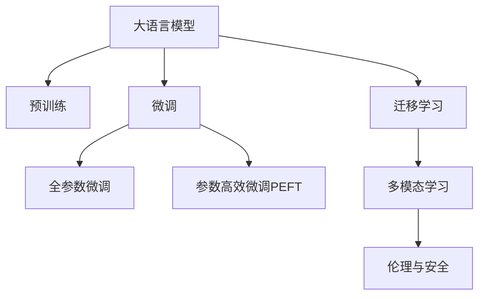

                 

# LLM生态系统：绘制AI产业的未来蓝图

> 关键词：人工智能(AI),语言模型(LM),自然语言处理(NLP),大模型(Large Models),生态系统,技术创新,产业应用

## 1. 背景介绍

### 1.1 问题由来

在人工智能(AI)的快速发展中，语言模型（Language Models, LM），特别是大语言模型（Large Language Models, LLMs），扮演了核心角色。这些模型通过大量文本数据的预训练，能够生成自然流畅的文本，理解复杂的语义结构，并对各种自然语言处理任务（Natural Language Processing, NLP）展现出卓越的性能。

然而，目前AI产业正面临新的挑战。随着数据量的爆炸性增长、计算资源的不断提升，以及算法模型的持续创新，大语言模型正在成为推动AI产业进一步发展的关键。但与此同时，技术的不均衡、算法的伦理问题、数据隐私与安全等问题也随之而来。

为应对这些挑战，构建一个可持续、可扩展的LLM生态系统，成为当前AI产业的核心议题。本文将从核心概念、核心算法、应用场景及未来发展趋势等角度，全面剖析LLM生态系统的构建与优化策略。

### 1.2 问题核心关键点

构建LLM生态系统的核心在于如何将预训练的大模型与特定任务进行高效结合，同时确保系统在性能、安全性、可解释性等方面的均衡。具体关键点包括：

- **模型泛化能力**：如何通过模型微调，使其能够适应各类下游任务，提高模型泛化性能。
- **数据处理与管理**：如何高效处理海量数据，确保数据质量和安全性，同时实现数据隐私保护。
- **算法优化**：如何通过算法创新，提升模型训练与推理的效率，降低资源消耗。
- **模型部署与集成**：如何构建灵活的模型部署与集成框架，支持多模态数据的处理与融合。
- **伦理与安全**：如何在算法设计中融入伦理考量，避免数据偏见与滥用，确保系统的公平与安全。

本文章将详细探讨这些关键点，并给出相应的解决方案。

## 2. 核心概念与联系

### 2.1 核心概念概述

为更好地理解LLM生态系统，我们先要清楚几个关键概念：

- **大语言模型（LLMs）**：如GPT、BERT等，通过大规模无标签文本数据预训练获得通用语言表示，具备强大的文本生成和语义理解能力。

- **预训练（Pre-training）**：在大规模无标签数据上训练模型，学习到语言的基本规律和语义信息。

- **微调（Fine-tuning）**：在预训练模型的基础上，针对特定任务进行进一步训练，以提升模型在该任务上的性能。

- **迁移学习（Transfer Learning）**：将一个领域的知识迁移到另一个领域，通过微调在大规模预训练模型基础上提升特定任务的表现。

- **参数高效微调（PEFT）**：只更新预训练模型的少量参数，以降低微调成本和避免过拟合。

- **多模态学习（Multimodal Learning）**：结合文本、图像、语音等多种模态数据，提升模型的综合理解和生成能力。

- **伦理与安全（Ethics and Security）**：确保模型在训练与部署中遵守伦理规范，避免数据偏见和滥用，保障系统安全。

这些概念之间的联系可以通过以下Mermaid流程图来展示：



这个流程图展示了LLM生态系统中各个概念之间的逻辑关系：

1. 大语言模型通过预训练获得基础能力。
2. 微调提升模型在特定任务上的表现。
3. 迁移学习实现跨领域知识迁移。
4. 多模态学习提升模型的理解深度。
5. 伦理与安全保障系统公平和安全。

## 3. 核心算法原理 & 具体操作步骤

### 3.1 算法原理概述

基于预训练-微调的大语言模型构建流程，主要包括以下几个步骤：

1. **数据收集与预处理**：收集大规模无标签文本数据，进行预处理与清洗。
2. **预训练模型构建**：使用Transformer等架构，在大规模数据上训练预训练模型。
3. **任务适配层设计**：根据特定任务需求，设计适配的输出层与损失函数。
4. **微调模型训练**：使用下游任务的有标签数据，通过有监督学习训练微调模型。
5. **模型评估与部署**：在验证集和测试集上评估微调模型，部署到实际应用中。

### 3.2 算法步骤详解

以下是具体的微调算法步骤：

1. **数据准备**：
   - 收集大规模无标签数据，进行预处理与清洗。
   - 将数据划分为训练集、验证集和测试集。

2. **模型选择**：
   - 选择适合的预训练模型，如BERT、GPT等。
   - 根据任务需求，确定微调层数和参数。

3. **任务适配层设计**：
   - 根据任务类型设计输出层，如分类任务的softmax层。
   - 设计损失函数，如分类任务中的交叉熵损失。

4. **超参数设置**：
   - 设置学习率、批大小、迭代轮数等。
   - 选择合适的优化器，如AdamW。

5. **模型训练**：
   - 使用有标签数据，进行微调模型训练。
   - 在每个epoch结束时，评估模型性能。

6. **模型评估**：
   - 在验证集和测试集上评估模型性能。
   - 分析模型在特定任务上的表现。

7. **模型部署**：
   - 将训练好的模型部署到实际应用中。
   - 提供API接口，方便应用调用。

### 3.3 算法优缺点

基于预训练-微调的大语言模型构建方法，具有以下优点：

- **简单高效**：只需少量标注数据，即可快速提升模型性能。
- **通用适用**：适用于多种NLP任务，模型适应性强。
- **参数高效**：通过PEFT，仅更新少量参数，降低微调成本。

同时，也存在一些缺点：

- **数据依赖性强**：微调效果受标注数据质量与数量影响较大。
- **过拟合风险**：模型容易过拟合标注数据，泛化性能受限。
- **资源消耗大**：大规模预训练模型和微调过程对计算资源和存储资源要求高。

### 3.4 算法应用领域

基于预训练-微调的大语言模型，已经广泛应用于多个领域：

- **智能客服**：通过微调实现客户问题智能解答。
- **金融舆情分析**：实时监测金融市场舆情，识别舆情变化趋势。
- **个性化推荐系统**：根据用户行为生成个性化推荐内容。
- **医疗知识图谱**：构建医疗领域知识图谱，辅助诊断和治疗。

这些应用展示了LLM在实际场景中的巨大潜力，推动了AI产业的快速发展。

## 4. 数学模型和公式 & 详细讲解 & 举例说明

### 4.1 数学模型构建

在大语言模型微调中，我们通常使用预训练模型作为初始化参数，在特定任务上有监督地进行微调。假设预训练模型为 $M_{\theta}$，微调任务的训练数据集为 $D=\{(x_i,y_i)\}_{i=1}^N$，其中 $x_i$ 为输入文本，$y_i$ 为标签。微调的目标是最小化经验风险：

$$
\mathcal{L}(\theta) = \frac{1}{N} \sum_{i=1}^N \ell(M_{\theta}(x_i),y_i)
$$

其中 $\ell$ 为特定任务下的损失函数，如分类任务的交叉熵损失。

### 4.2 公式推导过程

以分类任务为例，假设模型 $M_{\theta}$ 在输入 $x$ 上的输出为 $\hat{y}=M_{\theta}(x)$，真实标签 $y \in \{0,1\}$。二分类交叉熵损失函数定义为：

$$
\ell(M_{\theta}(x),y) = -[y\log \hat{y} + (1-y)\log (1-\hat{y})]
$$

将其代入经验风险公式，得：

$$
\mathcal{L}(\theta) = -\frac{1}{N}\sum_{i=1}^N [y_i\log M_{\theta}(x_i)+(1-y_i)\log(1-M_{\theta}(x_i))]
$$

通过反向传播计算损失函数对参数 $\theta$ 的梯度，从而更新模型参数，具体公式为：

$$
\theta \leftarrow \theta - \eta \nabla_{\theta}\mathcal{L}(\theta) - \eta\lambda\theta
$$

其中 $\eta$ 为学习率，$\lambda$ 为正则化系数。

### 4.3 案例分析与讲解

假设我们有一个文本分类任务，数据集为 $\{(x_i,y_i)\}_{i=1}^N$，其中 $x_i$ 为文本，$y_i$ 为分类标签。我们的目标是用BERT模型进行微调，使其在文本分类任务上取得最优性能。

**Step 1: 数据准备**
- 收集大规模无标签数据进行预训练。
- 将数据划分为训练集、验证集和测试集。

**Step 2: 模型选择**
- 选择BERT作为预训练模型。
- 设计输出层为线性层和softmax层，损失函数为交叉熵损失。

**Step 3: 超参数设置**
- 学习率为2e-5，批大小为16。
- 正则化系数为0.1。

**Step 4: 模型训练**
- 使用训练集进行微调模型训练。
- 每个epoch结束时，在验证集上评估模型性能。

**Step 5: 模型评估**
- 在测试集上评估微调模型的性能，如准确率、精确率等。

## 5. 项目实践：代码实例和详细解释说明

### 5.1 开发环境搭建

**Step 1: 环境安装**
- 安装Anaconda和Python。
- 创建虚拟环境，激活并配置依赖库。

**Step 2: 数据准备**
- 收集并预处理数据集。
- 使用PyTorch进行数据加载与处理。

**Step 3: 模型选择**
- 选择BERT作为预训练模型。
- 设计输出层与损失函数。

**Step 4: 模型训练**
- 使用PyTorch进行模型训练。
- 设置学习率、批大小等参数。

**Step 5: 模型评估**
- 使用PyTorch评估模型性能。

### 5.2 源代码详细实现

```python
import torch
import torch.nn as nn
import torch.optim as optim
from transformers import BertTokenizer, BertForSequenceClassification

# 定义模型
tokenizer = BertTokenizer.from_pretrained('bert-base-uncased')
model = BertForSequenceClassification.from_pretrained('bert-base-uncased', num_labels=2)

# 设置超参数
device = torch.device('cuda') if torch.cuda.is_available() else torch.device('cpu')
epochs = 5
learning_rate = 2e-5
batch_size = 16

# 定义损失函数
criterion = nn.CrossEntropyLoss()

# 定义优化器
optimizer = optim.AdamW(model.parameters(), lr=learning_rate)

# 定义数据集
train_dataset = MyDataset(train_data, tokenizer)
dev_dataset = MyDataset(dev_data, tokenizer)
test_dataset = MyDataset(test_data, tokenizer)

# 定义数据加载器
train_loader = DataLoader(train_dataset, batch_size=batch_size, shuffle=True)
dev_loader = DataLoader(dev_dataset, batch_size=batch_size, shuffle=False)
test_loader = DataLoader(test_dataset, batch_size=batch_size, shuffle=False)

# 训练模型
model.to(device)
for epoch in range(epochs):
    train_loss = train(model, train_loader, optimizer, criterion, device)
    dev_loss = evaluate(model, dev_loader, criterion, device)
    if dev_loss < best_dev_loss:
        best_dev_loss = dev_loss
        save_model(model, optimizer, best_dev_loss)

# 评估模型
test_loss = evaluate(model, test_loader, criterion, device)
print(f'Test Loss: {test_loss:.4f}')
```

### 5.3 代码解读与分析

**Step 1: 环境安装**
- 确保环境配置正确，依赖库安装完整。

**Step 2: 数据准备**
- 数据集需要经过预处理与清洗，才能用于模型训练。

**Step 3: 模型选择**
- 选择预训练模型，并进行适配层设计。

**Step 4: 模型训练**
- 使用优化器与损失函数进行模型训练。
- 注意设置学习率、批大小等参数。

**Step 5: 模型评估**
- 在测试集上评估模型性能，输出测试损失。

## 6. 实际应用场景

### 6.1 智能客服系统

智能客服系统通过微调大语言模型，实现了7x24小时不间断服务，提升了客户咨询体验。收集企业内部历史客服数据，构建监督数据集，对预训练模型进行微调。微调后的模型能够自动理解用户意图，匹配最佳答复，生成自然流畅的回答。

### 6.2 金融舆情监测

金融舆情监测系统通过微调大语言模型，实时监测金融市场舆情，预测舆情变化趋势。收集金融领域相关数据，进行预训练与微调，使模型能够自动判断文本属于何种主题，情感倾向是正面、中性还是负面。

### 6.3 个性化推荐系统

个性化推荐系统通过微调大语言模型，根据用户行为生成个性化推荐内容。收集用户浏览、点击、评论、分享等行为数据，预训练与微调，使模型能够从文本内容中准确把握用户兴趣点，生成个性化推荐列表。

### 6.4 未来应用展望

未来，大语言模型微调技术将在更多领域得到应用，为传统行业带来变革性影响：

- **智慧医疗**：构建医疗领域知识图谱，辅助诊断和治疗。
- **智能教育**：因材施教，促进教育公平，提高教学质量。
- **智慧城市治理**：实时监测城市事件，优化应急响应。

## 7. 工具和资源推荐

### 7.1 学习资源推荐

**Step 1: 在线课程**
- CS224N《深度学习自然语言处理》课程，由斯坦福大学开设。

**Step 2: 书籍推荐**
- 《Natural Language Processing with Transformers》，Transformer库的作者所著。

**Step 3: 官方文档**
- Transformers库的官方文档，提供了预训练模型和微调样例代码。

**Step 4: 开源项目**
- CLUE开源项目，涵盖多种中文NLP数据集。

### 7.2 开发工具推荐

**Step 1: Python环境**
- 使用Anaconda创建虚拟环境。

**Step 2: 深度学习框架**
- PyTorch，支持动态计算图，适合快速迭代研究。

**Step 3: 模型库**
- Transformers库，提供了丰富的预训练模型。

**Step 4: 实验跟踪工具**
- Weights & Biases，记录和可视化模型训练过程。

### 7.3 相关论文推荐

**Step 1: 预训练模型**
- Attention is All You Need。

**Step 2: 微调算法**
- Parameter-Efficient Transfer Learning for NLP。

**Step 3: 多模态学习**
- Multimodal Feature Fusion for Language Modeling。

**Step 4: 伦理与安全**
- Fairness in AI: Scalable and Generalizable Counterfactual Mitigation。

## 8. 总结：未来发展趋势与挑战

### 8.1 研究成果总结

大语言模型微调技术在NLP领域已经取得了显著成果，推动了AI产业的快速发展。未来，该技术将继续拓展其应用边界，提高模型的泛化能力和效率。

### 8.2 未来发展趋势

**Step 1: 模型规模增大**
- 随着算力成本的下降和数据规模的扩张，预训练语言模型的参数量将持续增长。

**Step 2: 微调方法多样化**
- 未来将出现更多参数高效微调方法，如Prefix-Tuning、LoRA等。

**Step 3: 持续学习成为常态**
- 微调模型需要持续学习新知识，以适应数据分布的变化。

**Step 4: 标注样本需求降低**
- 受启发于Prompt Learning的思路，未来的微调方法将更好地利用大模型的语言理解能力。

**Step 5: 多模态学习崛起**
- 结合视觉、语音等多模态数据，提升语言模型的理解深度。

**Step 6: 伦理与安全**
- 在算法设计中融入伦理考量，确保系统公平和安全。

### 8.3 面临的挑战

**Step 1: 标注成本瓶颈**
- 对于长尾应用场景，难以获得充足的高质量标注数据。

**Step 2: 模型鲁棒性不足**
- 模型面对域外数据时，泛化性能有限。

**Step 3: 推理效率低**
- 大规模语言模型在推理速度和内存占用上存在瓶颈。

**Step 4: 可解释性不足**
- 微调模型的决策过程缺乏可解释性。

**Step 5: 安全性有待保障**
- 模型可能学习到有偏见、有害的信息，造成安全隐患。

### 8.4 研究展望

未来，大语言模型微调技术需要在以下方面进行深入研究：

**Step 1: 探索无监督和半监督微调方法**
- 摆脱对大规模标注数据的依赖。

**Step 2: 研究参数高效和计算高效的微调范式**
- 开发更加参数高效的微调方法。

**Step 3: 融合因果和对比学习范式**
- 增强微调模型建立稳定因果关系的能力。

**Step 4: 引入更多先验知识**
- 将符号化的先验知识与神经网络模型进行融合。

**Step 5: 结合因果分析和博弈论工具**
- 探索人机交互过程，提高系统稳定性。

**Step 6: 纳入伦理道德约束**
- 确保模型在训练与部署中遵守伦理规范。

## 9. 附录：常见问题与解答

**Q1: 大语言模型微调是否适用于所有NLP任务？**
- 大语言模型微调在大多数NLP任务上都能取得不错的效果，但对于特定领域任务，可能需要进一步预训练。

**Q2: 微调过程中如何选择合适的学习率？**
- 学习率一般要比预训练时小1-2个数量级，建议使用warmup策略。

**Q3: 采用大模型微调时会面临哪些资源瓶颈？**
- 预训练语言模型对计算资源和存储资源要求高，需要优化资源消耗。

**Q4: 如何缓解微调过程中的过拟合问题？**
- 数据增强、正则化、对抗训练等方法可以有效缓解过拟合。

**Q5: 微调模型在落地部署时需要注意哪些问题？**
- 模型裁剪、量化加速、服务化封装等措施，确保模型性能与稳定性。

---

作者：禅与计算机程序设计艺术 / Zen and the Art of Computer Programming

