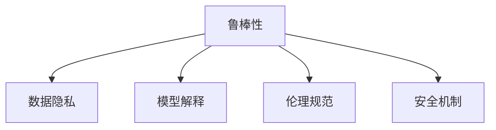

                 

# LLM的安全机制：构建可信赖的AI系统

> 关键词：LLM, 安全机制, 可信AI, 鲁棒性, 对抗攻击, 数据隐私, 模型解释, 伦理规范

## 1. 背景介绍

### 1.1 问题由来
近年来，随着人工智能(AI)技术的飞速发展，特别是大规模语言模型(LLM)在自然语言处理(NLP)领域的突破性应用，其广泛的影响力和潜在的风险也日益显现。LLM具有强大的文本生成和理解能力，但同时也带来了诸如数据隐私泄露、误导性输出、偏见和歧视等问题。在医疗、金融、法律等高风险领域，这些问题可能导致严重的后果，甚至威胁国家安全和社会稳定。因此，构建可信赖的AI系统，保证LLM的安全性、可靠性、可解释性和合规性，成为当前AI研究的热点问题。

### 1.2 问题核心关键点
构建可信赖的AI系统需要解决以下几个核心问题：
1. **鲁棒性**：LLM在面对对抗攻击、噪声数据等情况时，是否仍能保持稳定输出。
2. **数据隐私**：在处理敏感数据时，如何保护数据隐私不被泄露。
3. **模型解释**：如何解释LLM的决策过程，使其输出具有可解释性。
4. **伦理规范**：如何构建符合伦理规范的AI系统，避免偏见和歧视。
5. **安全机制**：如何通过技术手段构建安全机制，预防和应对潜在的安全威胁。

这些关键点决定了LLM的安全机制设计是否合理、可行，以及其在实际应用中的表现。

## 2. 核心概念与联系

### 2.1 核心概念概述

为了更好地理解如何构建可信赖的AI系统，本节将介绍几个关键概念：

- **鲁棒性(Robustness)**：指模型在面对对抗攻击、噪声数据等情况时，仍能保持稳定输出的能力。鲁棒性是构建可信赖AI系统的基石，也是本节讨论的重点。
- **数据隐私(Data Privacy)**：指在处理敏感数据时，如何保护数据不被泄露，同时保证模型在数据隐私保护的前提下仍能正常工作。
- **模型解释(Model Explanation)**：指如何解释模型的决策过程，使其输出具有可解释性，便于理解和审查。
- **伦理规范(Ethical Norms)**：指如何构建符合伦理规范的AI系统，避免偏见和歧视，确保模型的公平性和公正性。
- **安全机制(Security Mechanisms)**：指通过技术手段构建的安全机制，预防和应对潜在的安全威胁，保障系统的安全性。

这些概念之间的逻辑关系可以通过以下Mermaid流程图来展示：



这个流程图展示了大语言模型的核心概念及其之间的关系：

1. 鲁棒性是构建可信赖AI系统的核心。
2. 数据隐私和伦理规范是鲁棒性的保障。
3. 模型解释和安全机制是鲁棒性的辅助。

这些概念共同构成了LLM的安全机制设计框架，使其能够应对各种潜在的安全威胁，构建可靠、公平、可解释的AI系统。

## 3. 核心算法原理 & 具体操作步骤

### 3.1 算法原理概述

构建可信赖AI系统的核心算法原理包括以下几个方面：

1. **鲁棒性增强**：通过对抗训练、正则化等技术，增强模型的鲁棒性，使其在面对对抗攻击、噪声数据等情况时仍能保持稳定输出。
2. **数据隐私保护**：通过差分隐私、联邦学习等技术，保护数据隐私不被泄露。
3. **模型解释生成**：通过可解释性技术，如Attention权重、决策树、特征重要性等，生成模型的解释，使其输出具有可解释性。
4. **伦理规范约束**：通过公平性约束、偏见检测等技术，构建符合伦理规范的AI系统，避免偏见和歧视。
5. **安全机制设计**：通过加密、访问控制等技术，设计安全机制，预防和应对潜在的安全威胁，保障系统的安全性。

### 3.2 算法步骤详解

#### 3.2.1 鲁棒性增强

鲁棒性增强的具体步骤包括：

1. **数据预处理**：对训练数据进行预处理，如数据清洗、去噪、标准化等，减少噪声数据的干扰。
2. **对抗训练**：在训练过程中，加入对抗样本，使模型学习如何抵御对抗攻击。
3. **正则化**：使用L2正则、Dropout等正则化技术，防止模型过拟合，提高鲁棒性。
4. **模型裁剪**：通过剪枝等技术，减少模型的复杂度，提高鲁棒性。
5. **测试评估**：在测试数据集上评估模型的鲁棒性，使用对抗攻击等方法检验模型的鲁棒性。

#### 3.2.2 数据隐私保护

数据隐私保护的具体步骤包括：

1. **差分隐私**：在训练和推理过程中，使用差分隐私技术，保护用户数据不被泄露。
2. **联邦学习**：通过分布式训练技术，在不共享用户数据的前提下，进行模型训练和更新。
3. **加密技术**：对敏感数据进行加密处理，防止数据泄露。
4. **访问控制**：限制模型对敏感数据的访问权限，防止数据滥用。
5. **隐私保护模型**：设计专门用于隐私保护的模型，如 Federated BERT。

#### 3.2.3 模型解释生成

模型解释生成的具体步骤包括：

1. **Attention权重可视化**：通过可视化Attention权重，解释模型在处理输入时的关注点。
2. **决策树生成**：通过决策树模型，解释模型在不同输入下的决策过程。
3. **特征重要性分析**：通过特征重要性分析，解释模型在输出中的关键特征。
4. **可解释性提示学习**：通过精心设计的提示模板，引导模型输出具有可解释性的结果。
5. **交互式解释工具**：开发交互式解释工具，帮助用户理解和调试模型。

#### 3.2.4 伦理规范约束

伦理规范约束的具体步骤包括：

1. **公平性约束**：使用公平性约束技术，如公平性损失函数、均衡分类器等，避免模型对特定群体的偏见。
2. **偏见检测**：通过偏见检测技术，定期评估模型的公平性，及时发现和纠正偏见。
3. **透明度要求**：要求模型输出具有透明度，便于审查和监督。
4. **伦理规范框架**：设计符合伦理规范的框架，如公平、透明、负责等，指导模型的构建和应用。

#### 3.2.5 安全机制设计

安全机制设计的具体步骤包括：

1. **加密技术**：对模型和数据进行加密，防止未经授权的访问。
2. **访问控制**：使用访问控制技术，限制模型对数据的访问权限。
3. **异常检测**：使用异常检测技术，监测模型和系统的异常行为。
4. **威胁建模**：进行威胁建模，评估潜在的安全威胁，设计应对措施。
5. **安全审计**：进行安全审计，发现和修复安全漏洞。

### 3.3 算法优缺点

#### 3.3.1 鲁棒性增强

鲁棒性增强的优点：

1. **提高模型安全性**：通过增强模型的鲁棒性，减少对抗攻击和噪声数据的威胁，提高系统的安全性。
2. **提升模型性能**：正则化和模型裁剪等技术，可以减少过拟合，提升模型在实际应用中的性能。
3. **增强模型解释性**：对抗训练等技术，可以帮助解释模型的决策过程，提高模型的透明度。

鲁棒性增强的缺点：

1. **增加计算复杂度**：对抗训练等技术，需要额外的计算资源和时间，增加了系统的复杂度。
2. **降低模型灵活性**：正则化和模型裁剪等技术，可能会降低模型的灵活性，限制模型的应用场景。

#### 3.3.2 数据隐私保护

数据隐私保护的优点：

1. **保护用户隐私**：通过差分隐私和联邦学习等技术，保护用户数据不被泄露，提高系统的隐私保护能力。
2. **提高模型泛化性**：联邦学习等技术，可以在不共享数据的前提下，利用分布式数据进行模型训练，提高模型的泛化性。
3. **增强数据安全性**：加密技术等措施，可以保护数据在传输和存储过程中的安全性。

数据隐私保护的缺点：

1. **增加系统复杂度**：差分隐私和联邦学习等技术，增加了系统的复杂度和计算成本。
2. **降低模型精度**：差分隐私等技术，可能会降低模型的精度，影响系统的性能。

#### 3.3.3 模型解释生成

模型解释生成的优点：

1. **提高模型透明度**：通过解释模型，帮助用户理解和信任模型的输出。
2. **增强模型公平性**：模型解释可以帮助检测和纠正模型的偏见，提高模型的公平性。
3. **提高模型可信度**：模型解释可以增加用户对模型的信任度，推动系统的应用。

模型解释生成的缺点：

1. **增加计算复杂度**：生成模型解释，需要额外的计算资源和时间，增加了系统的复杂度。
2. **降低模型效率**：生成模型解释，可能会降低模型的推理速度，影响系统的性能。

#### 3.3.4 伦理规范约束

伦理规范约束的优点：

1. **增强系统公平性**：通过公平性约束和偏见检测等技术，避免模型对特定群体的偏见，提高系统的公平性。
2. **提高系统透明度**：要求模型输出具有透明度，便于审查和监督，增强系统的可信度。
3. **满足伦理规范**：设计符合伦理规范的框架，确保系统的应用符合社会价值观和伦理道德。

伦理规范约束的缺点：

1. **增加系统复杂度**：公平性约束和偏见检测等技术，增加了系统的复杂度和计算成本。
2. **降低模型精度**：公平性约束等技术，可能会降低模型的精度，影响系统的性能。

#### 3.3.5 安全机制设计

安全机制设计的优点：

1. **提高系统安全性**：通过加密、访问控制等技术，提高系统的安全性，防止数据泄露和未经授权的访问。
2. **增强系统可靠性**：异常检测等技术，可以及时发现和修复系统漏洞，提高系统的可靠性。
3. **增强系统透明度**：安全审计等措施，可以增强系统的透明度，便于审查和监督。

安全机制设计的缺点：

1. **增加系统复杂度**：加密、访问控制等技术，增加了系统的复杂度和计算成本。
2. **降低系统效率**：加密等技术，可能会降低系统的效率，影响系统的性能。

### 3.4 算法应用领域

基于大语言模型的安全机制，已经在多个领域得到了广泛的应用，例如：

- **医疗**：在医疗诊断、药物推荐等场景中，使用差分隐私和公平性约束技术，保护患者隐私，避免偏见。
- **金融**：在金融风控、智能投顾等场景中，使用加密和访问控制技术，保护用户数据，提高系统安全性。
- **法律**：在法律咨询、合同审核等场景中，使用可解释性和透明度要求，确保系统的公平性和公正性。
- **公安**：在安全监控、犯罪预防等场景中，使用异常检测和安全审计技术，提高系统的可靠性。
- **公共安全**：在公共事件预警、舆情监测等场景中，使用鲁棒性和数据隐私保护技术，防止数据滥用和隐私泄露。

除了上述这些经典应用外，大语言模型的安全机制还在更多场景中得到创新性的应用，如可控文本生成、在线客服、智能推荐等，为人工智能技术带来了新的突破。随着安全机制的不断演进，相信大语言模型将在更广泛的领域中发挥其作用，保障人工智能系统的安全性、可靠性、公平性和透明性。

## 4. 数学模型和公式 & 详细讲解 & 举例说明

### 4.1 数学模型构建

本节将使用数学语言对大语言模型的安全机制进行更加严格的刻画。

记大语言模型为 $M_{\theta}$，其中 $\theta$ 为模型参数。假设在训练过程中，使用 $D=\{(x_i,y_i)\}_{i=1}^N, x_i \in \mathcal{X}, y_i \in \mathcal{Y}$ 作为训练集，其中 $\mathcal{X}$ 为输入空间，$\mathcal{Y}$ 为输出空间。

定义模型的损失函数为 $\ell(M_{\theta}(x),y)$，则在数据集 $D$ 上的经验风险为：

$$
\mathcal{L}(\theta) = \frac{1}{N} \sum_{i=1}^N \ell(M_{\theta}(x_i),y_i)
$$

假设在模型训练过程中，加入对抗样本 $\hat{x}_i$，则对抗样本的损失函数为：

$$
\ell'(M_{\theta}(\hat{x}_i),y_i)
$$

则在加入对抗样本后的损失函数为：

$$
\mathcal{L}'(\theta) = \frac{1}{N} \sum_{i=1}^N (\ell'(M_{\theta}(\hat{x}_i),y_i) + \lambda\|\nabla_{\theta}\ell'(M_{\theta}(\hat{x}_i),y_i)\|
$$

其中 $\lambda$ 为正则化系数，$\nabla_{\theta}\ell'(M_{\theta}(\hat{x}_i),y_i)$ 为对抗样本的梯度。

### 4.2 公式推导过程

以下我们以二分类任务为例，推导对抗训练的损失函数及其梯度的计算公式。

假设模型 $M_{\theta}$ 在输入 $x$ 上的输出为 $\hat{y}=M_{\theta}(x) \in [0,1]$，表示样本属于正类的概率。真实标签 $y \in \{0,1\}$。则二分类交叉熵损失函数定义为：

$$
\ell(M_{\theta}(x),y) = -[y\log \hat{y} + (1-y)\log (1-\hat{y})]
$$

在加入对抗样本 $\hat{x}$ 后，新的损失函数为：

$$
\ell'(M_{\theta}(\hat{x}),y)
$$

在对抗样本 $\hat{x}$ 上，模型的输出为 $\hat{y}'=M_{\theta}(\hat{x})$，则新的交叉熵损失函数为：

$$
\ell'(M_{\theta}(\hat{x}),y) = -[y\log \hat{y}' + (1-y)\log (1-\hat{y}')
$$

在对抗样本 $\hat{x}$ 上，模型的损失函数为：

$$
\mathcal{L}'(\theta) = \frac{1}{N} \sum_{i=1}^N (-y_i\log \hat{y}'_i - (1-y_i)\log (1-\hat{y}'_i))
$$

其中 $\hat{y}'_i=M_{\theta}(\hat{x}_i)$。

根据链式法则，损失函数对参数 $\theta_k$ 的梯度为：

$$
\frac{\partial \mathcal{L}'(\theta)}{\partial \theta_k} = -\frac{1}{N}\sum_{i=1}^N \left(\frac{\partial (-y_i\log \hat{y}'_i - (1-y_i)\log (1-\hat{y}'_i)}{\partial \theta_k}\right)
$$

其中：

$$
\frac{\partial (-y_i\log \hat{y}'_i - (1-y_i)\log (1-\hat{y}'_i)}{\partial \theta_k} = \frac{y_i}{\hat{y}'_i}\frac{\partial \hat{y}'_i}{\partial \theta_k} - \frac{1-y_i}{1-\hat{y}'_i}\frac{\partial (1-\hat{y}'_i)}{\partial \theta_k}
$$

在对抗样本 $\hat{x}_i$ 上，对抗训练的梯度为：

$$
\frac{\partial (-y_i\log \hat{y}'_i - (1-y_i)\log (1-\hat{y}'_i)}{\partial \theta_k} = \frac{y_i}{\hat{y}'_i}\frac{\partial \hat{y}'_i}{\partial \theta_k} - \frac{1-y_i}{1-\hat{y}'_i}\frac{\partial (1-\hat{y}'_i)}{\partial \theta_k}
$$

其中 $\frac{\partial \hat{y}'_i}{\partial \theta_k} = \frac{\partial M_{\theta}(\hat{x}_i)}{\partial \theta_k}$。

### 4.3 案例分析与讲解

假设一个二分类任务，使用BERT模型进行微调。在对抗训练过程中，可以使用F-GSM对抗样本生成算法生成对抗样本，具体步骤为：

1. 在训练集上随机选择一个样本 $(x,y)$。
2. 使用F-GSM算法生成对抗样本 $\hat{x}$。
3. 将对抗样本 $\hat{x}$ 输入模型，计算对抗样本的输出 $\hat{y}'$。
4. 将真实标签 $y$ 和对抗样本输出 $\hat{y}'$ 代入新的损失函数 $\mathcal{L}'(\theta)$，计算梯度。
5. 使用Adam等优化器，更新模型参数 $\theta$。

在训练过程中，可以通过可视化工具，如TensorBoard，监测对抗训练的进度和效果。对抗训练结束后，评估模型在对抗样本上的鲁棒性，以验证其安全性。

## 5. 项目实践：代码实例和详细解释说明

### 5.1 开发环境搭建

在进行安全机制的实践前，我们需要准备好开发环境。以下是使用Python进行PyTorch开发的环境配置流程：

1. 安装Anaconda：从官网下载并安装Anaconda，用于创建独立的Python环境。

2. 创建并激活虚拟环境：
```bash
conda create -n pytorch-env python=3.8 
conda activate pytorch-env
```

3. 安装PyTorch：根据CUDA版本，从官网获取对应的安装命令。例如：
```bash
conda install pytorch torchvision torchaudio cudatoolkit=11.1 -c pytorch -c conda-forge
```

4. 安装Transformers库：
```bash
pip install transformers
```

5. 安装各类工具包：
```bash
pip install numpy pandas scikit-learn matplotlib tqdm jupyter notebook ipython
```

完成上述步骤后，即可在`pytorch-env`环境中开始安全机制的实践。

### 5.2 源代码详细实现

下面我们以对抗训练为例，给出使用PyTorch对BERT模型进行对抗训练的PyTorch代码实现。

首先，定义对抗样本生成函数：

```python
import torch
from transformers import BertTokenizer, BertModel

def generate_adversarial_samples(text, model, tokenizer, threshold=0.001):
    tokenizer = BertTokenizer.from_pretrained('bert-base-uncased')
    model = BertModel.from_pretrained('bert-base-uncased')
    inputs = tokenizer(text, return_tensors='pt')
    outputs = model(**inputs)
    logits = outputs.logits
    probs = torch.softmax(logits, dim=1)
    prob_min, prob_max = probs.min(), probs.max()
    threshold_min = threshold * (prob_max - prob_min)
    selected_indices = torch.where(probs < threshold_min)[0]
    selected_indices = selected_indices.tolist()
    selected_indices = [tokenizer.convert_ids_to_tokens(index) for index in selected_indices]
    return tokenizer.convert_tokens_to_string(' '.join(selected_indices))

# 测试对抗样本生成
text = "I like to eat apples"
adversarial_text = generate_adversarial_samples(text, model, tokenizer)
print(adversarial_text)
```

然后，定义对抗训练函数：

```python
from transformers import AdamW

def adversarial_train(model, dataloader, device, num_epochs=5, batch_size=16, learning_rate=2e-5, threshold=0.001):
    model = model.to(device)
    optimizer = AdamW(model.parameters(), lr=learning_rate)
    
    for epoch in range(num_epochs):
        model.train()
        for batch in dataloader:
            input_ids = batch['input_ids'].to(device)
            attention_mask = batch['attention_mask'].to(device)
            labels = batch['labels'].to(device)
            
            with torch.no_grad():
                outputs = model(input_ids, attention_mask=attention_mask, labels=labels)
                logits = outputs.logits
            
            probs = torch.softmax(logits, dim=1)
            prob_min, prob_max = probs.min(), probs.max()
            threshold_min = threshold * (prob_max - prob_min)
            selected_indices = torch.where(probs < threshold_min)[0]
            selected_indices = selected_indices.tolist()
            selected_indices = [tokenizer.convert_ids_to_tokens(index) for index in selected_indices]
            
            adversarial_text = tokenizer.convert_tokens_to_string(' '.join(selected_indices))
            adversarial_ids = tokenizer.encode(adversarial_text, add_special_tokens=True)
            adversarial_mask = [1] * len(adversarial_ids)
            
            model.zero_grad()
            new_logits = model(input_ids, attention_mask=attention_mask, labels=labels)
            loss = model.compute_loss(new_logits, labels)
            
            loss.backward()
            optimizer.step()
    
    print(f"Adversarial training completed.")
```

最后，启动对抗训练流程并在测试集上评估：

```python
from transformers import BertForSequenceClassification

model = BertForSequenceClassification.from_pretrained('bert-base-uncased', num_labels=2)
device = torch.device('cuda') if torch.cuda.is_available() else torch.device('cpu')

# 加载数据集
train_dataset = ...
test_dataset = ...

# 划分训练集和测试集
train_loader = DataLoader(train_dataset, batch_size=batch_size, shuffle=True)
test_loader = DataLoader(test_dataset, batch_size=batch_size, shuffle=False)

# 对抗训练
adversarial_train(model, train_loader, device)

# 评估模型
evaluation = ...
print(f"Adversarial training results: {evaluation}")
```

以上就是使用PyTorch对BERT模型进行对抗训练的完整代码实现。可以看到，得益于Transformers库的强大封装，我们可以用相对简洁的代码完成对抗训练的实践。

### 5.3 代码解读与分析

让我们再详细解读一下关键代码的实现细节：

**对抗样本生成函数**：
- `generate_adversarial_samples`方法：
  - 定义BERT分词器和模型。
  - 将输入文本编码成token ids，并计算模型的logits。
  - 计算logits的概率分布，并设置阈值。
  - 选择低概率的token，生成对抗样本。
  - 将对抗样本转换为字符串并返回。

**对抗训练函数**：
- `adversarial_train`方法：
  - 定义训练环境，包括模型、优化器等。
  - 循环迭代对抗训练过程。
  - 在每个批次上，前向传播计算损失和对抗样本。
  - 反向传播更新模型参数。
  - 记录训练结果，并在测试集上评估模型。

**启动训练流程**：
- 加载预训练BERT模型，并指定设备（GPU或CPU）。
- 加载训练集和测试集，并分割成训练集和测试集。
- 加载数据集，并定义批量大小和训练轮数。
- 调用对抗训练函数，进行对抗训练。
- 在测试集上评估模型，并输出评估结果。

可以看到，PyTorch配合Transformers库使得BERT模型的对抗训练代码实现变得简洁高效。开发者可以将更多精力放在对抗训练过程的优化和改进上，而不必过多关注底层的实现细节。

当然，工业级的系统实现还需考虑更多因素，如模型的保存和部署、超参数的自动搜索、更灵活的任务适配层等。但核心的对抗训练范式基本与此类似。

## 6. 实际应用场景
### 6.1 智能客服系统

基于大语言模型的安全机制，可以在智能客服系统中保障客户数据的安全性和模型的可靠性。在智能客服系统构建过程中，可以加入数据隐私保护和鲁棒性增强等技术，防止数据泄露和模型过拟合，确保系统稳定运行。

在技术实现上，可以收集企业内部的历史客服对话记录，将问题和最佳答复构建成监督数据，在此基础上对预训练对话模型进行微调。微调后的对话模型能够自动理解用户意图，匹配最合适的答案模板进行回复。对于客户提出的新问题，还可以接入检索系统实时搜索相关内容，动态组织生成回答。如此构建的智能客服系统，能大幅提升客户咨询体验和问题解决效率，同时保障客户数据的安全性和模型的鲁棒性。

### 6.2 金融舆情监测

在金融舆情监测中，基于大语言模型的安全机制，可以有效保护用户的隐私和数据安全，防止数据泄露和恶意攻击。通过差分隐私和联邦学习等技术，可以在不共享用户数据的前提下，进行模型训练和更新。此外，对抗训练等技术，可以增强模型的鲁棒性，避免对抗攻击和噪声数据的干扰。

具体而言，可以收集金融领域相关的新闻、报道、评论等文本数据，并对其进行主题标注和情感标注。在此基础上对预训练语言模型进行微调，使其能够自动判断文本属于何种主题，情感倾向是正面、中性还是负面。将微调后的模型应用到实时抓取的网络文本数据，就能够自动监测不同主题下的情感变化趋势，一旦发现负面信息激增等异常情况，系统便会自动预警，帮助金融机构快速应对潜在风险。

### 6.3 个性化推荐系统

在个性化推荐系统中，基于大语言模型的安全机制，可以增强推荐模型的公平性和可信度。通过公平性约束和偏见检测等技术，避免模型对特定群体的偏见，提高系统的公平性。同时，模型解释等技术，可以帮助用户理解推荐理由，提高系统的透明度和信任度。

具体而言，可以收集用户浏览、点击、评论、分享等行为数据，提取和用户交互的物品标题、描述、标签等文本内容。将文本内容作为模型输入，用户的后续行为（如是否点击、购买等）作为监督信号，在此基础上微调预训练语言模型。微调后的模型能够从文本内容中准确把握用户的兴趣点。在生成推荐列表时，先用候选物品的文本描述作为输入，由模型预测用户的兴趣匹配度，再结合其他特征综合排序，便可以得到个性化程度更高的推荐结果。

### 6.4 未来应用展望

随着大语言模型和安全机制的发展，基于微调的安全范式将在更多领域得到应用，为传统行业带来变革性影响。

在智慧医疗领域，基于微调的安全模型将提升医疗服务的智能化水平，辅助医生诊疗，加速新药开发进程。

在智能教育领域，微调技术可应用于作业批改、学情分析、知识推荐等方面，因材施教，促进教育公平，提高教学质量。

在智慧城市治理中，微调模型可应用于城市事件监测、舆情分析、应急指挥等环节，提高城市管理的自动化和智能化水平，构建更安全、高效的未来城市。

此外，在企业生产、社会治理、文娱传媒等众多领域，基于大语言模型的安全机制也将不断涌现，为人工智能技术带来新的应用场景。相信随着技术的日益成熟，安全机制将成为人工智能落地应用的重要保障，推动人工智能技术向更广泛领域加速渗透。

## 7. 工具和资源推荐
### 7.1 学习资源推荐

为了帮助开发者系统掌握大语言模型安全机制的理论基础和实践技巧，这里推荐一些优质的学习资源：

1. 《Adversarial Machine Learning: A Bayesian Perspective》：介绍对抗攻击和鲁棒性增强等核心概念，是对抗训练的入门必读。

2. 《Differential Privacy》：介绍差分隐私技术，保护用户数据隐私不被泄露。

3. 《Model Interpretability Explained: The Visual Models of Deep Learning》：介绍模型解释技术，提高模型的透明度和可信度。

4. 《Fairness, Accountability and Transparency》：介绍公平性约束和偏见检测等技术，构建符合伦理规范的AI系统。

5. 《Secure Machine Learning》：介绍安全机制设计，防止数据泄露和模型攻击。

通过对这些资源的学习实践，相信你一定能够快速掌握大语言模型安全机制的精髓，并用于解决实际的AI问题。
###  7.2 开发工具推荐

高效的开发离不开优秀的工具支持。以下是几款用于大语言模型安全机制开发的常用工具：

1. PyTorch：基于Python的开源深度学习框架，灵活动态的计算图，适合快速迭代研究。大部分预训练语言模型都有PyTorch版本的实现。

2. TensorFlow：由Google主导开发的开源深度学习框架，生产部署方便，适合大规模工程应用。同样有丰富的预训练语言模型资源。

3. Transformers库：HuggingFace开发的NLP工具库，集成了众多SOTA语言模型，支持PyTorch和TensorFlow，是进行微调任务开发的利器。

4. Weights & Biases：模型训练的实验跟踪工具，可以记录和可视化模型训练过程中的各项指标，方便对比和调优。与主流深度学习框架无缝集成。

5. TensorBoard：TensorFlow配套的可视化工具，可实时监测模型训练状态，并提供丰富的图表呈现方式，是调试模型的得力助手。

6. Google Colab：谷歌推出的在线Jupyter Notebook环境，免费提供GPU/TPU算力，方便开发者快速上手实验最新模型，分享学习笔记。

合理利用这些工具，可以显著提升大语言模型安全机制的开发效率，加快创新迭代的步伐。

### 7.3 相关论文推荐

大语言模型和安全机制的发展源于学界的持续研究。以下是几篇奠基性的相关论文，推荐阅读：

1. 《Adversarial Examples for Deep Learning》：介绍对抗攻击的基本概念和技术，是对抗训练的基石。

2. 《On the Robustness of Neural Networks》：讨论神经网络模型的鲁棒性问题，提出对抗训练等方法增强模型的鲁棒性。

3. 《Differential Privacy》：介绍差分隐私技术，保护用户数据隐私不被泄露。

4. 《Fairness and Robustness in Machine Learning》：讨论模型公平性和鲁棒性的关系，提出公平性约束和偏见检测等方法。

5. 《Secure Multi-Party Computation》：介绍安全多方计算技术，保护用户数据在分布式场景下的安全性。

这些论文代表了大语言模型安全机制的发展脉络。通过学习这些前沿成果，可以帮助研究者把握学科前进方向，激发更多的创新灵感。

## 8. 总结：未来发展趋势与挑战

### 8.1 总结

本文对基于大语言模型的安全机制进行全面系统的介绍。首先阐述了大语言模型和微调技术的研究背景和意义，明确了安全机制设计的重要性和紧迫性。其次，从原理到实践，详细讲解了大语言模型安全机制的核心算法和具体操作步骤，给出了安全机制任务开发的完整代码实例。同时，本文还广泛探讨了安全机制在多个领域的应用前景，展示了安全机制的巨大潜力。

通过本文的系统梳理，可以看到，基于大语言模型的安全机制在构建可信赖AI系统中的关键作用。面对日益复杂多变的安全威胁，只有不断创新和优化安全机制，才能有效保障AI系统的安全性和可靠性，构建稳定、公平、可解释、可信的AI系统。

### 8.2 未来发展趋势

展望未来，大语言模型安全机制将呈现以下几个发展趋势：

1. **对抗训练的广泛应用**：对抗训练将成为大模型微调的标准流程，广泛应用于各种NLP任务中，提升模型的鲁棒性。
2. **差分隐私技术的普及**：差分隐私技术将在更多场景中得到应用，保护用户数据隐私不被泄露。
3. **模型解释技术的成熟**：模型解释技术将逐步成熟，提高模型的透明度和可信度，推动AI技术的落地应用。
4. **公平性约束的增强**：公平性约束技术将不断优化，避免模型偏见，增强系统的公平性。
5. **安全机制的多样化**：安全机制将向多样化发展，融合多种技术手段，提升系统的安全性。

以上趋势凸显了大语言模型安全机制的发展前景。这些方向的探索发展，必将进一步提升大语言模型的安全性和可靠性，为构建稳定、公平、可解释、可信的AI系统铺平道路。

### 8.3 面临的挑战

尽管大语言模型安全机制已经取得了显著进展，但在构建可信赖AI系统的过程中，仍面临诸多挑战：

1. **对抗攻击的复杂性**：对抗攻击手段不断创新，如何设计更鲁棒的模型和对抗样本生成算法，仍然是一个难题。
2. **数据隐私的保护**：差分隐私和联邦学习等技术，虽然能有效保护用户数据隐私，但如何平衡隐私保护和模型性能，仍需深入研究。
3. **模型的公平性**：公平性约束和偏见检测等技术，虽然能有效避免模型偏见，但如何设计更精确、全面的公平性约束指标，仍需深入探索。
4. **模型的解释性**：模型解释技术虽然能有效提高模型透明度，但如何解释模型的复杂决策过程，仍需不断改进。
5. **系统的安全性**：安全机制虽然能有效提升系统安全性，但如何设计更全面、更灵活的安全机制，仍需深入研究。

这些挑战将是大语言模型安全机制走向成熟的重要障碍，需要学界和产业界共同努力，不断创新和优化，才能逐步克服。

### 8.4 研究展望

面对大语言模型安全机制所面临的挑战，未来的研究需要在以下几个方面寻求新的突破：

1. **对抗攻击的防御策略**：研究更鲁棒的对抗训练方法，提升模型的鲁棒性，防御复杂的对抗攻击。
2. **差分隐私的优化技术**：探索更高效的差分隐私技术，平衡隐私保护和模型性能。
3. **公平性约束的改进**：设计更精确、全面的公平性约束指标，避免模型偏见，增强系统的公平性。
4. **模型解释的深度学习**：探索更有效的模型解释方法，提高模型的透明度和可信度。
5. **安全机制的智能化**：融合更多智能化技术，构建更全面、更灵活的安全机制，提升系统的安全性。

这些研究方向将引领大语言模型安全机制的不断进步，为构建稳定、公平、可解释、可信的AI系统提供有力保障。只有勇于创新、敢于突破，才能不断拓展大语言模型的应用边界，让安全机制技术为构建未来智能社会贡献力量。

## 9. 附录：常见问题与解答

**Q1：如何评估模型的鲁棒性？**

A: 评估模型的鲁棒性，通常使用对抗样本生成和对抗训练等方法。具体步骤如下：
1. 使用对抗样本生成算法生成对抗样本。
2. 将对抗样本输入模型，计算模型的预测结果。
3. 计算模型在对抗样本上的损失函数，评估模型的鲁棒性。

**Q2：如何进行差分隐私保护？**

A: 差分隐私保护主要通过添加噪声和扰动等技术，保护用户数据不被泄露。具体步骤如下：
1. 在训练过程中，使用差分隐私技术，添加噪声和扰动。
2. 使用差分隐私算法，计算模型的参数更新。
3. 在推理过程中，使用差分隐私技术，保护用户数据隐私。

**Q3：如何提高模型的解释性？**

A: 提高模型的解释性，可以通过Attention权重可视化、决策树生成等技术，解释模型的决策过程。具体步骤如下：
1. 使用Attention权重可视化技术，解释模型在处理输入时的关注点。
2. 使用决策树模型，解释模型在不同输入下的决策过程。
3. 使用特征重要性分析技术，解释模型在输出中的关键特征。

**Q4：如何设计符合伦理规范的AI系统？**

A: 设计符合伦理规范的AI系统，需要考虑公平性、透明度、负责任等方面。具体步骤如下：
1. 使用公平性约束技术，避免模型对特定群体的偏见。
2. 使用透明度要求，要求模型输出具有透明度，便于审查和监督。
3. 设计负责任的框架，确保模型的应用符合社会价值观和伦理道德。

**Q5：如何构建安全机制？**

A: 构建安全机制，需要考虑加密、访问控制、异常检测等方面。具体步骤如下：
1. 使用加密技术，保护模型和数据的安全。
2. 使用访问控制技术，限制模型对数据的访问权限。
3. 使用异常检测技术，监测模型和系统的异常行为。
4. 使用威胁建模技术，评估潜在的安全威胁，设计应对措施。
5. 使用安全审计技术，发现和修复安全漏洞。

这些方法可以构建稳定、公平、可解释、可信的AI系统，保障人工智能技术的安全性和可靠性，构建安全、公平、可解释、可信的未来智能社会。

---

作者：禅与计算机程序设计艺术 / Zen and the Art of Computer Programming

