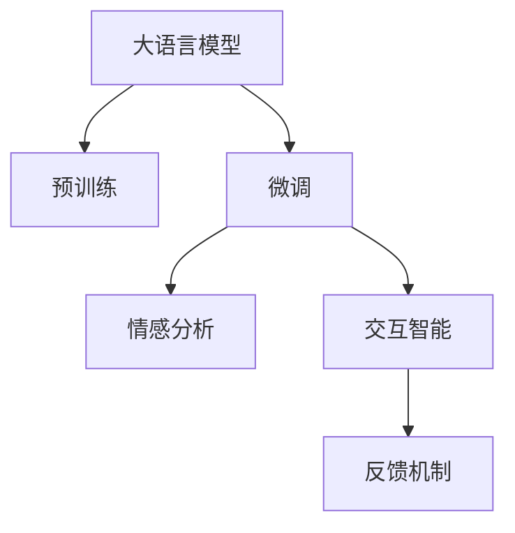

                 

# LLM的情感识别：打造有温度的AI

> 关键词：情感识别,大语言模型(LLM),深度学习,自然语言处理(NLP),情感分析,交互智能

## 1. 背景介绍

### 1.1 问题由来
随着人工智能技术的发展，尤其是深度学习在自然语言处理(Natural Language Processing, NLP)领域的广泛应用，大语言模型(Large Language Model, LLM)在情感识别方面取得了显著进展。情感识别是NLP中的一个重要任务，其目的是从文本中自动抽取文本的情感信息，对文本进行情感分类或情感极性标注。情感识别在社交媒体监测、客户满意度调查、舆情分析、智能客服等领域具有重要应用价值。

### 1.2 问题核心关键点
目前，基于深度学习的大语言模型在情感识别方面表现出色，但在实际应用中仍然面临诸多挑战，如数据标注成本高、模型泛化能力不足、对抗样本敏感等。本文聚焦于使用大语言模型进行情感识别的研究，旨在通过精心设计的微调(Fine-tuning)过程，提升模型情感识别的效果，打造更具温度的智能交互系统。

### 1.3 问题研究意义
情感识别是人工智能赋予机器感知和理解人类情感的关键技术，是构建有温度、有情感的AI的重要环节。通过大语言模型在情感识别方面的研究和应用，可以帮助企业更好地理解用户情绪，优化用户体验，提升客户满意度。在智能客服、舆情分析、社交媒体监测等领域，情感识别技术可以提供深层次的用户情感洞察，推动企业服务智能化的进程。

## 2. 核心概念与联系

### 2.1 核心概念概述

为更好地理解基于大语言模型的情感识别方法，本节将介绍几个密切相关的核心概念：

- 大语言模型(Large Language Model, LLM)：以自回归(如GPT)或自编码(如BERT)模型为代表的大规模预训练语言模型。通过在大规模无标签文本语料上进行预训练，学习通用的语言表示，具备强大的语言理解和生成能力。

- 预训练(Pre-training)：指在大规模无标签文本语料上，通过自监督学习任务训练通用语言模型的过程。常见的预训练任务包括言语建模、遮挡语言模型等。预训练使得模型学习到语言的通用表示。

- 微调(Fine-tuning)：指在预训练模型的基础上，使用下游任务的少量标注数据，通过有监督学习优化模型在特定任务上的性能。通常只需要调整顶层分类器或解码器，并以较小的学习率更新全部或部分的模型参数。

- 迁移学习(Transfer Learning)：指将一个领域学习到的知识，迁移应用到另一个不同但相关的领域的学习范式。大模型的预训练-微调过程即是一种典型的迁移学习方式。

- 情感分析(Sentiment Analysis)：通过分析文本中的情感倾向，对文本进行情感分类或情感极性标注。情感分析是情感识别的核心任务之一，可以分为基于规则的情感分析、基于词典的情感分析和基于机器学习的情感分析等。

- 交互智能(Interactive Intelligence)：指在智能系统中引入用户情感，通过情感识别与自然语言理解等技术，提升系统的交互能力和用户体验。

这些核心概念之间的逻辑关系可以通过以下Mermaid流程图来展示：



这个流程图展示了大语言模型的核心概念及其之间的关系：

1. 大语言模型通过预训练获得基础能力。
2. 微调是对预训练模型进行任务特定的优化，可以为情感识别等任务提供更优的性能。
3. 情感分析是微调的一个应用，通过微调模型获得情感识别的能力。
4. 交互智能基于情感分析的结果，进一步优化系统的交互体验。
5. 通过反馈机制，系统可以获得用户的情感反馈，用于进一步优化模型。

这些概念共同构成了基于大语言模型的情感识别系统的学习和应用框架，使其能够在各种场景下发挥强大的情感理解能力。通过理解这些核心概念，我们可以更好地把握大语言模型在情感识别方面的工作原理和优化方向。

## 3. 核心算法原理 & 具体操作步骤
### 3.1 算法原理概述

基于大语言模型的情感识别，本质上是一个有监督的情感分类问题。其核心思想是：将预训练的大语言模型视作一个强大的"特征提取器"，通过在下游任务的标注数据上进行有监督的微调，使得模型能够自动学习文本中的情感信息，并输出情感分类或情感极性标注。

形式化地，假设预训练语言模型为 $M_{\theta}$，其中 $\theta$ 为预训练得到的模型参数。给定情感识别任务 $T$ 的标注数据集 $D=\{(x_i, y_i)\}_{i=1}^N, x_i \in \mathcal{X}, y_i \in \{0, 1\}$，情感分类标签 $y_i$ 为0表示负面情感，为1表示正面情感。微调的目标是找到新的模型参数 $\hat{\theta}$，使得：

$$
\hat{\theta}=\mathop{\arg\min}_{\theta} \mathcal{L}(M_{\theta},D)
$$

其中 $\mathcal{L}$ 为针对任务 $T$ 设计的损失函数，用于衡量模型预测输出与真实标签之间的差异。常见的损失函数包括交叉熵损失、均方误差损失等。

通过梯度下降等优化算法，微调过程不断更新模型参数 $\theta$，最小化损失函数 $\mathcal{L}$，使得模型输出逼近真实标签。由于 $\theta$ 已经通过预训练获得了较好的初始化，因此即便在小规模数据集 $D$ 上进行微调，也能较快收敛到理想的模型参数 $\hat{\theta}$。

### 3.2 算法步骤详解

基于大语言模型的情感识别一般包括以下几个关键步骤：

**Step 1: 准备预训练模型和数据集**
- 选择合适的预训练语言模型 $M_{\theta}$ 作为初始化参数，如 BERT、GPT 等。
- 准备情感识别任务的标注数据集 $D$，划分为训练集、验证集和测试集。标注数据集应包含足够多样性的情感表达，确保模型能够泛化到新数据。

**Step 2: 添加任务适配层**
- 根据任务类型，在预训练模型顶层设计合适的输出层和损失函数。
- 对于情感分类任务，通常在顶层添加线性分类器或MLP，交叉熵损失函数用于衡量分类精度。
- 对于情感极性标注任务，通常使用语言模型的解码器输出概率分布，并以负对数似然为损失函数。

**Step 3: 设置微调超参数**
- 选择合适的优化算法及其参数，如 AdamW、SGD 等，设置学习率、批大小、迭代轮数等。
- 设置正则化技术及强度，包括权重衰减、Dropout、Early Stopping 等。
- 确定冻结预训练参数的策略，如仅微调顶层，或全部参数都参与微调。

**Step 4: 执行梯度训练**
- 将训练集数据分批次输入模型，前向传播计算损失函数。
- 反向传播计算参数梯度，根据设定的优化算法和学习率更新模型参数。
- 周期性在验证集上评估模型性能，根据性能指标决定是否触发 Early Stopping。
- 重复上述步骤直到满足预设的迭代轮数或 Early Stopping 条件。

**Step 5: 测试和部署**
- 在测试集上评估微调后模型 $M_{\hat{\theta}}$ 的性能，对比微调前后的精度提升。
- 使用微调后的模型对新样本进行情感识别，集成到实际的应用系统中。
- 持续收集新的数据，定期重新微调模型，以适应数据分布的变化。

以上是基于大语言模型的情感识别的一般流程。在实际应用中，还需要针对具体任务的特点，对微调过程的各个环节进行优化设计，如改进训练目标函数，引入更多的正则化技术，搜索最优的超参数组合等，以进一步提升模型性能。

### 3.3 算法优缺点

基于大语言模型的情感识别方法具有以下优点：
1. 简单高效。只需准备少量标注数据，即可对预训练模型进行快速适配，获得较大的性能提升。
2. 通用适用。适用于各种情感识别任务，包括情感分类、情感极性标注等，设计简单的任务适配层即可实现微调。
3. 参数高效。利用参数高效微调技术，在固定大部分预训练权重不变的情况下，仍可取得不错的提升。
4. 效果显著。在学术界和工业界的诸多任务上，基于微调的方法已经刷新了最先进的性能指标。

同时，该方法也存在一定的局限性：
1. 依赖标注数据。情感识别的效果很大程度上取决于标注数据的质量和数量，获取高质量标注数据的成本较高。
2. 泛化能力有限。当目标任务与预训练数据的分布差异较大时，微调的性能提升有限。
3. 对抗样本敏感。情感识别模型容易受到对抗样本的攻击，导致错误的情感识别。
4. 可解释性不足。情感识别模型的决策过程通常缺乏可解释性，难以对其推理逻辑进行分析和调试。

尽管存在这些局限性，但就目前而言，基于大语言模型的情感识别方法仍是最主流范式。未来相关研究的重点在于如何进一步降低标注数据的依赖，提高模型的泛化能力，同时兼顾可解释性和安全性等因素。

### 3.4 算法应用领域

基于大语言模型的情感识别方法，在社交媒体监测、客户满意度调查、舆情分析、智能客服等多个领域得到了广泛应用，展示了其巨大的应用潜力：

- 社交媒体监测：通过情感识别技术，自动识别社交媒体上的用户评论、帖子等文本中的情感倾向，监测品牌形象，预测市场舆情。
- 客户满意度调查：在客户反馈中自动识别情感信息，分析用户情绪，优化服务质量。
- 舆情分析：通过情感识别技术，自动分析新闻、报道、评论等文本，获取公众情绪，辅助决策支持。
- 智能客服系统：通过情感识别技术，自动理解用户情绪，提供更加个性化的客服服务。

除了上述这些经典应用外，情感识别技术还被创新性地应用到更多场景中，如情感智能问答、情感驱动的游戏设计、情感健康监测等，为人工智能技术落地应用提供了新的方向。随着情感识别技术的不断发展，其在提升用户体验、促进社会福祉方面的作用将越来越明显。

## 4. 数学模型和公式 & 详细讲解 & 举例说明
### 4.1 数学模型构建

本节将使用数学语言对基于大语言模型的情感识别过程进行更加严格的刻画。

记预训练语言模型为 $M_{\theta}$，其中 $\theta$ 为预训练得到的模型参数。假设情感识别任务 $T$ 的标注数据集 $D=\{(x_i, y_i)\}_{i=1}^N, x_i \in \mathcal{X}, y_i \in \{0, 1\}$。

定义模型 $M_{\theta}$ 在输入 $x$ 上的输出为 $\hat{y}=M_{\theta}(x) \in [0,1]$，表示样本属于正面情感的概率。真实标签 $y \in \{0, 1\}$。则情感分类任务的交叉熵损失函数定义为：

$$
\ell(M_{\theta}(x),y) = -[y\log \hat{y} + (1-y)\log (1-\hat{y})]
$$

将其代入经验风险公式，得：

$$
\mathcal{L}(\theta) = -\frac{1}{N}\sum_{i=1}^N [y_i\log M_{\theta}(x_i)+(1-y_i)\log(1-M_{\theta}(x_i))]
$$

根据链式法则，损失函数对参数 $\theta_k$ 的梯度为：

$$
\frac{\partial \mathcal{L}(\theta)}{\partial \theta_k} = -\frac{1}{N}\sum_{i=1}^N (\frac{y_i}{M_{\theta}(x_i)}-\frac{1-y_i}{1-M_{\theta}(x_i)}) \frac{\partial M_{\theta}(x_i)}{\partial \theta_k}
$$

其中 $\frac{\partial M_{\theta}(x_i)}{\partial \theta_k}$ 可进一步递归展开，利用自动微分技术完成计算。

### 4.2 公式推导过程

以下我们以情感分类任务为例，推导交叉熵损失函数及其梯度的计算公式。

假设模型 $M_{\theta}$ 在输入 $x$ 上的输出为 $\hat{y}=M_{\theta}(x) \in [0,1]$，表示样本属于正面情感的概率。真实标签 $y \in \{0, 1\}$。则情感分类任务的交叉熵损失函数定义为：

$$
\ell(M_{\theta}(x),y) = -[y\log \hat{y} + (1-y)\log (1-\hat{y})]
$$

将其代入经验风险公式，得：

$$
\mathcal{L}(\theta) = -\frac{1}{N}\sum_{i=1}^N [y_i\log M_{\theta}(x_i)+(1-y_i)\log(1-M_{\theta}(x_i))]
$$

根据链式法则，损失函数对参数 $\theta_k$ 的梯度为：

$$
\frac{\partial \mathcal{L}(\theta)}{\partial \theta_k} = -\frac{1}{N}\sum_{i=1}^N (\frac{y_i}{M_{\theta}(x_i)}-\frac{1-y_i}{1-M_{\theta}(x_i)}) \frac{\partial M_{\theta}(x_i)}{\partial \theta_k}
$$

其中 $\frac{\partial M_{\theta}(x_i)}{\partial \theta_k}$ 可进一步递归展开，利用自动微分技术完成计算。

在得到损失函数的梯度后，即可带入参数更新公式，完成模型的迭代优化。重复上述过程直至收敛，最终得到适应情感分类任务的最优模型参数 $\theta^*$。

## 5. 项目实践：代码实例和详细解释说明
### 5.1 开发环境搭建

在进行情感识别实践前，我们需要准备好开发环境。以下是使用Python进行PyTorch开发的环境配置流程：

1. 安装Anaconda：从官网下载并安装Anaconda，用于创建独立的Python环境。

2. 创建并激活虚拟环境：
```bash
conda create -n pytorch-env python=3.8 
conda activate pytorch-env
```

3. 安装PyTorch：根据CUDA版本，从官网获取对应的安装命令。例如：
```bash
conda install pytorch torchvision torchaudio cudatoolkit=11.1 -c pytorch -c conda-forge
```

4. 安装Transformers库：
```bash
pip install transformers
```

5. 安装各类工具包：
```bash
pip install numpy pandas scikit-learn matplotlib tqdm jupyter notebook ipython
```

完成上述步骤后，即可在`pytorch-env`环境中开始情感识别实践。

### 5.2 源代码详细实现

这里我们以情感分类任务为例，给出使用Transformers库对BERT模型进行情感分类的PyTorch代码实现。

首先，定义情感分类任务的数据处理函数：

```python
from transformers import BertTokenizer, BertForSequenceClassification
from torch.utils.data import Dataset
import torch

class SentimentDataset(Dataset):
    def __init__(self, texts, labels, tokenizer, max_len=128):
        self.texts = texts
        self.labels = labels
        self.tokenizer = tokenizer
        self.max_len = max_len
        
    def __len__(self):
        return len(self.texts)
    
    def __getitem__(self, item):
        text = self.texts[item]
        label = self.labels[item]
        
        encoding = self.tokenizer(text, return_tensors='pt', max_length=self.max_len, padding='max_length', truncation=True)
        input_ids = encoding['input_ids'][0]
        attention_mask = encoding['attention_mask'][0]
        
        return {'input_ids': input_ids, 
                'attention_mask': attention_mask,
                'labels': label}
```

然后，定义模型和优化器：

```python
from transformers import AdamW

model = BertForSequenceClassification.from_pretrained('bert-base-cased', num_labels=2)

optimizer = AdamW(model.parameters(), lr=2e-5)
```

接着，定义训练和评估函数：

```python
from torch.utils.data import DataLoader
from tqdm import tqdm
from sklearn.metrics import accuracy_score

device = torch.device('cuda') if torch.cuda.is_available() else torch.device('cpu')
model.to(device)

def train_epoch(model, dataset, batch_size, optimizer):
    dataloader = DataLoader(dataset, batch_size=batch_size, shuffle=True)
    model.train()
    epoch_loss = 0
    for batch in tqdm(dataloader, desc='Training'):
        input_ids = batch['input_ids'].to(device)
        attention_mask = batch['attention_mask'].to(device)
        labels = batch['labels'].to(device)
        model.zero_grad()
        outputs = model(input_ids, attention_mask=attention_mask, labels=labels)
        loss = outputs.loss
        epoch_loss += loss.item()
        loss.backward()
        optimizer.step()
    return epoch_loss / len(dataloader)

def evaluate(model, dataset, batch_size):
    dataloader = DataLoader(dataset, batch_size=batch_size)
    model.eval()
    preds, labels = [], []
    with torch.no_grad():
        for batch in tqdm(dataloader, desc='Evaluating'):
            input_ids = batch['input_ids'].to(device)
            attention_mask = batch['attention_mask'].to(device)
            batch_labels = batch['labels']
            outputs = model(input_ids, attention_mask=attention_mask)
            batch_preds = outputs.logits.argmax(dim=1).to('cpu').tolist()
            batch_labels = batch_labels.to('cpu').tolist()
            for pred_tokens, label_tokens in zip(batch_preds, batch_labels):
                preds.append(pred_tokens)
                labels.append(label_tokens)
                
    print(f"Accuracy: {accuracy_score(labels, preds):.2f}")
```

最后，启动训练流程并在测试集上评估：

```python
epochs = 5
batch_size = 16

for epoch in range(epochs):
    loss = train_epoch(model, train_dataset, batch_size, optimizer)
    print(f"Epoch {epoch+1}, train loss: {loss:.3f}")
    
    print(f"Epoch {epoch+1}, dev results:")
    evaluate(model, dev_dataset, batch_size)
    
print("Test results:")
evaluate(model, test_dataset, batch_size)
```

以上就是使用PyTorch对BERT进行情感分类任务微调的完整代码实现。可以看到，得益于Transformers库的强大封装，我们可以用相对简洁的代码完成BERT模型的加载和微调。

### 5.3 代码解读与分析

让我们再详细解读一下关键代码的实现细节：

**SentimentDataset类**：
- `__init__`方法：初始化文本、标签、分词器等关键组件。
- `__len__`方法：返回数据集的样本数量。
- `__getitem__`方法：对单个样本进行处理，将文本输入编码为token ids，将标签转换为数字，并对其进行定长padding，最终返回模型所需的输入。

**模型和优化器**：
- 使用BertForSequenceClassification加载预训练模型，设置分类数为2（情感分类任务）。
- 定义优化器AdamW，学习率为2e-5。

**训练和评估函数**：
- 使用PyTorch的DataLoader对数据集进行批次化加载，供模型训练和推理使用。
- 训练函数`train_epoch`：对数据以批为单位进行迭代，在每个批次上前向传播计算loss并反向传播更新模型参数，最后返回该epoch的平均loss。
- 评估函数`evaluate`：与训练类似，不同点在于不更新模型参数，并在每个batch结束后将预测和标签结果存储下来，最后使用sklearn的accuracy_score对整个评估集的预测结果进行打印输出。

**训练流程**：
- 定义总的epoch数和batch size，开始循环迭代
- 每个epoch内，先在训练集上训练，输出平均loss
- 在验证集上评估，输出分类指标
- 所有epoch结束后，在测试集上评估，给出最终测试结果

可以看到，PyTorch配合Transformers库使得BERT微调的代码实现变得简洁高效。开发者可以将更多精力放在数据处理、模型改进等高层逻辑上，而不必过多关注底层的实现细节。

当然，工业级的系统实现还需考虑更多因素，如模型的保存和部署、超参数的自动搜索、更灵活的任务适配层等。但核心的微调范式基本与此类似。

## 6. 实际应用场景
### 6.1 社交媒体监测

情感识别技术在社交媒体监测中具有重要应用价值。通过情感识别技术，可以自动识别社交媒体上的用户评论、帖子等文本中的情感倾向，监测品牌形象，预测市场舆情。

在技术实现上，可以收集各大社交媒体平台的用户评论数据，将评论文本和情感标签构建成监督数据，在此基础上对预训练语言模型进行微调。微调后的情感识别模型能够自动理解文本情感，实时监测社交媒体舆情变化，辅助决策支持。

### 6.2 客户满意度调查

情感识别技术在客户满意度调查中也具有重要应用。通过情感识别技术，可以自动分析客户反馈中的情感信息，分析用户情绪，优化服务质量。

在具体应用中，可以收集用户的历史反馈数据，将其中的文本数据和情感标签构建成监督数据，在此基础上对预训练语言模型进行微调。微调后的情感识别模型能够自动理解用户情绪，实时分析客户反馈，识别客户满意或不满意，辅助企业优化产品和服务。

### 6.3 舆情分析

情感识别技术在舆情分析中也有广泛应用。通过情感识别技术，可以自动分析新闻、报道、评论等文本，获取公众情绪，辅助决策支持。

在实际应用中，可以收集各大媒体的新闻报道、社交媒体的评论数据等，将其中的文本数据和情感标签构建成监督数据，在此基础上对预训练语言模型进行微调。微调后的情感识别模型能够自动理解文本情感，实时监测舆情变化，识别舆情趋势，辅助媒体和政府决策。

### 6.4 未来应用展望

随着情感识别技术的不断发展，其应用领域将不断拓展，为人工智能技术落地应用提供新的方向。

在智慧医疗领域，情感识别技术可以用于监测患者情绪，提供更加个性化的医疗服务。在智能教育领域，情感识别技术可以用于分析学生情绪，优化教学内容，提升教学效果。

在智慧城市治理中，情感识别技术可以用于监测市民情绪，优化城市管理，提升市民满意度。在社交娱乐领域，情感识别技术可以用于分析用户情绪，优化内容推荐，提升用户体验。

此外，在企业生产、社会治理、文娱传媒等众多领域，情感识别技术也将不断涌现，为人工智能技术落地应用提供新的方向。相信随着技术的日益成熟，情感识别技术必将在构建有温度、有情感的AI系统中发挥重要作用，推动人工智能技术的发展。

## 7. 工具和资源推荐
### 7.1 学习资源推荐

为了帮助开发者系统掌握大语言模型在情感识别方面的研究基础和实践技巧，这里推荐一些优质的学习资源：

1. 《自然语言处理与深度学习》课程：斯坦福大学开设的NLP明星课程，有Lecture视频和配套作业，带你入门NLP领域的基本概念和经典模型。

2. 《深度学习框架PyTorch入门教程》：详细介绍了PyTorch框架的使用方法和经典应用案例，适合初学者入门。

3. 《自然语言处理中的Transformer》书籍：全面介绍了Transformer模型和深度学习在NLP领域的应用，适合进阶学习。

4. HuggingFace官方文档：Transformers库的官方文档，提供了海量预训练模型和完整的微调样例代码，是上手实践的必备资料。

5. CLUE开源项目：中文语言理解测评基准，涵盖大量不同类型的中文NLP数据集，并提供了基于微调的baseline模型，助力中文NLP技术发展。

通过对这些资源的学习实践，相信你一定能够快速掌握大语言模型在情感识别方面的研究方法和应用技巧，实现情感识别模型的开发和部署。

### 7.2 开发工具推荐

高效的开发离不开优秀的工具支持。以下是几款用于情感识别开发的常用工具：

1. PyTorch：基于Python的开源深度学习框架，灵活动态的计算图，适合快速迭代研究。大部分预训练语言模型都有PyTorch版本的实现。

2. TensorFlow：由Google主导开发的开源深度学习框架，生产部署方便，适合大规模工程应用。同样有丰富的预训练语言模型资源。

3. Transformers库：HuggingFace开发的NLP工具库，集成了众多SOTA语言模型，支持PyTorch和TensorFlow，是进行情感识别任务开发的利器。

4. Weights & Biases：模型训练的实验跟踪工具，可以记录和可视化模型训练过程中的各项指标，方便对比和调优。与主流深度学习框架无缝集成。

5. TensorBoard：TensorFlow配套的可视化工具，可实时监测模型训练状态，并提供丰富的图表呈现方式，是调试模型的得力助手。

6. Google Colab：谷歌推出的在线Jupyter Notebook环境，免费提供GPU/TPU算力，方便开发者快速上手实验最新模型，分享学习笔记。

合理利用这些工具，可以显著提升情感识别模型的开发效率，加快创新迭代的步伐。

### 7.3 相关论文推荐

情感识别技术的发展得益于学界的持续研究。以下是几篇奠基性的相关论文，推荐阅读：

1. Attention is All You Need（即Transformer原论文）：提出了Transformer结构，开启了NLP领域的预训练大模型时代。

2. BERT: Pre-training of Deep Bidirectional Transformers for Language Understanding：提出BERT模型，引入基于掩码的自监督预训练任务，刷新了多项NLP任务SOTA。

3. Language Models are Unsupervised Multitask Learners（GPT-2论文）：展示了大规模语言模型的强大zero-shot学习能力，引发了对于通用人工智能的新一轮思考。

4. Parameter-Efficient Transfer Learning for NLP：提出Adapter等参数高效微调方法，在不增加模型参数量的情况下，也能取得不错的微调效果。

5. Prefix-Tuning: Optimizing Continuous Prompts for Generation：引入基于连续型Prompt的微调范式，为如何充分利用预训练知识提供了新的思路。

6. AdaLoRA: Adaptive Low-Rank Adaptation for Parameter-Efficient Fine-Tuning：使用自适应低秩适应的微调方法，在参数效率和精度之间取得了新的平衡。

这些论文代表了大语言模型在情感识别方面的发展脉络。通过学习这些前沿成果，可以帮助研究者把握学科前进方向，激发更多的创新灵感。

## 8. 总结：未来发展趋势与挑战
### 8.1 总结

本文对基于大语言模型的情感识别方法进行了全面系统的介绍。首先阐述了情感识别在大语言模型中的应用背景和研究意义，明确了情感识别在构建有温度、有情感的AI中的重要地位。其次，从原理到实践，详细讲解了情感识别任务的数学模型和微调步骤，给出了情感识别任务开发的完整代码实例。同时，本文还广泛探讨了情感识别技术在社交媒体监测、客户满意度调查、舆情分析等多个领域的应用前景，展示了情感识别技术在提升用户体验、促进社会福祉方面的潜力。

通过本文的系统梳理，可以看到，基于大语言模型的情感识别方法正在成为NLP领域的重要范式，极大地拓展了情感识别技术的应用边界，推动了情感智能系统的建设。未来，伴随大语言模型和情感识别技术的不断演进，基于情感智能的AI系统将进一步提升人类的生活质量，带来更加丰富、自然、智能的交互体验。

### 8.2 未来发展趋势

展望未来，大语言模型在情感识别方面将呈现以下几个发展趋势：

1. 情感分析精度提高。随着模型规模的增大和训练数据的丰富，情感识别的精度将不断提升，能够更准确地识别出文本中的情感倾向。

2. 多模态情感识别发展。情感识别技术不仅限于文本情感，还将拓展到图像、视频等多模态数据情感分析。多模态数据的融合，将提升情感识别的鲁棒性和准确性。

3. 情感智能交互增强。情感识别技术将与自然语言理解、智能对话等技术结合，提升智能交互系统的感知能力和响应速度。

4. 情感识别应用的普及。情感识别技术将在更多场景中得到应用，如医疗健康、智能客服、舆情监测等，推动社会治理和服务的智能化进程。

5. 模型鲁棒性提升。情感识别模型将更加注重对抗样本的鲁棒性，避免对抗样本对情感识别结果的干扰。

6. 模型可解释性加强。情感识别模型将引入更多的可解释性技术，增强模型的决策透明性和可信度。

以上趋势凸显了大语言模型在情感识别方面的广阔前景。这些方向的探索发展，必将进一步提升情感识别系统的性能和应用范围，为构建有温度、有情感的AI系统提供重要支撑。

### 8.3 面临的挑战

尽管大语言模型在情感识别方面已经取得了显著进展，但在迈向更加智能化、普适化应用的过程中，它仍面临着诸多挑战：

1. 数据标注成本高。情感识别任务需要大量高质量的标注数据，获取标注数据成本高且耗时。如何降低数据标注成本，是大规模情感识别应用的关键问题。

2. 泛化能力不足。情感识别模型面对域外数据时，泛化性能往往大打折扣。如何提高模型的泛化能力，以适应不同领域的情感表达，是情感识别面临的主要挑战。

3. 对抗样本攻击。情感识别模型容易受到对抗样本的攻击，导致错误的情感识别。如何提高模型的鲁棒性，确保情感识别的准确性，是情感识别面临的严峻挑战。

4. 可解释性不足。情感识别模型的决策过程通常缺乏可解释性，难以对其推理逻辑进行分析和调试。如何赋予情感识别模型更强的可解释性，将是亟待解决的问题。

5. 数据隐私问题。情感识别技术在收集和处理用户数据时，涉及用户隐私问题。如何保护用户隐私，确保数据使用的合规性，是情感识别技术应用中的重要问题。

尽管存在这些挑战，但随着大语言模型和情感识别技术的不断发展，相信这些挑战终将一一被克服，情感识别技术必将在构建有温度、有情感的AI系统中发挥重要作用，推动人工智能技术的发展。

### 8.4 研究展望

面对情感识别技术所面临的种种挑战，未来的研究需要在以下几个方面寻求新的突破：

1. 探索无监督和半监督情感识别方法。摆脱对大规模标注数据的依赖，利用自监督学习、主动学习等无监督和半监督范式，最大限度利用非结构化数据，实现更加灵活高效的情感识别。

2. 研究参数高效和计算高效的情感识别方法。开发更加参数高效的情感识别方法，在固定大部分预训练权重不变的情况下，只更新极少量的任务相关参数。同时优化情感识别模型的计算图，减少前向传播和反向传播的资源消耗，实现更加轻量级、实时性的部署。

3. 引入更多先验知识。将符号化的先验知识，如知识图谱、逻辑规则等，与神经网络模型进行巧妙融合，引导情感识别过程学习更准确、合理的情感表示。同时加强不同模态数据的整合，实现视觉、语音等多模态信息与文本信息的协同建模。

4. 结合因果分析和博弈论工具。将因果分析方法引入情感识别模型，识别出模型决策的关键特征，增强输出解释的因果性和逻辑性。借助博弈论工具刻画人机交互过程，主动探索并规避模型的脆弱点，提高系统稳定性。

5. 纳入伦理道德约束。在模型训练目标中引入伦理导向的评估指标，过滤和惩罚有偏见、有害的输出倾向。同时加强人工干预和审核，建立模型行为的监管机制，确保输出符合人类价值观和伦理道德。

这些研究方向的探索，必将引领情感识别技术迈向更高的台阶，为构建有温度、有情感的AI系统提供重要支撑。面向未来，情感识别技术还需要与其他人工智能技术进行更深入的融合，如知识表示、因果推理、强化学习等，多路径协同发力，共同推动自然语言理解和智能交互系统的进步。只有勇于创新、敢于突破，才能不断拓展情感识别技术的边界，让智能技术更好地造福人类社会。

## 9. 附录：常见问题与解答

**Q1：情感识别技术是否适用于所有语言和文化？**

A: 情感识别技术在中文、英文等主流语言中已经取得了显著进展，但在非主流语言和文化中，由于数据稀缺，情感识别的效果可能不佳。因此，开发适用于不同语言和文化的情感识别技术，是未来的一个重要研究方向。

**Q2：情感识别技术是否能够识别复杂情感？**

A: 情感识别技术在识别基本情感（如正面、负面）方面已经表现出色，但在识别复杂情感（如喜忧参半、讽刺、幽默等）方面仍存在挑战。通过进一步提升模型精度和复杂度，可以逐步提升对复杂情感的识别能力。

**Q3：情感识别技术如何应对语境多样性？**

A: 情感识别技术在处理语境多样性方面存在一定挑战。为应对语境多样性，可以使用上下文感知模型，引入语境信息，提升情感识别的鲁棒性。此外，引入多视角情感分析，综合考虑文本中的情感、语调、语境等因素，进一步提升情感识别的准确性。

**Q4：情感识别技术在实际应用中需要注意哪些问题？**

A: 情感识别技术在实际应用中需要注意以下几个问题：
1. 数据隐私保护：确保用户数据的隐私安全，避免数据泄露。
2. 模型鲁棒性：提高模型对抗样本的鲁棒性，避免恶意攻击。
3. 模型可解释性：增强情感识别模型的可解释性，提供透明、可信的输出。
4. 实时性要求：确保情感识别模型能够实时响应，满足用户需求。
5. 用户反馈机制：建立用户反馈机制，不断优化情感识别模型，提升用户体验。

通过合理解决这些问题，可以有效提升情感识别技术在实际应用中的效果和可靠性。

**Q5：情感识别技术是否能够用于医疗领域？**

A: 情感识别技术在医疗领域具有重要应用价值。通过分析患者的情感信息，可以辅助诊断和治疗，提升医疗服务的质量。情感识别技术可以用于监测患者情绪，评估治疗效果，优化医疗服务流程。

总之，情感识别技术是构建有温度、有情感的AI系统的重要组成部分，未来必将在更多领域得到广泛应用，为人类生活带来更多便利和温暖。通过不断创新和改进，情感识别技术必将在提升用户体验、推动社会进步方面发挥重要作用。

---

作者：禅与计算机程序设计艺术 / Zen and the Art of Computer Programming

