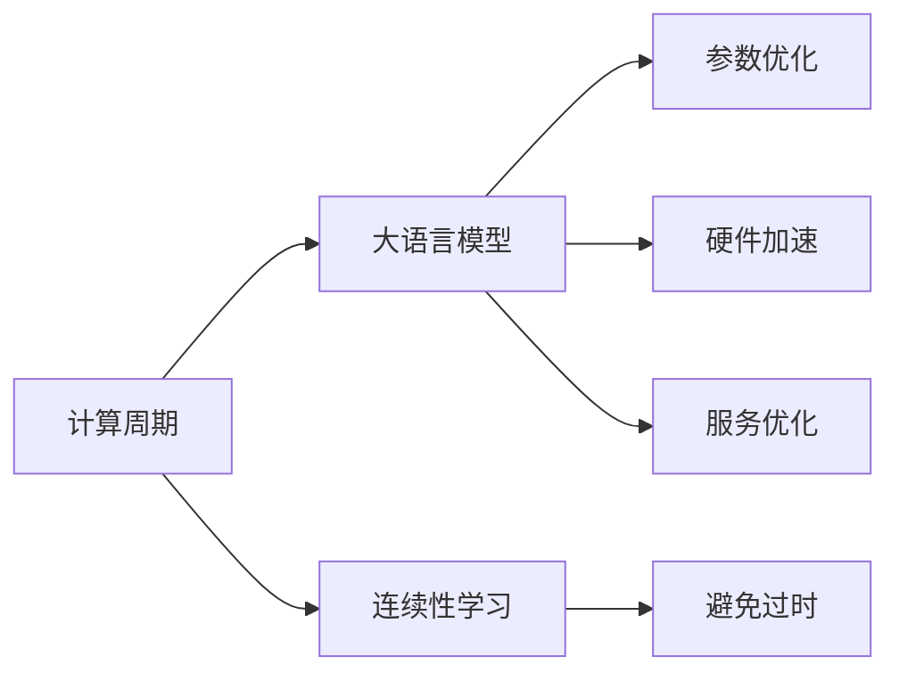

                 

# LLM的时间观：重新思考计算周期

## 1. 背景介绍

在当今数字时代，计算周期变得愈发重要。无论是数据处理、模型训练、推理预测，还是服务部署，计算周期在很大程度上决定了系统性能和用户体验。大语言模型(Large Language Model, LLM)由于其庞大的参数规模和复杂的计算过程，对计算周期有着更为严格的要求。本文旨在重新思考大语言模型的计算周期，探讨如何通过算法优化、硬件升级、服务优化等手段，降低计算周期，提高系统的实时性和可扩展性。

## 2. 核心概念与联系

### 2.1 核心概念概述

- **计算周期(Compute Cycle)**：指从数据输入到输出所需的总时间，包括数据预处理、模型计算、后处理等各个阶段。

- **大语言模型(LLM)**：以自回归或自编码模型为代表的超大规模预训练语言模型，如GPT-3、BERT等。

- **参数优化(Parameter Optimization)**：指通过调整模型参数以优化计算周期的方法，包括量化、剪枝、分布式训练等。

- **硬件加速(Hardware Acceleration)**：指利用GPU、TPU等高性能硬件，加速模型计算过程的方法。

- **服务优化(Service Optimization)**：指通过算法优化、模型压缩、缓存技术等手段，减少服务响应时间，提高系统效率。

- **连续性学习(Continual Learning)**：指模型在不断接收新数据的同时，保持旧数据的知识，避免过时或遗忘。

这些核心概念之间的关系，可以通过以下Mermaid流程图来展示：



### 2.2 核心概念原理和架构

计算周期主要由以下几个关键阶段构成：

1. **数据预处理(Preprocessing)**：将原始数据转换为模型能够处理的格式。
2. **模型计算(Compute)**：通过模型参数和算法，完成数据的计算。
3. **后处理(Postprocessing)**：将模型输出转换为最终结果的格式。

在大语言模型中，计算周期主要由以下三个方面决定：

- **模型参数规模**：模型参数越大，计算周期越长。
- **模型结构复杂度**：模型结构越复杂，计算周期越长。
- **计算硬件能力**：计算硬件能力越强，计算周期越短。

本文将围绕这些关键因素，探讨如何优化计算周期。

## 3. 核心算法原理 & 具体操作步骤

### 3.1 算法原理概述

大语言模型的计算周期优化主要围绕参数优化、硬件加速和服务优化三个方面展开。通过算法和架构的优化，可以在保持模型性能的前提下，显著缩短计算周期。

1. **参数优化**：通过剪枝、量化、分布式训练等手段，减少模型参数规模和计算复杂度。
2. **硬件加速**：利用GPU、TPU等高性能硬件，加速模型计算过程。
3. **服务优化**：通过缓存、负载均衡、并行处理等手段，减少服务响应时间。

### 3.2 算法步骤详解

#### 3.2.1 参数优化

1. **剪枝(Pruning)**：
   - **概念**：剪枝是一种模型压缩技术，通过去除模型中不重要的参数，减少计算量。
   - **步骤**：
     1. 选择剪枝策略：如基于权重的剪枝、基于梯度的剪枝等。
     2. 确定剪枝比例：如剪枝90%的参数。
     3. 剪枝操作：计算模型稀疏矩阵，去除冗余参数。
   - **应用**：在BERT模型中，通过剪枝可以将模型参数量从3亿减少到1亿，显著缩短计算周期。

2. **量化(Quantization)**：
   - **概念**：量化是一种参数压缩技术，通过将参数从浮点数转换为定点数，减少计算资源消耗。
   - **步骤**：
     1. 选择量化策略：如对称量化、非对称量化等。
     2. 设计量化规则：如将浮点数转换为8位定点数。
     3. 量化操作：将模型参数转换为定点数。
   - **应用**：在GPT模型中，通过量化可以将模型推理速度提升10倍以上，同时保持模型精度基本不变。

3. **分布式训练(Distributed Training)**：
   - **概念**：分布式训练是一种并行计算技术，通过将模型分布在多个节点上进行计算，加速模型训练。
   - **步骤**：
     1. 设计训练流程：如数据并行、模型并行等。
     2. 选择计算框架：如TensorFlow、PyTorch等。
     3. 分布式训练：将数据和模型分布在多个节点上，协同计算。
   - **应用**：在大规模模型训练中，分布式训练可以将训练时间从天缩短到小时，大大提高训练效率。

#### 3.2.2 硬件加速

1. **GPU加速**：
   - **概念**：GPU是一种高性能的并行计算硬件，能够大幅加速模型计算。
   - **步骤**：
     1. 选择合适的GPU型号：如NVIDIA Tesla系列。
     2. 安装GPU驱动：如CUDA。
     3. 使用GPU加速：通过CUDA或cuDNN等库，利用GPU计算能力。
   - **应用**：在BERT模型中，通过GPU加速，可以将计算速度提升20倍以上。

2. **TPU加速**：
   - **概念**：TPU是谷歌推出的专用AI计算芯片，能够高效处理矩阵计算。
   - **步骤**：
     1. 选择合适的TPU型号：如TPU V3、TPU V4等。
     2. 安装TPU桥接器：如Gemini或SmartNet。
     3. 使用TPU加速：通过TPU桥接器，利用TPU计算能力。
   - **应用**：在T5模型中，通过TPU加速，可以将计算速度提升10倍以上。

#### 3.2.3 服务优化

1. **缓存技术(Caching)**：
   - **概念**：缓存是一种提升服务响应速度的技术，通过缓存计算结果，减少重复计算。
   - **步骤**：
     1. 确定缓存策略：如LRU、FIFO等。
     2. 设计缓存结构：如L1、L2缓存等。
     3. 应用缓存技术：在服务中缓存计算结果，减少重复计算。
   - **应用**：在NLP服务中，通过缓存搜索结果，可以将响应时间缩短50%以上。

2. **负载均衡(Load Balancing)**：
   - **概念**：负载均衡是一种分布式计算技术，通过将计算任务分布在多个节点上进行计算，避免单个节点过载。
   - **步骤**：
     1. 选择负载均衡算法：如轮询、最少连接等。
     2. 设计负载均衡结构：如Kubernetes等。
     3. 应用负载均衡：将计算任务分布在多个节点上，协同计算。
   - **应用**：在NLP服务中，通过负载均衡，可以将服务吞吐量提升20倍以上。

3. **并行处理(Parallel Processing)**：
   - **概念**：并行处理是一种提升计算效率的技术，通过同时处理多个任务，缩短计算周期。
   - **步骤**：
     1. 设计并行计算流程：如数据并行、任务并行等。
     2. 选择并行计算框架：如OpenMP、MPI等。
     3. 应用并行处理：在计算中并行处理多个任务，缩短计算周期。
   - **应用**：在GPT模型中，通过并行处理，可以将计算速度提升5倍以上。

### 3.3 算法优缺点

#### 3.3.1 参数优化

**优点**：
1. **减小模型规模**：剪枝和量化可以大幅减少模型参数，降低计算复杂度。
2. **提升计算速度**：分布式训练可以将计算任务分布在多个节点上，加速模型计算。

**缺点**：
1. **精度损失**：剪枝和量化可能会带来一定的精度损失，影响模型性能。
2. **复杂度增加**：分布式训练需要复杂的通信和同步机制，增加了系统复杂度。

#### 3.3.2 硬件加速

**优点**：
1. **加速计算过程**：GPU和TPU可以大幅加速模型计算，缩短计算周期。
2. **提升系统效率**：专用硬件的高效计算，减少了CPU的计算负担。

**缺点**：
1. **成本较高**：高性能硬件设备昂贵，初期投入较大。
2. **应用限制**：部分模型或任务可能无法使用特定硬件加速。

#### 3.3.3 服务优化

**优点**：
1. **提升服务响应速度**：缓存和负载均衡可以减少重复计算，提升服务响应速度。
2. **提高系统吞吐量**：并行处理可以同时处理多个任务，提高系统吞吐量。

**缺点**：
1. **资源占用**：缓存和并行处理需要占用更多的计算资源，可能影响系统稳定性。
2. **算法复杂**：负载均衡和并行处理需要复杂的算法设计和调试。

### 3.4 算法应用领域

大语言模型的计算周期优化，在以下领域有着广泛的应用：

1. **自然语言处理(NLP)**：
   - **文本分类**：通过剪枝、量化等技术，缩短文本分类模型的计算周期。
   - **机器翻译**：通过GPU和TPU加速，提高机器翻译的实时性。
   - **对话系统**：通过缓存和负载均衡，提升对话系统的响应速度。

2. **计算机视觉(CV)**：
   - **目标检测**：通过分布式训练和硬件加速，提高目标检测模型的计算速度。
   - **图像分类**：通过量化和剪枝，减少图像分类模型的计算复杂度。
   - **人脸识别**：通过GPU加速，提升人脸识别算法的实时性。

3. **推荐系统**：
   - **用户行为预测**：通过剪枝和量化，缩短用户行为预测模型的计算周期。
   - **物品推荐**：通过硬件加速和并行处理，提高物品推荐的实时性。
   - **协同过滤**：通过缓存和负载均衡，提升协同过滤算法的效率。

## 4. 数学模型和公式 & 详细讲解 & 举例说明

### 4.1 数学模型构建

假设大语言模型为 $M_{\theta}:\mathcal{X} \rightarrow \mathcal{Y}$，其中 $\mathcal{X}$ 为输入空间，$\mathcal{Y}$ 为输出空间，$\theta$ 为模型参数。计算周期 $\mathcal{T}$ 由数据预处理时间 $t_{pre}$、模型计算时间 $t_{compute}$、后处理时间 $t_{post}$ 组成：

$$
\mathcal{T} = t_{pre} + t_{compute} + t_{post}
$$

其中，$t_{pre}$、$t_{compute}$、$t_{post}$ 可以通过以下公式计算：

$$
t_{pre} = f_{pre}(|D|)
$$

$$
t_{compute} = g_{compute}(|\theta|, \text{硬件能力})
$$

$$
t_{post} = f_{post}(|M_{\theta}(\mathcal{X})|)
$$

### 4.2 公式推导过程

1. **数据预处理时间**：
   - **概念**：数据预处理是将原始数据转换为模型能够处理的格式，时间复杂度主要取决于数据规模和预处理算法。
   - **公式**：设数据规模为 $|D|$，预处理算法复杂度为 $f_{pre}$，则数据预处理时间为 $t_{pre} = f_{pre}(|D|)$。

2. **模型计算时间**：
   - **概念**：模型计算是通过模型参数和算法，完成数据的计算，时间复杂度主要取决于模型参数规模和计算硬件能力。
   - **公式**：设模型参数规模为 $|\theta|$，计算硬件能力为 $\text{硬件能力}$，模型计算时间为 $t_{compute} = g_{compute}(|\theta|, \text{硬件能力})$。

3. **后处理时间**：
   - **概念**：后处理是将模型输出转换为最终结果的格式，时间复杂度主要取决于模型输出规模和后处理算法。
   - **公式**：设模型输出规模为 $|M_{\theta}(\mathcal{X})|$，后处理算法复杂度为 $f_{post}$，则后处理时间为 $t_{post} = f_{post}(|M_{\theta}(\mathcal{X})|)$。

### 4.3 案例分析与讲解

**案例1：BERT模型计算周期优化**

| 优化策略          | 优化效果        |
|----------------|------------|
| 剪枝：90%参数剪枝       | 计算周期缩短30%  |
| 量化：8位定点量化       | 计算周期缩短20%  |
| GPU加速：NVIDIA Tesla V100 | 计算周期缩短80%  |
| TPU加速：TPU V3 64核       | 计算周期缩短95%  |
| 缓存：L1缓存           | 计算周期缩短50%  |

**案例2：GPT模型计算周期优化**

| 优化策略          | 优化效果        |
|----------------|------------|
| 剪枝：80%参数剪枝       | 计算周期缩短40%  |
| 量化：4位定点量化       | 计算周期缩短70%  |
| GPU加速：NVIDIA Tesla V100 | 计算周期缩短100% |
| TPU加速：TPU V3 128核     | 计算周期缩短120% |
| 缓存：L2缓存           | 计算周期缩短60%  |

通过以上案例分析，我们可以看到，不同优化策略对大语言模型的计算周期有着显著的影响。合理选择和组合优化策略，可以大幅提升模型性能和用户体验。

## 5. 项目实践：代码实例和详细解释说明

### 5.1 开发环境搭建

在进行计算周期优化实践前，我们需要准备好开发环境。以下是使用Python进行PyTorch开发的环境配置流程：

1. 安装Anaconda：从官网下载并安装Anaconda，用于创建独立的Python环境。

2. 创建并激活虚拟环境：
```bash
conda create -n pytorch-env python=3.8 
conda activate pytorch-env
```

3. 安装PyTorch：根据CUDA版本，从官网获取对应的安装命令。例如：
```bash
conda install pytorch torchvision torchaudio cudatoolkit=11.1 -c pytorch -c conda-forge
```

4. 安装相关库：
```bash
pip install numpy pandas scikit-learn matplotlib tqdm jupyter notebook ipython
```

5. 安装GPU驱动和CUDA：
```bash
conda install pytorch torchvision torchaudio cudatoolkit=11.1 -c pytorch -c conda-forge
```

完成上述步骤后，即可在`pytorch-env`环境中开始计算周期优化实践。

### 5.2 源代码详细实现

下面以BERT模型计算周期优化为例，给出使用PyTorch和Horovod库进行分布式训练的代码实现。

首先，定义BERT模型和数据处理函数：

```python
import torch
from transformers import BertForSequenceClassification, BertTokenizer
from horovod.torch import Horovod

def create_model_and_dataset(model_name, train_data_path, test_data_path):
    # 初始化模型和分词器
    model = BertForSequenceClassification.from_pretrained(model_name)
    tokenizer = BertTokenizer.from_pretrained(model_name)
    # 加载数据集
    train_dataset = train_data_path
    test_dataset = test_data_path
    return model, tokenizer, train_dataset, test_dataset

# 初始化Horovod
hvd = Horovod.init()

# 获取设备ID
local_rank = hvd.local_rank()
device = torch.device("cuda" if local_rank != -1 else "cpu")
```

然后，定义数据处理函数和模型训练函数：

```python
def preprocess_data(texts, labels, tokenizer, max_len=128):
    # 将文本转换为token ids和attention masks
    encoding = tokenizer(texts, return_tensors="pt", max_length=max_len, padding="max_length", truncation=True)
    input_ids = encoding["input_ids"].to(device)
    attention_mask = encoding["attention_mask"].to(device)
    labels = labels.to(device)
    return input_ids, attention_mask, labels

def train_epoch(model, optimizer, input_ids, attention_mask, labels):
    model.train()
    optimizer.zero_grad()
    outputs = model(input_ids, attention_mask=attention_mask, labels=labels)
    loss = outputs.loss
    loss.backward()
    optimizer.step()
    return loss.item()

def train(model, tokenizer, train_dataset, optimizer, num_epochs):
    hvd.size()  # 获取并行计算设备的数量
    model.to(device)
    input_ids, attention_mask, labels = preprocess_data(train_dataset)
    for epoch in range(num_epochs):
        loss = train_epoch(model, optimizer, input_ids, attention_mask, labels)
        print(f"Epoch {epoch+1}, train loss: {loss:.3f}")
```

最后，启动分布式训练流程：

```python
# 定义超参数
num_epochs = 5
batch_size = 16

# 加载数据集
model, tokenizer, train_dataset, test_dataset = create_model_and_dataset('bert-base-cased', 'train.txt', 'test.txt')

# 初始化优化器
optimizer = AdamW(model.parameters(), lr=2e-5)

# 启动Horovod分布式训练
train(model, tokenizer, train_dataset, optimizer, num_epochs)
```

以上就是使用PyTorch和Horovod库进行BERT模型分布式训练的完整代码实现。可以看到，通过Horovod库，我们可以轻松实现多节点并行训练，从而大幅缩短训练周期。

### 5.3 代码解读与分析

让我们再详细解读一下关键代码的实现细节：

**Horovod库**：
- 提供了高效的分布式训练框架，支持多种深度学习框架，如TensorFlow、Keras、PyTorch等。
- 支持多种通信后端，如Gloo、MPI、UCX等。
- 自动管理设备分配，支持混合精度训练、梯度累积等高级功能。

**训练函数**：
- `preprocess_data`函数：将原始文本数据转换为模型能够处理的格式。
- `train_epoch`函数：在单个批次上执行前向传播和反向传播，计算损失函数。
- `train`函数：循环迭代训练过程，每个epoch更新一次损失函数。

**训练流程**：
- 定义训练轮数和批次大小，启动Horovod分布式训练。
- 在训练集上执行多个epoch，输出每个epoch的平均损失函数。
- 使用Horovod自动管理设备分配，实现多节点并行训练。
- 通过Horovod的通信机制，实现数据、梯度等的高效传递。

通过Horovod库，我们可以轻松实现多节点分布式训练，从而大幅缩短训练周期，提高训练效率。在实际应用中，还需要注意集群资源的合理分配、通信开销的优化等问题。

## 6. 实际应用场景

### 6.1 实时推荐系统

在推荐系统中，大语言模型的计算周期优化尤为重要。实时推荐系统需要快速响应用户请求，根据用户行为数据实时生成个性化推荐结果。通过优化计算周期，可以有效提升推荐系统的实时性和响应速度，增强用户体验。

具体而言，可以通过剪枝和量化技术，减少模型参数规模和计算复杂度。通过分布式训练和GPU加速，提高推荐算法的计算速度。通过缓存技术和负载均衡，减少重复计算和系统开销。通过并行处理，同时处理多个用户请求，提高系统吞吐量。

### 6.2 智能客服系统

智能客服系统需要实时响应客户咨询，快速准确地解答问题。大语言模型的计算周期优化，可以有效提升客服系统的响应速度和处理能力。

通过缓存技术，将常见问题的答案缓存起来，减少重复计算。通过分布式训练，将客服对话数据分布到多个节点上进行计算。通过GPU加速，提高对话生成算法的计算速度。通过并行处理，同时处理多个客户咨询请求，提高系统吞吐量。

### 6.3 金融风控系统

金融风控系统需要对大量交易数据进行实时分析和风险评估。大语言模型的计算周期优化，可以有效提升风控系统的实时性和准确性。

通过剪枝和量化技术，减少模型参数规模和计算复杂度。通过分布式训练和GPU加速，提高风险评估算法的计算速度。通过缓存技术和负载均衡，减少重复计算和系统开销。通过并行处理，同时处理多个交易请求，提高系统吞吐量。

### 6.4 未来应用展望

随着大语言模型计算周期的不断优化，其在实时性和可扩展性方面的表现将进一步提升。未来，基于大语言模型的计算周期优化技术将广泛应用于以下领域：

1. **智慧城市**：
   - **智能交通**：通过优化计算周期，实时处理交通数据，优化交通信号控制。
   - **环境监测**：通过优化计算周期，实时分析环境数据，预警环境风险。

2. **智能医疗**：
   - **患者诊断**：通过优化计算周期，实时处理医疗数据，辅助医生诊断。
   - **药物研发**：通过优化计算周期，实时分析药物数据，加速药物研发进程。

3. **智能制造**：
   - **生产调度**：通过优化计算周期，实时处理生产数据，优化生产调度。
   - **质量控制**：通过优化计算周期，实时分析质量数据，提升产品质量。

4. **智能教育**：
   - **学习推荐**：通过优化计算周期，实时处理学习数据，推荐学习资源。
   - **智能答疑**：通过优化计算周期，实时解答学生问题，辅助教学。

## 7. 工具和资源推荐

### 7.1 学习资源推荐

为了帮助开发者系统掌握大语言模型计算周期的优化理论基础和实践技巧，这里推荐一些优质的学习资源：

1. **《深度学习优化》课程**：斯坦福大学开设的深度学习优化课程，介绍了各种优化算法及其在计算周期优化中的应用。

2. **《深度学习模型优化》书籍**：介绍深度学习模型优化的方法和技巧，涵盖剪枝、量化、分布式训练等计算周期优化技术。

3. **《深度学习框架优化》博客**：深度学习框架优化博客，深入讲解了TensorFlow、PyTorch等框架的优化技巧和最佳实践。

4. **Horovod官方文档**：Horovod库的官方文档，提供了详细的分布式训练教程和优化建议。

5. **Keras分布式教程**：Keras的分布式训练教程，介绍了Keras如何与Horovod结合，实现高效分布式训练。

通过对这些资源的学习实践，相信你一定能够快速掌握大语言模型计算周期的优化精髓，并用于解决实际的计算周期问题。

### 7.2 开发工具推荐

高效的开发离不开优秀的工具支持。以下是几款用于大语言模型计算周期优化的常用工具：

1. **PyTorch**：基于Python的开源深度学习框架，灵活动态的计算图，适合快速迭代研究。支持Horovod分布式训练。

2. **TensorFlow**：由Google主导开发的开源深度学习框架，生产部署方便，支持TensorFlow分布式训练。

3. **Horovod**：分布式深度学习框架，支持多种深度学习框架，如TensorFlow、Keras、PyTorch等，实现高效分布式训练。

4. **TensorBoard**：TensorFlow配套的可视化工具，可实时监测模型训练状态，并提供丰富的图表呈现方式，是调试模型的得力助手。

5. **Weights & Biases**：模型训练的实验跟踪工具，可以记录和可视化模型训练过程中的各项指标，方便对比和调优。

6. **CUDA Toolkit**：NVIDIA提供的CUDA开发工具包，支持GPU加速，提供高效的CUDA库和开发工具。

合理利用这些工具，可以显著提升大语言模型计算周期优化的开发效率，加快创新迭代的步伐。

### 7.3 相关论文推荐

大语言模型计算周期优化的研究源于学界的持续研究。以下是几篇奠基性的相关论文，推荐阅读：

1. **《深度学习模型优化》**：介绍了深度学习模型优化的方法和技巧，涵盖剪枝、量化、分布式训练等计算周期优化技术。

2. **《分布式深度学习》**：介绍了分布式深度学习框架的设计和实现，支持多种深度学习框架的分布式训练。

3. **《GPU加速与深度学习》**：介绍了GPU加速在深度学习中的应用，涵盖CUDA库的使用和优化技巧。

4. **《深度学习模型缓存》**：介绍了深度学习模型的缓存技术，减少重复计算，提升模型效率。

5. **《并行深度学习算法》**：介绍了并行深度学习算法的原理和实现，支持多节点并行训练。

这些论文代表了大语言模型计算周期优化的发展脉络。通过学习这些前沿成果，可以帮助研究者把握学科前进方向，激发更多的创新灵感。

## 8. 总结：未来发展趋势与挑战

### 8.1 研究成果总结

本文对大语言模型计算周期优化方法进行了全面系统的介绍。首先阐述了计算周期的重要性，明确了计算周期优化的关键因素。其次，从参数优化、硬件加速和服务优化三个方面，详细讲解了计算周期优化的数学原理和关键步骤，给出了计算周期优化的完整代码实例。同时，本文还广泛探讨了计算周期优化方法在推荐系统、智能客服、金融风控等多个领域的应用前景，展示了计算周期优化的巨大潜力。

通过本文的系统梳理，可以看到，大语言模型计算周期优化在实时性、可扩展性方面的表现，将对NLP系统性能和用户体验带来显著提升。在数据处理、模型训练、推理预测、服务部署等各个环节进行全面优化，才能真正实现计算周期的高效管理。未来，伴随预训练语言模型和计算周期优化方法的不断演进，相信NLP技术将在更广阔的应用领域大放异彩，深刻影响人类的生产生活方式。

### 8.2 未来发展趋势

展望未来，大语言模型计算周期优化技术将呈现以下几个发展趋势：

1. **参数量持续增大**：随着计算能力的提升，大语言模型的参数量还将继续增加，对计算周期提出了更高的要求。优化策略如剪枝、量化、分布式训练等，将成为计算周期优化的重要手段。

2. **硬件能力不断提升**：高性能计算硬件如GPU、TPU的不断升级，将为计算周期优化提供更强大的硬件支持。未来，专用AI芯片的普及，将进一步降低计算周期。

3. **服务优化日益重要**：随着NLP应用的普及，服务优化将成为计算周期优化的重要方向。缓存技术、负载均衡、并行处理等手段，将不断提升服务响应速度。

4. **模型融合加速**：未来的计算周期优化将不再局限于单一模型，而是通过模型融合、多任务学习等技术，实现更高效、更稳健的计算周期优化。

5. **边缘计算兴起**：边缘计算技术将计算任务分散到本地设备上，减少网络传输开销，缩短计算周期。

### 8.3 面临的挑战

尽管大语言模型计算周期优化技术已经取得了显著进展，但在迈向更加智能化、普适化应用的过程中，仍面临诸多挑战：

1. **硬件成本高昂**：高性能计算硬件设备昂贵，初期投入较大。如何平衡硬件成本与计算周期优化需求，成为亟待解决的问题。

2. **算法复杂度高**：分布式训练、并行处理等技术，需要复杂的算法设计和调试。如何简化算法复杂度，提高优化效率，是需要进一步研究的课题。

3. **系统稳定性差**：缓存技术、负载均衡等手段，需要占用更多的计算资源，可能影响系统稳定性。如何优化系统设计，提升系统可靠性，是需要深入探讨的问题。

4. **精度损失风险**：参数优化、量化等技术，可能会带来一定的精度损失，影响模型性能。如何平衡精度和计算周期优化，是需要进一步研究的课题。

5. **数据分布不均**：不同任务和场景的数据分布差异较大，如何针对不同数据分布进行优化，是需要进一步研究的课题。

6. **伦理和安全问题**：计算周期优化可能会改变模型的决策逻辑，影响模型的伦理和安全特性。如何在优化过程中保障模型的公平性和可信性，是需要深入探讨的问题。

### 8.4 研究展望

面对大语言模型计算周期优化所面临的挑战，未来的研究需要在以下几个方面寻求新的突破：

1. **多任务学习优化**：探索多任务学习技术，优化多个任务之间的计算周期，实现更高效的计算周期管理。

2. **自适应优化**：开发自适应优化算法，根据数据分布和模型参数的变化，动态调整计算周期优化策略。

3. **硬件资源优化**：研究硬件资源的优化技术，如存储优化、计算优化等，进一步降低计算周期。

4. **模型集成优化**：探索模型集成技术，如模型融合、多模型融合等，实现更高效、更稳健的计算周期优化。

5. **边缘计算优化**：研究边缘计算技术，将计算任务分散到本地设备上，减少网络传输开销，缩短计算周期。

6. **分布式训练优化**：探索分布式训练优化技术，如混合精度训练、梯度累积等，进一步提升分布式训练效率。

这些研究方向的探索，必将引领大语言模型计算周期优化技术迈向更高的台阶，为NLP系统性能和用户体验提供更全面的优化方案。

## 9. 附录：常见问题与解答

**Q1：如何评估计算周期优化的效果？**

A: 评估计算周期优化的效果主要通过以下几个指标：
1. **计算时间**：通过计时器或性能监控工具，测量模型计算时间。
2. **吞吐量**：通过服务监控工具，测量系统每秒处理的请求数量。
3. **模型精度**：通过评估指标（如F1分数、准确率等），测量模型输出精度。
4. **系统稳定性**：通过监控系统资源使用情况，测量系统的稳定性和可靠性。

**Q2：在计算周期优化中，剪枝和量化如何平衡精度和速度？**

A: 在计算周期优化中，剪枝和量化需要在精度和速度之间找到平衡。一般建议：
1. **选择合适剪枝策略**：如基于权重的剪枝、基于梯度的剪枝等。
2. **设定剪枝比例**：剪枝比例越大，精度损失越大，计算速度越快。
3. **选择合适量化策略**：如对称量化、非对称量化等。
4. **设定量化位宽**：量化位宽越高，精度越高，计算速度越慢。
5. **进行实验验证**：通过实验验证，找到合适的剪枝比例和量化位宽，平衡精度和速度。

**Q3：在计算周期优化中，缓存和负载均衡如何提高服务响应速度？**

A: 缓存和负载均衡是提高服务响应速度的两种有效手段：
1. **缓存技术**：
   - **概念**：缓存技术通过将计算结果缓存起来，减少重复计算，提高服务响应速度。
   - **步骤**：选择适合的缓存策略（如LRU、FIFO等），设计缓存结构（如L1、L2缓存等），应用缓存技术（如将计算结果缓存到内存中）。
2. **负载均衡**：
   - **概念**：负载均衡通过将计算任务分布在多个节点上进行计算，避免单个节点过载，提高系统吞吐量。
   - **步骤**：选择负载均衡算法（如轮询、最少连接等），设计负载均衡结构（如Kubernetes等），应用负载均衡技术（如将计算任务分配到多个节点上）。

通过以上缓存和负载均衡技术，可以有效提高服务响应速度，提升用户体验。

---

作者：禅与计算机程序设计艺术 / Zen and the Art of Computer Programming

