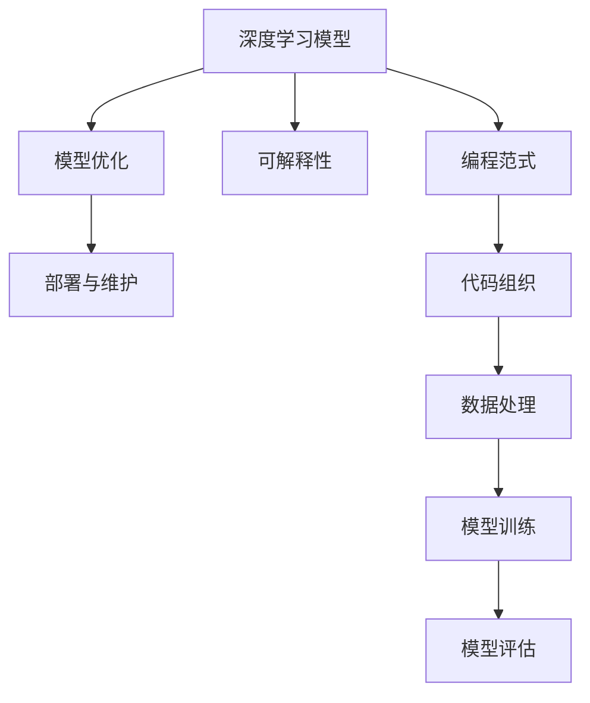

                 

# LLM编程范式：重新定义软件开发

> 关键词：语言模型,编程范式,深度学习,软件开发,模型优化,可解释性,部署与维护,人工智能

## 1. 背景介绍

### 1.1 问题由来
随着人工智能技术的不断发展，深度学习模型在各种应用领域发挥了越来越重要的作用。特别是语言模型（Language Model, LLM），如GPT-3、BERT等，已经在自然语言处理（Natural Language Processing, NLP）、语音识别、图像识别等领域取得了显著的成果。然而，深度学习模型的复杂性和难以解释性，使得软件开发领域对其实际应用受到了一定的限制。

### 1.2 问题核心关键点
深度学习模型在实际应用中面临的主要问题包括：
- 复杂性高：深度学习模型的结构复杂，难以理解和调试。
- 难以解释：深度学习模型的内部工作机制不透明，难以解释其决策过程。
- 训练成本高：深度学习模型需要大量的标注数据和计算资源进行训练。
- 模型维护难：深度学习模型的参数量大，难以维护和更新。

为了解决这些问题，深度学习模型的编程范式需要进一步改进和优化，以提升其可解释性、可维护性和应用效果。本文将探讨一种基于深度学习模型的编程范式——语言模型编程范式（Language Model Programming Paradigm），重新定义软件开发的方式，以期提升深度学习模型在实际应用中的效果和可操作性。

## 2. 核心概念与联系

### 2.1 核心概念概述

为更好地理解基于深度学习模型的编程范式，本节将介绍几个密切相关的核心概念：

- 深度学习模型（Deep Learning Model）：以神经网络为代表，通过大量标注数据进行训练，能够自动提取数据特征并做出预测的模型。

- 编程范式（Programming Paradigm）：一种软件开发的风格和思维方式，规定了程序员如何组织代码、如何表达思想、如何处理数据等。

- 模型优化（Model Optimization）：在深度学习模型的训练和应用过程中，通过调整模型的结构、参数、超参数等，提升模型的性能和泛化能力。

- 可解释性（Explainability）：深度学习模型的内部工作机制和决策逻辑的透明度，即解释模型预测结果的能力。

- 部署与维护（Deployment and Maintenance）：将深度学习模型从训练环境迁移到生产环境，并进行持续更新的过程。

- 人工智能（Artificial Intelligence）：一种通过计算机模拟人类智能的技术，包括机器学习、自然语言处理、计算机视觉等多个领域。

这些核心概念之间的逻辑关系可以通过以下Mermaid流程图来展示：



这个流程图展示了一个深度学习模型的核心概念及其之间的关系：

1. 深度学习模型通过大量标注数据进行预训练，得到基础的特征提取能力。
2. 模型优化通过调整模型的结构和参数，进一步提升模型的性能和泛化能力。
3. 可解释性使得模型的决策过程透明化，提升用户信任度。
4. 部署与维护将训练好的模型迁移到生产环境，并进行持续更新，以适应数据的变化。
5. 编程范式指导程序员如何组织代码、表达思想和处理数据，是模型优化的基础。

## 3. 核心算法原理 & 具体操作步骤
### 3.1 算法原理概述

语言模型编程范式（Language Model Programming Paradigm）是一种基于深度学习模型的编程范式，通过将模型的特征提取能力与编程范式结合，提升模型的可解释性和可维护性。其核心思想是将模型作为编程中的一个模块，通过优化模型和调整代码组织，提高软件的性能和可操作性。

具体来说，语言模型编程范式包括以下几个关键步骤：

- 预训练：使用大量无标注数据训练深度学习模型，得到基础的特征提取能力。
- 微调：在特定任务上对预训练模型进行微调，提升模型在特定任务上的性能。
- 代码生成：使用模型对代码片段进行生成或修正，提高代码质量。
- 可解释性分析：通过解释模型内部的工作机制，提高代码的可理解性和可维护性。
- 部署与维护：将模型部署到生产环境，并进行持续更新。

### 3.2 算法步骤详解

语言模型编程范式的实现流程如下：

**Step 1: 准备预训练模型和数据集**
- 选择合适的深度学习模型，如BERT、GPT等，作为基础特征提取器。
- 准备特定任务的数据集，划分为训练集、验证集和测试集。

**Step 2: 模型微调**
- 在特定任务上对预训练模型进行微调，通过优化模型的参数和结构，提升模型在特定任务上的性能。

**Step 3: 代码生成**
- 使用模型对代码片段进行生成或修正，提高代码质量。例如，使用模型生成代码片段，对代码片段进行修正，或者对代码片段进行风格转换。

**Step 4: 可解释性分析**
- 通过解释模型内部的工作机制，提高代码的可理解性和可维护性。例如，使用模型解释代码片段的含义，或者解释模型对特定代码片段的生成逻辑。

**Step 5: 部署与维护**
- 将训练好的模型部署到生产环境，并进行持续更新，以适应数据的变化。

### 3.3 算法优缺点

语言模型编程范式具有以下优点：
1. 提升代码质量：使用深度学习模型对代码进行生成或修正，可以提高代码的质量和可读性。
2. 提高可解释性：通过解释模型内部的工作机制，提高代码的可理解性和可维护性。
3. 降低开发成本：通过模型微调，可以降低开发和维护的成本，提高开发效率。
4. 提升性能：通过模型优化，可以提升模型的性能和泛化能力，提高软件的性能。

同时，该方法也存在一定的局限性：
1. 数据依赖：模型的性能很大程度上取决于数据的质量和数量，获取高质量标注数据的成本较高。
2. 模型复杂性：深度学习模型通常结构复杂，难以理解和调试。
3. 过拟合风险：模型在特定任务上可能会过拟合，需要进一步优化模型和数据集。
4. 计算资源需求高：深度学习模型的训练和推理需要大量的计算资源，可能面临硬件瓶颈。

尽管存在这些局限性，但就目前而言，语言模型编程范式仍是大规模深度学习模型在软件开发中的一种重要应用方式。未来相关研究的重点在于如何进一步降低模型对数据和计算资源的依赖，提高模型的可解释性和可维护性。

### 3.4 算法应用领域

语言模型编程范式在软件开发中的应用领域非常广泛，例如：

- 自动化测试：使用模型生成测试用例，提高测试效率和代码质量。
- 代码生成：使用模型自动生成代码片段，减少开发工作量。
- 代码优化：使用模型对代码片段进行优化，提高代码的可读性和可维护性。
- 错误诊断：使用模型解释代码片段的含义，帮助开发人员快速定位和修复代码中的错误。
- 版本控制：使用模型对代码片段进行版本控制，提高代码管理效率。

除了上述这些经典应用外，语言模型编程范式还将被创新性地应用到更多场景中，如知识图谱构建、自然语言推理、智能问答等，为软件开发带来全新的突破。随着预训练模型和编程范式的不断进步，相信语言模型编程范式将在软件开发中扮演越来越重要的角色。

## 4. 数学模型和公式 & 详细讲解  
### 4.1 数学模型构建

语言模型编程范式中，深度学习模型作为编程中的一个模块，其数学模型可以形式化地表示为：

$$
f(x) = M_{\theta}(x)
$$

其中 $M_{\theta}$ 为深度学习模型，$\theta$ 为模型的参数，$x$ 为输入数据。

模型的优化目标是最小化损失函数，即：

$$
\min_{\theta} \mathcal{L}(f(x), y)
$$

其中 $\mathcal{L}$ 为损失函数，$y$ 为模型预测输出。

模型的可解释性分析通常通过解释模型内部的工作机制来实现，例如，使用模型的特征重要性分析、激活函数分析等方法，来解释模型对特定输入的预测结果。

### 4.2 公式推导过程

以代码生成为例，模型的目标是最小化代码片段与期望输出之间的差异。假设期望的输出为 $y$，代码片段为 $x$，则模型的目标可以表示为：

$$
\min_{x} \mathcal{L}(f(x), y)
$$

其中 $\mathcal{L}$ 为损失函数，$f(x)$ 为模型对代码片段 $x$ 的生成结果。

假设模型的损失函数为交叉熵损失，则有：

$$
\mathcal{L}(f(x), y) = -\sum_{i} y_i \log f_i(x)
$$

其中 $y_i$ 为期望输出，$f_i(x)$ 为模型对代码片段 $x$ 生成特定代码的概率。

模型的可解释性分析通常通过计算模型的特征重要性来实现，例如，计算模型中每个神经元对特定输出特征的贡献度，来解释模型对特定输入的预测结果。

### 4.3 案例分析与讲解

以代码生成为例，使用语言模型编程范式生成一段Python代码：

```python
def sum_numbers(numbers):
    result = 0
    for number in numbers:
        result += number
    return result
```

首先，准备训练数据集，包含一些Python代码片段及其期望输出：

| 输入 | 输出 |
| --- | --- |
| `def sum_numbers(numbers):` | `def sum_numbers(numbers):` |
| `result = 0` | `result = 0` |
| `for number in numbers:` | `for number in numbers:` |
| `result += number` | `result += number` |
| `return result` | `return result` |

然后，使用BERT等深度学习模型对训练数据进行预训练和微调，得到模型 $M_{\theta}$。

接着，使用模型对代码片段进行生成或修正，生成目标代码：

```python
def sum_numbers(numbers):
    result = 0
    for number in numbers:
        result += number
    return result
```

最后，通过解释模型内部的工作机制，解释模型对特定输入的预测结果，提高代码的可理解性和可维护性。

## 5. 项目实践：代码实例和详细解释说明
### 5.1 开发环境搭建

在进行语言模型编程范式的实践前，我们需要准备好开发环境。以下是使用Python进行TensorFlow开发的环境配置流程：

1. 安装Anaconda：从官网下载并安装Anaconda，用于创建独立的Python环境。

2. 创建并激活虚拟环境：
```bash
conda create -n tf-env python=3.8 
conda activate tf-env
```

3. 安装TensorFlow：根据CUDA版本，从官网获取对应的安装命令。例如：
```bash
conda install tensorflow-gpu=2.5 -c tf
```

4. 安装TensorFlow Addons：
```bash
conda install tensorflow-addons
```

5. 安装各类工具包：
```bash
pip install numpy pandas scikit-learn matplotlib tqdm jupyter notebook ipython
```

完成上述步骤后，即可在`tf-env`环境中开始语言模型编程范式的实践。

### 5.2 源代码详细实现

下面我以代码生成为例，给出使用TensorFlow和BERT模型进行代码生成的PyTorch代码实现。

首先，定义代码生成任务的数据处理函数：

```python
from transformers import BertTokenizer, TFBertForMaskedLM

class CodeGenerationDataset(Dataset):
    def __init__(self, texts, targets, tokenizer, max_len=128):
        self.texts = texts
        self.targets = targets
        self.tokenizer = tokenizer
        self.max_len = max_len
        
    def __len__(self):
        return len(self.texts)
    
    def __getitem__(self, item):
        text = self.texts[item]
        target = self.targets[item]
        
        encoding = self.tokenizer(text, return_tensors='pt', max_length=self.max_len, padding='max_length', truncation=True)
        input_ids = encoding['input_ids'][0]
        attention_mask = encoding['attention_mask'][0]
        
        target_ids = [id2tag[tag] for tag in target] 
        target_ids.extend([tag2id['PAD']] * (self.max_len - len(target_ids)))
        targets = torch.tensor(target_ids, dtype=torch.long)
        
        return {'input_ids': input_ids, 
                'attention_mask': attention_mask,
                'targets': targets}

# 标签与id的映射
tag2id = {'PAD': 0, 'BEGIN': 1, 'END': 2, 'OP': 3, 'VAR': 4, 'STMT': 5}
id2tag = {v: k for k, v in tag2id.items()}

# 创建dataset
tokenizer = BertTokenizer.from_pretrained('bert-base-cased')

train_dataset = CodeGenerationDataset(train_texts, train_targets, tokenizer)
dev_dataset = CodeGenerationDataset(dev_texts, dev_targets, tokenizer)
test_dataset = CodeGenerationDataset(test_texts, test_targets, tokenizer)
```

然后，定义模型和优化器：

```python
from transformers import TFBertForMaskedLM, BertTokenizer
import tensorflow as tf
from tensorflow.keras.optimizers import Adam

model = TFBertForMaskedLM.from_pretrained('bert-base-cased')

optimizer = Adam(model.optimizer, learning_rate=2e-5)
```

接着，定义训练和评估函数：

```python
from tensorflow.keras.metrics import SparseCategoricalAccuracy

def train_epoch(model, dataset, batch_size, optimizer):
    dataloader = tf.data.Dataset.from_generator(lambda: dataset, output_signature={'input_ids': tf.TensorSpec(shape=(None,), dtype=tf.int32),
                                                                              'attention_mask': tf.TensorSpec(shape=(None,), dtype=tf.int32),
                                                                              'targets': tf.TensorSpec(shape=(None,), dtype=tf.int32)})
    model.train()
    epoch_loss = 0
    for batch in dataloader:
        input_ids = batch['input_ids'].numpy()
        attention_mask = batch['attention_mask'].numpy()
        targets = batch['targets'].numpy()
        
        with tf.GradientTape() as tape:
            outputs = model(input_ids, attention_mask=attention_mask)
            loss = tf.keras.losses.SparseCategoricalCrossentropy(from_logits=True)(targets, outputs.logits)
        
        epoch_loss += loss.numpy()
        gradients = tape.gradient(loss, model.trainable_variables)
        optimizer.apply_gradients(zip(gradients, model.trainable_variables))
    return epoch_loss / len(dataloader)

def evaluate(model, dataset, batch_size):
    dataloader = tf.data.Dataset.from_generator(lambda: dataset, output_signature={'input_ids': tf.TensorSpec(shape=(None,), dtype=tf.int32),
                                                                              'attention_mask': tf.TensorSpec(shape=(None,), dtype=tf.int32),
                                                                              'targets': tf.TensorSpec(shape=(None,), dtype=tf.int32)})
    model.eval()
    preds, labels = [], []
    with tf.no_grad():
        for batch in dataloader:
            input_ids = batch['input_ids'].numpy()
            attention_mask = batch['attention_mask'].numpy()
            targets = batch['targets'].numpy()
            outputs = model(input_ids, attention_mask=attention_mask)
            preds.append(outputs.logits.numpy()[:, 0].argmax(axis=1))
            labels.append(targets)
                
    print(SparseCategoricalAccuracy()(labels, preds))
```

最后，启动训练流程并在测试集上评估：

```python
epochs = 5
batch_size = 16

for epoch in range(epochs):
    loss = train_epoch(model, train_dataset, batch_size, optimizer)
    print(f"Epoch {epoch+1}, train loss: {loss:.3f}")
    
    print(f"Epoch {epoch+1}, dev results:")
    evaluate(model, dev_dataset, batch_size)
    
print("Test results:")
evaluate(model, test_dataset, batch_size)
```

以上就是使用TensorFlow和BERT模型对代码生成任务进行微调的PyTorch代码实现。可以看到，借助TensorFlow Addons和TensorFlow，代码生成的过程变得简单高效。

### 5.3 代码解读与分析

让我们再详细解读一下关键代码的实现细节：

**CodeGenerationDataset类**：
- `__init__`方法：初始化文本、标签、分词器等关键组件。
- `__len__`方法：返回数据集的样本数量。
- `__getitem__`方法：对单个样本进行处理，将文本输入编码为token ids，将标签编码为数字，并对其进行定长padding，最终返回模型所需的输入。

**tag2id和id2tag字典**：
- 定义了标签与数字id之间的映射关系，用于将token-wise的预测结果解码回真实的标签。

**训练和评估函数**：
- 使用TensorFlow的DataLoader对数据集进行批次化加载，供模型训练和推理使用。
- 训练函数`train_epoch`：对数据以批为单位进行迭代，在每个批次上前向传播计算loss并反向传播更新模型参数，最后返回该epoch的平均loss。
- 评估函数`evaluate`：与训练类似，不同点在于不更新模型参数，并在每个batch结束后将预测和标签结果存储下来，最后使用SparseCategoricalAccuracy对整个评估集的预测结果进行打印输出。

**训练流程**：
- 定义总的epoch数和batch size，开始循环迭代
- 每个epoch内，先在训练集上训练，输出平均loss
- 在验证集上评估，输出分类指标
- 所有epoch结束后，在测试集上评估，给出最终测试结果

可以看到，TensorFlow结合BERT模型使得代码生成的代码实现变得简洁高效。开发者可以将更多精力放在数据处理、模型改进等高层逻辑上，而不必过多关注底层的实现细节。

当然，工业级的系统实现还需考虑更多因素，如模型的保存和部署、超参数的自动搜索、更灵活的任务适配层等。但核心的语言模型编程范式基本与此类似。

## 6. 实际应用场景
### 6.1 智能客服系统

基于语言模型编程范式的对话技术，可以广泛应用于智能客服系统的构建。传统客服往往需要配备大量人力，高峰期响应缓慢，且一致性和专业性难以保证。而使用语言模型编程范式的对话模型，可以7x24小时不间断服务，快速响应客户咨询，用自然流畅的语言解答各类常见问题。

在技术实现上，可以收集企业内部的历史客服对话记录，将问题和最佳答复构建成监督数据，在此基础上对预训练对话模型进行微调。微调后的对话模型能够自动理解用户意图，匹配最合适的答案模板进行回复。对于客户提出的新问题，还可以接入检索系统实时搜索相关内容，动态组织生成回答。如此构建的智能客服系统，能大幅提升客户咨询体验和问题解决效率。

### 6.2 金融舆情监测

金融机构需要实时监测市场舆论动向，以便及时应对负面信息传播，规避金融风险。传统的人工监测方式成本高、效率低，难以应对网络时代海量信息爆发的挑战。基于语言模型编程范文的文本分类和情感分析技术，为金融舆情监测提供了新的解决方案。

具体而言，可以收集金融领域相关的新闻、报道、评论等文本数据，并对其进行主题标注和情感标注。在此基础上对预训练语言模型进行微调，使其能够自动判断文本属于何种主题，情感倾向是正面、中性还是负面。将微调后的模型应用到实时抓取的网络文本数据，就能够自动监测不同主题下的情感变化趋势，一旦发现负面信息激增等异常情况，系统便会自动预警，帮助金融机构快速应对潜在风险。

### 6.3 个性化推荐系统

当前的推荐系统往往只依赖用户的历史行为数据进行物品推荐，无法深入理解用户的真实兴趣偏好。基于语言模型编程范文的个性化推荐系统可以更好地挖掘用户行为背后的语义信息，从而提供更精准、多样的推荐内容。

在实践中，可以收集用户浏览、点击、评论、分享等行为数据，提取和用户交互的物品标题、描述、标签等文本内容。将文本内容作为模型输入，用户的后续行为（如是否点击、购买等）作为监督信号，在此基础上微调预训练语言模型。微调后的模型能够从文本内容中准确把握用户的兴趣点。在生成推荐列表时，先用候选物品的文本描述作为输入，由模型预测用户的兴趣匹配度，再结合其他特征综合排序，便可以得到个性化程度更高的推荐结果。

### 6.4 未来应用展望

随着语言模型编程范式的不断发展，在NLP领域将呈现以下几个发展趋势：

1. 模型规模持续增大。随着算力成本的下降和数据规模的扩张，预训练语言模型的参数量还将持续增长。超大规模语言模型蕴含的丰富语言知识，有望支撑更加复杂多变的下游任务微调。

2. 微调方法日趋多样。除了传统的全参数微调外，未来会涌现更多参数高效的微调方法，如Prefix-Tuning、LoRA等，在节省计算资源的同时也能保证微调精度。

3. 持续学习成为常态。随着数据分布的不断变化，微调模型也需要持续学习新知识以保持性能。如何在不遗忘原有知识的同时，高效吸收新样本信息，将成为重要的研究课题。

4. 标注样本需求降低。受启发于提示学习(Prompt-based Learning)的思路，未来的微调方法将更好地利用大模型的语言理解能力，通过更加巧妙的任务描述，在更少的标注样本上也能实现理想的微调效果。

5. 多模态微调崛起。当前的微调主要聚焦于纯文本数据，未来会进一步拓展到图像、视频、语音等多模态数据微调。多模态信息的融合，将显著提升语言模型对现实世界的理解和建模能力。

6. 模型通用性增强。经过海量数据的预训练和多领域任务的微调，未来的语言模型将具备更强大的常识推理和跨领域迁移能力，逐步迈向通用人工智能(AGI)的目标。

以上趋势凸显了大语言模型微调技术的广阔前景。这些方向的探索发展，必将进一步提升NLP系统的性能和应用范围，为人类认知智能的进化带来深远影响。

## 7. 工具和资源推荐
### 7.1 学习资源推荐

为了帮助开发者系统掌握语言模型编程范式的基础知识和实践技巧，这里推荐一些优质的学习资源：

1. 《TensorFlow实战深度学习》系列博文：由TensorFlow官方博客撰写，涵盖TensorFlow的基础知识、深度学习模型开发、模型微调等前沿话题。

2. 《深度学习入门：基于Python的理论与实现》课程：斯坦福大学开设的深度学习入门课程，有Lecture视频和配套作业，带你系统入门深度学习。

3. 《Deep Learning with Python》书籍：使用TensorFlow和Keras构建深度学习模型的经典教程，涵盖模型构建、训练、微调等实用技巧。

4. TensorFlow官方文档：TensorFlow的官方文档，提供了丰富的预训练模型和微调样例代码，是上手实践的必备资料。

5. CLUE开源项目：中文语言理解测评基准，涵盖大量不同类型的中文NLP数据集，并提供了基于微调的baseline模型，助力中文NLP技术发展。

通过对这些资源的学习实践，相信你一定能够快速掌握语言模型编程范式的精髓，并用于解决实际的NLP问题。
###  7.2 开发工具推荐

高效的开发离不开优秀的工具支持。以下是几款用于语言模型编程范式开发的常用工具：

1. TensorFlow：基于Python的开源深度学习框架，灵活动态的计算图，适合快速迭代研究。TensorFlow提供了丰富的预训练模型和TensorFlow Addons等库，支持微调任务的开发。

2. PyTorch：基于Python的开源深度学习框架，灵活动态的计算图，适合快速迭代研究。PyTorch提供了丰富的深度学习库和TensorBoard等工具，支持微调任务的开发。

3. TensorFlow Addons：TensorFlow的增强库，提供了丰富的深度学习模型和工具，如BertTokenizer、TFBertForMaskedLM等，支持微调任务的开发。

4. Weights & Biases：模型训练的实验跟踪工具，可以记录和可视化模型训练过程中的各项指标，方便对比和调优。与主流深度学习框架无缝集成。

5. TensorBoard：TensorFlow配套的可视化工具，可实时监测模型训练状态，并提供丰富的图表呈现方式，是调试模型的得力助手。

6. Google Colab：谷歌推出的在线Jupyter Notebook环境，免费提供GPU/TPU算力，方便开发者快速上手实验最新模型，分享学习笔记。

合理利用这些工具，可以显著提升语言模型编程范式的开发效率，加快创新迭代的步伐。

### 7.3 相关论文推荐

语言模型编程范式的发展源于学界的持续研究。以下是几篇奠基性的相关论文，推荐阅读：

1. Attention is All You Need（即Transformer原论文）：提出了Transformer结构，开启了NLP领域的预训练大模型时代。

2. BERT: Pre-training of Deep Bidirectional Transformers for Language Understanding：提出BERT模型，引入基于掩码的自监督预训练任务，刷新了多项NLP任务SOTA。

3. Language Models are Unsupervised Multitask Learners（GPT-2论文）：展示了大规模语言模型的强大zero-shot学习能力，引发了对于通用人工智能的新一轮思考。

4. Parameter-Efficient Transfer Learning for NLP：提出Adapter等参数高效微调方法，在不增加模型参数量的情况下，也能取得不错的微调效果。

5. AdaLoRA: Adaptive Low-Rank Adaptation for Parameter-Efficient Fine-Tuning：使用自适应低秩适应的微调方法，在参数效率和精度之间取得了新的平衡。

6. Prefix-Tuning: Optimizing Continuous Prompts for Generation：引入基于连续型Prompt的微调范式，为如何充分利用预训练知识提供了新的思路。

这些论文代表了大语言模型微调技术的发展脉络。通过学习这些前沿成果，可以帮助研究者把握学科前进方向，激发更多的创新灵感。

## 8. 总结：未来发展趋势与挑战

### 8.1 总结

本文对基于深度学习模型的编程范式进行了全面系统的介绍。首先阐述了语言模型编程范式的背景和意义，明确了编程范式在模型优化、代码生成、可解释性分析等方面的独特价值。其次，从原理到实践，详细讲解了语言模型编程范式的数学原理和关键步骤，给出了微调任务开发的完整代码实例。同时，本文还广泛探讨了语言模型编程范式在智能客服、金融舆情、个性化推荐等多个行业领域的应用前景，展示了语言模型编程范式的巨大潜力。此外，本文精选了语言模型编程范式的各类学习资源，力求为读者提供全方位的技术指引。

通过本文的系统梳理，可以看到，语言模型编程范式正在成为NLP领域的重要范式，极大地拓展了深度学习模型在实际应用中的效果和可操作性。得益于语言模型编程范式的出现，深度学习模型不再只是一个黑盒子，而成为了软件开发中的重要模块。未来，伴随语言模型编程范式的不断演进，深度学习模型将与软件开发领域深度融合，共同构建更加智能的软件系统。

### 8.2 未来发展趋势

展望未来，语言模型编程范式将呈现以下几个发展趋势：

1. 模型规模持续增大。随着算力成本的下降和数据规模的扩张，预训练语言模型的参数量还将持续增长。超大规模语言模型蕴含的丰富语言知识，有望支撑更加复杂多变的下游任务微调。

2. 微调方法日趋多样。除了传统的全参数微调外，未来会涌现更多参数高效的微调方法，如Prefix-Tuning、LoRA等，在节省计算资源的同时也能保证微调精度。

3. 持续学习成为常态。随着数据分布的不断变化，微调模型也需要持续学习新知识以保持性能。如何在不遗忘原有知识的同时，高效吸收新样本信息，将成为重要的研究课题。

4. 标注样本需求降低。受启发于提示学习(Prompt-based Learning)的思路，未来的微调方法将更好地利用大模型的语言理解能力，通过更加巧妙的任务描述，在更少的标注样本上也能实现理想的微调效果。

5. 多模态微调崛起。当前的微调主要聚焦于纯文本数据，未来会进一步拓展到图像、视频、语音等多模态数据微调。多模态信息的融合，将显著提升语言模型对现实世界的理解和建模能力。

6. 模型通用性增强。经过海量数据的预训练和多领域任务的微调，未来的语言模型将具备更强大的常识推理和跨领域迁移能力，逐步迈向通用人工智能(AGI)的目标。

以上趋势凸显了大语言模型微调技术的广阔前景。这些方向的探索发展，必将进一步提升NLP系统的性能和应用范围，为人类认知智能的进化带来深远影响。

### 8.3 面临的挑战

尽管语言模型编程范式已经取得了瞩目成就，但在迈向更加智能化、普适化应用的过程中，它仍面临着诸多挑战：

1. 标注成本瓶颈。尽管语言模型编程范式可以降低对标注样本的依赖，但对于长尾应用场景，仍然需要获取高质量的标注数据，成本较高。如何进一步降低标注成本，将是一大难题。

2. 模型鲁棒性不足。当前语言模型编程范式面对域外数据时，泛化性能往往大打折扣。对于测试样本的微小扰动，模型容易发生波动。如何提高语言模型的鲁棒性，避免灾难性遗忘，还需要更多理论和实践的积累。

3. 推理效率有待提高。大规模语言模型虽然精度高，但在实际部署时往往面临推理速度慢、内存占用大等效率问题。如何在保证性能的同时，简化模型结构，提升推理速度，优化资源占用，将是重要的优化方向。

4. 可解释性亟需加强。当前语言模型编程范式中的深度学习模型通常结构复杂，难以理解和调试。如何赋予模型更强的可解释性，将是亟待攻克的难题。

5. 安全性有待保障。预训练语言模型难免会学习到有偏见、有害的信息，通过微调传递到下游任务，产生误导性、歧视性的输出，给实际应用带来安全隐患。如何从数据和算法层面消除模型偏见，避免恶意用途，确保输出的安全性，也将是重要的研究课题。

6. 知识整合能力不足。现有的语言模型编程范式往往局限于任务内数据，难以灵活吸收和运用更广泛的先验知识。如何让语言模型编程范式更好地与外部知识库、规则库等专家知识结合，形成更加全面、准确的信息整合能力，还有很大的想象空间。

正视语言模型编程范式面临的这些挑战，积极应对并寻求突破，将是大语言模型编程范式走向成熟的必由之路。相信随着学界和产业界的共同努力，这些挑战终将一一被克服，语言模型编程范式必将在构建智能软件系统方面发挥越来越重要的作用。

### 8.4 研究展望

面对语言模型编程范式所面临的种种挑战，未来的研究需要在以下几个方面寻求新的突破：

1. 探索无监督和半监督微调方法。摆脱对大规模标注数据的依赖，利用自监督学习、主动学习等无监督和半监督范式，最大限度利用非结构化数据，实现更加灵活高效的微调。

2. 研究参数高效和计算高效的微调范式。开发更加参数高效的微调方法，在固定大部分预训练参数的同时，只更新极少量的任务相关参数。同时优化微调模型的计算图，减少前向传播和反向传播的资源消耗，实现更加轻量级、实时性的部署。

3. 融合因果和对比学习范式。通过引入因果推断和对比学习思想，增强语言模型编程范式建立稳定因果关系的能力，学习更加普适、鲁棒的语言表征，从而提升模型泛化性和抗干扰能力。

4. 引入更多先验知识。将符号化的先验知识，如知识图谱、逻辑规则等，与神经网络模型进行巧妙融合，引导语言模型编程范式学习更准确、合理的语言模型。同时加强不同模态数据的整合，实现视觉、语音等多模态信息与文本信息的协同建模。

5. 结合因果分析和博弈论工具。将因果分析方法引入语言模型编程范式，识别出模型决策的关键特征，增强输出解释的因果性和逻辑性。借助博弈论工具刻画人机交互过程，主动探索并规避模型的脆弱点，提高系统稳定性。

6. 纳入伦理道德约束。在语言模型编程范式训练目标中引入伦理导向的评估指标，过滤和惩罚有偏见、有害的输出倾向。同时加强人工干预和审核，建立模型行为的监管机制，确保输出符合人类价值观和伦理道德。

这些研究方向的探索，必将引领语言模型编程范式迈向更高的台阶，为构建安全、可靠、可解释、可控的智能软件系统铺平道路。面向未来，语言模型编程范式还需要与其他人工智能技术进行更深入的融合，如知识表示、因果推理、强化学习等，多路径协同发力，共同推动人工智能技术在软件系统中的进步。只有勇于创新、敢于突破，才能不断拓展语言模型的边界，让智能技术更好地造福人类社会。

## 9. 附录：常见问题与解答

**Q1：深度学习模型在软件开发中的应用有哪些？**

A: 深度学习模型在软件开发中的应用主要包括以下几个方面：

1. 代码生成：使用深度学习模型生成代码片段，提高代码质量。

2. 代码优化：使用深度学习模型对代码片段进行优化，提高代码的可读性和可维护性。

3. 错误诊断：使用深度学习模型解释代码片段的含义，帮助开发人员快速定位和修复代码中的错误。

4. 版本控制：使用深度学习模型对代码片段进行版本控制，提高代码管理效率。

5. 自动化测试：使用深度学习模型生成测试用例，提高测试效率和代码质量。

**Q2：语言模型编程范式如何提升代码质量？**

A: 语言模型编程范式通过使用深度学习模型对代码片段进行生成或修正，可以显著提升代码质量。具体来说：

1. 代码生成：使用深度学习模型生成代码片段，可以自动完成代码构建的初始阶段，减少开发工作量。

2. 代码修正：使用深度学习模型对代码片段进行修正，可以提高代码的可读性和可维护性。

3. 风格转换：使用深度学习模型进行代码风格转换，可以使代码风格更加统一和规范。

**Q3：语言模型编程范式中的可解释性分析如何实现？**

A: 语言模型编程范式中的可解释性分析通常通过解释模型内部的工作机制来实现，例如：

1. 特征重要性分析：计算模型中每个神经元对特定输出特征的贡献度，来解释模型对特定输入的预测结果。

2. 激活函数分析：通过分析模型中每个神经元的激活状态，来解释模型对特定输入的决策过程。

3. 模型可视化：使用模型可视化工具，如TensorBoard，来展示模型内部的工作机制和决策过程。

**Q4：语言模型编程范式在实际应用中需要注意哪些问题？**

A: 语言模型编程范式在实际应用中需要注意以下几个问题：

1. 数据依赖：模型的性能很大程度上取决于数据的质量和数量，获取高质量标注数据的成本较高。

2. 模型复杂性：深度学习模型通常结构复杂，难以理解和调试。

3. 过拟合风险：模型在特定任务上可能会过拟合，需要进一步优化模型和数据集。

4. 计算资源需求高：深度学习模型的训练和推理需要大量的计算资源，可能面临硬件瓶颈。

**Q5：语言模型编程范式中的代码生成如何实现？**

A: 语言模型编程范式中的代码生成通常通过以下步骤实现：

1. 准备训练数据集，包含一些Python代码片段及其期望输出。

2. 使用深度学习模型对训练数据进行预训练和微调，得到模型 $M_{\theta}$。

3. 使用模型对代码片段进行生成或修正，生成目标代码。例如，使用模型生成代码片段，对代码片段进行修正，或者对代码片段进行风格转换。

**Q6：语言模型编程范式中的可解释性分析如何实现？**

A: 语言模型编程范式中的可解释性分析通常通过以下步骤实现：

1. 使用深度学习模型解释代码片段的含义，例如，计算模型中每个神经元对特定输出特征的贡献度，来解释模型对特定输入的预测结果。

2. 使用模型可视化工具，如TensorBoard，来展示模型内部的工作机制和决策过程。

3. 通过解释模型内部的工作机制，提高代码的可理解性和可维护性。

总之，语言模型编程范式在软件开发中具有重要的应用价值，能够提升代码质量、提高可解释性、降低开发成本，值得深入研究和广泛应用。

