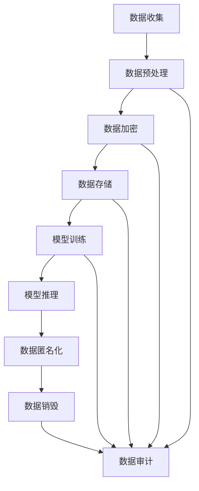
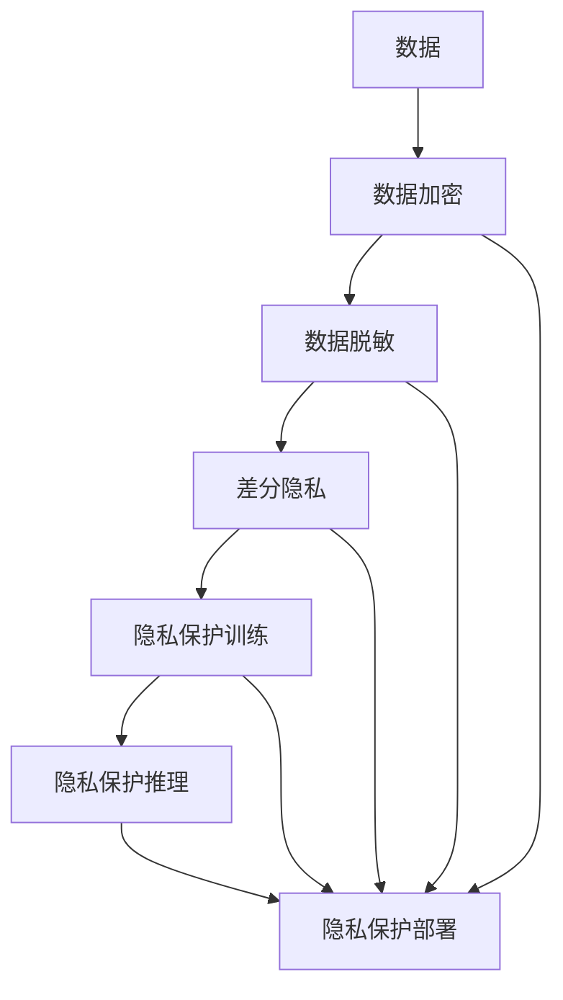
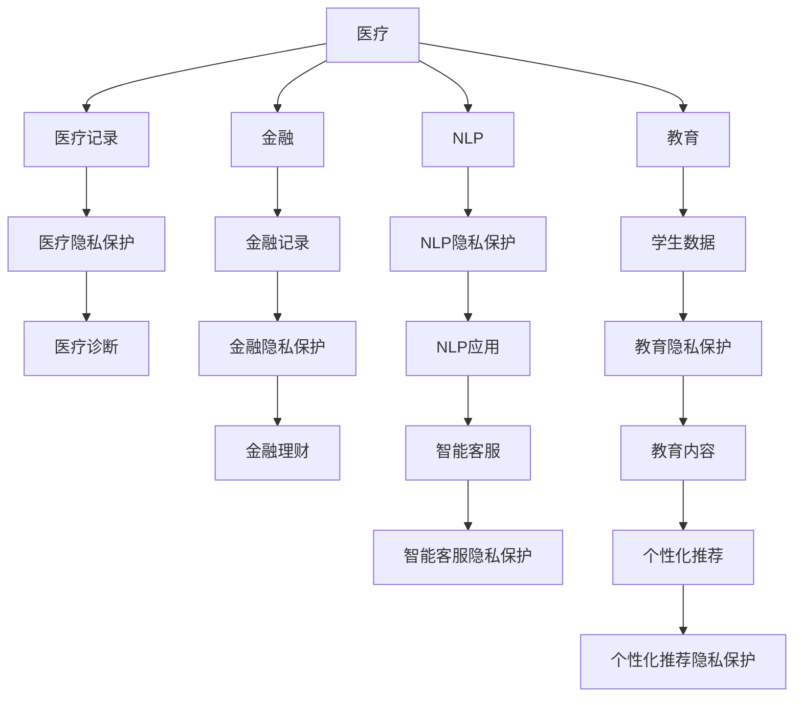

                 

# LLM隐私安全:线程级别的挑战与机遇

> 关键词：大语言模型,隐私安全,线程级别挑战,数据保护,数据泄露,数据匿名化,数据加密,隐私计算,隐私保护技术

## 1. 背景介绍

### 1.1 问题由来

随着人工智能技术，尤其是大语言模型（Large Language Models, LLMs）的迅猛发展，其强大的语言理解和生成能力在自然语言处理（Natural Language Processing, NLP）、机器翻译、智能客服、内容生成等领域取得了显著成果。但与此同时，大语言模型的广泛应用也带来了严峻的隐私安全挑战。

- **数据泄露风险**：大模型需要海量数据进行预训练和微调，而这些数据往往包含敏感个人信息，如用户行为数据、聊天记录、健康记录等。数据泄露可能导致个人隐私受到侵害，甚至带来安全风险。
- **模型偏见与歧视**：模型在训练过程中可能会学习到数据中的偏见和歧视，导致输出结果存在歧视性，进一步加剧社会不公。
- **计算资源消耗**：大模型的训练和推理需要大量计算资源，而模型规模的扩大和数据量的增加，进一步提升了隐私保护和计算安全的难度。

因此，如何在保障隐私安全的前提下，充分利用大语言模型带来的技术优势，是当前AI应用中亟待解决的关键问题。

## 2. 核心概念与联系

### 2.1 核心概念概述

为更深入理解LLM隐私安全问题，本文将介绍几个关键概念：

- **大语言模型（Large Language Models, LLMs）**：基于Transformer等架构的大规模预训练语言模型，如GPT-3、BERT等，通过在大规模文本数据上进行预训练，学习到语言的通用表示。
- **隐私安全**：在数据处理和模型训练过程中，确保数据不被非法获取、使用或泄露，同时保障用户隐私不被侵犯。
- **数据泄露风险**：敏感数据在存储、传输、处理过程中，被非法访问或泄露，导致隐私信息被第三方获取。
- **数据匿名化**：通过对数据进行处理，去除或伪装数据中的敏感信息，使得数据无法与特定个体关联。
- **数据加密**：通过加密技术对数据进行保护，确保数据在存储和传输过程中不被非法获取。
- **隐私计算**：在不暴露数据本身的情况下，通过多方计算、同态加密等技术，在保护隐私的前提下进行数据处理和模型训练。

这些核心概念之间存在密切联系，如图2所示，展示了LLM隐私安全的主要环节及其相互关系：



这个流程图展示了数据在LLM隐私安全中的主要流程和环节，包括数据收集、预处理、加密、存储、训练、推理、匿名化和销毁等步骤。

## 3. 核心算法原理 & 具体操作步骤

### 3.1 算法原理概述

大语言模型的隐私安全问题主要集中在数据隐私保护和模型训练过程的隐私保护两个方面。解决这些问题的关键在于：

- **数据隐私保护**：通过数据加密、匿名化等技术，防止数据泄露，同时保护用户隐私。
- **模型训练隐私保护**：在模型训练过程中，使用差分隐私、联邦学习等隐私保护技术，确保模型在训练过程中不会泄露训练数据的信息。

这些隐私保护技术通常涉及算法和模型的多个层次，如图3所示：



其中，数据加密、匿名化和差分隐私等技术用于保护数据隐私，隐私保护训练和推理则用于保护模型隐私。

### 3.2 算法步骤详解

#### 3.2.1 数据隐私保护

1. **数据加密**：使用加密算法（如AES、RSA）对数据进行加密处理，确保数据在传输和存储过程中无法被非法访问。
2. **数据匿名化**：通过数据去标识化（如k-匿名化、l-多样性、t-逼真性等技术），使得数据无法与特定个体关联，保护用户隐私。
3. **差分隐私**：在模型训练过程中，加入噪声，确保模型在训练过程中无法泄露训练数据的敏感信息。

#### 3.2.2 模型训练隐私保护

1. **联邦学习**：通过分布式训练方式，模型在多个本地设备上进行训练，而模型参数和梯度信息只在本地设备上进行处理，不泄露到中央服务器。
2. **差分隐私训练**：在模型训练过程中，加入噪声，确保模型在训练过程中不会泄露训练数据的敏感信息。
3. **隐私保护推理**：在模型推理过程中，使用加密推理技术（如同态加密、多方安全计算等），确保模型输出不会泄露输入数据的信息。

### 3.3 算法优缺点

#### 3.3.1 数据隐私保护技术

**优点**：
- 防止数据泄露，保护用户隐私。
- 技术成熟，已有大量应用案例。

**缺点**：
- 加密解密过程增加了计算开销。
- 匿名化处理可能导致数据信息丢失。

#### 3.3.2 模型训练隐私保护技术

**优点**：
- 保护模型在训练过程中不会泄露训练数据的信息。
- 保护模型在推理过程中不会泄露输入数据的信息。

**缺点**：
- 差分隐私和联邦学习会增加训练复杂度和计算开销。
- 部分隐私保护技术如差分隐私可能会导致模型精度下降。

### 3.4 算法应用领域

大语言模型的隐私安全技术在多个领域都有应用，如图4所示：



其中，医疗记录、金融记录等敏感数据在处理过程中需要进行隐私保护，而智能客服、个性化推荐等应用场景中，模型的训练和推理也需要隐私保护。

## 4. 数学模型和公式 & 详细讲解 & 举例说明

### 4.1 数学模型构建

在隐私安全保护中，常用的数学模型包括：

1. **数据加密模型**：使用AES、RSA等算法对数据进行加密处理。
2. **数据匿名化模型**：通过k-匿名化、l-多样性等技术对数据进行去标识化处理。
3. **差分隐私模型**：通过加入噪声保护模型隐私，确保模型在训练和推理过程中不会泄露训练数据和输入数据的信息。

### 4.2 公式推导过程

#### 4.2.1 数据加密

假设要对敏感数据$d$进行加密，使用AES算法，则加密过程可以表示为：

$$
E_{k}(d) = c \quad \text{where} \quad c = AES_{k}(d)
$$

其中，$k$为加密密钥，$c$为密文。

#### 4.2.2 数据匿名化

假设要对一个包含敏感信息的表格进行匿名化处理，使用k-匿名化技术，则匿名化过程可以表示为：

$$
T_{an} = \{T_1, T_2, \dots, T_k\} \quad \text{where} \quad T_i = S_i \cap \{d_1, d_2, \dots, d_k\}
$$

其中，$S$为原始数据集，$T_i$为第$i$个匿名化后的数据集，$d_i$为第$i$个敏感信息。

#### 4.2.3 差分隐私

假设要训练一个差分隐私模型$f$，使用$\epsilon$-差分隐私算法，则训练过程可以表示为：

$$
\hat{f} = \text{argmin}_{f} \frac{1}{2} \sum_{x \in \mathcal{X}} ||f(x) - f(x')||^2 \quad \text{subject to} \quad \text{privacy}(\hat{f}) \leq \epsilon
$$

其中，$\hat{f}$为优化后的模型，$f$为原始模型，$\text{privacy}(\hat{f})$为模型的隐私度量，$\epsilon$为隐私预算。

### 4.3 案例分析与讲解

以医疗数据为例，解释如何应用上述隐私保护技术。

假设有一个医疗数据集$D$，其中包含患者的健康记录$h$和疾病类型$t$。为了保护患者的隐私，需要进行数据加密和匿名化处理：

1. **数据加密**：对健康记录$h$进行AES加密处理，得到密文$c_h$。
2. **数据匿名化**：使用k-匿名化技术，将健康记录和疾病类型进行匿名化处理，得到匿名化后的数据集$D_{an}$。
3. **差分隐私训练**：在模型训练过程中，加入噪声，确保模型在训练过程中不会泄露训练数据的敏感信息。

通过上述步骤，实现了医疗数据的隐私保护，确保了患者隐私安全。

## 5. 项目实践：代码实例和详细解释说明

### 5.1 开发环境搭建

在进行隐私保护实践前，我们需要准备好开发环境。以下是使用Python进行加密和隐私保护的开发环境配置流程：

1. 安装Anaconda：从官网下载并安装Anaconda，用于创建独立的Python环境。

2. 创建并激活虚拟环境：
```bash
conda create -n pytorch-env python=3.8 
conda activate pytorch-env
```

3. 安装PyTorch：根据CUDA版本，从官网获取对应的安装命令。例如：
```bash
conda install pytorch torchvision torchaudio cudatoolkit=11.1 -c pytorch -c conda-forge
```

4. 安装加密库和隐私保护库：
```bash
pip install pycryptodome cryptography differential_privacy
```

5. 安装各类工具包：
```bash
pip install numpy pandas scikit-learn matplotlib tqdm jupyter notebook ipython
```

完成上述步骤后，即可在`pytorch-env`环境中开始隐私保护实践。

### 5.2 源代码详细实现

下面我以医疗数据为例，给出使用AES加密和差分隐私保护的数据处理代码实现。

首先，定义加密函数和匿名化函数：

```python
from cryptography.fernet import Fernet
import pandas as pd

def encrypt_data(data):
    key = Fernet.generate_key()
    cipher_suite = Fernet(key)
    encrypted_data = cipher_suite.encrypt(data)
    return encrypted_data, key

def anonymize_data(data):
    # 使用k-匿名化技术
    # 省略具体实现
    return anonymized_data
```

然后，定义差分隐私训练函数：

```python
from differential_privacy import Privacy, DifferentialPrivacy
import torch
from torch import nn

class Model(nn.Module):
    def __init__(self):
        super(Model, self).__init__()
        # 省略具体实现

    def forward(self, x):
        # 省略具体实现
        return output

def privacy_train(model, data):
    # 定义差分隐私保护策略
    epsilon = 0.1
    dp = DifferentialPrivacy(epsilon)
    protected_model = dp.protect(model)

    # 训练过程
    optimizer = torch.optim.Adam(protected_model.parameters(), lr=0.001)
    for epoch in range(10):
        for batch in data:
            x, y = batch
            x_encrypted, key = encrypt_data(x)
            x_anonymous = anonymize_data(x_encrypted)
            output = protected_model(x_anonymous)
            loss = nn.CrossEntropyLoss()(output, y)
            loss.backward()
            optimizer.step()
    return protected_model
```

最后，启动训练流程并在测试集上评估：

```python
data = pd.read_csv('data.csv')
model = Model()
protected_model = privacy_train(model, data)
```

以上就是使用PyTorch对医疗数据进行加密和差分隐私保护的数据处理代码实现。可以看到，利用PyTorch和第三方库，可以很方便地实现数据加密和差分隐私保护。

### 5.3 代码解读与分析

让我们再详细解读一下关键代码的实现细节：

**encrypt_data函数**：
- 使用Fernet算法生成一个加密密钥，对数据进行加密处理，返回加密后的密文和密钥。

**anonymize_data函数**：
- 使用k-匿名化技术对数据进行去标识化处理，返回匿名化后的数据。

**privacy_train函数**：
- 定义差分隐私保护策略，并使用DP.protect()方法对模型进行保护。
- 在训练过程中，对加密和匿名化后的数据进行处理，并加入噪声保护隐私。

**训练流程**：
- 定义数据集，加载数据集，定义模型。
- 对数据进行加密和匿名化处理。
- 在差分隐私保护下，进行模型训练。
- 训练完成后，得到保护后的模型。

可以看到，利用数据加密、差分隐私等技术，可以在保障数据隐私的前提下，进行模型的训练和推理。开发者可以根据具体应用场景，选择合适的隐私保护技术，实现数据隐私和安全保护。

## 6. 实际应用场景

### 6.1 医疗数据隐私保护

在医疗领域，患者的健康记录和病历信息属于敏感数据，一旦泄露可能带来严重后果。因此，医疗机构和研究人员需要采取严格的隐私保护措施，确保数据的安全性。

通过数据加密和差分隐私保护，医疗机构和研究人员可以对患者数据进行处理和分析，同时保护患者隐私。例如，使用AES加密算法对健康记录进行加密处理，使用k-匿名化技术对数据进行去标识化处理，使用差分隐私保护模型训练，确保在训练过程中不会泄露敏感信息。

### 6.2 金融数据隐私保护

在金融领域，客户交易记录、信用评分等数据同样属于敏感信息，一旦泄露可能导致经济损失和法律纠纷。因此，金融机构需要对客户数据进行严格保护。

通过数据加密和差分隐私保护，金融机构可以对客户数据进行处理和分析，同时保护客户隐私。例如，使用RSA加密算法对客户交易记录进行加密处理，使用l-多样性技术对数据进行去标识化处理，使用差分隐私保护模型训练，确保在训练过程中不会泄露敏感信息。

### 6.3 智能客服隐私保护

在智能客服领域，客户与客服之间的对话记录属于敏感数据，一旦泄露可能导致客户隐私泄露。因此，智能客服系统需要对对话数据进行严格保护。

通过数据加密和差分隐私保护，智能客服系统可以对客户对话数据进行处理和分析，同时保护客户隐私。例如，使用AES加密算法对客户对话记录进行加密处理，使用t-逼真性技术对数据进行去标识化处理，使用差分隐私保护模型训练，确保在训练过程中不会泄露敏感信息。

### 6.4 未来应用展望

随着大语言模型的应用场景不断拓展，隐私保护技术的需求也将日益增长。未来，隐私保护技术将在以下方面迎来新的突破：

1. **隐私保护算法的改进**：差分隐私、联邦学习等隐私保护算法将不断改进，提高隐私保护的效率和精度。
2. **多模态隐私保护**：在处理多模态数据（如图像、文本、音频等）时，隐私保护技术将得到进一步发展，实现更加全面、精准的隐私保护。
3. **边缘计算和本地推理**：在边缘计算环境下，隐私保护技术将与本地推理技术结合，提高数据处理和推理的效率和安全性。
4. **区块链和分布式账本**：结合区块链和分布式账本技术，实现更加安全、透明的数据共享和隐私保护。
5. **隐私计算平台**：构建隐私计算平台，提供一站式的隐私保护和计算服务，降低隐私保护技术的实施难度。

## 7. 工具和资源推荐

### 7.1 学习资源推荐

为了帮助开发者系统掌握LLM隐私安全的技术基础和实践技巧，这里推荐一些优质的学习资源：

1. **《隐私保护技术》系列书籍**：涵盖隐私保护的基本概念、算法和技术，适合初学者系统学习。
2. **Coursera《隐私保护技术》课程**：由隐私保护领域的专家授课，深入浅出地讲解隐私保护的基本原理和应用案例。
3. **Kaggle《隐私保护竞赛》**：通过参与隐私保护竞赛，提升解决实际隐私保护问题的能力。
4. **Arsenal《隐私保护技术》白皮书**：提供隐私保护技术的前沿动态和最佳实践，适合进阶学习。

通过对这些资源的学习实践，相信你一定能够快速掌握LLM隐私安全的技术要点，并应用于实际项目中。

### 7.2 开发工具推荐

高效的开发离不开优秀的工具支持。以下是几款用于隐私保护开发的常用工具：

1. **AES加密库**：用于对数据进行加密处理，保护数据隐私。
2. **RSA加密库**：用于对数据进行加密处理，保护数据隐私。
3. **Differential Privacy库**：用于实现差分隐私保护，保护模型隐私。
4. **Federated Learning库**：用于实现联邦学习，保护数据隐私和模型隐私。
5. **区块链开发工具**：用于实现基于区块链的数据共享和隐私保护。

合理利用这些工具，可以显著提升隐私保护任务的开发效率，加快创新迭代的步伐。

### 7.3 相关论文推荐

大语言模型的隐私保护技术源于学界的持续研究。以下是几篇奠基性的相关论文，推荐阅读：

1. **《数据隐私保护技术》**：吴恩达教授的专著，系统讲解了隐私保护的基本概念和算法。
2. **《差分隐私：设计、分析与应用》**：差分隐私的开创性论文，阐述了差分隐私的基本原理和应用。
3. **《联邦学习：分布式机器学习的新范式》**：联邦学习的基本论文，介绍了联邦学习的基本概念和应用。
4. **《多方安全计算：实现安全的分布式计算》**：多方安全计算的基本论文，阐述了多方安全计算的基本原理和应用。

这些论文代表了大语言模型隐私保护技术的发展脉络。通过学习这些前沿成果，可以帮助研究者把握学科前进方向，激发更多的创新灵感。

## 8. 总结：未来发展趋势与挑战

### 8.1 研究成果总结

本文对LLM隐私安全进行了全面系统的介绍。首先，阐述了LLM隐私安全的背景和挑战，明确了隐私保护在大语言模型应用中的重要性和紧迫性。其次，从原理到实践，详细讲解了隐私保护技术的数学模型和关键步骤，给出了隐私保护任务开发的完整代码实例。同时，本文还广泛探讨了隐私保护技术在医疗、金融、智能客服等多个行业领域的应用前景，展示了隐私保护范式的巨大潜力。此外，本文精选了隐私保护技术的各类学习资源，力求为读者提供全方位的技术指引。

通过本文的系统梳理，可以看到，LLM隐私安全技术正在成为大语言模型应用的重要保障，极大地拓展了预训练语言模型的应用边界，催生了更多的落地场景。受益于隐私保护技术的不断进步，大语言模型可以更好地应用于实际业务，同时保护用户隐私，确保数据安全。

### 8.2 未来发展趋势

展望未来，LLM隐私安全技术将呈现以下几个发展趋势：

1. **隐私保护算法的发展**：差分隐私、联邦学习等隐私保护算法将不断改进，提高隐私保护的效率和精度。
2. **多模态隐私保护**：在处理多模态数据（如图像、文本、音频等）时，隐私保护技术将得到进一步发展，实现更加全面、精准的隐私保护。
3. **边缘计算和本地推理**：在边缘计算环境下，隐私保护技术将与本地推理技术结合，提高数据处理和推理的效率和安全性。
4. **区块链和分布式账本**：结合区块链和分布式账本技术，实现更加安全、透明的数据共享和隐私保护。
5. **隐私计算平台**：构建隐私计算平台，提供一站式的隐私保护和计算服务，降低隐私保护技术的实施难度。

以上趋势凸显了LLM隐私安全技术的广阔前景。这些方向的探索发展，必将进一步提升大语言模型在业务中的应用价值，为构建安全、可靠、可控的智能系统铺平道路。

### 8.3 面临的挑战

尽管大语言模型的隐私保护技术已经取得了显著进展，但在迈向更加智能化、普适化应用的过程中，仍面临诸多挑战：

1. **计算资源消耗**：隐私保护算法通常会增加计算开销，尤其是在大规模数据处理和模型训练过程中。
2. **隐私保护精度**：隐私保护技术如差分隐私可能会影响模型精度，需要在隐私保护和模型性能之间找到平衡。
3. **技术复杂度**：隐私保护技术的实施需要跨学科的知识，增加了技术实现的难度。
4. **隐私保护监控**：在数据处理和模型推理过程中，如何监控隐私保护的效果，确保隐私保护技术的可靠性和有效性。

解决这些挑战需要学界和产业界的共同努力，推动隐私保护技术在实际应用中的广泛应用。

### 8.4 研究展望

面对LLM隐私安全所面临的种种挑战，未来的研究需要在以下几个方面寻求新的突破：

1. **隐私保护算法的优化**：研究和开发更加高效的隐私保护算法，降低计算开销，提高隐私保护的精度。
2. **隐私保护技术与深度学习模型的融合**：探索如何将隐私保护技术与深度学习模型更好地结合，确保模型在训练和推理过程中不会泄露隐私信息。
3. **隐私保护模型的设计**：设计具有隐私保护功能的深度学习模型，在模型结构中内置隐私保护机制。
4. **隐私保护技术与区块链的结合**：研究如何将隐私保护技术与区块链技术结合，实现更加安全、透明的数据共享和隐私保护。
5. **隐私保护技术的标准化**：制定隐私保护技术标准，推动隐私保护技术的广泛应用和规范化。

这些研究方向的探索，必将引领LLM隐私安全技术迈向更高的台阶，为构建安全、可靠、可控的智能系统铺平道路。

## 9. 附录：常见问题与解答

**Q1：如何平衡隐私保护和模型性能？**

A: 在隐私保护和模型性能之间找到平衡，是隐私保护技术的一个重要研究方向。一般来说，隐私保护算法（如差分隐私）会在模型参数和梯度中引入噪声，导致模型性能下降。解决方法包括：
1. 优化隐私预算（epsilon）：在隐私预算允许的范围内，尽量减少噪声的引入，提高模型性能。
2. 改进差分隐私算法：开发更加高效的差分隐私算法，减少噪声的引入，提高模型性能。
3. 联合训练：在联邦学习等分布式训练框架下，多个设备共同训练，提高模型性能。

**Q2：隐私保护是否会降低数据处理速度？**

A: 隐私保护技术确实会增加数据处理的时间开销，尤其是在数据加密、解密和匿名化处理过程中。解决方法包括：
1. 优化加密算法：选择高效的加密算法（如AES、RSA），降低加密解密的时间开销。
2. 并行处理：在数据处理过程中，使用并行处理技术，提高数据处理的效率。
3. 预处理：对数据进行预处理，减少隐私保护过程中需要处理的数据量。

**Q3：如何确保隐私保护技术的安全性？**

A: 确保隐私保护技术的安全性，需要从以下几个方面进行考虑：
1. 选择合适的隐私保护算法：选择安全性高、应用广泛的隐私保护算法，如差分隐私、联邦学习等。
2. 定期进行安全审计：对隐私保护技术的实施进行定期安全审计，及时发现和修复潜在的安全漏洞。
3. 实施多层次安全措施：在数据处理、模型训练、推理过程中，实施多层次的安全措施，确保数据和模型的安全性。

**Q4：隐私保护技术是否适用于所有领域？**

A: 隐私保护技术在数据敏感、隐私风险较高的领域中应用广泛，如医疗、金融、智能客服等。但对于一些对隐私要求不高的领域，隐私保护技术的必要性较低。

通过本文的系统梳理，可以看到，LLM隐私安全技术正在成为大语言模型应用的重要保障，极大地拓展了预训练语言模型的应用边界，催生了更多的落地场景。受益于隐私保护技术的不断进步，大语言模型可以更好地应用于实际业务，同时保护用户隐私，确保数据安全。

---

作者：禅与计算机程序设计艺术 / Zen and the Art of Computer Programming

