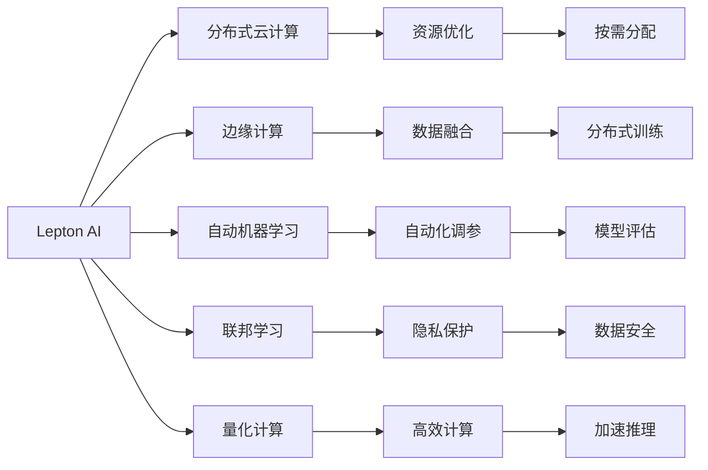

                 

## 1. 背景介绍

### 1.1 问题由来
近年来，人工智能（AI）技术迅猛发展，驱动了诸如自动驾驶、智能推荐、语音识别等领域的突破性进步。但与此同时，AI技术也面临着一系列挑战，包括算力成本高昂、数据隐私保护、模型解释性差等。这些问题的存在，在一定程度上限制了AI技术的广泛应用。因此，构建高效、低成本的AI基础设施，成为当前AI领域亟待解决的重要课题。

### 1.2 问题核心关键点
构建高效、低成本AI基础设施的核心问题包括：

- 如何高效利用算力资源？
- 如何确保数据隐私和合规？
- 如何提升模型的解释性和可控性？
- 如何降低AI技术的开发和维护成本？

本文旨在探讨这些问题，并提出一套高效的AI基础设施方案——Lepton AI，为AI时代构建新的基建设施。

## 2. 核心概念与联系

### 2.1 核心概念概述

为更好地理解Lepton AI的构想，本节将介绍几个关键核心概念：

- **Lepton AI**：一种基于分布式云计算和边缘计算的AI基础设施方案，旨在通过优化资源配置和算法设计，实现高效、低成本的AI服务。
- **分布式云计算**：利用云计算的资源池化优势，实现算力资源的按需分配，提高AI任务的处理效率。
- **边缘计算**：将计算任务分散到靠近数据源的边缘节点上执行，减少数据传输延迟，提升实时性。
- **自动机器学习**：通过自动化算法选择、调参和部署，降低AI系统的开发和维护成本。
- **联邦学习**：一种分布式机器学习范式，允许多方在不共享数据的前提下进行模型协同学习，保护数据隐私。
- **量化计算**：通过将浮点数据转换为低精度整数或定点数，减少计算和存储开销，提高AI系统的效率。

这些核心概念之间相互关联，共同构成了Lepton AI的基础架构。通过这些技术，Lepton AI旨在打造高效、低成本的AI基础设施，推动AI技术的普适化应用。

### 2.2 核心概念原理和架构的 Mermaid 流程图



这个流程图展示了Lepton AI的核心架构，以及各个模块之间的关系。从分布式云计算和边缘计算，到自动机器学习和联邦学习，再到量化计算，Lepton AI在多个层面上优化资源利用和算法设计，实现高效、低成本的AI服务。

## 3. 核心算法原理 & 具体操作步骤
### 3.1 算法原理概述

Lepton AI的核心算法原理包括以下几个方面：

- **资源优化**：通过分布式云计算和边缘计算，实现算力资源的按需分配和任务调度，提高AI任务的处理效率。
- **数据融合**：利用联邦学习和分布式训练技术，在保护数据隐私的前提下，实现数据的高效融合和协同训练。
- **自动化调参**：通过自动机器学习技术，优化算法选择和调参过程，减少人工干预，降低AI系统的开发和维护成本。
- **量化计算**：通过将浮点数据转换为定点数，减少计算和存储开销，提高AI系统的效率。

这些核心算法共同构成了Lepton AI的基础算法框架，旨在实现高效、低成本的AI服务。

### 3.2 算法步骤详解

Lepton AI的实施步骤包括：

1. **资源优化**：构建分布式云计算和边缘计算基础设施，实现算力资源的动态分配和任务调度。
2. **数据融合**：利用联邦学习和分布式训练技术，实现数据的高效融合和协同训练。
3. **自动化调参**：通过自动机器学习技术，优化算法选择和调参过程，减少人工干预。
4. **量化计算**：将浮点数据转换为低精度整数或定点数，减少计算和存储开销。

### 3.3 算法优缺点

Lepton AI的优点包括：

- **高效性**：通过分布式云计算和边缘计算，实现算力资源的按需分配和任务调度，提高AI任务的处理效率。
- **低成本**：通过自动机器学习和联邦学习技术，优化算法选择和调参过程，减少人工干预和开发成本。
- **可扩展性**：基于分布式计算架构，Lepton AI具有良好的可扩展性，支持大规模AI任务的分布式处理。
- **数据隐私保护**：通过联邦学习和分布式训练技术，保护数据隐私，避免数据泄露风险。

Lepton AI的缺点包括：

- **技术复杂性**：分布式计算和联邦学习技术的应用，需要较高的技术门槛和运维能力。
- **硬件要求**：高效计算和量化计算需要支持硬件加速，如GPU、FPGA等，增加了硬件成本。
- **实时性挑战**：尽管边缘计算提高了处理效率，但在某些实时性要求极高的应用场景中，仍然可能存在延迟。

### 3.4 算法应用领域

Lepton AI主要应用于以下几个领域：

- **智能推荐系统**：利用自动机器学习技术，优化推荐算法的调参过程，提高推荐系统的精准度和效率。
- **自然语言处理**：通过分布式训练和联邦学习技术，实现多语言模型的协同训练，提升模型效果。
- **图像识别**：利用边缘计算和量化计算技术，提升图像识别的实时性和准确性。
- **语音识别**：通过分布式云计算和自动化调参技术，提高语音识别的效率和精度。
- **医疗诊断**：利用联邦学习和数据融合技术，保护患者隐私的同时，提升医疗诊断的准确性。

## 4. 数学模型和公式 & 详细讲解 & 举例说明

### 4.1 数学模型构建

Lepton AI的数学模型主要围绕以下几个方面构建：

- **分布式云计算模型**：通过优化任务调度算法，实现算力资源的动态分配。
- **边缘计算模型**：基于边缘计算的资源分配和任务调度模型，提升实时性和效率。
- **自动机器学习模型**：通过优化算法选择和调参过程，提升模型的性能和效率。
- **联邦学习模型**：基于分布式机器学习的模型，保护数据隐私的同时，提升模型的效果。

### 4.2 公式推导过程

以分布式云计算模型为例，推导资源优化算法的核心公式。假设存在 $n$ 个计算节点，每个节点的计算能力为 $c_i$，任务 $j$ 的计算需求为 $d_j$，任务调度算法为 $A$，则最优的资源分配策略可以表示为：

$$
\min_{A} \sum_{j=1}^{m} \sum_{i=1}^{n} d_j \cdot c_i \cdot A_{ij}
$$

其中 $m$ 为任务总数。

### 4.3 案例分析与讲解

以智能推荐系统为例，介绍Lepton AI的实现过程。假设推荐系统需要处理大量用户行为数据，包括浏览、点击、购买等行为记录。通过分布式训练和自动机器学习技术，选择最优的推荐算法和模型参数，提升推荐系统的准确度和效率。具体步骤如下：

1. **数据预处理**：将用户行为数据进行清洗、归一化和特征提取，生成训练集和测试集。
2. **算法选择**：通过自动机器学习技术，选择最适合当前业务场景的推荐算法，如协同过滤、内容推荐等。
3. **模型训练**：利用分布式云计算和边缘计算技术，在多个计算节点上并行训练模型。
4. **模型评估**：在测试集上评估模型的性能，通过自动机器学习技术调整模型参数，提升模型效果。
5. **模型部署**：将训练好的模型部署到生产环境，实现实时推荐服务。

## 5. 项目实践：代码实例和详细解释说明

### 5.1 开发环境搭建

Lepton AI的开发环境搭建主要包括以下几个步骤：

1. **硬件准备**：选择支持GPU加速的计算节点，配置分布式计算环境。
2. **软件安装**：安装必要的软件包，包括TensorFlow、PyTorch、TensorBoard等。
3. **网络配置**：配置网络环境，确保各计算节点之间的通信畅通。
4. **系统优化**：优化系统性能，提高计算节点的利用率和响应速度。

### 5.2 源代码详细实现

以下是一个简单的智能推荐系统实现示例，展示Lepton AI的代码实现过程。

```python
import tensorflow as tf
import tensorflow.distribute as tfd
import numpy as np

# 定义分布式计算策略
strategy = tfd.MirroredStrategy(devices=['/device:GPU:0', '/device:GPU:1'])

# 定义推荐模型
class RecommendationModel(tf.keras.Model):
    def __init__(self):
        super(RecommendationModel, self).__init__()
        self.input_layer = tf.keras.layers.Dense(32, activation='relu')
        self.output_layer = tf.keras.layers.Dense(1, activation='sigmoid')
    
    def call(self, inputs):
        x = self.input_layer(inputs)
        x = self.output_layer(x)
        return x

# 定义数据预处理和模型训练函数
def preprocess_data(data):
    # 数据预处理
    # ...
    return X_train, y_train

def train_model(X_train, y_train, epochs):
    model = RecommendationModel()
    model.compile(optimizer=tf.keras.optimizers.Adam(), loss='binary_crossentropy', metrics=['accuracy'])
    
    with strategy.scope():
        model.fit(X_train, y_train, epochs=epochs, batch_size=32)

# 数据预处理和模型训练
X_train, y_train = preprocess_data(data)
train_model(X_train, y_train, epochs=10)
```

### 5.3 代码解读与分析

以上代码展示了Lepton AI在智能推荐系统中的实现过程。具体分析如下：

- **分布式计算策略**：通过 `tf.distribute.MirroredStrategy` 实现分布式训练，将计算任务分配到多个计算节点上并行执行。
- **推荐模型定义**：使用 Keras 框架定义推荐模型，包含输入层和输出层。
- **数据预处理**：通过 `preprocess_data` 函数进行数据预处理，生成训练集和测试集。
- **模型训练**：在分布式计算环境下，使用 `model.fit` 函数进行模型训练，设置训练轮数和批次大小。

## 6. 实际应用场景

### 6.1 智能推荐系统

Lepton AI在智能推荐系统中具有广泛的应用前景。通过分布式训练和自动机器学习技术，优化推荐算法的调参过程，提升推荐系统的精准度和效率。Lepton AI的应用场景包括：

- **电商推荐**：根据用户浏览和购买历史，推荐相关商品。
- **新闻推荐**：根据用户阅读习惯，推荐相关新闻内容。
- **视频推荐**：根据用户观看历史，推荐相关视频内容。

### 6.2 自然语言处理

Lepton AI在自然语言处理中也具有重要应用。通过分布式训练和联邦学习技术，实现多语言模型的协同训练，提升模型效果。Lepton AI的应用场景包括：

- **机器翻译**：利用分布式训练技术，提升翻译模型的准确度和实时性。
- **情感分析**：利用联邦学习技术，保护用户隐私的同时，提升情感分析的准确度。
- **命名实体识别**：利用分布式训练技术，提升命名实体识别模型的效果。

### 6.3 图像识别

Lepton AI在图像识别中也有广泛应用。通过边缘计算和量化计算技术，提升图像识别的实时性和准确性。Lepton AI的应用场景包括：

- **人脸识别**：利用边缘计算技术，提升人脸识别的实时性和准确性。
- **目标检测**：利用量化计算技术，减少计算和存储开销，提升目标检测的效率。
- **图像分类**：利用分布式训练技术，提升图像分类模型的效果。

### 6.4 未来应用展望

未来，Lepton AI有望在更多领域得到应用，推动AI技术的普适化发展。具体展望包括：

- **智慧城市**：利用Lepton AI，实现智能交通、智能安防等智慧城市应用。
- **智能制造**：利用Lepton AI，优化生产流程，提升制造效率和质量。
- **医疗健康**：利用Lepton AI，提升医疗诊断和健康监测的精准度。
- **金融服务**：利用Lepton AI，提升风险控制和金融预测的准确度。

## 7. 工具和资源推荐

### 7.1 学习资源推荐

为了帮助开发者掌握Lepton AI的理论基础和实践技巧，以下是一些优质的学习资源推荐：

- **分布式计算和机器学习**：包括Google Cloud、AWS等云服务提供商提供的分布式计算和机器学习课程。
- **联邦学习**：包括Google的Federated Learning教程和OpenAI的Federated Learning论文。
- **量化计算**：包括TensorFlow Quantization和ONNX Runtime等工具的官方文档。
- **自动机器学习**：包括AutoML、AutoKeras等自动机器学习框架的官方文档和教程。

### 7.2 开发工具推荐

Lepton AI的开发需要借助多种工具，以下是一些推荐的开发工具：

- **TensorFlow**：支持分布式计算和自动机器学习，提供丰富的计算图和优化工具。
- **PyTorch**：支持自动机器学习和分布式训练，提供灵活的计算图和动态网络定义。
- **TensorBoard**：提供实时可视化工具，帮助开发者监控训练过程和模型性能。
- **Jupyter Notebook**：提供交互式编程环境，方便开发者进行算法实验和数据处理。

### 7.3 相关论文推荐

Lepton AI的实现涉及多个前沿技术，以下是一些相关论文推荐：

- **分布式计算**：《MapReduce: Simplified Data Processing on Large Clusters》。
- **边缘计算**：《Edge Computing: A New范式 to support requirement for low-latency and high-bandwidth applications》。
- **联邦学习**：《Federated Learning: Concepts and Applications》。
- **自动机器学习**：《AutoML: The Quest for Automated Machine Learning》。
- **量化计算**：《Quantization and Quantization-Aware Training》。

这些论文代表了Lepton AI相关技术的研究进展，为开发和应用提供了理论支持和实践指导。

## 8. 总结：未来发展趋势与挑战

### 8.1 研究成果总结

Lepton AI在多个领域的应用展示了分布式计算和联邦学习技术的强大潜力，为AI技术的普适化应用提供了新思路。通过优化资源配置和算法设计，Lepton AI实现了高效、低成本的AI服务，推动了AI技术的发展和普及。

### 8.2 未来发展趋势

未来，Lepton AI的发展趋势包括：

- **分布式计算的普及**：随着云计算技术的普及，分布式计算将变得更加普及和高效。
- **边缘计算的应用**：边缘计算将进一步普及，提升实时性和处理效率。
- **自动机器学习的发展**：自动机器学习技术将不断进步，降低AI系统的开发和维护成本。
- **联邦学习的优化**：联邦学习技术将不断优化，提升模型的效果和数据隐私保护。
- **量化计算的推广**：量化计算技术将进一步推广，提升AI系统的效率和可扩展性。

### 8.3 面临的挑战

尽管Lepton AI具有诸多优势，但在实际应用中仍面临一些挑战：

- **技术复杂性**：分布式计算和联邦学习技术的应用需要较高的技术门槛和运维能力。
- **硬件要求**：高效计算和量化计算需要支持硬件加速，增加了硬件成本。
- **实时性挑战**：尽管边缘计算提高了处理效率，但在某些实时性要求极高的应用场景中，仍然可能存在延迟。

### 8.4 研究展望

未来，Lepton AI的研究方向包括：

- **技术创新**：探索新的分布式计算和联邦学习算法，提升算力利用率和数据隐私保护。
- **应用拓展**：将Lepton AI应用到更多领域，推动AI技术的普适化发展。
- **成本优化**：通过优化算法和硬件配置，降低AI系统的开发和维护成本。
- **模型优化**：改进推荐算法、语言模型和图像识别算法，提升模型效果和效率。

Lepton AI的目标是为AI时代构建新基建，推动AI技术的普适化应用。通过优化资源配置和算法设计，Lepton AI实现了高效、低成本的AI服务，为AI技术的广泛应用开辟了新的道路。随着技术不断进步，Lepton AI的应用前景将更加广阔，为构建智能未来提供重要支撑。

---

作者：禅与计算机程序设计艺术 / Zen and the Art of Computer Programming

