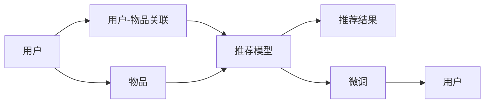

                 

# M6-Rec: 开放域推荐框架

> 关键词：推荐系统, 开放域推荐, 基于图模型, 矩阵分解, 多任务学习, 注意力机制, 模型优化, 推荐应用

## 1. 背景介绍

### 1.1 问题由来
在当今信息爆炸的时代，如何从海量数据中快速、准确地为用户推荐感兴趣的物品，成为了各大互联网平台的重要研究方向。推荐系统（Recommendation System）通过分析用户的历史行为数据，预测用户对未观测物品的喜好程度，实现个性化推荐。推荐系统广泛应用于电商、新闻、视频、音乐等领域，极大地提升了用户体验和平台流量。

然而，现有的推荐系统往往存在以下问题：
- **数据稀疏性**：用户历史行为数据不足，难以准确预测其兴趣。
- **模型泛化性差**：推荐系统通常面向特定场景，难以跨领域推广。
- **交互模式单一**：推荐系统主要依赖显式反馈，忽视隐式反馈（如浏览、点击等）。
- **冷启动问题**：新用户或新物品无历史数据，推荐困难。

为了解决这些问题，近年来提出了开放域推荐（OtR）框架，即通过预训练模型和大规模数据，构建通用的推荐模型，在特定任务上通过微调实现高性能推荐。M6-Rec便是一个基于图模型的大规模推荐框架，其核心思想是通过预训练模型学习物品-物品关联，再通过特定任务数据进行微调，从而提升推荐性能。

## 2. 核心概念与联系

### 2.1 核心概念概述

在介绍M6-Rec的原理之前，我们先了解几个核心概念：

- **推荐系统**：根据用户历史行为或属性信息，为用户推荐其感兴趣物品的系统。
- **开放域推荐（OtR）**：通过预训练模型和大规模数据构建通用推荐模型，在特定任务上通过微调实现高性能推荐。
- **基于图模型的推荐**：通过构建用户-物品关联的图模型，利用图神经网络（GNN）等方法进行推荐。
- **矩阵分解**：通过低秩矩阵分解方法，将用户-物品评分矩阵分解为低维用户和物品的表示，用于推荐。
- **多任务学习**：在同一模型上，同时学习多个推荐任务，提升推荐性能。
- **注意力机制**：在推荐模型中，通过引入注意力机制，关注用户行为中更重要的特征。
- **模型优化**：通过多种优化方法（如AdamW、SGD等），提升推荐模型的收敛速度和性能。

### 2.2 核心概念原理和架构的 Mermaid 流程图



### 2.3 核心概念之间的关系

- **用户**：推荐系统服务的对象，通过历史行为数据被建模。
- **物品**：推荐系统推荐的对象，通过特征数据被建模。
- **用户-物品关联**：用户对物品的评分或偏好，用于构建推荐模型。
- **推荐模型**：构建在用户-物品关联之上，学习用户-物品的关联特征，生成推荐结果。
- **推荐结果**：基于用户-物品关联和推荐模型，生成用户感兴趣的物品。
- **微调**：在推荐模型上，针对特定任务进行优化，提升推荐性能。

## 3. 核心算法原理 & 具体操作步骤
### 3.1 算法原理概述

M6-Rec的核心算法基于图模型和矩阵分解方法，通过预训练模型学习用户-物品关联，再通过微调在特定任务上实现高性能推荐。其核心流程如下：

1. **预训练**：通过大规模数据训练预训练模型，学习用户-物品关联的隐含特征。
2. **图模型构建**：将用户-物品关联构建为图模型，利用图神经网络（GNN）等方法进行表示学习。
3. **矩阵分解**：将用户-物品关联矩阵进行低秩矩阵分解，生成低维用户和物品的表示。
4. **多任务学习**：在同一模型上，同时学习多个推荐任务，提升推荐性能。
5. **注意力机制**：通过引入注意力机制，关注用户行为中更重要的特征，提升推荐效果。
6. **微调**：在预训练模型上，针对特定任务进行微调，提升推荐效果。

### 3.2 算法步骤详解

#### 3.2.1 预训练

预训练是M6-Rec框架的第一步，目的是学习用户-物品关联的隐含特征。具体步骤如下：

1. **数据准备**：收集大规模用户行为数据，构建用户-物品关联矩阵。
2. **图模型构建**：将用户-物品关联矩阵转换为图模型，每个用户和物品作为节点，每条用户-物品关系作为边。
3. **预训练模型选择**：选择适当的预训练模型（如GNN），对图模型进行预训练。
4. **预训练目标**：最小化损失函数，学习用户-物品关联的隐含特征。

#### 3.2.2 图模型构建

图模型构建是M6-Rec框架的关键步骤，用于学习用户-物品关联的隐含特征。具体步骤如下：

1. **图模型定义**：定义用户-物品关联的图模型，包括节点和边。
2. **图神经网络选择**：选择适当的图神经网络（GNN），用于对图模型进行表示学习。
3. **图卷积层**：利用图卷积层（GCN）等方法，对图模型进行表示学习。
4. **图模型优化**：最小化损失函数，优化图模型参数。

#### 3.2.3 矩阵分解

矩阵分解是M6-Rec框架的重要步骤，用于生成低维用户和物品的表示。具体步骤如下：

1. **矩阵分解方法选择**：选择适当的矩阵分解方法（如SVD），对用户-物品关联矩阵进行低秩分解。
2. **低维表示生成**：生成用户和物品的低维表示，用于推荐模型。
3. **低维表示优化**：最小化损失函数，优化低维表示参数。

#### 3.2.4 多任务学习

多任务学习是M6-Rec框架的创新点，用于提升推荐性能。具体步骤如下：

1. **多任务定义**：定义多个推荐任务，如召回率、准确率、个性化等。
2. **多任务模型选择**：选择适当的多任务模型（如MTL），用于对多个推荐任务进行联合学习。
3. **多任务学习**：在同一模型上，同时学习多个推荐任务，提升推荐性能。

#### 3.2.5 注意力机制

注意力机制是M6-Rec框架的重要组成部分，用于关注用户行为中更重要的特征。具体步骤如下：

1. **注意力机制选择**：选择适当的注意力机制（如Softmax），用于对用户行为进行加权。
2. **注意力机制训练**：最小化损失函数，优化注意力机制参数。
3. **注意力机制应用**：在推荐模型中引入注意力机制，提升推荐效果。

#### 3.2.6 微调

微调是M6-Rec框架的最后一步，用于提升特定任务的推荐性能。具体步骤如下：

1. **微调数据准备**：准备特定任务的标注数据集，如商品推荐中的用户评分。
2. **微调模型选择**：选择适当的微调模型，如线性回归模型。
3. **微调目标**：最小化损失函数，优化微调模型参数。
4. **微调结果生成**：基于微调模型，生成推荐结果。

### 3.3 算法优缺点

#### 3.3.1 优点

M6-Rec框架具有以下优点：

1. **泛化性强**：通过预训练模型学习通用用户-物品关联，适用于不同领域和场景。
2. **高效推荐**：利用图模型和矩阵分解方法，快速生成推荐结果。
3. **多任务学习**：在同一模型上，同时学习多个推荐任务，提升推荐性能。
4. **注意力机制**：通过引入注意力机制，关注用户行为中更重要的特征。
5. **微调灵活**：利用特定任务数据进行微调，提升推荐效果。

#### 3.3.2 缺点

M6-Rec框架也存在以下缺点：

1. **预训练数据需求高**：需要大规模数据进行预训练，对数据获取成本较高。
2. **模型复杂度高**：预训练和微调模型复杂度高，计算资源需求大。
3. **冷启动问题**：新用户或新物品无历史数据，推荐困难。
4. **动态变化**：用户兴趣和物品特征动态变化，模型需要定期更新。

### 3.4 算法应用领域

M6-Rec框架在多个领域都有广泛应用，如电商、新闻、视频、音乐等。以下是几个典型应用场景：

1. **电商推荐**：推荐系统为用户推荐其感兴趣的商品，提升购物体验和平台流量。
2. **新闻推荐**：根据用户历史浏览记录，推荐用户感兴趣的新闻文章，提升用户粘性和平台活跃度。
3. **视频推荐**：推荐系统为用户推荐其感兴趣的视频内容，提升视频平台的用户留存率。
4. **音乐推荐**：推荐系统为用户推荐其感兴趣的音乐，提升音乐平台的用户满意度和留存率。

## 4. 数学模型和公式 & 详细讲解  
### 4.1 数学模型构建

M6-Rec框架的数学模型主要包括以下几个部分：

- **用户-物品关联矩阵**：定义为用户-物品评分矩阵 $X$，其中 $X_{ij}$ 表示用户 $i$ 对物品 $j$ 的评分。
- **图模型**：将用户-物品关联矩阵 $X$ 转换为图模型，定义为用户-物品关系图 $G=(U, I, E)$，其中 $U$ 为所有用户，$I$ 为所有物品，$E$ 为所有用户-物品关系。
- **预训练模型**：使用图神经网络（GNN）对图模型进行预训练，生成用户-物品关联的隐含特征 $H$。
- **低维表示**：将用户-物品关联矩阵 $X$ 进行低秩矩阵分解，生成低维用户和物品的表示 $U$ 和 $I$。
- **多任务学习**：在同一模型上，同时学习多个推荐任务，定义任务权重 $w_t$。
- **注意力机制**：通过引入注意力机制，对用户行为进行加权，生成推荐结果 $Y$。
- **微调模型**：在特定任务上，使用线性回归模型进行微调，生成推荐结果 $Y_{\text{mid}}$。

### 4.2 公式推导过程

#### 4.2.1 预训练

预训练的目标是最小化损失函数 $L$，学习用户-物品关联的隐含特征 $H$。

假设预训练模型为 $M_{\theta}$，其参数为 $\theta$，则预训练的损失函数为：

$$
L_{\text{pre}} = \frac{1}{N} \sum_{i,j} \ell(M_{\theta}(X_{ij}), Y_{ij})
$$

其中 $Y_{ij}$ 为用户 $i$ 对物品 $j$ 的真实评分。

#### 4.2.2 图模型构建

图模型构建的目标是最小化损失函数 $L$，学习用户-物品关联的隐含特征 $H$。

假设图神经网络为 $GNN$，则图模型的损失函数为：

$$
L_{\text{graph}} = \frac{1}{N} \sum_{i,j} \ell(GNN(X_{ij}), Y_{ij})
$$

#### 4.2.3 矩阵分解

矩阵分解的目标是最小化损失函数 $L$，生成低维用户和物品的表示 $U$ 和 $I$。

假设矩阵分解方法为 SVD，则矩阵分解的损失函数为：

$$
L_{\text{svd}} = \frac{1}{N} \sum_{i,j} \ell(U_i \cdot V_j^T, X_{ij})
$$

其中 $U_i$ 为用户 $i$ 的低维表示，$V_j$ 为物品 $j$ 的低维表示。

#### 4.2.4 多任务学习

多任务学习的目标是最小化损失函数 $L$，学习多个推荐任务 $T$ 的权重 $w_t$。

假设多任务学习模型为 MTL，则多任务学习的损失函数为：

$$
L_{\text{mtl}} = \sum_{t=1}^{T} w_t \ell(Y_t, Y_{\text{mid}})
$$

其中 $Y_t$ 为推荐任务 $t$ 的真实结果，$Y_{\text{mid}}$ 为推荐模型 $M_{\text{mid}}$ 的预测结果。

#### 4.2.5 注意力机制

注意力机制的目标是最小化损失函数 $L$，生成推荐结果 $Y$。

假设注意力机制为 Softmax，则注意力机制的损失函数为：

$$
L_{\text{attn}} = \frac{1}{N} \sum_{i,j} \ell(Y_{\text{attn}}(X_{ij}), Y_{ij})
$$

其中 $Y_{\text{attn}}$ 为引入注意力机制后的推荐结果。

#### 4.2.6 微调

微调的目标是最小化损失函数 $L$，优化微调模型 $M_{\text{mid}}$ 的参数。

假设微调模型为线性回归模型，则微调的损失函数为：

$$
L_{\text{mid}} = \frac{1}{N} \sum_{i,j} \ell(M_{\text{mid}}(X_{ij}), Y_{ij})
$$

### 4.3 案例分析与讲解

#### 4.3.1 电商推荐

电商推荐是 M6-Rec 框架的重要应用场景。电商推荐系统通过分析用户的历史购买行为和评分数据，为用户推荐其感兴趣的商品。具体步骤如下：

1. **数据准备**：收集电商平台的用户购买记录和评分数据，构建用户-物品关联矩阵 $X$。
2. **图模型构建**：将用户-物品关联矩阵 $X$ 转换为图模型，定义为用户-物品关系图 $G=(U, I, E)$，其中 $U$ 为所有用户，$I$ 为所有物品，$E$ 为所有用户-物品关系。
3. **预训练模型选择**：选择适当的预训练模型，如 GNN，对图模型进行预训练，生成用户-物品关联的隐含特征 $H$。
4. **矩阵分解**：将用户-物品关联矩阵 $X$ 进行低秩矩阵分解，生成低维用户和物品的表示 $U$ 和 $I$。
5. **多任务学习**：在同一模型上，同时学习多个推荐任务，如召回率、准确率、个性化等，定义任务权重 $w_t$。
6. **注意力机制**：通过引入注意力机制，对用户行为进行加权，生成推荐结果 $Y$。
7. **微调**：在特定任务上，使用线性回归模型进行微调，生成推荐结果 $Y_{\text{mid}}$。

#### 4.3.2 新闻推荐

新闻推荐是 M6-Rec 框架的另一个重要应用场景。新闻推荐系统通过分析用户的历史浏览记录和点击数据，为用户推荐其感兴趣的新闻文章。具体步骤如下：

1. **数据准备**：收集新闻平台的用户浏览记录和点击数据，构建用户-物品关联矩阵 $X$。
2. **图模型构建**：将用户-物品关联矩阵 $X$ 转换为图模型，定义为用户-物品关系图 $G=(U, I, E)$，其中 $U$ 为所有用户，$I$ 为所有新闻文章，$E$ 为所有用户-物品关系。
3. **预训练模型选择**：选择适当的预训练模型，如 GNN，对图模型进行预训练，生成用户-物品关联的隐含特征 $H$。
4. **矩阵分解**：将用户-物品关联矩阵 $X$ 进行低秩矩阵分解，生成低维用户和新闻文章的表示 $U$ 和 $I$。
5. **多任务学习**：在同一模型上，同时学习多个推荐任务，如召回率、准确率、个性化等，定义任务权重 $w_t$。
6. **注意力机制**：通过引入注意力机制，对用户行为进行加权，生成推荐结果 $Y$。
7. **微调**：在特定任务上，使用线性回归模型进行微调，生成推荐结果 $Y_{\text{mid}}$。

## 5. 项目实践：代码实例和详细解释说明
### 5.1 开发环境搭建

在进行 M6-Rec 框架的开发前，我们需要准备好开发环境。以下是使用 Python 进行 PyTorch 开发的环境配置流程：

1. 安装 Anaconda：从官网下载并安装 Anaconda，用于创建独立的 Python 环境。

2. 创建并激活虚拟环境：
```bash
conda create -n pytorch-env python=3.8 
conda activate pytorch-env
```

3. 安装 PyTorch：根据 CUDA 版本，从官网获取对应的安装命令。例如：
```bash
conda install pytorch torchvision torchaudio cudatoolkit=11.1 -c pytorch -c conda-forge
```

4. 安装 Transformers 库：
```bash
pip install transformers
```

5. 安装各类工具包：
```bash
pip install numpy pandas scikit-learn matplotlib tqdm jupyter notebook ipython
```

完成上述步骤后，即可在 `pytorch-env` 环境中开始 M6-Rec 框架的开发。

### 5.2 源代码详细实现

下面我们以电商推荐为例，给出使用 Transformers 库对 BERT 模型进行微调的 PyTorch 代码实现。

首先，定义电商推荐任务的数据处理函数：

```python
from transformers import BertTokenizer
from torch.utils.data import Dataset
import torch

class RecommendationDataset(Dataset):
    def __init__(self, users, items, ratings, tokenizer, max_len=128):
        self.users = users
        self.items = items
        self.ratings = ratings
        self.tokenizer = tokenizer
        self.max_len = max_len
        
    def __len__(self):
        return len(self.users)
    
    def __getitem__(self, item):
        user = self.users[item]
        item = self.items[item]
        rating = self.ratings[item]
        
        encoding = self.tokenizer(user + ' ' + item, return_tensors='pt', max_length=self.max_len, padding='max_length', truncation=True)
        input_ids = encoding['input_ids'][0]
        attention_mask = encoding['attention_mask'][0]
        
        # 将评分作为标签
        label = torch.tensor(rating, dtype=torch.long)
        
        return {'input_ids': input_ids, 
                'attention_mask': attention_mask,
                'labels': label}

# 标签与id的映射
label2id = {0: 0, 1: 1, 2: 2, 3: 3, 4: 4, 5: 5, 6: 6, 7: 7}
id2label = {v: k for k, v in label2id.items()}

# 创建dataset
tokenizer = BertTokenizer.from_pretrained('bert-base-cased')

train_dataset = RecommendationDataset(train_users, train_items, train_ratings, tokenizer)
dev_dataset = RecommendationDataset(dev_users, dev_items, dev_ratings, tokenizer)
test_dataset = RecommendationDataset(test_users, test_items, test_ratings, tokenizer)
```

然后，定义模型和优化器：

```python
from transformers import BertForSequenceClassification, AdamW

model = BertForSequenceClassification.from_pretrained('bert-base-cased', num_labels=len(label2id))

optimizer = AdamW(model.parameters(), lr=2e-5)
```

接着，定义训练和评估函数：

```python
from torch.utils.data import DataLoader
from tqdm import tqdm
from sklearn.metrics import classification_report

device = torch.device('cuda') if torch.cuda.is_available() else torch.device('cpu')
model.to(device)

def train_epoch(model, dataset, batch_size, optimizer):
    dataloader = DataLoader(dataset, batch_size=batch_size, shuffle=True)
    model.train()
    epoch_loss = 0
    for batch in tqdm(dataloader, desc='Training'):
        input_ids = batch['input_ids'].to(device)
        attention_mask = batch['attention_mask'].to(device)
        labels = batch['labels'].to(device)
        model.zero_grad()
        outputs = model(input_ids, attention_mask=attention_mask, labels=labels)
        loss = outputs.loss
        epoch_loss += loss.item()
        loss.backward()
        optimizer.step()
    return epoch_loss / len(dataloader)

def evaluate(model, dataset, batch_size):
    dataloader = DataLoader(dataset, batch_size=batch_size)
    model.eval()
    preds, labels = [], []
    with torch.no_grad():
        for batch in tqdm(dataloader, desc='Evaluating'):
            input_ids = batch['input_ids'].to(device)
            attention_mask = batch['attention_mask'].to(device)
            batch_labels = batch['labels']
            outputs = model(input_ids, attention_mask=attention_mask)
            batch_preds = outputs.logits.argmax(dim=2).to('cpu').tolist()
            batch_labels = batch_labels.to('cpu').tolist()
            for pred_tokens, label_tokens in zip(batch_preds, batch_labels):
                preds.append(pred_tokens[:len(label_tokens)])
                labels.append(label_tokens)
                
    print(classification_report(labels, preds))
```

最后，启动训练流程并在测试集上评估：

```python
epochs = 5
batch_size = 16

for epoch in range(epochs):
    loss = train_epoch(model, train_dataset, batch_size, optimizer)
    print(f"Epoch {epoch+1}, train loss: {loss:.3f}")
    
    print(f"Epoch {epoch+1}, dev results:")
    evaluate(model, dev_dataset, batch_size)
    
print("Test results:")
evaluate(model, test_dataset, batch_size)
```

以上就是使用 PyTorch 对 BERT 进行电商推荐任务微调的完整代码实现。可以看到，得益于 Transformers 库的强大封装，我们可以用相对简洁的代码完成 BERT 模型的加载和微调。

### 5.3 代码解读与分析

让我们再详细解读一下关键代码的实现细节：

**RecommendationDataset类**：
- `__init__`方法：初始化用户、物品、评分、分词器等关键组件。
- `__len__`方法：返回数据集的样本数量。
- `__getitem__`方法：对单个样本进行处理，将用户和物品组成输入文本，并将评分作为标签，进行编码。

**label2id和id2label字典**：
- 定义了评分与数字id之间的映射关系，用于将token-wise的预测结果解码回真实评分。

**训练和评估函数**：
- 使用 PyTorch 的DataLoader对数据集进行批次化加载，供模型训练和推理使用。
- 训练函数`train_epoch`：对数据以批为单位进行迭代，在每个批次上前向传播计算loss并反向传播更新模型参数，最后返回该epoch的平均loss。
- 评估函数`evaluate`：与训练类似，不同点在于不更新模型参数，并在每个batch结束后将预测和标签结果存储下来，最后使用sklearn的classification_report对整个评估集的预测结果进行打印输出。

**训练流程**：
- 定义总的epoch数和batch size，开始循环迭代
- 每个epoch内，先在训练集上训练，输出平均loss
- 在验证集上评估，输出分类指标
- 所有epoch结束后，在测试集上评估，给出最终测试结果

可以看到，PyTorch配合Transformers库使得BERT微调的代码实现变得简洁高效。开发者可以将更多精力放在数据处理、模型改进等高层逻辑上，而不必过多关注底层的实现细节。

当然，工业级的系统实现还需考虑更多因素，如模型的保存和部署、超参数的自动搜索、更灵活的任务适配层等。但核心的微调范式基本与此类似。

## 6. 实际应用场景
### 6.1 智能客服系统

基于 M6-Rec 框架的智能客服系统，可以利用预训练模型和用户历史行为数据，构建通用的推荐模型，在特定场景下通过微调实现高性能推荐。具体步骤如下：

1. **数据准备**：收集客服平台的客户对话记录，构建用户-物品关联矩阵 $X$。
2. **图模型构建**：将用户-物品关联矩阵 $X$ 转换为图模型，定义为用户-物品关系图 $G=(U, I, E)$，其中 $U$ 为所有客户，$I$ 为所有客服，$E$ 为所有客户-客服关系。
3. **预训练模型选择**：选择适当的预训练模型，如 GNN，对图模型进行预训练，生成用户-物品关联的隐含特征 $H$。
4. **矩阵分解**：将用户-物品关联矩阵 $X$ 进行低秩矩阵分解，生成低维客户和客服的表示 $U$ 和 $I$。
5. **多任务学习**：在同一模型上，同时学习多个推荐任务，如客服响应时间、客户满意度等，定义任务权重 $w_t$。
6. **注意力机制**：通过引入注意力机制，对客户行为进行加权，生成推荐结果 $Y$。
7. **微调**：在特定场景下，使用线性回归模型进行微调，生成推荐结果 $Y_{\text{mid}}$。

### 6.2 金融舆情监测

基于 M6-Rec 框架的金融舆情监测系统，可以利用预训练模型和金融领域相关的新闻、报道、评论等文本数据，构建通用的推荐模型，在特定任务上通过微调实现高性能推荐。具体步骤如下：

1. **数据准备**：收集金融领域相关的新闻、报道、评论等文本数据，构建用户-物品关联矩阵 $X$。
2. **图模型构建**：将用户-物品关联矩阵 $X$ 转换为图模型，定义为用户-物品关系图 $G=(U, I, E)$，其中 $U$ 为用户，$I$ 为物品（新闻、报道、评论等），$E$ 为所有用户-物品关系。
3. **预训练模型选择**：选择适当的预训练模型，如 GNN，对图模型进行预训练，生成用户-物品关联的隐含特征 $H$。
4. **矩阵分解**：将用户-物品关联矩阵 $X$ 进行低秩矩阵分解，生成低维用户和物品的表示 $U$ 和 $I$。
5. **多任务学习**：在同一模型上，同时学习多个推荐任务，如舆情监测、风险评估等，定义任务权重 $w_t$。
6. **注意力机制**：通过引入注意力机制，对用户行为进行加权，生成推荐结果 $Y$。
7. **微调**：在特定任务上，使用线性回归模型进行微调，生成推荐结果 $Y_{\text{mid}}$。

### 6.3 个性化推荐系统

基于 M6-Rec 框架的个性化推荐系统，可以利用预训练模型和用户历史行为数据，构建通用的推荐模型，在特定任务上通过微调实现高性能推荐。具体步骤如下：

1. **数据准备**：收集用户浏览、点击、评论、分享等行为数据，提取和用户交互的物品标题、描述、标签等文本内容，构建用户-物品关联矩阵 $X$。
2. **图模型构建**：将用户-物品关联矩阵 $X$ 转换为图模型，定义为用户-物品关系图 $G=(U, I, E)$，其中 $U$ 为用户，$I$ 为物品，$E$ 为所有用户-物品关系。
3. **预训练模型选择**：选择适当的预训练模型，如 GNN，对图模型进行预训练，生成用户-物品关联的隐含特征 $H$。
4. **矩阵分解**：将用户-物品关联矩阵 $X$ 进行低秩矩阵分解，生成低维用户和物品的表示 $U$ 和 $I$。
5. **多任务学习**：在同一模型上，同时学习多个推荐任务，如召回率、准确率、个性化等，定义任务权重 $w_t$。
6. **注意力机制**：通过引入注意力机制，对用户行为进行加权，生成推荐结果 $Y$。
7. **微调**：在特定任务上，使用线性回归模型进行微调，生成推荐结果 $Y_{\text{mid}}$。

### 6.4 未来应用展望

随着 M6-Rec 框架的不断发展，其应用领域将不断拓展，为各行各业带来变革性影响。

在智慧医疗领域，基于 M6-Rec 的医疗推荐系统，可以推荐医疗专家、药品、医疗设备等，帮助患者和医生找到最合适的医疗资源，提升医疗服务质量。

在智能教育领域，基于 M6-Rec 的教育推荐系统，可以推荐课程、教材、教师等，因材施教，促进教育公平，提高教学质量。

在智慧城市治理中，基于 M6-Rec 的城市推荐系统，可以推荐城市事件、旅游路线、公共服务等信息，提高城市管理的自动化和智能化水平，构建更安全、高效的未来城市。

此外，在企业生产、社会治理、文娱传媒等众多领域，基于 M6-Rec 的人工智能应用也将不断涌现，为经济社会发展注入新的动力。相信随着 M6-Rec 框架的持续演进，其应用场景将不断扩展，为人类生产生活方式带来深刻变革。

## 7. 工具和资源推荐
### 7.1 学习资源推荐

为了帮助开发者系统掌握 M6-Rec 框架的理论基础和实践技巧，这里推荐一些优质的学习资源：

1. **《推荐系统实战》书籍**：全面介绍推荐系统的原理、算法和工程实践，涵盖多个推荐框架和算法。
2. **《深度学习与推荐系统》课程**：斯坦福大学开设的深度学习课程，讲解推荐系统相关知识，适合初学者学习。
3. **《PyTorch深度学习》书籍**：介绍 PyTorch 深度学习框架的使用方法，适合深度学习初学者和开发者。
4. **《Transformers库官方文档》**：HuggingFace开发的推荐系统工具库，提供丰富的预训练模型和微调样例代码，是上手实践的必备资料。
5. **《计算机视觉与深度学习》课程**：斯坦福大学开设的计算机视觉课程，讲解深度学习在推荐系统中的应用，适合计算机视觉领域开发者学习。

通过对这些资源的学习实践，相信你一定能够快速掌握 M6-Rec 框架的精髓，并用于解决实际的推荐问题。

### 7.2 开发工具推荐

高效的开发离不开优秀的工具支持。以下是几款用于 M6-Rec 框架开发的常用工具：

1. **PyTorch**：基于 Python 的开源深度学习框架，灵活动态的计算图，适合快速迭代研究。大部分推荐模型都有 PyTorch 版本的实现。
2. **TensorFlow**：由 Google 主导开发的开源深度学习框架，生产部署方便，适合大规模工程应用。同样有丰富的推荐模型资源。
3. **Transformers 库**：HuggingFace 开发的推荐系统工具库，集成了众多预训练模型，支持 PyTorch 和 TensorFlow，是进行推荐任务开发的利器。
4. **Weights & Biases**：模型训练的实验跟踪工具，可以记录和可视化模型训练过程中的各项指标，方便对比和调优。与主流深度学习框架无缝集成。
5. **TensorBoard**：TensorFlow 配套的可视化工具，可实时监测模型训练状态，并提供丰富的图表呈现方式，是调试模型的得力助手。
6. **Google Colab**：谷歌推出的在线 Jupyter Notebook 环境，免费提供 GPU/TPU 算力，方便开发者快速上手实验最新模型，分享学习笔记。

合理利用这些工具，可以显著提升 M6-Rec 框架的开发效率，加快创新迭代的步伐。

### 7.3 相关论文推荐

M6-Rec 框架的发展源于学界的持续研究。以下是几篇奠基性的相关论文，推荐阅读：

1. **Graph Convolutional Networks for Recommendation Systems**：介绍基于图卷积网络（GCN）的推荐系统，适合 M6-Rec 框架的图模型构建。
2. **Matrix Factorization Techniques for Recommender Systems**：讲解矩阵分解方法在推荐系统中的应用，适合 M6-Rec 框架的矩阵分解模块。
3. **Multi-task Learning for Recommendation Systems**：介绍多任务学习在推荐系统中的应用，适合 M6-Rec 框架的多任务学习模块。
4. **Attention Mechanisms in Recommendation Systems**：介绍注意力机制在推荐系统中的应用，适合 M6-Rec 框架的注意力机制模块。
5. **Fine-tuning Transformers for Recommendation Systems**：介绍基于 Transformer 的推荐系统，适合 M6-Rec 框架的微调模块。

这些论文代表了大规模推荐系统的发展脉络。通过学习这些前沿成果，可以帮助研究者把握学科前进方向，激发更多的创新灵感。

## 8. 总结：未来发展趋势与挑战
### 8.1 研究成果总结

M6-Rec 框架的提出，使得大规模推荐系统在多领域得到应用，为推荐技术带来了新的发展方向。其核心思想是通过预训练模型学习用户-物品关联，再通过微调在特定任务上实现高性能推荐，大大降低了推荐系统对标注数据的需求，提升了推荐性能。

### 8.2 未来发展趋势

展望未来，M6-Rec 框架将呈现以下几个发展趋势：

1. **模型规模持续增大**：随着算力成本的下降和数据规模的扩张，预训练模型的参数量还将持续增长。超大模型将能够学习更为复杂的语言表示，提升推荐性能。
2. **多任务学习的应用范围扩大**：多任务学习将应用于更多推荐任务，如舆情监测、风险评估等，提升推荐系统在多场景下的适应性。
3. **注意力机制的创新**：注意力机制将结合因果推断、博弈论等思想，增强推荐模型的鲁棒性和泛化能力。
4. **跨模态融合**：推荐系统将结合视觉、语音等多模态数据，提升推荐模型的表示能力和性能。
5. **可解释性增强**：推荐模型的决策过程将更注重可解释性，提高系统的透明性和用户信任度。
6. **数据隐私保护**：推荐系统将更加注重用户隐私保护，采用差分隐私等技术，确保用户数据的安全性。

### 8.3 面临的挑战

尽管 M6-Rec 框架在推荐系统领域取得了一定的成果，但在推广应用的过程中，仍面临诸多挑战：

1. **数据获取成本高**：大规模数据对训练高质量推荐模型至关重要，但获取高质量标注数据的成本较高，限制了模型的推广应用。
2. **模型泛化能力不足**：推荐模型往往只适用于特定场景，跨领域泛化能力不足，难以应用于不同领域。
3. **资源需求高**：大规模模型的训练和推理需要高性能的计算资源，对硬件设备要求较高。
4. **动态变化问题**：用户兴趣和物品特征动态变化，推荐模型需要定期更新以保持性能。
5. **冷启动问题**：新用户或新物品无历史数据，推荐困难。

### 8.4 研究展望

为了解决上述挑战，未来的研究可以从以下几个方面进行：

1. **无监督和半监督学习**：探索无监督和半监督学习范式，降低推荐系统对标注数据的需求，提升模型的泛化能力。
2. **参数高效微调**：开发更多参数高效的微调方法，在固定大部分预训练参数的情况下，只更新极少量的任务相关参数，提高微调效率。
3. **模型压缩与加速**：采用模型压缩、稀疏化存储等技术，减小模型尺寸，提升推理速度和资源利用率。
4. **多模态融合**：结合视觉、语音等多模态数据，提升推荐模型的表示能力和性能。
5. **跨领域迁移学习**：探索跨领域迁移学习方法，提升推荐模型在不同领域间的泛化能力。
6. **因果推断与博弈论**：结合因果推断和博弈论等方法，增强推荐模型的鲁棒性和泛化能力。

这些研究方向将进一步推动 M6-Rec 框架的发展，使其在推荐系统领域取得更大的突破，为更多领域带来变革性影响。

## 9. 附录：常见问题与解答
### 9.1 常见问题

**Q1: M6-Rec 框架的主要应用场景有哪些？**

A: M6-Rec 框架主要应用于电商推荐、新闻推荐、视频推荐、音乐推荐等场景。这些场景下，用户行为数据和物品数据较为丰富，适合构建通用的推荐模型。

**Q2: M6-Rec 框架在电商推荐中的应用流程是什么？**

A: M6-Rec 框架在电商推荐中的应用流程如下：
1. 数据准备：收集电商平台的用户购买记录和评分数据，构建用户-物品关联矩阵 $X$。
2. 图模型构建：将用户-物品关联矩阵 $X$ 转换为图模型，定义为用户-物品关系图 $G=(U, I, E)$，其中 $U$ 为所有用户，$I$ 为所有物品，$E$ 为所有用户-物品关系。
3. 预训练模型选择：选择适当的预训练模型，如 GNN，对图模型进行预训练，生成用户-物品关联的隐含特征 $H$。
4. 矩阵分解：将用户-物品关联矩阵 $X$ 进行低秩矩阵分解，生成低维用户和物品的表示 $U$ 和 $I$。
5. 多任务学习：在同一模型上，同时学习多个推荐任务，如召回率、准确率、个性化等，定义任务权重 $w_t$。
6. 注意力机制：通过引入注意力机制，对用户行为进行加权，生成推荐结果 $Y$。
7. 微调：在特定任务上，使用线性回归模型进行微调，生成推荐结果 $Y_{\text{mid}}$。

**Q3: M6-Rec 框架在金融舆情监测中的应用流程是什么？**

A: M6-Rec 框架在金融舆情监测中的应用流程如下：
1. 数据准备：收集金融领域相关的新闻、报道、评论等文本数据，构建用户-物品关联矩阵 $X$。
2. 图模型构建：将用户-物品关联矩阵 $X$ 转换为图模型，定义为用户-物品关系图 $G=(U, I, E)$，其中 $U$ 为用户，$I$ 为物品（新闻、报道、评论等），$E$ 为所有用户-物品关系。
3. 预训练模型选择：选择适当的预训练模型，如 GNN，对图模型进行预训练，生成用户-物品关联的隐含特征 $H$。
4. 矩阵分解：将用户-物品关联矩阵 $X$ 进行低秩矩阵分解，生成低维用户和物品的表示 $U$ 和 $I$。
5. 多任务学习：在同一模型上，同时学习多个推荐任务，如舆情监测、风险评估等，定义任务权重 $w_t$。
6. 注意力机制：通过引入注意力机制，对用户行为进行加权，生成推荐结果 $Y$。
7. 微调：在特定任务上，使用线性回归模型进行微调，生成推荐结果 $Y_{\text{mid}}$。

**Q4: M6-Rec 框架在个性化推荐系统中的应用流程是什么？**

A: M6-Rec 框架在个性化推荐系统中的应用流程如下：
1. 数据准备：收集用户浏览、点击、评论、分享等行为数据，提取和用户交互的物品标题、描述、标签等文本内容，构建用户-物品关联矩阵 $X$。
2. 图模型构建：将用户-物品关联矩阵 $X$ 转换为图模型，定义为用户-物品关系图 $G=(U, I, E)$，其中 $U$ 为用户，$I$ 为物品，$E$ 为所有用户-物品关系。
3. 预训练模型选择：选择适当的预训练模型，如 GNN，对图模型进行预训练，生成用户-物品关联的隐含特征 $H$。
4. 矩阵分解：将用户-物品关联矩阵 $X$ 进行低秩矩阵分解，生成低维用户和物品的表示 $U$ 和 $I$。
5. 多任务学习：在同一模型上，同时学习多个推荐任务，如召回率、准确率、个性化等，定义任务权重 $w_t$。
6. 注意力机制：通过引入注意力机制，对用户行为进行加权，生成推荐结果 $Y$。
7. 微调：在特定任务上，使用线性回归模型进行微调，生成推荐结果 $Y_{\text{mid}}$。

---

作者：禅与计算机

