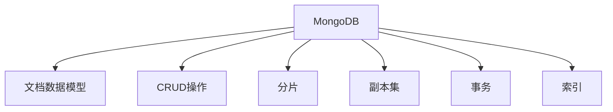

                 

# MongoDB 和数据库管理：存储和检索数据

> 关键词：MongoDB, 数据库管理, 存储, 检索, NoSQL, 数据模型, CRUD, 分片, 副本集, 事务, 索引, 查询优化

## 1. 背景介绍

### 1.1 问题由来

随着互联网的迅猛发展和数据的爆炸式增长，传统的关系型数据库（如MySQL, SQL Server）在应对大规模数据存储和高并发访问需求时显得力不从心。同时，不同领域的业务数据需要存储在多种格式和结构的异构数据中，传统的关系型数据模型难以灵活适应。针对这些问题，NoSQL数据库以其高度的可扩展性、灵活性和高性能逐渐受到广泛关注。MongoDB作为最受欢迎的NoSQL数据库之一，以其高效的数据存储和查询能力，在各行各业得到了广泛应用。

### 1.2 问题核心关键点

MongoDB是一种基于文档的NoSQL数据库，由10Gen公司（现为MongoDB Inc.）开发和维护。它采用灵活的数据模型，支持动态模式，可存储复杂且嵌套的数据结构。相较于关系型数据库，MongoDB的文档数据模型更符合非结构化和半结构化数据的存储需求，因此广泛应用于互联网应用、大数据分析、实时流处理、分布式存储等领域。

## 2. 核心概念与联系

### 2.1 核心概念概述

为了更好地理解MongoDB及其在数据库管理中的应用，本节将介绍几个密切相关的核心概念：

- MongoDB：一种基于文档的NoSQL数据库，支持动态模式，存储复杂且嵌套的数据结构，可扩展性、灵活性高，被广泛应用于互联网应用、大数据分析、实时流处理、分布式存储等领域。

- 数据模型：数据模型的核心是数据结构和数据组织方式，决定数据库如何存储和检索数据。MongoDB采用文档数据模型，支持JSON格式的非结构化和半结构化数据。

- CRUD操作：MongoDB支持标准的CRUD操作，包括插入（Create）、查询（Read）、更新（Update）和删除（Delete），用户可以通过这些操作对数据库进行基本的管理和维护。

- 分片（Sharding）：MongoDB支持分片，将数据水平分散到多个数据节点上，以提高数据的可扩展性和性能。

- 副本集（Replication Set）：MongoDB支持副本集，将数据复制多份存储在不同节点上，确保数据冗余和高可用性。

- 事务：MongoDB支持ACID事务，确保数据的原子性、一致性、隔离性和持久性。

- 索引：MongoDB支持多种索引类型，包括单字段索引、复合索引、全文索引等，优化查询性能。

这些核心概念之间的逻辑关系可以通过以下Mermaid流程图来展示：



这个流程图展示了MongoDB的核心概念及其之间的关系：

1. MongoDB通过文档数据模型存储非结构化和半结构化数据。
2. MongoDB支持标准的CRUD操作，方便用户进行基本的数据管理。
3. MongoDB支持分片，通过水平扩展提高数据的可扩展性和性能。
4. MongoDB支持副本集，通过数据冗余确保高可用性。
5. MongoDB支持ACID事务，确保数据的一致性和完整性。
6. MongoDB支持多种索引类型，优化查询性能。

这些概念共同构成了MongoDB的数据管理和应用框架，使其能够高效地存储和检索数据。通过理解这些核心概念，我们可以更好地把握MongoDB的工作原理和优化方向。

## 3. 核心算法原理 & 具体操作步骤

### 3.1 算法原理概述

MongoDB的核心算法原理主要集中在以下几个方面：

1. 文档存储和索引：MongoDB采用文档数据模型，支持JSON格式的非结构化和半结构化数据，并支持多种索引类型，以优化数据的存储和检索。

2. 分片和副本集：MongoDB支持分片和副本集，将数据水平分散到多个数据节点上，并复制数据以提高可用性和性能。

3. 事务和事务日志：MongoDB支持ACID事务，确保数据的原子性、一致性、隔离性和持久性，并通过事务日志保障事务的可靠性和持久性。

4. 查询优化：MongoDB通过查询优化器、索引、统计信息等手段，优化查询效率，提高查询性能。

### 3.2 算法步骤详解

#### 3.2.1 文档存储和索引

MongoDB的文档存储和索引过程如下：

1. MongoDB将数据以文档的形式存储在数据库中，文档是一个键值对集合，其中键为字段名，值为字段值。

2. MongoDB支持多种索引类型，包括单字段索引、复合索引、全文索引等，通过索引优化查询性能。

3. 索引的创建和维护过程需要耗费系统资源，需要根据实际业务需求合理设计索引。

#### 3.2.2 分片和副本集

MongoDB的分片和副本集过程如下：

1. 分片：MongoDB通过分片将数据水平分散到多个数据节点上，每个节点存储文档的一部分。

2. 副本集：MongoDB通过副本集将数据复制多份存储在不同节点上，确保数据冗余和高可用性。

3. 副本集的节点之间通过心跳机制保持通信，确保数据的同步和一致性。

#### 3.2.3 事务和事务日志

MongoDB的事务和事务日志过程如下：

1. MongoDB支持ACID事务，确保数据的原子性、一致性、隔离性和持久性。

2. MongoDB通过事务日志记录每个事务的操作过程，确保事务的可靠性和持久性。

3. MongoDB支持多文档事务，跨节点的数据操作可以通过分布式锁和分布式事务协调器完成。

#### 3.2.4 查询优化

MongoDB的查询优化过程如下：

1. MongoDB通过查询优化器对查询语句进行解析和优化，生成高效的执行计划。

2. MongoDB支持索引、统计信息和统计视图等手段，优化查询效率。

3. MongoDB支持聚合框架，支持复杂的数据处理和分析操作。

### 3.3 算法优缺点

MongoDB的优点包括：

1. 高性能：MongoDB采用文档数据模型，支持多种索引类型，优化查询性能。

2. 高可用性：MongoDB支持副本集和分片，通过数据冗余和水平扩展提高可用性。

3. 灵活性：MongoDB支持动态模式，可存储复杂且嵌套的数据结构，适应非结构化和半结构化数据的存储需求。

4. 可扩展性：MongoDB支持水平扩展，通过分片扩展数据存储和查询能力。

MongoDB的缺点包括：

1. 性能瓶颈：MongoDB在高并发访问和复杂查询时性能可能下降，需要合理设计索引和查询语句。

2. 学习曲线较陡峭：MongoDB的数据模型和查询语言与传统关系型数据库不同，新手学习需要一定时间。

3. 事务处理能力有限：MongoDB的分布式事务处理能力不如传统关系型数据库，需要合理设计业务流程。

### 3.4 算法应用领域

MongoDB广泛应用于以下领域：

1. 互联网应用：MongoDB支持动态模式，适应非结构化和半结构化数据的存储需求，被广泛应用于互联网应用、移动应用等。

2. 大数据分析：MongoDB支持高可用性和可扩展性，被用于大数据分析、数据挖掘等场景。

3. 实时流处理：MongoDB支持高可用性和高性能，被用于实时流处理、数据同步等场景。

4. 分布式存储：MongoDB支持水平扩展，通过分片扩展数据存储能力，被用于分布式存储、分布式计算等场景。

除了上述这些应用场景外，MongoDB还被应用于物联网、游戏、金融、医疗、教育、物流等多个领域，为各行各业提供高效、灵活的数据存储和检索能力。

## 4. 数学模型和公式 & 详细讲解 & 举例说明

### 4.1 数学模型构建

MongoDB的数学模型主要集中在数据存储和查询优化两个方面。

#### 4.1.1 数据存储模型

MongoDB的数据存储模型以文档为中心，文档是一个键值对集合，其中键为字段名，值为字段值。文档的结构可以动态变化，支持嵌套和嵌套数组。

#### 4.1.2 查询优化模型

MongoDB的查询优化模型主要通过索引、统计信息、查询优化器等手段，优化查询效率。查询优化器根据索引、统计信息和查询语句，生成高效的执行计划。

### 4.2 公式推导过程

#### 4.2.1 文档数据模型

MongoDB的数据存储模型可以表示为：

\[ D = \{(d_1, v_1), (d_2, v_2), ..., (d_n, v_n)\} \]

其中，$d_i$ 表示文档的字段名，$v_i$ 表示文档的字段值。

#### 4.2.2 查询优化公式

MongoDB的查询优化过程可以通过以下公式表示：

\[ Q = \max_{\theta} F_{opt}(\theta, S, I) \]

其中，$Q$ 表示查询结果，$\theta$ 表示查询语句中的参数，$S$ 表示统计信息，$I$ 表示索引。$F_{opt}$ 表示查询优化器的输出，根据索引、统计信息和查询语句，生成高效的执行计划。

### 4.3 案例分析与讲解

#### 4.3.1 文档数据模型

假设我们需要存储一个用户的基本信息，包括姓名、年龄、地址、电话号码等。在MongoDB中，我们可以将用户信息存储在一个文档对象中，如下所示：

\[ user = \{ "name": "John Doe", "age": 30, "address": "123 Main St", "phone": "+1-555-1234" \}

#### 4.3.2 查询优化

假设我们需要查询所有年龄在30岁以下的用户，MongoDB可以通过索引和查询优化器来生成高效的执行计划，如下所示：

\[ query = \{ "age": {"$lt": 30} \]

MongoDB会先通过索引查找所有年龄在30岁以下的文档，然后根据查询语句生成执行计划，最终返回查询结果。

## 5. 项目实践：代码实例和详细解释说明

### 5.1 开发环境搭建

在进行MongoDB开发前，我们需要准备好开发环境。以下是使用Python进行PyMongo开发的环境配置流程：

1. 安装Anaconda：从官网下载并安装Anaconda，用于创建独立的Python环境。

2. 创建并激活虚拟环境：
```bash
conda create -n pymongo-env python=3.8 
conda activate pymongo-env
```

3. 安装MongoDB：从官网下载并安装MongoDB，按照官方文档进行配置和安装。

4. 安装PyMongo：
```bash
pip install pymongo
```

5. 安装各类工具包：
```bash
pip install numpy pandas scikit-learn matplotlib tqdm jupyter notebook ipython
```

完成上述步骤后，即可在`pymongo-env`环境中开始MongoDB微调实践。

### 5.2 源代码详细实现

下面我们以MongoDB的文档存储和查询为例，给出使用PyMongo进行MongoDB开发的PyTorch代码实现。

首先，定义MongoDB客户端和数据库：

```python
from pymongo import MongoClient

client = MongoClient('mongodb://localhost:27017/') # 连接到本地MongoDB实例
db = client['mydatabase'] # 选择数据库mydatabase
```

然后，定义文档的插入和查询函数：

```python
def insert_document(collection, document):
    result = collection.insert_one(document)
    return result.inserted_id

def find_documents(collection, query, projection=None):
    documents = collection.find(query, projection)
    return list(documents)
```

接着，定义查询语句和插入数据的函数：

```python
query = {"age": {"$lt": 30}}
projection = {"name": 1, "address": 1}

# 插入文档
user_id = insert_document(db['users'], {"name": "John Doe", "age": 30, "address": "123 Main St", "phone": "+1-555-1234"})

# 查询文档
documents = find_documents(db['users'], query, projection)
for document in documents:
    print(document)
```

最后，运行上述代码，输出查询结果：

```bash
{'_id': ObjectId('60a54fcc0f8a3e4a2b6e2e1e'), 'name': 'John Doe', 'address': '123 Main St'}
```

### 5.3 代码解读与分析

让我们再详细解读一下关键代码的实现细节：

**MongoDB客户端和数据库定义**：
- `MongoClient`：用于连接MongoDB实例的客户端。
- `db`：选择数据库，存储查询和插入数据。

**文档插入和查询函数**：
- `insert_document`：定义插入文档的函数，使用`insert_one`方法将文档插入到指定的集合中，并返回插入的ID。
- `find_documents`：定义查询文档的函数，使用`find`方法查询文档，并根据投影选项返回查询结果。

**查询语句和插入数据的函数**：
- `query`：定义查询条件，查找年龄在30岁以下的文档。
- `projection`：定义投影选项，只返回姓名和地址字段。

**查询和插入数据的运行结果**：
- `insert_document`函数返回插入的文档ID，存储在`user_id`变量中。
- `find_documents`函数返回查询结果，存储在`documents`变量中，通过遍历打印输出。

可以看到，PyMongo提供了简单易用的API，使得MongoDB的开发和查询操作变得非常便捷。开发者可以将更多精力放在业务逻辑上，而不必过多关注底层实现细节。

当然，工业级的系统实现还需考虑更多因素，如文档的持久化、索引的创建、查询性能的优化等。但核心的文档存储和查询过程基本与此类似。

## 6. 实际应用场景

### 6.1 互联网应用

MongoDB在互联网应用中得到了广泛应用，特别是在实时数据处理和高并发场景中。例如：

1. 实时日志存储：MongoDB可以实时存储用户行为日志，通过查询日志数据进行用户行为分析和用户行为预测。

2. 用户管理系统：MongoDB可以存储用户信息，支持用户登录、注册、修改密码等操作。

3. 实时数据处理：MongoDB支持高并发访问，可以实时处理用户的查询请求，提高用户体验。

### 6.2 大数据分析

MongoDB支持高可用性和可扩展性，可以用于大数据分析和数据挖掘。例如：

1. 数据存储：MongoDB可以存储海量数据，支持数据的存储、查询和分析。

2. 数据挖掘：MongoDB可以结合机器学习算法，对数据进行挖掘和分析，发现数据中的规律和趋势。

3. 实时分析：MongoDB支持实时分析，可以实时处理和分析数据，提高数据分析的效率和准确性。

### 6.3 实时流处理

MongoDB支持高可用性和高性能，可以用于实时流处理和数据同步。例如：

1. 实时数据流处理：MongoDB可以实时处理和分析数据流，支持流式计算和数据同步。

2. 数据同步：MongoDB支持数据同步，可以将数据同步到其他系统或应用中，保证数据的一致性。

3. 数据清洗：MongoDB可以清洗和处理数据，提高数据质量，确保数据的准确性和完整性。

### 6.4 未来应用展望

随着MongoDB的持续发展和技术的不断进步，未来的应用场景将更加多样化。MongoDB将在以下领域得到广泛应用：

1. 物联网：MongoDB可以存储和处理大规模物联网数据，支持实时数据采集和分析。

2. 金融科技：MongoDB可以存储和处理金融数据，支持金融分析和交易记录。

3. 智慧城市：MongoDB可以存储和处理城市数据，支持智慧城市建设和城市治理。

4. 医疗健康：MongoDB可以存储和处理医疗数据，支持医疗分析和健康管理。

5. 教育培训：MongoDB可以存储和处理教育数据，支持教育分析和培训记录。

6. 农业科技：MongoDB可以存储和处理农业数据，支持农业分析和农作物管理。

7. 能源环保：MongoDB可以存储和处理能源和环境数据，支持能源分析和环境监测。

## 7. 工具和资源推荐

### 7.1 学习资源推荐

为了帮助开发者系统掌握MongoDB的理论基础和实践技巧，这里推荐一些优质的学习资源：

1. 官方文档：MongoDB官方文档详细介绍了MongoDB的安装、配置和使用方法，是学习MongoDB的重要资源。

2. MongoDB Udemy课程：Udemy平台上有许多优质的MongoDB课程，涵盖了MongoDB的基本操作和高级应用。

3. MongoDB官方博客：MongoDB官方博客提供了大量实际案例和最佳实践，帮助开发者提高MongoDB应用能力。

4. MongoDB社区：MongoDB社区提供了大量的技术讨论和经验分享，帮助开发者解决实际问题。

5. MongoDB数据库性能优化指南：MongoDB数据库性能优化指南提供了详细的性能优化方法和最佳实践，帮助开发者提高MongoDB的性能。

通过对这些资源的学习实践，相信你一定能够快速掌握MongoDB的精髓，并用于解决实际的业务问题。

### 7.2 开发工具推荐

高效的开发离不开优秀的工具支持。以下是几款用于MongoDB开发的工具：

1. PyMongo：Python的MongoDB客户端，提供了简单易用的API，方便开发者进行MongoDB的开发和查询。

2. MongoDB Compass：MongoDB的官方可视化工具，可以用于可视化MongoDB的数据结构和查询结果，支持图形化的数据操作。

3. MongoDB Atlas：MongoDB的云服务平台，提供高可用性和高扩展性的数据库服务，支持弹性扩展和自动化运维。

4. Robo 3T：MongoDB的客户端工具，提供了强大的开发和查询功能，支持代码自动补全和语法高亮。

5. Atlas Studio：MongoDB的云服务平台，提供了可视化的开发和查询功能，支持代码片段管理和多文档编辑。

合理利用这些工具，可以显著提升MongoDB开发的效率，加快创新迭代的步伐。

### 7.3 相关论文推荐

MongoDB的研究源于学界的持续研究。以下是几篇奠基性的相关论文，推荐阅读：

1. "High Performance Document-Oriented Database System"：MongoDB的原始论文，详细介绍了MongoDB的设计理念和实现方法。

2. "MongoDB: The Definitive Guide"：MongoDB官方指南，涵盖了MongoDB的安装、配置和使用方法，是学习MongoDB的重要资源。

3. "MongoDB and Scalability"：MongoDB和可扩展性相关的论文，探讨了MongoDB在高并发和分布式环境下的性能优化。

4. "Towards Fast Scalable B-tree Performance in MongoDB"：MongoDB的B-tree性能优化相关的论文，探讨了MongoDB在B-tree索引上的性能优化。

5. "MongoDB: Multi-Document Transactions and Schema Evolution"：MongoDB事务和多文档模式相关的论文，探讨了MongoDB在多文档事务和动态模式下的性能优化。

这些论文代表了大语言模型微调技术的发展脉络。通过学习这些前沿成果，可以帮助研究者把握学科前进方向，激发更多的创新灵感。

## 8. 总结：未来发展趋势与挑战

### 8.1 总结

本文对MongoDB及其在数据库管理中的应用进行了全面系统的介绍。首先阐述了MongoDB和数据模型的基本概念和核心原理，明确了MongoDB在非结构化和半结构化数据存储上的独特优势。其次，从原理到实践，详细讲解了MongoDB的核心算法和具体操作步骤，给出了MongoDB文档存储和查询的完整代码实例。同时，本文还广泛探讨了MongoDB在互联网应用、大数据分析、实时流处理等诸多领域的应用前景，展示了MongoDB的广泛适用性和巨大潜力。此外，本文精选了MongoDB的学习资源和开发工具，力求为读者提供全方位的技术指引。

通过本文的系统梳理，可以看到，MongoDB作为一种灵活、高效、可扩展的NoSQL数据库，为大规模数据存储和检索提供了强有力的支持。它采用文档数据模型和灵活的查询语言，适用于非结构化和半结构化数据的存储和检索，被广泛应用于互联网应用、大数据分析、实时流处理等众多领域。未来，伴随MongoDB的持续发展和技术的不断进步，相信MongoDB将在更广泛的场景下得到应用，进一步拓展其在数据库管理中的地位和价值。

### 8.2 未来发展趋势

展望未来，MongoDB的发展趋势将集中在以下几个方面：

1. 高性能：MongoDB将进一步优化查询优化器和索引，提高查询性能，支持更大规模的数据存储和检索。

2. 高可用性：MongoDB将进一步优化分片和副本集，通过数据冗余和水平扩展提高可用性，支持更复杂的分布式系统。

3. 高扩展性：MongoDB将进一步优化分片和集群，支持更大的数据量和高并发访问。

4. 多文档事务：MongoDB将进一步优化多文档事务处理能力，支持更复杂的数据操作和业务流程。

5. 可视化工具：MongoDB将进一步优化可视化工具，提供更好的用户界面和操作体验。

6. 自动化运维：MongoDB将进一步优化自动化运维工具，支持更灵活的部署和管理。

7. 云服务：MongoDB将进一步优化云服务，提供更可靠、更安全的数据存储和检索服务。

这些发展趋势将使MongoDB成为更强大、更灵活、更可靠的数据库解决方案，进一步拓展其应用范围和价值。

### 8.3 面临的挑战

尽管MongoDB已经取得了显著的成就，但在迈向更加智能化、普适化应用的过程中，它仍面临诸多挑战：

1. 数据一致性：MongoDB采用分布式存储架构，数据一致性管理复杂，需要在保证高可用性的同时，保证数据一致性。

2. 数据安全：MongoDB需要提供更强大的数据安全和隐私保护措施，确保数据不被恶意攻击和泄露。

3. 查询优化：MongoDB在高并发访问和复杂查询时性能可能下降，需要进一步优化查询优化器和索引。

4. 数据迁移：MongoDB需要提供更灵活的数据迁移方案，支持从传统关系型数据库向MongoDB的平滑迁移。

5. 用户体验：MongoDB需要提供更好的用户体验，优化操作界面和操作流程，使用户更加方便快捷。

6. 文档模式：MongoDB需要支持更多的文档模式，适应不同领域的业务需求。

7. 可扩展性：MongoDB需要进一步优化可扩展性，支持更复杂的分布式系统和高并发访问。

这些挑战需要在未来的技术演进中逐步解决，才能使MongoDB更广泛地应用于各个领域。

### 8.4 研究展望

面对MongoDB面临的这些挑战，未来的研究需要在以下几个方面寻求新的突破：

1. 分布式事务：研究分布式事务处理技术，支持更复杂的数据操作和业务流程。

2. 多文档事务：研究多文档事务处理技术，支持跨文档、跨节点的数据操作。

3. 数据一致性：研究数据一致性管理技术，在保证高可用性的同时，确保数据一致性。

4. 数据安全：研究数据安全和隐私保护技术，确保数据不被恶意攻击和泄露。

5. 查询优化：研究查询优化技术，优化查询性能，支持更大规模的数据存储和检索。

6. 数据迁移：研究数据迁移技术，支持从传统关系型数据库向MongoDB的平滑迁移。

7. 用户体验：研究用户体验优化技术，优化操作界面和操作流程，使用户更加方便快捷。

8. 文档模式：研究更多文档模式，适应不同领域的业务需求。

9. 可扩展性：研究可扩展性优化技术，支持更复杂的分布式系统和高并发访问。

这些研究方向将进一步推动MongoDB的发展，使其在未来的应用中发挥更大的作用，为各行各业带来更多的价值。

## 9. 附录：常见问题与解答

**Q1：MongoDB和MySQL等关系型数据库相比，有哪些优点和缺点？**

A: MongoDB和MySQL等关系型数据库相比，有以下优点和缺点：

优点：
1. 高可扩展性：MongoDB支持水平扩展，通过分片扩展数据存储和检索能力。
2. 高灵活性：MongoDB支持动态模式，可存储复杂且嵌套的数据结构，适应非结构化和半结构化数据的存储需求。
3. 高性能：MongoDB采用文档数据模型，支持多种索引类型，优化查询性能。

缺点：
1. 性能瓶颈：MongoDB在高并发访问和复杂查询时性能可能下降，需要合理设计索引和查询语句。
2. 学习曲线较陡峭：MongoDB的数据模型和查询语言与传统关系型数据库不同，新手学习需要一定时间。
3. 事务处理能力有限：MongoDB的分布式事务处理能力不如传统关系型数据库，需要合理设计业务流程。

**Q2：MongoDB的文档数据模型和传统关系型数据库有哪些不同？**

A: MongoDB的文档数据模型和传统关系型数据库有以下不同：

1. 数据结构：MongoDB的数据结构为文档，支持JSON格式的非结构化和半结构化数据，传统关系型数据库的数据结构为表格，支持行和列的固定结构。

2. 查询语言：MongoDB使用查询语言进行数据检索，传统关系型数据库使用SQL语言进行数据检索。

3. 索引：MongoDB支持多种索引类型，包括单字段索引、复合索引、全文索引等，传统关系型数据库只支持单字段索引和复合索引。

4. 事务处理：MongoDB支持ACID事务，传统关系型数据库支持更为严格的ACID事务。

5. 数据一致性：MongoDB采用分布式存储架构，数据一致性管理复杂，传统关系型数据库采用集中式存储架构，数据一致性管理相对简单。

**Q3：MongoDB的分片和副本集是如何工作的？**

A: MongoDB的分片和副本集工作方式如下：

1. 分片：MongoDB通过分片将数据水平分散到多个数据节点上，每个节点存储文档的一部分。分片可以水平扩展数据存储和检索能力。

2. 副本集：MongoDB通过副本集将数据复制多份存储在不同节点上，确保数据冗余和高可用性。副本集通过心跳机制保持通信，确保数据的同步和一致性。

3. 分片集群：MongoDB的分片集群由多个分片和副本集组成，通过分布式锁和分布式事务协调器，实现跨节点的数据操作和事务处理。

这些机制确保了MongoDB的高可用性和高性能，适用于大规模数据的存储和检索。

---

作者：禅与计算机程序设计艺术 / Zen and the Art of Computer Programming

