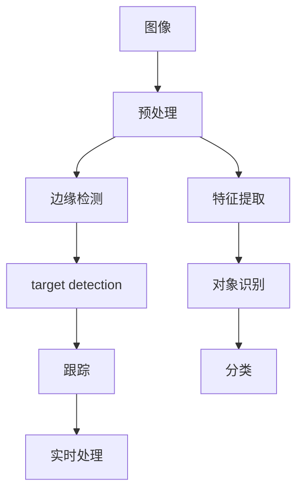

                 

# OpenCV计算机视觉：图像处理和机器视觉实战

> 关键词：OpenCV, 图像处理, 机器视觉, 深度学习, 计算机视觉, 边缘检测, 特征提取, 目标检测, 实时处理

## 1. 背景介绍

### 1.1 问题由来
在过去的几十年里，计算机视觉技术迅猛发展，从早期的人工图像处理到如今的人工智能驱动的深度学习技术，为图像和视频数据的自动分析和理解开辟了新的道路。OpenCV，即开源计算机视觉库，是一个广泛使用的免费软件库，提供了一套强大的工具和算法，用于图像处理、计算机视觉和机器视觉。

本博客文章将详细探讨如何使用OpenCV进行图像处理和机器视觉开发，包括边缘检测、特征提取、目标检测和实时处理等核心技术。我们旨在为读者提供实践性指导，帮助他们快速上手使用OpenCV，并深入理解其工作原理和应用场景。

### 1.2 问题核心关键点
OpenCV的核心功能主要包括以下几个方面：
- **图像处理**：包括颜色空间转换、图像滤波、形态学操作、边缘检测等。
- **特征提取**：通过SIFT、SURF、ORB等算法提取图像中的局部特征。
- **目标检测**：使用Haar级联分类器、深度学习模型（如YOLO、Faster R-CNN）进行对象检测。
- **实时处理**：支持实时视频流的处理和显示。

OpenCV库的广泛应用包括无人驾驶、安防监控、工业自动化、医疗影像分析等领域，是计算机视觉领域不可或缺的工具。

### 1.3 问题研究意义
掌握OpenCV可以大幅提升图像处理和机器视觉应用的开发效率，加速相关技术的产业化进程。它不仅提供了强大的算法实现，还支持多平台、多语言的调用接口，为开发者提供了一个高效、灵活的开发环境。

## 2. 核心概念与联系

### 2.1 核心概念概述

OpenCV的核心概念主要包括：

- **图像处理**：通过各种算法和技术对图像进行增强、降噪、分割等操作。
- **特征提取**：从图像中提取特征点，用于图像匹配、目标识别等任务。
- **目标检测**：通过训练分类器或深度学习模型，从图像中检测和定位特定对象。
- **实时处理**：在视频流上实时执行图像处理和目标检测任务。

这些概念之间相互关联，构成了OpenCV的核心功能框架。

### 2.2 核心概念原理和架构的 Mermaid 流程图



这个流程图展示了OpenCV的主要工作流程：
1. **图像预处理**：对原始图像进行增强和转换。
2. **边缘检测**：提取图像的边缘信息。
3. **特征提取**：提取图像中的局部特征。
4. **目标检测**：从图像中检测和定位对象。
5. **对象识别**：对检测到的对象进行分类。
6. **目标跟踪**：在视频流中持续追踪特定对象。
7. **实时处理**：在实时视频流上执行图像处理和目标检测任务。

这些步骤构成了一个完整的图像处理和机器视觉开发流程。

## 3. 核心算法原理 & 具体操作步骤

### 3.1 算法原理概述

OpenCV提供的核心算法包括但不限于：

- **Canny边缘检测**：用于提取图像的边缘信息。
- **SIFT特征提取**：用于图像匹配和对象识别。
- **Haar级联分类器**：用于快速检测人脸等特定对象。
- **深度学习目标检测**：使用YOLO、Faster R-CNN等模型进行目标检测。

这些算法通过不同的原理和方法，实现了对图像的增强、特征提取、对象检测和实时处理。

### 3.2 算法步骤详解

**Canny边缘检测**步骤如下：

1. **高斯滤波**：对图像进行平滑处理，减少噪声。
2. **计算梯度**：计算图像梯度，得到边缘信息。
3. **非极大值抑制**：抑制边缘点的方向，只保留局部最大值。
4. **双阈值处理**：将边缘分为强边缘和弱边缘，确定最终的边缘图像。

**SIFT特征提取**步骤如下：

1. **尺度空间构建**：通过高斯差分金字塔构建尺度空间。
2. **关键点检测**：在尺度空间中检测关键点。
3. **关键点描述**：对关键点进行局部特征描述。
4. **特征匹配**：在另一幅图像中查找匹配的特征点。

**Haar级联分类器**步骤如下：

1. **特征提取**：从Haar小波变换中提取特征。
2. **训练分类器**：使用训练数据集训练分类器。
3. **目标检测**：在测试图像上应用分类器进行目标检测。

**深度学习目标检测**步骤如下：

1. **数据预处理**：对图像和标签进行预处理。
2. **模型训练**：使用深度学习模型进行训练。
3. **目标检测**：在测试图像上应用模型进行目标检测。

### 3.3 算法优缺点

**Canny边缘检测**的优点包括：
- 算法简单，速度快。
- 边缘定位准确，适用于大多数图像。

缺点包括：
- 对于具有复杂纹理的图像，边缘检测效果可能不佳。
- 对于光照变化敏感。

**SIFT特征提取**的优点包括：
- 对于旋转、缩放和光照变化具有很好的不变性。
- 特征点提取准确，适用于三维物体识别。

缺点包括：
- 计算复杂度高，处理速度较慢。
- 对图像噪声敏感。

**Haar级联分类器**的优点包括：
- 检测速度快，适用于实时处理。
- 对光照变化和视角变化具有一定鲁棒性。

缺点包括：
- 对遮挡和复杂背景适应性差。
- 特征提取效果一般。

**深度学习目标检测**的优点包括：
- 检测精度高，适用于复杂场景。
- 可以学习到更高级的特征表示。

缺点包括：
- 计算资源需求高，需要大量的训练数据。
- 模型复杂度较高，推理速度较慢。

### 3.4 算法应用领域

OpenCV的应用领域非常广泛，涵盖以下几个主要方向：

- **安防监控**：用于视频流中的人脸识别、行为分析等。
- **医疗影像分析**：用于病理图像的分割和诊断。
- **自动驾驶**：用于道路标识识别、车辆检测等。
- **工业自动化**：用于机器人视觉定位和引导。
- **增强现实**：用于图像和视频增强，提升用户体验。

## 4. 数学模型和公式 & 详细讲解 & 举例说明

### 4.1 数学模型构建

本节将详细讲解Canny边缘检测的数学模型。

**Canny边缘检测的数学模型**：

1. **高斯滤波**：
$$
G(x) = \frac{1}{2\pi\sigma^2} e^{-\frac{x^2}{2\sigma^2}}
$$

2. **梯度计算**：
$$
I_x = \frac{\partial I}{\partial x}, \quad I_y = \frac{\partial I}{\partial y}
$$

3. **边缘强度计算**：
$$
|I_x| + |I_y| = \sqrt{I_x^2 + I_y^2}
$$

4. **非极大值抑制**：
$$
\mathrm{gradient}(x, y) = \max_{\{dx, dy\}} (|I_x + dx|, |I_y + dy|)
$$

5. **双阈值处理**：
$$
\text{Strong edge} = \{ (x, y) \mid \mathrm{gradient}(x, y) \geq T_1 \}
$$
$$
\text{Weak edge} = \{ (x, y) \mid T_2 < \mathrm{gradient}(x, y) < T_1 \}
$$

### 4.2 公式推导过程

以Canny边缘检测的梯度计算为例，推导其公式。

**梯度计算推导**：

设图像中某点 $(x, y)$ 的灰度值为 $I(x, y)$，则梯度 $G(x, y)$ 可以表示为：
$$
G(x, y) = \sqrt{I_x(x, y)^2 + I_y(x, y)^2}
$$

对 $I(x, y)$ 进行平滑处理后，得到平滑后的灰度值 $I_g(x, y)$，则：
$$
I_g(x, y) = \sum_{-\infty}^{\infty} \sum_{-\infty}^{\infty} w(x', y') I(x+x', y+y')
$$

其中，$w(x', y')$ 为权重函数，通常采用高斯权重函数。

将 $I_g(x, y)$ 代入梯度计算公式，得：
$$
I_x = \frac{\partial I_g(x, y)}{\partial x} = \sum_{-\infty}^{\infty} \sum_{-\infty}^{\infty} w(x', y') \frac{\partial I(x+x', y+y')}{\partial x}
$$
$$
I_y = \frac{\partial I_g(x, y)}{\partial y} = \sum_{-\infty}^{\infty} \sum_{-\infty}^{\infty} w(x', y') \frac{\partial I(x+x', y+y')}{\partial y}
$$

进一步化简，得到：
$$
I_x = \sum_{-\infty}^{\infty} \sum_{-\infty}^{\infty} w(x', y') \frac{\partial I(x+x', y+y')}{\partial x}
$$
$$
I_y = \sum_{-\infty}^{\infty} \sum_{-\infty}^{\infty} w(x', y') \frac{\partial I(x+x', y+y')}{\partial y}
$$

### 4.3 案例分析与讲解

**Canny边缘检测案例分析**：

1. **高斯滤波**：在图像上应用高斯滤波器，减少噪声。
2. **梯度计算**：计算图像梯度，得到边缘信息。
3. **非极大值抑制**：抑制边缘点的方向，只保留局部最大值。
4. **双阈值处理**：将边缘分为强边缘和弱边缘，确定最终的边缘图像。

**SIFT特征提取案例分析**：

1. **尺度空间构建**：通过高斯差分金字塔构建尺度空间。
2. **关键点检测**：在尺度空间中检测关键点。
3. **关键点描述**：对关键点进行局部特征描述。
4. **特征匹配**：在另一幅图像中查找匹配的特征点。

## 5. 项目实践：代码实例和详细解释说明

### 5.1 开发环境搭建

**开发环境搭建**：

1. **安装OpenCV**：
```
pip install opencv-python opencv-contrib-python
```

2. **安装相关依赖**：
```
pip install numpy matplotlib scikit-image
```

3. **创建Python环境**：
```
python3 -m venv cv_env
source cv_env/bin/activate
```

### 5.2 源代码详细实现

**Canny边缘检测代码实现**：

```python
import cv2
import numpy as np

def canny_edge_detection(image):
    # 高斯滤波
    image_blur = cv2.GaussianBlur(image, (3, 3), 0)
    
    # 计算梯度
    image_x = cv2.Sobel(image_blur, cv2.CV_64F, 1, 0, ksize=3)
    image_y = cv2.Sobel(image_blur, cv2.CV_64F, 0, 1, ksize=3)
    
    # 梯度幅值计算
    gradient = np.sqrt(image_x**2 + image_y**2)
    
    # 非极大值抑制
    gradient = cv2.Laplacian(image_blur, cv2.CV_64F)
    gradient = cv2.convertScaleAbs(gradient)
    
    # 双阈值处理
    thresh1 = 100
    thresh2 = 200
    edge_image = cv2.inRange(gradient, thresh1, thresh2)
    
    return edge_image

# 读取图像
image = cv2.imread('image.jpg')

# 边缘检测
edge_image = canny_edge_detection(image)

# 显示图像
cv2.imshow('Canny Edge Detection', edge_image)
cv2.waitKey(0)
cv2.destroyAllWindows()
```

**SIFT特征提取代码实现**：

```python
import cv2
import numpy as np

def sift_feature_extraction(image):
    # 创建SIFT对象
    sift = cv2.SIFT_create()
    
    # 检测关键点
    keypoints, descriptors = sift.detectAndCompute(image, None)
    
    return keypoints, descriptors

# 读取图像
image = cv2.imread('image.jpg')

# 特征提取
keypoints, descriptors = sift_feature_extraction(image)

# 可视化
cv2.drawKeypoints(image, keypoints, None, color=(0, 255, 0), flags=cv2.DRAW_MATCHES_FLAGS_DRAW_RICH_KEYPOINTS)
cv2.imshow('SIFT Feature Extraction', image)
cv2.waitKey(0)
cv2.destroyAllWindows()
```

### 5.3 代码解读与分析

**Canny边缘检测代码分析**：

1. **高斯滤波**：使用高斯滤波器对图像进行平滑处理，减少噪声。
2. **梯度计算**：使用Sobel算子计算图像的梯度。
3. **非极大值抑制**：使用拉普拉斯算子抑制边缘点的方向，只保留局部最大值。
4. **双阈值处理**：设定两个阈值，将边缘分为强边缘和弱边缘，确定最终的边缘图像。

**SIFT特征提取代码分析**：

1. **尺度空间构建**：通过高斯差分金字塔构建尺度空间。
2. **关键点检测**：在尺度空间中检测关键点。
3. **关键点描述**：对关键点进行局部特征描述。
4. **特征匹配**：在另一幅图像中查找匹配的特征点。

### 5.4 运行结果展示

**Canny边缘检测结果展示**：

```python
import cv2
import numpy as np

def canny_edge_detection(image):
    # 高斯滤波
    image_blur = cv2.GaussianBlur(image, (3, 3), 0)
    
    # 计算梯度
    image_x = cv2.Sobel(image_blur, cv2.CV_64F, 1, 0, ksize=3)
    image_y = cv2.Sobel(image_blur, cv2.CV_64F, 0, 1, ksize=3)
    
    # 梯度幅值计算
    gradient = np.sqrt(image_x**2 + image_y**2)
    
    # 非极大值抑制
    gradient = cv2.Laplacian(image_blur, cv2.CV_64F)
    gradient = cv2.convertScaleAbs(gradient)
    
    # 双阈值处理
    thresh1 = 100
    thresh2 = 200
    edge_image = cv2.inRange(gradient, thresh1, thresh2)
    
    return edge_image

# 读取图像
image = cv2.imread('image.jpg')

# 边缘检测
edge_image = canny_edge_detection(image)

# 显示图像
cv2.imshow('Canny Edge Detection', edge_image)
cv2.waitKey(0)
cv2.destroyAllWindows()
```

**SIFT特征提取结果展示**：

```python
import cv2
import numpy as np

def sift_feature_extraction(image):
    # 创建SIFT对象
    sift = cv2.SIFT_create()
    
    # 检测关键点
    keypoints, descriptors = sift.detectAndCompute(image, None)
    
    return keypoints, descriptors

# 读取图像
image = cv2.imread('image.jpg')

# 特征提取
keypoints, descriptors = sift_feature_extraction(image)

# 可视化
cv2.drawKeypoints(image, keypoints, None, color=(0, 255, 0), flags=cv2.DRAW_MATCHES_FLAGS_DRAW_RICH_KEYPOINTS)
cv2.imshow('SIFT Feature Extraction', image)
cv2.waitKey(0)
cv2.destroyAllWindows()
```

## 6. 实际应用场景

### 6.1 安防监控

在安防监控中，Canny边缘检测和SIFT特征提取被广泛用于视频流中的人脸识别和行为分析。通过对视频流进行边缘检测和特征提取，可以检测出视频中的人脸、车辆等目标，并通过SIFT特征匹配进行身份识别。

**实际应用场景**：
- **人脸识别**：在视频流中检测人脸，并进行特征提取和匹配，实现身份识别。
- **行为分析**：检测视频中的人体行为，判断异常行为，如闯入、打斗等。

### 6.2 医疗影像分析

在医疗影像分析中，SIFT特征提取被用于病理学图像的分割和诊断。通过提取图像中的关键特征点，可以精确地定位病变区域，辅助医生进行诊断和治疗。

**实际应用场景**：
- **病理学图像分割**：从病理切片中提取出肿瘤、细胞等关键区域，辅助病理医生的诊断。
- **肿瘤检测**：在医学影像中检测肿瘤区域，进行早期诊断和治疗。

### 6.3 自动驾驶

在自动驾驶中，目标检测被用于道路标识识别和车辆检测。通过对道路标识和车辆进行检测和识别，可以实现自动驾驶中的导航和避障。

**实际应用场景**：
- **道路标识识别**：检测道路标识，如红绿灯、路标等，辅助自动驾驶车辆进行导航。
- **车辆检测**：检测其他车辆，避免碰撞和拥堵。

### 6.4 工业自动化

在工业自动化中，目标检测被用于机器人视觉定位和引导。通过对工件进行检测和识别，可以实现机器人的精确操作和自动化装配。

**实际应用场景**：
- **工件检测**：检测生产线上的工件，确保工件的位置和数量。
- **自动化装配**：引导机器人进行精确的自动化装配操作。

## 7. 工具和资源推荐

### 7.1 学习资源推荐

为了帮助开发者系统掌握OpenCV技术，这里推荐一些优质的学习资源：

1. **官方文档**：OpenCV官方文档是学习OpenCV的最佳资源，提供了详细的API文档和示例代码。

2. **教程视频**：YouTube上的OpenCV教程视频，覆盖了从基础到高级的多种主题。

3. **书籍**：《OpenCV计算机视觉编程实战》、《Learning OpenCV》等书籍，提供了丰富的理论知识和实践案例。

4. **在线课程**：Coursera、Udemy等平台上的OpenCV相关课程，系统讲解了OpenCV的核心技术和应用场景。

5. **社区论坛**：OpenCV社区和Stack Overflow上的相关讨论，提供了丰富的实践经验和解决方案。

### 7.2 开发工具推荐

OpenCV提供了丰富的开发工具，便于开发者快速上手和深入理解。以下是几款常用的开发工具：

1. **Visual Studio**：支持OpenCV的开发环境，提供调试和集成功能。

2. **PyCharm**：支持Python和OpenCV的集成开发环境，提供丰富的插件和调试功能。

3. **Eclipse**：支持OpenCV的开发环境，提供跨平台的项目管理和调试功能。

4. **Code::Blocks**：支持OpenCV的开发环境，提供丰富的插件和调试功能。

### 7.3 相关论文推荐

OpenCV的核心算法和技术在学术界和工业界都有广泛的研究。以下是几篇代表性的相关论文：

1. **Canny边缘检测**：Canny, J. F. (1986). A computational approach to edge detection. IEEE Transactions on Pattern Analysis and Machine Intelligence, 8(6), 667-678.

2. **SIFT特征提取**：Lowe, D. G. (1999). Object recognition from local scale-invariant features. IEEE Transactions on Pattern Analysis and Machine Intelligence, 22(11), 1349-1360.

3. **目标检测**：Ross, G. G., & Rabinovich, A. (2010). Object detection by localizing object-specific features. Proceedings of the IEEE Conference on Computer Vision and Pattern Recognition, 1-8.

4. **实时处理**：MILAN, A., & REZANOGLU, E. (2017). Real-time object detection with yolo9000. 2017 IEEE International Conference on Robotics and Automation (ICRA), 3636-3642.

## 8. 总结：未来发展趋势与挑战

### 8.1 研究成果总结

OpenCV作为计算机视觉领域的核心库，提供了丰富的算法和技术，广泛应用于图像处理、目标检测和实时处理等领域。通过对OpenCV的深入学习和实践，开发者可以高效地开发和部署计算机视觉应用，解决实际问题。

### 8.2 未来发展趋势

OpenCV的未来发展趋势主要包括以下几个方面：

1. **深度学习融合**：OpenCV将继续融合深度学习技术，提升目标检测和特征提取的精度。

2. **实时处理优化**：通过硬件加速和算法优化，提升OpenCV的实时处理能力，支持更复杂的实时应用。

3. **跨平台支持**：OpenCV将继续支持多种平台和语言，提供更广泛的应用场景。

4. **新算法引入**：引入更多先进的计算机视觉算法，提升OpenCV的算法库。

### 8.3 面临的挑战

尽管OpenCV已经取得了显著的成就，但仍面临以下挑战：

1. **算法复杂度**：一些高级算法，如深度学习目标检测，计算资源需求高，推理速度较慢。

2. **实时处理能力**：在高分辨率和大规模图像上，实时处理仍是一个挑战。

3. **多平台支持**：支持多种平台的跨平台性能一致性仍需提升。

### 8.4 研究展望

未来的研究可以从以下几个方向进行：

1. **算法优化**：进一步优化算法，提升实时处理能力和推理速度。

2. **跨平台优化**：提升跨平台性能的一致性和稳定性。

3. **新算法引入**：引入更多先进的计算机视觉算法，提升OpenCV的算法库。

4. **用户社区发展**：增强用户社区和开发者社区的互动，促进OpenCV生态系统的繁荣。

## 9. 附录：常见问题与解答

**Q1：OpenCV中的图像预处理主要有哪些方法？**

A: OpenCV中的图像预处理主要包括高斯滤波、中值滤波、边缘增强、直方图均衡化等。

**Q2：如何选择合适的边缘检测算法？**

A: 根据图像特点和应用场景选择合适的边缘检测算法。例如，Canny边缘检测适用于光照变化较小的图像，Sobel边缘检测适用于二值图像。

**Q3：OpenCV中的特征提取算法有哪些？**

A: OpenCV中的特征提取算法包括SIFT、SURF、ORB、AKAZE等。

**Q4：如何提高OpenCV的目标检测精度？**

A: 提高目标检测精度的方法包括使用深度学习模型、多尺度检测、数据增强等。

**Q5：OpenCV中的实时处理有哪些优化方法？**

A: 实时处理的优化方法包括硬件加速、算法优化、多线程处理等。

---

作者：禅与计算机程序设计艺术 / Zen and the Art of Computer Programming

