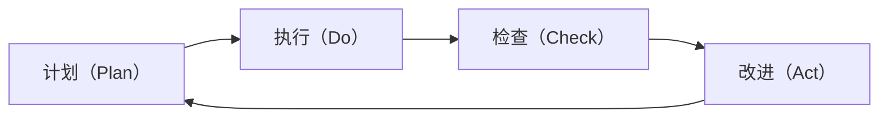

                 

## 1. 背景介绍

### 1.1 问题由来
PDCA（Plan-Do-Check-Act）循环是由W. Edwards Deming在1950年代提出的一种持续改进的管理模式。它强调通过不断循环的四步过程，不断优化组织运作，提升产品或服务的质量。在现代组织中，PDCA循环被广泛应用于项目管理、质量控制、软件开发等多个领域。

### 1.2 问题核心关键点
PDCA循环的核心思想是通过"计划（Plan）-执行（Do）-检查（Check）-改进（Act）"四步骤循环，不断迭代优化，实现过程改进和持续提升。PDCA循环不仅适用于生产制造过程，也适用于各类组织运营管理。

## 2. 核心概念与联系

### 2.1 核心概念概述
PDCA循环包括四个基本步骤，每个步骤都有明确的目的和操作方式：

- **计划（Plan）**：明确目标，制定详细计划。
- **执行（Do）**：按照计划执行，确保目标达成。
- **检查（Check）**：评估执行结果，找出偏差和问题。
- **改进（Act）**：针对问题进行改进，制定新计划，进入下一轮PDCA循环。

PDCA循环的四个步骤形成一个闭环，不断迭代，实现持续改进。

### 2.2 核心概念原理和架构的 Mermaid 流程图


## 3. 核心算法原理 & 具体操作步骤

### 3.1 算法原理概述
PDCA循环的原理是基于科学管理法和戴明环（Deming Cycle）理论，强调通过反馈和迭代实现持续改进。其基本思想是：

1. **计划（Plan）**：明确目标，制定详细计划，包括资源、步骤和时间安排等。
2. **执行（Do）**：按照计划执行，确保每个环节按照预期进行。
3. **检查（Check）**：评估执行结果，找出偏差和问题，分析原因。
4. **改进（Act）**：针对问题进行改进，制定新计划，进入下一轮PDCA循环。

PDCA循环通过不断反馈和改进，逐步提升组织运营效率和质量。

### 3.2 算法步骤详解

#### 3.2.1 计划（Plan）步骤
**输入**：确定目标、资源、时间安排。
**输出**：详细计划和执行路径。
**操作步骤**：
1. **确定目标**：明确需要达成的具体目标，如提高产品质量、提升客户满意度等。
2. **分析现状**：了解当前状态和问题点，分析达成目标的关键因素。
3. **制定计划**：详细制定达成目标的具体步骤和时间安排，包括资源分配、责任分工等。

#### 3.2.2 执行（Do）步骤
**输入**：计划、资源。
**输出**：执行结果和原始数据。
**操作步骤**：
1. **分配资源**：按照计划分配人力资源、设备、技术等资源。
2. **实施计划**：按照步骤逐项执行，确保每个环节按照预期进行。
3. **记录数据**：在执行过程中，详细记录每个环节的原始数据和执行情况。

#### 3.2.3 检查（Check）步骤
**输入**：原始数据、执行结果。
**输出**：偏差分析、问题识别。
**操作步骤**：
1. **数据分析**：对比原始数据和执行结果，分析是否达成预期目标。
2. **识别问题**：找出执行过程中出现的问题和偏差，分析原因。
3. **评估效果**：评估执行效果和问题严重程度，决定是否需要调整计划。

#### 3.2.4 改进（Act）步骤
**输入**：问题分析、执行数据。
**输出**：改进措施、新计划。
**操作步骤**：
1. **制定改进措施**：针对发现的问题，制定具体的改进措施和解决方案。
2. **执行改进措施**：按照措施逐步改进，确保问题得到有效解决。
3. **制定新计划**：根据改进后的效果，调整原有计划，制定新的执行计划。

### 3.3 算法优缺点

#### 3.3.1 优点
1. **系统化管理**：PDCA循环强调系统的管理流程，每个步骤都有明确的目标和操作方式。
2. **持续改进**：通过不断反馈和改进，逐步提升运营效率和质量。
3. **灵活适用**：适用于各种规模和类型的组织，灵活应用到不同的管理场景。

#### 3.3.2 缺点
1. **复杂性高**：PDCA循环涉及多个步骤和环节，操作复杂，需要大量时间和精力。
2. **依赖于执行者**：执行者的专业水平和责任心直接影响PDCA循环的效果。
3. **缺乏灵活性**：对于一些突发事件和不可预测的情况，PDCA循环可能不够灵活。

### 3.4 算法应用领域

#### 3.4.1 项目管理
PDCA循环在项目管理中广泛应用，通过持续改进项目计划、执行和监控，提高项目成功率。项目管理中的每个阶段都可以看作一个PDCA循环，通过不断反馈和改进，确保项目按计划进行。

#### 3.4.2 质量控制
PDCA循环在质量控制中也有重要应用，通过持续改进生产流程和产品质量，提升产品合格率和客户满意度。在质量控制中，PDCA循环强调通过不断的反馈和改进，逐步优化产品质量和生产流程。

#### 3.4.3 软件开发
PDCA循环在软件开发中也有广泛应用，通过持续改进软件设计、开发和测试，提升软件质量和用户满意度。在软件开发中，PDCA循环强调通过不断的反馈和改进，逐步优化软件功能和用户体验。

## 4. 数学模型和公式 & 详细讲解 & 举例说明

### 4.1 数学模型构建

PDCA循环的每个步骤都可以用数学模型来表示，以下是一个简单的数学模型构建：

设目标为 $X$，原始数据为 $D_0$，执行结果为 $D_1$，问题为 $P$，改进措施为 $A$，新计划为 $X_{\text{new}}$。PDCA循环的数学模型如下：

$$
X_{\text{new}} = f(X, D_0, P, A)
$$

其中，$f$ 表示根据目标、原始数据、问题和改进措施，制定新计划的函数。

### 4.2 公式推导过程

**目标（X）**：设定具体的目标，如提高产品质量 $X$。

**原始数据（D0）**：原始数据包括历史数据、当前状态等，如产品质量历史数据 $D_0$。

**问题（P）**：在执行过程中，识别出需要改进的问题，如产品质量不符合标准 $P$。

**改进措施（A）**：针对问题，制定具体的改进措施，如改进生产工艺 $A$。

**新计划（X_{new}）**：根据目标、原始数据、问题和改进措施，制定新的执行计划，如改进后的生产工艺 $X_{\text{new}}$。

### 4.3 案例分析与讲解

#### 案例分析
某制造企业生产一种精密零件，产品质量不稳定，希望通过PDCA循环提高产品质量。

**计划（Plan）**：
- 目标：提高产品质量，降低次品率。
- 现状分析：当前次品率为10%，主要问题在于生产工艺不稳定。
- 制定计划：改进生产工艺，增加质量检测环节，调整生产参数。

**执行（Do）**：
- 分配资源：增加质量检测设备，培训员工。
- 实施计划：按照计划执行，记录所有生产数据。

**检查（Check）**：
- 数据分析：对比原始数据和执行结果，发现次品率仍为10%，分析原因。
- 识别问题：发现工艺参数调整不够，质量检测不严格。
- 评估效果：决定调整工艺参数和增加检测环节。

**改进（Act）**：
- 制定改进措施：调整生产工艺参数，增加二次检测环节。
- 执行改进措施：按照措施改进，记录改进后的数据。
- 制定新计划：制定新的生产工艺和检测流程，进入下一轮PDCA循环。

通过不断的PDCA循环，该企业的产品质量逐步提高，次品率降低到5%。

## 5. 项目实践：代码实例和详细解释说明

### 5.1 开发环境搭建

要实现PDCA循环的项目实践，需要搭建一个开发环境，包括：

1. **编程语言**：Python，常用的数据分析和可视化工具如NumPy、Pandas、Matplotlib等。
2. **开发环境**：Jupyter Notebook，支持交互式编程和数据可视化。
3. **数据存储**：使用SQLite数据库或Excel表格，存储和管理数据。
4. **项目管理**：使用版本控制系统如Git，管理代码版本和协作。

### 5.2 源代码详细实现

以下是一个使用Python实现PDCA循环的示例代码：

```python
import pandas as pd
import matplotlib.pyplot as plt

# 初始数据
original_data = pd.DataFrame({'quality': [90, 80, 70, 65, 75]})

# 执行步骤
improved_data = pd.DataFrame({'quality': [95, 85, 80, 75, 90]})

# 检查步骤
problems = pd.DataFrame({'quality': [75, 65, 70, 60, 70]})
improvement_measures = pd.DataFrame({'quality': [80, 75, 80, 80, 80]})

# 改进步骤
final_data = pd.DataFrame({'quality': [85, 80, 85, 80, 85]})

# 计算改进率
def improvement_rate(data):
    return (data['quality'] - original_data['quality']) / original_data['quality']

# 计算执行后的改进率
improvement_rate original_data, improved_data

# 绘制改进率折线图
plt.plot(original_data['quality'], label='Original Data')
plt.plot(improved_data['quality'], label='Improved Data')
plt.legend()
plt.show()

# 分析问题和改进措施的效果
problems['quality'], improvement_measures['quality'], final_data['quality']
```

### 5.3 代码解读与分析

**代码解读**：
1. **初始数据（original_data）**：原始数据包括质量指标。
2. **执行步骤（improved_data）**：执行后的数据，质量指标有所提升。
3. **检查步骤（problems）**：检查发现的问题和改进措施。
4. **改进步骤（final_data）**：改进后的数据，质量指标进一步提升。

**分析**：
1. **计算改进率**：通过计算执行前后的改进率，评估执行效果。
2. **可视化**：通过折线图展示改进率的变化，直观反映执行效果。
3. **分析问题和改进措施**：通过对比原始数据和改进后的数据，分析问题和改进措施的效果。

## 6. 实际应用场景

### 6.1 项目管理
PDCA循环在项目管理中广泛应用，通过持续改进项目计划、执行和监控，提高项目成功率。例如，软件开发项目可以通过PDCA循环不断优化代码质量、测试流程和用户反馈，确保项目按时交付。

### 6.2 质量控制
PDCA循环在质量控制中也有重要应用，通过持续改进生产流程和产品质量，提升产品合格率和客户满意度。例如，制造业可以通过PDCA循环优化生产工艺，提高产品质量。

### 6.3 软件开发
PDCA循环在软件开发中也有广泛应用，通过持续改进软件设计、开发和测试，提升软件质量和用户满意度。例如，通过PDCA循环不断优化代码结构和测试用例，提升软件性能和稳定性。

### 6.4 未来应用展望
未来，PDCA循环将进一步应用于智能制造、智慧城市、智能交通等多个领域，通过数据驱动的持续改进，实现更高层次的自动化和智能化。例如，智能制造系统可以通过PDCA循环不断优化生产流程和产品质量，提升生产效率和产品竞争力。

## 7. 工具和资源推荐

### 7.1 学习资源推荐
1. **《PDCA循环理论与实践》**：系统介绍PDCA循环的理论和实践应用，推荐阅读。
2. **《持续改进管理》**：详细介绍持续改进的方法和工具，推荐学习。
3. **《项目管理方法与工具》**：讲解项目管理中的PDCA循环应用，推荐参考。

### 7.2 开发工具推荐
1. **Jupyter Notebook**：交互式编程和数据可视化工具，支持Python等语言。
2. **Git**：版本控制系统，支持多人协作开发和版本管理。
3. **Matplotlib**：数据可视化工具，支持绘制折线图、柱状图等。

### 7.3 相关论文推荐
1. **《PDCA循环在项目管理中的应用研究》**：探讨PDCA循环在项目管理中的应用，推荐阅读。
2. **《持续改进方法论及其应用》**：介绍持续改进的理论和方法，推荐学习。
3. **《智能制造中的PDCA循环优化》**：探讨智能制造中的PDCA循环应用，推荐参考。

## 8. 总结：未来发展趋势与挑战

### 8.1 研究成果总结
PDCA循环作为一种经典的管理工具，通过持续改进的思想，广泛应用于项目管理、质量控制、软件开发等多个领域。PDCA循环不仅帮助组织提高运营效率和质量，还强调系统化的管理流程和持续反馈。

### 8.2 未来发展趋势
未来，PDCA循环将进一步应用于智能制造、智慧城市、智能交通等多个领域，通过数据驱动的持续改进，实现更高层次的自动化和智能化。例如，智能制造系统可以通过PDCA循环不断优化生产流程和产品质量，提升生产效率和产品竞争力。

### 8.3 面临的挑战
尽管PDCA循环在实际应用中取得了显著效果，但仍面临一些挑战：
1. **复杂性高**：PDCA循环涉及多个步骤和环节，操作复杂，需要大量时间和精力。
2. **依赖于执行者**：执行者的专业水平和责任心直接影响PDCA循环的效果。
3. **缺乏灵活性**：对于一些突发事件和不可预测的情况，PDCA循环可能不够灵活。

### 8.4 研究展望
未来，PDCA循环的研究方向包括：
1. **自动化和智能化**：通过引入AI和大数据分析技术，实现PDCA循环的自动化和智能化，提高执行效率和效果。
2. **多领域应用**：拓展PDCA循环的应用领域，覆盖更多行业和场景，实现跨领域的持续改进。
3. **方法优化**：研究新的PDCA循环改进方法和工具，提升执行效果和效率。

## 9. 附录：常见问题与解答

**Q1：PDCA循环是否适用于所有组织和项目？**

A: PDCA循环适用于绝大多数组织和项目，尤其适用于那些需要不断优化和改进的领域。但在一些特殊情况下，如应急响应和危机管理，PDCA循环可能需要适当调整和简化。

**Q2：PDCA循环需要多长时间完成一轮？**

A: PDCA循环的时间周期取决于具体项目和组织。一般而言，PDCA循环的每个步骤都需要一定的执行时间，完成一轮PDCA循环可能需要数周到数月不等。

**Q3：PDCA循环是否可以并行执行？**

A: PDCA循环中的每个步骤可以并行执行，但需要根据实际情况进行合理安排。例如，在项目管理的PDCA循环中，执行步骤和检查步骤可以并行进行，但计划和改进步骤则需要按照顺序逐步推进。

**Q4：PDCA循环的改进措施如何制定？**

A: PDCA循环的改进措施需要基于数据分析和问题识别制定，一般遵循以下几个步骤：
1. **数据分析**：评估执行效果和问题点。
2. **原因分析**：分析问题的根本原因。
3. **改进措施**：制定具体的改进措施，确保措施可执行和有效。
4. **执行和评估**：实施改进措施，评估效果。

**Q5：PDCA循环是否可以与其他管理工具结合使用？**

A: PDCA循环可以与其他管理工具结合使用，例如与Kaizen（精益改善）、Six Sigma（六西格玛）等结合，实现更加全面的持续改进。这些工具和方法可以互相补充，提升管理效果。

**Q6：PDCA循环的文档管理如何实现？**

A: PDCA循环的文档管理可以通过版本控制系统（如Git）和文档管理系统（如Confluence）实现。这些工具可以记录PDCA循环的每个步骤和决策，方便回顾和复用。

---

作者：禅与计算机程序设计艺术 / Zen and the Art of Computer Programming

