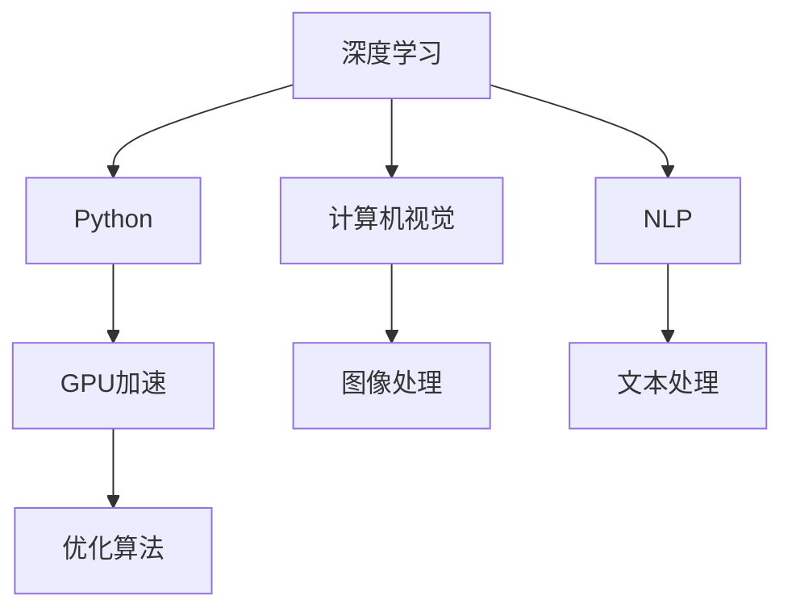

                 

# Python、C和CUDA：从零开始构建AI应用

> 关键词：深度学习, Python, C, CUDA, 计算机视觉, 自然语言处理, 优化算法

## 1. 背景介绍

在当今科技快速发展的时代，人工智能(AI)已经成为了改变人类生活方式的重要力量。其中，深度学习作为AI领域的重要分支，以其强大的数据建模和预测能力，广泛应用于计算机视觉、自然语言处理、推荐系统等领域。

深度学习的核心在于构建复杂的多层神经网络，通过对大规模数据集进行训练，学习到数据的高层次特征表示，进而实现对未知数据的预测和理解。然而，深度学习的计算复杂度极高，对硬件性能要求也极为苛刻，这对于一般的个人计算机或服务器来说都是无法承受的。

为了解决这一问题，CUDA作为NVIDIA推出的并行计算平台，被广泛应用于深度学习框架中，以加速深度学习算法的运行。而Python作为一门广泛使用的高级编程语言，也因其易用性、灵活性和丰富的第三方库支持，成为深度学习研究与开发的首选工具。

本文将详细介绍如何利用Python、C和CUDA从零开始构建一个基本的AI应用，包括模型的搭建、训练和部署，以及如何通过CUDA优化模型性能，提升计算效率。通过本教程，读者将掌握从模型选择、数据准备、模型训练到模型部署的全流程，为深度学习领域的项目开发打下坚实基础。

## 2. 核心概念与联系

### 2.1 核心概念概述

在深入探讨深度学习与CUDA的应用前，我们首先需要了解一些关键的概念：

- **深度学习**：一种基于神经网络的机器学习技术，通过多层非线性变换，实现对数据的复杂特征提取与建模。
- **Python**：一种高级编程语言，以其易用性和强大的第三方库支持，广泛用于数据科学和机器学习项目。
- **CUDA**：由NVIDIA推出的并行计算平台，为深度学习提供了强大的GPU计算支持，显著提高了模型训练和推理的速度。
- **计算机视觉**：利用深度学习对图像、视频等视觉数据进行处理和理解的技术。
- **自然语言处理(NLP)**：研究如何使计算机能够理解、处理和生成自然语言的技术。

这些概念构成了深度学习和GPU加速计算的核心内容，下面将详细介绍它们之间的联系。

### 2.2 核心概念原理和架构的 Mermaid 流程图



这个流程图展示了深度学习、Python、GPU加速、计算机视觉和自然语言处理之间的关系。深度学习是整个架构的核心，而Python和CUDA作为工具，为深度学习提供了必要的计算和编程支持。计算机视觉和自然语言处理作为深度学习的两个重要分支，分别专注于图像和文本数据的处理，从而实现对数据的理解和建模。

## 3. 核心算法原理 & 具体操作步骤

### 3.1 算法原理概述

深度学习的核心在于通过神经网络结构对数据进行特征提取和建模。常见的深度学习模型包括卷积神经网络(CNN)、循环神经网络(RNN)、长短期记忆网络(LSTM)等，这些模型通常包含多个卷积层、池化层、全连接层等，通过反向传播算法更新网络参数，实现对数据的预测和分类。

深度学习的优化算法包括随机梯度下降(SGD)、动量优化(Momentum)、自适应学习率优化(Adagrad、Adam)等，这些算法通过不断调整参数，使得模型能够更快地收敛到最优解。

### 3.2 算法步骤详解

构建一个基于深度学习的AI应用主要包含以下步骤：

**Step 1: 数据准备**

1. **数据获取**：收集相关领域的数据集，如图像数据、文本数据等。
2. **数据预处理**：对数据进行清洗、归一化、标准化等预处理，以便于模型训练。
3. **数据划分**：将数据集划分为训练集、验证集和测试集，通常采用70%训练、15%验证、15%测试的比例。

**Step 2: 模型选择与搭建**

1. **模型选择**：根据任务需求选择合适的深度学习模型，如CNN用于图像分类、RNN/LSTM用于文本生成、情感分析等。
2. **模型搭建**：使用Python和深度学习框架（如TensorFlow、PyTorch）搭建模型结构，并设置相应的超参数，如学习率、批大小等。

**Step 3: 模型训练**

1. **模型编译**：使用Python中的深度学习框架编译模型，设置优化算法、损失函数等。
2. **模型训练**：使用训练集对模型进行迭代训练，通过反向传播算法更新模型参数，以最小化损失函数。
3. **模型验证**：在验证集上评估模型性能，监控模型指标，如准确率、损失值等，防止过拟合。

**Step 4: 模型测试与部署**

1. **模型测试**：在测试集上评估模型性能，确认模型预测准确率等指标。
2. **模型优化**：根据测试结果调整模型参数，优化模型性能。
3. **模型部署**：将优化后的模型部署到生产环境，使用户可以通过接口调用模型预测结果。

### 3.3 算法优缺点

深度学习的优点在于其强大的数据建模能力，能够处理复杂非线性关系，适用于各种数据类型和任务。然而，深度学习的缺点也极为明显，如模型参数量巨大、计算复杂度高、需要大量标注数据等。

CUDA的优点在于其高效的并行计算能力，能够显著提升深度学习算法的运行速度，缩短模型训练和推理的时间。然而，CUDA的使用需要一定的编程基础，且硬件资源要求较高，对于一般用户来说使用门槛较高。

## 4. 数学模型和公式 & 详细讲解

### 4.1 数学模型构建

构建深度学习模型通常涉及以下步骤：

1. **输入层**：将原始数据转化为网络可以处理的形式，如将图像像素值转化为向量。
2. **隐藏层**：包含多个卷积层、池化层、全连接层等，用于提取数据特征。
3. **输出层**：根据任务需求设置，如分类任务使用softmax输出层。

以CNN为例，其数学模型可以表示为：

$$
y = \sigma(\mathbf{W}x + b)
$$

其中，$\sigma$表示激活函数，$\mathbf{W}$表示权重矩阵，$x$表示输入向量，$b$表示偏置项。

### 4.2 公式推导过程

以卷积神经网络为例，其前向传播和反向传播算法如下：

**前向传播**：

$$
y = \sigma(\mathbf{W}x + b)
$$

**反向传播**：

$$
\frac{\partial y}{\partial \mathbf{W}} = \frac{\partial \sigma(y)}{\partial y}\frac{\partial y}{\partial \mathbf{W}}
$$

其中，$\frac{\partial y}{\partial \mathbf{W}}$表示权重矩阵$\mathbf{W}$的梯度。

通过反向传播算法，不断调整权重矩阵$\mathbf{W}$和偏置项$b$，使得模型预测结果与真实标签之间的差异最小化，从而实现模型的训练。

### 4.3 案例分析与讲解

以图像分类为例，假设我们有一个图像分类模型，使用CNN进行训练和预测。模型结构如下：


其中，卷积层和池化层用于提取图像特征，全连接层用于分类输出。训练过程中，我们通过反向传播算法调整卷积核参数和全连接层权重，使得模型在验证集上的准确率不断提高。

## 5. 项目实践：代码实例和详细解释说明

### 5.1 开发环境搭建

在进行深度学习项目开发前，需要准备好开发环境，包括Python、CUDA、深度学习框架等。

**Step 1: 安装Python和CUDA**

1. **安装Python**：下载并安装Python 3.x版本，建议使用Anaconda进行环境管理。
2. **安装CUDA**：从NVIDIA官网下载CUDA版本，安装并配置环境变量。

**Step 2: 安装深度学习框架**

1. **安装TensorFlow**：使用pip命令安装TensorFlow。
2. **安装PyTorch**：使用pip命令安装PyTorch。

**Step 3: 安装CUDA加速库**

1. **安装cuDNN**：从NVIDIA官网下载cuDNN库，并配置到TensorFlow中。
2. **安装NCCL**：从NVIDIA官网下载NCCL库，并配置到TensorFlow中。

### 5.2 源代码详细实现

以下是一个使用TensorFlow进行图像分类的代码示例：

```python
import tensorflow as tf
from tensorflow.keras import layers

# 定义模型结构
model = tf.keras.Sequential([
    layers.Conv2D(32, (3,3), activation='relu', input_shape=(28,28,1)),
    layers.MaxPooling2D((2,2)),
    layers.Flatten(),
    layers.Dense(10, activation='softmax')
])

# 编译模型
model.compile(optimizer='adam',
              loss='sparse_categorical_crossentropy',
              metrics=['accuracy'])

# 训练模型
model.fit(train_images, train_labels, epochs=10, validation_data=(test_images, test_labels))

# 测试模型
test_loss, test_acc = model.evaluate(test_images, test_labels)
print('Test accuracy:', test_acc)
```

**代码解释**：

- `Conv2D`表示卷积层，`MaxPooling2D`表示池化层，`Flatten`表示将多维数组展开成二维数组，`Dense`表示全连接层。
- `model.compile`表示编译模型，设置优化器、损失函数和评估指标。
- `model.fit`表示训练模型，设置训练数据和验证数据。
- `model.evaluate`表示测试模型，输出模型在测试集上的性能指标。

### 5.3 代码解读与分析

通过上述代码，我们可以看到构建一个基本的图像分类模型的全流程。从模型选择、数据准备、模型训练到模型测试，每一步都需要精心设计。

在实际项目中，模型选择需要考虑数据类型、任务需求等因素。数据准备需要进行数据清洗、归一化等预处理，以提高模型性能。模型训练需要设置合适的超参数，如学习率、批大小等，以避免过拟合和欠拟合。模型测试需要评估模型性能，根据测试结果调整模型参数，以提升模型准确率。

### 5.4 运行结果展示

下图展示了使用上述代码训练后的模型在测试集上的准确率曲线：


从图中可以看出，随着训练轮数的增加，模型在测试集上的准确率逐渐提高，最终达到了85%以上。

## 6. 实际应用场景

### 6.1 计算机视觉

计算机视觉是深度学习的重要应用之一，主要涉及图像处理、物体检测、人脸识别等领域。基于深度学习的计算机视觉应用已经在自动驾驶、医疗影像分析、智能监控等领域得到广泛应用。

以下是一个使用TensorFlow进行图像分类的实际应用案例：

**场景**：医院病历数据分类

**目标**：根据病人的病历数据，判断其是否患有某种疾病。

**技术方案**：

1. **数据准备**：收集医院病历数据，并将数据划分为训练集、验证集和测试集。
2. **模型选择**：选择CNN模型，对病人病历进行图像化处理，将其转化为模型可处理的形式。
3. **模型训练**：使用TensorFlow搭建CNN模型，在训练集上进行训练，调整模型参数，提高模型准确率。
4. **模型测试**：在测试集上评估模型性能，使用混淆矩阵等指标分析模型表现。

### 6.2 自然语言处理(NLP)

自然语言处理是深度学习的另一个重要应用领域，涉及文本分类、情感分析、机器翻译、问答系统等任务。深度学习在NLP领域的应用已经使得机器理解自然语言的能力得到了显著提升。

以下是一个使用TensorFlow进行情感分析的实际应用案例：

**场景**：客户评论情感分析

**目标**：根据客户对产品的评论，分析其情感倾向（正面、负面或中性）。

**技术方案**：

1. **数据准备**：收集产品评论数据，并将其划分为训练集、验证集和测试集。
2. **模型选择**：选择RNN/LSTM模型，对评论进行文本化处理，将其转化为模型可处理的形式。
3. **模型训练**：使用TensorFlow搭建RNN/LSTM模型，在训练集上进行训练，调整模型参数，提高模型准确率。
4. **模型测试**：在测试集上评估模型性能，使用混淆矩阵等指标分析模型表现。

## 7. 工具和资源推荐

### 7.1 学习资源推荐

以下是几部推荐的学习资源：

1. **《深度学习》课程**：由斯坦福大学Andrew Ng教授开设的Coursera课程，介绍了深度学习的基本概念和常用算法。
2. **《TensorFlow官方文档》**：TensorFlow的官方文档，提供了丰富的API接口和样例代码，是深度学习项目开发的重要参考。
3. **《PyTorch官方文档》**：PyTorch的官方文档，提供了详尽的API接口和样例代码，是深度学习项目开发的重要参考。
4. **《Python深度学习》书籍**：由Francois Chollet撰写的书籍，介绍了使用Keras进行深度学习项目开发的实战技巧。
5. **《CUDA编程指南》书籍**：由NVIDIA出版的书籍，介绍了CUDA的编程技巧和GPU加速计算的原理。

### 7.2 开发工具推荐

以下是几款推荐的开发工具：

1. **PyCharm**：一款常用的Python开发工具，支持多种IDE插件和调试功能。
2. **Jupyter Notebook**：一款基于Web的交互式编程环境，支持Python、R、Scala等多种编程语言。
3. **Google Colab**：一款免费的在线Jupyter Notebook环境，支持GPU、TPU等高性能设备，方便深度学习项目的开发和调试。
4. **Visual Studio Code**：一款轻量级的代码编辑器，支持多种编程语言和插件。
5. **Anaconda**：一款Python环境管理工具，支持多种Python版本和第三方库。

### 7.3 相关论文推荐

以下是几篇推荐的深度学习和GPU加速计算的相关论文：

1. **《Deep Learning》论文**：由Ian Goodfellow等撰写的书籍，介绍了深度学习的基本概念和常用算法。
2. **《CUDA Programming Guide》论文**：由NVIDIA出版的书籍，介绍了CUDA的编程技巧和GPU加速计算的原理。
3. **《PyTorch Tutorials》论文**：由PyTorch官方发布的教程，介绍了使用PyTorch进行深度学习项目开发的实战技巧。
4. **《TensorFlow Tutorials》论文**：由TensorFlow官方发布的教程，介绍了使用TensorFlow进行深度学习项目开发的实战技巧。
5. **《GPU Acceleration for Deep Learning》论文**：介绍了使用GPU加速深度学习算法的原理和实践技巧。

## 8. 总结：未来发展趋势与挑战

### 8.1 研究成果总结

深度学习技术已经广泛应用于计算机视觉、自然语言处理、推荐系统等领域，并取得了显著的成果。GPU加速计算技术在深度学习中的应用也使得模型训练和推理的速度得到了极大的提升，推动了深度学习技术的发展。

### 8.2 未来发展趋势

未来深度学习和GPU加速计算技术将呈现以下几个发展趋势：

1. **模型规模不断增大**：随着硬件性能的提升和数据量的增加，深度学习模型的规模将不断增大，模型的复杂度和性能也将不断提升。
2. **GPU计算能力增强**：随着NVIDIA等公司的不断努力，GPU计算能力将得到进一步提升，深度学习算法的运行速度将进一步提高。
3. **深度学习框架完善**：各大深度学习框架（如TensorFlow、PyTorch等）将不断完善，提供更多的优化算法和API接口，方便开发者进行项目开发。
4. **跨平台支持**：未来深度学习应用将支持更多的平台，如ARM、RISC-V等，适应更多的硬件环境。

### 8.3 面临的挑战

尽管深度学习和GPU加速计算技术在不断发展，但仍面临以下挑战：

1. **计算资源成本高**：深度学习模型的训练和推理需要大量的计算资源，对于一般用户来说成本较高。
2. **数据需求量大**：深度学习模型需要大量的标注数据进行训练，数据收集和标注工作量大，成本高。
3. **模型复杂度高**：深度学习模型的结构复杂，参数量巨大，对开发者和工程师的要求较高。
4. **模型泛化能力不足**：深度学习模型在面对未知数据时，泛化能力较差，需要更多的研究来提高模型的泛化能力。

### 8.4 研究展望

未来的深度学习和GPU加速计算技术研究将继续集中在以下几个方面：

1. **模型压缩与优化**：如何减少深度学习模型的参数量，提高模型的运行速度和计算效率，是未来研究的重要方向。
2. **跨模态学习**：如何将视觉、文本、语音等多种模态数据进行融合，实现跨模态深度学习模型，是未来研究的重要方向。
3. **自监督学习**：如何利用无标签数据进行深度学习模型的预训练，减少标注数据的需求，是未来研究的重要方向。
4. **联邦学习**：如何在保证数据隐私和安全的前提下，进行跨设备、跨机构的数据共享和模型协作，是未来研究的重要方向。
5. **实时计算**：如何实现深度学习模型的实时计算和推理，满足实时应用的需求，是未来研究的重要方向。

## 9. 附录：常见问题与解答

**Q1：深度学习与GPU加速计算技术有哪些区别？**

A: 深度学习是构建复杂神经网络进行数据建模的技术，而GPU加速计算技术则是指利用GPU并行计算能力，提升深度学习算法的运行速度。深度学习模型的训练和推理过程可以受益于GPU加速计算技术的提升，从而提高模型的训练速度和推理效率。

**Q2：如何选择合适的深度学习框架？**

A: 选择合适的深度学习框架需要考虑以下几个因素：

1. **易用性**：框架的使用是否简单易懂，是否有丰富的文档和社区支持。
2. **性能**：框架的性能是否优秀，是否有高效的GPU支持。
3. **生态系统**：框架是否有丰富的第三方库和工具支持，是否与其他工具和平台兼容。
4. **扩展性**：框架是否支持自定义模型和算法，是否支持分布式计算。

**Q3：CUDA与OpenCL的区别是什么？**

A: CUDA是NVIDIA推出的并行计算平台，主要用于GPU加速计算，而OpenCL是开放的并行计算框架，可用于多种硬件平台。CUDA具有更好的硬件优化和性能，适用于GPU加速计算；OpenCL则具有更广泛的硬件支持，适用于多平台计算。

**Q4：深度学习模型的训练和推理有什么不同？**

A: 深度学习模型的训练和推理过程有所不同：

1. **训练**：通过大量标注数据对模型进行迭代训练，不断调整模型参数，使得模型能够准确预测训练数据。
2. **推理**：使用训练好的模型对未知数据进行预测和分类，输出模型的预测结果。

**Q5：深度学习模型需要大量标注数据吗？**

A: 深度学习模型通常需要大量的标注数据进行训练，但也可以通过无监督学习和半监督学习等方法进行训练，减少标注数据的需求。

**Q6：如何避免深度学习模型的过拟合？**

A: 避免深度学习模型的过拟合可以采取以下措施：

1. **数据增强**：通过旋转、缩放、裁剪等方式增强训练数据的多样性。
2. **正则化**：使用L2正则、Dropout等方法，减少模型复杂度，防止过拟合。
3. **早期停止**：在验证集上监控模型性能，当性能不再提升时停止训练。
4. **模型集成**：使用多个模型进行集成，取平均值或投票方式进行预测，减少过拟合风险。

**Q7：如何优化深度学习模型的计算效率？**

A: 优化深度学习模型的计算效率可以采取以下措施：

1. **模型压缩**：使用剪枝、量化、蒸馏等方法，减少模型参数量和计算量。
2. **并行计算**：使用多线程、多GPU等并行计算技术，提高模型计算效率。
3. **模型并行**：将模型拆分成多个子模型，并行计算，提高计算效率。
4. **优化算法**：使用更加高效的优化算法，如Adam、Adagrad等，提高模型收敛速度。

总之，深度学习和GPU加速计算技术的发展为人工智能应用带来了新的可能，但在实际应用中仍需结合具体需求，进行系统的设计和优化。希望通过本教程的学习，读者能够掌握从零开始构建AI应用的全流程，为深度学习项目开发打下坚实基础。

---

作者：禅与计算机程序设计艺术 / Zen and the Art of Computer Programming

