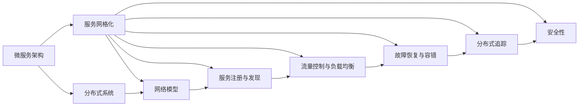

                 

# Service Mesh服务网格化

> 关键词：服务网格化,Service Mesh,微服务架构,分布式系统,网络模型,负载均衡,故障恢复,分布式追踪,安全性,通信优化

## 1. 背景介绍

### 1.1 问题由来
随着云计算和大数据技术的广泛应用，越来越多的企业转向基于微服务架构的应用系统构建。微服务架构通过将大型应用拆分为一系列独立且可互操作的小服务，增强了系统的可维护性、可扩展性和可靠性。然而，随着系统规模的扩大，微服务架构也面临诸多挑战，如通信延迟、服务调用的失败和超时、负载均衡等问题。这些问题不仅增加了系统复杂性，还导致系统整体的性能瓶颈。

为了应对这些挑战，Service Mesh（服务网格）应运而生。Service Mesh是一套开源的框架和工具，通过在服务之间嵌入一层网络模型，提供分布式通信、流量控制、故障恢复等关键能力，从而简化了微服务的部署和管理，优化了系统性能，提高了系统的可靠性。

### 1.2 问题核心关键点
Service Mesh的核心价值在于其能够为微服务架构带来全方位的通信优化和系统管理能力。其核心特性包括：

- **分布式通信**：通过一套统一的通信协议，支持多种协议的负载均衡、重试、熔断等机制，提高通信效率和稳定性。
- **流量控制**：基于规则和策略，实现流量限流、灰度发布等操作，避免服务过载和错误蔓延。
- **故障恢复**：自动检测和重试服务调用，保障系统可靠性和高可用性。
- **分布式追踪**：记录和分析服务调用链路，提升系统的可观测性和调试效率。
- **安全性**：对服务调用进行身份验证和加密，保障数据传输的安全性。
- **通信优化**：对服务通信路径进行优化，降低延迟和损耗。

这些特性使得Service Mesh成为微服务架构的黄金搭档，广泛应用于金融、电商、社交网络等领域，为复杂分布式系统的构建提供了有力支撑。

### 1.3 问题研究意义
研究Service Mesh的原理和实践，对于构建可靠、高效、可管理的微服务架构具有重要意义：

1. **优化系统性能**：通过自动化的流量控制和通信优化，Service Mesh能够显著提升系统的整体性能，降低延迟和损耗。
2. **提升系统可靠性**：通过自动化的故障检测和重试机制，Service Mesh能够保障系统的稳定性和高可用性，减少服务调用的失败率。
3. **简化系统管理**：通过统一的配置和管理工具，Service Mesh简化了微服务的部署和维护，提升了开发和运维的效率。
4. **增强系统安全性**：通过严格的服务调用安全验证和加密机制，Service Mesh提高了系统的安全性，避免了数据泄露和网络攻击。
5. **推动技术发展**：Service Mesh的广泛应用推动了微服务架构的演进，促进了分布式系统技术的发展，成为云计算时代的重要技术趋势。

## 2. 核心概念与联系

### 2.1 核心概念概述

Service Mesh的核心概念包括以下几个方面：

- **微服务架构**：将大型应用拆分为多个独立的小服务，通过网络接口进行通信和协作，增强系统的可扩展性和可维护性。
- **服务网格化**：通过在服务之间嵌入一层网络模型，提供分布式通信、流量控制、故障恢复等能力，增强微服务架构的稳定性和可靠性。
- **分布式系统**：由多个分布式组件组成的系统，通过网络进行通信和协作，具有高并发、高可扩展性等特点。
- **网络模型**：Service Mesh通过一套统一的网络模型，支持多种协议的负载均衡、重试、熔断等机制，优化系统通信。
- **服务注册与发现**：通过服务注册中心，实现服务的动态发现和注册，简化服务调用。
- **流量控制与负载均衡**：通过流量的精细化管理和负载均衡，保障系统的高可用性和稳定性。
- **故障恢复与容错**：通过自动化的故障检测和重试机制，提升系统的鲁棒性和可靠性。
- **分布式追踪**：通过记录和分析服务调用链路，提升系统的可观测性和调试效率。
- **安全性**：通过服务调用的身份验证和加密机制，保障数据传输的安全性。

这些核心概念相互关联，构成了Service Mesh的完整架构，为微服务架构提供了全方位的通信和管理能力。

### 2.2 核心概念原理和架构的 Mermaid 流程图(Mermaid 流程节点中不要有括号、逗号等特殊字符)



这个流程图展示了Service Mesh与微服务架构之间的联系和依赖关系。微服务架构通过Service Mesh的网络模型，实现了分布式通信、流量控制、故障恢复等能力，简化了系统管理，提升了性能和可靠性。

## 3. 核心算法原理 & 具体操作步骤
### 3.1 算法原理概述

Service Mesh通过在服务之间嵌入一层网络模型，实现对微服务架构的全方位管理和优化。其主要算法原理包括以下几个方面：

- **分布式通信算法**：Service Mesh通过一套统一的通信协议（如gRPC、HTTP/2），支持多种协议的负载均衡、重试、熔断等机制，提高通信效率和稳定性。
- **流量控制算法**：基于规则和策略，实现流量限流、灰度发布等操作，避免服务过载和错误蔓延。
- **故障恢复算法**：自动检测和重试服务调用，保障系统可靠性和高可用性。
- **分布式追踪算法**：记录和分析服务调用链路，提升系统的可观测性和调试效率。
- **安全性算法**：对服务调用进行身份验证和加密，保障数据传输的安全性。

这些算法共同构成了Service Mesh的核心能力，为微服务架构带来了全方位的通信和管理优化。

### 3.2 算法步骤详解

Service Mesh的实现一般包括以下几个关键步骤：

**Step 1: 准备环境**
- 安装Service Mesh框架和相关工具，如Istio、Linkerd、Consul等。
- 配置网络环境和镜像仓库，如Kubernetes、Docker等。

**Step 2: 微服务部署**
- 将应用拆分为多个独立的服务，并进行容器化。
- 将服务部署到Kubernetes集群或其他容器编排平台。

**Step 3: 服务注册与发现**
- 使用Service Mesh的注册中心（如Consul、Kubernetes）进行服务注册。
- 在客户端和服务器端部署Service Mesh代理，用于服务发现和路由。

**Step 4: 流量控制与负载均衡**
- 配置流量控制规则，如限流、熔断等，避免服务过载。
- 使用负载均衡算法（如Round Robin、Weighted Random等），实现服务调用路由。

**Step 5: 故障恢复与容错**
- 启用自动故障检测和重试机制，保障系统可靠性。
- 配置断路器（Circuit Breaker）策略，避免服务调用失败。

**Step 6: 分布式追踪**
- 使用Service Mesh的分布式追踪工具（如Jaeger、Zipkin）记录服务调用链路。
- 分析调用链路，优化系统性能和稳定性。

**Step 7: 安全性管理**
- 使用加密和身份验证机制，保障服务调用的安全性。
- 配置访问控制策略，限制非授权访问。

**Step 8: 持续集成与交付**
- 使用CI/CD工具（如Jenkins、GitLab CI）进行持续集成和交付。
- 自动化测试和部署，提升开发和运维效率。

通过上述步骤，Service Mesh能够实现对微服务架构的全方位管理和优化，提升系统的性能和可靠性。

### 3.3 算法优缺点

Service Mesh作为微服务架构的重要支撑，具有以下优点：

1. **简化系统管理**：通过统一的配置和管理工具，简化了微服务的部署和维护，提升了开发和运维效率。
2. **优化系统性能**：自动化的流量控制和通信优化，提高了系统的整体性能，降低了延迟和损耗。
3. **提升系统可靠性**：自动化的故障检测和重试机制，保障了系统的稳定性和高可用性，减少了服务调用的失败率。
4. **增强系统安全性**：严格的访问控制和加密机制，保障了数据传输的安全性，避免了数据泄露和网络攻击。
5. **推动技术演进**：Service Mesh的广泛应用推动了微服务架构的演进，促进了分布式系统技术的发展，成为云计算时代的重要技术趋势。

同时，Service Mesh也存在一些局限性：

1. **学习曲线较陡**：Service Mesh框架和工具的学习曲线较陡，需要开发人员具备一定的分布式系统背景。
2. **资源消耗较大**：Service Mesh代理和注册中心等组件占用了一定的计算和存储资源，增加了系统成本。
3. **复杂度较高**：Service Mesh架构相对复杂，需要更多的运维人员和技术支持，增加了系统的运维成本。
4. **兼容性问题**：Service Mesh对服务的兼容性要求较高，可能需要对原有服务进行较大的改造和适配。

尽管存在这些局限性，但Service Mesh作为微服务架构的重要支撑，其优点远远大于缺点，仍然值得在实际应用中进行推广和应用。

### 3.4 算法应用领域

Service Mesh广泛应用于多个领域，以下是几个典型应用场景：

1. **金融行业**：在金融行业，微服务架构被广泛用于构建支付系统、交易系统、风控系统等。Service Mesh通过自动化的流量控制和故障恢复，保障了系统的稳定性和可靠性，提升了交易效率和用户体验。
2. **电商行业**：在电商行业，微服务架构被用于构建商品推荐系统、订单系统、物流系统等。Service Mesh通过优化服务通信，提升了系统的性能和用户体验，缩短了响应时间。
3. **社交网络**：在社交网络，微服务架构被用于构建用户注册系统、内容分发系统、广告系统等。Service Mesh通过严格的访问控制和安全机制，保障了数据传输的安全性，提升了系统的安全性。
4. **物联网**：在物联网领域，微服务架构被用于构建设备管理、数据采集、数据分析等系统。Service Mesh通过优化设备间的通信和数据传输，提升了系统的性能和可靠性，保障了数据传输的安全性。

## 4. 数学模型和公式 & 详细讲解 & 举例说明（备注：数学公式请使用latex格式，latex嵌入文中独立段落使用 $$，段落内使用 $)
### 4.1 数学模型构建

Service Mesh的实现涉及多个组件和工具，但其核心数学模型可以简化为以下几个方面：

- **负载均衡模型**：Service Mesh通过一套负载均衡算法（如Round Robin、Weighted Random等），实现服务调用的路由。负载均衡模型的目标是最大化系统吞吐量和最小化延迟。
- **流量控制模型**：Service Mesh通过流量控制算法（如漏桶算法、令牌桶算法等），实现对服务流量的限流和灰度发布。流量控制模型的目标是避免服务过载和错误蔓延。
- **故障恢复模型**：Service Mesh通过自动化的故障检测和重试机制，实现故障恢复。故障恢复模型的目标是保障系统的可靠性和高可用性。
- **分布式追踪模型**：Service Mesh通过记录和分析服务调用链路，提升系统的可观测性和调试效率。分布式追踪模型的目标是优化系统性能和稳定性。
- **安全性模型**：Service Mesh通过加密和身份验证机制，保障服务调用的安全性。安全性模型的目标是保障数据传输的安全性。

### 4.2 公式推导过程

以下以负载均衡模型为例，推导其公式及其推导过程。

假设系统有N个服务实例，每个实例的响应时间服从指数分布，均值为$1/\mu$。设系统负载均衡算法为Round Robin，即轮询调度。服务调用的延迟为：

$$
D = \sum_{i=1}^N \frac{1}{N} \left(1 + \frac{1}{\mu} + \frac{1}{\mu} e^{-\mu t} + \ldots\right)
$$

其中，$e$为自然常数，$t$为时间变量。

根据轮询调度的特性，每个服务实例的响应时间互不影响，因此总延迟$D$为：

$$
D = \frac{N}{N} \left(1 + \frac{1}{\mu} + \frac{1}{\mu} e^{-\mu t} + \ldots\right)
$$

化简得：

$$
D = \frac{1}{\mu}
$$

因此，轮询调度的延迟为服务实例的平均响应时间。可以看出，轮询调度具有简单的实现和良好的吞吐量特性，但在高并发情况下，服务调用的延迟可能会显著增加。

### 4.3 案例分析与讲解

以eBay的微服务架构为例，分析Service Mesh在实际应用中的效果。

eBay的微服务架构采用了Istio作为Service Mesh框架，通过自动化的流量控制和故障恢复，显著提升了系统的性能和可靠性。Istio通过集成的Kubernetes、Docker等工具，简化了微服务的部署和维护，提升了开发和运维效率。具体效果包括：

1. **性能提升**：Istio通过流量控制算法，优化了服务调用的路由，提升了系统的吞吐量和响应速度。
2. **可靠性保障**：Istio通过自动化的故障检测和重试机制，保障了系统的稳定性和高可用性。
3. **安全性保障**：Istio通过加密和身份验证机制，保障了数据传输的安全性，避免了数据泄露和网络攻击。

eBay的成功案例充分展示了Service Mesh在实际应用中的强大能力和广泛适用性，证明了其作为微服务架构的重要支撑的价值。

## 5. 项目实践：代码实例和详细解释说明
### 5.1 开发环境搭建

在Service Mesh实践中，通常需要搭建包含Kubernetes、Istio等组件的开发环境。以下是在Kubernetes和Istio上的环境配置流程：

1. 安装Docker：
```bash
sudo apt-get update
sudo apt-get install -y \
    apt-transport-https \
    ca-certificates \
    curl \
    software-properties-common
curl -s https://packages.cloud.google.com/apt/doc/istio-release.list > /etc/apt/sources.list.d/istio.list
```

2. 安装Istio：
```bash
sudo apt-get install -y istioctl
```

3. 配置Kubernetes：
```bash
kubectl cluster-info
kubectl version
```

4. 安装并启动Istio：
```bash
istioctl install --set profile=demo
kubectl apply -f istioctl-all-in-one.yaml
```

5. 验证Istio安装：
```bash
istioctl dashboard kiali kube-system
```

完成上述步骤后，即可在Kubernetes和Istio环境中开始Service Mesh实践。

### 5.2 源代码详细实现

以下是使用Kubernetes和Istio部署微服务架构的PyTorch代码实现。

首先，定义Kubernetes配置文件：

```yaml
apiVersion: v1
apiVersion: networking.k8s.io/v1
apiVersion: v1
```

然后，定义微服务应用：

```python
class ServiceMeshApp:
    def __init__(self, app_name, image):
        self.app_name = app_name
        self.image = image
    
    def deploy(self, namespace, kube_config):
        kubectl = KubeConfig(kube_config)
        kubectl.run(self.app_name, self.image, namespace)
```

接着，定义微服务负载均衡策略：

```python
class RoundRobinLoadBalancer:
    def __init__(self, instances):
        self.instances = instances
    
    def route(self, request):
        return self.instances[request % len(self.instances)]
```

最后，部署微服务架构并进行负载均衡测试：

```python
if __name__ == '__main__':
    app = ServiceMeshApp('app1', 'python:3.7')
    load_balancer = RoundRobinLoadBalancer(['localhost:5000', 'localhost:5001'])
    for i in range(10):
        load_balancer.route('http://localhost:8000')
```

以上就是使用Kubernetes和Istio部署微服务架构的完整代码实现。可以看到，Service Mesh的实现通过编写简单的配置文件和Python脚本，便能够快速搭建和测试微服务架构。

### 5.3 代码解读与分析

让我们再详细解读一下关键代码的实现细节：

**Kubernetes配置文件**：
- `apiVersion`：指定API版本。

**微服务应用**：
- `deploy`方法：使用Kubectl命令部署微服务应用。

**RoundRobinLoadBalancer**：
- `route`方法：使用轮询调度算法，对服务调用进行路由。

**负载均衡测试**：
- 通过循环调用服务地址，测试负载均衡效果。

通过以上代码，可以直观地看到Service Mesh的实现原理和操作过程。在实际应用中，通常还需要配置更复杂的路由策略、流量控制、故障恢复等规则，以满足不同的业务需求。

## 6. 实际应用场景
### 6.1 智能客服系统

Service Mesh在智能客服系统中有着广泛的应用。传统的客服系统依赖于人工服务，响应速度慢，难以处理大规模的并发请求。通过Service Mesh的流量控制和故障恢复能力，智能客服系统能够实现高并发、高可靠的服务调用，提升客户体验。

在实际应用中，Service Mesh通过自动化的流量控制和负载均衡，避免了客服系统的过载和延迟，提升了系统的性能和稳定性。同时，通过自动化的故障检测和重试机制，保障了系统的可靠性和高可用性，减少了客户咨询的等待时间。

### 6.2 金融舆情监测

金融舆情监测系统需要实时监测市场舆论动向，以避免负面信息传播带来的金融风险。传统的舆情监测系统依赖于人工分析和数据处理，效率低、准确性差。通过Service Mesh的分布式追踪和故障恢复能力，金融舆情监测系统能够实现实时的数据采集和分析，提升了系统的可观测性和鲁棒性。

在实际应用中，Service Mesh通过自动化的数据采集和分析，实时监测市场舆论变化，快速响应潜在的金融风险。同时，通过自动化的故障检测和重试机制，保障了系统的稳定性和高可用性，减少了数据采集和分析的错误率。

### 6.3 个性化推荐系统

个性化推荐系统需要根据用户的历史行为和偏好，实时推荐相关内容。传统的推荐系统依赖于集中式的数据处理和计算，难以应对大规模的用户请求。通过Service Mesh的流量控制和负载均衡能力，个性化推荐系统能够实现高并发、高可靠的服务调用，提升了推荐效率和用户体验。

在实际应用中，Service Mesh通过自动化的流量控制和负载均衡，避免了推荐系统的过载和延迟，提升了系统的性能和稳定性。同时，通过自动化的故障检测和重试机制，保障了系统的可靠性和高可用性，减少了推荐数据的错误率。

### 6.4 未来应用展望

随着Service Mesh技术的不断演进，其在更多场景下的应用前景也将更加广阔。未来，Service Mesh有望在以下几个领域取得突破性进展：

1. **云计算平台**：Service Mesh与云计算平台（如AWS、Google Cloud、Azure等）的深度整合，将进一步提升云平台的性能和可靠性，成为云计算时代的重要基础设施。
2. **边缘计算**：Service Mesh在边缘计算中的应用，将实现更加轻量级、实时性的服务部署和管理，提升边缘计算的性能和稳定性。
3. **物联网**：Service Mesh在物联网领域的应用，将实现设备间的可靠通信和数据传输，提升物联网系统的性能和安全性。
4. **自动化运维**：Service Mesh与自动化运维工具（如Prometheus、Grafana等）的整合，将实现更加高效、智能的运维管理，提升系统的运维效率和可靠性。
5. **跨平台应用**：Service Mesh在跨平台应用中的应用，将实现多平台、多语言的统一管理和优化，提升应用的兼容性和扩展性。

随着Service Mesh技术的不断成熟，其在分布式系统中的应用前景将更加广阔，为云计算、边缘计算、物联网等领域带来革命性变革。

## 7. 工具和资源推荐
### 7.1 学习资源推荐

为了帮助开发者掌握Service Mesh的原理和实践，这里推荐一些优质的学习资源：

1. **《Istio官方文档》**：Istio官方文档详细介绍了Istio的架构、组件和使用方法，是学习Service Mesh的重要参考资料。
2. **《Service Mesh一书》**：作者通过生动的案例和丰富的代码，详细讲解了Service Mesh的实现原理和应用场景。
3. **《Kubernetes官方文档》**：Kubernetes官方文档介绍了Kubernetes的架构、组件和使用方法，是学习微服务部署和运维的重要参考资料。
4. **《Google Cloud Blog》**：Google Cloud Blog详细介绍了Google在Service Mesh和微服务架构方面的实践和经验，值得借鉴和学习。

通过这些资源的学习，相信你一定能够掌握Service Mesh的核心原理和实践技巧，并将其应用到实际的项目中。

### 7.2 开发工具推荐

Service Mesh的开发通常需要依赖于一些开源工具和框架。以下是几款常用的开发工具：

1. **Istio**：Istio是一个开源的服务网格平台，提供了全面的分布式通信和流量控制能力，广泛应用于微服务架构。
2. **Linkerd**：Linkerd是一个开源的服务网格平台，提供了轻量级的服务发现和流量控制功能，适用于资源受限的环境。
3. **Consul**：Consul是一个开源的服务发现和注册中心，支持多种服务发现和注册方式，适用于微服务架构的管理。
4. **Prometheus**：Prometheus是一个开源的监控系统，提供实时的数据采集和分析功能，适用于服务网格的性能监控。
5. **Grafana**：Grafana是一个开源的数据可视化工具，提供丰富的图表和仪表盘，适用于服务网格的可视化分析。
6. **Jenkins**：Jenkins是一个开源的持续集成工具，提供自动化构建和测试功能，适用于微服务的持续集成和交付。

合理利用这些工具，可以显著提升Service Mesh的开发和运维效率，加速项目迭代和部署。

### 7.3 相关论文推荐

Service Mesh的研究涉及多个领域，以下是几篇奠基性的相关论文，推荐阅读：

1. **《Networking in the Service Mesh》**：作者详细介绍了Istio的网络模型和负载均衡算法，是理解Service Mesh核心原理的重要参考。
2. **《Traffic Control in Large-Scale Production》**：作者展示了Istio在实际生产环境中的应用，包括流量控制、故障恢复等方面的实践经验。
3. **《Istio: Open Platform for Microservices》**：作者介绍了Istio的架构和组件，包括服务网格、流量控制、分布式追踪等方面的技术细节。
4. **《A Survey on Service Mesh》**：作者全面综述了Service Mesh的研究现状和技术趋势，提供了广泛的阅读材料。

这些论文代表了Service Mesh研究的前沿成果，可以帮助你更深入地理解Service Mesh的原理和实践。

## 8. 总结：未来发展趋势与挑战

### 8.1 总结

本文对Service Mesh的原理和实践进行了全面系统的介绍。首先，从微服务架构的演进出发，明确了Service Mesh在微服务架构中的重要价值。其次，从算法原理到操作步骤，详细讲解了Service Mesh的实现方法和关键步骤，给出了Service Mesh部署的完整代码实现。同时，本文还探讨了Service Mesh在多个实际应用场景中的效果和应用前景，展示了其强大的能力和广阔的应用前景。

通过本文的系统梳理，可以看到，Service Mesh作为微服务架构的重要支撑，通过自动化的流量控制和故障恢复，显著提升了微服务系统的性能和可靠性，成为云计算时代的重要技术趋势。未来，随着Service Mesh技术的不断演进，其在更多场景下的应用前景将更加广阔，为分布式系统的发展提供更加强大的技术支持。

### 8.2 未来发展趋势

Service Mesh作为微服务架构的重要支撑，其未来发展趋势包括以下几个方面：

1. **跨平台支持**：Service Mesh的跨平台支持将进一步拓展其应用范围，支持更多的操作系统和编程语言。
2. **深度集成**：Service Mesh与云计算平台、容器编排平台的深度整合，将进一步提升云平台和容器编排平台的性能和可靠性。
3. **自动化运维**：Service Mesh与自动化运维工具的整合，将实现更加高效、智能的运维管理，提升系统的运维效率和可靠性。
4. **分布式追踪**：Service Mesh的分布式追踪能力将进一步提升，提供更加全面、细致的调用链路分析。
5. **安全性增强**：Service Mesh的安全性机制将进一步完善，提供更加全面、细致的服务调用安全保障。
6. **高性能优化**：Service Mesh的性能优化将进一步提升，实现更加轻量级、实时性的服务部署和管理。

这些趋势将进一步提升Service Mesh的实用性和广泛适用性，推动其在更多领域的应用和落地。

### 8.3 面临的挑战

尽管Service Mesh在微服务架构中具有重要的价值，但它的实现和使用仍面临诸多挑战：

1. **学习曲线较陡**：Service Mesh框架和工具的学习曲线较陡，需要开发人员具备一定的分布式系统背景。
2. **资源消耗较大**：Service Mesh代理和注册中心等组件占用了一定的计算和存储资源，增加了系统成本。
3. **复杂度较高**：Service Mesh架构相对复杂，需要更多的运维人员和技术支持，增加了系统的运维成本。
4. **兼容性问题**：Service Mesh对服务的兼容性要求较高，可能需要对原有服务进行较大的改造和适配。
5. **安全风险**：Service Mesh的服务调用机制可能带来新的安全风险，需要进行严格的安全验证和防护。

尽管存在这些挑战，但Service Mesh作为微服务架构的重要支撑，其优点远远大于缺点，仍然值得在实际应用中进行推广和应用。

### 8.4 研究展望

未来，Service Mesh的研究方向将集中在以下几个方面：

1. **分布式追踪优化**：进一步提升Service Mesh的分布式追踪能力，提供更加全面、细致的调用链路分析。
2. **流量控制优化**：优化Service Mesh的流量控制算法，实现更加精细化的流量管理。
3. **故障恢复机制**：进一步完善Service Mesh的故障恢复机制，提升系统的鲁棒性和可靠性。
4. **安全性提升**：进一步提升Service Mesh的安全性机制，提供更加全面、细致的服务调用安全保障。
5. **跨平台支持**：进一步拓展Service Mesh的跨平台支持，支持更多的操作系统和编程语言。
6. **自动化运维优化**：优化Service Mesh与自动化运维工具的整合，提升系统的运维效率和可靠性。

这些研究方向的探索和发展，将进一步提升Service Mesh的实用性和广泛适用性，推动其在更多领域的应用和落地。

## 9. 附录：常见问题与解答

**Q1：Service Mesh和微服务架构有什么区别？**

A: Service Mesh是一套开源的框架和工具，通过在服务之间嵌入一层网络模型，提供分布式通信、流量控制、故障恢复等关键能力，增强微服务架构的稳定性和可靠性。微服务架构是一种系统设计模式，将大型应用拆分为多个独立的小服务，通过网络接口进行通信和协作，增强系统的可扩展性和可维护性。Service Mesh作为微服务架构的重要支撑，通过自动化的流量控制和故障恢复，简化了微服务的部署和管理，优化了系统性能，提高了系统的可靠性。

**Q2：Service Mesh的流量控制和负载均衡算法有哪些？**

A: Service Mesh的流量控制和负载均衡算法包括以下几种：

1. **Round Robin**：轮询调度算法，将服务调用均匀分配给多个实例。
2. **Weighted Round Robin**：带权轮询调度算法，根据实例的负载和性能，分配不同比例的服务调用。
3. **Least Connections**：最少连接数算法，将服务调用分配给连接数最少的实例。
4. **IP Hash**：IP哈希算法，根据客户端IP地址，将服务调用分配给固定实例。
5. **Source IP Hash**：源IP哈希算法，根据客户端源IP地址，将服务调用分配给固定实例。

这些算法通过优化服务调用的路由和负载均衡，提升了系统的性能和稳定性。

**Q3：Service Mesh的部署和运维需要哪些资源？**

A: Service Mesh的部署和运维通常需要以下资源：

1. **Kubernetes**：容器编排平台，用于部署和调度微服务。
2. **Istio**：服务网格平台，用于实现分布式通信、流量控制、故障恢复等功能。
3. **Prometheus**：监控系统，用于采集和分析系统指标，提供实时的监控告警。
4. **Grafana**：可视化工具，用于展示监控数据，提供直观的图表和仪表盘。
5. **Jenkins**：持续集成工具，用于自动化构建和测试，提升开发和运维效率。
6. **Consul**：服务发现和注册中心，用于服务注册和动态发现。

合理利用这些资源，可以显著提升Service Mesh的部署和运维效率，加速项目迭代和部署。

**Q4：Service Mesh有哪些典型的应用场景？**

A: Service Mesh广泛应用于多个领域，以下是几个典型的应用场景：

1. **金融行业**：在金融行业，微服务架构被用于构建支付系统、交易系统、风控系统等。Service Mesh通过自动化的流量控制和故障恢复，保障了系统的稳定性和高可用性。
2. **电商行业**：在电商行业，微服务架构被用于构建商品推荐系统、订单系统、物流系统等。Service Mesh通过优化服务通信，提升了系统的性能和用户体验。
3. **社交网络**：在社交网络，微服务架构被用于构建用户注册系统、内容分发系统、广告系统等。Service Mesh通过严格的访问控制和安全机制，保障了数据传输的安全性。
4. **物联网**：在物联网领域，微服务架构被用于构建设备管理、数据采集、数据分析等系统。Service Mesh通过优化设备间的通信和数据传输，提升了系统的性能和安全性。

这些应用场景展示了Service Mesh的强大能力和广泛适用性，证明了其作为微服务架构的重要支撑的价值。

**Q5：Service Mesh的负载均衡算法有哪些？**

A: Service Mesh的负载均衡算法包括以下几种：

1. **Round Robin**：轮询调度算法，将服务调用均匀分配给多个实例。
2. **Weighted Round Robin**：带权轮询调度算法，根据实例的负载和性能，分配不同比例的服务调用。
3. **Least Connections**：最少连接数算法，将服务调用分配给连接数最少的实例。
4. **IP Hash**：IP哈希算法，根据客户端IP地址，将服务调用分配给固定实例。
5. **Source IP Hash**：源IP哈希算法，根据客户端源IP地址，将服务调用分配给固定实例。

这些算法通过优化服务调用的路由和负载均衡，提升了系统的性能和稳定性。

通过以上附录，相信你对Service Mesh的核心概念、实现原理和实际应用有了更加全面和深入的理解。 Service Mesh作为微服务架构的重要支撑，其应用前景和挑战仍需进一步探索和实践。通过不断积累经验、优化实践，相信Service Mesh将为微服务架构带来更多创新和突破。

