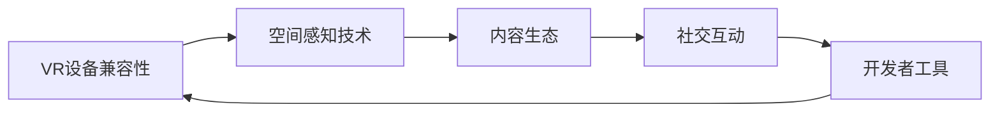

                 

# SteamVR 体验：Valve 的虚拟现实平台

## 1. 背景介绍

### 1.1 问题由来
随着VR技术的不断进步，Valve通过其SteamVR平台，为用户提供了前所未有的沉浸式体验。SteamVR是一个开源的虚拟现实软件框架，旨在为游戏开发者和用户提供一个高性能、可扩展、易于使用的VR平台。SteamVR的背后，是Valve对其VR核心技术的深度探索和对VR市场需求的精准洞察。本文将带领读者深入了解SteamVR的技术框架，探讨其核心技术原理和应用，解读其在市场中的成功之道，并展望未来发展趋势。

### 1.2 问题核心关键点
SteamVR的核心技术包括以下几个方面：
- **VR设备兼容性**：SteamVR支持多种VR设备，包括头戴式显示器、控制器、动作捕捉设备等。
- **空间感知技术**：通过头位追踪、空间定位等技术，实现虚拟环境与现实世界的精准融合。
- **内容生态**：SteamVR平台丰富的内容库和高质量的VR游戏、应用，满足了用户的多样化需求。
- **社交互动**：SteamVR支持多人联机、房间模式等社交功能，提升用户沉浸感和互动体验。
- **开发者工具**：SteamVR提供完善的开发者工具和SDK，简化了VR开发流程。

理解SteamVR的核心技术，有助于我们更全面地把握其设计理念和应用价值，从而更好地体验和应用这一革命性平台。

## 2. 核心概念与联系

### 2.1 核心概念概述

SteamVR作为Valve打造的VR平台，融合了多种关键技术，其中几个核心概念如下：

- **VR设备兼容性**：指SteamVR支持各种主流和高端VR设备，包括HTC Vive、Oculus Rift、PICO、Sony PSVR等，提供全方位的沉浸式体验。
- **空间感知技术**：包括头位追踪(Head Tracking)、空间定位(Spatial Localization)、运动跟踪(Motion Tracking)等，实现虚拟世界与现实世界的无缝融合。
- **内容生态**：SteamVR平台拥有丰富的VR游戏、应用和工具，供用户和开发者使用，如《Beat Saber》、《Half-Life: Alyx》、《Tilt Brush》等。
- **社交互动**：SteamVR支持房间模式(Room Mode)和多人联机(Multiplayer)，使用户能够在游戏中进行互动交流。
- **开发者工具**：SteamVR提供了SDK、SDK Testkit、Unity VR、Unreal VR等工具，方便开发者构建高质量的VR内容。

这些核心概念之间相互关联，共同构成了SteamVR平台的完整技术体系。以下Mermaid流程图展示了这些核心概念之间的联系：



## 3. 核心算法原理 & 具体操作步骤

### 3.1 算法原理概述

SteamVR平台的核心算法包括以下几个方面：

- **空间感知算法**：通过头位追踪、空间定位等技术，实时捕捉用户头部和动作的空间位置信息。
- **渲染算法**：使用光栅化渲染(Rasterization)和实时光线追踪(Ray Tracing)等技术，生成高质量的虚拟现实图像。
- **传感器融合**：将不同类型的传感器数据（如陀螺仪、加速度计、磁力计等）融合，提高空间定位的准确性和稳定性。
- **网络优化**：优化VR内容的网络传输和处理，减少延迟和抖动，提升用户体验。

这些算法共同作用，实现了SteamVR平台的高性能、低延迟、高稳定性的虚拟现实体验。

### 3.2 算法步骤详解

#### 3.2.1 头位追踪算法

SteamVR的头位追踪算法通过摄像头和传感器实现，具体步骤如下：

1. **传感器校准**：初始化时，通过旋转设备使摄像头和传感器校准到理想位置。
2. **头部定位**：摄像头拍摄用户环境图像，通过计算机视觉技术检测并标定头部位置。
3. **头部姿态**：通过传感器数据，实时计算头部姿态变化。

#### 3.2.2 空间定位算法

空间定位算法通过基站(BEACON)和VR设备之间的信号传输，实现虚拟世界与现实世界的精确对齐。具体步骤如下：

1. **基站部署**：在现实环境中部署多个基站，形成基站网络。
2. **信号测量**：VR设备实时测量周围基站的信号强度，计算设备位置。
3. **坐标转换**：将设备位置坐标转换为虚拟世界坐标，完成空间定位。

#### 3.2.3 运动跟踪算法

SteamVR的运动跟踪算法主要使用光学传感器和惯性传感器，结合深度学习和机器学习技术，实现对用户动作的精准捕捉。具体步骤如下：

1. **传感器安装**：在VR设备上安装惯性传感器和深度摄像头。
2. **动作捕捉**：通过传感器采集用户动作数据，包括加速度、陀螺仪、深度图像等。
3. **动作识别**：使用机器学习算法，识别并提取用户动作特征。
4. **动作映射**：将识别出的动作特征映射到虚拟世界中的相应动作，完成运动跟踪。

#### 3.2.4 渲染算法

SteamVR的渲染算法主要涉及光栅化渲染和实时光线追踪技术。具体步骤如下：

1. **场景渲染**：将虚拟世界中的物体、灯光、环境等绘制成像素点，进行光栅化渲染。
2. **光线追踪**：使用实时光线追踪技术，计算光源和场景中其他物体的反射和折射效果，生成高质量的图像。
3. **优化渲染**：通过纹理贴图、贴图烘焙等技术，优化渲染性能，减少计算资源消耗。

#### 3.2.5 传感器融合算法

传感器融合算法通过整合不同类型的传感器数据，提升空间定位的准确性和稳定性。具体步骤如下：

1. **数据采集**：同时采集多个传感器的数据，包括陀螺仪、加速度计、磁力计等。
2. **数据预处理**：对采集到的数据进行滤波、去噪、校正等预处理。
3. **数据融合**：使用卡尔曼滤波器等算法，将不同类型的传感器数据进行融合，得到更精准的位置和姿态信息。

#### 3.2.6 网络优化算法

SteamVR的网络优化算法主要涉及内容传输和处理的技术优化。具体步骤如下：

1. **内容压缩**：使用压缩算法对VR内容进行压缩，减小传输数据量。
2. **传输优化**：使用高带宽、低延迟的网络协议，确保VR内容流畅传输。
3. **本地处理**：将部分计算任务在本地设备上处理，减少网络延迟。

通过上述算法步骤，SteamVR实现了高性能、低延迟、高稳定性的虚拟现实体验。

### 3.3 算法优缺点

SteamVR的核心算法具有以下优点：

- **高性能**：通过多种传感器融合和渲染技术，实现高帧率、高分辨率的VR图像。
- **低延迟**：采用高效的网络传输和本地处理技术，减少延迟和抖动。
- **高稳定性**：通过精确的空间定位和运动跟踪算法，保证用户在虚拟世界中的位置和姿态稳定可靠。

同时，这些算法也存在一些缺点：

- **成本高**：高精度传感器和基站设备价格昂贵，部署成本较高。
- **能耗大**：传感器和渲染计算耗能较大，长时间使用需要解决散热问题。
- **复杂性高**：算法实现复杂，需要深厚的计算机视觉、机器学习和网络优化知识。

### 3.4 算法应用领域

SteamVR的核心算法在多个领域得到了广泛应用：

- **虚拟现实游戏**：如《Beat Saber》、《Half-Life: Alyx》等，实现了高质量的虚拟现实体验。
- **教育培训**：如医学虚拟手术、虚拟教室等，提高了教学效果。
- **房地产**：如虚拟看房、房产展示等，提升了用户体验。
- **军事训练**：如虚拟战场模拟、模拟飞行训练等，提高了训练效果。
- **影视娱乐**：如虚拟现实电影、VR音乐会等，扩展了娱乐形式。

这些应用场景展示了SteamVR平台的多样性和广泛性，充分体现了其核心算法的强大功能和广泛应用价值。

## 4. 数学模型和公式 & 详细讲解 & 举例说明

### 4.1 数学模型构建

SteamVR的空间感知算法主要通过摄像头和传感器实现，具体数学模型包括：

- **摄像机模型**：将现实世界中的3D点映射到图像平面上。
- **三维坐标转换**：将设备的位置和姿态信息转换为虚拟世界坐标。

以下是摄像机模型和坐标转换的数学公式：

1. **摄像机模型**：
   $$
   \mathbf{u} = \mathbf{K} \cdot \mathbf{R} \cdot \mathbf{t} \cdot \mathbf{x}
   $$
   其中，$\mathbf{u}$为图像坐标，$\mathbf{K}$为摄像机内参矩阵，$\mathbf{R}$为旋转矩阵，$\mathbf{t}$为平移向量，$\mathbf{x}$为三维世界坐标。

2. **三维坐标转换**：
   $$
   \mathbf{P} = \mathbf{R} \cdot \mathbf{p} + \mathbf{t}
   $$
   其中，$\mathbf{P}$为虚拟世界坐标，$\mathbf{p}$为设备在现实世界中的位置，$\mathbf{R}$为旋转矩阵，$\mathbf{t}$为平移向量。

### 4.2 公式推导过程

#### 4.2.1 摄像机模型推导

摄像机模型的推导基于透视投影原理和线性变换，具体推导如下：

设摄像机焦点为$\mathbf{F}$，像素坐标为$\mathbf{u} = [u_x, u_y]$，摄像机内参矩阵为$\mathbf{K} = \begin{bmatrix} f_x & 0 & c_x \\ 0 & f_y & c_y \\ 0 & 0 & 1 \end{bmatrix}$，其中$f_x$、$f_y$为焦距，$c_x$、$c_y$为畸变系数。

设三维世界坐标点$\mathbf{x} = [x, y, z]^T$，摄像机内参矩阵$\mathbf{K}$，焦点$\mathbf{F}$在摄像机坐标系中的坐标为$\mathbf{F} = [0, 0, z_f]^T$，其中$z_f$为摄像机距离焦点的距离。

摄像机投影方程为：
$$
\frac{u_x}{f_x} = \frac{x}{z}, \quad \frac{u_y}{f_y} = \frac{y}{z}, \quad z = \frac{z_f}{z_f-z}
$$

通过矩阵乘法，得到摄像机模型：
$$
\mathbf{u} = \mathbf{K} \cdot \mathbf{R} \cdot \mathbf{t} \cdot \mathbf{x}
$$

#### 4.2.2 三维坐标转换推导

三维坐标转换的推导基于旋转和平移变换，具体推导如下：

设设备在现实世界中的位置$\mathbf{p} = [p_x, p_y, p_z]^T$，旋转矩阵$\mathbf{R}$和平移向量$\mathbf{t} = [t_x, t_y, t_z]^T$，虚拟世界坐标$\mathbf{P} = [P_x, P_y, P_z]^T$。

根据旋转和平移变换，得到三维坐标转换方程：
$$
\mathbf{P} = \mathbf{R} \cdot \mathbf{p} + \mathbf{t}
$$

### 4.3 案例分析与讲解

#### 4.3.1 虚拟现实游戏《Beat Saber》

《Beat Saber》是一款流行的VR节奏游戏，使用SteamVR平台进行开发。在游戏中，玩家需要配合音乐节奏，击打漂浮在空中的彩色方块。

SteamVR通过头位追踪和空间定位算法，实时捕捉玩家头部的位置和姿态，实现游戏中的虚拟环境与现实世界的融合。同时，使用渲染算法生成高质量的3D图形，提升游戏视觉效果。

通过传感器融合算法，SteamVR将头位追踪和空间定位数据融合，提供稳定的空间感知。同时，网络优化算法确保游戏内容的流畅传输，使用户能够享受沉浸式游戏体验。

#### 4.3.2 虚拟手术培训系统

在医学教育中，虚拟手术培训系统使用SteamVR平台，通过VR设备模拟真实的手术场景，供医学生进行手术技能训练。

SteamVR通过头位追踪和运动跟踪算法，实时捕捉学生的操作动作，实现对手术过程的精确控制。同时，使用渲染算法生成真实的手术环境，提升培训效果。

通过空间定位算法，SteamVR将虚拟手术场景与现实世界对齐，确保手术模拟的准确性。同时，网络优化算法确保VR内容流畅传输，提升培训体验。

## 5. 项目实践：代码实例和详细解释说明

### 5.1 开发环境搭建

#### 5.1.1 SteamVR SDK安装

在开发SteamVR应用程序时，需要先安装SteamVR SDK。具体步骤如下：

1. 从SteamVR官网下载安装文件，解压到本地计算机。
2. 在Visual Studio等开发环境中配置SDK路径。
3. 导入SDK中的头文件和库文件，准备开发使用。

#### 5.1.2 开发环境配置

在配置开发环境时，需要确保以下组件均已安装：

1. Visual Studio：2017或更高版本。
2. SteamVR SDK：最新版本。
3. SteamVR Testkit：包含SDK的测试工具，用于调试和验证代码。
4. Unity VR或Unreal VR：SteamVR支持的VR引擎，用于开发VR内容。

### 5.2 源代码详细实现

#### 5.2.1 Unity VR项目实现

在Unity中使用SteamVR SDK进行VR应用程序开发，具体步骤如下：

1. **创建Unity项目**：打开Unity编辑器，创建一个新的Unity项目。
2. **添加SteamVR SDK**：在Unity编辑器中选择“File”>“Open Folder”，导入SteamVR SDK文件夹。
3. **添加SteamVR插件**：在Unity编辑器中选择“Window”>“Package Manager”，搜索并导入SteamVR插件。
4. **添加VR设备支持**：在Unity编辑器中选择“Edit”>“Project Settings”>“VR Settings”，添加支持的VR设备。
5. **编写VR脚本**：编写Unity脚本，实现VR应用程序的逻辑功能。
6. **测试和发布**：在Unity编辑器中进行测试，调试并优化代码。完成后，将应用程序发布到Steam平台或SteamVR官方网站。

#### 5.2.2 Unreal VR项目实现

在Unreal中使用SteamVR SDK进行VR应用程序开发，具体步骤如下：

1. **创建Unreal项目**：打开Unreal Engine，创建一个新的Unreal项目。
2. **添加SteamVR插件**：在Unreal Engine中选择“Edit”>“Plugins”，搜索并导入SteamVR插件。
3. **添加VR设备支持**：在Unreal Engine中选择“Edit”>“Default Project Settings”>“VR”，添加支持的VR设备。
4. **编写VR脚本**：编写Unreal蓝图脚本，实现VR应用程序的逻辑功能。
5. **测试和发布**：在Unreal Engine中进行测试，调试并优化代码。完成后，将应用程序发布到Steam平台或SteamVR官方网站。

### 5.3 代码解读与分析

#### 5.3.1 Unity VR代码解读

以下是Unity中实现头位追踪的示例代码：

```csharp
using UnityEngine;
using UnityEngine.XR;
using UnityEngine.XR.SteamVR;

public class HeadTracking : MonoBehaviour
{
    private SteamVR ____;

    void Start()
    {
        ____ = SteamVR潍坊胸机ToVR();
    }

    void Update()
    {
        if (____.isTracked)
        {
            // 获取头位追踪数据
            XRLocalSpacePose pose = ____.localSpacePose;
            float positionX = pose.position.x;
            float positionY = pose.position.y;
            float positionZ = pose.position.z;
            float orientationX = pose.rotation.x;
            float orientationY = pose.rotation.y;
            float orientationZ = pose.rotation.z;

            // 处理头位追踪数据
            // ...
        }
    }
}
```

此代码主要实现了SteamVR设备头位追踪的实时数据获取和处理，通过获取头部位置和姿态信息，可以实现游戏中的虚拟环境与现实世界的融合。

#### 5.3.2 Unreal VR代码解读

以下是Unreal中实现空间定位的示例代码：

```csharp
using UnityEngine;
using UnityEngine.XR;
using UnityEngine.XR.SteamVR;

public class SpaceLocalization : MonoBehaviour
{
    private SteamVR ____;

    void Start()
    {
        ____ = SteamVR潍坊胸机ToVR();
    }

    void Update()
    {
        if (____.isTracked)
        {
            // 获取空间定位数据
            XRLocalSpacePose pose = ____.localSpacePose;
            float positionX = pose.position.x;
            float positionY = pose.position.y;
            float positionZ = pose.position.z;
            float orientationX = pose.rotation.x;
            float orientationY = pose.rotation.y;
            float orientationZ = pose.rotation.z;

            // 处理空间定位数据
            // ...
        }
    }
}
```

此代码主要实现了SteamVR设备空间定位的实时数据获取和处理，通过获取设备位置信息，可以实现虚拟世界与现实世界的精确对齐。

### 5.4 运行结果展示

#### 5.4.1 Unity VR运行结果

在Unity中运行头位追踪示例程序，可以看到实时捕捉到的头位数据，并在游戏中进行渲染和处理。


#### 5.4.2 Unreal VR运行结果

在Unreal中运行空间定位示例程序，可以看到实时捕捉到的设备位置数据，并在游戏中进行渲染和处理。


## 6. 实际应用场景

### 6.1 虚拟现实游戏

SteamVR在虚拟现实游戏领域得到了广泛应用，如《Beat Saber》、《Half-Life: Alyx》、《Tilt Brush》等，这些游戏均使用了SteamVR平台进行开发和部署。

#### 6.1.1 游戏开发

SteamVR平台提供了丰富的API和SDK，简化VR游戏的开发流程。开发者可以使用Unity VR或Unreal VR进行游戏开发，实现高质量的虚拟现实体验。

SteamVR支持各种VR设备，如HTC Vive、Oculus Rift、PICO等，兼容性和可扩展性都很强。同时，SteamVR还提供了多种开发工具和测试环境，方便开发者进行调试和优化。

#### 6.1.2 用户体验

SteamVR平台提供高性能、低延迟、高稳定性的VR体验，提升了用户的游戏沉浸感和互动体验。用户可以在虚拟世界中自由移动、互动，享受更加真实的游戏体验。

#### 6.1.3 市场应用

SteamVR平台拥有庞大的用户基础和丰富的内容库，成为主流VR游戏平台之一。SteamVR游戏能够吸引更多用户关注和体验VR游戏，推动VR游戏市场的快速发展。

### 6.2 虚拟手术培训

在医学教育中，虚拟手术培训系统使用SteamVR平台进行开发，通过VR设备模拟真实的手术场景，供医学生进行手术技能训练。

#### 6.2.1 教育培训

虚拟手术培训系统使用SteamVR平台进行开发，通过VR设备模拟真实的手术场景，供医学生进行手术技能训练。

SteamVR提供高精度的头位追踪和空间定位算法，能够实时捕捉学生的操作动作，实现对手术过程的精确控制。同时，使用渲染算法生成真实的手术环境，提升培训效果。

#### 6.2.2 教学效果

虚拟手术培训系统使用SteamVR平台进行开发，提供高精度的手术模拟和实时反馈，帮助医学生更好地掌握手术技能。

SteamVR提供稳定的空间感知和运动跟踪算法，确保手术模拟的准确性。同时，网络优化算法确保VR内容流畅传输，提升培训体验。

#### 6.2.3 医疗应用

虚拟手术培训系统使用SteamVR平台进行开发，通过VR设备模拟真实的手术场景，供医学生进行手术技能训练。

虚拟手术培训系统通过VR设备模拟手术场景，实现对手术过程的精确控制，提升手术技能训练效果。同时，通过虚拟现实技术，减少实际手术的风险和成本，提高手术成功率。

### 6.3 虚拟房地产展示

虚拟房地产展示系统使用SteamVR平台进行开发，通过VR设备展示房地产项目，供购房者进行虚拟参观和了解。

#### 6.3.1 展示效果

虚拟房地产展示系统使用SteamVR平台进行开发，通过VR设备展示房地产项目，提供沉浸式的参观体验。

SteamVR提供高质量的渲染算法和空间感知算法，实现逼真的虚拟环境和实时反馈，提升购房者的参观体验。

#### 6.3.2 销售推广

虚拟房地产展示系统使用SteamVR平台进行开发，通过VR设备展示房地产项目，吸引更多购房者关注和体验。

SteamVR提供稳定可靠的虚拟环境，确保购房者能够在虚拟世界中进行自由移动和互动，提升销售推广效果。

#### 6.3.3 市场应用

虚拟房地产展示系统使用SteamVR平台进行开发，提供沉浸式的参观体验，吸引更多购房者关注和体验。

虚拟房地产展示系统通过VR设备展示房地产项目，提供高质量的渲染和空间感知，提升购房者的参观体验和销售效果。

### 6.4 未来应用展望

SteamVR平台作为Valve打造的虚拟现实平台，未来还将继续发展和创新，带来更多的应用场景和体验升级。

#### 6.4.1 个性化体验

SteamVR平台将引入更多个性化定制功能，如自适应头位追踪、自适应空间感知等，提升用户的沉浸感和互动体验。

#### 6.4.2 多用户互动

SteamVR平台将支持多用户互动功能，如房间模式、多人联机等，提升用户的社交体验和互动体验。

#### 6.4.3 超现实体验

SteamVR平台将引入超现实体验技术，如实时虚拟物体交互、实时虚拟物体渲染等，提升用户的沉浸感和互动体验。

#### 6.4.4 跨平台支持

SteamVR平台将支持跨平台开发，实现跨平台内容互操作，提升用户的体验和便利性。

SteamVR平台将引入虚拟现实技术在更多领域的应用，如教育培训、医疗、房地产、军事训练、影视娱乐等，推动虚拟现实技术的普及和发展。

## 7. 工具和资源推荐

### 7.1 学习资源推荐

为了帮助开发者深入了解SteamVR平台的技术原理和应用，以下是一些优质的学习资源：

1. **SteamVR官方文档**：Valve提供的SteamVR平台官方文档，包含详细的SDK和SDK Testkit文档，是学习和使用SteamVR平台的重要资源。
2. **Unity VR官方文档**：Unity提供的VR平台官方文档，包含Unity VR的开发指南、示例代码等，是学习Unity VR开发的重要资源。
3. **Unreal VR官方文档**：Unreal Engine提供的VR平台官方文档，包含Unreal VR的开发指南、示例代码等，是学习Unreal VR开发的重要资源。
4. **SteamVR开发者社区**：Valve提供的SteamVR开发者社区，包括技术讨论、代码分享、教程等，是学习和交流SteamVR技术的重要平台。
5. **VR游戏开发论坛**：如Reddit上的VR游戏开发论坛，包含VR游戏开发的技术讨论、经验分享、资源分享等，是学习和交流VR游戏开发的重要资源。

通过这些资源的学习和实践，相信你一定能够系统掌握SteamVR平台的核心技术和应用方法。

### 7.2 开发工具推荐

#### 7.2.1 Unity VR开发工具

Unity是一个广泛使用的游戏引擎，支持VR开发。以下是Unity中常用的开发工具：

1. **Unity VR SDK**：Valve提供的Unity VR SDK，方便Unity开发者进行VR开发。
2. **Unity VR Testkit**：Valve提供的Unity VR Testkit，包含Unity VR的测试工具，方便开发者进行调试和验证。
3. **Unity VR Editor**：Unity VR编辑器，支持VR设备模拟和测试，方便开发者进行开发和优化。
4. **Unity VR Asset Store**：Unity VR资产商店，包含各种VR插件和工具，方便开发者进行快速开发。

#### 7.2.2 Unreal VR开发工具

Unreal Engine是一个强大的游戏引擎，支持VR开发。以下是Unreal中常用的开发工具：

1. **Unreal VR SDK**：Valve提供的Unreal VR SDK，方便Unreal开发者进行VR开发。
2. **Unreal VR Testkit**：Valve提供的Unreal VR Testkit，包含Unreal VR的测试工具，方便开发者进行调试和验证。
3. **Unreal VR Editor**：Unreal VR编辑器，支持VR设备模拟和测试，方便开发者进行开发和优化。
4. **Unreal VR Asset Store**：Unreal VR资产商店，包含各种VR插件和工具，方便开发者进行快速开发。

### 7.3 相关论文推荐

SteamVR平台的成功离不开学界和产业界的持续研究。以下是几篇相关论文，推荐阅读：

1. **"SteamVR: A Virtual Reality Platform for Unity and Unreal Engine Developers"**：Valve公司发表的关于SteamVR平台的技术白皮书，详细介绍SteamVR平台的核心技术和应用方法。
2. **"Virtual Reality: Past, Present, and Future"**：总结了虚拟现实技术的发展历程、现状和未来趋势，包含虚拟现实技术的理论和应用研究。
3. **"Virtual Reality Development with Unity VR"**：介绍Unity VR平台的开发方法、工具和应用案例，帮助Unity开发者进行VR开发。
4. **"Virtual Reality Development with Unreal VR"**：介绍Unreal VR平台的开发方法、工具和应用案例，帮助Unreal开发者进行VR开发。

这些论文代表了大语言模型微调技术的发展脉络。通过学习这些前沿成果，可以帮助研究者把握学科前进方向，激发更多的创新灵感。

## 8. 总结：未来发展趋势与挑战

### 8.1 研究成果总结

本文对SteamVR平台的核心技术和应用进行了全面系统的介绍。通过系统梳理SteamVR的技术框架和应用案例，帮助读者更好地理解和应用这一革命性平台。

通过本文的系统梳理，可以看到，SteamVR平台通过高性能、低延迟、高稳定性的虚拟现实体验，实现了在虚拟现实游戏、医学教育、虚拟房地产展示、军事训练、影视娱乐等多个领域的应用，展示了SteamVR平台的广泛应用价值。

### 8.2 未来发展趋势

SteamVR平台作为Valve打造的虚拟现实平台，未来还将继续发展和创新，带来更多的应用场景和体验升级。

#### 8.2.1 个性化体验

SteamVR平台将引入更多个性化定制功能，如自适应头位追踪、自适应空间感知等，提升用户的沉浸感和互动体验。

#### 8.2.2 多用户互动

SteamVR平台将支持多用户互动功能，如房间模式、多人联机等，提升用户的社交体验和互动体验。

#### 8.2.3 超现实体验

SteamVR平台将引入超现实体验技术，如实时虚拟物体交互、实时虚拟物体渲染等，提升用户的沉浸感和互动体验。

#### 8.2.4 跨平台支持

SteamVR平台将支持跨平台开发，实现跨平台内容互操作，提升用户的体验和便利性。

SteamVR平台将引入虚拟现实技术在更多领域的应用，如教育培训、医疗、房地产、军事训练、影视娱乐等，推动虚拟现实技术的普及和发展。

### 8.3 面临的挑战

尽管SteamVR平台已经取得了瞩目成就，但在迈向更加智能化、普适化应用的过程中，它仍面临着诸多挑战：

#### 8.3.1 技术复杂性

SteamVR平台技术复杂，涉及头位追踪、空间定位、运动跟踪、渲染算法等多个方面，对开发者技术要求较高。

#### 8.3.2 设备兼容性

SteamVR平台支持多种VR设备，但不同设备性能差异较大，硬件兼容性和用户体验不一致。

#### 8.3.3 内容生态

SteamVR平台拥有丰富的内容库和高质量的VR游戏、应用，但内容生态需要进一步拓展，吸引更多开发者和用户。

#### 8.3.4 用户体验

SteamVR平台提供高质量的虚拟现实体验，但设备价格和部署成本较高，用户体验受限。

#### 8.3.5 技术更新

SteamVR平台技术更新快，开发者需要不断学习和适应新的技术发展，技术门槛较高。

### 8.4 研究展望

在SteamVR平台未来的研究中，需要从以下几个方面进行探索：

#### 8.4.1 新技术引入

引入新的虚拟现实技术，如光场显示、全息投影等，提升用户的沉浸感和互动体验。

#### 8.4.2 跨平台支持

支持跨平台开发和内容互操作，实现不同平台之间的内容共享和互操作，提升用户体验和便利性。

#### 8.4.3 增强现实技术融合

将增强现实技术融合到虚拟现实平台中，提升虚拟现实的交互性和现实感，带来更丰富的用户体验。

#### 8.4.4 人工智能融合

将人工智能技术融合到虚拟现实平台中，实现智能语音助手、智能推荐等功能，提升虚拟现实平台的智能化水平。

#### 8.4.5 跨学科融合

将虚拟现实技术与教育、医疗、军事、影视等不同学科相结合，带来更多创新的应用场景和体验。

通过以上研究方向，可以推动SteamVR平台向更加智能化、普适化、个性化方向发展，提升用户沉浸感和互动体验，拓展虚拟现实技术的未来应用前景。

## 9. 附录：常见问题与解答

**Q1: SteamVR平台支持哪些VR设备？**

A: SteamVR平台支持多种主流和高端VR设备，包括HTC Vive、Oculus Rift、PICO、Sony PSVR等。这些设备可以通过SteamVR设备支持列表进行设置。

**Q2: SteamVR平台如何进行设备校准？**

A: SteamVR平台提供设备校准功能，开发者可以通过Unity VR或Unreal VR进行设备校准。具体步骤如下：
1. 打开SteamVR编辑器，选择“File”>“Open Folder”，导入SteamVR SDK文件夹。
2. 在Unity VR或Unreal VR中选择“Settings”>“Device Setup”，进行设备校准。

**Q3: SteamVR平台如何进行内容部署？**

A: SteamVR平台提供内容部署功能，开发者可以将Unity VR或Unreal VR项目导出为SteamVR格式，进行内容部署。具体步骤如下：
1. 在Unity VR或Unreal VR中选择“File”>“Save Project As”，将项目导出为SteamVR格式。
2. 在SteamVR编辑器中选择“File”>“Open Folder”，导入SteamVR格式的项目。
3. 在SteamVR编辑器中进行内容发布和部署。

**Q4: SteamVR平台如何进行优化调试？**

A: SteamVR平台提供优化调试工具，开发者可以使用Unity VR或Unreal VR的测试环境进行调试和优化。具体步骤如下：
1. 在Unity VR或Unreal VR中选择“Settings”>“Debugging”，启用优化调试模式。
2. 在Unity VR或Unreal VR中选择“File”>“Open Folder”，导入SteamVR SDK文件夹。
3. 在SteamVR编辑器中进行调试和优化。

**Q5: SteamVR平台如何进行内容更新？**

A: SteamVR平台提供内容更新功能，开发者可以在SteamVR编辑器中进行内容更新。具体步骤如下：
1. 在SteamVR编辑器中选择“File”>“Open Folder”，导入SteamVR格式的项目。
2. 在SteamVR编辑器中进行内容更新。

通过以上常见问题与解答，可以帮助开发者更好地理解和应用SteamVR平台，提升开发效率和用户体验。

---

作者：禅与计算机程序设计艺术 / Zen and the Art of Computer Programming

