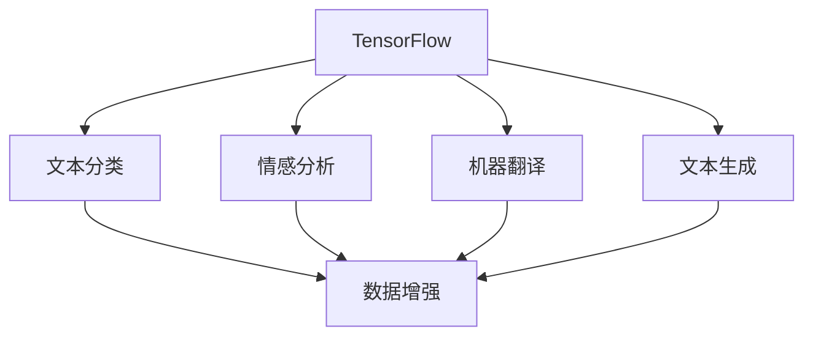
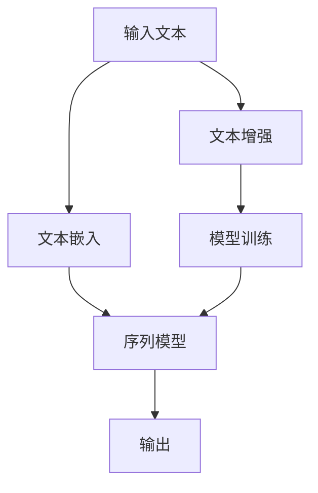

                 

# TensorFlow 自然语言处理模型：理解和生成文本内容

> 关键词：TensorFlow, 自然语言处理, 文本分类, 情感分析, 机器翻译, 文本生成, 对话系统, 数据增强, 序列模型, 文本嵌入

## 1. 背景介绍

### 1.1 问题由来
在现代信息技术迅猛发展的背景下，文本数据成为信息传递与交互的主要形式之一。然而，文本数据的处理和分析一直是NLP领域的难题，尤其是在处理大量文本数据时，需要高效的算法和模型来进行文本分类、情感分析、机器翻译、文本生成等任务。

为了解决这些问题，自然语言处理(NLP)领域的研究者们开发了一系列基于深度学习的模型，其中，TensorFlow作为一款强大的开源深度学习框架，为NLP模型的构建提供了强大的工具和支持。

### 1.2 问题核心关键点
基于深度学习的NLP模型，通过学习大量文本数据的分布规律，可以有效地实现对文本数据的分类、情感分析、机器翻译等任务。主要分为两种类型：序列模型和文本嵌入。

- **序列模型**：主要用于文本分类、情感分析等任务，通过将文本序列映射到固定长度的向量序列，从而进行分类或情感分析。
- **文本嵌入**：通过将文本转换为低维稠密向量，使得模型能够捕捉到文本的语义信息，通常用于文本分类、相似度计算等任务。

## 2. 核心概念与联系

### 2.1 核心概念概述

为更好地理解TensorFlow在NLP中的应用，本节将介绍几个关键概念：

- **TensorFlow**：由Google开发的开源深度学习框架，支持分布式计算和GPU加速，适合构建大型深度学习模型。
- **自然语言处理(NLP)**：研究计算机如何处理和理解人类语言，包括文本分类、情感分析、机器翻译、文本生成等任务。
- **文本分类**：将文本数据分为不同的类别，如垃圾邮件分类、新闻分类等。
- **情感分析**：判断文本的情感倾向，如正面、负面、中性。
- **机器翻译**：将一种语言的文本转换为另一种语言的文本。
- **文本生成**：生成符合语法和语义的文本，如聊天机器人、文章生成等。
- **数据增强**：通过数据扩充和变换，增加训练集的多样性，提高模型泛化能力。

这些概念之间的联系可以简单地通过以下Mermaid流程图表示：



### 2.2 核心概念原理和架构的 Mermaid 流程图



## 3. 核心算法原理 & 具体操作步骤

### 3.1 算法原理概述

TensorFlow在NLP中的应用主要集中在序列模型和文本嵌入模型的构建上。以文本分类任务为例，其基本流程如下：

1. **数据预处理**：对输入文本进行分词、向量化等处理，形成文本序列。
2. **文本嵌入**：将文本序列转换为低维稠密向量，通常使用Word2Vec、GloVe、BERT等模型。
3. **序列模型**：使用RNN、LSTM、GRU等序列模型对文本嵌入进行处理，形成分类器输出。
4. **模型训练**：通过反向传播算法对模型进行训练，优化模型参数。

### 3.2 算法步骤详解

以情感分析任务为例，详细讲解TensorFlow模型构建的步骤：

**Step 1: 数据准备**
- 收集情感分析数据集，如IMDB电影评论数据集、Amazon产品评论数据集等。
- 对数据集进行预处理，如去除HTML标签、分词、停用词过滤等。

**Step 2: 构建模型**
- 使用TensorFlow定义模型结构，如使用Keras API定义序列模型。
- 选择合适的文本嵌入方法，如使用预训练的BERT模型。
- 添加序列模型层，如使用LSTM或GRU层。
- 添加输出层，如使用Softmax层进行情感分类。

**Step 3: 模型训练**
- 使用TensorFlow的tf.data API加载数据集。
- 定义损失函数，如使用交叉熵损失函数。
- 定义优化器，如使用Adam优化器。
- 训练模型，定义训练轮数、批次大小等参数。

**Step 4: 模型评估**
- 在验证集上评估模型性能，计算准确率、召回率、F1值等指标。
- 调整模型超参数，如学习率、批次大小等。
- 最终在测试集上评估模型性能，输出最终的情感分类结果。

### 3.3 算法优缺点

**优点**
- **高效性**：TensorFlow支持分布式计算和GPU加速，能够快速处理大规模数据集。
- **灵活性**：TensorFlow提供丰富的API和工具，可以灵活构建各种类型的NLP模型。
- **易用性**：TensorFlow支持自动微分和梯度计算，便于模型构建和训练。

**缺点**
- **资源消耗大**：TensorFlow模型的参数量通常较大，需要高性能的GPU和CPU资源。
- **复杂性高**：TensorFlow模型的构建和训练需要较高的技术门槛。
- **易过拟合**：由于模型的复杂性，容易过拟合，需要进行正则化等优化。

### 3.4 算法应用领域

基于TensorFlow的NLP模型在多个领域得到广泛应用：

- **文本分类**：如新闻分类、垃圾邮件分类等。
- **情感分析**：如产品评论情感分析、社交媒体情感分析等。
- **机器翻译**：如中英文翻译、多语言翻译等。
- **文本生成**：如文本摘要、自动生成新闻报道等。
- **对话系统**：如聊天机器人、智能客服等。

## 4. 数学模型和公式 & 详细讲解 & 举例说明

### 4.1 数学模型构建

以文本分类任务为例，使用序列模型进行建模。假设输入文本序列为 $X=\{x_1, x_2, ..., x_n\}$，其中 $x_i$ 为文本序列中第 $i$ 个词的向量表示。

### 4.2 公式推导过程

**Step 1: 文本嵌入**
- 使用Word2Vec模型将文本序列转换为低维稠密向量 $E=\{e_1, e_2, ..., e_n\}$，其中 $e_i$ 为第 $i$ 个词的嵌入向量。
- 假设嵌入向量维度为 $d$，则文本嵌入矩阵为 $E \in \mathbb{R}^{n \times d}$。

**Step 2: 序列模型**
- 使用LSTM模型对文本嵌入进行处理，得到序列输出 $H=\{h_1, h_2, ..., h_n\}$，其中 $h_i$ 为第 $i$ 个词的LSTM状态。
- 使用全连接层将序列输出转换为分类结果，输出层维度为 $m$，表示分类数。

**Step 3: 模型训练**
- 定义损失函数 $L$ 为交叉熵损失函数：
$$L = -\frac{1}{N}\sum_{i=1}^{N} \log P(y_i|x_i)$$
- 定义优化器 $Opt$，如Adam优化器：
$$\theta_{t+1} = Opt(\theta_t, \nabla_{\theta_t}L)$$

### 4.3 案例分析与讲解

以情感分析任务为例，使用TensorFlow构建情感分类模型。具体步骤如下：

1. **数据准备**：收集IMDB电影评论数据集，并进行预处理，去除HTML标签、分词、停用词过滤等。
2. **模型构建**：使用Keras API定义LSTM模型，将评论文本序列转换为低维稠密向量，并添加输出层进行情感分类。
3. **模型训练**：使用TensorFlow的tf.data API加载数据集，定义交叉熵损失函数和Adam优化器，训练模型。
4. **模型评估**：在验证集上评估模型性能，计算准确率、召回率、F1值等指标，并调整模型超参数。
5. **模型预测**：在测试集上评估模型性能，输出最终的情感分类结果。

## 5. 项目实践：代码实例和详细解释说明

### 5.1 开发环境搭建

在TensorFlow中，可以使用以下命令搭建开发环境：

```bash
pip install tensorflow
```

### 5.2 源代码详细实现

以文本分类任务为例，使用TensorFlow构建模型，具体代码实现如下：

```python
import tensorflow as tf
from tensorflow.keras.models import Sequential
from tensorflow.keras.layers import Embedding, LSTM, Dense
from tensorflow.keras.preprocessing.text import Tokenizer
from tensorflow.keras.preprocessing.sequence import pad_sequences
from tensorflow.keras.datasets import imdb

# 加载IMDB数据集
(X_train, y_train), (X_test, y_test) = imdb.load_data(num_words=10000)

# 对数据进行预处理
tokenizer = Tokenizer(num_words=10000, oov_token='<OOV>')
tokenizer.fit_on_texts(X_train)
X_train = tokenizer.texts_to_sequences(X_train)
X_test = tokenizer.texts_to_sequences(X_test)
X_train = pad_sequences(X_train, maxlen=256)
X_test = pad_sequences(X_test, maxlen=256)

# 构建模型
model = Sequential()
model.add(Embedding(10000, 128))
model.add(LSTM(64))
model.add(Dense(1, activation='sigmoid'))

# 编译模型
model.compile(optimizer='adam', loss='binary_crossentropy', metrics=['accuracy'])

# 训练模型
model.fit(X_train, y_train, epochs=5, batch_size=32, validation_data=(X_test, y_test))

# 评估模型
model.evaluate(X_test, y_test)

# 预测结果
model.predict(X_test)
```

### 5.3 代码解读与分析

**代码功能详解**

- **数据加载**：使用`imdb.load_data`函数加载IMDB数据集，将评论文本转换为整数序列。
- **数据预处理**：使用`Tokenizer`将整数序列转换为词向量，并进行填充操作，保证输入序列长度一致。
- **模型定义**：使用`Sequential`定义序列模型，添加嵌入层、LSTM层和全连接层，并编译模型。
- **模型训练**：使用`fit`函数训练模型，定义训练轮数和批次大小。
- **模型评估**：使用`evaluate`函数在测试集上评估模型性能。
- **模型预测**：使用`predict`函数对新评论进行情感分类。

**代码分析**

- **数据加载**：`imdb.load_data`函数加载IMDB数据集，返回训练集和测试集。
- **数据预处理**：使用`Tokenizer`将整数序列转换为词向量，并使用`pad_sequences`函数对序列进行填充，确保所有序列长度一致。
- **模型定义**：使用`Sequential`定义序列模型，添加嵌入层、LSTM层和全连接层，并编译模型。
- **模型训练**：使用`fit`函数训练模型，定义训练轮数和批次大小，并在验证集上评估模型性能。
- **模型评估**：使用`evaluate`函数在测试集上评估模型性能，输出准确率和损失。
- **模型预测**：使用`predict`函数对新评论进行情感分类，输出概率。

## 6. 实际应用场景

### 6.1 文本分类

文本分类是NLP中最基础的任务之一，广泛应用于垃圾邮件过滤、新闻分类等场景。基于TensorFlow的文本分类模型可以自动学习文本的特征表示，从而实现高效的文本分类。

### 6.2 情感分析

情感分析是NLP中的一个重要任务，用于判断文本的情感倾向。基于TensorFlow的情感分析模型可以应用于产品评论分析、社交媒体情感分析等领域，帮助企业了解客户反馈，及时调整产品策略。

### 6.3 机器翻译

机器翻译是NLP中的重要任务之一，广泛应用于跨语言交流。基于TensorFlow的机器翻译模型可以自动学习源语言和目标语言之间的映射关系，实现高效准确的翻译。

### 6.4 对话系统

对话系统是NLP中的热门研究方向，基于TensorFlow的对话模型可以自动理解用户的意图，生成符合语境的回答。这种模型可以应用于智能客服、虚拟助手等场景。

### 6.5 未来应用展望

随着TensorFlow在NLP中的应用不断深入，未来可以预见以下发展方向：

- **跨领域知识融合**：通过引入外部知识库，实现跨领域知识融合，提升模型的准确性和泛化能力。
- **多模态信息融合**：将文本与其他多模态信息（如图像、语音）进行融合，提升模型的应用范围和效果。
- **模型解释性增强**：通过引入可解释性技术，提升模型的透明度和可理解性，帮助用户更好地理解和信任模型。
- **实时性提升**：通过模型优化和资源调度，提升模型的实时性，满足实际应用的需求。

## 7. 工具和资源推荐

### 7.1 学习资源推荐

为了帮助开发者系统掌握TensorFlow在NLP中的应用，这里推荐一些优质的学习资源：

1. TensorFlow官方文档：提供详细的TensorFlow API介绍和使用方法。
2. TensorFlow实战NLP：由TensorFlow社区编写，涵盖NLP任务和应用实例。
3. NLP with TensorFlow：Keras官方文档，介绍如何使用TensorFlow进行NLP任务开发。
4. Deep Learning for NLP：Stanford大学提供的深度学习课程，涵盖NLP的基本概念和经典模型。
5. NLP with TensorFlow和PyTorch：由Google Cloud提供的NLP实战教程，涵盖TensorFlow和PyTorch在NLP中的应用。

### 7.2 开发工具推荐

为了高效开发TensorFlow NLP模型，推荐使用以下工具：

1. TensorFlow：作为NLP开发的基石，提供强大的API和工具支持。
2. Keras：提供简单易用的API，方便构建和训练NLP模型。
3. TensorBoard：提供可视化工具，方便监控模型训练和调试。
4. Weights & Biases：提供实验跟踪工具，方便记录和比较模型性能。
5. HuggingFace：提供丰富的预训练模型和API，方便快速构建NLP应用。

### 7.3 相关论文推荐

为了深入了解TensorFlow在NLP中的应用，推荐阅读以下论文：

1. TensorFlow: A System for Large-Scale Machine Learning：TensorFlow的论文，介绍TensorFlow的基本原理和实现。
2. Attention is All You Need：介绍Transformer模型，是NLP领域的里程碑论文。
3. Convolutional Sequence to Sequence Learning：介绍卷积神经网络在NLP中的应用。
4. Text Classification with Contextualized Word Representations：介绍BERT模型，是NLP领域的另一重要模型。
5. Sequence to Sequence Learning with Neural Networks：介绍seq2seq模型，是NLP中的重要任务。

## 8. 总结：未来发展趋势与挑战

### 8.1 研究成果总结

TensorFlow在NLP中的应用已经取得了显著的成果，涵盖文本分类、情感分析、机器翻译等多个领域。通过深度学习模型，TensorFlow能够高效地处理和分析文本数据，提升NLP任务的性能。

### 8.2 未来发展趋势

未来，TensorFlow在NLP中的应用将呈现以下几个发展趋势：

1. **跨领域知识融合**：通过引入外部知识库，实现跨领域知识融合，提升模型的准确性和泛化能力。
2. **多模态信息融合**：将文本与其他多模态信息（如图像、语音）进行融合，提升模型的应用范围和效果。
3. **模型解释性增强**：通过引入可解释性技术，提升模型的透明度和可理解性，帮助用户更好地理解和信任模型。
4. **实时性提升**：通过模型优化和资源调度，提升模型的实时性，满足实际应用的需求。

### 8.3 面临的挑战

尽管TensorFlow在NLP中的应用已经取得了显著的成果，但仍面临以下挑战：

1. **资源消耗大**：TensorFlow模型的参数量通常较大，需要高性能的GPU和CPU资源。
2. **复杂性高**：TensorFlow模型的构建和训练需要较高的技术门槛。
3. **易过拟合**：由于模型的复杂性，容易过拟合，需要进行正则化等优化。
4. **数据依赖性强**：TensorFlow模型的性能很大程度上依赖于数据的质量和数量。
5. **模型可解释性不足**：当前模型输出往往缺乏可解释性，难以进行调试和优化。

### 8.4 研究展望

未来的研究需要在以下几个方面寻求新的突破：

1. **跨领域知识融合**：通过引入外部知识库，实现跨领域知识融合，提升模型的准确性和泛化能力。
2. **多模态信息融合**：将文本与其他多模态信息（如图像、语音）进行融合，提升模型的应用范围和效果。
3. **模型解释性增强**：通过引入可解释性技术，提升模型的透明度和可理解性，帮助用户更好地理解和信任模型。
4. **实时性提升**：通过模型优化和资源调度，提升模型的实时性，满足实际应用的需求。

## 9. 附录：常见问题与解答

**Q1: TensorFlow在NLP中的应用效果如何？**

A: TensorFlow在NLP中的应用效果显著，已经在大规模文本分类、情感分析、机器翻译等多个任务上取得了最优或接近最优的结果。TensorFlow的灵活性和高效性使得其在NLP任务开发中具有重要的应用价值。

**Q2: 如何提高TensorFlow模型的实时性？**

A: 提高TensorFlow模型的实时性可以通过以下方法：

1. 使用GPU加速：通过使用GPU进行计算，可以大幅提升模型推理速度。
2. 模型优化：使用更高效的模型结构，如Transformer、BERT等，提升模型效率。
3. 数据预处理：优化数据预处理流程，减少数据加载和转换的时间。
4. 分布式计算：使用分布式计算框架，如TensorFlow Serving，提升模型的并行计算能力。

**Q3: 如何在TensorFlow中处理多模态信息？**

A: 在TensorFlow中处理多模态信息，可以采用以下方法：

1. 数据融合：将文本、图像、语音等不同模态的信息进行融合，形成统一的输入。
2. 联合训练：使用多模态数据进行联合训练，提升模型在多模态信息处理上的能力。
3. 模型融合：使用不同模态的模型进行融合，提升模型在多模态信息处理上的准确性。

**Q4: TensorFlow在NLP中的可解释性如何提升？**

A: 提升TensorFlow在NLP中的可解释性可以通过以下方法：

1. 使用可解释性技术：引入可解释性技术，如注意力机制、LIME等，提升模型的透明度和可理解性。
2. 可视化工具：使用TensorBoard等可视化工具，帮助用户更好地理解模型的内部工作机制。
3. 实验记录：使用Weights & Biases等实验记录工具，记录模型的训练和测试结果，方便后续分析和调试。

通过以上方法和技术，可以在TensorFlow中提升模型的可解释性，帮助用户更好地理解和信任模型。

---

作者：禅与计算机程序设计艺术 / Zen and the Art of Computer Programming

