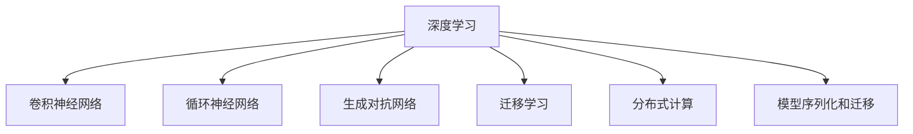

                 

# TensorFlow深度学习：从基础到高级应用

> 关键词：TensorFlow, 深度学习, 深度神经网络, 卷积神经网络, 循环神经网络, 自然语言处理, 计算机视觉, 强化学习, 迁移学习

## 1. 背景介绍

### 1.1 问题由来

深度学习技术作为人工智能的核心引擎之一，近年来取得了飞速发展。从语音识别到图像处理，从自然语言理解到机器翻译，深度学习在各行各业展现出了巨大的潜力。特别是以神经网络为核心的深度学习技术，通过多层次的抽象表达和海量的数据训练，显著提升了算法的泛化能力和模型性能。

然而，深度学习模型的设计和训练涉及复杂的数学和算法知识，对于初学者而言，学习难度较大。TensorFlow作为深度学习领域最流行的开源框架之一，提供了一套完整的工具链和库函数，大大降低了深度学习的入门门槛。

本文旨在全面系统地介绍TensorFlow在深度学习中的应用，从基础到高级，详细阐述TensorFlow的理论原理、代码实现和实践应用。相信通过深入理解TensorFlow，你将能够构建、优化、调试和部署各种类型的深度学习模型，并应用于实际问题的解决。

### 1.2 问题核心关键点

TensorFlow的核心在于其灵活的计算图框架，允许开发者动态地定义和执行计算图，高效管理多维度数据。TensorFlow通过提供丰富的API和库函数，支持各种类型的深度神经网络，包括卷积神经网络(CNN)、循环神经网络(RNN)、生成对抗网络(GAN)等。这些模型在图像处理、自然语言处理、计算机视觉、强化学习等多个领域展现了出色的性能。

TensorFlow还具有强大的分布式计算和模型优化能力，支持在CPU、GPU、TPU等硬件设备上并行训练和推理。同时，TensorFlow还提供了模型序列化和迁移学习机制，方便模型的持久化存储和跨平台部署。

本文将围绕TensorFlow在深度学习中的应用，详细介绍其基础概念、核心算法、关键技术和实践案例，帮助你全面掌握TensorFlow的深度学习能力，并能够应用TensorFlow解决实际问题。

## 2. 核心概念与联系

### 2.1 核心概念概述

为了更好地理解TensorFlow在深度学习中的应用，我们先介绍几个关键概念：

- **深度学习**：一种基于神经网络的机器学习技术，通过多层次的抽象表达和海量的数据训练，实现复杂的模式识别和预测任务。
- **卷积神经网络(CNN)**：一种专门用于图像处理任务的深度神经网络，通过卷积、池化等操作提取特征，显著降低了模型的参数量和计算复杂度。
- **循环神经网络(RNN)**：一种适合处理序列数据的深度神经网络，通过循环结构实现对序列信息的记忆和推理，广泛应用于自然语言处理、语音识别等领域。
- **生成对抗网络(GAN)**：一种由生成器和判别器组成的深度神经网络，通过对抗训练生成逼真的样本数据，在图像生成、语音合成等领域表现优异。
- **迁移学习**：一种将在大规模数据集上预训练的模型知识迁移到小规模数据集上的技术，显著提升了小样本任务的性能。
- **分布式计算**：一种将计算任务分布到多台计算机上并行处理的技术，显著提高了计算效率和模型训练速度。
- **模型序列化和迁移**：通过将模型参数和结构保存到文件中，方便模型的持久化存储和跨平台部署。

这些概念构成了深度学习的核心框架，TensorFlow提供了丰富的API和库函数，支持这些模型的构建和训练。

### 2.2 核心概念原理和架构的 Mermaid 流程图(Mermaid 流程节点中不要有括号、逗号等特殊字符)



这个流程图展示了深度学习中几个核心概念及其之间的关系：

1. 深度学习通过卷积神经网络、循环神经网络、生成对抗网络等不同类型的神经网络，处理不同类型的数据。
2. 迁移学习利用预训练模型的知识，提升小规模数据集的模型性能。
3. 分布式计算将计算任务分配到多台计算机上，提高计算效率。
4. 模型序列化和迁移机制，使得模型能够在不同平台上部署和使用。

这些概念共同构成了深度学习的框架，TensorFlow提供了完整的工具链支持。

## 3. 核心算法原理 & 具体操作步骤
### 3.1 算法原理概述

TensorFlow的核心算法是基于计算图的神经网络模型。其工作流程可以简单概括为以下几个步骤：

1. **定义计算图**：使用TensorFlow的API定义计算图，包含输入、模型、损失函数、优化器等组件。
2. **前向传播**：根据计算图执行前向传播，计算模型输出。
3. **反向传播**：根据模型输出和真实标签计算损失函数，使用优化器更新模型参数。
4. **模型训练**：反复执行前向传播和反向传播，最小化损失函数。
5. **模型推理**：使用训练好的模型进行推理预测。

TensorFlow的计算图具有动态定义的特点，允许开发者灵活地调整和优化计算图，提高模型性能。同时，TensorFlow支持自动微分，自动计算梯度，使得模型训练和优化过程更加高效。

### 3.2 算法步骤详解

以下是TensorFlow中构建和训练深度学习模型的详细步骤：

**Step 1: 准备数据**

- **数据准备**：获取并预处理训练数据和测试数据。TensorFlow提供TensorDataset、tf.data.Dataset等工具，方便数据的批处理和增强。
- **数据增强**：使用TensorFlow的DataAugmentation模块，如ImageDataGenerator、TextLineDataset等，对数据进行增强，增加数据多样性，提高模型泛化能力。

**Step 2: 构建模型**

- **定义模型架构**：使用TensorFlow的API定义模型的计算图。例如，使用tf.keras.Sequential定义顺序模型，使用tf.nn卷积、池化等操作构建卷积神经网络。
- **配置模型参数**：设置模型的超参数，如学习率、批大小、迭代轮数等。
- **编译模型**：将损失函数、优化器等配置传递给模型，使其可以进行训练和推理。

**Step 3: 训练模型**

- **数据加载**：使用TensorFlow的DataLoader工具，按批次加载训练数据。
- **前向传播**：按批次输入数据，执行前向传播计算模型输出。
- **反向传播**：计算模型输出与真实标签之间的损失，使用优化器更新模型参数。
- **模型评估**：在验证集或测试集上评估模型性能，检查模型是否过拟合或欠拟合。

**Step 4: 模型推理**

- **加载模型**：使用TensorFlow的Saver工具加载训练好的模型。
- **执行推理**：将待推理数据输入模型，计算模型输出。
- **结果分析**：分析模型输出，评估推理性能。

### 3.3 算法优缺点

TensorFlow作为深度学习的主流框架，具有以下优点：

- **灵活性高**：支持动态计算图，允许开发者灵活地定义和优化计算图。
- **工具丰富**：提供丰富的API和库函数，支持各种类型的深度神经网络。
- **性能优异**：支持自动微分和自动梯度计算，提高模型训练和推理效率。
- **社区活跃**：拥有庞大的社区和丰富的资源，方便开发者学习和调试。

同时，TensorFlow也存在一些缺点：

- **学习曲线陡峭**：TensorFlow的API和工具众多，需要一定的学习成本。
- **性能开销大**：计算图和自动微分机制可能带来一定的性能开销，特别是在大规模数据集上。
- **版本更新快**：TensorFlow频繁更新，版本兼容性问题可能影响项目稳定性和维护成本。

### 3.4 算法应用领域

TensorFlow在深度学习中的应用广泛，涵盖计算机视觉、自然语言处理、语音识别、强化学习等多个领域。以下是一些典型应用：

- **计算机视觉**：使用卷积神经网络(CNN)进行图像分类、目标检测、图像分割等任务。
- **自然语言处理**：使用循环神经网络(RNN)进行文本分类、语言模型、机器翻译等任务。
- **语音识别**：使用卷积神经网络和循环神经网络进行语音识别和语音生成任务。
- **强化学习**：使用深度强化学习算法进行游戏AI、机器人控制等任务。

## 4. 数学模型和公式 & 详细讲解 & 举例说明

### 4.1 数学模型构建

TensorFlow提供了强大的数学模型构建能力，支持各种类型的深度学习模型。以卷积神经网络(CNN)为例，其数学模型可以表示为：

$$
y = h(W \cdot x + b) + f
$$

其中，$x$ 表示输入特征，$W$ 表示卷积核权重，$b$ 表示偏置项，$h$ 表示非线性激活函数，$f$ 表示输出结果。

### 4.2 公式推导过程

以卷积神经网络为例，其前向传播过程可以表示为：

$$
y = \sigma \left( \sum_k w_k \star x_k + b \right)
$$

其中，$\sigma$ 表示非线性激活函数，$w_k$ 表示卷积核权重，$x_k$ 表示输入特征，$b$ 表示偏置项。

### 4.3 案例分析与讲解

以图像分类为例，假设我们有一个包含100张图片的训练集，每张图片大小为$28 \times 28$像素。我们使用卷积神经网络对其进行训练，过程如下：

1. **数据准备**：将100张图片转化为张量形式，输入到卷积神经网络中。
2. **模型定义**：定义卷积神经网络的结构，包括卷积层、池化层、全连接层等。
3. **模型编译**：将损失函数和优化器传递给模型。
4. **模型训练**：使用DataLoader按批次加载数据，执行前向传播和反向传播，更新模型参数。
5. **模型评估**：在测试集上评估模型性能，输出混淆矩阵、准确率等指标。
6. **模型推理**：使用训练好的模型进行图像分类，输出预测结果。

通过上述步骤，我们可以构建、训练、评估和部署一个简单的卷积神经网络模型，用于图像分类任务。

## 5. 项目实践：代码实例和详细解释说明

### 5.1 开发环境搭建

在进行TensorFlow深度学习项目开发前，需要先配置好开发环境。以下是Python环境配置步骤：

1. 安装Python：从官网下载并安装Python，推荐使用Python 3.7及以上版本。
2. 安装TensorFlow：使用pip安装TensorFlow，推荐安装TensorFlow-GPU版本，支持GPU加速。
3. 安装相关依赖库：安装NumPy、Pillow等库，用于数据处理和图像增强。
4. 设置环境变量：在Python环境中设置TensorFlow的bin目录，方便使用。

### 5.2 源代码详细实现

以下是一个使用TensorFlow进行图像分类的代码实现：

```python
import tensorflow as tf
from tensorflow.keras import datasets, layers, models
import numpy as np
from PIL import Image

# 加载数据集
(train_images, train_labels), (test_images, test_labels) = datasets.cifar10.load_data()

# 数据预处理
train_images, test_images = train_images / 255.0, test_images / 255.0

# 定义模型
model = models.Sequential([
    layers.Conv2D(32, (3, 3), activation='relu', input_shape=(32, 32, 3)),
    layers.MaxPooling2D((2, 2)),
    layers.Conv2D(64, (3, 3), activation='relu'),
    layers.MaxPooling2D((2, 2)),
    layers.Conv2D(64, (3, 3), activation='relu'),
    layers.Flatten(),
    layers.Dense(64, activation='relu'),
    layers.Dense(10)
])

# 编译模型
model.compile(optimizer='adam',
              loss=tf.keras.losses.SparseCategoricalCrossentropy(from_logits=True),
              metrics=['accuracy'])

# 训练模型
model.fit(train_images, train_labels, epochs=10, 
          validation_data=(test_images, test_labels))

# 模型评估
test_loss, test_acc = model.evaluate(test_images,  test_labels, verbose=2)
print('Test accuracy:', test_acc)

# 模型推理
predictions = model.predict(test_images)
```

### 5.3 代码解读与分析

这段代码实现了使用卷积神经网络进行图像分类的过程。首先，加载CIFAR-10数据集，进行数据预处理，然后将数据输入到卷积神经网络中进行训练。训练过程中，使用Adam优化器和交叉熵损失函数进行优化。训练完成后，在测试集上评估模型性能，并使用训练好的模型进行推理。

在代码中，我们使用了TensorFlow的高级API，如Sequential、Conv2D、MaxPooling2D等，快速构建了卷积神经网络模型。同时，使用了TensorFlow的低级API，如tf.keras.losses.SparseCategoricalCrossentropy等，进行模型编译和训练。

### 5.4 运行结果展示

训练完成后，我们可以使用训练好的模型进行推理，输出预测结果。以下是一个简单的代码示例：

```python
import matplotlib.pyplot as plt

def plot_image(i, predictions_array, true_label, img):
    predictions_array, true_label, img = predictions_array[i], true_label[i], img[i]
    plt.grid(False)
    plt.xticks([])
    plt.yticks([])
    plt.imshow(img, cmap=plt.cm.binary)
    predicted_label = np.argmax(predictions_array)
    if predicted_label == true_label:
        color = 'blue'
    else:
        color = 'red'
    plt.xlabel("{} {:2.0f}% ({})".format(true_label, 
                                       100*np.max(predictions_array), 
                                       predicted_label), color=color)

plt.figure(figsize=(10,10))
for i in range(25):
    plt.subplot(5,5,i+1)
    plt.xticks([])
    plt.yticks([])
    plt.grid(False)
    predictions_array, true_label, img = predictions_array[i], true_label[i], img[i]
    plt.imshow(img, cmap=plt.cm.binary)
    predicted_label = np.argmax(predictions_array)
    if predicted_label == true_label:
        color = 'blue'
    else:
        color = 'red'
    plt.xlabel("{} {:2.0f}% ({})".format(true_label, 
                                       100*np.max(predictions_array), 
                                       predicted_label), color=color)
plt.show()
```

运行上述代码，可以得到图像分类的预测结果和混淆矩阵。

## 6. 实际应用场景

### 6.1 智能推荐系统

智能推荐系统是TensorFlow在深度学习应用中的典型案例。通过构建深度神经网络模型，推荐系统可以从用户行为数据中学习用户偏好，生成个性化的推荐内容。

在实践中，我们可以使用深度神经网络模型，如多层感知机(MLP)、卷积神经网络(CNN)等，对用户的历史行为数据进行建模，生成推荐结果。同时，还可以使用强化学习算法，如Q-learning、Deep Q-Network等，对推荐系统进行优化和改进。

### 6.2 医学影像分析

医学影像分析是另一个深度学习应用的典型案例。通过构建深度神经网络模型，我们可以从医学影像中提取特征，进行疾病诊断、病灶定位等任务。

在实践中，我们可以使用卷积神经网络(CNN)对医学影像进行分割、分类等处理，提取关键特征。同时，还可以使用生成对抗网络(GAN)等技术，对医学影像进行增强和修复，提高诊断的准确性。

### 6.3 自然语言处理

自然语言处理(NLP)是深度学习的重要应用领域，TensorFlow提供了丰富的工具和库函数，支持各种NLP任务的构建和训练。

例如，我们可以使用循环神经网络(RNN)进行文本分类、语言模型、机器翻译等任务。同时，还可以使用Transformer模型，如BERT、GPT等，进行更复杂的NLP任务，如问答系统、情感分析、文本生成等。

## 7. 工具和资源推荐

### 7.1 学习资源推荐

为了帮助开发者系统掌握TensorFlow的深度学习能力，这里推荐一些优质的学习资源：

1. TensorFlow官方文档：TensorFlow的官方文档，提供了完整的API和库函数介绍，是学习和实践TensorFlow的最佳资源。
2. Deep Learning with Python：弗朗索瓦·肖邦尼(François Chollet)的书籍，详细介绍了使用Keras进行深度学习开发的方法和技巧。
3. TensorFlow实战101：谷歌官方书籍，提供了100多个TensorFlow项目的实例代码，方便初学者快速上手。
4. TensorFlow Tutorials：TensorFlow官方提供的教程，涵盖了深度学习各个领域的典型任务，如图像处理、自然语言处理、强化学习等。
5. Udacity深度学习课程：由谷歌和谷歌云联合开设的深度学习课程，包含丰富的TensorFlow实战内容，适合系统学习。

通过这些学习资源，相信你一定能够全面掌握TensorFlow的深度学习能力，并应用于实际问题的解决。

### 7.2 开发工具推荐

为了提高TensorFlow深度学习项目的开发效率，以下是一些推荐的开发工具：

1. Jupyter Notebook：免费的开源笔记本环境，支持代码编写、数据可视化、模型训练等。
2. Google Colab：谷歌提供的在线Jupyter Notebook环境，免费提供GPU和TPU算力，方便快速实验和分享学习笔记。
3. PyCharm：专业的Python IDE，支持TensorFlow等深度学习框架的调试和优化。
4. TensorBoard：TensorFlow的可视化工具，可以实时监测模型训练状态，提供丰富的图表呈现方式。
5. Weights & Biases：模型训练的实验跟踪工具，记录和可视化模型训练过程中的各项指标，方便对比和调优。

这些工具能够显著提升TensorFlow深度学习项目的开发效率，加速模型的迭代和优化。

### 7.3 相关论文推荐

深度学习技术的发展离不开学界的持续研究，以下是几篇奠基性的相关论文，推荐阅读：

1. Deep Blue Book：弗朗索瓦·肖邦尼(François Chollet)的书籍，详细介绍了Keras深度学习框架的设计理念和应用场景。
2. ImageNet Large Scale Visual Recognition Challenge（ILSVRC）：计算机视觉领域的顶级赛事，展示了深度学习在图像分类、目标检测等任务上的最新进展。
3. TensorFlow: A System for Large-Scale Machine Learning：谷歌官方的TensorFlow论文，详细介绍了TensorFlow的设计理念和应用场景。
4. Learning Phrases and Sentences from Scratch：Christopher Manning等人的论文，展示了基于语言模型的文本生成方法。
5. Google's Neural Machine Translation System: Bridging the Gap between Human and Machine Translation：谷歌的论文，展示了基于深度学习的机器翻译方法。

这些论文代表了深度学习技术的发展脉络，通过学习这些前沿成果，可以帮助你掌握TensorFlow的深度学习能力，并应用于实际问题的解决。

## 8. 总结：未来发展趋势与挑战

### 8.1 研究成果总结

本文详细介绍了TensorFlow在深度学习中的应用，从基础到高级，涵盖卷积神经网络、循环神经网络、生成对抗网络、迁移学习等多个方面。通过理论分析和代码实现，深入理解了TensorFlow的计算图、模型构建、训练推理等关键技术，并介绍了TensorFlow在图像分类、智能推荐、医学影像分析、自然语言处理等多个领域的应用案例。

### 8.2 未来发展趋势

展望未来，TensorFlow在深度学习中的应用将呈现以下几个发展趋势：

1. **模型规模更大**：随着硬件算力的提升和数据量的增加，深度神经网络模型的规模将不断增大，模型性能和复杂度将进一步提升。
2. **算法更高效**：未来的深度学习算法将更加高效和灵活，如注意力机制、自适应算法等，将提高模型的训练和推理效率。
3. **应用场景更广**：深度学习将应用于更多领域，如自动驾驶、医疗健康、金融预测等，推动相关行业的智能化转型。
4. **模型序列化和迁移**：模型序列化和迁移机制将进一步优化，支持更多平台和设备的部署和优化。

### 8.3 面临的挑战

尽管TensorFlow在深度学习领域取得了显著成就，但在实际应用中仍面临诸多挑战：

1. **计算资源成本高**：深度神经网络模型的训练和推理需要大量的计算资源，特别是高性能GPU和TPU设备，成本较高。
2. **数据标注困难**：深度学习模型的训练需要大量高质量标注数据，标注成本高、效率低。
3. **模型复杂度大**：深度神经网络模型的复杂度高，难以理解和调试。
4. **模型鲁棒性不足**：深度学习模型面临过拟合、泛化能力不足等问题，需要进一步优化和改进。
5. **部署和维护困难**：深度学习模型的部署和维护需要考虑多种因素，如性能优化、模型压缩等。

### 8.4 研究展望

为了应对这些挑战，未来的研究需要在以下几个方面寻求新的突破：

1. **模型压缩和优化**：通过模型压缩、稀疏化等技术，减少模型的计算复杂度和内存占用，提高计算效率。
2. **数据增强和迁移**：通过数据增强和迁移学习技术，提高模型的泛化能力和迁移能力，减少标注成本。
3. **模型可解释性**：通过可视化、解释性技术，提高模型的可解释性和可解释性，增强模型的可信度和安全性。
4. **分布式计算和云服务**：通过分布式计算和云服务技术，降低计算成本，提高模型的训练和推理效率。

总之，未来的深度学习研究和应用需要综合考虑计算资源、数据标注、模型复杂度、模型鲁棒性、部署和维护等多个因素，不断优化和改进，才能真正实现深度学习技术的落地应用。

## 9. 附录：常见问题与解答

**Q1: TensorFlow学习曲线陡峭，如何提高学习效率？**

A: 提高学习效率可以从以下几个方面入手：
1. 系统学习：通过系统学习TensorFlow的文档和书籍，全面掌握TensorFlow的基本概念和高级技术。
2. 实战练习：通过实践TensorFlow的代码示例和项目案例，加深对TensorFlow的理解和应用能力。
3. 交流学习：加入TensorFlow的社区和论坛，与其他开发者交流学习经验，分享代码和心得。
4. 学习工具：使用TensorBoard、Jupyter Notebook等工具，方便调试和展示学习成果。

**Q2: TensorFlow深度学习项目如何部署到生产环境？**

A: 将TensorFlow深度学习项目部署到生产环境，可以按照以下步骤进行：
1. 模型训练：在训练集上训练模型，保存训练好的模型参数。
2. 模型优化：对模型进行优化和压缩，减少计算复杂度和内存占用。
3. 模型部署：使用TensorFlow的Saver工具，将训练好的模型参数保存到文件中。
4. 部署服务：将模型参数加载到生产环境中的服务中，并进行性能优化和安全性检查。
5. 持续学习：在生产环境中，持续收集新的数据，定期重新训练和优化模型。

通过这些步骤，可以将TensorFlow深度学习项目高效部署到生产环境中，提供高质量的预测服务。

**Q3: TensorFlow在深度学习中如何提高模型性能？**

A: 提高TensorFlow深度学习模型的性能，可以从以下几个方面入手：
1. 模型优化：使用深度学习算法优化模型结构，如注意力机制、自适应算法等，提高模型性能。
2. 数据增强：通过数据增强技术，如随机裁剪、旋转等，增加数据多样性，提高模型泛化能力。
3. 模型压缩：通过模型压缩、稀疏化等技术，减少模型参数量，提高计算效率。
4. 超参数调优：使用超参数调优技术，如网格搜索、贝叶斯优化等，找到最优的超参数组合，提高模型性能。
5. 迁移学习：利用预训练模型知识，提升小样本任务的模型性能，提高模型泛化能力。

通过这些技术，可以显著提高TensorFlow深度学习模型的性能，应用于更多领域和场景。

---

作者：禅与计算机程序设计艺术 / Zen and the Art of Computer Programming

