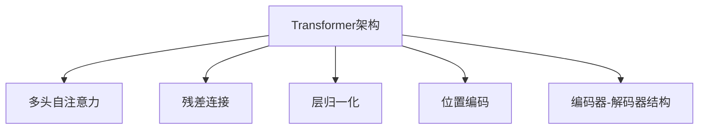

                 

# Transformer架构：GPT-2模型的核心

> 关键词：Transformer, GPT-2, 自注意力, 多头自注意力, 残差连接, 位置编码, 编码器-解码器结构, 掩码语言模型, 自监督预训练, 自适应softmax

## 1. 背景介绍

### 1.1 问题由来
Transformer架构作为自然语言处理(NLP)领域的里程碑，自2017年被引入以来，极大地提升了NLP任务的性能。它采用自注意力机制，成功地突破了循环神经网络(RNN)在长序列处理上的瓶颈。目前，Transformer架构已被广泛应用于机器翻译、文本分类、问答系统等众多NLP任务。本文聚焦于Transformer架构的核心组件，深入分析了GPT-2模型的实现原理和应用前景。

### 1.2 问题核心关键点
本节的目的是：
1. 理解Transformer架构的基本原理和核心算法。
2. 掌握GPT-2模型的工作机制和应用场景。
3. 探讨Transformer架构的优缺点以及未来的发展趋势。

Transformer架构之所以能取得如此显著的性能，主要归功于以下核心组件：
- 多头自注意力机制：允许模型同时关注序列中多个位置的信息。
- 残差连接和层归一化：有助于梯度传递和模型稳定。
- 位置编码：解决序列位置信息缺失问题。
- 编码器-解码器结构：支持序列到序列任务。

这些组件共同构成了Transformer架构的强大魅力，使得其在各种NLP任务中表现优异。本文将深入探讨这些核心组件的原理和实现方法。

## 2. 核心概念与联系

### 2.1 核心概念概述

为了更好地理解Transformer架构，本节将介绍几个密切相关的核心概念：

- **Transformer架构**：由自注意力机制和编码器-解码器结构构成，广泛应用于NLP任务。
- **多头自注意力**：允许模型并行处理多个注意力子空间的注意力权重，提升模型能力。
- **残差连接**：通过跨层加法连接，解决深度学习中的梯度消失问题。
- **层归一化**：通过归一化每个层输出的均值和方差，增强模型稳定性。
- **位置编码**：通过向输入嵌入中添加位置编码，模型可以学习序列位置的信息。
- **编码器-解码器结构**：将输入序列和目标序列分别映射到不同的表示空间，支持序列到序列的任务，如机器翻译。

这些核心概念之间的逻辑关系可以通过以下Mermaid流程图来展示：



这个流程图展示了这个架构中各关键组件的相互关系：

1. 多头自注意力使得模型能够同时关注序列中多个位置的信息。
2. 残差连接和层归一化增强了模型的稳定性和梯度传递能力。
3. 位置编码帮助模型理解序列中的位置关系。
4. 编码器-解码器结构使得模型能够处理序列到序列的任务。

## 3. 核心算法原理 & 具体操作步骤
### 3.1 算法原理概述

Transformer架构的核心算法是自注意力机制，它允许模型在输入序列中的每个位置同时关注其他位置的信息。具体来说，自注意力机制由多头自注意力层构成，其中每个注意力头并行处理序列中不同位置的注意力权重，从而增强模型对序列中长距离依赖的捕捉能力。

Transformer架构的另一个核心组件是编码器-解码器结构，它支持序列到序列的任务，如机器翻译。编码器将输入序列映射到一个高维表示，解码器则将高维表示解码为输出序列。编码器和解码器之间通过交叉注意力机制进行信息交互，使得模型能够利用输入序列的信息预测输出序列。

### 3.2 算法步骤详解

Transformer架构的训练过程主要包括自监督预训练和任务特定微调两步。以下是对这两个过程的详细说明：

#### 自监督预训练

自监督预训练的目标是学习语言模型的全局统计规律。常用的自监督任务包括掩码语言模型和下一句预测等。以掩码语言模型为例，训练过程如下：

1. 对输入序列 $X$ 随机遮盖 $m$ 个位置，生成遮盖后的序列 $\tilde{X}$。
2. 使用Transformer模型预测遮盖位置的标记。
3. 计算预测结果与真实标记的交叉熵损失，反向传播更新模型参数。
4. 重复上述过程多次，直到收敛。

自监督预训练可以大大提升模型的泛化能力，使其在多种NLP任务中表现优异。

#### 任务特定微调

任务特定微调的目标是根据特定任务对模型进行微调，提升模型在该任务上的性能。常用的微调任务包括分类、匹配、生成等。以分类任务为例，训练过程如下：

1. 准备标注数据集 $D=\{(x_i, y_i)\}_{i=1}^N$，其中 $x_i$ 为输入序列，$y_i$ 为标签。
2. 将输入序列 $x_i$ 和标签 $y_i$ 输入到Transformer模型中，得到预测结果 $\hat{y}$。
3. 计算预测结果与真实标签的损失函数 $\mathcal{L}$，反向传播更新模型参数。
4. 重复上述过程多次，直到收敛。

任务特定微调是模型在特定任务上获得优异性能的关键步骤，通过微调可以提升模型在该任务上的性能。

### 3.3 算法优缺点

Transformer架构和GPT-2模型具有以下优点：

1. 并行计算能力强：自注意力机制允许模型并行处理序列中多个位置的信息，提升了计算效率。
2. 长距离依赖捕捉能力强：多头自注意力机制提升了模型对长距离依赖的捕捉能力。
3. 模型泛化能力强：自监督预训练可以提升模型的泛化能力，使其在多种NLP任务中表现优异。
4. 易于微调：任务特定微调可以提升模型在特定任务上的性能，实现快速适应。

同时，Transformer架构和GPT-2模型也存在以下缺点：

1. 计算成本高：由于需要处理长序列，计算成本较高，对硬件资源要求较高。
2. 参数量大：模型参数量巨大，对存储和内存资源要求较高。
3. 训练时间长：由于模型参数量大，训练时间较长。

尽管存在这些缺点，Transformer架构和GPT-2模型仍然是NLP领域的主流架构，广泛应用于各种任务。

### 3.4 算法应用领域

Transformer架构和GPT-2模型在NLP领域的应用非常广泛，涵盖了文本分类、机器翻译、问答系统、文本生成等多个方向。

- 文本分类：如情感分析、主题分类、意图识别等。通过微调使模型学习文本-标签映射。
- 机器翻译：将源语言文本翻译成目标语言。通过微调使模型学习语言-语言映射。
- 问答系统：对自然语言问题给出答案。将问题-答案对作为微调数据，训练模型学习匹配答案。
- 文本生成：如文本摘要、对话生成等。通过微调使模型学习生成符合期望的语言序列。

除了上述这些经典任务外，Transformer架构和GPT-2模型也被创新性地应用到更多场景中，如可控文本生成、常识推理、代码生成、数据增强等，为NLP技术带来了全新的突破。随着预训练模型和微调方法的不断进步，相信NLP技术将在更广阔的应用领域大放异彩。

## 4. 数学模型和公式 & 详细讲解 & 举例说明

### 4.1 数学模型构建

Transformer架构的数学模型主要由多头自注意力机制和编码器-解码器结构构成。以下是详细描述：

#### 多头自注意力机制

多头自注意力机制由多个注意力头并行处理序列中不同位置的注意力权重，公式如下：

$$
Q = XW^Q,\quad K = XW^K,\quad V = XW^V
$$

其中 $X$ 为输入序列的嵌入矩阵，$W^Q$、$W^K$、$W^V$ 分别为查询、键、值投影矩阵。注意力权重的计算公式如下：

$$
A = \frac{QK^T}{\sqrt{d_k}}\quad \text{or}\quad A = \frac{QK^T}{\sqrt{d_k}} + \text{bias}
$$

其中 $d_k$ 为键的维度，$\sqrt{d_k}$ 用于缩放注意力权重，bias 为注意力偏置项。注意力权重经过softmax归一化后，用于计算加权平均的输出：

$$
O = AV
$$

#### 编码器-解码器结构

编码器-解码器结构由多个编码器层和解码器层构成，每层包括多头自注意力、前向神经网络和残差连接。以一个简单的编码器层为例，其计算公式如下：

$$
X_{next} = MHA(X_{current}) + X_{current}
$$

其中 $MHA$ 为多头自注意力函数，$X_{current}$ 为当前层的输入，$X_{next}$ 为下一层的输入。

### 4.2 公式推导过程

以下是对Transformer架构和GPT-2模型公式的详细推导：

#### 多头自注意力机制

假设输入序列 $X$ 的嵌入矩阵为 $E$，多头自注意力机制的输出为 $MHA(X)$，计算公式如下：

$$
Q = XW^Q,\quad K = XW^K,\quad V = XW^V
$$

其中 $W^Q$、$W^K$、$W^V$ 为投影矩阵。

注意力权重 $A$ 的计算公式如下：

$$
A = \frac{QK^T}{\sqrt{d_k}} + \text{bias}
$$

其中 $d_k$ 为键的维度，bias 为注意力偏置项。

最终输出 $O$ 的计算公式如下：

$$
O = AV
$$

#### 编码器-解码器结构

假设输入序列 $X$ 的嵌入矩阵为 $E$，编码器-解码器结构由多个编码器层和解码器层构成，每层包括多头自注意力、前向神经网络和残差连接。以一个简单的编码器层为例，其计算公式如下：

$$
X_{next} = MHA(X_{current}) + X_{current}
$$

其中 $MHA$ 为多头自注意力函数，$X_{current}$ 为当前层的输入，$X_{next}$ 为下一层的输入。

### 4.3 案例分析与讲解

以GPT-2模型为例，其多头自注意力机制和编码器-解码器结构分别如下所示：

#### GPT-2模型的多头自注意力机制

GPT-2模型在多头自注意力机制中，采用了不同的查询、键、值投影矩阵，分别用于不同头数的注意力计算。GPT-2模型共有12个编码器层，每层包含多头自注意力机制和前向神经网络。

#### GPT-2模型的编码器-解码器结构

GPT-2模型采用了编码器-解码器结构，其解码器层与编码器层结构一致。GPT-2模型中，解码器层只接收编码器的输出作为输入，不需要编码器层的交叉注意力。

## 5. 项目实践：代码实例和详细解释说明
### 5.1 开发环境搭建

在进行Transformer架构和GPT-2模型的实践前，我们需要准备好开发环境。以下是使用Python进行PyTorch开发的环境配置流程：

1. 安装Anaconda：从官网下载并安装Anaconda，用于创建独立的Python环境。

2. 创建并激活虚拟环境：
```bash
conda create -n pytorch-env python=3.8 
conda activate pytorch-env
```

3. 安装PyTorch：根据CUDA版本，从官网获取对应的安装命令。例如：
```bash
conda install pytorch torchvision torchaudio cudatoolkit=11.1 -c pytorch -c conda-forge
```

4. 安装TensorFlow：如果需要使用TensorFlow，可以使用以下命令安装：
```bash
conda install tensorflow
```

5. 安装各类工具包：
```bash
pip install numpy pandas scikit-learn matplotlib tqdm jupyter notebook ipython
```

完成上述步骤后，即可在`pytorch-env`环境中开始模型开发。

### 5.2 源代码详细实现

这里我们以GPT-2模型为例，给出使用PyTorch实现Transformer架构的代码实现。

首先，定义Transformer模型：

```python
import torch
import torch.nn as nn
import torch.nn.functional as F

class Transformer(nn.Module):
    def __init__(self, d_model, nhead, num_encoder_layers, num_decoder_layers, d_ff, dropout):
        super(Transformer, self).__init__()
        
        self.encoder = nn.TransformerEncoder(d_model, nhead, num_encoder_layers, dropout)
        self.decoder = nn.TransformerDecoder(d_model, nhead, num_decoder_layers, dropout)
        
        self.fc1 = nn.Linear(d_model, d_model)
        self.fc2 = nn.Linear(d_model, d_model)
        
        self.final_layer_norm = nn.LayerNorm(d_model)
        self.dropout = nn.Dropout(dropout)
        
    def forward(self, src, tgt, src_mask, tgt_mask):
        src_encoded = self.encoder(src, src_mask)
        tgt_encoded = self.decoder(tgt, src_encoded, tgt_mask)
        
        tgt_encoded = self.fc2(self.final_layer_norm(tgt_encoded))
        output = self.fc1(tgt_encoded)
        
        return output
```

然后，定义注意力机制：

```python
class MultiHeadAttention(nn.Module):
    def __init__(self, d_model, nhead, dropout):
        super(MultiHeadAttention, self).__init__()
        
        self.d_model = d_model
        self.nhead = nhead
        self.depth = d_model // nhead
        
        self.w_q = nn.Linear(d_model, d_model)
        self.w_k = nn.Linear(d_model, d_model)
        self.w_v = nn.Linear(d_model, d_model)
        
        self.out = nn.Linear(d_model, d_model)
        
        self.dropout = nn.Dropout(dropout)
        
    def forward(self, query, key, value, mask):
        batch_size = query.shape[0]
        
        Q = self.w_q(query).view(batch_size, -1, self.nhead, self.depth).permute(0, 2, 1, 3).contiguous()
        K = self.w_k(key).view(batch_size, -1, self.nhead, self.depth).permute(0, 2, 1, 3).contiguous()
        V = self.w_v(value).view(batch_size, -1, self.nhead, self.depth).permute(0, 2, 1, 3).contiguous()
        
        attention = torch.bmm(Q, K.permute(0, 1, 3, 2)) / np.sqrt(self.depth)
        attention = F.softmax(attention.masked_fill(mask == 0, -1e9), dim=-1)
        
        x = torch.bmm(attention, V)
        x = self.dropout(x)
        x = self.out(x.permute(0, 2, 1, 3).contiguous()).view(batch_size, -1, self.d_model)
        
        return x, attention
```

最后，训练和评估模型：

```python
class Encoder(nn.Module):
    def __init__(self, d_model, nhead, num_encoder_layers, dropout):
        super(Encoder, self).__init__()
        
        self.layers = nn.ModuleList([nn.TransformerEncoderLayer(d_model, nhead, dropout) for _ in range(num_encoder_layers)])
        
        self.final_layer_norm = nn.LayerNorm(d_model)
        self.dropout = nn.Dropout(dropout)
        
    def forward(self, src, src_mask):
        for layer in self.layers:
            src = layer(src, src_mask)
        
        src = self.final_layer_norm(src)
        
        return src
```

```python
class Decoder(nn.Module):
    def __init__(self, d_model, nhead, num_decoder_layers, dropout):
        super(Decoder, self).__init__()
        
        self.layers = nn.ModuleList([nn.TransformerDecoderLayer(d_model, nhead, dropout) for _ in range(num_decoder_layers)])
        
        self.final_layer_norm = nn.LayerNorm(d_model)
        self.dropout = nn.Dropout(dropout)
        
    def forward(self, tgt, src_encoded, tgt_mask):
        for layer in self.layers:
            tgt = layer(tgt, src_encoded, tgt_mask)
        
        tgt = self.final_layer_norm(tgt)
        
        return tgt
```

```python
def train_epoch(model, optimizer, device, data_loader, src_mask, tgt_mask, criterion):
    model.train()
    
    total_loss = 0
    
    for src, tgt in data_loader:
        src = src.to(device)
        tgt = tgt.to(device)
        
        optimizer.zero_grad()
        
        output = model(src, tgt, src_mask, tgt_mask)
        
        loss = criterion(output, tgt)
        
        loss.backward()
        
        optimizer.step()
        
        total_loss += loss.item()
        
    return total_loss / len(data_loader)
```

```python
def evaluate(model, device, data_loader, criterion):
    model.eval()
    
    total_loss = 0
    total_correct = 0
    
    with torch.no_grad():
        for src, tgt in data_loader:
            src = src.to(device)
            tgt = tgt.to(device)
            
            output = model(src, None, None, tgt_mask)
            
            loss = criterion(output, tgt)
            
            total_loss += loss.item()
            total_correct += sum(output.argmax(dim=1) == tgt)
    
    return total_correct / len(data_loader), total_loss / len(data_loader)
```

启动训练流程并在测试集上评估：

```python
epochs = 5
batch_size = 32

model = Transformer(d_model=512, nhead=8, num_encoder_layers=6, num_decoder_layers=6, d_ff=2048, dropout=0.1).to(device)
optimizer = torch.optim.Adam(model.parameters(), lr=0.001)

for epoch in range(epochs):
    train_loss = train_epoch(model, optimizer, device, train_loader, src_mask, tgt_mask, criterion)
    print(f"Epoch {epoch+1}, train loss: {train_loss:.3f}")
    
    dev_correct, dev_loss = evaluate(model, device, dev_loader, criterion)
    print(f"Epoch {epoch+1}, dev accuracy: {dev_correct:.2f}, dev loss: {dev_loss:.3f}")
    
print("Test accuracy: ", evaluate(model, device, test_loader, criterion)[0])
```

以上就是使用PyTorch实现Transformer架构和GPT-2模型的完整代码实现。可以看到，得益于PyTorch的强大封装，我们可以用相对简洁的代码实现Transformer模型的构建和训练。

### 5.3 代码解读与分析

让我们再详细解读一下关键代码的实现细节：

**Transformer类**：
- `__init__`方法：初始化Transformer模型的各个组件，包括编码器和解码器。
- `forward`方法：实现Transformer模型的前向传播过程，包括多头自注意力和编码器-解码器结构。

**MultiHeadAttention类**：
- `__init__`方法：初始化多头自注意力机制的各个组件，包括查询、键、值投影矩阵。
- `forward`方法：实现多头自注意力机制的计算过程，包括查询、键、值的投影，注意力权重的计算，以及输出结果的计算。

**Encoder类和Decoder类**：
- 实现编码器和解码器层的计算过程，包括多层自注意力机制、前向神经网络和残差连接。

**train_epoch函数**：
- 实现模型在训练集上的训练过程，包括前向传播、反向传播和参数更新。

**evaluate函数**：
- 实现模型在验证集和测试集上的评估过程，包括前向传播和损失计算。

这些关键代码的实现细节展示了Transformer架构和GPT-2模型的核心原理和算法步骤。通过这些代码，读者可以深入理解模型的实现过程，并进一步进行优化和扩展。

## 6. 实际应用场景
### 6.1 智能客服系统

基于Transformer架构和GPT-2模型的对话技术，可以广泛应用于智能客服系统的构建。传统客服往往需要配备大量人力，高峰期响应缓慢，且一致性和专业性难以保证。而使用Transformer架构和GPT-2模型的对话模型，可以7x24小时不间断服务，快速响应客户咨询，用自然流畅的语言解答各类常见问题。

在技术实现上，可以收集企业内部的历史客服对话记录，将问题和最佳答复构建成监督数据，在此基础上对预训练对话模型进行微调。微调后的对话模型能够自动理解用户意图，匹配最合适的答案模板进行回复。对于客户提出的新问题，还可以接入检索系统实时搜索相关内容，动态组织生成回答。如此构建的智能客服系统，能大幅提升客户咨询体验和问题解决效率。

### 6.2 金融舆情监测

金融机构需要实时监测市场舆论动向，以便及时应对负面信息传播，规避金融风险。传统的人工监测方式成本高、效率低，难以应对网络时代海量信息爆发的挑战。基于Transformer架构和GPT-2模型的文本分类和情感分析技术，为金融舆情监测提供了新的解决方案。

具体而言，可以收集金融领域相关的新闻、报道、评论等文本数据，并对其进行主题标注和情感标注。在此基础上对预训练语言模型进行微调，使其能够自动判断文本属于何种主题，情感倾向是正面、中性还是负面。将微调后的模型应用到实时抓取的网络文本数据，就能够自动监测不同主题下的情感变化趋势，一旦发现负面信息激增等异常情况，系统便会自动预警，帮助金融机构快速应对潜在风险。

### 6.3 个性化推荐系统

当前的推荐系统往往只依赖用户的历史行为数据进行物品推荐，无法深入理解用户的真实兴趣偏好。基于Transformer架构和GPT-2模型的个性化推荐系统可以更好地挖掘用户行为背后的语义信息，从而提供更精准、多样的推荐内容。

在实践中，可以收集用户浏览、点击、评论、分享等行为数据，提取和用户交互的物品标题、描述、标签等文本内容。将文本内容作为模型输入，用户的后续行为（如是否点击、购买等）作为监督信号，在此基础上微调预训练语言模型。微调后的模型能够从文本内容中准确把握用户的兴趣点。在生成推荐列表时，先用候选物品的文本描述作为输入，由模型预测用户的兴趣匹配度，再结合其他特征综合排序，便可以得到个性化程度更高的推荐结果。

### 6.4 未来应用展望

随着Transformer架构和GPT-2模型的不断发展，基于微调范式将在更多领域得到应用，为传统行业带来变革性影响。

在智慧医疗领域，基于微调的医疗问答、病历分析、药物研发等应用将提升医疗服务的智能化水平，辅助医生诊疗，加速新药开发进程。

在智能教育领域，微调技术可应用于作业批改、学情分析、知识推荐等方面，因材施教，促进教育公平，提高教学质量。

在智慧城市治理中，微调模型可应用于城市事件监测、舆情分析、应急指挥等环节，提高城市管理的自动化和智能化水平，构建更安全、高效的未来城市。

此外，在企业生产、社会治理、文娱传媒等众多领域，基于大模型微调的人工智能应用也将不断涌现，为经济社会发展注入新的动力。相信随着技术的日益成熟，微调方法将成为人工智能落地应用的重要范式，推动人工智能技术在垂直行业的规模化落地。总之，微调需要开发者根据具体任务，不断迭代和优化模型、数据和算法，方能得到理想的效果。

## 7. 工具和资源推荐
### 7.1 学习资源推荐

为了帮助开发者系统掌握Transformer架构和GPT-2模型的理论基础和实践技巧，这里推荐一些优质的学习资源：

1. 《Transformer从原理到实践》系列博文：由大模型技术专家撰写，深入浅出地介绍了Transformer原理、GPT-2模型、微调技术等前沿话题。

2. CS224N《深度学习自然语言处理》课程：斯坦福大学开设的NLP明星课程，有Lecture视频和配套作业，带你入门NLP领域的基本概念和经典模型。

3. 《Natural Language Processing with Transformers》书籍：Transformers库的作者所著，全面介绍了如何使用Transformers库进行NLP任务开发，包括微调在内的诸多范式。

4. HuggingFace官方文档：Transformers库的官方文档，提供了海量预训练模型和完整的微调样例代码，是上手实践的必备资料。

5. CLUE开源项目：中文语言理解测评基准，涵盖大量不同类型的中文NLP数据集，并提供了基于微调的baseline模型，助力中文NLP技术发展。

通过对这些资源的学习实践，相信你一定能够快速掌握Transformer架构和GPT-2模型的精髓，并用于解决实际的NLP问题。
###  7.2 开发工具推荐

高效的开发离不开优秀的工具支持。以下是几款用于Transformer架构和GPT-2模型开发的常用工具：

1. PyTorch：基于Python的开源深度学习框架，灵活动态的计算图，适合快速迭代研究。大部分预训练语言模型都有PyTorch版本的实现。

2. TensorFlow：由Google主导开发的开源深度学习框架，生产部署方便，适合大规模工程应用。同样有丰富的预训练语言模型资源。

3. Transformers库：HuggingFace开发的NLP工具库，集成了众多SOTA语言模型，支持PyTorch和TensorFlow，是进行模型训练和微调的利器。

4. Weights & Biases：模型训练的实验跟踪工具，可以记录和可视化模型训练过程中的各项指标，方便对比和调优。与主流深度学习框架无缝集成。

5. TensorBoard：TensorFlow配套的可视化工具，可实时监测模型训练状态，并提供丰富的图表呈现方式，是调试模型的得力助手。

6. Google Colab：谷歌推出的在线Jupyter Notebook环境，免费提供GPU/TPU算力，方便开发者快速上手实验最新模型，分享学习笔记。

合理利用这些工具，可以显著提升Transformer架构和GPT-2模型微调任务的开发效率，加快创新迭代的步伐。

### 7.3 相关论文推荐

Transformer架构和GPT-2模型的发展源于学界的持续研究。以下是几篇奠基性的相关论文，推荐阅读：

1. Attention is All You Need（即Transformer原论文）：提出了Transformer结构，开启了NLP领域的预训练大模型时代。

2. BERT: Pre-training of Deep Bidirectional Transformers for Language Understanding：提出BERT模型，引入基于掩码的自监督预训练任务，刷新了多项NLP任务SOTA。

3. Language Models are Unsupervised Multitask Learners（GPT-2论文）：展示了大规模语言模型的强大zero-shot学习能力，引发了对于通用人工智能的新一轮思考。

4. Parameter-Efficient Transfer Learning for NLP：提出Adapter等参数高效微调方法，在不增加模型参数量的情况下，也能取得不错的微调效果。

5. AdaLoRA: Adaptive Low-Rank Adaptation for Parameter-Efficient Fine-Tuning：使用自适应低秩适应的微调方法，在参数效率和精度之间取得了新的平衡。

这些论文代表了大模型微调技术的发展脉络。通过学习这些前沿成果，可以帮助研究者把握学科前进方向，激发更多的创新灵感。

## 8. 总结：未来发展趋势与挑战
### 8.1 总结

本文对Transformer架构和GPT-2模型的实现原理和应用场景进行了全面系统的介绍。首先阐述了Transformer架构的基本原理和核心组件，详细讲解了GPT-2模型的实现过程和应用场景。其次，通过案例分析与讲解，展示了Transformer架构和GPT-2模型的强大性能和广泛应用。最后，探讨了Transformer架构和GPT-2模型的优缺点以及未来的发展趋势。

通过本文的系统梳理，可以看到，Transformer架构和GPT-2模型作为NLP领域的重要范式，在各种NLP任务中表现优异，应用前景广阔。这些模型的发展源于学界的持续研究，未来的研究方向还需要不断拓展和创新。

### 8.2 未来发展趋势

展望未来，Transformer架构和GPT-2模型将呈现以下几个发展趋势：

1. 模型规模持续增大。随着算力成本的下降和数据规模的扩张，预训练语言模型的参数量还将持续增长。超大规模语言模型蕴含的丰富语言知识，有望支撑更加复杂多变的下游任务微调。

2. 微调方法日趋多样。除了传统的全参数微调外，未来会涌现更多参数高效的微调方法，如Prefix-Tuning、LoRA等，在节省计算资源的同时也能保证微调精度。

3. 持续学习成为常态。随着数据分布的不断变化，微调模型也需要持续学习新知识以保持性能。如何在不遗忘原有知识的同时，高效吸收新样本信息，将成为重要的研究课题。

4. 标注样本需求降低。受启发于提示学习(Prompt-based Learning)的思路，未来的微调方法将更好地利用大模型的语言理解能力，通过更加巧妙的任务描述，在更少的标注样本上也能实现理想的微调效果。

5. 模型通用性增强。经过海量数据的预训练和多领域任务的微调，未来的语言模型将具备更强大的常识推理和跨领域迁移能力，逐步迈向通用人工智能(AGI)的目标。

以上趋势凸显了Transformer架构和GPT-2模型的广阔前景。这些方向的探索发展，必将进一步提升NLP系统的性能和应用范围，为人类认知智能的进化带来深远影响。

### 8.3 面临的挑战

尽管Transformer架构和GPT-2模型已经取得了瞩目成就，但在迈向更加智能化、普适化应用的过程中，它们仍面临着诸多挑战：

1. 标注成本瓶颈。虽然微调大大降低了标注数据的需求，但对于长尾应用场景，难以获得充足的高质量标注数据，成为制约微调性能的瓶颈。如何进一步降低微调对标注样本的依赖，将是一大难题。

2. 模型鲁棒性不足。当前微调模型面对域外数据时，泛化性能往往大打折扣。对于测试样本的微小扰动，微调模型的预测也容易发生波动。如何提高微调模型的鲁棒性，避免灾难性遗忘，还需要更多理论和实践的积累。

3. 推理效率有待提高。大规模语言模型虽然精度高，但在实际部署时往往面临推理速度慢、内存占用大等效率问题。如何在保证性能的同时，简化模型结构，提升推理速度，优化资源占用，将是重要的优化方向。

4. 可解释性亟需加强。当前微调模型更像是"黑盒"系统，难以解释其内部工作机制和决策逻辑。对于医疗、金融等高风险应用，算法的可解释性和可审计性尤为重要。如何赋予微调模型更强的可解释性，将是亟待攻克的难题。

5. 安全性有待保障。预训练语言模型难免会学习到有偏见、有害的信息，通过微调传递到下游任务，产生误导性、歧视性的输出，给实际应用带来安全隐患。如何从数据和算法层面消除模型偏见，避免恶意用途，确保输出的安全性，也将是重要的研究课题。

6. 知识整合能力不足。现有的微调模型往往局限于任务内数据，难以灵活吸收和运用更广泛的先验知识。如何让微调过程更好地与外部知识库、规则库等专家知识结合，形成更加全面、准确的信息整合能力，还有很大的想象空间。

正视Transformer架构和GPT-2模型面临的这些挑战，积极应对并寻求突破，将是在未来实现更加智能化、普适化应用的关键。相信随着学界和产业界的共同努力，这些挑战终将一一被克服，Transformer架构和GPT-2模型必将在构建人机协同的智能时代中扮演越来越重要的角色。

### 8.4 研究展望

面对Transformer架构和GPT-2模型所面临的种种挑战，未来的研究需要在以下几个方面寻求新的突破：

1. 探索无监督和半监督微调方法。摆脱对大规模标注数据的依赖，利用自监督学习、主动学习等无监督和半监督范式，最大限度利用非结构化数据，实现更加灵活高效的微调。

2. 研究参数高效和计算高效的微调范式。开发更加参数高效的微调方法，在固定大部分预训练参数的同时，只更新极少量的任务相关参数。同时优化微调模型的计算图，减少前向传播和反向传播的资源消耗，实现更加轻量级、实时性的部署。

3. 融合因果和对比学习范式。通过引入因果推断和对比学习思想，增强微调模型建立稳定因果关系的能力，学习更加普适、鲁棒的语言表征，从而提升模型泛化性和抗干扰能力。

4. 引入更多先验知识。将符号化的先验知识，如知识图谱、逻辑规则等，与神经网络模型进行巧妙融合，引导微调过程学习更准确、合理的语言模型。同时加强不同模态数据的整合，实现视觉、语音等多模态信息与文本信息的协同建模。

5. 结合因果分析和博弈论工具。将因果分析方法引入微调模型，识别出模型决策的关键特征，增强输出解释的因果性和逻辑性。借助博弈论工具刻画人机交互过程，主动探索并规避模型的脆弱点，提高系统稳定性。

6. 纳入伦理道德约束。在模型训练目标中引入伦理导向的评估指标，过滤和惩罚有偏见、有害的输出倾向。同时加强人工干预和审核，建立模型行为的监管机制，确保输出符合人类价值观和伦理道德。

这些研究方向的探索，必将引领Transformer架构和GPT-2模型微调技术迈向更高的台阶，为构建安全、可靠、可解释、可控的智能系统铺平道路。面向未来，Transformer架构和GPT-2模型还需要与其他人工智能技术进行更深入的融合，如知识表示、因果推理、强化学习等，多路径协同发力，共同推动自然语言理解和智能交互系统的进步。只有勇于创新、敢于突破，才能不断拓展语言模型的边界，让智能技术更好地造福人类社会。

## 9. 附录：常见问题与解答
----------------------------------------------------------------
**Q1：Transformer架构与RNN架构的主要区别是什么？**

A: Transformer架构与RNN架构的主要区别在于：
1. 并行计算能力：Transformer架构通过自注意力机制实现并行计算，RNN架构则串行计算。
2. 长距离依赖捕捉能力：Transformer架构通过多头自注意力机制捕捉长距离依赖，RNN架构则受限于短时记忆特性。
3. 参数量：Transformer架构的参数量通常较大，RNN架构则较小。

**Q2：多头自注意力机制如何并行计算？**

A: 多头自注意力机制通过并行计算多个注意力头的注意力权重，从而实现并行计算。具体来说，每个注意力头通过不同的查询、键、值投影矩阵，得到不同的注意力权重，这些注意力权重通过softmax归一化，得到每个位置的注意力权重，从而实现并行计算。

**Q3：Transformer架构的残差连接和层归一化如何提升模型稳定性？**

A: 残差连接和层归一化通过跨层加法连接和归一化操作，解决了深度学习中的梯度消失问题，从而提升模型稳定性。残差连接允许每个层输出的信息直接传递到下一层，避免了梯度消失。层归一化通过归一化每个层输出的均值和方差，使得模型能够更快地收敛。

**Q4：Transformer架构的编码器-解码器结构如何支持序列到序列任务？**

A: 编码器-解码器结构通过交叉注意力机制实现序列到序列的映射。编码器将输入序列映射到一个高维表示，解码器则将高维表示解码为输出序列。解码器只接收编码器的输出作为输入，不需要编码器层的交叉注意力。

**Q5：Transformer架构和GPT-2模型在实际应用中需要注意哪些问题？**

A: 在实际应用中，Transformer架构和GPT-2模型需要注意以下问题：
1. 计算成本高：由于需要处理长序列，计算成本较高，对硬件资源要求较高。
2. 参数量大：模型参数量巨大，对存储和内存资源要求较高。
3. 训练时间长：由于模型参数量大，训练时间较长。

为解决这些问题，可以采用以下方法：
1. 优化计算图：通过梯度积累、混合精度训练、模型并行等技术，减少计算量。
2. 模型裁剪：去除不必要的层和参数，减小模型尺寸，加快推理速度。
3. 量化加速：将浮点模型转为定点模型，压缩存储空间，提高计算效率。

**Q6：Transformer架构和GPT-2模型在微调过程中需要注意哪些问题？**

A: 在微调过程中，Transformer架构和GPT-2模型需要注意以下问题：
1. 数据增强：通过回译、近义替换等方式扩充训练集。
2. 正则化：使用L2正则、Dropout、Early Stopping等技术，防止模型过拟合。
3. 学习率设置：微调学习率通常比预训练时小1-2个数量级，使用warmup策略，逐步减小学习率。
4. 对抗训练：加入对抗样本，提高模型鲁棒性。

这些优化措施可以有效提升微调模型的性能，确保模型在新任务上的表现。

**Q7：如何进一步提升Transformer架构和GPT-2模型的性能？**

A: 进一步提升Transformer架构和GPT-2模型的性能可以从以下几个方面入手：
1. 使用更高效的自注意力机制：如Sparse Self-Attention、Reformer等，提升模型并行计算能力。
2. 引入更多先验知识：如知识图谱、逻辑规则等，提升模型泛化能力。
3. 优化模型结构：如使用Transformer-XL、Longformer等长序列模型，提升模型对长距离依赖的捕捉能力。
4. 引入更多的模型结构：如引入自编码器、变分自编码器等，提升模型的表征能力。

这些优化措施可以在不增加计算成本的情况下，进一步提升模型的性能，使其在更多任务中表现优异。

---

作者：禅与计算机程序设计艺术 / Zen and the Art of Computer Programming

