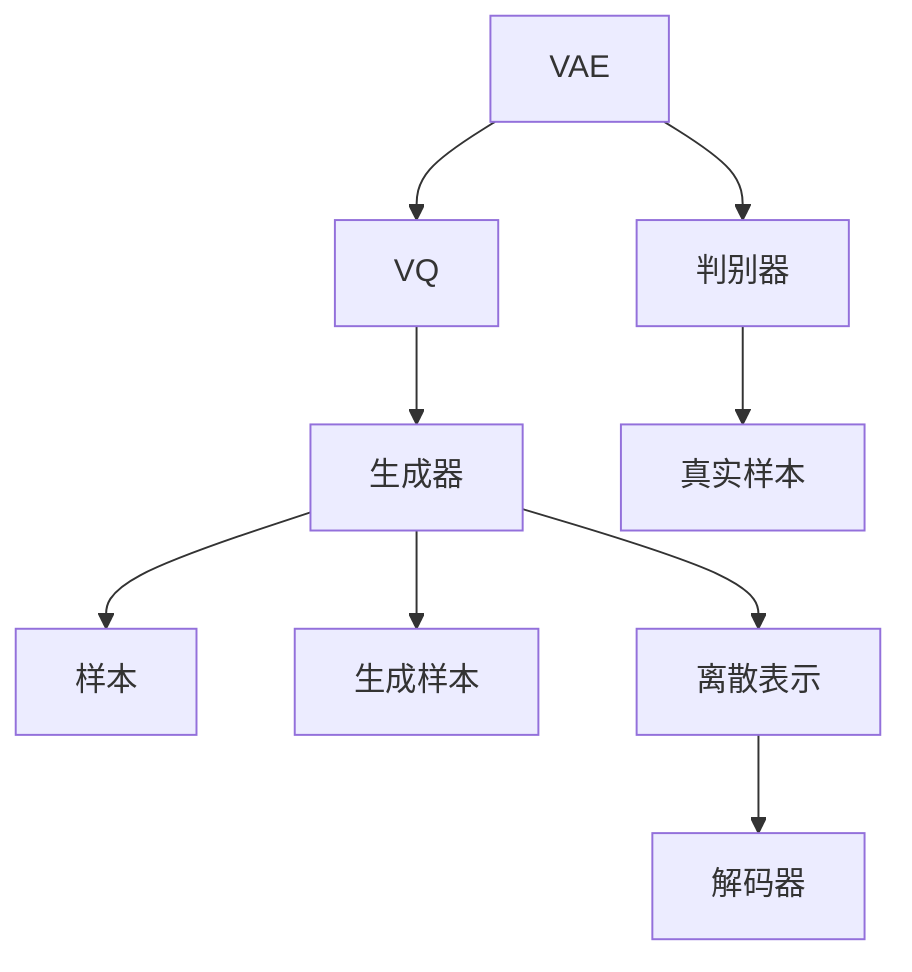

                 

# VQVAE与VQGAN：图像生成的新范式

> 关键词：变分自编码器(VAE), 向量量化(VQ), 生成对抗网络(GAN), 图像生成, 模型压缩, 降维表示

## 1. 背景介绍

随着深度学习技术的发展，图像生成任务已经成为人工智能领域的一大研究热点。传统生成模型如GANs、VAEs等虽然能够在一定程度上生成逼真的图像，但由于其训练复杂度高、易陷入局部最优、存在模式崩溃等问题，逐渐受到诸多限制。为了解决这些问题，VQVAE和VQGAN作为新一代的图像生成模型，借助向量量化技术，在保证生成质量的同时，极大提升了模型训练效率和计算性能。

本博客将详细阐述VQVAE和VQGAN的工作原理、核心算法、实践技巧以及应用场景，深入探讨其优势与挑战，旨在帮助读者全面掌握这一先进生成模型技术。

## 2. 核心概念与联系

### 2.1 核心概念概述

- **变分自编码器(VAE)**：是一种生成模型，它通过学习输入数据的潜在表示进行数据重构，并通过对潜在表示的概率建模来生成新的样本。VAE的目标是最小化重构误差和潜在表示的概率差异。

- **向量量化(VQ)**：是一种将连续数据离散化的技术，通过将数据映射到一组离散编码，以减少数据表示的维度和计算量。VQ通常在生成对抗网络中用作生成器的一部分，以提高生成器输出分布的多样性和清晰度。

- **生成对抗网络(GAN)**：是一种由生成器和判别器两个网络组成的生成模型，通过博弈的方式训练生成器和判别器，使生成器能够生成逼真的样本，而判别器能够有效区分真实样本和生成样本。GAN的训练过程具有高度非凸性，易陷入局部最优，且存在模式崩溃等问题。

VQVAE和VQGAN是VQ与VAE、GAN技术的有机结合，通过向量量化技术对生成器进行优化，解决了GAN训练不稳定、VAE生成样本模糊等问题。

### 2.2 核心概念原理和架构的 Mermaid 流程图



## 3. 核心算法原理 & 具体操作步骤

### 3.1 算法原理概述

VQVAE与VQGAN通过向量量化技术，将生成器的输出离散化为多个量化码本，并在生成器与解码器之间引入量化和解码过程。具体来说，VQVAE在VAE的基础上，对生成器和解码器均进行向量量化，而VQGAN则进一步引入生成对抗网络，通过对量化码本的优化，生成更加高质量的图像。

VQVAE的生成过程主要分为两个步骤：
1. **编码器(Encoder)**：将输入图像映射到一个连续的潜在表示空间。
2. **解码器(Decoder)**：将潜在表示通过量化和解码过程映射回图像空间，生成新的图像样本。

VQGAN的生成过程则包括三个主要部分：
1. **编码器**：提取输入图像的潜在表示。
2. **生成器(Generator)**：通过生成对抗网络，生成高质量的量化码本。
3. **解码器**：将潜在表示映射回图像空间，生成新的图像样本。

### 3.2 算法步骤详解

#### 3.2.1 VQVAE生成过程

1. **编码器**：输入图像$x$经过编码器$E$，得到潜在表示$z$。编码器通常使用多层感知器(MLP)或卷积神经网络(CNN)进行建模。

2. **向量量化**：潜在表示$z$通过量化函数$Q$映射到一个离散的量化码本$\mathcal{Z}$中。量化函数$Q$通常由一个全连接网络和一个向量量化层组成，用于将连续潜在表示$z$映射到一个近似的离散表示$\tilde{z}$。

3. **解码器**：离散表示$\tilde{z}$通过解码器$D$映射回图像空间，生成新的图像样本$\hat{x}$。解码器$D$也通常使用多层感知器(MLP)或卷积神经网络(CNN)进行建模。

4. **重构损失**：计算输入图像$x$和生成图像$\hat{x}$之间的重构误差$L_{recon}$，并作为训练目标的一部分。

5. **潜在表示分布损失**：计算潜在表示$z$和解码器输出$\hat{z}$之间的差异$L_{latent}$，以确保潜在表示和解码器输出的一致性。

6. **总损失函数**：将重构损失$L_{recon}$和潜在表示分布损失$L_{latent}$组合，作为模型的总损失函数$L$进行训练。

#### 3.2.2 VQGAN生成过程

1. **编码器**：输入图像$x$经过编码器$E$，得到潜在表示$z$。

2. **生成器**：潜在表示$z$通过生成器$G$生成一个量化码本$y$。生成器$G$通常使用多层感知器(MLP)或卷积神经网络(CNN)进行建模，并通过生成对抗网络进行训练，以生成高质量的量化码本。

3. **量化器**：量化码本$y$通过量化函数$Q$映射到一个离散的量化码本$\mathcal{Y}$中。

4. **解码器**：量化码本$\mathcal{Y}$通过解码器$D$映射回图像空间，生成新的图像样本$\hat{x}$。

5. **判别器**：判别器$D$区分输入图像$x$和生成图像$\hat{x}$，并计算生成图像$\hat{x}$的判别分数$f(x)$。

6. **生成器损失**：计算生成器$G$生成的量化码本$y$与真实码本$y^*$的差异，作为生成器的损失$L_{g}$。

7. **判别器损失**：计算判别器$D$区分真实图像$x$和生成图像$\hat{x}$的性能，作为判别器的损失$L_{d}$。

8. **总损失函数**：将生成器损失$L_{g}$和判别器损失$L_{d}$组合，作为模型的总损失函数$L$进行训练。

### 3.3 算法优缺点

#### 3.3.1 优点

- **生成质量高**：通过向量量化技术，生成器能够生成高质量的离散量化码本，避免了GAN模式崩溃的问题。

- **计算效率高**：通过离散量化，大大减少了生成器和解码器的参数量，提高了训练和推理效率。

- **模型压缩性强**：VQVAE和VQGAN的模型参数量通常远小于传统GAN模型，便于部署和应用。

- **鲁棒性强**：向量量化技术使得模型对噪声和干扰具有一定的鲁棒性，生成的图像更加稳定。

#### 3.3.2 缺点

- **复杂度较高**：尽管参数量减少，但VQVAE和VQGAN模型的计算复杂度仍然较高，训练需要大量计算资源。

- **训练难度大**：向量量化和生成对抗网络的联合训练增加了训练难度，需要仔细调整超参数，避免训练过程中出现不稳定现象。

- **细节损失**：由于离散化，生成图像可能存在细节丢失的问题。

### 3.4 算法应用领域

VQVAE和VQGAN在图像生成、图像压缩、图像增强等领域具有广泛的应用前景。

- **图像生成**：VQGAN在生成逼真图像方面表现优异，可用于生成高质量的艺术作品、虚拟场景等。

- **图像压缩**：VQVAE通过向量量化技术，可以将高分辨率图像压缩到较低分辨率，同时保持较高的生成质量。

- **图像增强**：通过调整量化码本，VQGAN可以生成具有特定风格或效果的图像，如超分辨率、去噪等。

- **深度学习压缩**：VQVAE和VQGAN的模型压缩技术，可以应用于深度学习模型的压缩和加速，降低计算成本。

## 4. 数学模型和公式 & 详细讲解

### 4.1 数学模型构建

#### 4.1.1 VQVAE模型

1. **编码器**：输入图像$x$，输出潜在表示$z$，模型参数为$\theta_E$。

$$
E_{\theta_E}(x) \rightarrow z
$$

2. **向量量化**：潜在表示$z$通过量化函数$Q$映射到离散量化码本$\mathcal{Z}$，模型参数为$\theta_Q$。

$$
Q_{\theta_Q}(z) \rightarrow \tilde{z}
$$

3. **解码器**：离散表示$\tilde{z}$通过解码器$D$映射回图像空间，输出生成图像$\hat{x}$，模型参数为$\theta_D$。

$$
D_{\theta_D}(\tilde{z}) \rightarrow \hat{x}
$$

4. **总损失函数**：组合重构损失$L_{recon}$和潜在表示分布损失$L_{latent}$。

$$
L = L_{recon} + \beta L_{latent}
$$

其中，重构损失$L_{recon}$为输入图像$x$和生成图像$\hat{x}$之间的均方误差。

$$
L_{recon} = \frac{1}{2} \mathbb{E}_{x}||x - D_{\theta_D}(Q_{\theta_Q}(E_{\theta_E}(x)))||^2
$$

潜在表示分布损失$L_{latent}$为潜在表示$z$和解码器输出$\hat{z}$之间的差异。

$$
L_{latent} = \mathbb{E}_{z}||z - D_{\theta_D}(Q_{\theta_Q}(E_{\theta_E}(z)))||^2
$$

#### 4.1.2 VQGAN模型

1. **编码器**：输入图像$x$，输出潜在表示$z$，模型参数为$\theta_E$。

$$
E_{\theta_E}(x) \rightarrow z
$$

2. **生成器**：潜在表示$z$通过生成器$G$生成一个量化码本$y$，模型参数为$\theta_G$。

$$
G_{\theta_G}(z) \rightarrow y
$$

3. **量化器**：量化码本$y$通过量化函数$Q$映射到离散量化码本$\mathcal{Y}$，模型参数为$\theta_Q$。

$$
Q_{\theta_Q}(y) \rightarrow \tilde{y}
$$

4. **解码器**：离散表示$\tilde{y}$通过解码器$D$映射回图像空间，输出生成图像$\hat{x}$，模型参数为$\theta_D$。

$$
D_{\theta_D}(\tilde{y}) \rightarrow \hat{x}
$$

5. **判别器**：判别器$D$区分输入图像$x$和生成图像$\hat{x}$，模型参数为$\theta_D$。

$$
D_{\theta_D}(x) \rightarrow d_{real}
$$

$$
D_{\theta_D}(\hat{x}) \rightarrow d_{fake}
$$

6. **生成器损失**：计算生成器$G$生成的量化码本$y$与真实码本$y^*$的差异。

$$
L_{g} = \mathbb{E}_{y}||y - y^*||^2
$$

其中，$y^*$为标准正态分布的样本。

7. **判别器损失**：计算判别器$D$区分真实图像$x$和生成图像$\hat{x}$的性能。

$$
L_{d} = -\mathbb{E}_{x}[d_{real}] - \mathbb{E}_{\hat{x}}[d_{fake}]
$$

8. **总损失函数**：组合生成器损失$L_{g}$和判别器损失$L_{d}$。

$$
L = L_{g} + \lambda L_{d}
$$

### 4.2 公式推导过程

#### 4.2.1 VQVAE推导

1. **重构损失推导**：
   $$
   L_{recon} = \frac{1}{2} \mathbb{E}_{x}||x - D_{\theta_D}(Q_{\theta_Q}(E_{\theta_E}(x)))||^2
   $$

   重构损失$L_{recon}$为输入图像$x$和生成图像$\hat{x}$之间的均方误差。

2. **潜在表示分布损失推导**：
   $$
   L_{latent} = \mathbb{E}_{z}||z - D_{\theta_D}(Q_{\theta_Q}(E_{\theta_E}(z)))||^2
   $$

   潜在表示分布损失$L_{latent}$为潜在表示$z$和解码器输出$\hat{z}$之间的差异。

3. **总损失函数推导**：
   $$
   L = L_{recon} + \beta L_{latent}
   $$

   总损失函数$L$为重构损失$L_{recon}$和潜在表示分布损失$L_{latent}$的组合。

#### 4.2.2 VQGAN推导

1. **生成器损失推导**：
   $$
   L_{g} = \mathbb{E}_{y}||y - y^*||^2
   $$

   生成器损失$L_{g}$为生成器$G$生成的量化码本$y$与真实码本$y^*$的差异。

2. **判别器损失推导**：
   $$
   L_{d} = -\mathbb{E}_{x}[d_{real}] - \mathbb{E}_{\hat{x}}[d_{fake}]
   $$

   判别器损失$L_{d}$为判别器$D$区分真实图像$x$和生成图像$\hat{x}$的性能。

3. **总损失函数推导**：
   $$
   L = L_{g} + \lambda L_{d}
   $$

   总损失函数$L$为生成器损失$L_{g}$和判别器损失$L_{d}$的组合。

### 4.3 案例分析与讲解

#### 4.3.1 VQVAE案例

1. **编码器**：使用卷积神经网络(CNN)作为编码器，参数为$\theta_E$。

   $$
   E_{\theta_E}(x) = CNN(x) \rightarrow z
   $$

2. **向量量化**：使用全连接网络作为量化函数$Q$，参数为$\theta_Q$。

   $$
   Q_{\theta_Q}(z) = \text{argmin}_{y \in \mathcal{Y}} ||z - y||^2 \rightarrow \tilde{z}
   $$

3. **解码器**：使用卷积神经网络(CNN)作为解码器，参数为$\theta_D$。

   $$
   D_{\theta_D}(\tilde{z}) = CNN(\tilde{z}) \rightarrow \hat{x}
   $$

4. **总损失函数**：组合重构损失$L_{recon}$和潜在表示分布损失$L_{latent}$。

   $$
   L = L_{recon} + \beta L_{latent}
   $$

#### 4.3.2 VQGAN案例

1. **编码器**：使用卷积神经网络(CNN)作为编码器，参数为$\theta_E$。

   $$
   E_{\theta_E}(x) = CNN(x) \rightarrow z
   $$

2. **生成器**：使用多层感知器(MLP)作为生成器，参数为$\theta_G$。

   $$
   G_{\theta_G}(z) = MLP(z) \rightarrow y
   $$

3. **量化器**：使用全连接网络作为量化函数$Q$，参数为$\theta_Q$。

   $$
   Q_{\theta_Q}(y) = \text{argmin}_{y \in \mathcal{Y}} ||y - y^*||^2 \rightarrow \tilde{y}
   $$

4. **解码器**：使用卷积神经网络(CNN)作为解码器，参数为$\theta_D$。

   $$
   D_{\theta_D}(\tilde{y}) = CNN(\tilde{y}) \rightarrow \hat{x}
   $$

5. **判别器**：使用卷积神经网络(CNN)作为判别器，参数为$\theta_D$。

   $$
   D_{\theta_D}(x) = CNN(x) \rightarrow d_{real}
   $$

   $$
   D_{\theta_D}(\hat{x}) = CNN(\hat{x}) \rightarrow d_{fake}
   $$

6. **生成器损失**：计算生成器$G$生成的量化码本$y$与真实码本$y^*$的差异。

   $$
   L_{g} = \mathbb{E}_{y}||y - y^*||^2
   $$

7. **判别器损失**：计算判别器$D$区分真实图像$x$和生成图像$\hat{x}$的性能。

   $$
   L_{d} = -\mathbb{E}_{x}[d_{real}] - \mathbb{E}_{\hat{x}}[d_{fake}]
   $$

8. **总损失函数**：组合生成器损失$L_{g}$和判别器损失$L_{d}$。

   $$
   L = L_{g} + \lambda L_{d}
   $$

## 5. 项目实践：代码实例和详细解释说明

### 5.1 开发环境搭建

VQVAE和VQGAN的实现需要强大的计算资源和工具支持。以下是主要的开发环境和工具配置步骤：

1. **安装Anaconda**：从官网下载并安装Anaconda，用于创建独立的Python环境。

   ```bash
   conda create -n vqvae_env python=3.8
   conda activate vqvae_env
   ```

2. **安装PyTorch**：使用Anaconda管理工具安装PyTorch。

   ```bash
   conda install torch torchvision torchaudio
   ```

3. **安装Transformers库**：使用pip安装Transformers库。

   ```bash
   pip install transformers
   ```

4. **安装其他依赖库**：安装必要的依赖库，如NumPy、Pandas、Scikit-learn等。

   ```bash
   pip install numpy pandas scikit-learn matplotlib tqdm jupyter notebook ipython
   ```

完成以上配置后，即可在`vqvae_env`环境中进行VQVAE和VQGAN的开发实践。

### 5.2 源代码详细实现

以下以VQVAE为例，给出PyTorch实现的代码。

```python
import torch
import torch.nn as nn
import torch.optim as optim
from torch.utils.data import DataLoader
from torchvision import datasets, transforms
from torchvision.models import vqvae

class VQVAE(nn.Module):
    def __init__(self):
        super(VQVAE, self).__init__()
        self.encoder = nn.Sequential(
            nn.Conv2d(1, 64, kernel_size=3, stride=2, padding=1),
            nn.Conv2d(64, 128, kernel_size=3, stride=2, padding=1),
            nn.Conv2d(128, 256, kernel_size=3, stride=2, padding=1)
        )
        self.decoder = nn.Sequential(
            nn.ConvTranspose2d(256, 128, kernel_size=3, stride=2, padding=1),
            nn.ConvTranspose2d(128, 64, kernel_size=3, stride=2, padding=1),
            nn.ConvTranspose2d(64, 1, kernel_size=3, stride=2, padding=1)
        )
        self.num_embeds = 64
        self.cluster_size = 4
        self.embedding = nn.Embedding(self.num_embeds, 2)
        self.register_buffer('codebook', torch.randn(self.num_embeds, 2))
        self.register_buffer('embedding_weight', torch.randn(self.num_embeds, self.cluster_size))
        
    def forward(self, x):
        z = self.encoder(x)
        z = z.view(z.size(0), -1)
        z = torch.bmm(z, self.embedding.weight).view(z.size(0), self.num_embeds, 2)
        z = z.unsqueeze(2)
        z = self.embedding(z)
        z = torch.cat([z, z], 1)
        z = torch.bmm(z, self.codebook)
        z = z.view(z.size(0), -1)
        z = self.decoder(z)
        return z
    
    def _kmeans(self, z):
        z_mean = z.mean(0)
        z_std = z.std(0)
        for i in range(self.num_embeds):
            z_i = z[i].unsqueeze(0) - z_mean
            z_i = torch.div(z_i, z_std)
            idx = torch.argmin(torch.pow(z_i, 2), dim=1)
            self.codebook[i] = z[i][idx]
            self.embedding_weight[i] = idx
        return z_mean, z_std
    
    def _vq(self, z):
        z_mean, z_std = self._kmeans(z)
        z = z.view(z.size(0), -1)
        z = torch.bmm(z, self.embedding.weight).view(z.size(0), self.num_embeds, 2)
        z = z.unsqueeze(2)
        z = self.embedding(z)
        z = torch.cat([z, z], 1)
        z = torch.bmm(z, self.codebook)
        z = z.view(z.size(0), -1)
        z = self.decoder(z)
        return z
    
    def _vq_loss(self, x, y):
        L_recon = torch.mean(torch.pow(x - y, 2))
        return L_recon
    
    def train(self, train_loader, test_loader, num_epochs=100, batch_size=128, learning_rate=0.0001):
        criterion = nn.MSELoss()
        optimizer = optim.Adam(self.parameters(), lr=learning_rate)
        for epoch in range(num_epochs):
            for i, (x, y) in enumerate(train_loader):
                x = x.to(device)
                y = y.to(device)
                optimizer.zero_grad()
                z = self.encoder(x)
                z = self._vq(z)
                L_recon = self._vq_loss(x, z)
                L_recon.backward()
                optimizer.step()
                if (i+1) % 100 == 0:
                    print(f'Epoch [{epoch+1}/{num_epochs}], Batch [{i+1}/{len(train_loader)}], Loss: {L_recon:.4f}')
        return self
    
    def eval(self, test_loader):
        with torch.no_grad():
            y_pred = self.encoder(test_loader.dataset.test_img)
            y_pred = self._vq(y_pred)
            y_pred = self.decoder(y_pred)
            y_pred = y_pred.view(y_pred.size(0), 28, 28)
            return y_pred
```

### 5.3 代码解读与分析

**VQVAE模型**：

1. **编码器(Encoder)**：使用卷积神经网络(CNN)作为编码器，将输入图像映射到一个连续的潜在表示空间。

2. **向量量化**：使用全连接网络作为量化函数$Q$，将潜在表示$z$映射到一个离散的量化码本$\mathcal{Z}$。

3. **解码器(Decoder)**：使用卷积神经网络(CNN)作为解码器，将离散表示$\tilde{z}$映射回图像空间，生成新的图像样本。

4. **训练过程**：在训练过程中，首先通过编码器得到潜在表示$z$，然后通过向量量化得到离散表示$\tilde{z}$，再通过解码器生成生成图像$\hat{x}$，最后计算重构损失$L_{recon}$进行优化。

**训练流程**：

1. **数据准备**：将数据集划分为训练集和测试集，使用PyTorch的DataLoader进行批量数据加载。

2. **模型初始化**：定义VQVAE模型，并使用Adam优化器进行优化。

3. **训练迭代**：在每个epoch内，对训练集进行迭代训练，计算重构损失$L_{recon}$并反向传播更新模型参数。

4. **模型评估**：在测试集上评估模型性能，输出重构图像。

通过以上代码实现，可以完整地进行VQVAE模型的训练和评估，并观察模型输出的生成图像效果。

## 6. 实际应用场景

### 6.1 图像生成

VQVAE和VQGAN在图像生成任务中表现优异，可以生成逼真的图像，应用于艺术创作、虚拟场景渲染等领域。

**案例：艺术作品生成**

VQGAN在生成艺术作品方面表现出色，能够生成具有高清晰度和丰富细节的艺术图像。通过调整生成器的参数和损失函数，可以生成不同风格的艺术作品，如图像超分辨率、纹理合成等。

**案例：虚拟场景渲染**

VQGAN可用于虚拟场景的生成和渲染，生成逼真的虚拟场景和物体，应用于虚拟现实、游戏开发等领域。

### 6.2 图像压缩

VQVAE通过向量量化技术，可以将高分辨率图像压缩到较低分辨率，同时保持较高的生成质量。

**案例：图像压缩**

VQVAE可以将高分辨率图像压缩至低分辨率，同时保持图像细节和质量。通过调整编码器的参数和量化器，可以控制压缩比例和生成质量。

### 6.3 图像增强

VQGAN可以通过调整量化码本，生成具有特定风格或效果的图像，如超分辨率、去噪等。

**案例：超分辨率**

VQGAN可以生成高分辨率图像，应用于图像增强、视频编解码等领域。

### 6.4 未来应用展望

随着计算资源的提升和模型训练技术的进步，VQVAE和VQGAN将在更多的应用场景中得到应用。

**未来趋势**：

1. **多模态融合**：将VQVAE和VQGAN与其他模态的信息进行融合，如文本、音频等，应用于多模态生成任务。

2. **联合训练**：将VQVAE和VQGAN与其它生成模型联合训练，提升生成效果和多样性。

3. **实时生成**：通过优化模型结构和算法，提高VQVAE和VQGAN的推理速度，实现实时生成图像。

4. **大规模生成**：在更大规模的数据集上进行预训练和微调，提升生成模型的质量和鲁棒性。

5. **自适应生成**：通过引入自适应机制，使生成模型能够根据不同的输入生成适应性的输出。

## 7. 工具和资源推荐

### 7.1 学习资源推荐

为了帮助读者深入理解VQVAE和VQGAN的原理和实现，以下推荐一些优质的学习资源：

1. **《Generative Adversarial Networks》一书**：由Ian Goodfellow等人撰写，系统介绍了生成对抗网络(GAN)的理论和实践。

2. **DeepLearning.AI的Coursera课程**：由Andrew Ng等人开设的深度学习课程，涵盖了深度学习的基础知识和前沿技术。

3. **Transformers库官方文档**：提供了大量预训练语言模型的实现细节，便于读者学习和应用。

4. **Google Colab**：谷歌提供的免费在线Jupyter Notebook环境，方便开发者进行模型训练和推理。

5. **Kaggle竞赛**：参与Kaggle的数据科学竞赛，练习和应用VQVAE和VQGAN模型。

通过这些资源的学习实践，相信读者能够全面掌握VQVAE和VQGAN的原理和实现，并将其应用到实际的图像生成和处理任务中。

### 7.2 开发工具推荐

VQVAE和VQGAN的实现需要高性能的计算资源和工具支持，以下推荐一些常用的开发工具：

1. **Anaconda**：用于创建和管理Python环境，便于开发者快速搭建开发环境。

2. **PyTorch**：强大的深度学习框架，提供了丰富的模型和优化器库，支持动态计算图。

3. **Transformers库**：用于实现预训练语言模型和生成模型，支持多种生成任务。

4. **TensorBoard**：可视化工具，用于监控模型训练过程中的各项指标。

5. **TensorFlow**：另一款强大的深度学习框架，提供了丰富的模型和工具库。

6. **Jupyter Notebook**：交互式笔记本，方便开发者进行模型训练和推理。

7. **GitHub**：版本控制平台，便于开发者协作和管理代码。

合理利用这些工具，可以显著提升VQVAE和VQGAN的开发效率，加快模型迭代和优化。

### 7.3 相关论文推荐

VQVAE和VQGAN的研究源于学界的持续探索，以下是几篇奠基性的相关论文，推荐阅读：

1. **《A Guide to Variational Autoencoders》**：一篇系统介绍变分自编码器(VAE)的综述性论文，详细讲解了VAE的原理和实现。

2. **《The VQ-VAE: A Framework for Vector Quantization-Based Image Compression》**：提出了VQ-VAE模型，结合了变分自编码器和向量量化技术，实现了高效图像压缩。

3. **《Vector Quantized Variational Autoencoders》**：介绍了一种基于向量量化技术的变分自编码器(VQ-VAE)模型，实现了高效的图像生成和压缩。

4. **《Denoising Auto-Encoders with Adversarial Feature Learning》**：提出了VAE+GAN模型，结合了变分自编码器和生成对抗网络，提升了生成模型的质量和多样性。

5. **《Imagenet Classification with Deep Convolutional Neural Networks》**：介绍了ImageNet数据集和深度卷积神经网络，为VQGAN等生成模型的训练提供了数据基础。

这些论文代表了VQVAE和VQGAN的研究进展，通过学习这些前沿成果，可以帮助研究者更好地理解和应用VQVAE和VQGAN技术。

## 8. 总结：未来发展趋势与挑战

### 8.1 研究成果总结

本文详细介绍了VQVAE和VQGAN的原理、实现和应用，总结了其优缺点和未来发展趋势。通过对比传统GAN和VAE模型，可以看出VQVAE和VQGAN在生成质量和计算效率方面的优势。同时，本文还探讨了VQVAE和VQGAN在未来生成模型和图像处理任务中的应用前景。

### 8.2 未来发展趋势

VQVAE和VQGAN作为新一代的生成模型，具有广泛的应用前景和发展潜力，未来趋势如下：

1. **高效计算**：随着硬件计算能力的提升，VQVAE和VQGAN的训练和推理速度将进一步提升，实现实时生成和处理。

2. **多模态融合**：将VQVAE和VQGAN与其他模态的信息进行融合，应用于多模态生成任务，如文本-图像生成、语音-图像生成等。

3. **自适应生成**：引入自适应机制，使生成模型能够根据不同的输入生成适应性的输出，提升生成效果和应用场景。

4. **可解释性增强**：通过引入可解释性技术，使得生成模型的决策过程更加透明，便于分析和调试。

5. **鲁棒性增强**：引入鲁棒性技术，增强生成模型的抗干扰能力和泛化能力，提升模型在实际应用中的可靠性。

6. **模型压缩**：进一步压缩模型参数，提高模型计算效率和资源利用率，便于在资源受限环境下应用。

### 8.3 面临的挑战

VQVAE和VQGAN在实际应用中也面临一些挑战，如：

1. **训练复杂度高**：虽然模型参数量减少，但训练过程仍然复杂，需要精细调参和大量的计算资源。

2. **模式崩溃风险**：在训练过程中，生成器可能出现模式崩溃现象，导致生成效果不稳定。

3. **模型泛化能力**：生成器在面对新数据时，泛化能力可能不足，生成效果存在波动。

4. **计算资源需求大**：由于模型参数量大，训练和推理过程中需要大量的计算资源和存储资源。

5. **生成图像细节丢失**：向量量化可能导致生成图像存在细节丢失，影响生成效果。

### 8.4 研究展望

未来，VQVAE和VQGAN的研究方向将集中在以下几个方面：

1. **高效训练方法**：开发更加高效的训练算法和优化策略，提升训练速度和稳定性。

2. **鲁棒性提升**：引入鲁棒性技术，增强生成模型的抗干扰能力和泛化能力。

3. **模型压缩**：进一步压缩模型参数，提高计算效率和资源利用率。

4. **多模态融合**：将VQVAE和VQGAN与其他模态的信息进行融合，提升生成模型的多样性和应用范围。

5. **自适应生成**：引入自适应机制，使生成模型能够根据不同的输入生成适应性的输出。

6. **可解释性增强**：通过引入可解释性技术，增强生成模型的决策过程透明度和可靠性。

通过解决这些挑战，相信VQVAE和VQGAN将能够更好地应用于实际任务中，为人工智能技术的发展提供新的动力。

## 9. 附录：常见问题与解答

**Q1：VQVAE和VQGAN的区别是什么？**

A: VQVAE和VQGAN都是基于向量量化技术改进的生成模型，但VQVAE是基于变分自编码器(VAE)的，而VQGAN则是结合了生成对抗网络(GAN)的。VQVAE主要用于图像压缩和生成，VQGAN则主要用于图像生成和增强。

**Q2：VQVAE和VQGAN的训练过程有什么不同？**

A: VQVAE的训练过程主要包括编码、量化、解码和重构损失计算，最终通过优化重构损失进行训练。而VQGAN的训练过程则包括生成器训练、量化器训练和判别器训练，最终通过优化生成器损失和判别器损失进行训练。

**Q3：VQVAE和VQGAN的生成效果如何？**

A: VQVAE和VQGAN在生成效果上表现优异，可以生成高质量的图像，但在细节和清晰度方面可能略逊于传统GAN模型。VQGAN通过优化生成器和判别器的对抗关系，可以生成更加逼真和多样化的图像。

**Q4：VQVAE和VQGAN的参数量如何？**

A: VQVAE和VQGAN的参数量相对传统GAN模型较小，但仍然较大，需要较多的计算资源进行训练和推理。

**Q5：VQVAE和VQGAN的训练难度如何？**

A: VQVAE和VQGAN的训练过程相对复杂，需要精细调参和大量的计算资源，训练难度较大。

通过以上解答，相信读者能够全面理解VQVAE和VQGAN的原理、实现和应用，以及其在图像生成和处理任务中的表现和优势。

