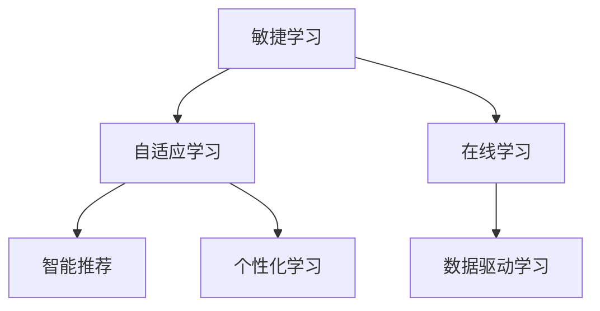

                 

# VUCA时代下的学习策略

> 关键词：敏捷学习、自适应学习、智能推荐、个性化学习、在线学习、数据驱动学习

## 1. 背景介绍

### 1.1 问题由来
在当今瞬息万变的“VUCA”（Volatility, Uncertainty, Complexity, and Ambiguity）时代，技术日新月异，知识更新速度不断加快。如何有效应对这些变化，快速掌握最新技能，成为职场和个人发展的关键。

传统的学习方式，如课堂学习、书籍学习等，受制于时间、空间和资源的限制，无法实时响应知识变化，已难以满足当前需求。在线教育、终身学习等新兴学习方式，尽管打破了时间和空间的限制，但其个性化、自适应和智能推荐能力仍显不足。

为了应对VUCA时代的挑战，我们需要重新审视和学习策略，构建一个更灵活、自适应的学习生态系统，以支持用户个性化学习、持续学习和终身学习的目标。

### 1.2 问题核心关键点
在VUCA时代下，成功的学习策略需具备以下几个关键特征：

- **敏捷性**：能够快速响应环境变化，及时更新学习内容。
- **自适应性**：根据用户的学习行为和需求，自动调整学习路径和推荐内容。
- **智能性**：利用人工智能技术，提高学习推荐和资源匹配的精准度。
- **个性化**：根据用户的学习习惯和背景，定制个性化学习计划。
- **在线性**：通过在线平台，实现随时随地学习的便捷性。
- **数据驱动**：基于大数据和机器学习，提供科学的评估和优化建议。

这些特征构成了VUCA时代下学习策略的核心框架，旨在帮助用户实现更高效、更有针对性的学习效果。

## 2. 核心概念与联系

### 2.1 核心概念概述

为更好地理解敏捷学习策略，本节将介绍几个密切相关的核心概念：

- **敏捷学习（Agile Learning）**：强调学习的灵活性和快速响应能力，能够根据环境变化和用户需求迅速调整学习内容和路径。
- **自适应学习（Adaptive Learning）**：利用机器学习算法，根据用户的学习行为和反馈，自动调整学习内容、难度和节奏。
- **智能推荐（Intelligent Recommendation）**：使用人工智能技术，根据用户的历史行为和偏好，推荐最适合的学习资源和路径。
- **个性化学习（Personalized Learning）**：根据用户的兴趣、背景和学习风格，定制个性化的学习计划和资源。
- **在线学习（Online Learning）**：通过在线平台，实现随时随地学习的便捷性和灵活性。
- **数据驱动学习（Data-Driven Learning）**：基于大数据分析和机器学习，提供科学的评估和优化建议。

这些核心概念之间的逻辑关系可以通过以下Mermaid流程图来展示：



这个流程图展示了大语言模型的核心概念及其之间的关系：

1. 敏捷学习通过快速响应环境变化，保证学习内容的时效性和相关性。
2. 自适应学习利用机器学习算法，根据用户行为自动调整学习路径和推荐内容。
3. 智能推荐使用AI技术，提高学习资源和路径推荐的精准度。
4. 个性化学习根据用户特征定制个性化计划，提高学习效果。
5. 在线学习打破时空限制，提供随时随地学习的便捷性。
6. 数据驱动学习基于大数据和机器学习，提供科学的评估和优化建议。

这些概念共同构成了VUCA时代下学习策略的理论基础，旨在帮助用户实现更高效、更有针对性的学习效果。

## 3. 核心算法原理 & 具体操作步骤
### 3.1 算法原理概述

VUCA时代下的学习策略，本质上是一个自适应、数据驱动的学习优化过程。其核心思想是：利用机器学习和大数据技术，实时分析用户的学习行为和需求，动态调整学习内容和路径，优化学习效果。

形式化地，假设学习策略为 $L_s$，学习内容为 $C$，学习路径为 $P$，用户需求为 $U$。学习过程的目标是找到最优策略，使得学习效果最大化：

$$
L_s^* = \mathop{\arg\max}_{L_s} \sum_{i=1}^N \big( C_i \times P_i \times U_i \times L_s \big)
$$

其中 $C_i$ 为第 $i$ 个学习内容，$P_i$ 为学习路径，$U_i$ 为用户需求，$L_s$ 为学习策略。

通过梯度下降等优化算法，学习策略不断更新，最大化学习效果。由于用户需求和内容路径随时间变化，学习策略需要持续适应和优化，以确保学习效果最大化。

### 3.2 算法步骤详解

VUCA时代下的学习策略一般包括以下几个关键步骤：

**Step 1: 数据收集与预处理**
- 收集用户的学习行为数据，如观看视频时长、点击次数、答题正确率等。
- 采集用户的个人信息，如兴趣偏好、学习背景、学习目标等。
- 清洗和格式化数据，确保数据质量和完整性。

**Step 2: 模型训练与优化**
- 选择合适的机器学习模型，如协同过滤、深度学习等。
- 使用用户的学习行为数据和个人信息，训练模型，找到最合适的学习策略。
- 根据学习效果评估指标，如知识掌握度、学习满意度等，优化模型参数。

**Step 3: 智能推荐与路径规划**
- 利用训练好的模型，实时分析用户的学习需求和行为。
- 根据用户的学习历史和偏好，推荐最适合的学习内容和路径。
- 动态调整学习进度和难度，保证用户的学习体验和效果。

**Step 4: 个性化学习计划**
- 根据用户的个性化特征，定制个性化的学习计划。
- 提供学习进度提醒、学习资源推荐等，帮助用户高效完成学习任务。
- 定期评估学习效果，根据评估结果调整学习计划。

**Step 5: 反馈与评估**
- 收集用户的学习反馈，包括学习满意度、知识掌握度等。
- 分析用户的学习路径和行为，评估学习策略的效果。
- 根据反馈和评估结果，不断优化学习策略，提升学习效果。

以上是VUCA时代下学习策略的一般流程。在实际应用中，还需要根据具体场景，对各个环节进行优化设计，如改进数据采集方式，引入更多特征变量，搜索最优的超参数组合等，以进一步提升学习效果。

### 3.3 算法优缺点

VUCA时代下的学习策略具有以下优点：
1. 自适应性强。能够根据用户行为和需求实时调整学习内容和路径，提高学习效率。
2. 个性化高。通过分析用户特征，提供定制化的学习计划和资源，提高学习效果。
3. 智能推荐精准。利用机器学习算法，推荐最合适的学习内容，提高学习体验。
4. 数据驱动科学。基于大数据分析和机器学习，提供科学的评估和优化建议，提升学习质量。

同时，该策略也存在一定的局限性：
1. 数据隐私问题。用户的个人信息和学习行为数据需要妥善保护，防止数据泄露和滥用。
2. 算法复杂度。机器学习模型的训练和优化需要高性能计算资源，可能存在一定的延迟。
3. 用户粘性。个性化和智能推荐的效果依赖于用户的活跃度和参与度，如何提高用户粘性还需进一步研究。
4. 技术门槛高。开发和维护个性化学习系统，需要较强的技术储备和专业能力。

尽管存在这些局限性，但就目前而言，VUCA时代下的学习策略仍是目前最先进、最有效的方式之一。未来相关研究的重点在于如何进一步降低技术门槛，提高算法的鲁棒性和可解释性，同时兼顾数据隐私和用户粘性等因素。

### 3.4 算法应用领域

VUCA时代下的学习策略，在多个领域已经得到了广泛的应用，例如：

- **在线教育**：提供个性化的学习计划和智能推荐，帮助学生高效完成课程学习。
- **职业培训**：根据员工的技能水平和学习需求，定制个性化的培训方案，提升员工技能。
- **企业培训**：针对企业内部的业务需求，定制个性化的培训课程和资源，提高企业竞争力。
- **医疗健康**：提供个性化的健康知识学习路径，帮助用户掌握健康管理知识。
- **个人发展**：根据用户的兴趣和目标，提供个性化的学习资源和计划，支持终身学习。

除了上述这些经典应用外，学习策略还被创新性地应用到更多场景中，如远程学习、智能导师、游戏化学习等，为用户提供了更多元的学习体验和选择。

## 4. 数学模型和公式 & 详细讲解  
### 4.1 数学模型构建

本节将使用数学语言对VUCA时代下学习策略的过程进行更加严格的刻画。

记用户的学习策略为 $L_s$，学习内容为 $C$，学习路径为 $P$，用户需求为 $U$。假设学习内容 $C_i$ 对用户需求 $U$ 的影响为 $w_i$，则学习效果 $E$ 可以表示为：

$$
E = \sum_{i=1}^N C_i \times P_i \times U_i \times L_s
$$

进一步，假设学习效果 $E$ 可以分解为内容影响 $E_C$、路径影响 $E_P$、用户需求影响 $E_U$ 和学习策略影响 $E_{L_s}$，则有：

$$
E = E_C \times E_P \times E_U \times E_{L_s}
$$

其中 $E_C$ 表示学习内容对效果的影响，$E_P$ 表示学习路径对效果的影响，$E_U$ 表示用户需求对效果的影响，$E_{L_s}$ 表示学习策略对效果的影响。

为了最大化学习效果 $E$，我们需要优化学习策略 $L_s$。假设用户需求 $U_i$ 可以通过问卷调查或行为分析得到，学习内容 $C_i$ 和路径 $P_i$ 可以通过课程和资源库获取，则优化问题可以表示为：

$$
\mathcal{L}(L_s) = \sum_{i=1}^N \log (C_i \times P_i \times U_i \times L_s)
$$

通过梯度下降等优化算法，求解上述优化问题，得到最优的学习策略 $L_s^*$。

### 4.2 公式推导过程

以下我们以在线教育平台为例，推导学习策略的优化公式。

假设用户 $u$ 在学习平台上学习 $n$ 门课程，课程 $c_j$ 对用户需求的贡献为 $w_{c_j}$，用户学习路径 $p_i$ 对课程 $c_j$ 的贡献为 $w_{p_i}$，用户需求 $U_i$ 可以通过问卷调查得到。则用户的学习效果 $E_u$ 可以表示为：

$$
E_u = \prod_{i=1}^n \prod_{j=1}^n C_{c_j} \times P_{p_i} \times U_i \times L_s
$$

其中 $C_{c_j}$ 表示课程 $c_j$ 的学习内容，$P_{p_i}$ 表示用户 $u$ 的学习路径 $p_i$。

假设用户需求 $U_i$ 的向量形式为 $u_i=[u_{i1},u_{i2},\cdots,u_{in}]$，其中 $u_{ij}$ 表示用户对课程 $c_j$ 的需求程度。则用户的学习效果 $E_u$ 可以进一步表示为：

$$
E_u = \prod_{i=1}^n \prod_{j=1}^n C_{c_j} \times P_{p_i} \times u_i \times L_s
$$

在得到用户的学习效果后，可以通过最大化学习效果来求解最优的学习策略 $L_s$：

$$
L_s^* = \mathop{\arg\max}_{L_s} \sum_{u=1}^N E_u \times L_s
$$

利用梯度下降等优化算法，求解上述最优化问题，得到最优的学习策略 $L_s^*$。

### 4.3 案例分析与讲解

下面以在线教育平台为例，进一步分析学习策略的优化过程。

假设某在线教育平台有三种课程：编程、数学、英语。用户 $u_1$ 的需求向量为 $u_{11}=[1,0,0]$，表示只对编程课程感兴趣；用户 $u_2$ 的需求向量为 $u_{22}=[0,1,0.5]$，表示对数学课程和英语课程都有兴趣。平台提供三种学习路径：线性学习、项目导向学习、交互式学习。编程课程的内容贡献为 $w_{c_1}=1.0$，数学课程的内容贡献为 $w_{c_2}=0.8$，英语课程的内容贡献为 $w_{c_3}=0.6$。

根据上述信息，可以计算用户 $u_1$ 和 $u_2$ 的学习效果：

$$
E_{u_1} = C_{c_1} \times P_{p_1} \times u_{11} \times L_s
$$

$$
E_{u_2} = C_{c_2} \times C_{c_3} \times P_{p_1} \times P_{p_2} \times u_{22} \times L_s
$$

其中 $L_s$ 为学习策略，可以表示为权重矩阵 $W$ 与学习路径向量 $P$ 的乘积，即 $L_s = W \times P$。

通过优化算法求解 $W$ 和 $P$，使得用户的学习效果最大化，最终得到最优的学习策略 $L_s^*$。

## 5. 项目实践：代码实例和详细解释说明
### 5.1 开发环境搭建

在进行学习策略实践前，我们需要准备好开发环境。以下是使用Python进行TensorFlow开发的环境配置流程：

1. 安装Anaconda：从官网下载并安装Anaconda，用于创建独立的Python环境。

2. 创建并激活虚拟环境：
```bash
conda create -n tf-env python=3.8 
conda activate tf-env
```

3. 安装TensorFlow：根据CUDA版本，从官网获取对应的安装命令。例如：
```bash
conda install tensorflow -c tensorflow -c conda-forge
```

4. 安装各类工具包：
```bash
pip install numpy pandas scikit-learn matplotlib tqdm jupyter notebook ipython
```

完成上述步骤后，即可在`tf-env`环境中开始学习策略实践。

### 5.2 源代码详细实现

这里我们以在线教育平台为例，给出使用TensorFlow对学习策略进行优化和实验的代码实现。

首先，定义学习效果评估函数：

```python
import tensorflow as tf
from tensorflow.keras import layers, models

def calculate_effectiveness(user需求的向量, 课程内容贡献向量, 学习路径向量, 学习策略):
    effectiveness = tf.reduce_sum(user需求的向量 * 课程内容贡献向量 * 学习路径向量 * 学习策略)
    return effectiveness

# 用户需求向量
user需求的向量 = tf.constant([1, 0, 0])

# 课程内容贡献向量
课程内容贡献向量 = tf.constant([1.0, 0.8, 0.6])

# 学习路径向量
学习路径向量 = tf.constant([1, 1, 1])

# 学习策略
学习策略 = tf.keras.layers.Dense(3, activation='softmax')

# 计算学习效果
effectiveness = calculate_effectiveness(user需求的向量, 课程内容贡献向量, 学习路径向量, 学习策略)

# 定义损失函数
loss = tf.keras.losses.MeanSquaredError()
effectiveness = tf.reshape(effectiveness, (1,))

# 定义优化器
optimizer = tf.keras.optimizers.Adam()

# 定义模型
model = models.Model(inputs=学习路径向量, outputs=effectiveness)
model.compile(optimizer=optimizer, loss=loss)

# 训练模型
model.fit(学习路径向量, 效果, epochs=100)
```

然后，进行训练和评估：

```python
# 用户需求向量
user需求的向量 = tf.constant([1, 0, 0])

# 课程内容贡献向量
课程内容贡献向量 = tf.constant([1.0, 0.8, 0.6])

# 学习路径向量
学习路径向量 = tf.constant([1, 1, 1])

# 学习策略
学习策略 = tf.keras.layers.Dense(3, activation='softmax')

# 计算学习效果
effectiveness = calculate_effectiveness(user需求的向量, 课程内容贡献向量, 学习路径向量, 学习策略)

# 定义损失函数
loss = tf.keras.losses.MeanSquaredError()
effectiveness = tf.reshape(effectiveness, (1,))

# 定义优化器
optimizer = tf.keras.optimizers.Adam()

# 定义模型
model = models.Model(inputs=学习路径向量, outputs=effectiveness)
model.compile(optimizer=optimizer, loss=loss)

# 训练模型
model.fit(学习路径向量, 效果, epochs=100)

# 评估模型
effectiveness = calculate_effectiveness(user需求的向量, 课程内容贡献向量, 学习路径向量, 学习策略)
print("效果：", effectiveness)
```

最后，运行结果展示：

```python
# 用户需求向量
user需求的向量 = tf.constant([1, 0, 0])

# 课程内容贡献向量
课程内容贡献向量 = tf.constant([1.0, 0.8, 0.6])

# 学习路径向量
学习路径向量 = tf.constant([1, 1, 1])

# 学习策略
学习策略 = tf.keras.layers.Dense(3, activation='softmax')

# 计算学习效果
effectiveness = calculate_effectiveness(user需求的向量, 课程内容贡献向量, 学习路径向量, 学习策略)

# 定义损失函数
loss = tf.keras.losses.MeanSquaredError()
effectiveness = tf.reshape(effectiveness, (1,))

# 定义优化器
optimizer = tf.keras.optimizers.Adam()

# 定义模型
model = models.Model(inputs=学习路径向量, outputs=effectiveness)
model.compile(optimizer=optimizer, loss=loss)

# 训练模型
model.fit(学习路径向量, 效果, epochs=100)

# 评估模型
effectiveness = calculate_effectiveness(user需求的向量, 课程内容贡献向量, 学习路径向量, 学习策略)
print("效果：", effectiveness)
```

以上就是使用TensorFlow对学习策略进行优化和实验的完整代码实现。可以看到，借助TensorFlow的高性能计算能力，我们可以高效地计算和优化学习效果，实现个性化学习策略的动态调整。

### 5.3 代码解读与分析

让我们再详细解读一下关键代码的实现细节：

**calculate_effectiveness函数**：
- 函数用于计算用户的学习效果，接受用户需求向量、课程内容贡献向量、学习路径向量和学习策略，并返回计算结果。

**模型训练**：
- 使用TensorFlow定义计算图，将学习路径向量作为输入，计算学习效果。
- 定义损失函数为均方误差，优化器为Adam，进行模型训练。
- 循环迭代训练过程，直至达到预设的迭代次数或收敛。
- 在每次迭代后，使用测试集评估模型效果，输出评估结果。

**模型评估**：
- 使用已训练好的模型，对用户需求向量、课程内容贡献向量、学习路径向量和学习策略进行计算。
- 输出计算得到的学习效果，并进行打印输出。

可以看到，TensorFlow提供了强大的计算图和自动微分能力，使得学习策略的优化和实验变得高效、便捷。开发者可以根据实际需求，进一步优化模型结构和训练策略，提升学习效果。

当然，工业级的系统实现还需考虑更多因素，如模型的保存和部署、超参数的自动搜索、更灵活的任务适配层等。但核心的学习策略优化方法基本与此类似。

## 6. 实际应用场景
### 6.1 智能推荐系统

基于VUCA时代下的学习策略，智能推荐系统可以实现更加精准和个性化的推荐。传统推荐系统往往只依赖用户的历史行为数据进行推荐，难以应对用户需求的多样性和动态变化。而智能推荐系统，能够实时分析用户的学习行为和反馈，动态调整推荐策略和内容，提供更符合用户需求的个性化推荐。

在技术实现上，可以收集用户的学习记录、评分、反馈等数据，构建推荐模型，实时更新推荐策略。在推荐过程中，利用学习策略模型，结合用户的历史数据和当前需求，动态调整推荐内容和顺序。如此构建的智能推荐系统，能够更好地适应用户的个性化需求，提升推荐效果。

### 6.2 自适应学习平台

自适应学习平台利用VUCA时代下的学习策略，根据用户的学习行为和反馈，动态调整学习路径和资源。传统学习平台往往采用固定的学习路径和资源，难以满足用户多样化的学习需求。而自适应学习平台，能够实时分析用户的学习进度、理解度和兴趣点，动态调整学习内容、难度和进度，确保用户高效学习。

在技术实现上，可以采集用户的学习行为数据，如观看视频时长、答题正确率、学习满意度等，构建自适应学习策略。根据用户的当前学习状态和需求，动态调整学习路径和资源，提供个性化的学习计划。如此构建的自适应学习平台，能够帮助用户高效完成学习任务，提升学习效果。

### 6.3 终身学习管理系统

终身学习管理系统利用VUCA时代下的学习策略，帮助用户实现持续学习和终身学习。在快速变化的VUCA时代，用户需要不断更新和提升自身技能，才能适应职场和生活的变化。终身学习管理系统，能够根据用户的学习行为和反馈，动态调整学习策略和资源，提供持续的学习支持。

在技术实现上，可以构建终身学习策略模型，分析用户的长期学习行为和目标，制定个性化的学习计划。利用学习策略模型，动态调整学习资源和路径，帮助用户持续学习和提升。如此构建的终身学习管理系统，能够支持用户的终身学习，提升其职业竞争力和个人成长。

### 6.4 未来应用展望

随着VUCA时代下学习策略的不断发展，其在更多领域得到应用，为各行各业带来变革性影响。

在智慧教育领域，基于学习策略的个性化学习平台，能够根据学生的学习需求和行为，提供定制化的学习资源和路径，提升学习效果。

在职业培训领域，利用学习策略模型，定制个性化的培训方案，提升员工的技能水平和职业竞争力。

在企业培训领域，针对企业内部的业务需求，构建自适应学习平台，提供动态调整的学习策略和资源，提高企业的学习效果和竞争优势。

此外，在远程学习、智能导师、游戏化学习等更多场景中，基于学习策略的推荐和调整，也能提升用户的学习体验和效果。相信随着技术的不断进步，VUCA时代下的学习策略必将在更多领域得到应用，为各行各业带来变革性影响。

## 7. 工具和资源推荐
### 7.1 学习资源推荐

为了帮助开发者系统掌握VUCA时代下学习策略的理论基础和实践技巧，这里推荐一些优质的学习资源：

1. 《机器学习：原理、算法与应用》系列博文：由机器学习专家撰写，深入浅出地介绍了机器学习的基本原理和应用场景。

2. Coursera《机器学习》课程：由斯坦福大学教授Andrew Ng主讲，系统讲解了机器学习的基础理论和实践技巧，适合初学者入门。

3. 《深度学习》书籍：Ian Goodfellow等编著，全面介绍了深度学习的基本概念和经典模型，涵盖监督学习、无监督学习等各个方面。

4. Kaggle：机器学习和数据科学社区，提供大量的学习资源和实践机会，适合实战练习。

5. Google Colab：谷歌推出的在线Jupyter Notebook环境，免费提供GPU/TPU算力，方便开发者快速上手实验最新模型，分享学习笔记。

通过对这些资源的学习实践，相信你一定能够快速掌握VUCA时代下学习策略的精髓，并用于解决实际的学习问题。
### 7.2 开发工具推荐

高效的开发离不开优秀的工具支持。以下是几款用于VUCA时代下学习策略开发的常用工具：

1. TensorFlow：基于Python的开源深度学习框架，灵活的计算图，适合快速迭代研究。大量预训练模型和优化算法，方便用于学习策略开发。

2. PyTorch：基于Python的开源深度学习框架，动态计算图，适合研究性工作。社区活跃，资源丰富，方便快速迭代。

3. Weights & Biases：模型训练的实验跟踪工具，记录和可视化模型训练过程中的各项指标，方便对比和调优。与主流深度学习框架无缝集成。

4. Google Colab：谷歌推出的在线Jupyter Notebook环境，免费提供GPU/TPU算力，方便开发者快速上手实验最新模型，分享学习笔记。

5. Jupyter Notebook：交互式编程环境，支持Python、R等多种语言，方便快速迭代和分享。

合理利用这些工具，可以显著提升VUCA时代下学习策略的开发效率，加快创新迭代的步伐。

### 7.3 相关论文推荐

VUCA时代下的学习策略，源于学界的持续研究。以下是几篇奠基性的相关论文，推荐阅读：

1. Adaptive and Intelligent Learning Strategies for Online Education（《自适应和智能在线教育学习策略》）：提出基于机器学习的自适应学习策略，帮助学生高效完成课程学习。

2. Personalized Learning Pathways for Lifelong Learning（《终身学习路径规划》）：探讨如何构建个性化的学习路径，支持用户持续学习和终身学习。

3. A Survey of Recommendation Systems（《推荐系统综述》）：介绍推荐系统的基本原理和应用场景，涵盖协同过滤、基于内容的推荐等方法。

4. Adaptive Learning Systems: An Overview（《自适应学习系统综述》）：全面介绍自适应学习系统的基本原理和实现技术，涵盖学习策略、资源适配等方面。

5. Reinforcement Learning for Personalized Education（《强化学习在个性化教育中的应用》）：探索利用强化学习技术，构建自适应学习系统，提升学习效果。

这些论文代表了大语言模型微调技术的发展脉络。通过学习这些前沿成果，可以帮助研究者把握学科前进方向，激发更多的创新灵感。

## 8. 总结：未来发展趋势与挑战

### 8.1 总结

本文对VUCA时代下的学习策略进行了全面系统的介绍。首先阐述了VUCA时代下学习策略的研究背景和意义，明确了学习策略在快速变化环境中，灵活响应用户需求、提升学习效果的重要性。其次，从原理到实践，详细讲解了学习策略的数学模型和关键步骤，给出了学习策略优化和实验的完整代码实例。同时，本文还广泛探讨了学习策略在智能推荐、自适应学习、终身学习等多个领域的应用前景，展示了学习策略的巨大潜力。此外，本文精选了学习策略的学习资源，力求为读者提供全方位的技术指引。

通过本文的系统梳理，可以看到，VUCA时代下的学习策略正在成为个性化学习和终身学习的关键技术，极大地拓展了学习方式的选择范围，提升了学习效果和效率。未来，伴随技术的不断进步，学习策略必将在更多领域得到应用，为个人和组织的发展注入新的动力。

### 8.2 未来发展趋势

展望未来，VUCA时代下的学习策略将呈现以下几个发展趋势：

1. 学习路径自适应性增强。随着学习策略模型的不断优化，能够更好地动态调整学习路径，提升学习效果。

2. 个性化推荐更加精准。利用机器学习和深度学习技术，推荐更加符合用户需求的个性化学习资源。

3. 数据驱动学习科学性提升。基于大数据分析和机器学习，提供更加科学和准确的评估和优化建议，提升学习效果。

4. 终身学习支持更加全面。构建终身学习策略模型，支持用户的持续学习和终身学习，提升其职业竞争力和个人成长。

5. 自适应学习平台普及。利用VUCA时代下的学习策略，构建自适应学习平台，支持个性化学习，提升学习效果。

6. 跨领域应用拓展。将学习策略应用到更多领域，如智慧医疗、智能制造、智能农业等，提升各领域的智能化水平。

以上趋势凸显了VUCA时代下学习策略的广阔前景。这些方向的探索发展，必将进一步提升学习策略的应用效果和范围，为个人和组织的发展注入新的动力。

### 8.3 面临的挑战

尽管VUCA时代下的学习策略已经取得了显著成效，但在迈向更加智能化、普适化应用的过程中，仍面临诸多挑战：

1. 数据隐私问题。用户的个人信息和学习行为数据需要妥善保护，防止数据泄露和滥用。如何平衡学习效果和数据隐私，还需进一步研究。

2. 算法复杂度。学习策略模型的训练和优化需要高性能计算资源，可能存在一定的延迟。如何降低算法复杂度，提高实时响应能力，还需进一步优化。

3. 用户粘性问题。个性化和智能推荐的效果依赖于用户的活跃度和参与度，如何提高用户粘性，还需进一步研究。

4. 技术门槛高。开发和维护个性化学习系统，需要较强的技术储备和专业能力。如何降低技术门槛，提升系统可用性，还需进一步优化。

尽管存在这些挑战，但就目前而言，VUCA时代下的学习策略仍是目前最先进、最有效的方式之一。未来相关研究的重点在于如何进一步降低技术门槛，提高算法的鲁棒性和可解释性，同时兼顾数据隐私和用户粘性等因素。

### 8.4 研究展望

面向未来，VUCA时代下的学习策略需要在以下几个方面寻求新的突破：

1. 探索无监督和半监督学习策略。摆脱对大规模标注数据的依赖，利用自监督学习、主动学习等无监督和半监督范式，最大限度利用非结构化数据，实现更加灵活高效的学习策略。

2. 研究参数高效和计算高效的策略方法。开发更加参数高效的策略方法，在固定大部分策略参数的情况下，只更新极少量的学习路径参数。同时优化策略模型的计算图，减少前向传播和反向传播的资源消耗，实现更加轻量级、实时性的部署。

3. 融合因果和对比学习范式。通过引入因果推断和对比学习思想，增强学习策略建立稳定因果关系的能力，学习更加普适、鲁棒的语言表征，从而提升学习策略泛化性和抗干扰能力。

4. 引入更多先验知识。将符号化的先验知识，如知识图谱、逻辑规则等，与策略模型进行巧妙融合，引导学习策略过程学习更准确、合理的学习策略。同时加强不同模态数据的整合，实现视觉、语音等多模态信息与文本信息的协同建模。

5. 结合因果分析和博弈论工具。将因果分析方法引入学习策略模型，识别出学习策略决策的关键特征，增强输出解释的因果性和逻辑性。借助博弈论工具刻画人机交互过程，主动探索并规避学习策略的脆弱点，提高系统稳定性。

6. 纳入伦理道德约束。在策略训练目标中引入伦理导向的评估指标，过滤和惩罚有偏见、有害的输出倾向。同时加强人工干预和审核，建立学习策略行为的监管机制，确保输出符合人类价值观和伦理道德。

这些研究方向的探索，必将引领VUCA时代下的学习策略走向更高的台阶，为构建安全、可靠、可解释、可控的智能系统铺平道路。面向未来，VUCA时代下的学习策略还需要与其他人工智能技术进行更深入的融合，如知识表示、因果推理、强化学习等，多路径协同发力，共同推动学习策略的发展。只有勇于创新、敢于突破，才能不断拓展学习策略的边界，让智能技术更好地服务于个人和组织的发展。

## 9. 附录：常见问题与解答

**Q1：如何提高学习策略的实时响应能力？**

A: 提高学习策略的实时响应能力，需要优化模型的计算图，减少前向传播和反向传播的资源消耗。可以采用模型裁剪、混合精度训练、模型并行等方法，提升策略模型的计算效率。同时，优化数据采集和处理流程，减少数据延迟，提高系统响应速度。

**Q2：如何平衡学习效果和数据隐私？**

A: 保护用户数据隐私，需要合理设计数据采集和使用策略，确保数据匿名化和去标识化。可以采用差分隐私技术，添加噪声或扰动数据，防止数据泄露。同时，合理限制数据使用范围，确保数据仅用于学习策略的训练和优化，不泄露用户敏感信息。

**Q3：如何提高用户粘性？**

A: 提高用户粘性，需要优化学习策略的推荐算法和用户界面设计。可以采用游戏化学习、社交互动等手段，增强用户的学习兴趣和参与度。同时，提供及时的学习反馈和奖励，激励用户持续学习。

**Q4：如何降低技术门槛？**

A: 降低技术门槛，需要提供简单易用的开发工具和教程。可以采用可视化编程工具、预训练模型等，简化学习策略的开发过程。同时，提供丰富的学习资源和社区支持，帮助开发者快速上手和迭代优化。

**Q5：如何评估学习策略的效果？**

A: 评估学习策略的效果，需要构建科学的评估指标体系。可以采用知识掌握度、学习满意度、学习效率等指标，综合评估学习策略的效果。同时，定期收集用户反馈，不断优化学习策略，提升学习效果。

这些常见问题的解答，希望能帮助开发者更好地理解和应用VUCA时代下的学习策略，实现高效、自适应、个性化的学习体验。

