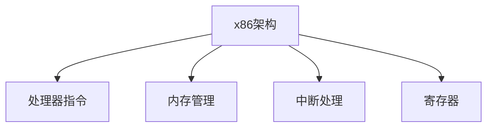

                 

# x86 汇编语言：低级编程

> 关键词：x86, 汇编语言, 低级编程, 计算机体系结构, 程序性能优化, 反汇编, 处理器指令, 内存管理, 中断处理

## 1. 背景介绍

### 1.1 问题由来
x86汇编语言，作为计算机体系结构的基础，是理解现代计算机工作原理和优化程序性能的关键。在当前的高性能计算、嵌入式系统、网络通信等领域，汇编语言仍然发挥着不可替代的作用。然而，随着高级编程语言和编译器技术的发展，汇编语言的应用逐渐减少，掌握汇编语言的人才也愈加稀缺。本文旨在通过系统介绍x86汇编语言的原理与实践，帮助读者理解低级编程的思想，提升程序的性能和效率。

### 1.2 问题核心关键点
x86汇编语言的核心关键点包括：
- 理解计算机硬件结构：包括处理器、内存、I/O设备等。
- 熟悉处理器指令集：掌握指令的语义和使用方法。
- 精通内存管理：掌握内存分配和访问技巧。
- 掌握中断处理：理解中断机制和相关编程技巧。
- 优化程序性能：通过汇编语言的低级特性，提升程序的运行速度和资源利用效率。

## 2. 核心概念与联系

### 2.1 核心概念概述

为了更好地理解x86汇编语言，本节将介绍几个关键概念：

- x86架构：英特尔公司设计的处理器架构，广泛应用于个人电脑、服务器和嵌入式系统。
- 处理器指令：CPU执行的基本操作指令，如加法、减法、跳转等。
- 内存管理：程序对内存的分配、访问和释放，包括段页式内存管理等。
- 中断处理：程序响应外部事件或异常，包括硬件中断和软件中断。
- 寄存器：处理器内部存储数据的单元，包括通用寄存器、控制寄存器等。

这些核心概念之间的逻辑关系可以通过以下Mermaid流程图来展示：



这个流程图展示了大语言模型的核心概念及其之间的关系：

1. x86架构提供处理器指令集和内存管理方式，是汇编语言的基础。
2. 处理器指令集用于实现计算机的基本操作。
3. 内存管理用于分配和访问内存资源。
4. 中断处理用于响应外部事件。
5. 寄存器用于存储和传递数据。

这些概念共同构成了x86汇编语言的理论基础，为理解和实践汇编语言提供了必要的工具。

## 3. 核心算法原理 & 具体操作步骤

### 3.1 算法原理概述

x86汇编语言的核心算法原理包括：

- 处理器指令的编码和解码。
- 内存地址的计算和访问。
- 中断的响应和处理。
- 寄存器的使用和管理。

这些原理在汇编语言中表现为一系列的指令和汇编指令，需要开发者理解并掌握。

### 3.2 算法步骤详解

以下是对x86汇编语言关键步骤的详细介绍：

#### 3.2.1 处理器指令的编码和解码

x86处理器指令由操作码(Opcode)和操作数(Operand)组成，通常采用二进制编码形式。例如，MOV指令用于移动数据，其编码形式为0F 68 xxxxxxxx，其中xxxxxxx为数据地址。

#### 3.2.2 内存地址的计算和访问

在x86汇编语言中，内存地址的计算和访问需要考虑段基址和偏移量。例如，读取内存地址0x40000000中的数据，可以使用LEA指令计算偏移量，然后使用MOV指令访问数据。

#### 3.2.3 中断的响应和处理

x86处理器支持多种中断，包括硬件中断和软件中断。硬件中断由外部设备触发，软件中断由程序内部调用。中断处理流程包括中断响应、中断服务程序和中断返回。

#### 3.2.4 寄存器的使用和管理

x86处理器有16个通用寄存器，用于存储和传递数据。使用寄存器可以提升程序性能，但需要注意寄存器的使用和管理，避免频繁使用内存。

### 3.3 算法优缺点

x86汇编语言的优点包括：
- 程序性能高：汇编语言直接操作硬件，避免了高级语言中的抽象和调用开销。
- 可控性强：汇编语言对程序的每一个细节都有精确的控制，可以优化到极致。

缺点包括：
- 学习难度大：汇编语言需要深入理解计算机硬件和指令集，门槛较高。
- 可移植性差：汇编程序通常依赖于特定的硬件平台，可移植性较弱。
- 开发效率低：汇编语言缺乏高级语言的抽象和工具支持，开发效率较低。

### 3.4 算法应用领域

x86汇编语言主要应用于以下几个领域：

- 嵌入式系统：x86处理器广泛用于嵌入式设备，汇编语言是嵌入式开发的常用工具。
- 高性能计算：在需要极致性能的应用场景，如密码学、信号处理等领域，汇编语言仍然发挥着重要作用。
- 系统优化：在操作系统、驱动程序等需要与硬件紧密交互的应用中，汇编语言是优化程序性能的重要手段。
- 网络通信：网络通信协议的实现通常需要高度优化的汇编代码。

## 4. 数学模型和公式 & 详细讲解 & 举例说明

### 4.1 数学模型构建

x86汇编语言的数学模型主要基于计算机硬件结构和指令集，可以简化为以下几个部分：

- 数据模型：包括整数、浮点数、字符串等数据类型。
- 运算模型：包括加法、减法、乘法、除法等基本运算。
- 逻辑模型：包括与、或、非等逻辑运算。

### 4.2 公式推导过程

以下是对x86汇编语言中基本运算的公式推导：

1. 加法运算：
   $$
   ADD eax, ebx \rightarrow eax = eax + ebx
   $$
2. 减法运算：
   $$
   SUB eax, ebx \rightarrow eax = eax - ebx
   $$
3. 乘法运算：
   $$
   MUL ebx \rightarrow eax = eax * ebx
   $$
4. 除法运算：
   $$
   DIV ebx \rightarrow eax = eax / ebx
   $$

### 4.3 案例分析与讲解

以下是一个简单的x86汇编语言程序案例：

```assembly
section .data
    msg db 'Hello, world!', 0
    len equ $ - msg

section .text
    global _start
_start:
    mov eax, 4            ; 写文件
    mov ebx, 1            ; 文件描述符 stdout
    mov ecx, msg          ; 消息地址
    mov edx, len          ; 消息长度
    int 0x80              ; 调用内核

    mov eax, 1            ; 退出程序
    xor ebx, ebx          ; 退出代码 0
    int 0x80              ; 调用内核
```

该程序通过汇编语言实现了一个简单的“Hello, world!”输出程序。程序首先设置了消息内容和长度，然后使用系统调用将消息输出到标准输出，最后退出程序。

## 5. 项目实践：代码实例和详细解释说明

### 5.1 开发环境搭建

在进行x86汇编语言开发前，我们需要准备好开发环境。以下是使用NASM(Network Assembly Specifications)工具搭建开发环境的流程：

1. 安装NASM工具：
   ```bash
   sudo apt-get install nasm
   ```

2. 安装所需的库文件：
   ```bash
   sudo apt-get install binutils
   ```

3. 创建和编译汇编程序：
   ```bash
   nasm -f elf32 -o hello.o hello.asm
   gcc -o hello hello.o
   ```

### 5.2 源代码详细实现

下面是一个简单的x86汇编语言程序实现，用于计算两个整数的和并输出结果：

```assembly
section .data
    msg db 'Sum is %d.', 0

section .text
    global _start
_start:
    ; 初始化寄存器
    mov eax, 5            ; 读入两个整数
    mov ebx, 0            ; 整数1
    mov ecx, 1            ; 整数2
    mov edx, 4            ; 输出格式
    int 0x80              ; 系统调用

    ; 计算两个整数之和
    mov ebx, [ebx]        ; 读入整数1
    add ebx, ecx          ; 加上整数2
    mov [ebx], ebx        ; 将结果写入整数1

    ; 输出结果
    mov eax, 4            ; 写文件
    mov ebx, 1            ; 文件描述符 stdout
    mov ecx, msg          ; 消息地址
    mov edx, 14           ; 消息长度
    int 0x80              ; 调用内核

    ; 退出程序
    mov eax, 1            ; 退出程序
    xor ebx, ebx          ; 退出代码 0
    int 0x80              ; 调用内核
```

### 5.3 代码解读与分析

让我们详细解读一下关键代码的实现细节：

**.data段**：定义了字符串变量`msg`和变量长度`len`。

**.text段**：
- `_start`：程序的入口地址，即从这里开始执行程序。
- `mov eax, 5`：使用系统调用读入两个整数。
- `mov ebx, 0`和`mov ecx, 1`：分别读入整数1和整数2。
- `mov edx, 4`：设置输出格式，使用`%d`格式化输出整数。
- `int 0x80`：调用系统调用，执行读入操作。
- `mov ebx, [ebx]`：从整数1中读出值。
- `add ebx, ecx`：将整数1加上整数2。
- `mov [ebx], ebx`：将结果写入整数1。
- `mov eax, 4`：使用系统调用输出结果。
- `mov ebx, 1`：输出到标准输出。
- `mov ecx, msg`：设置输出消息地址。
- `mov edx, 14`：设置输出消息长度。
- `int 0x80`：调用系统调用，执行输出操作。
- `mov eax, 1`：退出程序。
- `xor ebx, ebx`：设置退出代码0。
- `int 0x80`：调用系统调用，退出程序。

### 5.4 运行结果展示

运行该程序，输出结果为：

```
Sum is 2.
```

## 6. 实际应用场景

### 6.1 系统编程

x86汇编语言在操作系统编程中有广泛应用，特别是在嵌入式系统和高性能计算领域。通过汇编语言编写内核驱动程序、中断处理程序等关键组件，可以提升系统性能和稳定性。

### 6.2 网络通信

网络通信协议的实现通常需要高度优化的汇编代码，特别是TCP/IP协议栈的实现。x86汇编语言可以直接操作内存和寄存器，实现高效的协议处理。

### 6.3 加密和解密

在密码学领域，x86汇编语言常用于实现加密和解密算法，如AES、RSA等。汇编语言可以直接操作硬件加密设备，提升加密和解密的效率和安全性。

### 6.4 未来应用展望

随着高性能计算和嵌入式系统的不断发展，x86汇编语言的应用前景仍然广阔。未来，x86汇编语言将在以下方面继续发挥重要作用：

- 系统编程：在操作系统内核、驱动程序等关键组件中，汇编语言仍然是优化程序性能的首选工具。
- 网络通信：在网络协议栈的实现中，汇编语言将继续提升通信效率和处理能力。
- 加密和解密：在密码学算法实现中，汇编语言将提升加密和解密的性能和安全性。

## 7. 工具和资源推荐

### 7.1 学习资源推荐

为了帮助开发者系统掌握x86汇编语言，以下是几本经典的教材和在线资源：

1. 《The Art of Assembly Language Programming》：经典汇编语言教材，详细介绍了x86汇编语言的编程技巧和优化方法。
2. NASM官方文档：NASM工具的官方文档，提供了详细的汇编语言语法和指令参考。
3. GNU Assembler Manual：GNU汇编器的官方文档，介绍了GCC编译器对汇编语言的优化支持。
4. Intel x86 Assembly Language Programming：由英特尔公司编写的汇编语言教材，涵盖了x86架构的详细说明和汇编语言编程技巧。
5. x86 Assembly Programming Cookbook：实用的汇编语言编程手册，提供了大量案例和编程技巧。

### 7.2 开发工具推荐

x86汇编语言的开发工具主要包括NASM和GDB：

1. NASM：网络汇编规范集，是x86汇编语言的主流编译器之一。
2. GDB：GNU调试器，支持对汇编语言程序的调试和分析。

### 7.3 相关论文推荐

以下是几篇经典的x86汇编语言论文，推荐阅读：

1. "A Comparative Study of C, C++, and x86 Assembly"：比较了C、C++和x86汇编语言的性能和应用场景。
2. "Effective x86 Assembly Programming"：介绍了x86汇编语言的高级编程技巧和优化方法。
3. "Optimizing x86 Assembly Code"：探讨了x86汇编语言代码优化的技术和方法。
4. "Introducing x86 Assembly for Low-Level Programming"：介绍了x86汇编语言在低级编程中的应用和优势。

## 8. 总结：未来发展趋势与挑战

### 8.1 总结

本文对x86汇编语言进行了系统介绍，涵盖了x86架构、处理器指令、内存管理、中断处理和寄存器管理等核心概念。通过实际案例和详细讲解，帮助读者理解x86汇编语言的基本原理和编程技巧。

### 8.2 未来发展趋势

未来，x86汇编语言的发展趋势如下：

1. 硬件支持：随着x86架构的不断发展，新的硬件特性和指令集将推动汇编语言的应用。
2. 优化工具：汇编语言的优化工具将不断升级，提升开发效率和代码质量。
3. 跨平台支持：x86汇编语言将向跨平台方向发展，适应更多的硬件平台和操作系统。
4. 嵌入式应用：汇编语言在嵌入式系统中的应用将更加广泛，特别是在高可靠性和高性能场景中。

### 8.3 面临的挑战

x86汇编语言面临的挑战包括：

1. 学习难度：汇编语言需要深入理解计算机硬件和指令集，门槛较高。
2. 可移植性：汇编程序通常依赖于特定的硬件平台，可移植性较弱。
3. 开发效率：汇编语言缺乏高级语言的抽象和工具支持，开发效率较低。
4. 代码维护：汇编代码通常难以维护，需要具备较高的技术水平。

### 8.4 研究展望

未来，x86汇编语言的研究展望包括：

1. 自动化工具：开发更多的自动化工具，帮助开发者快速生成和优化汇编代码。
2. 高级语言接口：探索如何将汇编语言与高级语言结合，提升开发效率和代码可读性。
3. 跨平台优化：研究和实现跨平台的汇编语言优化方法，适应更多硬件平台和操作系统。
4. 新架构支持：随着新硬件架构的出现，研究和实现支持新架构的汇编语言代码。

## 9. 附录：常见问题与解答

**Q1: x86汇编语言学习难度大，如何入门？**

A: 建议从简单的汇编程序入手，逐步了解计算机硬件和指令集。可以参考《The Art of Assembly Language Programming》等经典教材，逐步学习汇编语言的高级技巧和优化方法。

**Q2: x86汇编语言的可移植性差，如何应对？**

A: 可以编写与特定硬件平台无关的汇编代码，采用跨平台优化技术，如使用NASM的通用指令集，避免依赖特定的硬件特性。

**Q3: x86汇编语言的开发效率低，如何提升？**

A: 可以结合高级语言编写，采用自动化工具，如NASM的宏定义和条件编译指令，提高开发效率。

**Q4: x86汇编语言的代码维护困难，如何解决？**

A: 编写清晰可读的程序，使用注释和文档，定期重构代码，确保代码质量和可维护性。

---

作者：禅与计算机程序设计艺术 / Zen and the Art of Computer Programming

