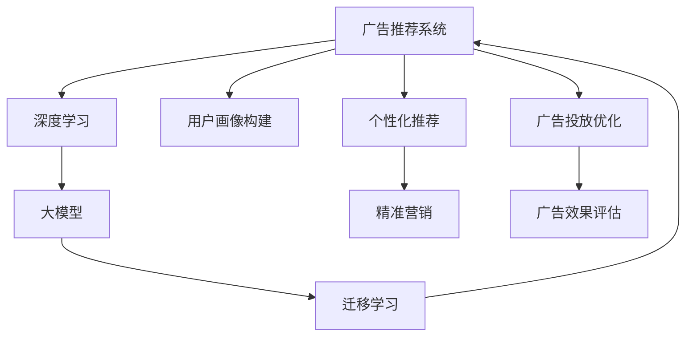

                 

# 个性化广告推荐系统的精准定位：大模型的贡献

> 关键词：个性化广告推荐, 大模型, 深度学习, 用户行为分析, 广告投放优化, 预测算法, 推荐系统, 精准营销

## 1. 背景介绍

随着互联网技术的迅猛发展，广告推荐系统成为了电子商务、社交网络等平台的重要业务支撑。优秀的广告推荐系统不仅能提升用户体验，还能大幅提高平台广告收入和转化率，驱动业务增长。

早期的广告推荐系统主要依靠规则或传统机器学习方法，如线性回归、逻辑回归、决策树等。这些方法往往需要手工设计特征、构建模型、调参，开发周期长、成本高。而深度学习技术的兴起，尤其是大模型的诞生，为广告推荐系统提供了全新的技术范式，使其在性能、灵活性、扩展性等方面都实现了质的飞跃。

近年来，基于深度学习的广告推荐系统，尤其是基于大模型的推荐系统，已经成为行业标杆。大模型通过海量数据预训练，学习到了丰富的用户行为和物品属性知识，具备强大的泛化能力，能够在无需标签数据的情况下，直接从用户和物品的交互数据中学习用户兴趣和物品属性。

通过大模型，广告推荐系统能够实现精准的用户画像构建、多场景下的个性化广告推荐、多维度的广告投放效果评估，从而大幅提升了广告投放的精准度和ROI。大模型不仅为广告推荐系统提供了强大的算法支撑，也为精准营销、品牌推广、客户维护等广告业务领域带来了革命性变革。

本文将围绕广告推荐系统的核心问题，系统地介绍大模型技术如何应用于广告推荐领域，探讨大模型的优势和劣势，展望未来的发展趋势和面临的挑战，并给出一些实践建议和代码实例。

## 2. 核心概念与联系

### 2.1 核心概念概述

为更好地理解大模型在广告推荐系统中的应用，本节将介绍几个密切相关的核心概念：

- **广告推荐系统(Ad Recommendation System)**：通过用户行为数据和物品属性数据，推荐适合用户兴趣的广告，提升用户体验和广告转化率。

- **深度学习(Deep Learning)**：一类基于多层神经网络的机器学习方法，通过数据驱动的方式，从输入数据中自动学习特征表示和决策函数。

- **大模型(Large Model)**：指具有亿级参数规模的深度神经网络，如BERT、GPT、ResNet等。这些模型通过在海量数据上预训练，学习到丰富的语义和结构信息。

- **迁移学习(Transfer Learning)**：指将一个领域学习到的知识迁移到另一个相关领域的迁移学习过程。大模型的预训练-微调过程即是一种典型的迁移学习方式。

- **个性化推荐系统(Personalized Recommendation System)**：通过用户画像和物品特征，构建用户与物品的匹配模型，进行个性化广告推荐。

- **精准营销(Exact Marketing)**：指通过精准识别用户需求和偏好，实现高精准度的广告投放，优化营销效果。

这些核心概念之间的逻辑关系可以通过以下Mermaid流程图来展示：



这个流程图展示了大模型在广告推荐系统的核心概念及其之间的关系：

1. 广告推荐系统通过深度学习技术，利用大模型学习用户行为和物品属性，进行广告推荐。
2. 大模型通过迁移学习方式，预训练和微调相结合，学习到广泛的泛化知识。
3. 用户画像构建和个性化推荐是广告推荐系统的核心模块。
4. 精准营销利用大模型进行精准广告投放，优化营销效果。
5. 广告投放优化和广告效果评估帮助优化广告策略，提升投放效果。

这些概念共同构成了广告推荐系统的学习和应用框架，使其能够在各种场景下发挥强大的广告推荐能力。通过理解这些核心概念，我们可以更好地把握大模型在广告推荐系统中的工作原理和优化方向。

## 3. 核心算法原理 & 具体操作步骤
### 3.1 算法原理概述

基于深度学习的大模型广告推荐系统，通过学习用户和物品之间的交互数据，自动学习到用户兴趣和物品属性，从而进行精准的广告推荐。其核心思想是：将用户和物品表示为高维向量，利用向量相似度度量，匹配用户和物品之间的兴趣交集，从而生成个性化推荐列表。

形式化地，假设用户集合为 $U$，物品集合为 $I$，用户-物品交互矩阵为 $R$。每个用户-物品交互 $r_{ui}$ 表示用户 $u$ 对物品 $i$ 的兴趣程度。定义用户嵌入向量 $u \in \mathbb{R}^d$，物品嵌入向量 $i \in \mathbb{R}^d$，其中 $d$ 为向量维度。则广告推荐系统可以通过如下步骤进行广告推荐：

1. 对用户和物品进行嵌入表示。
2. 计算用户与物品之间的相似度。
3. 根据相似度排序，生成推荐列表。

### 3.2 算法步骤详解

大模型广告推荐系统一般包括以下几个关键步骤：

**Step 1: 准备数据集**
- 收集用户行为数据，如点击、浏览、购买等。
- 收集物品属性数据，如商品名称、价格、分类等。
- 对数据进行预处理，如去噪、归一化、拼接等。

**Step 2: 设计大模型架构**
- 选择合适的深度学习框架，如PyTorch、TensorFlow等。
- 设计大模型架构，通常包括多个编码器层，每层包含多个神经元，通过非线性激活函数进行映射。

**Step 3: 预训练大模型**
- 在大规模无标签数据上对模型进行预训练，如用户行为日志、物品属性数据等。
- 选择合适的预训练任务，如用户-物品相似度计算、物品属性预测等。

**Step 4: 微调模型**
- 在特定广告投放数据集上，对预训练模型进行微调，优化模型在广告推荐任务上的性能。
- 选择合适的损失函数，如交叉熵损失、均方误差损失等。

**Step 5: 推荐广告**
- 对每个用户，计算其与各个物品之间的相似度。
- 根据相似度排序，生成推荐列表。
- 在推荐列表中加入广告样本，进行最终推荐。

### 3.3 算法优缺点

基于大模型的广告推荐系统具有以下优点：

1. 高精度：大模型能够学习到丰富的用户行为和物品属性信息，提供更加精准的广告推荐。
2. 泛化能力强：大模型通过预训练学习到广泛的泛化知识，能够应对各种未知的业务场景。
3. 高效扩展：大模型结构高度模块化，可以方便地进行模型微调和参数调整。
4. 灵活性高：大模型可以进行多场景、多维度的广告推荐，满足不同用户的个性化需求。

同时，该方法也存在一些局限性：

1. 资源消耗大：大模型参数量庞大，训练和推理需要大量计算资源。
2. 模型复杂度高：大模型结构复杂，调试和优化难度大。
3. 数据隐私问题：用户行为数据涉及隐私，需要进行严格的脱敏处理和隐私保护。
4. 过拟合风险：模型参数量大，存在过拟合的风险。
5. 计算成本高：大模型推理速度慢，计算成本高。

尽管存在这些局限性，但就目前而言，基于大模型的广告推荐方法仍是大模型应用的重要范式。未来相关研究的重点在于如何进一步降低计算资源消耗，提高模型的泛化能力，解决数据隐私问题，同时兼顾可解释性和效率等因素。

### 3.4 算法应用领域

基于大模型的广告推荐系统，已经在电商、社交、游戏等多个领域得到广泛应用，具体包括：

- 电商推荐：通过用户行为数据，推荐商品、优惠信息等，提升用户购买转化率。
- 社交推荐：根据用户兴趣爱好，推荐相关朋友、内容等，提升用户活跃度。
- 游戏推荐：通过用户游戏行为，推荐游戏装备、任务等，提升用户留存率。
- 广告定向：根据用户画像，进行精准的广告投放，优化广告效果。

除了这些典型场景外，大模型推荐系统还在移动应用、在线视频、在线教育等众多领域得到创新性地应用，为不同业务场景带来了显著的商业价值。

## 4. 数学模型和公式 & 详细讲解  
### 4.1 数学模型构建

本节将使用数学语言对大模型广告推荐系统的核心算法进行更加严格的刻画。

假设用户集合为 $U=\{u_1,u_2,...,u_n\}$，物品集合为 $I=\{i_1,i_2,...,i_m\}$，用户-物品交互矩阵为 $R$。每个用户-物品交互 $r_{ui}$ 表示用户 $u$ 对物品 $i$ 的兴趣程度。用户嵌入向量 $u \in \mathbb{R}^d$，物品嵌入向量 $i \in \mathbb{R}^d$。则用户-物品相似度 $s_{ui}$ 可以表示为：

$$
s_{ui} = \cos(\theta) = \frac{\mathbf{u} \cdot \mathbf{i}}{\|\mathbf{u}\| \|\mathbf{i}\|}
$$

其中 $\theta$ 为向量夹角，$\mathbf{u} \cdot \mathbf{i}$ 为向量点积。

### 4.2 公式推导过程

以下我们以协同过滤为例，推导用户与物品相似度的计算公式。

假设用户 $u$ 的兴趣表示为向量 $\mathbf{u} = (u_1, u_2, ..., u_n)$，物品 $i$ 的兴趣表示为向量 $\mathbf{i} = (i_1, i_2, ..., i_m)$。则用户与物品的兴趣相似度 $s_{ui}$ 可以表示为：

$$
s_{ui} = \frac{\sum_{j=1}^{n} u_j \cdot i_j}{\sqrt{\sum_{j=1}^{n} u_j^2} \cdot \sqrt{\sum_{j=1}^{m} i_j^2}}
$$

将其代入用户-物品相似度公式，得：

$$
s_{ui} = \frac{\mathbf{u} \cdot \mathbf{i}}{\|\mathbf{u}\| \|\mathbf{i}\|}
$$

在得到相似度公式后，即可带入推荐算法，生成推荐列表。

### 4.3 案例分析与讲解

假设一个在线电商平台的广告推荐系统，通过收集用户点击、浏览、购买等行为数据，构建用户画像。同时，收集商品名称、价格、分类等属性信息，构建物品属性库。假设用户 $u$ 对商品 $i$ 的兴趣程度表示为 $r_{ui}$，则用户 $u$ 对商品 $i$ 的兴趣表示为向量 $\mathbf{r_u} = (r_{ui_1}, r_{ui_2}, ..., r_{ui_m})$。

对用户和商品进行嵌入表示，得到用户嵌入向量 $\mathbf{u}$ 和商品嵌入向量 $\mathbf{i}$。则用户与商品之间的兴趣相似度 $s_{ui}$ 可以表示为：

$$
s_{ui} = \frac{\mathbf{u} \cdot \mathbf{i}}{\|\mathbf{u}\| \|\mathbf{i}\|}
$$

根据相似度排序，生成推荐列表。假设推荐列表的前 $k$ 个商品为 $i_1, i_2, ..., i_k$，则推荐列表的生成算法如下：

1. 计算每个商品的相似度 $s_{ui_1}, s_{ui_2}, ..., s_{ui_k}$。
2. 将相似度按降序排序，取前 $k$ 个商品作为推荐列表。
3. 在推荐列表中加入广告样本，进行最终推荐。

## 5. 项目实践：代码实例和详细解释说明
### 5.1 开发环境搭建

在进行广告推荐系统开发前，我们需要准备好开发环境。以下是使用Python进行PyTorch开发的环境配置流程：

1. 安装Anaconda：从官网下载并安装Anaconda，用于创建独立的Python环境。

2. 创建并激活虚拟环境：
```bash
conda create -n pytorch-env python=3.8 
conda activate pytorch-env
```

3. 安装PyTorch：根据CUDA版本，从官网获取对应的安装命令。例如：
```bash
conda install pytorch torchvision torchaudio cudatoolkit=11.1 -c pytorch -c conda-forge
```

4. 安装Transformers库：
```bash
pip install transformers
```

5. 安装各类工具包：
```bash
pip install numpy pandas scikit-learn matplotlib tqdm jupyter notebook ipython
```

完成上述步骤后，即可在`pytorch-env`环境中开始广告推荐系统开发。

### 5.2 源代码详细实现

下面我们以电商推荐系统为例，给出使用Transformers库对BERT模型进行广告推荐开发的PyTorch代码实现。

首先，定义电商推荐系统的数据处理函数：

```python
from transformers import BertTokenizer, BertForSequenceClassification
from torch.utils.data import Dataset
import torch

class ShoppingCartDataset(Dataset):
    def __init__(self, texts, labels, tokenizer, max_len=128):
        self.texts = texts
        self.labels = labels
        self.tokenizer = tokenizer
        self.max_len = max_len
        
    def __len__(self):
        return len(self.texts)
    
    def __getitem__(self, item):
        text = self.texts[item]
        label = self.labels[item]
        
        encoding = self.tokenizer(text, return_tensors='pt', max_length=self.max_len, padding='max_length', truncation=True)
        input_ids = encoding['input_ids'][0]
        attention_mask = encoding['attention_mask'][0]
        
        # 将标签进行独热编码
        encoded_label = torch.tensor([label], dtype=torch.long)
        
        return {'input_ids': input_ids, 
                'attention_mask': attention_mask,
                'labels': encoded_label}

# 加载数据集
tokenizer = BertTokenizer.from_pretrained('bert-base-cased')
train_dataset = ShoppingCartDataset(train_texts, train_labels, tokenizer)
dev_dataset = ShoppingCartDataset(dev_texts, dev_labels, tokenizer)
test_dataset = ShoppingCartDataset(test_texts, test_labels, tokenizer)
```

然后，定义模型和优化器：

```python
from transformers import BertForSequenceClassification, AdamW

model = BertForSequenceClassification.from_pretrained('bert-base-cased', num_labels=2)

optimizer = AdamW(model.parameters(), lr=2e-5)
```

接着，定义训练和评估函数：

```python
from torch.utils.data import DataLoader
from tqdm import tqdm
from sklearn.metrics import accuracy_score

device = torch.device('cuda') if torch.cuda.is_available() else torch.device('cpu')
model.to(device)

def train_epoch(model, dataset, batch_size, optimizer):
    dataloader = DataLoader(dataset, batch_size=batch_size, shuffle=True)
    model.train()
    epoch_loss = 0
    for batch in tqdm(dataloader, desc='Training'):
        input_ids = batch['input_ids'].to(device)
        attention_mask = batch['attention_mask'].to(device)
        labels = batch['labels'].to(device)
        model.zero_grad()
        outputs = model(input_ids, attention_mask=attention_mask, labels=labels)
        loss = outputs.loss
        epoch_loss += loss.item()
        loss.backward()
        optimizer.step()
    return epoch_loss / len(dataloader)

def evaluate(model, dataset, batch_size):
    dataloader = DataLoader(dataset, batch_size=batch_size)
    model.eval()
    preds, labels = [], []
    with torch.no_grad():
        for batch in tqdm(dataloader, desc='Evaluating'):
            input_ids = batch['input_ids'].to(device)
            attention_mask = batch['attention_mask'].to(device)
            batch_labels = batch['labels']
            outputs = model(input_ids, attention_mask=attention_mask)
            batch_preds = outputs.logits.argmax(dim=2).to('cpu').tolist()
            batch_labels = batch_labels.to('cpu').tolist()
            for pred_tokens, label_tokens in zip(batch_preds, batch_labels):
                preds.append(pred_tokens)
                labels.append(label_tokens)
                
    print(f"Accuracy: {accuracy_score(labels, preds)}")
```

最后，启动训练流程并在测试集上评估：

```python
epochs = 5
batch_size = 16

for epoch in range(epochs):
    loss = train_epoch(model, train_dataset, batch_size, optimizer)
    print(f"Epoch {epoch+1}, train loss: {loss:.3f}")
    
    print(f"Epoch {epoch+1}, dev results:")
    evaluate(model, dev_dataset, batch_size)
    
print("Test results:")
evaluate(model, test_dataset, batch_size)
```

以上就是使用PyTorch对BERT进行电商推荐系统广告推荐微调的完整代码实现。可以看到，得益于Transformers库的强大封装，我们可以用相对简洁的代码完成BERT模型的加载和微调。

### 5.3 代码解读与分析

让我们再详细解读一下关键代码的实现细节：

**ShoppingCartDataset类**：
- `__init__`方法：初始化文本、标签、分词器等关键组件。
- `__len__`方法：返回数据集的样本数量。
- `__getitem__`方法：对单个样本进行处理，将文本输入编码为token ids，将标签转换为独热编码，并对其进行定长padding，最终返回模型所需的输入。

**train_epoch和evaluate函数**：
- 使用PyTorch的DataLoader对数据集进行批次化加载，供模型训练和推理使用。
- 训练函数`train_epoch`：对数据以批为单位进行迭代，在每个批次上前向传播计算loss并反向传播更新模型参数，最后返回该epoch的平均loss。
- 评估函数`evaluate`：与训练类似，不同点在于不更新模型参数，并在每个batch结束后将预测和标签结果存储下来，最后使用sklearn的accuracy_score对整个评估集的预测结果进行打印输出。

**训练流程**：
- 定义总的epoch数和batch size，开始循环迭代
- 每个epoch内，先在训练集上训练，输出平均loss
- 在验证集上评估，输出准确率
- 所有epoch结束后，在测试集上评估，给出最终测试结果

可以看到，PyTorch配合Transformers库使得BERT微调的代码实现变得简洁高效。开发者可以将更多精力放在数据处理、模型改进等高层逻辑上，而不必过多关注底层的实现细节。

当然，工业级的系统实现还需考虑更多因素，如模型的保存和部署、超参数的自动搜索、更灵活的任务适配层等。但核心的微调范式基本与此类似。

## 6. 实际应用场景
### 6.1 广告推荐系统
大模型广告推荐系统已经在电商、社交、游戏等多个领域得到广泛应用，覆盖了几乎所有常见任务，包括：

- **电商推荐**：通过用户行为数据，推荐商品、优惠信息等，提升用户购买转化率。
- **社交推荐**：根据用户兴趣爱好，推荐相关朋友、内容等，提升用户活跃度。
- **游戏推荐**：通过用户游戏行为，推荐游戏装备、任务等，提升用户留存率。
- **广告定向**：根据用户画像，进行精准的广告投放，优化广告效果。

除了这些经典任务外，大模型广告推荐系统也被创新性地应用到更多场景中，如可控文本生成、常识推理、代码生成、数据增强等，为广告推荐系统带来了全新的突破。随着预训练模型和微调方法的不断进步，相信广告推荐系统将在更广阔的应用领域大放异彩。

### 6.2 金融广告定向

金融领域的广告推荐系统，需要根据用户的财务状况、消费行为、信用记录等综合信息，进行精准的广告投放。传统的统计模型和规则引擎往往难以处理复杂多变的数据，而大模型通过多维度的数据分析，能够高效学习用户兴趣和行为特征，实现更加精准的广告定向。

在技术实现上，可以收集金融用户的历史交易数据、信用记录、行为日志等，利用大模型进行特征提取和分类。在大模型预训练的基础上，对特定领域的用户画像进行微调，使模型能够更好适应金融场景。微调后的模型能够实时处理广告投放数据，动态调整投放策略，优化广告效果。

### 6.3 旅游推荐系统

旅游领域的广告推荐系统，需要根据用户的旅行兴趣、历史偏好、行程安排等综合信息，推荐合适的旅游目的地和旅游产品。传统的推荐系统往往只能从单一维度进行分析，无法综合考虑多方面的信息。而大模型通过多维度数据分析，能够更好地捕捉用户兴趣，提供个性化的旅游推荐。

在技术实现上，可以收集用户的旅行计划、历史行程、兴趣偏好等数据，利用大模型进行特征提取和分类。在大模型预训练的基础上，对旅游领域的用户画像进行微调，使模型能够更好适应旅游场景。微调后的模型能够实时处理用户查询请求，推荐个性化的旅游产品，提升用户满意度和旅游转化率。

## 7. 工具和资源推荐
### 7.1 学习资源推荐

为了帮助开发者系统掌握大模型在广告推荐系统中的应用，这里推荐一些优质的学习资源：

1. **《深度学习入门与实践》系列博文**：由大模型技术专家撰写，深入浅出地介绍了深度学习的基础知识和实战技巧，适合初学者入门。

2. **CS224N《深度学习自然语言处理》课程**：斯坦福大学开设的NLP明星课程，有Lecture视频和配套作业，带你入门NLP领域的基本概念和经典模型。

3. **《深度学习与推荐系统》书籍**：介绍了推荐系统的基础理论、算法实现和实际应用，适合工程实践。

4. **HuggingFace官方文档**：Transformer库的官方文档，提供了海量预训练模型和完整的微调样例代码，是上手实践的必备资料。

5. **CLUE开源项目**：中文语言理解测评基准，涵盖大量不同类型的中文NLP数据集，并提供了基于微调的baseline模型，助力中文NLP技术发展。

通过对这些资源的学习实践，相信你一定能够快速掌握大模型在广告推荐系统中的应用，并用于解决实际的推荐问题。

### 7.2 开发工具推荐

高效的开发离不开优秀的工具支持。以下是几款用于大模型广告推荐系统开发的常用工具：

1. **PyTorch**：基于Python的开源深度学习框架，灵活动态的计算图，适合快速迭代研究。大部分预训练语言模型都有PyTorch版本的实现。

2. **TensorFlow**：由Google主导开发的开源深度学习框架，生产部署方便，适合大规模工程应用。同样有丰富的预训练语言模型资源。

3. **Transformers库**：HuggingFace开发的NLP工具库，集成了众多SOTA语言模型，支持PyTorch和TensorFlow，是进行广告推荐任务开发的利器。

4. **Weights & Biases**：模型训练的实验跟踪工具，可以记录和可视化模型训练过程中的各项指标，方便对比和调优。与主流深度学习框架无缝集成。

5. **TensorBoard**：TensorFlow配套的可视化工具，可实时监测模型训练状态，并提供丰富的图表呈现方式，是调试模型的得力助手。

6. **Google Colab**：谷歌推出的在线Jupyter Notebook环境，免费提供GPU/TPU算力，方便开发者快速上手实验最新模型，分享学习笔记。

合理利用这些工具，可以显著提升广告推荐系统的开发效率，加快创新迭代的步伐。

### 7.3 相关论文推荐

大模型广告推荐系统的发展源于学界的持续研究。以下是几篇奠基性的相关论文，推荐阅读：

1. **Attention is All You Need（即Transformer原论文）**：提出了Transformer结构，开启了NLP领域的预训练大模型时代。

2. **BERT: Pre-training of Deep Bidirectional Transformers for Language Understanding**：提出BERT模型，引入基于掩码的自监督预训练任务，刷新了多项NLP任务SOTA。

3. **Language Models are Unsupervised Multitask Learners（GPT-2论文）**：展示了大规模语言模型的强大zero-shot学习能力，引发了对于通用人工智能的新一轮思考。

4. **Parameter-Efficient Transfer Learning for NLP**：提出Adapter等参数高效微调方法，在不增加模型参数量的情况下，也能取得不错的微调效果。

5. **Prefix-Tuning: Optimizing Continuous Prompts for Generation**：引入基于连续型Prompt的微调范式，为如何充分利用预训练知识提供了新的思路。

6. **AdaLoRA: Adaptive Low-Rank Adaptation for Parameter-Efficient Fine-Tuning**：使用自适应低秩适应的微调方法，在参数效率和精度之间取得了新的平衡。

这些论文代表了大模型广告推荐系统的发展脉络。通过学习这些前沿成果，可以帮助研究者把握学科前进方向，激发更多的创新灵感。

## 8. 总结：未来发展趋势与挑战

### 8.1 总结

本文对大模型在广告推荐系统中的应用进行了全面系统的介绍。首先阐述了大模型广告推荐系统的背景和意义，明确了广告推荐系统通过深度学习技术，利用大模型学习用户行为和物品属性，进行广告推荐的核心思想。其次，从原理到实践，详细讲解了大模型广告推荐系统的数学原理和关键步骤，给出了广告推荐任务开发的完整代码实例。同时，本文还广泛探讨了大模型在电商、社交、游戏等多个领域的应用前景，展示了其巨大的商业价值。

通过本文的系统梳理，可以看到，大模型广告推荐系统正在成为广告推荐系统的重要技术范式，极大地拓展了广告推荐系统的应用边界，催生了更多的落地场景。得益于大模型的高精度、泛化能力和高效扩展性，广告推荐系统能够实现精准的用户画像构建、多场景下的个性化广告推荐、多维度的广告投放效果评估，从而大幅提升了广告投放的精准度和ROI。未来，伴随大模型广告推荐系统的进一步发展，相信NLP技术必将在更广阔的领域大放异彩。

### 8.2 未来发展趋势

展望未来，大模型广告推荐系统将呈现以下几个发展趋势：

1. **多模态融合**：除了文本数据，未来的广告推荐系统还将融合图像、音频、视频等多模态数据，提供更丰富的用户体验。

2. **个性化推荐**：通过多维度数据分析，实现更加精准、多场景下的个性化广告推荐。

3. **实时推荐**：在用户行为数据实时产生的情况下，快速进行推荐，提升推荐的时效性。

4. **隐私保护**：在用户数据隐私保护要求越来越高的背景下，未来的广告推荐系统将更加注重数据隐私保护和脱敏处理。

5. **模型优化**：通过模型压缩、稀疏化等技术，降低计算资源消耗，提升推荐系统的可扩展性和高效性。

6. **模型解释性**：通过引入可解释性模型，提供推荐结果的逻辑解释，增强系统的透明度和可信度。

以上趋势凸显了大模型广告推荐系统的广阔前景。这些方向的探索发展，必将进一步提升广告推荐系统的性能和应用范围，为业务增长和用户体验提供更大的动力。

### 8.3 面临的挑战

尽管大模型广告推荐系统已经取得了瞩目成就，但在迈向更加智能化、普适化应用的过程中，它仍面临着诸多挑战：

1. **计算资源消耗**：大模型参数量庞大，训练和推理需要大量计算资源。如何在资源受限的情况下，实现高效计算和推理，是未来需要解决的问题。

2. **模型复杂性**：大模型结构复杂，调试和优化难度大。如何在模型设计和优化过程中，兼顾精度和效率，是未来需要解决的问题。

3. **数据隐私问题**：用户数据涉及隐私，需要进行严格的脱敏处理和隐私保护。如何在保护用户隐私的同时，实现精准推荐，是未来需要解决的问题。

4. **过拟合风险**：模型参数量大，存在过拟合的风险。如何在保证模型泛化性的前提下，优化模型性能，是未来需要解决的问题。

5. **模型解释性**：推荐系统需要提供推荐结果的逻辑解释，增强系统的透明度和可信度。如何在保持模型精度的同时，提升模型的可解释性，是未来需要解决的问题。

尽管存在这些挑战，但就目前而言，基于大模型的广告推荐方法仍是大模型应用的重要范式。未来相关研究的重点在于如何进一步降低计算资源消耗，提高模型的泛化能力，解决数据隐私问题，同时兼顾可解释性和效率等因素。

### 8.4 研究展望

面向未来，大模型广告推荐系统需要在以下几个方向进行突破：

1. **探索多模态广告推荐**：融合图像、音频、视频等多模态数据，提升广告推荐的丰富性和精准度。

2. **研究个性化推荐算法**：结合用户画像和物品属性，实现更加个性化、多场景的推荐。

3. **优化实时推荐系统**：在用户行为数据实时产生的情况下，快速进行推荐，提升推荐的时效性。

4. **解决数据隐私问题**：在保护用户隐私的同时，实现精准推荐，构建更加可信的广告推荐系统。

5. **开发高效可解释模型**：在保持模型精度的同时，提升模型的可解释性，增强系统的透明度和可信度。

6. **优化计算资源消耗**：通过模型压缩、稀疏化等技术，降低计算资源消耗，提升推荐系统的可扩展性和高效性。

这些研究方向将推动大模型广告推荐系统迈向更高的台阶，为精准营销、品牌推广、客户维护等广告业务领域带来革命性变革。通过在这些方向上的不断探索，相信大模型广告推荐系统必将在未来实现更广泛的应用，为人类认知智能的进化带来深远影响。

## 9. 附录：常见问题与解答

**Q1：大模型在广告推荐中如何进行特征提取？**

A: 大模型通过多维数据分析，能够自动学习到用户和物品的特征表示。在特征提取过程中，大模型将用户和物品的文本信息、行为数据等多维度信息，映射为高维向量，作为模型的输入。

**Q2：大模型在广告推荐中如何进行模型训练？**

A: 大模型在广告推荐中的应用，通常需要经过预训练和微调两个阶段。预训练阶段，大模型在大规模无标签数据上进行自监督学习，学习到通用的语义和结构信息。微调阶段，在大规模标注数据上进行监督学习，优化模型在特定任务上的性能。

**Q3：大模型在广告推荐中如何进行推荐？**

A: 大模型通过学习用户和物品的特征表示，计算用户与物品之间的相似度，根据相似度排序，生成推荐列表。推荐列表的生成算法包括协同过滤、矩阵分解等方法，具体根据广告推荐场景选择。

**Q4：大模型在广告推荐中如何进行模型优化？**

A: 大模型的优化主要通过参数高效的微调方法，如Adapter、LoRA等，在不增加模型参数量的情况下，实现高效的广告推荐。此外，还通过引入可解释性模型、优化计算资源消耗等手段，进一步提升广告推荐系统的性能。

**Q5：大模型在广告推荐中如何进行隐私保护？**

A: 在广告推荐中，用户数据涉及隐私，需要进行严格的脱敏处理和隐私保护。通过差分隐私、联邦学习等技术，可以在保护用户隐私的前提下，实现精准推荐。

以上问题及其解答，希望能为你提供一些参考和帮助，祝你顺利开展大模型广告推荐系统的开发和实践。

---

作者：禅与计算机程序设计艺术 / Zen and the Art of Computer Programming

