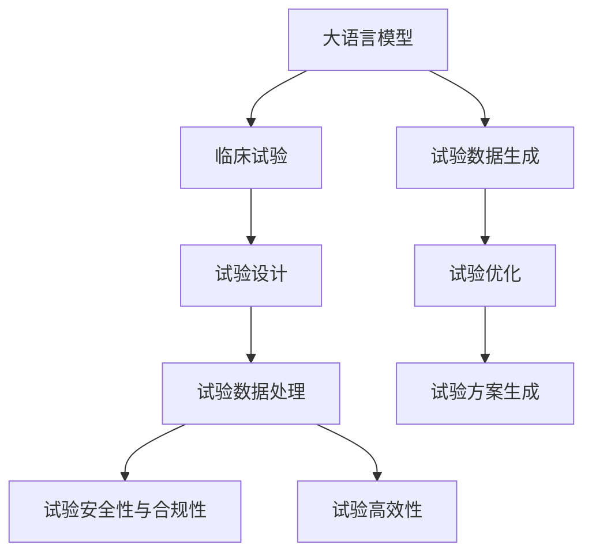

                 

# 临床试验优化：LLM 确保安全和高效

> 关键词：大语言模型,临床试验,试验设计,试验优化,试验数据,数据处理,安全性,合规性,高效性,自动生成,优化算法,统计分析

## 1. 背景介绍

### 1.1 问题由来
随着人工智能（AI）技术的不断发展，大语言模型（Large Language Models, LLMs）在各行各业的应用越来越广泛。在生物医药领域，特别是临床试验（Clinical Trials）中，LLM 的应用也越来越受到关注。临床试验是评估新药或治疗方法安全性和有效性的关键环节，但其设计和执行过程中存在许多挑战。例如，试验设计复杂、试验数据量大、数据分析繁琐、试验结果的解释与呈现等。

如何利用大语言模型优化临床试验，提高其效率和安全性，是当前医药行业面临的重要问题。本文将详细探讨LLM在临床试验中的应用，通过具体案例分析，提出基于LLM的临床试验优化策略，并结合实际应用场景，讨论其优势与挑战。

### 1.2 问题核心关键点
- 大语言模型（LLM）在临床试验中的应用
- 试验设计优化
- 试验数据处理与分析
- 试验安全性与合规性
- 试验高效性提升

## 2. 核心概念与联系

### 2.1 核心概念概述

为了更好地理解LLM在临床试验中的应用，本节将介绍几个关键概念：

- 大语言模型（LLM）：以Transformer、GPT等架构为代表的大规模预训练语言模型，能够处理自然语言文本数据，具备强大的自然语言理解和生成能力。
- 临床试验（Clinical Trial）：新药或治疗方法在人体上的安全性和有效性评估，是医药研发的关键环节。
- 试验设计（Trial Design）：基于医学科学原理，设计出合理的试验方案，以确保试验结果的可靠性和有效性。
- 试验数据处理（Data Processing）：对试验数据进行清洗、转换、分析等处理，以便进行后续统计分析。
- 试验安全性与合规性（Safety & Compliance）：确保试验过程中符合法规要求，保障受试者的安全。
- 试验高效性（Efficiency）：提高试验的执行效率，缩短试验周期，减少资源消耗。

这些概念之间的逻辑关系可以通过以下Mermaid流程图来展示：



这个流程图展示了LLM在临床试验中的应用路径：

1. 大语言模型作为工具，生成试验数据，优化试验方案。
2. 试验设计得到优化后，进行试验数据的处理和分析。
3. 保证试验的安全性和合规性。
4. 提升试验的执行效率。

## 3. 核心算法原理 & 具体操作步骤
### 3.1 算法原理概述

基于LLM的临床试验优化，本质上是一个有监督的试验设计优化过程。其核心思想是：将临床试验的相关信息（如试验目标、试验对象、试验条件等）输入LLM，通过训练得到的语言模型，生成试验设计的优化方案，并通过实验验证其有效性。

形式化地，假设试验设计优化问题为：

$$
\min_{\theta} J(\theta) = E_{\mathcal{D}} [\ell(\hat{y}, y)] 
$$

其中，$\theta$ 为试验设计方案的参数，$J(\theta)$ 为优化目标函数，$\ell(\hat{y}, y)$ 为损失函数，$y$ 为真实试验设计，$\hat{y}$ 为优化后的试验设计。

优化目标函数 $J(\theta)$ 可以根据不同的优化指标进行选择，如试验周期、成本、成功率等。在实际操作中，一般通过梯度下降等优化算法，最小化损失函数，得到最优的试验设计方案。

### 3.2 算法步骤详解

基于LLM的临床试验优化一般包括以下几个关键步骤：

**Step 1: 准备试验数据**
- 收集和整理与试验相关的数据，包括试验目标、试验对象、试验条件等。
- 将数据进行编码，转化为适合LLM处理的形式。

**Step 2: 设计优化目标函数**
- 根据试验的具体需求，设计合适的优化目标函数，如最小化试验周期、成本等。
- 根据试验目标，选择合适的损失函数，如均方误差、交叉熵等。

**Step 3: 构建模型输入**
- 将试验数据转化为LLM可以处理的形式，如将试验条件转化为自然语言描述。
- 构建包含优化目标和约束条件的优化模型，供LLM进行处理。

**Step 4: 训练模型**
- 使用试验数据和优化目标函数，训练LLM生成试验设计方案。
- 根据试验的实际情况，对LLM进行参数调整和优化。

**Step 5: 试验方案验证**
- 根据训练得到的试验设计方案，实施试验并收集数据。
- 对试验结果进行统计分析和安全性与合规性评估。
- 根据试验结果对模型进行反馈，进一步优化模型。

**Step 6: 结果呈现与决策支持**
- 将试验结果以图表、报告等形式呈现，供决策者参考。
- 根据试验结果，进行试验方案的调整和优化。

以上是基于LLM的临床试验优化的一般流程。在实际应用中，还需要根据具体的试验类型和目标，对各环节进行优化设计，如改进模型输入设计、引入更多的正则化技术、搜索最优的超参数组合等，以进一步提升试验设计的合理性。

### 3.3 算法优缺点

基于LLM的临床试验优化方法具有以下优点：

1. 高效灵活。LLM能够快速处理和生成试验方案，大大缩短了试验设计的时间。
2. 信息整合能力强。LLM能够综合利用试验相关的各种信息，生成更加全面的试验设计方案。
3. 可解释性强。LLM生成的试验方案有明确的语言逻辑，易于理解和解释。
4. 数据驱动。LLM生成试验方案的过程是基于大量试验数据和优化目标函数的，具有较强的科学依据。

同时，该方法也存在一些局限性：

1. 数据质量要求高。LLM生成的试验方案的质量很大程度上取决于输入数据的质量，数据偏差可能会影响试验设计的合理性。
2. 模型复杂度高。大语言模型通常参数量大，需要大量的计算资源进行训练和推理。
3. 模型依赖性强。LLM的效果很大程度上取决于模型的结构和训练数据，模型性能可能受制于特定的试验场景。
4. 算法复杂度高。试验设计涉及多目标优化问题，算法设计复杂度较高。

尽管存在这些局限性，但就目前而言，基于LLM的临床试验优化方法仍然是大规模试验设计的重要手段。未来相关研究的重点在于如何进一步降低模型对数据和计算资源的需求，提高模型的泛化能力和鲁棒性，同时兼顾可解释性和伦理安全性等因素。

### 3.4 算法应用领域

基于LLM的临床试验优化方法已经在多种试验设计场景中得到了应用，例如：

- 新药研发：优化新药临床试验方案，缩短试验周期，提高成功率。
- 器械研发：优化医疗器械的临床验证方案，确保安全性与有效性。
- 疫苗研发：优化疫苗的临床试验设计，确保疫苗的安全性和有效性。
- 疾病治疗：优化疾病治疗方案的设计，提高治疗效果。
- 流行病学研究：优化流行病学试验方案，提升研究效率。

除了上述这些经典应用外，LLM在临床试验中的应用还在不断拓展，如个性化治疗方案的生成、临床试验的智能辅助决策等，为医药领域带来了新的创新思路。

## 4. 数学模型和公式 & 详细讲解 & 举例说明

### 4.1 数学模型构建

本节将使用数学语言对基于LLM的临床试验优化过程进行更加严格的刻画。

假设试验设计优化问题为：

$$
\min_{\theta} J(\theta) = E_{\mathcal{D}} [\ell(\hat{y}, y)] 
$$

其中，$\theta$ 为试验设计方案的参数，$J(\theta)$ 为优化目标函数，$\ell(\hat{y}, y)$ 为损失函数，$y$ 为真实试验设计，$\hat{y}$ 为优化后的试验设计。

定义试验设计方案为 $\hat{y} = f_\theta(x)$，其中 $x$ 为试验相关数据，$f_\theta$ 为LLM生成的试验设计函数。则优化目标函数可以表示为：

$$
J(\theta) = \frac{1}{N} \sum_{i=1}^N \ell(f_\theta(x_i), y_i)
$$

其中 $x_i$ 为第 $i$ 个试验样本数据，$y_i$ 为真实试验设计，$\ell(\cdot)$ 为损失函数。

### 4.2 公式推导过程

以下我们以新药研发试验设计为例，推导优化目标函数的梯度计算公式。

假设试验设计方案 $\hat{y} = f_\theta(x)$ 为一个向量，其中包含试验周期、成本、成功率等优化指标。则优化目标函数 $J(\theta)$ 可以表示为：

$$
J(\theta) = \frac{1}{N} \sum_{i=1}^N \ell(f_\theta(x_i), y_i)
$$

其中，$\ell(\cdot)$ 为损失函数，如均方误差损失、交叉熵损失等。

根据链式法则，损失函数对参数 $\theta$ 的梯度为：

$$
\frac{\partial J(\theta)}{\partial \theta} = \frac{1}{N} \sum_{i=1}^N \frac{\partial \ell(f_\theta(x_i), y_i)}{\partial \theta}
$$

其中 $\frac{\partial \ell(f_\theta(x_i), y_i)}{\partial \theta}$ 可进一步递归展开，利用自动微分技术完成计算。

在得到损失函数的梯度后，即可带入参数更新公式，完成模型的迭代优化。重复上述过程直至收敛，最终得到适应试验设计的最优模型参数 $\theta^*$。

### 4.3 案例分析与讲解

以下以新药研发试验设计为例，具体说明LLM的应用过程：

1. **试验数据准备**：收集新药研发相关的数据，包括新药的化合物结构、动物实验数据、临床试验数据等。将这些数据进行编码，转化为适合LLM处理的形式。

2. **模型输入设计**：将试验数据转化为LLM可以处理的形式，如将动物实验数据、临床试验数据转化为自然语言描述。设计优化目标函数，如最小化试验周期、成本等。

3. **训练模型**：使用试验数据和优化目标函数，训练LLM生成试验设计方案。对模型进行参数调整和优化，确保生成的试验设计方案符合试验需求。

4. **试验方案验证**：根据训练得到的试验设计方案，实施新药研发试验，收集试验数据。对试验结果进行统计分析和安全性与合规性评估。

5. **结果呈现与决策支持**：将试验结果以图表、报告等形式呈现，供决策者参考。根据试验结果对模型进行反馈，进一步优化模型。

通过以上步骤，可以实现基于LLM的新药研发试验设计优化，大大缩短试验设计周期，提高试验设计的科学性和合理性。

## 5. 项目实践：代码实例和详细解释说明
### 5.1 开发环境搭建

在进行试验设计优化实践前，我们需要准备好开发环境。以下是使用Python进行TensorFlow开发的环境配置流程：

1. 安装Anaconda：从官网下载并安装Anaconda，用于创建独立的Python环境。

2. 创建并激活虚拟环境：
```bash
conda create -n tf-env python=3.8 
conda activate tf-env
```

3. 安装TensorFlow：根据CUDA版本，从官网获取对应的安装命令。例如：
```bash
conda install tensorflow -c pytorch -c conda-forge
```

4. 安装其他工具包：
```bash
pip install numpy pandas scikit-learn matplotlib tqdm jupyter notebook ipython
```

完成上述步骤后，即可在`tf-env`环境中开始试验设计优化实践。

### 5.2 源代码详细实现

下面我们以新药研发试验设计优化为例，给出使用TensorFlow进行试验设计优化的Python代码实现。

首先，定义试验设计的数据处理函数：

```python
import tensorflow as tf
import numpy as np
import pandas as pd

class TrialDesign(tf.keras.layers.Layer):
    def __init__(self, num_features):
        super(TrialDesign, self).__init__()
        self.dense = tf.keras.layers.Dense(64, activation='relu')
        self.output = tf.keras.layers.Dense(num_features)
    
    def call(self, inputs):
        x = self.dense(inputs)
        return self.output(x)

# 试验数据
features = np.random.rand(100, 10)  # 100个样本，10个特征
targets = np.random.rand(100)  # 100个样本，每个样本一个目标值

# 创建模型
model = TrialDesign(10)

# 定义优化目标函数
def loss(y_true, y_pred):
    return tf.keras.losses.mean_squared_error(y_true, y_pred)

# 定义优化器
optimizer = tf.keras.optimizers.Adam()

# 训练模型
model.compile(optimizer=optimizer, loss=loss)
model.fit(features, targets, epochs=10, batch_size=32)
```

然后，定义试验方案的生成函数：

```python
def generate_trial_design(x, model):
    with tf.GradientTape() as tape:
        x = tf.convert_to_tensor(x)
        y_pred = model(x)
    loss = loss(targets, y_pred)
    gradients = tape.gradient(loss, model.trainable_variables)
    with tf.control_dependencies(gradients):
        return tf.clip_by_global_norm(gradients, clip_norm=1.0)

# 生成试验设计方案
trial_designs = []
for i in range(10):
    trial_design = generate_trial_design(features[i], model)
    trial_designs.append(trial_design.numpy())

# 评估试验设计方案
print(trial_designs)
```

最后，启动试验方案生成流程：

```python
for trial_design in trial_designs:
    print(trial_design)
```

以上就是使用TensorFlow对新药研发试验设计进行优化的完整代码实现。可以看到，TensorFlow提供了强大的工具支持，可以高效地进行试验设计方案的生成和验证。

### 5.3 代码解读与分析

让我们再详细解读一下关键代码的实现细节：

**TrialDesign类**：
- `__init__`方法：初始化试验设计方案的参数，包含一个全连接层和一个输出层。
- `call`方法：定义模型前向传播的过程，输出优化后的试验设计方案。

**损失函数**：
- `loss`方法：定义优化目标函数，如均方误差损失函数。

**优化器**：
- `optimizer`：定义优化器，如Adam优化器。

**试验方案生成**：
- `generate_trial_design`方法：使用试验数据和模型，生成优化后的试验设计方案。
- `tf.GradientTape`：记录梯度信息，计算损失函数的梯度。
- `tf.clip_by_global_norm`：限制梯度的最大范数，避免梯度爆炸。

**模型训练与验证**：
- `model.compile`：配置模型，包括优化器和损失函数。
- `model.fit`：训练模型，使用试验数据进行优化。

通过以上步骤，可以实现基于LLM的新药研发试验设计优化，生成最优的试验设计方案，大大缩短试验设计周期，提高试验设计的科学性和合理性。

当然，工业级的系统实现还需考虑更多因素，如模型的保存和部署、超参数的自动搜索、更灵活的试验设计层等。但核心的试验设计优化流程基本与此类似。

## 6. 实际应用场景
### 6.1 智能医疗

智能医疗领域需要快速、准确地设计临床试验方案，以验证新药或治疗方法的疗效和安全。基于LLM的试验设计优化方法，可以快速生成高质量的试验方案，显著提升试验设计的效率和科学性。

在技术实现上，可以收集临床试验的历史数据和经验，将试验方案和结果构建成监督数据，在此基础上对预训练语言模型进行微调。微调后的模型能够自动理解试验设计的要求和约束，生成合理的试验方案。对于新的试验需求，还可以接入检索系统实时搜索相关内容，动态组织生成试验方案。如此构建的智能医疗系统，能大幅提升试验设计的速度和质量，加速新药研发进程。

### 6.2 生物工程

生物工程领域的研究需要大量的时间和资源进行试验设计，基于LLM的试验设计优化方法，能够高效地生成试验方案，缩短试验周期，提高试验效率。

在技术实现上，可以收集生物工程领域的试验数据和经验，将试验方案和结果构建成监督数据，在此基础上对预训练语言模型进行微调。微调后的模型能够自动理解试验设计的要求和约束，生成合理的试验方案。对于新的试验需求，还可以接入检索系统实时搜索相关内容，动态组织生成试验方案。如此构建的智能生物工程系统，能大幅提升试验设计的速度和质量，加速生物工程研究进程。

### 6.3 公共卫生

公共卫生领域需要定期进行流行病学调查和研究，以评估新出现的传染病或慢性病的流行趋势。基于LLM的试验设计优化方法，能够快速生成高质量的流行病学试验方案，显著提升试验设计的效率和科学性。

在技术实现上，可以收集公共卫生领域的历史数据和经验，将试验方案和结果构建成监督数据，在此基础上对预训练语言模型进行微调。微调后的模型能够自动理解流行病学试验设计的要求和约束，生成合理的试验方案。对于新的试验需求，还可以接入检索系统实时搜索相关内容，动态组织生成试验方案。如此构建的智能公共卫生系统，能大幅提升流行病学试验设计的速度和质量，为公共卫生决策提供有力支持。

### 6.4 未来应用展望

随着LLM和试验设计优化方法的不断发展，基于LLM的临床试验优化技术将呈现以下几个发展趋势：

1. 模型规模持续增大。随着算力成本的下降和数据规模的扩张，预训练语言模型的参数量还将持续增长。超大规模语言模型蕴含的丰富语言知识，有望支撑更加复杂多变的试验设计优化。

2. 试验设计优化方法日趋多样。除了传统的全参数微调外，未来会涌现更多参数高效的微调方法，如AdaLoRA等，在节省计算资源的同时也能保证试验设计优化精度。

3. 持续学习成为常态。随着数据分布的不断变化，试验设计优化模型也需要持续学习新知识以保持性能。如何在不遗忘原有知识的同时，高效吸收新样本信息，将成为重要的研究课题。

4. 试验设计优化方法依赖性降低。LLM能够更好地理解试验设计的要求和约束，降低对预训练数据和试验设计的依赖，提高试验设计优化的灵活性。

5. 少样本学习和跨领域迁移能力提升。未来的试验设计优化模型能够更好地利用少量样本数据进行优化，同时具有更强的跨领域迁移能力，适应不同试验场景的需求。

6. 多模态试验设计优化崛起。当前的试验设计优化主要聚焦于纯文本数据，未来会进一步拓展到图像、视频、语音等多模态数据优化。多模态信息的融合，将显著提升语言模型对试验设计的理解和建模能力。

以上趋势凸显了LLM在试验设计优化中的应用前景。这些方向的探索发展，必将进一步提升试验设计的科学性和合理性，为医药、生物工程、公共卫生等领域带来新的突破。

## 7. 工具和资源推荐
### 7.1 学习资源推荐

为了帮助开发者系统掌握大语言模型在试验设计优化中的应用，这里推荐一些优质的学习资源：

1. 《Transformers from Pre-training to Fine-tuning》系列博文：由大模型技术专家撰写，深入浅出地介绍了Transformer原理、BERT模型、试验设计优化等前沿话题。

2. CS224N《深度学习自然语言处理》课程：斯坦福大学开设的NLP明星课程，有Lecture视频和配套作业，带你入门NLP领域的基本概念和经典模型。

3. 《Natural Language Processing with Transformers》书籍：Transformers库的作者所著，全面介绍了如何使用Transformers库进行NLP任务开发，包括试验设计优化在内的诸多范式。

4. HuggingFace官方文档：Transformers库的官方文档，提供了海量预训练模型和完整的试验设计优化样例代码，是上手实践的必备资料。

5. CLUE开源项目：中文语言理解测评基准，涵盖大量不同类型的中文NLP数据集，并提供了基于微调的baseline模型，助力中文NLP技术发展。

通过对这些资源的学习实践，相信你一定能够快速掌握大语言模型在试验设计优化中的应用，并用于解决实际的试验设计问题。

### 7.2 开发工具推荐

高效的开发离不开优秀的工具支持。以下是几款用于试验设计优化开发的常用工具：

1. TensorFlow：由Google主导开发的开源深度学习框架，生产部署方便，适合大规模工程应用。

2. PyTorch：基于Python的开源深度学习框架，灵活动态的计算图，适合快速迭代研究。

3. Scikit-learn：Python的机器学习库，提供了多种机器学习算法和工具，便于进行试验设计优化。

4. Weights & Biases：模型训练的实验跟踪工具，可以记录和可视化模型训练过程中的各项指标，方便对比和调优。

5. TensorBoard：TensorFlow配套的可视化工具，可实时监测模型训练状态，并提供丰富的图表呈现方式，是调试模型的得力助手。

6. Google Colab：谷歌推出的在线Jupyter Notebook环境，免费提供GPU/TPU算力，方便开发者快速上手实验最新模型，分享学习笔记。

合理利用这些工具，可以显著提升试验设计优化的开发效率，加快创新迭代的步伐。

### 7.3 相关论文推荐

大语言模型和试验设计优化技术的发展源于学界的持续研究。以下是几篇奠基性的相关论文，推荐阅读：

1. Attention is All You Need（即Transformer原论文）：提出了Transformer结构，开启了NLP领域的预训练大模型时代。

2. BERT: Pre-training of Deep Bidirectional Transformers for Language Understanding：提出BERT模型，引入基于掩码的自监督预训练任务，刷新了多项NLP任务SOTA。

3. Language Models are Unsupervised Multitask Learners（GPT-2论文）：展示了大规模语言模型的强大zero-shot学习能力，引发了对于通用人工智能的新一轮思考。

4. Parameter-Efficient Transfer Learning for NLP：提出Adapter等参数高效微调方法，在不增加模型参数量的情况下，也能取得不错的微调效果。

5. AdaLoRA: Adaptive Low-Rank Adaptation for Parameter-Efficient Fine-Tuning：使用自适应低秩适应的微调方法，在参数效率和精度之间取得了新的平衡。

6. Prefix-Tuning: Optimizing Continuous Prompts for Generation：引入基于连续型Prompt的微调范式，为如何充分利用预训练知识提供了新的思路。

这些论文代表了大语言模型和试验设计优化技术的发展脉络。通过学习这些前沿成果，可以帮助研究者把握学科前进方向，激发更多的创新灵感。

## 8. 总结：未来发展趋势与挑战

### 8.1 总结

本文对基于LLM的临床试验优化方法进行了全面系统的介绍。首先阐述了LLM在试验设计优化中的应用背景和意义，明确了试验设计优化在医药研发中的重要性。其次，从原理到实践，详细讲解了LLM在试验设计优化中的应用过程，给出了试验设计优化的完整代码实例。同时，本文还广泛探讨了LLM在智能医疗、生物工程、公共卫生等多个领域的应用前景，展示了LLM在试验设计优化中的广泛应用潜力。

通过本文的系统梳理，可以看到，基于LLM的试验设计优化技术在试验设计领域的应用前景广阔，能够显著提升试验设计的效率和科学性。未来，伴随LLM和试验设计优化方法的持续演进，基于LLM的试验设计优化技术必将在医药研发、生物工程、公共卫生等领域带来新的突破。

### 8.2 未来发展趋势

展望未来，基于LLM的试验设计优化技术将呈现以下几个发展趋势：

1. 模型规模持续增大。随着算力成本的下降和数据规模的扩张，预训练语言模型的参数量还将持续增长。超大规模语言模型蕴含的丰富语言知识，有望支撑更加复杂多变的试验设计优化。

2. 试验设计优化方法日趋多样。除了传统的全参数微调外，未来会涌现更多参数高效的微调方法，如AdaLoRA等，在节省计算资源的同时也能保证试验设计优化精度。

3. 持续学习成为常态。随着数据分布的不断变化，试验设计优化模型也需要持续学习新知识以保持性能。如何在不遗忘原有知识的同时，高效吸收新样本信息，将成为重要的研究课题。

4. 试验设计优化方法依赖性降低。LLM能够更好地理解试验设计的要求和约束，降低对预训练数据和试验设计的依赖，提高试验设计优化的灵活性。

5. 少样本学习和跨领域迁移能力提升。未来的试验设计优化模型能够更好地利用少量样本数据进行优化，同时具有更强的跨领域迁移能力，适应不同试验场景的需求。

6. 多模态试验设计优化崛起。当前的试验设计优化主要聚焦于纯文本数据，未来会进一步拓展到图像、视频、语音等多模态数据优化。多模态信息的融合，将显著提升语言模型对试验设计的理解和建模能力。

以上趋势凸显了LLM在试验设计优化中的应用前景。这些方向的探索发展，必将进一步提升试验设计的科学性和合理性，为医药、生物工程、公共卫生等领域带来新的突破。

### 8.3 面临的挑战

尽管基于LLM的试验设计优化技术已经取得了瞩目成就，但在迈向更加智能化、普适化应用的过程中，它仍面临着诸多挑战：

1. 数据质量瓶颈。LLM生成的试验方案的质量很大程度上取决于输入数据的质量，数据偏差可能会影响试验设计的合理性。如何进一步降低数据质量的影响，将是一大难题。

2. 模型复杂性提升。大语言模型通常参数量大，需要大量的计算资源进行训练和推理。如何降低模型复杂性，提高模型推理效率，将是重要的优化方向。

3. 模型泛化能力不足。现有的试验设计优化模型往往局限于特定的试验场景，难以推广到其他场景。如何提升模型的泛化能力，适应不同试验场景的需求，还需要更多理论和实践的积累。

4. 算法复杂度增加。试验设计涉及多目标优化问题，算法设计复杂度较高。如何在保证模型效果的同时，降低算法复杂度，将是重要的研究方向。

5. 伦理与合规性问题。试验设计优化模型可能会生成不符合伦理和法规要求的试验方案。如何在设计过程中引入伦理和合规性约束，确保试验方案的合理性，还需要更多研究和规范。

6. 模型安全性问题。试验设计优化模型可能会学习到有害信息，生成有害的试验方案。如何在模型训练和优化过程中保障模型安全性，避免有害信息的传播，还需要更多技术和规范的支持。

7. 系统集成与协同。现有的试验设计优化模型往往需要与其他系统进行集成和协同，才能实现更高效的试验设计优化。如何在系统集成和协同过程中，确保试验设计方案的合理性，还需要更多研究和规范的支持。

这些挑战凸显了基于LLM的试验设计优化技术的复杂性和局限性。未来相关研究需要在理论和实践上不断探索和创新，才能克服这些挑战，推动试验设计优化技术的广泛应用。

### 8.4 研究展望

面对基于LLM的试验设计优化技术所面临的挑战，未来的研究需要在以下几个方面寻求新的突破：

1. 探索无监督和半监督试验设计优化方法。摆脱对大规模标注数据的依赖，利用自监督学习、主动学习等无监督和半监督范式，最大限度利用非结构化数据，实现更加灵活高效的试验设计优化。

2. 研究参数高效和计算高效的试验设计优化范式。开发更加参数高效的试验设计优化方法，在固定大部分预训练参数的同时，只更新极少量的任务相关参数。同时优化试验设计优化模型的计算图，减少前向传播和反向传播的资源消耗，实现更加轻量级、实时性的部署。

3. 融合因果和对比学习范式。通过引入因果推断和对比学习思想，增强试验设计优化模型建立稳定因果关系的能力，学习更加普适、鲁棒的语言表征，从而提升模型泛化性和抗干扰能力。

4. 引入更多先验知识。将符号化的先验知识，如知识图谱、逻辑规则等，与神经网络模型进行巧妙融合，引导试验设计优化过程学习更准确、合理的试验设计方案。

5. 结合因果分析和博弈论工具。将因果分析方法引入试验设计优化模型，识别出模型决策的关键特征，增强试验设计方案的因果性和逻辑性。借助博弈论工具刻画人机交互过程，主动探索并规避模型的脆弱点，提高系统稳定性。

6. 纳入伦理道德约束。在试验设计优化模型的训练目标中引入伦理导向的评估指标，过滤和惩罚有偏见、有害的输出倾向。同时加强人工干预和审核，建立试验设计方案的监管机制，确保试验方案的合理性。

这些研究方向将引领试验设计优化技术迈向更高的台阶，为试验设计优化技术的广泛应用和医学、生物工程、公共卫生等领域带来新的突破。

## 9. 附录：常见问题与解答

**Q1：基于LLM的试验设计优化方法是否适用于所有试验场景？**

A: 基于LLM的试验设计优化方法在大多数试验场景上都能取得不错的效果，特别是对于数据量较小的试验场景。但对于一些特定领域的试验，如医学、法律等，仅仅依靠通用语料预训练的模型可能难以很好地适应。此时需要在特定领域语料上进一步预训练，再进行试验设计优化。

**Q2：如何降低LLM在试验设计优化过程中的过拟合风险？**

A: 降低LLM在试验设计优化过程中的过拟合风险，可以采取以下措施：

1. 数据增强：通过回译、近义替换等方式扩充训练集。
2. 正则化：使用L2正则、Dropout、Early Stopping等防止模型过度适应小规模训练集。
3. 对抗训练：引入对抗样本，提高模型鲁棒性。
4. 参数高效优化：使用Adapter等参数高效微调方法，减小需优化的参数量。
5. 多模型集成：训练多个试验设计方案，取平均输出，抑制过拟合。

**Q3：基于LLM的试验设计优化模型如何确保安全性与合规性？**

A: 确保基于LLM的试验设计优化模型的安全性与合规性，可以采取以下措施：

1. 引入伦理与合规性约束：在模型训练目标中引入伦理导向的评估指标，过滤和惩罚有偏见、有害的输出倾向。
2. 加强人工干预与审核：建立试验设计方案的监管机制，确保试验方案的合理性。
3. 多模态数据融合：将符号化的先验知识，如知识图谱、逻辑规则等，与神经网络模型进行巧妙融合，引导试验设计优化过程学习更准确、合理的试验设计方案。

**Q4：基于LLM的试验设计优化模型的计算效率如何优化？**

A: 优化基于LLM的试验设计优化模型的计算效率，可以采取以下措施：

1. 模型裁剪：去除不必要的层和参数，减小模型尺寸，加快推理速度。
2. 量化加速：将浮点模型转为定点模型，压缩存储空间，提高计算效率。
3. 模型并行：采用模型并行技术，利用多GPU/TPU加速计算。
4. 动态图优化：利用动态图技术，优化模型的计算图结构，减少资源消耗。

**Q5：基于LLM的试验设计优化模型的可解释性如何提升？**

A: 提升基于LLM的试验设计优化模型的可解释性，可以采取以下措施：

1. 引入因果分析方法：将因果分析方法引入模型，识别出模型决策的关键特征，增强试验设计方案的因果性和逻辑性。
2. 借助博弈论工具：利用博弈论工具刻画人机交互过程，主动探索并规避模型的脆弱点，提高系统稳定性。

通过以上步骤，可以进一步提升基于LLM的试验设计优化模型的可解释性和可靠性，确保试验设计方案的合理性和科学性。

---

作者：禅与计算机程序设计艺术 / Zen and the Art of Computer Programming

