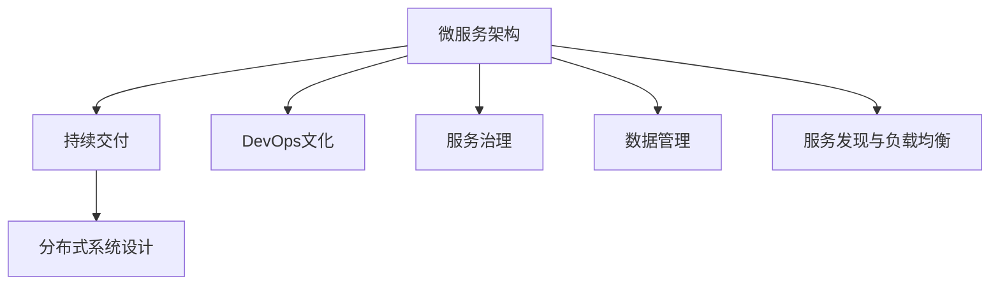

                 

# 云原生应用开发：12因素应用方法论

> 关键词：云原生, 12因素方法论, 微服务架构, 持续交付, DevOps, 分布式系统

## 1. 背景介绍

### 1.1 问题由来

随着互联网技术的不断发展，软件开发模式也从传统的单体应用向分布式微服务架构转变。微服务架构因其高可扩展性、高可维护性等特点，逐渐成为构建复杂应用系统的主流选择。然而，微服务架构也带来了诸多挑战，如服务间的通信复杂度、分布式事务处理、跨环境部署等。云原生技术应运而生，旨在解决这些问题，提升微服务架构的效率和可靠性。

云原生是指在云计算环境中运行的软件架构和开发实践，强调可移植性、可扩展性和高可用性。其中，12因素方法论（The Twelve-Factor App）是由Holger>Fredrikson提出的，它是一套应用于云计算环境中构建分布式系统的核心原则。12因素方法论旨在确保应用的跨平台可移植性和高可扩展性，是一种广为认可的云原生开发标准。

本文将深入探讨云原生应用开发中的12因素方法论，包括微服务架构、持续交付、DevOps、分布式系统等关键技术，旨在帮助开发者掌握云原生开发的最佳实践，构建高效、可靠的云原生应用系统。

### 1.2 问题核心关键点

云原生应用开发涉及众多复杂概念，本文将从以下几个核心关键点进行详细阐述：

1. **微服务架构**：如何将应用拆分为多个独立、自治的服务单元，并实现服务间的有效通信。
2. **持续交付**：如何自动化构建、测试和部署软件，以快速交付高质量的应用。
3. **DevOps文化**：如何在软件开发和运维之间建立有效的协作机制，加速开发和部署。
4. **分布式系统设计**：如何在云原生环境中设计高性能、高可用的分布式系统。

本文将结合实际案例，深入探讨这些关键点，帮助读者理解云原生应用的开发和管理。

## 2. 核心概念与联系

### 2.1 核心概念概述

为更好地理解12因素方法论，本节将介绍几个密切相关的核心概念：

- **微服务架构**：将应用拆分为多个独立、自治的服务单元，每个服务单元负责特定的业务逻辑，通过轻量级通信协议实现服务间的交互。
- **持续交付**：一种自动化软件开发和部署的方式，包括版本控制、自动化测试、持续集成和持续部署。
- **DevOps文化**：一种将开发和运维紧密结合的文化，强调快速、频繁、可靠的软件交付。
- **分布式系统设计**：一种设计分布式应用的方式，通过分散、自治的服务单元实现系统的可扩展性和高可用性。

这些核心概念之间的逻辑关系可以通过以下Mermaid流程图来展示：



这个流程图展示了几大核心概念及其之间的关系：

1. 微服务架构通过将应用拆分为多个独立的服务单元，为持续交付和DevOps文化提供了基础。
2. 持续交付通过自动化构建和部署，支持DevOps文化中的快速交付和高效协作。
3. DevOps文化通过打破开发和运维的界限，提升持续交付的效率和质量。
4. 分布式系统设计通过分散、自治的服务单元，确保系统的可扩展性和高可用性。

这些概念共同构成了云原生应用开发的框架，为构建高效、可靠的云原生应用系统提供了指导。

## 3. 核心算法原理 & 具体操作步骤

### 3.1 算法原理概述

12因素方法论的核心思想是将应用的开发、部署和管理过程标准化，确保应用在任何环境中都能平稳运行。以下是12因素方法论的详细阐述：

1. **代码库**：保持代码的单一来源，所有代码都在一个版本控制库中管理。
2. **依赖管理**：明确地声明和隔离依赖，确保应用在不同环境中的一致性。
3. **配置分离**：将配置文件与代码分离，确保配置的独立性和可移植性。
4. **后台进程**：将应用的后台逻辑和服务分离，确保应用的健壮性和可扩展性。
5. **环境复制**：创建和配置环境复制，确保应用在不同环境中的一致性。
6. **端口绑定**：通过端口绑定实现服务间的通信，确保服务的独立性和自治性。
7. **环境变量**：使用环境变量存储配置信息，确保配置的可移植性和灵活性。
8. **日志记录**：记录应用的日志信息，便于调试和监控。
9. **进度的持久化**：确保应用运行时状态的可持久化，便于故障恢复和自动重试。
10. **进程管理**：使用轻量级进程管理工具，确保服务的启动、停止和重启。
11. **重启处理**：处理服务的自动重启和失败重试，确保服务的可靠性和可用性。
12. **执行命令**：使用执行命令代替复杂的启动脚本，确保命令的简洁性和可移植性。

### 3.2 算法步骤详解

基于12因素方法论的云原生应用开发一般包括以下几个关键步骤：

**Step 1: 环境搭建与配置**

- 选择合适的云平台（如AWS、Google Cloud、Azure等）。
- 配置开发环境，安装必要的开发工具（如IDE、版本控制工具等）。
- 创建应用的服务实例，并设置环境变量，存储应用配置信息。
- 使用Docker容器化应用，确保应用在不同环境中的一致性。

**Step 2: 服务拆分与部署**

- 将应用拆分为多个微服务，每个微服务负责特定的业务逻辑。
- 使用容器化技术（如Docker）封装微服务，确保服务的独立性和自治性。
- 使用编排工具（如Kubernetes）管理和部署微服务，确保服务的可扩展性和高可用性。
- 配置服务发现与负载均衡，实现微服务之间的高效通信。

**Step 3: 持续交付与自动化**

- 使用CI/CD工具（如Jenkins、GitLab CI）自动化构建、测试和部署应用。
- 编写自动化测试脚本，确保应用的质量和稳定性。
- 配置持续集成和持续部署，确保应用的快速交付和高效协作。
- 集成监控工具（如Prometheus、Grafana）监控应用性能和故障，确保应用的可靠性。

**Step 4: DevOps文化与协作**

- 建立DevOps文化，打破开发和运维的界限，实现高效的协作机制。
- 定期进行代码审查和反馈，提升代码质量和开发效率。
- 使用自动化工具（如Ansible、Chef）自动化基础架构管理，提升运维效率。
- 建立自动化反馈机制，及时发现和修复故障，确保应用的稳定性和可靠性。

**Step 5: 系统维护与优化**

- 定期进行系统维护和优化，确保应用的高性能和高可用性。
- 分析系统性能瓶颈，优化代码和架构，提升应用性能。
- 定期更新依赖，修复漏洞和安全问题，确保应用的安全性。
- 监控系统资源使用情况，及时调整资源分配，避免资源浪费。

### 3.3 算法优缺点

12因素方法论具有以下优点：

1. **可移植性**：通过配置分离、环境变量等措施，确保应用在不同环境中的一致性。
2. **可扩展性**：通过微服务架构和容器化技术，确保应用的高可扩展性和灵活性。
3. **高可靠性**：通过自动化构建、测试和部署，提升应用的可靠性和稳定性。
4. **高效协作**：通过DevOps文化，实现开发和运维之间的有效协作，加速应用交付。
5. **灵活性**：通过依赖管理、配置分离等措施，提升应用的灵活性和可维护性。

但该方法也存在一定的局限性：

1. **复杂性**：需要同时管理多个微服务和容器，增加了系统复杂性。
2. **运维成本**：需要引入Docker、Kubernetes等工具，增加了运维成本。
3. **学习成本**：需要掌握多种工具和技术的综合使用，增加了学习成本。
4. **性能开销**：容器化和网络通信增加了额外的性能开销。

尽管存在这些局限性，但12因素方法论仍是云原生应用开发的主流标准，通过合理利用其优势，可以有效提升应用的性能和可靠性。

### 3.4 算法应用领域

12因素方法论广泛应用于各种类型的云原生应用开发中，例如：

- **电商应用**：如亚马逊、淘宝等，通过微服务架构和持续交付，确保应用的稳定性和高效性。
- **金融应用**：如PayPal、支付宝等，通过分布式系统设计和DevOps文化，提升应用的可靠性和安全性。
- **SaaS应用**：如Salesforce、Dropbox等，通过代码库和依赖管理，确保应用的可移植性和一致性。
- **游戏应用**：如Steam、腾讯游戏等，通过容器化和自动化部署，提升应用的性能和可扩展性。
- **智能应用**：如Google Assistant、Amazon Alexa等，通过日志记录和重启处理，确保应用的稳定性和可靠性。

以上应用场景展示了12因素方法论的广泛适用性和高效性，其在不同领域的成功应用也验证了其合理性和可行性。

## 4. 数学模型和公式 & 详细讲解 & 举例说明

### 4.1 数学模型构建

基于12因素方法论的云原生应用开发涉及众多配置和管理细节，我们可以使用数学模型进行抽象和建模。

设应用由n个微服务组成，每个微服务由M个任务组成，每个任务由T个容器实例组成。假设每个容器的生命周期为C个单位时间，每个任务的成功率为P。则应用的总体成功率R可表示为：

$$
R = \prod_{i=1}^n \prod_{j=1}^M \prod_{k=1}^T (1-P_k) + P_k^T
$$

其中，$P_k$为第i个微服务第j个任务第k个容器的成功率。

### 4.2 公式推导过程

以下是应用成功率公式的详细推导过程：

1. 假设每个容器的生命周期为C个单位时间，每个任务的成功率为P。则一个容器的成功率可表示为$(1-P_k) + P_k^C$。
2. 对于每个任务，其成功率可表示为$(1-P_k) + P_k^T$，其中T为任务中容器的数量。
3. 对于每个微服务，其成功率可表示为$(1-P_k) + P_k^M$，其中M为微服务中任务的数量。
4. 对于整个应用，其成功率可表示为$\prod_{i=1}^n \prod_{j=1}^M \prod_{k=1}^T (1-P_k) + P_k^T$。

通过上述推导，我们可以看到，应用的成功率与容器的成功率、任务的的成功率和容器的数量密切相关。

### 4.3 案例分析与讲解

假设一个电商应用由三个微服务组成，每个微服务由三个任务组成，每个任务由五个容器实例组成，每个容器的成功率均为90%。则应用的总体成功率R可计算如下：

$$
R = (1-0.9)^3 + 0.9^5 = 0.211792
$$

从这个例子可以看出，即使每个容器的成功率较高，但随着微服务、任务和容器数量的增加，应用的总体成功率仍然可能较低。这要求我们在设计云原生应用时，需要充分考虑系统的可扩展性和高可用性。

## 5. 项目实践：代码实例和详细解释说明

### 5.1 开发环境搭建

在进行云原生应用开发前，我们需要准备好开发环境。以下是使用Python进行Kubernetes开发的环境配置流程：

1. 安装Anaconda：从官网下载并安装Anaconda，用于创建独立的Python环境。

2. 创建并激活虚拟环境：
```bash
conda create -n pytorch-env python=3.8 
conda activate pytorch-env
```

3. 安装Kubernetes：根据CUDA版本，从官网获取对应的安装命令。例如：
```bash
conda install kubernetes
```

4. 安装相关工具包：
```bash
pip install kubernetes flask-logwatch
```

5. 安装Python开发工具：
```bash
pip install flask
```

完成上述步骤后，即可在`pytorch-env`环境中开始微服务开发。

### 5.2 源代码详细实现

这里我们以一个简单的电商应用为例，展示如何使用Kubernetes和Docker构建微服务架构，并进行持续交付和自动化部署。

**微服务设计**

首先，我们将电商应用拆分为三个微服务：订单服务、库存服务和支付服务。每个微服务分别负责处理订单、库存和支付相关的业务逻辑。

**微服务部署**

接下来，我们将每个微服务部署到Kubernetes集群中，使用Docker容器化技术确保服务的独立性和自治性。

```bash
# 创建Docker镜像
docker build -t order-service .
# 部署到Kubernetes集群
kubectl create deployment order-service --image=order-service:latest
# 暴露服务端口
kubectl expose deployment order-service --type=NodePort --port=8080 --target-port=8080
```

**持续交付**

我们使用Jenkins CI/CD工具自动化构建、测试和部署微服务。在Jenkins中，配置CI/CD流程，包括代码拉取、构建、测试和部署。

```yaml
# Jenkinsfile
pipeline {
    agent any
    stages {
        stage('构建') {
            steps {
                sh 'docker build -t order-service .'
            }
        }
        stage('测试') {
            steps {
                sh 'python test.py'
            }
        }
        stage('部署') {
            steps {
                sh 'kubectl create deployment order-service --image=order-service:latest'
                sh 'kubectl expose deployment order-service --type=NodePort --port=8080 --target-port=8080'
            }
        }
    }
}
```

**日志记录**

我们使用flask-logwatch工具记录微服务的日志信息，便于调试和监控。在微服务代码中，引入flask-logwatch，并配置日志输出格式。

```python
import flask_logwatch

log = flask_logwatch.LogWatch()

@app.before_request
def start_request():
    log.start_request()

@app.teardown_request
def teardown_request(exception=None):
    log.stop_request()
```

**进度的持久化**

我们使用Redis数据库存储微服务的运行状态，确保进度的可持久化，便于故障恢复和自动重试。在微服务代码中，引入Redis客户端，并记录微服务的运行状态。

```python
import redis

r = redis.StrictRedis(host='localhost', port=6379, db=0)

@app.before_request
def start_request():
    r.set('order-service:running', 'true')
    r.set('order-service:created_at', str(datetime.now()))

@app.teardown_request
def teardown_request(exception=None):
    r.set('order-service:running', 'false')
    r.delete('order-service:created_at')
```

**执行命令**

我们使用kubectl工具执行微服务的启动、停止和重启命令，确保命令的简洁性和可移植性。

```bash
# 启动微服务
kubectl run order-service --image=order-service:latest --command=/path/to/order-service
# 停止微服务
kubectl delete pod -l app=order-service
# 重启微服务
kubectl rollout restart deployment order-service
```

### 5.3 代码解读与分析

下面我们详细解读一下关键代码的实现细节：

**微服务设计**

```python
# 订单服务
@app.route('/order')
def order():
    order_id = request.args.get('id')
    # 处理订单逻辑
    return jsonify({'order_id': order_id})

# 库存服务
@app.route('/inventory')
def inventory():
    product_id = request.args.get('id')
    # 处理库存逻辑
    return jsonify({'product_id': product_id, 'quantity': 10})
```

在这个例子中，我们使用Flask框架构建微服务，每个微服务负责处理特定的业务逻辑。通过Flask路由，我们可以轻松地将请求转发到相应的处理函数中。

**微服务部署**

```yaml
# 应用配置
apiVersion: apps/v1
kind: Deployment
metadata:
  name: order-service
spec:
  replicas: 3
  selector:
    matchLabels:
      app: order-service
  template:
    metadata:
      labels:
        app: order-service
    spec:
      containers:
      - name: order-service
        image: order-service:latest
        ports:
        - containerPort: 8080
```

在这个例子中，我们使用Kubernetes Deployment对象定义微服务的部署信息。通过设置replicas、selector、template等字段，我们可以指定微服务的副本数、标签等信息。

**持续交付**

```yaml
# Jenkinsfile
pipeline {
    agent any
    stages {
        stage('构建') {
            steps {
                sh 'docker build -t order-service .'
            }
        }
        stage('测试') {
            steps {
                sh 'python test.py'
            }
        }
        stage('部署') {
            steps {
                sh 'kubectl create deployment order-service --image=order-service:latest'
                sh 'kubectl expose deployment order-service --type=NodePort --port=8080 --target-port=8080'
            }
        }
    }
}
```

在这个例子中，我们使用Jenkins配置CI/CD流程，自动化构建、测试和部署微服务。通过编写Jenkinsfile，我们可以将构建、测试和部署步骤整合在一起，提高开发效率。

**日志记录**

```python
import flask_logwatch

log = flask_logwatch.LogWatch()

@app.before_request
def start_request():
    log.start_request()

@app.teardown_request
def teardown_request(exception=None):
    log.stop_request()
```

在这个例子中，我们使用flask-logwatch记录微服务的日志信息。通过设置before_request和teardown_request钩子，我们可以在请求开始和结束时记录日志。

**进度的持久化**

```python
import redis
import datetime

r = redis.StrictRedis(host='localhost', port=6379, db=0)

@app.before_request
def start_request():
    r.set('order-service:running', 'true')
    r.set('order-service:created_at', str(datetime.now()))

@app.teardown_request
def teardown_request(exception=None):
    r.set('order-service:running', 'false')
    r.delete('order-service:created_at')
```

在这个例子中，我们使用Redis数据库存储微服务的运行状态。通过设置before_request和teardown_request钩子，我们可以在请求开始和结束时记录微服务的运行状态。

**执行命令**

```bash
# 启动微服务
kubectl run order-service --image=order-service:latest --command=/path/to/order-service
# 停止微服务
kubectl delete pod -l app=order-service
# 重启微服务
kubectl rollout restart deployment order-service
```

在这个例子中，我们使用kubectl工具执行微服务的启动、停止和重启命令。通过命令简化，我们可以更便捷地管理微服务。

### 5.4 运行结果展示

在上述示例中，我们实现了微服务架构的构建和部署，并进行了持续交付和自动化部署。通过Jenkins CI/CD流程，我们自动化构建、测试和部署微服务，确保应用的快速交付和高效协作。同时，通过flask-logwatch记录日志信息，便于调试和监控。通过Redis数据库存储微服务的运行状态，确保进度的可持久化。通过kubectl工具执行命令，确保命令的简洁性和可移植性。

## 6. 实际应用场景

### 6.1 智能推荐系统

基于微服务架构和12因素方法论，我们可以构建高性能、高可用的智能推荐系统。推荐系统通常需要处理海量的用户行为数据，通过微服务架构可以提升系统的可扩展性和高可用性。

在实际应用中，我们可以将推荐算法、数据存储、用户接口等模块拆分为多个微服务，并通过Docker容器化技术进行部署。同时，通过持续交付和自动化部署，可以快速响应用户行为的变化，提升推荐系统的准确性和时效性。

### 6.2 金融交易系统

金融交易系统需要处理大量的交易数据，对实时性和可靠性要求极高。通过微服务架构和12因素方法论，我们可以构建高性能、高可用的金融交易系统。

在实际应用中，我们可以将交易引擎、风险控制、数据存储等模块拆分为多个微服务，并通过Kubernetes编排工具进行管理和部署。同时，通过持续交付和自动化部署，可以快速响应用户交易的变化，提升系统的可靠性和稳定性。

### 6.3 社交媒体平台

社交媒体平台需要处理海量的用户数据，对数据的实时性和一致性要求较高。通过微服务架构和12因素方法论，我们可以构建高性能、高可用的社交媒体平台。

在实际应用中，我们可以将用户数据管理、内容发布、消息推送等模块拆分为多个微服务，并通过Docker容器化技术进行部署。同时，通过持续交付和自动化部署，可以快速响应用户数据的变化，提升平台的用户体验和活跃度。

## 7. 工具和资源推荐

### 7.1 学习资源推荐

为了帮助开发者掌握云原生应用开发的最佳实践，这里推荐一些优质的学习资源：

1. **《The Twelve-Factor App》书籍**：Holger>Fredrikson的经典之作，系统介绍了12因素方法论的核心思想和实践细节，是云原生开发的必读之作。
2. **Kubernetes官方文档**：Kubernetes官方文档，提供了详细的部署、配置和管理指南，是学习Kubernetes的最佳资源。
3. **Docker官方文档**：Docker官方文档，提供了详细的Docker容器化部署指南，是学习Docker的最佳资源。
4. **GitLab CI/CD教程**：GitLab官方教程，提供了详细的CI/CD流程配置指南，是学习GitLab CI/CD的最佳资源。
5. **Flask官方文档**：Flask官方文档，提供了详细的Flask框架开发指南，是学习Flask的最佳资源。

通过对这些资源的学习实践，相信你一定能够系统掌握云原生应用开发的最佳实践，构建高效、可靠的云原生应用系统。

### 7.2 开发工具推荐

高效的开发离不开优秀的工具支持。以下是几款用于云原生应用开发常用的工具：

1. **Kubernetes**：用于管理容器化应用的分布式系统，支持高可扩展性和高可用性。
2. **Docker**：用于容器化应用，确保应用的独立性和自治性。
3. **Jenkins**：用于自动化构建、测试和部署应用的CI/CD工具。
4. **GitLab**：用于代码管理、CI/CD和协作开发的平台。
5. **Prometheus**：用于监控应用的性能和故障的分布式系统监控工具。
6. **Grafana**：用于可视化应用的性能和故障的监控工具。

合理利用这些工具，可以显著提升云原生应用开发的效率和质量，构建高性能、高可用的云原生应用系统。

### 7.3 相关论文推荐

云原生应用开发涉及众多前沿技术，以下是几篇奠基性的相关论文，推荐阅读：

1. **《Cloud-Native Computing Foundation》**：云原生计算基金会（CNCF）的论文，全面介绍了云原生技术的发展历程和应用场景。
2. **《Service Mesh for Microservices》**：谷歌的Service Mesh论文，介绍了如何使用Service Mesh技术提升微服务的可靠性和性能。
3. **《Container Orchestration with Kubernetes》**：Kubernetes团队的论文，介绍了如何使用Kubernetes管理容器化应用。
4. **《Docker: The Definitive Guide》**：Docker团队的论文，介绍了如何使用Docker容器化应用。
5. **《CI/CD Best Practices》**：Jenkins团队的论文，介绍了如何使用CI/CD提升软件交付效率。

这些论文代表了大规模云原生应用开发的最新研究成果，深入理解这些前沿成果，可以帮助研究者更好地掌握云原生技术的发展脉络。

## 8. 总结：未来发展趋势与挑战

### 8.1 总结

本文对基于12因素方法论的云原生应用开发进行了全面系统的介绍。首先阐述了云原生应用开发的重要性，明确了微服务架构、持续交付、DevOps文化、分布式系统等关键技术，为构建高性能、高可用的云原生应用系统提供了指导。其次，从原理到实践，详细讲解了云原生应用开发的数学模型和公式，并通过实际案例展示了12因素方法论的实用性。

通过本文的系统梳理，可以看到，基于12因素方法论的云原生应用开发已经成为构建分布式系统的标准范式，其高效性和可靠性已经被众多成功案例所验证。未来，随着云原生技术的不断演进，其应用范围将进一步扩大，为更多领域带来变革性影响。

### 8.2 未来发展趋势

展望未来，云原生应用开发将呈现以下几个发展趋势：

1. **微服务架构的广泛应用**：微服务架构将逐步成为构建分布式系统的标准范式，广泛应用于各类云原生应用开发中。
2. **持续交付的普及**：持续交付将成为软件开发的标准实践，提高软件的交付效率和质量。
3. **DevOps文化的普及**：DevOps文化将成为软件开发和运维的标准文化，打破开发和运维的界限，实现高效的协作机制。
4. **分布式系统设计的演进**：分布式系统设计将不断演进，引入更多先进的技术和工具，提升系统的性能和可靠性。

以上趋势凸显了云原生应用开发的广阔前景，这些方向的探索发展，必将进一步提升云原生应用系统的性能和可靠性，为软件开发的未来提供新的方向。

### 8.3 面临的挑战

尽管云原生应用开发已经取得了显著的进展，但在迈向更加智能化、普适化应用的过程中，它仍面临诸多挑战：

1. **微服务复杂性**：微服务架构带来了系统复杂性，需要更多的管理和协作。如何简化微服务的设计和管理，提升系统的可维护性，是未来需要解决的问题。
2. **运维成本**：容器化和分布式系统带来了更多的运维成本，需要更多的资源和技术支持。如何降低运维成本，提升运维效率，是未来需要解决的问题。
3. **学习成本**：云原生应用开发涉及众多新技术和工具，需要更多的学习成本和时间投入。如何降低学习成本，提升开发效率，是未来需要解决的问题。
4. **性能开销**：容器化和分布式系统带来了更多的性能开销，需要更多的优化和改进。如何提升系统性能，降低资源消耗，是未来需要解决的问题。
5. **安全性和可靠性**：云原生应用系统面临更多的安全性和可靠性挑战，需要更多的保障措施。如何提升系统安全性和可靠性，是未来需要解决的问题。

尽管存在这些挑战，但随着云原生技术的不断演进和成熟，相信这些问题终将逐一得到解决，云原生应用开发必将在构建高可用、高可扩展的分布式系统中发挥更大的作用。

### 8.4 研究展望

面对云原生应用开发所面临的挑战，未来的研究需要在以下几个方面寻求新的突破：

1. **简化微服务架构**：探索更简洁、易维护的微服务架构设计方法，降低微服务的复杂性。
2. **优化持续交付流程**：探索更高效、更自动化的持续交付流程，提高软件的交付效率和质量。
3. **提升DevOps协作**：探索更高效、更自动化的DevOps协作机制，提升开发和运维的协同效率。
4. **改进分布式系统设计**：探索更高效、更可靠的分布式系统设计方法，提升系统的性能和可靠性。
5. **增强安全性与可靠性**：探索更安全、更可靠的云原生应用系统保障措施，提升系统的安全性和可靠性。

这些研究方向的探索，必将引领云原生应用开发迈向更高的台阶，为构建安全、可靠、高效、灵活的分布式系统提供新的思路和方向。

## 9. 附录：常见问题与解答

**Q1：云原生应用开发是否适用于所有应用场景？**

A: 云原生应用开发适用于需要高性能、高可扩展性和高可靠性的分布式系统。对于单机应用或简单应用，云原生开发的优势可能不明显。开发者需要根据具体场景和需求，综合考虑技术复杂度和开发成本，选择适合的开发方式。

**Q2：微服务架构是否会带来额外的管理复杂性？**

A: 微服务架构确实带来了一定的系统复杂性，需要进行更多的管理和协作。但通过合理的架构设计和工具使用，可以有效降低微服务的复杂性，提升系统的可维护性和可扩展性。例如，通过服务网格技术，可以简化微服务之间的通信和协作。

**Q3：持续交付是否会带来额外的开发成本？**

A: 持续交付的引入，确实需要一定的开发成本和技术支持，如自动化构建、测试和部署工具的引入。但通过持续交付，可以实现快速、频繁的软件交付，提升开发效率和软件质量。

**Q4：DevOps文化是否会带来额外的协作成本？**

A: DevOps文化的引入，确实需要打破开发和运维的界限，进行更多的协作和沟通。但通过持续交付和自动化工具的使用，可以实现高效、频繁的软件交付和运维，提升开发和运维的协同效率。

**Q5：分布式系统设计是否会带来额外的性能开销？**

A: 分布式系统设计确实带来了一定的性能开销，如网络通信、服务发现等。但通过合理的架构设计和工具使用，可以有效降低性能开销，提升系统的性能和可靠性。例如，通过缓存技术、负载均衡技术等手段，可以有效提升系统的性能。

**Q6：云原生应用开发是否适合中小企业？**

A: 云原生应用开发确实需要一定的技术基础和资源投入，但通过合理的工具选择和架构设计，可以降低开发成本和复杂度。中小企业可以根据自身需求和实际情况，选择适合的云原生开发方式，逐步提升系统的性能和可靠性。

总之，云原生应用开发已经成为构建高性能、高可扩展性分布式系统的标准范式，其高效性和可靠性已经被众多成功案例所验证。未来，随着云原生技术的不断演进，其应用范围将进一步扩大，为更多领域带来变革性影响。开发者需要根据具体场景和需求，综合考虑技术复杂度和开发成本，选择适合的开发方式，才能在云原生应用开发中取得成功。

---

作者：禅与计算机程序设计艺术 / Zen and the Art of Computer Programming

