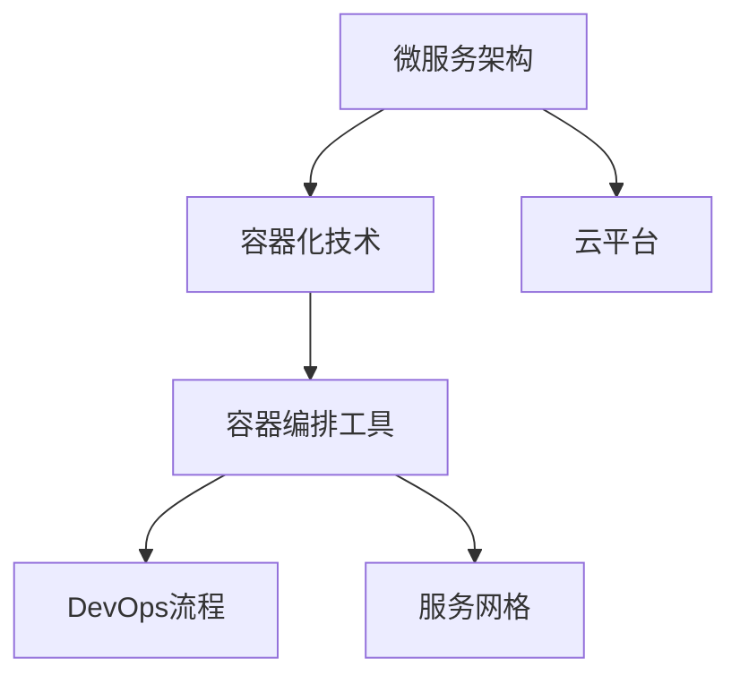

                 

# 云原生架构：微服务、容器与Kubernetes

> 关键词：云原生架构,微服务,容器,容器化,云平台,Kubernetes,DevOps,Serverless

## 1. 背景介绍

### 1.1 问题由来

随着互联网业务的快速增长，单体应用架构的弊端逐渐显现。传统单体应用难以应对大规模并发请求和高可用性需求，同时部署、运维成本也难以控制。云计算和容器技术的出现，为应对这些挑战提供了新的解决思路。云原生架构（Cloud-Native Architecture）应运而生，成为应对这些挑战的关键技术范式。

### 1.2 问题核心关键点

云原生架构的核心目标是通过容器化、服务化、自动化等手段，构建可扩展、高可用、低成本的分布式系统。其关键点包括：

- 微服务架构：将应用拆分为多个独立运行的小服务，每个服务只负责单一业务，能够独立部署和扩展。
- 容器化技术：通过Docker等容器技术，将应用和依赖打包在标准化的容器中，提升应用的可移植性和自动化部署能力。
- 容器编排工具：如Kubernetes，提供服务发现、负载均衡、自动扩展、故障恢复等核心功能，实现对容器化应用的统一管理和调度。
- 自动化流程：通过CI/CD工具链，实现代码构建、测试、部署、监控等流程的自动化，提升开发效率和系统可靠性。

### 1.3 问题研究意义

云原生架构已成为现代分布式系统的标准配置。其优点包括：

- 高度可扩展性：通过微服务化，应用可以按需扩展，适应业务流量波动。
- 高度可用性：通过服务发现和负载均衡，确保系统高可用性，容错能力更强。
- 快速交付：通过自动化流程，加速代码构建、测试、部署等流程，提升交付速度和质量。
- 低成本运营：通过按需资源管理，降低硬件和运维成本，实现成本最优。
- 弹性调度：通过动态资源分配和自动化扩缩容，优化资源利用率，提升系统性能。

## 2. 核心概念与联系

### 2.1 核心概念概述

为更好地理解云原生架构的核心理念和技术栈，本节将介绍几个密切相关的核心概念：

- 微服务架构(Microservices Architecture)：将应用拆分为多个独立运行的小服务，每个服务只负责单一业务，能够独立部署和扩展。
- 容器化技术(Containerization)：通过Docker等容器技术，将应用和依赖打包在标准化的容器中，提升应用的可移植性和自动化部署能力。
- 容器编排工具(Container Orchestration)：如Kubernetes，提供服务发现、负载均衡、自动扩展、故障恢复等核心功能，实现对容器化应用的统一管理和调度。
- DevOps流程：通过自动化流程、持续集成和持续部署等手段，提升开发效率和系统可靠性。
- 服务网格(Services Mesh)：在微服务架构下，通过数据面和控制面分离，实现服务间的高效通信和流量管理。

这些核心概念之间的逻辑关系可以通过以下Mermaid流程图来展示：



这个流程图展示了几大核心概念及其之间的关系：

1. 微服务架构通过将应用拆分为小服务，提高系统的可扩展性和灵活性。
2. 容器化技术将服务打包在容器中，提高部署效率和可移植性。
3. 容器编排工具如Kubernetes，通过统一管理容器化应用，实现服务发现、负载均衡、自动扩展等功能。
4. DevOps流程通过自动化和持续集成，加速开发和交付速度。
5. 服务网格通过数据面和控制面分离，提升服务间通信的效率和可靠性。
6. 云平台提供基础设施和服务，支持微服务、容器化、编排等技术。

这些概念共同构成了云原生架构的技术栈，使得系统可以构建为可扩展、高可用、低成本的分布式应用。

## 3. 核心算法原理 & 具体操作步骤

### 3.1 算法原理概述

云原生架构的核心算法原理涉及多个方面，包括容器化技术、微服务架构、容器编排工具和DevOps流程。其基本思路是通过将应用拆分为小服务，并通过容器化和编排工具，实现服务的自动部署、管理、扩展和故障恢复。以下是一些关键点：

1. 容器化技术：通过将应用和依赖打包在容器中，实现应用的可移植性和自动化部署。
2. 微服务架构：通过将应用拆分为多个独立运行的小服务，提高系统的可扩展性和灵活性。
3. 容器编排工具：通过服务发现、负载均衡、自动扩展、故障恢复等功能，实现容器化应用的统一管理和调度。
4. DevOps流程：通过自动化流程、持续集成和持续部署等手段，提升开发效率和系统可靠性。

### 3.2 算法步骤详解

以下是云原生架构实现的具体步骤：

1. **应用拆分**：将应用拆分为多个独立运行的小服务，每个服务只负责单一业务。
2. **容器化**：将每个服务打包在标准化的容器中，通过Docker等工具进行容器化。
3. **编排管理**：使用容器编排工具如Kubernetes，实现服务的发现、负载均衡、自动扩展和故障恢复。
4. **CI/CD流程**：通过CI/CD工具链，实现代码构建、测试、部署、监控等流程的自动化。
5. **服务网格**：在微服务架构下，使用数据面和控制面分离的服务网格，实现服务间的高效通信和流量管理。
6. **DevOps文化**：推动开发和运维团队的紧密协作，实现敏捷开发和持续交付。

### 3.3 算法优缺点

云原生架构的优点包括：

- 高度可扩展性：通过微服务化，应用可以按需扩展，适应业务流量波动。
- 高度可用性：通过服务发现和负载均衡，确保系统高可用性，容错能力更强。
- 快速交付：通过自动化流程，加速代码构建、测试、部署等流程，提升交付速度和质量。
- 低成本运营：通过按需资源管理，降低硬件和运维成本，实现成本最优。
- 弹性调度：通过动态资源分配和自动化扩缩容，优化资源利用率，提升系统性能。

云原生架构的缺点包括：

- 复杂性增加：微服务架构和服务网格的引入，增加了系统的复杂性，需要更多的管理和运维。
- 性能问题：服务间通信和数据复制可能带来额外的性能开销。
- 学习成本高：需要开发和运维团队掌握新的技术栈和流程。

### 3.4 算法应用领域

云原生架构已经在多个领域得到了广泛应用，例如：

- 金融服务：银行、保险、证券等金融机构的业务系统，通过微服务架构和容器化技术，实现了高可用性和快速部署。
- 电商应用：电子商务平台，通过容器编排工具和服务网格，实现了系统的高效管理和扩展。
- 媒体娱乐：视频、音频、游戏等媒体娱乐业务，通过容器化和服务网格，实现了高性能和低延迟。
- 物联网应用：智能设备和传感器，通过微服务架构和容器编排工具，实现了按需扩展和低延迟通信。
- 企业IT：企业内部系统，通过云原生架构，实现了资源的灵活调度和系统的稳定运行。

## 4. 数学模型和公式 & 详细讲解 & 举例说明

### 4.1 数学模型构建

云原生架构的核心算法原理涉及多个方面，包括容器化技术、微服务架构、容器编排工具和DevOps流程。其基本思路是通过将应用拆分为小服务，并通过容器化和编排工具，实现服务的自动部署、管理、扩展和故障恢复。以下是一些关键点：

- 容器化技术：通过将应用和依赖打包在容器中，实现应用的可移植性和自动化部署。
- 微服务架构：通过将应用拆分为多个独立运行的小服务，提高系统的可扩展性和灵活性。
- 容器编排工具：通过服务发现、负载均衡、自动扩展、故障恢复等功能，实现容器化应用的统一管理和调度。
- DevOps流程：通过自动化流程、持续集成和持续部署等手段，提升开发效率和系统可靠性。

### 4.2 公式推导过程

以容器编排工具Kubernetes为例，介绍其基本工作原理和算法。

Kubernetes的工作原理包括：

1. **节点管理**：管理集群中的节点，包括CPU、内存、磁盘、网络等资源。
2. **调度器调度**：根据资源需求和调度策略，选择节点进行任务调度。
3. **服务发现**：通过DNS解析，实现容器间的高效通信。
4. **负载均衡**：通过负载均衡器，实现容器间负载均衡。
5. **自动扩展**：根据系统负载，动态调整容器数量。
6. **故障恢复**：在容器失效时，自动重启或替换容器。

Kubernetes的核心算法包括：

1. **调度算法**：包括轮询调度、抢占式调度、任务分割等，根据资源需求和调度策略选择最优节点。
2. **心跳检测**：通过心跳检测，确保容器的健康状态，及时发现和恢复故障。
3. **API接口**：通过RESTful API，实现集群管理和容器操作。
4. **分布式状态管理**：通过etcd等分布式状态管理工具，实现集群的稳定性和可扩展性。

### 4.3 案例分析与讲解

以Docker和Kubernetes为例，介绍云原生架构的实现过程。

1. **Docker容器化**：将应用和依赖打包在Docker容器中，实现应用的可移植性和自动化部署。
2. **Kubernetes编排**：通过Kubernetes实现容器调度、服务发现、负载均衡、自动扩展和故障恢复等功能。
3. **DevOps流程**：通过CI/CD工具链，实现代码构建、测试、部署、监控等流程的自动化。
4. **服务网格**：在微服务架构下，使用数据面和控制面分离的服务网格，实现服务间的高效通信和流量管理。

## 5. 项目实践：代码实例和详细解释说明

### 5.1 开发环境搭建

在进行云原生架构实践前，我们需要准备好开发环境。以下是使用Kubernetes搭建集群和容器化应用的步骤：

1. **安装Kubernetes**：在Linux服务器上安装Kubernetes，可以参考官方文档进行安装。
2. **安装Docker**：在服务器上安装Docker，并配置Kubernetes与之集成。
3. **安装Helm**：Helm是Kubernetes的包管理工具，可以通过helm安装和管理Kubernetes资源。

### 5.2 源代码详细实现

以下是使用Kubernetes和Docker搭建简单微服务架构的PyTorch模型服务实例：

1. **Dockerfile编写**：编写Dockerfile，定义应用环境、依赖库、入口文件等。
2. **Kubernetes部署**：通过helm安装应用，定义服务、副本集、健康检查、资源限制等。
3. **监控日志**：通过Kubernetes的事件和日志管理，监控应用状态。

### 5.3 代码解读与分析

让我们再详细解读一下关键代码的实现细节：

**Dockerfile**：
```dockerfile
FROM pytorch/pytorch
COPY . /workspace
WORKDIR /workspace
RUN pip install -r requirements.txt
EXPOSE 8080
ENTRYPOINT ["python", "main.py"]
```

**Kubernetes部署**：
```yaml
apiVersion: apps/v1
kind: Deployment
metadata:
  name: pytorch-deployment
spec:
  replicas: 3
  selector:
    matchLabels:
      app: pytorch
  template:
    metadata:
      labels:
        app: pytorch
    spec:
      containers:
      - name: pytorch
        image: <docker_image>
        ports:
        - containerPort: 8080
```

**监控日志**：
```bash
kubectl logs <pod_name>
kubectl describe pod <pod_name>
```

通过上述代码，我们完成了Docker容器化和Kubernetes编排的过程。可以看到，使用Kubernetes，可以快速搭建和部署微服务架构，提升系统的可扩展性和灵活性。

### 5.4 运行结果展示

运行上述代码后，可以通过Kubernetes的事件和日志管理，实时监控应用的运行状态。同时，通过curl或其他HTTP客户端，访问服务并验证其正常运行。

```bash
$ curl http://<node_ip>:8080/predict
```

## 6. 实际应用场景

### 6.1 金融服务

云原生架构在金融服务领域具有广泛的应用前景。金融机构需要实时处理海量交易数据，确保系统的高度可用性和性能。通过微服务架构和容器编排工具，可以实现高可用性、快速部署和按需扩展，满足金融业务的复杂需求。

### 6.2 电商应用

电商应用需要应对高峰期的流量激增和高并发请求。通过容器编排工具和服务网格，可以实现高效管理和扩展，确保系统的高性能和低延迟。

### 6.3 媒体娱乐

视频、音频、游戏等媒体娱乐业务，需要高效、低延迟的服务。通过容器化和编排工具，可以实现高性能和稳定运行，满足用户的实时体验需求。

### 6.4 物联网应用

智能设备和传感器需要按需扩展和低延迟通信。通过微服务架构和容器编排工具，可以实现按需扩展和高效通信，满足物联网设备的实时性需求。

### 6.5 企业IT

企业内部系统需要灵活调度和高效管理。通过云原生架构，可以实现资源的灵活调度和系统的稳定运行，提升企业的IT效率和可靠性。

## 7. 工具和资源推荐

### 7.1 学习资源推荐

为了帮助开发者系统掌握云原生架构的理论基础和实践技巧，这里推荐一些优质的学习资源：

1. **Kubernetes官方文档**：Kubernetes官方文档，是学习Kubernetes的最佳资源，涵盖了从安装、部署到管理的各个方面。
2. **《Kubernetes: Up and Running》书籍**：一本全面的Kubernetes入门书籍，适合初学者快速入门。
3. **《Cloud-Native Computing with Kubernetes》书籍**：由Kubernetes创始人之一撰写的书籍，深入浅出地介绍了云原生架构和Kubernetes的应用实践。
4. **《Microservices: Patterns, Styles, and Strategies》书籍**：一本经典的微服务架构书籍，详细介绍了微服务架构的设计原则和实践技巧。
5. **Kubernetes社区和论坛**：Kubernetes社区和论坛是学习和交流Kubernetes的最佳平台，包含大量的学习资源和实践经验。

通过对这些资源的学习实践，相信你一定能够快速掌握云原生架构的精髓，并用于解决实际的IT问题。

### 7.2 开发工具推荐

高效的开发离不开优秀的工具支持。以下是几款用于云原生架构开发的常用工具：

1. **Docker**：容器化技术的重要工具，可以将应用和依赖打包在标准化的容器中，提升应用的可移植性和自动化部署能力。
2. **Kubernetes**：容器编排工具，提供服务发现、负载均衡、自动扩展、故障恢复等核心功能，实现对容器化应用的统一管理和调度。
3. **Helm**：Kubernetes的包管理工具，可以方便地管理和部署应用。
4. **CI/CD工具**：如Jenkins、GitLab CI/CD等，实现代码构建、测试、部署、监控等流程的自动化。
5. **监控工具**：如Prometheus、Grafana等，实时监控系统的运行状态，保障系统的稳定性和性能。

合理利用这些工具，可以显著提升云原生架构的开发效率，加快创新迭代的步伐。

### 7.3 相关论文推荐

云原生架构和容器技术的发展源于学界的持续研究。以下是几篇奠基性的相关论文，推荐阅读：

1. **《Docker: The Platform for Developers》论文**：Docker公司的技术白皮书，介绍了Docker容器化的核心技术。
2. **《Kubernetes: Distributed Systems for Humans》论文**：Kubernetes的架构设计和核心技术介绍，详细介绍了Kubernetes的设计思想和实现原理。
3. **《Microservices: A Personal Journey》论文**：微服务架构的设计原则和实践技巧，介绍了微服务架构的设计理念和应用实践。
4. **《Containerization: The What and the Why》论文**：介绍容器化的核心技术和优势，详细介绍了容器化的设计思路和应用场景。

这些论文代表了大规模分布式系统架构的技术发展脉络，通过学习这些前沿成果，可以帮助研究者把握学科前进方向，激发更多的创新灵感。

## 8. 总结：未来发展趋势与挑战

### 8.1 总结

本文对云原生架构进行了全面系统的介绍。首先阐述了云原生架构的背景和意义，明确了微服务、容器化、编排工具等关键概念及其之间的联系。其次，从原理到实践，详细讲解了云原生架构的核心算法原理和具体操作步骤，给出了云原生架构任务开发的完整代码实例。同时，本文还广泛探讨了云原生架构在多个行业领域的应用前景，展示了云原生架构的巨大潜力。此外，本文精选了云原生架构的学习资源，力求为读者提供全方位的技术指引。

通过本文的系统梳理，可以看到，云原生架构已成为现代分布式系统的标准配置，其优点在于高度可扩展性、高度可用性、快速交付、低成本运营和弹性调度。未来，伴随云原生技术的不断发展，云原生架构必将在更多领域得到应用，为系统构建和运维带来全新的挑战和机遇。

### 8.2 未来发展趋势

展望未来，云原生架构将呈现以下几个发展趋势：

1. **多云混合架构**：云计算和本地数据中心的混合使用，实现资源的灵活调度和成本最优。
2. **微服务编排**：通过容器编排工具，实现微服务之间的协调和调度，提升系统性能和可靠性。
3. **服务网格优化**：通过服务网格的数据面和控制面分离，提升服务间通信的效率和可靠性。
4. **自动化运维**：通过自动化运维工具，实现故障检测、诊断和修复的自动化，提升运维效率和稳定性。
5. **安全防护**：通过安全策略和合规性管理，保障系统的安全性和合规性。
6. **云原生社区**：推动开源社区和标准化工作，促进云原生技术的广泛应用和持续创新。

这些趋势凸显了云原生架构的持续发展和演化方向，云原生架构必将在未来得到更广泛的应用和创新。

### 8.3 面临的挑战

尽管云原生架构已经取得了显著进展，但在迈向更加智能化、普适化应用的过程中，仍面临诸多挑战：

1. **复杂性增加**：微服务架构和服务网格的引入，增加了系统的复杂性，需要更多的管理和运维。
2. **性能问题**：服务间通信和数据复制可能带来额外的性能开销。
3. **学习成本高**：需要开发和运维团队掌握新的技术栈和流程。
4. **成本控制**：按需资源管理和动态扩展需要精细的预算控制。
5. **安全风险**：容器化和编排工具带来的安全风险和合规性问题。

### 8.4 研究展望

面对云原生架构所面临的挑战，未来的研究需要在以下几个方面寻求新的突破：

1. **微服务架构优化**：改进微服务架构的设计和实现，提升系统的可扩展性和灵活性。
2. **容器编排优化**：优化容器编排工具的性能和可靠性，提升系统的稳定性和效率。
3. **自动化流程改进**：优化CI/CD流程和自动化工具，提升开发和交付速度。
4. **服务网格优化**：改进服务网格的设计和实现，提升服务间通信的效率和可靠性。
5. **安全防护优化**：改进云原生架构的安全策略和合规性管理，保障系统的安全性和合规性。
6. **云原生社区推动**：推动开源社区和标准化工作，促进云原生技术的广泛应用和持续创新。

这些研究方向将引领云原生架构的持续演进，为构建高性能、高可靠、高安全、高可用的云原生系统提供新的动力。

## 9. 附录：常见问题与解答

**Q1：云原生架构是否适用于所有IT应用？**

A: 云原生架构适用于大多数分布式系统，特别适合高并发、高可扩展性和高性能的应用场景。但对于一些对实时性要求较低、数据交互简单的应用，单体架构可能更为合适。

**Q2：微服务架构如何应对服务间的通信问题？**

A: 微服务架构通过服务网格（如Istio、Linkerd）实现服务间的通信管理和流量控制，支持多协议和负载均衡，解决微服务间的通信问题。

**Q3：容器化技术如何提升应用的可移植性？**

A: 容器化技术将应用和依赖打包在标准化的容器中，实现应用的可移植性和自动化部署。容器化应用可以跨不同的硬件和操作系统运行，提升了应用的部署效率和稳定性。

**Q4：云原生架构的自动化流程如何提升开发效率？**

A: 云原生架构通过CI/CD工具链实现代码构建、测试、部署、监控等流程的自动化，可以快速迭代和交付应用，提升开发效率和系统可靠性。

**Q5：如何保障云原生架构的安全性？**

A: 云原生架构需要通过安全策略和合规性管理保障系统的安全性和合规性。如采用最小权限原则、安全审计、漏洞扫描等措施，保障系统的安全性和合规性。

通过对这些问题的回答，可以更好地理解和应用云原生架构，确保系统的稳定性和可靠性。

---

作者：禅与计算机程序设计艺术 / Zen and the Art of Computer Programming

