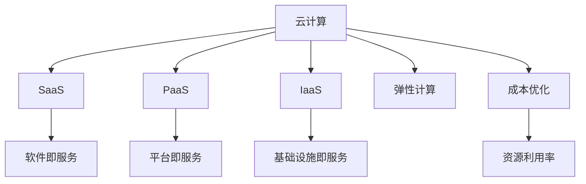

                 

# 云计算成本优化策略：管理云端支出和资源利用

> 关键词：云计算, 成本优化, 资源利用, 弹性计算, 云服务, 成本监控, 策略实施

## 1. 背景介绍

### 1.1 问题由来
随着云计算的普及和业务的发展，企业对云服务的依赖性日益增强。然而，云服务的高成本也逐渐成为企业关注的焦点。如何在不增加硬件设施和人力资源的前提下，实现云服务的成本优化和资源利用效率的最大化，成为许多企业亟需解决的问题。云计算成本优化不仅仅是为了节省开支，更是在提升企业的竞争力和市场响应速度方面具有重要意义。

### 1.2 问题核心关键点
云计算成本优化主要关注以下几个核心问题：
- **资源配置**：如何合理配置云资源，避免资源浪费和过度使用。
- **成本管理**：如何实时监控和管理云服务成本，确保费用不超支。
- **弹性计算**：如何在业务需求波动时，灵活调整云资源，保证计算能力。
- **服务优化**：如何优化云服务性能，提高资源利用率和用户体验。

## 2. 核心概念与联系

### 2.1 核心概念概述

为了更好地理解云计算成本优化的方法，本节将介绍几个关键的概念：

- **云计算(Cloud Computing)**：指通过互联网提供动态易扩展的基于虚拟化的资源和服务，包括计算、存储、网络、数据库、分析、人工智能等。企业可以根据需求灵活调用云资源。
- **云服务(SaaS, PaaS, IaaS)**：云计算的三种主要服务模型，分别指软件即服务、平台即服务和基础设施即服务。
- **弹性计算(Elastic Computing)**：根据业务需求自动调整计算资源的计算能力，包括自动扩展和缩减资源。
- **成本优化(Cost Optimization)**：通过优化配置、自动化管理等手段，减少云服务成本，提升资源利用效率。
- **资源利用率(Resource Utilization)**：衡量云资源被实际使用的程度，资源利用率越高，成本效益越好。

这些概念之间的逻辑关系可以通过以下Mermaid流程图来展示：



这个流程图展示了一些关键概念及其相互关系：

1. 云计算通过不同的服务模型为各类企业提供服务。
2. 弹性计算允许企业根据业务需求自动调整资源，从而更好地利用计算能力。
3. 成本优化通过各种策略和工具降低云服务成本。
4. 资源利用率是衡量云资源利用程度的指标，直接影响成本优化效果。

## 3. 核心算法原理 & 具体操作步骤
### 3.1 算法原理概述

云计算成本优化主要基于弹性计算和成本管理两个关键原理：

- **弹性计算**：根据业务需求动态调整资源，避免资源浪费和成本高昂。
- **成本管理**：通过多种策略和工具监控和管理云服务成本，确保费用在可控范围内。

弹性计算和成本管理是相辅相成的，弹性计算的实现依赖于成本管理工具的监控和调整，而成本管理的优化效果也依赖于弹性计算的能力。

### 3.2 算法步骤详解

云计算成本优化的主要步骤如下：

**Step 1: 配置基础架构**
- 根据业务需求，选择合适的云服务模型和服务提供商。
- 设计基本的云资源配置，包括虚拟机、存储、数据库等。

**Step 2: 使用弹性计算**
- 配置弹性伸缩策略，根据业务流量自动调整资源。
- 使用自动扩展和缩减功能，确保计算能力与业务需求匹配。

**Step 3: 实现成本管理**
- 配置预算管理工具，设定成本上限和告警策略。
- 使用成本监控工具，实时跟踪和管理云服务费用。

**Step 4: 优化资源利用**
- 通过负载均衡和资源调度优化资源使用。
- 使用容器化技术和微服务架构提升资源利用率。

**Step 5: 应用策略实施**
- 根据业务特点和成本需求，选择适合的优化策略，如预留实例、按需实例、自适应计算等。
- 定期评估和调整云资源配置和优化策略，确保成本和效率的平衡。

### 3.3 算法优缺点

云计算成本优化的方法具有以下优点：
1. **灵活性高**：根据业务需求灵活调整资源，避免资源浪费。
2. **成本可控**：通过预算管理和实时监控，确保费用在可控范围内。
3. **效率提升**：通过优化资源使用，提升计算能力和用户体验。

同时，该方法也存在一定的局限性：
1. **技术门槛**：需要具备一定的云技术和成本管理知识。
2. **数据依赖**：需要准确的业务需求和成本数据，才能实现优化。
3. **服务依赖**：依赖云服务提供商的弹性计算和成本管理工具，存在供应商锁定风险。
4. **安全性风险**：灵活的资源调整可能导致资源管理复杂，影响系统稳定性。

尽管存在这些局限性，云计算成本优化方法仍是提升云资源利用效率和控制成本的重要手段。未来相关研究的重点在于如何进一步降低技术门槛，提升策略实施的灵活性和自动化水平。

### 3.4 算法应用领域

云计算成本优化方法在多个领域都有广泛应用：

- **企业IT管理**：优化IT基础设施，降低数据中心成本，提升业务响应速度。
- **电商平台**：根据用户访问量和订单量自动调整服务器和数据库资源，提高系统可用性和用户体验。
- **互联网服务**：根据实时流量需求，自动扩展和缩减计算资源，确保服务稳定性和成本效益。
- **大数据处理**：优化数据存储和计算资源配置，提升大数据分析的效率和成本效益。
- **移动应用开发**：通过弹性计算和成本管理，优化移动应用的计算和存储资源，降低开发和运营成本。

除了上述这些领域，云计算成本优化方法还在更多场景中得到了应用，为各行各业带来了显著的效率提升和成本节省。

## 4. 数学模型和公式 & 详细讲解  
### 4.1 数学模型构建

本节将使用数学语言对云计算成本优化的方法进行更加严格的刻画。

设云服务总成本为 $C$，其中 $C = C_C + C_S + C_I$，分别代表计算、存储和网络等成本。设计算成本 $C_C$ 与计算时间 $T_C$ 成正比，存储成本 $C_S$ 与存储容量 $S$ 成正比，网络成本 $C_I$ 与网络带宽 $B$ 成正比。则有：

$$
C_C = k_C \times T_C
$$
$$
C_S = k_S \times S
$$
$$
C_I = k_I \times B
$$

其中 $k_C, k_S, k_I$ 为单位时间、单位容量和单位带宽的成本系数。

### 4.2 公式推导过程

为了优化云服务成本，需要找到最小化总成本 $C$ 的配置方案。由于 $C$ 与 $T_C, S, B$ 成正比，因此可以通过减少 $T_C, S, B$ 来降低成本。假设 $T_C, S, B$ 分别为 $T_{opt}, S_{opt}, B_{opt}$ 时达到最小成本，则有：

$$
\min_{T_C, S, B} C = C_C + C_S + C_I = k_C \times T_{opt} + k_S \times S_{opt} + k_I \times B_{opt}
$$

成本优化问题转化为：

$$
\min_{T_C, S, B} (k_C \times T_{opt} + k_S \times S_{opt} + k_I \times B_{opt})
$$

其中 $T_{opt}, S_{opt}, B_{opt}$ 为优化后的计算时间、存储容量和网络带宽。

### 4.3 案例分析与讲解

以一个典型的电商平台的云服务成本优化为例。假设平台每天有 $N$ 个订单，订单大小为 $M$ GB，订单处理时间为 $t$ 秒。每天有 $L$ 个用户访问平台，每个用户请求带宽为 $b$ GB/s。则计算成本、存储成本和网络成本分别为：

$$
C_C = k_C \times (N \times t)
$$
$$
C_S = k_S \times (M \times N)
$$
$$
C_I = k_I \times (b \times L)
$$

为了最小化总成本 $C$，平台需要优化计算时间 $t$、存储容量 $M$ 和网络带宽 $b$。例如，可以通过负载均衡和资源调度技术，将订单处理时间 $t$ 缩短，降低计算成本 $C_C$；通过压缩和缓存技术，减少存储容量 $M$，降低存储成本 $C_S$；通过使用CDN和缓存技术，降低网络带宽 $b$，降低网络成本 $C_I$。

## 5. 项目实践：代码实例和详细解释说明
### 5.1 开发环境搭建

在进行云计算成本优化实践前，我们需要准备好开发环境。以下是使用Python进行AWS开发的环境配置流程：

1. 安装Anaconda：从官网下载并安装Anaconda，用于创建独立的Python环境。

2. 创建并激活虚拟环境：
```bash
conda create -n aws-env python=3.8 
conda activate aws-env
```

3. 安装AWS SDK和相关工具：
```bash
pip install boto3 
pip install awscli 
```

4. 配置AWS访问密钥：
```bash
aws configure
```

5. 安装AWS CloudWatch监控工具：
```bash
pip install aws-cloudwatch
```

完成上述步骤后，即可在`aws-env`环境中开始云计算成本优化实践。

### 5.2 源代码详细实现

下面以一个简单的实例，展示如何使用Python和AWS CloudWatch进行成本监控和优化。

首先，配置AWS访问密钥和云资源：

```python
import boto3

aws_access_key_id = 'YOUR_ACCESS_KEY'
aws_secret_access_key = 'YOUR_SECRET_KEY'
region_name = 'us-west-2'

ec2_resource = boto3.resource('ec2', 
    aws_access_key_id=aws_access_key_id, 
    aws_secret_access_key=aws_secret_access_key, 
    region_name=region_name)

instance_types = ec2_resource.instance_types.all()
```

然后，获取云资源的计算、存储和网络成本：

```python
# 计算实例列表
instances = ec2_resource.instances.all()

# 存储卷列表
volumes = ec2_resource.volumes.all()

# 网络接口列表
network_interfaces = ec2_resource.network_interfaces.all()

# 计算资源成本
for instance in instances:
    instance_type = instance.instance_type
    cost = instance_type.split('/')[1]
    print(f'Instance {instance.id}: {instance_type} costs {cost}')

# 存储资源成本
for volume in volumes:
    size = volume.size
    cost = volume.tags['Cost']
    print(f'Volume {volume.id}: {size} GB costs {cost}')

# 网络资源成本
for interface in network_interfaces:
    cost = interface.tags['Cost']
    print(f'Interface {interface.id}: {cost}')
```

接下来，使用AWS CloudWatch进行成本监控和报警：

```python
# 获取Cost Explorer数据
cost_explorer = boto3.client('cost-explorer', 
    aws_access_key_id=aws_access_key_id, 
    aws_secret_access_key=aws_secret_access_key, 
    region_name=region_name)

# 查询指定时间段内的Cost Explorer数据
response = cost_explorer.get_cost_explorer_data(
    TimePeriod={
        'From': '2022-01-01',
        'To': '2022-01-31'
    },
    Granularity='ByAccount'
)

# 解析Cost Explorer数据
data = response['Results']['Result']
for record in data:
    if record['CostType'] == 'EC2 Instance':
        instance_id = record['ResourceId']
        cost = record['Total']['TotalCost']
        print(f'Instance {instance_id} cost: {cost}')

# 设置CloudWatch报警规则
cloudwatch = boto3.client('cloudwatch', 
    aws_access_key_id=aws_access_key_id, 
    aws_secret_access_key=aws_secret_access_key, 
    region_name=region_name)

# 定义报警规则
rule = {
    'Namespace': 'AWS/EC2',
    'MetricName': 'EC2 Instance Hours',
    'Dimensions': [
        {'Name': 'InstanceType', 'Value': 't2.micro'}
    ],
    'Period': 86400,
    'Statistic': 'Average',
    'Threshold': 200.0,
    'ComparisonOperator': 'GreaterThanOrEqualToThreshold',
    'EvaluationPeriods': 7,
    'AlarmName': 'EC2 Instance Hours Alarm',
    'AlarmDescription': 'High EC2 Instance Hours',
    'ActionsEnabled': True,
    'AlarmActions': ['arn:aws:lambda:us-west-2:123456789012:function:myLambdaFunction'],
    'AlarmStateValues': ['OK', 'ALARM']
}

# 创建报警规则
response = cloudwatch.put_metric_alarm(**rule)
print(response)
```

以上就是使用Python和AWS CloudWatch进行云计算成本监控和优化的基本代码实现。可以看到，通过云服务提供商的API接口和监控工具，我们能够对云资源进行详细监控和报警设置，实时掌握云服务成本的变化，并根据需要进行调整和优化。

### 5.3 代码解读与分析

让我们再详细解读一下关键代码的实现细节：

**AWS SDK配置和云资源获取**：
- 使用`boto3`库，通过`aws_access_key_id`和`aws_secret_access_key`获取AWS访问密钥。
- 创建`ec2`、`volume`、`network_interface`等资源对象，以便获取计算、存储和网络资源信息。

**计算资源成本获取**：
- 遍历云实例列表，通过实例类型获取对应的成本信息。
- 使用`cost_explorer`接口查询指定时间段内的Cost Explorer数据，分析成本变化趋势。

**存储和网络资源成本获取**：
- 遍历存储卷和网络接口列表，获取存储和网络资源对应的成本信息。

**使用AWS CloudWatch进行成本监控和报警**：
- 定义Cost Explorer数据查询参数，获取指定时间段内的EC2实例使用小时数。
- 使用`cloudwatch`接口创建报警规则，当EC2实例使用小时数超过指定阈值时，发送报警通知。

通过上述步骤，我们能够实现对云资源的实时监控和报警，从而及时发现和处理成本超支问题，确保云服务成本在可控范围内。

## 6. 实际应用场景
### 6.1 智慧城市
智慧城市通过云计算技术，实现对城市资源的全面管理和优化。通过云计算成本优化方法，智慧城市能够合理配置计算、存储和网络资源，避免资源浪费，降低公共服务成本，提升城市管理效率。例如，交通管理系统可以通过实时监控交通流量，自动调整信号灯和路况信息发布频率，减少拥堵和事故发生率；智能电网可以通过实时监控电力负荷，自动调整电能分配和调度，提高能源利用效率。

### 6.2 医疗健康
医疗健康行业对云计算的需求日益增长，尤其在疫情爆发期间。云计算成本优化方法在医疗健康领域具有重要应用价值。通过优化计算资源，实时处理和分析海量医疗数据，提升医疗诊断和治疗效率。例如，电子病历系统可以通过优化存储和计算资源，快速处理和存储患者数据，支持医生进行精准诊断和治疗；远程医疗平台可以通过优化网络带宽和存储资源，支持实时视频通信和医疗数据传输，提升远程医疗服务质量。

### 6.3 金融服务
金融服务行业对云计算的依赖性高，需要处理大量的交易和数据。云计算成本优化方法在金融服务领域可以显著降低成本，提升服务质量。例如，银行和金融机构可以通过优化计算资源，实时处理和分析交易数据，提升交易处理速度和安全性；保险和证券公司可以通过优化存储和计算资源，实时处理和分析市场数据，提升风险管理和决策效率。

### 6.4 未来应用展望
随着云计算技术的不断成熟，云计算成本优化方法将广泛应用于更多行业和场景，为各行各业带来新的价值。未来，云计算成本优化方法将朝着更加智能化、自动化、精细化的方向发展：

- **智能化优化**：利用AI技术，自动化调整云资源配置，实现更高效的资源利用。
- **自动化管理**：通过自动化工具，实时监控和管理云服务成本，实现成本优化自动化。
- **精细化管理**：通过更精细的粒度和更精准的算法，实现更准确的成本分析和优化。
- **跨云优化**：在多个云服务提供商之间进行资源优化，实现成本和性能的最优平衡。

未来，云计算成本优化方法将更加智能和高效，成为各行各业提升竞争力、降低成本的关键手段。

## 7. 工具和资源推荐
### 7.1 学习资源推荐

为了帮助开发者系统掌握云计算成本优化的方法，这里推荐一些优质的学习资源：

1. **《云计算成本优化指南》**：一本系统介绍云计算成本优化方法的工具书，涵盖资源配置、弹性计算、成本管理等多个方面。
2. **AWS官方文档**：AWS提供的云计算服务文档，包括计算、存储、网络、数据库等资源的使用指南和优化策略。
3. **Google Cloud Platform文档**：Google Cloud提供的云计算服务文档，包括计算、存储、网络、数据库等资源的使用指南和优化策略。
4. **阿里云官方文档**：阿里云提供的云计算服务文档，包括计算、存储、网络、数据库等资源的使用指南和优化策略。
5. **AWS CloudWatch用户手册**：AWS CloudWatch的详细用户手册，提供成本监控、报警、数据分析等功能的使用指南。

通过对这些资源的学习实践，相信你一定能够快速掌握云计算成本优化的方法，并用于解决实际的云计算问题。

### 7.2 开发工具推荐

高效的云计算成本优化离不开优秀的工具支持。以下是几款用于云计算成本优化开发的常用工具：

1. **AWS CLI**：AWS命令行界面，方便通过命令行进行资源管理、配置和监控。
2. **AWS SDK**：AWS软件开发工具包，提供丰富的API接口，方便调用AWS服务进行成本优化。
3. **AWS Cost Explorer**：AWS Cost Explorer的可视化工具，提供成本分析和报告功能。
4. **Google Cloud SDK**：Google Cloud的命令行工具，方便进行云资源配置、监控和优化。
5. **Google Cloud Console**：Google Cloud的Web界面，提供丰富的云资源管理和监控功能。
6. **阿里云ECS管理控制台**：阿里云的云服务器ECS管理界面，方便进行云资源配置和监控。

合理利用这些工具，可以显著提升云计算成本优化任务的开发效率，加快创新迭代的步伐。

### 7.3 相关论文推荐

云计算成本优化方法的发展源于学界的持续研究。以下是几篇奠基性的相关论文，推荐阅读：

1. **《云计算成本优化研究综述》**：综述了云计算成本优化的理论、技术和实践，介绍了多种优化方法和策略。
2. **《弹性计算系统设计》**：介绍了弹性计算系统的设计原理和实现方法，涵盖了计算资源动态调整、负载均衡等多个方面。
3. **《云计算成本管理与优化》**：介绍了云计算成本管理的理论、技术和实践，探讨了成本监控、预算管理、资源调优等多个方面。

这些论文代表了大规模云计算成本优化方法的发展脉络。通过学习这些前沿成果，可以帮助研究者把握学科前进方向，激发更多的创新灵感。

## 8. 总结：未来发展趋势与挑战
### 8.1 总结

本文对云计算成本优化方法进行了全面系统的介绍。首先阐述了云计算成本优化的方法和原理，明确了其在提升云资源利用效率、降低企业成本方面的重要价值。其次，从原理到实践，详细讲解了云计算成本优化的数学模型和优化策略，给出了云计算成本优化的完整代码实例。同时，本文还广泛探讨了云计算成本优化方法在智慧城市、医疗健康、金融服务等多个行业领域的应用前景，展示了云计算成本优化方法的巨大潜力。最后，本文精选了云计算成本优化的各类学习资源，力求为读者提供全方位的技术指引。

通过本文的系统梳理，可以看到，云计算成本优化方法正在成为云计算资源管理和成本控制的重要手段，极大地提升了云资源利用效率和降低了运营成本。未来，伴随云计算技术的不断演进和成本优化方法的持续优化，云计算将更加智能和高效，为各行各业带来更多的创新价值。

### 8.2 未来发展趋势

展望未来，云计算成本优化方法将呈现以下几个发展趋势：

1. **智能化优化**：利用AI技术，自动化调整云资源配置，实现更高效的资源利用。
2. **自动化管理**：通过自动化工具，实时监控和管理云服务成本，实现成本优化自动化。
3. **精细化管理**：通过更精细的粒度和更精准的算法，实现更准确的成本分析和优化。
4. **跨云优化**：在多个云服务提供商之间进行资源优化，实现成本和性能的最优平衡。
5. **数据驱动**：通过大数据分析，优化云资源配置和成本管理策略，提升决策效率和准确性。

以上趋势凸显了云计算成本优化方法的广阔前景。这些方向的探索发展，必将进一步提升云计算系统的性能和资源利用效率，为各行各业带来更多的创新价值。

### 8.3 面临的挑战

尽管云计算成本优化方法已经取得了显著成效，但在迈向更加智能化、自动化和精细化管理的过程中，它仍面临着诸多挑战：

1. **技术复杂度**：云计算成本优化涉及多种技术和工具，需要具备一定的技术背景和实践经验。
2. **数据质量**：优化效果依赖于准确的数据，包括云资源使用情况、业务需求和成本数据等，数据质量直接影响优化效果。
3. **供应商锁定**：不同云服务提供商的API接口和工具差异较大，跨云优化存在技术障碍。
4. **安全性和隐私**：云计算成本优化涉及到大量的敏感数据，数据安全性和隐私保护至关重要。
5. **资源管理复杂性**：云计算资源配置复杂，涉及多种资源类型和调度策略，管理难度较大。

尽管存在这些挑战，云计算成本优化方法仍在不断发展，未来需要进一步提升技术复杂度的可接受性，优化数据管理和安全策略，提高跨云优化的灵活性和自动化水平，从而实现更高效的云资源管理和成本控制。

### 8.4 研究展望

未来的云计算成本优化研究需要在以下几个方面寻求新的突破：

1. **AI驱动的优化算法**：引入AI技术，实现更智能化的云资源配置和成本管理，提升优化效果。
2. **跨云资源优化**：在多个云服务提供商之间进行资源优化，实现成本和性能的最优平衡。
3. **数据驱动的优化策略**：利用大数据分析技术，优化云资源配置和成本管理策略，提升决策效率和准确性。
4. **自动化工具和框架**：开发更自动化、易用的优化工具和框架，降低技术门槛，提升优化效率。
5. **安全性和隐私保护**：设计安全性和隐私保护策略，确保数据安全性和用户隐私。

这些研究方向的探索，必将引领云计算成本优化方法迈向更高的台阶，为云计算系统的可持续发展和成本优化提供强有力的支持。

## 9. 附录：常见问题与解答

**Q1: 如何评估云计算成本优化的效果？**

A: 评估云计算成本优化的效果主要关注以下几个指标：
1. **成本节约**：优化前后云服务成本的差异，直接反映了优化效果。
2. **资源利用率**：优化后云资源的使用率，反映了资源配置的合理性和效率。
3. **业务性能**：优化前后云服务的业务性能，反映了优化对业务的影响。
4. **报警和告警响应**：优化后报警和告警的触发频率和响应时间，反映了成本控制的及时性和准确性。

通过综合评估这些指标，可以全面了解云计算成本优化的效果，及时调整和优化策略。

**Q2: 如何进行跨云优化？**

A: 进行跨云优化，首先需要了解不同云服务提供商的API接口和工具差异，设计统一的优化策略。其次，需要对不同云资源进行统一管理和监控，实现跨云数据的同步和分析。最后，需要根据不同云服务的性能和成本特点，进行资源优化和调度，实现最优的云资源配置和成本控制。

**Q3: 云计算成本优化的难点和解决方案是什么？**

A: 云计算成本优化的难点主要在于技术复杂度高、数据质量差和资源管理复杂。解决这些问题的关键在于：
1. **技术培训**：通过培训和文档支持，提升开发者的技术能力和实践经验。
2. **数据治理**：建立数据采集、清洗和管理的机制，确保数据质量。
3. **自动化工具**：开发自动化管理和优化工具，提高优化效率和效果。

通过这些解决方案，可以克服云计算成本优化的难点，实现更高效、更智能的云资源管理和成本控制。

**Q4: 云计算成本优化对业务的影响有哪些？**

A: 云计算成本优化对业务的影响主要体现在以下几个方面：
1. **成本节约**：优化后云服务成本的降低，直接提升了企业的盈利能力和竞争力。
2. **资源优化**：优化后云资源的合理配置，提升了业务响应速度和稳定性。
3. **数据安全**：优化后云资源的统一管理和监控，提升了数据安全和隐私保护水平。
4. **业务创新**：优化后云服务的性能提升，支持更多的业务创新和应用场景。

通过云计算成本优化，企业可以更好地控制成本，提升资源利用效率，实现业务创新和转型升级。

**Q5: 如何应对云计算成本优化的挑战？**

A: 应对云计算成本优化的挑战，需要从以下几个方面入手：
1. **技术培训和支持**：提升开发者的技术能力和实践经验，降低技术门槛。
2. **数据治理和质量管理**：建立数据采集、清洗和管理的机制，确保数据质量。
3. **跨云优化和资源管理**：设计跨云优化策略，优化云资源配置和管理。
4. **安全性和隐私保护**：设计安全性和隐私保护策略，确保数据安全性和用户隐私。

通过这些措施，可以克服云计算成本优化的挑战，实现更高效、更智能的云资源管理和成本控制。

---

作者：禅与计算机程序设计艺术 / Zen and the Art of Computer Programming

