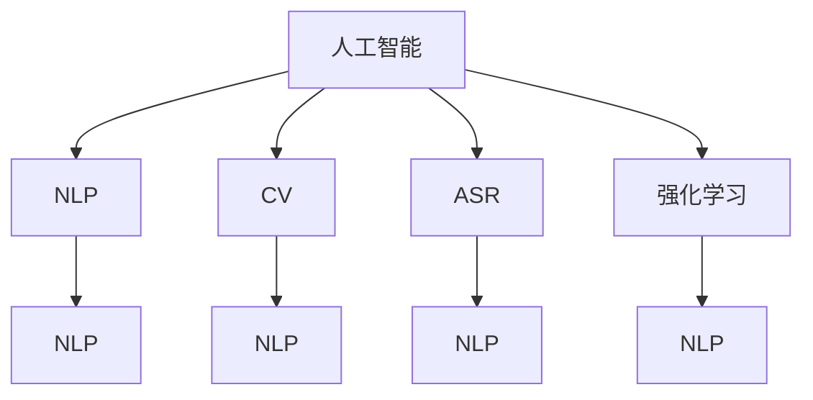

                 

# 人工智能在人机交互中的应用

> 关键词：人工智能,人机交互,自然语言处理(NLP),计算机视觉(CV),深度学习,神经网络,语音识别,强化学习

## 1. 背景介绍

### 1.1 问题由来
随着科技的不断进步，人工智能(AI)技术在各个领域的应用已经越来越广泛。人机交互作为AI技术的重要应用之一，近年来也得到了长足的发展。无论是聊天机器人、智能助手，还是虚拟现实(VR)和增强现实(AR)技术，都在改变着人们与计算机交互的方式。

人机交互的核心目标是通过智能算法和交互界面，实现用户与计算机之间的无缝、自然、高效的沟通。这不仅需要计算机能够理解、处理和生成自然语言，还需要具备视觉、听觉等多模态感知能力，以及复杂环境下的决策和控制能力。

### 1.2 问题核心关键点
人机交互的核心挑战在于如何让计算机具备与人类相媲美的感知、理解和生成能力。近年来，AI在自然语言处理(NLP)、计算机视觉(CV)、语音识别等领域取得了显著进展，推动了人机交互技术的发展。

具体而言，以下几方面是实现人机交互的关键：

1. **自然语言理解**：理解人类语言的含义和语境，实现准确的信息提取和知识获取。
2. **自然语言生成**：生成符合语义、语法规则的自然语言，与人类自然沟通。
3. **多模态感知**：融合视觉、听觉等多模态信息，提升交互系统的感知能力。
4. **智能决策与控制**：根据用户输入和环境变化，进行复杂决策和行为控制。

这些核心能力的实现，离不开深度学习、神经网络等AI技术的支持。本节将重点介绍基于这些技术的核心算法和具体操作步骤。

### 1.3 问题研究意义
研究人机交互技术，对于提升用户体验、推动各行各业的智能化转型具有重要意义：

1. **提升用户满意度**：通过自然、智能的交互方式，减少用户与机器的沟通障碍，提升使用体验。
2. **优化业务流程**：自动化处理大量重复性、繁琐的交互任务，提升工作效率。
3. **推动产业升级**：实现个性化定制、个性化服务，增强企业竞争力。
4. **拓展应用场景**：为智能家居、智能医疗、智能交通等垂直行业带来新机遇。

## 2. 核心概念与联系

### 2.1 核心概念概述

为更好地理解人机交互技术，本节将介绍几个关键核心概念：

- **人工智能(AI)**：指模拟、延伸和扩展人的智能能力，通过计算机算法和数据驱动实现各种智能任务。
- **自然语言处理(NLP)**：指计算机对自然语言进行处理、理解、生成等任务，是实现人机交互的基础。
- **计算机视觉(CV)**：指计算机对视觉信息进行获取、处理、理解和生成，是实现视觉人机交互的重要手段。
- **语音识别(ASR)**：指计算机对人类语音进行识别、理解和生成，是实现语音人机交互的核心技术。
- **强化学习(Reinforcement Learning, RL)**：指通过与环境的交互，学习最优策略以实现目标的任务，常用于智能决策和控制。

这些核心概念之间的逻辑关系可以通过以下Mermaid流程图来展示：



这个流程图展示的核心概念之间的联系：

1. 人工智能包含NLP、CV、ASR、RL等多个子领域，是实现人机交互的技术基础。
2. NLP通过自然语言理解与生成，实现文本与计算机的交互。
3. CV通过图像和视频的处理，实现视觉与计算机的交互。
4. ASR通过语音识别与合成，实现语音与计算机的交互。
5. RL通过智能决策与控制，提升计算机的自主性和智能水平。

## 3. 核心算法原理 & 具体操作步骤

### 3.1 算法原理概述

人机交互技术的核心在于如何让计算机具备自然语言理解、多模态感知、智能决策和控制的能力。这些能力主要通过深度学习、神经网络等技术实现。

具体而言，以下几方面是实现人机交互的关键算法原理：

1. **序列到序列模型(Sequence-to-Sequence Model)**：用于自然语言处理任务，如机器翻译、对话系统等。该模型通过编码器将输入序列转化为向量表示，再通过解码器生成输出序列。
2. **注意力机制(Attention Mechanism)**：用于增强序列到序列模型的表现，通过动态调整关注点，提高模型对输入和输出的关注度。
3. **卷积神经网络(Convolutional Neural Network, CNN)**：用于图像处理任务，如图像分类、目标检测等。通过卷积层提取特征，最大池化层提取关键信息。
4. **循环神经网络(Recurrent Neural Network, RNN)**：用于时序数据处理任务，如语音识别、时间序列预测等。通过循环结构，模型能够处理变长输入。
5. **变分自编码器(Variational Autoencoder, VAE)**：用于多模态数据融合任务，如图像与文本联合表示。通过编码器将数据压缩成向量，解码器再生成原数据。
6. **强化学习(RL)**：用于智能决策和控制任务，如自动驾驶、游戏AI等。通过奖励机制和环境反馈，模型学习最优策略。

### 3.2 算法步骤详解

人机交互技术的实现通常包括以下几个关键步骤：

**Step 1: 数据预处理**
- 收集和标注用于训练的数据集，如文本语料库、图像数据集、语音数据集等。
- 对数据进行清洗、去噪、归一化等预处理，以便于模型训练。

**Step 2: 模型选择与训练**
- 选择合适的深度学习模型架构，如LSTM、GRU、CNN、Transformer等。
- 在标注数据集上训练模型，调整模型参数以最小化损失函数。

**Step 3: 模型评估与优化**
- 在验证集上评估模型性能，如准确率、召回率、F1分数等指标。
- 根据评估结果调整模型参数，如学习率、正则化系数、批量大小等。

**Step 4: 模型部署与测试**
- 将训练好的模型部署到实际应用中，如搭建聊天机器人、虚拟现实系统等。
- 收集实际使用数据，持续优化模型性能，提升用户体验。

### 3.3 算法优缺点

人机交互技术的实现存在以下优缺点：

**优点**：
1. **自然流畅**：基于深度学习的技术可以实现与人类自然、流畅的交互。
2. **广泛适用**：适用于文本、图像、语音等多种形式的数据，应用场景广泛。
3. **可扩展性**：可以方便地添加新功能、扩展模型，持续提升性能。

**缺点**：
1. **数据需求高**：需要大量标注数据进行模型训练，获取高质量数据成本较高。
2. **计算资源消耗大**：深度学习模型参数量大，训练和推理过程对计算资源消耗较大。
3. **模型复杂度高**：模型结构复杂，难以理解和调试，容易过拟合。

### 3.4 算法应用领域

人机交互技术在多个领域得到了广泛应用，如：

- **智能客服**：通过聊天机器人提供24小时在线服务，提升客户体验。
- **虚拟现实**：通过虚拟现实技术，提供沉浸式交互体验，如虚拟旅游、虚拟会议等。
- **智能家居**：通过语音助手、智能设备，实现家庭自动化，提升生活便利性。
- **自动驾驶**：通过深度学习和强化学习技术，实现自主导航和智能决策。
- **游戏AI**：通过深度学习技术，提高游戏角色的智能水平，提升游戏体验。

## 4. 数学模型和公式 & 详细讲解 & 举例说明

### 4.1 数学模型构建

本节将使用数学语言对基于深度学习的人机交互技术进行更加严格的刻画。

假设输入为文本序列 $x_1, x_2, \ldots, x_n$，对应的输出为文本序列 $y_1, y_2, \ldots, y_n$。序列到序列模型的基本架构如下：

1. **编码器(Encoder)**：将输入序列 $x_1, x_2, \ldots, x_n$ 转化为向量表示 $e_1, e_2, \ldots, e_n$。
2. **解码器(Decoder)**：将向量表示 $e_1, e_2, \ldots, e_n$ 转化为输出序列 $y_1, y_2, \ldots, y_n$。

编码器和解码器的具体形式如下：

$$
e_i = f_{enc}(x_i)
$$
$$
y_j = f_{dec}(e_j, y_{j-1})
$$

其中，$f_{enc}$ 和 $f_{dec}$ 分别为编码器和解码器的函数。在实际实现中，通常使用循环神经网络(RNN)或Transformer模型。

### 4.2 公式推导过程

以Transformer模型为例，推导其基本结构和优化目标。

Transformer模型由自注意力机制和前馈神经网络组成，其架构如下：

```
Embedding --> 多头自注意力 --> 前馈神经网络 --> 输出层
```

编码器-解码器结构如下：

```
Encoder --> Attention --> Decoder --> Output
```

Transformer的优化目标是最小化交叉熵损失函数：

$$
\mathcal{L} = -\frac{1}{N}\sum_{i=1}^N \sum_{j=1}^T y_{ij} \log p(y_{ij})
$$

其中，$y_{ij}$ 为第 $i$ 个样本的第 $j$ 个时间步的标签，$p(y_{ij})$ 为模型预测的概率分布。在训练过程中，通过反向传播算法计算梯度并更新模型参数，使得模型的预测分布与真实标签分布尽量一致。

### 4.3 案例分析与讲解

以机器翻译为例，说明Transformer模型在其中的应用。

假设输入为英文文本 "I love deep learning"，目标输出为中文翻译 "我喜欢深度学习"。将英文文本输入编码器，得到向量表示 $e_1, e_2, \ldots, e_{12}$，其中 $n=12$ 为输入序列长度。将向量 $e_1$ 输入解码器，得到输出序列 $y_1, y_2, \ldots, y_{12}$，其中 $m=12$ 为输出序列长度。通过训练模型，最终输出正确的翻译 "我喜欢深度学习"。

## 5. 项目实践：代码实例和详细解释说明

### 5.1 开发环境搭建

在进行人机交互技术开发前，我们需要准备好开发环境。以下是使用Python进行PyTorch开发的环境配置流程：

1. 安装Anaconda：从官网下载并安装Anaconda，用于创建独立的Python环境。

2. 创建并激活虚拟环境：
```bash
conda create -n pytorch-env python=3.8 
conda activate pytorch-env
```

3. 安装PyTorch：根据CUDA版本，从官网获取对应的安装命令。例如：
```bash
conda install pytorch torchvision torchaudio cudatoolkit=11.1 -c pytorch -c conda-forge
```

4. 安装相关库：
```bash
pip install numpy pandas scikit-learn torch transformers
```

完成上述步骤后，即可在`pytorch-env`环境中开始开发实践。

### 5.2 源代码详细实现

这里我们以使用PyTorch实现一个简单的聊天机器人为例，详细说明人机交互技术开发的代码实现。

首先，定义模型类 `Chatbot`：

```python
import torch
import torch.nn as nn
import torch.nn.functional as F

class Chatbot(nn.Module):
    def __init__(self, vocab_size, embedding_dim, num_layers, hidden_size, dropout):
        super(Chatbot, self).__init__()
        self.encoder = nn.LSTM(embedding_dim, hidden_size, num_layers, dropout=dropout)
        self.decoder = nn.LSTM(hidden_size, vocab_size, num_layers, dropout=dropout)
        self.embedding = nn.Embedding(vocab_size, embedding_dim)
        self.decoder_layernorm = nn.LayerNorm(embedding_dim)
        self.output_layer = nn.Linear(embedding_dim, vocab_size)

    def forward(self, input, target=None):
        embedding = self.embedding(input)
        encoder_outputs, encoder_last = self.encoder(embedding)
        if target is not None:
            target = target[:, :-1]
            target_length = target.size(1)
            decoder_outputs, _ = self.decoder(encoder_outputs, target.view(1, 1, -1))
            output = self.output_layer(decoder_outputs.view(1, -1))
            loss = F.nll_loss(output, target.view(1, -1))
        else:
            output, _ = self.decoder(encoder_outputs, None)
            output = self.output_layer(output.view(1, -1))
        return output, loss, encoder_last
```

然后，定义训练函数 `train` 和评估函数 `evaluate`：

```python
def train(model, optimizer, train_loader, criterion, device):
    model.train()
    losses = []
    for batch in train_loader:
        input, target = batch
        input, target = input.to(device), target.to(device)
        optimizer.zero_grad()
        output, loss, _ = model(input, target)
        loss.backward()
        optimizer.step()
        losses.append(loss.item())
    return sum(losses) / len(train_loader)

def evaluate(model, test_loader, device):
    model.eval()
    losses = []
    with torch.no_grad():
        for batch in test_loader:
            input, target = batch
            input, target = input.to(device), target.to(device)
            output, loss, _ = model(input, target)
            losses.append(loss.item())
    return sum(losses) / len(test_loader)
```

接着，定义训练和评估流程：

```python
from torch.utils.data import DataLoader
from tqdm import tqdm

# 加载数据集
data = load_data()
train_dataset = Dataset(data['train'])
test_dataset = Dataset(data['test'])

# 创建数据加载器
train_loader = DataLoader(train_dataset, batch_size=64, shuffle=True)
test_loader = DataLoader(test_dataset, batch_size=64, shuffle=False)

# 初始化模型和优化器
model = Chatbot(len(vocab), embedding_dim, num_layers, hidden_size, dropout)
optimizer = Adam(model.parameters(), lr=0.01)

# 定义训练和评估参数
device = torch.device('cuda' if torch.cuda.is_available() else 'cpu')
criterion = nn.CrossEntropyLoss()

# 开始训练
for epoch in range(num_epochs):
    loss = train(model, optimizer, train_loader, criterion, device)
    print(f'Epoch {epoch+1}, Loss: {loss:.3f}')
    acc = evaluate(model, test_loader, device)
    print(f'Epoch {epoch+1}, Accuracy: {acc:.3f}')
```

以上就是使用PyTorch实现一个简单的聊天机器人的代码实现。可以看到，通过定义模型、训练函数和评估函数，可以方便地搭建和训练人机交互系统的核心算法。

### 5.3 代码解读与分析

让我们再详细解读一下关键代码的实现细节：

**模型类 Chatbot**：
- `__init__`方法：初始化模型的各层参数，包括LSTM编码器和解码器、嵌入层、层归一化层、输出层。
- `forward`方法：定义模型的前向传播过程，包括编码器、解码器、输出层等模块的调用。

**训练函数 train**：
- 在每个批次的数据上，前向传播计算输出和损失，反向传播更新模型参数，并记录损失。
- 循环迭代所有批次，计算平均损失。

**评估函数 evaluate**：
- 在测试集上评估模型的预测准确率，计算平均损失。
- 使用 `torch.no_grad()` 避免不必要的计算，提高评估效率。

**训练和评估流程**：
- 使用 `tqdm` 进行进度条显示，增强用户体验。
- 循环迭代多个epoch，在训练集上更新模型参数，在测试集上评估模型性能。
- 最后输出训练和测试集上的平均损失和准确率。

## 6. 实际应用场景

### 6.1 智能客服

智能客服系统是人工智能在人机交互中应用最广泛的场景之一。通过使用聊天机器人，企业可以显著提升客户服务效率，降低人力成本，提升客户满意度。

在实现智能客服系统时，通常会采用如下流程：

1. **数据收集与标注**：收集历史客服对话数据，标注出问题和答案对。
2. **模型训练**：使用标注数据训练聊天机器人模型，优化自然语言理解和生成能力。
3. **模型部署**：将训练好的模型部署到客服系统中，提供24小时在线服务。
4. **持续优化**：通过用户反馈和新数据，持续优化模型性能，提升用户体验。

通过智能客服系统，客户可以自助解决常见问题，企业也能解放大量人力，专注于高价值任务。智能客服系统已经成为企业提升客户体验和服务水平的重要工具。

### 6.2 虚拟现实

虚拟现实(VR)技术通过模拟逼真的三维环境，提供沉浸式的人机交互体验。在虚拟现实应用中，人机交互技术扮演着重要角色。

例如，在虚拟旅游系统中，用户可以通过自然语言与虚拟导游进行互动，获取旅游信息和建议。在虚拟会议中，虚拟角色可以通过语音和文字与用户进行实时沟通，增强会议的参与感和互动性。

虚拟现实技术的广泛应用，正在改变人们的生产生活方式，带来全新的体验和机遇。

### 6.3 智能家居

智能家居系统通过人机交互技术，实现家庭自动化和智能化管理。用户可以通过语音助手、智能设备等与家居系统进行互动，实现语音控制、场景模式切换等功能。

在智能家居系统中，人机交互技术的应用包括：

1. **语音识别与理解**：通过语音识别技术，将用户语音转换为文字指令，并理解其含义。
2. **自然语言生成**：生成符合语义规则的语音反馈，与用户进行自然交互。
3. **场景模式切换**：根据用户指令，自动切换不同的家居场景模式，如起床模式、娱乐模式等。
4. **设备控制**：通过语音和自然语言处理技术，控制智能设备，如灯光、空调、窗帘等。

智能家居技术正在逐步改变人们的居住方式，提升家居智能化水平，带来更舒适、便捷的生活体验。

### 6.4 自动驾驶

自动驾驶技术是人工智能在控制和决策领域的典型应用。通过深度学习和强化学习技术，车辆能够自动感知环境、做出决策并执行操作，实现自主导航。

在自动驾驶系统中，人机交互技术的应用包括：

1. **环境感知**：通过摄像头、雷达等传感器，实时感知周围环境，并转换为计算机可以理解的信息。
2. **自然语言理解**：通过语音识别和自然语言处理技术，理解用户的导航指令，如目的地、路线等。
3. **智能决策**：根据环境感知和用户指令，结合交通规则、导航地图等信息，做出最优决策。
4. **语音反馈**：通过语音合成技术，将决策结果和路径信息反馈给用户，增强互动体验。

自动驾驶技术的发展，正在逐步实现无人驾驶的愿景，提升交通安全和出行效率，带来革命性的交通方式。

## 7. 工具和资源推荐

### 7.1 学习资源推荐

为了帮助开发者系统掌握人机交互技术的理论基础和实践技巧，这里推荐一些优质的学习资源：

1. **《深度学习》课程**：斯坦福大学开设的深度学习课程，系统讲解深度学习的基本原理和应用。
2. **《自然语言处理综论》书籍**：斯坦福大学自然语言处理课程讲义，涵盖自然语言处理的各个方面。
3. **《计算机视觉: 算法与应用》书籍**：详细讲解计算机视觉的基本原理和算法，涵盖图像处理、目标检测等任务。
4. **《语音识别与合成》书籍**：系统介绍语音识别和合成的基本原理和算法，涵盖自动语音识别、说话人识别、语音合成等任务。
5. **《强化学习基础》书籍**：全面介绍强化学习的理论和算法，涵盖Q-learning、策略梯度、深度强化学习等方法。

通过对这些资源的学习实践，相信你一定能够快速掌握人机交互技术的精髓，并用于解决实际的NLP问题。

### 7.2 开发工具推荐

高效的开发离不开优秀的工具支持。以下是几款用于人机交互技术开发的常用工具：

1. **PyTorch**：基于Python的开源深度学习框架，灵活、高效，适用于各种深度学习任务。
2. **TensorFlow**：由Google主导开发的开源深度学习框架，功能强大，适用于大规模工程应用。
3. **Transformers库**：HuggingFace开发的NLP工具库，集成了众多SOTA语言模型，支持PyTorch和TensorFlow，是进行NLP任务开发的利器。
4. **TensorBoard**：TensorFlow配套的可视化工具，实时监测模型训练状态，提供丰富的图表呈现方式。
5. **Weights & Biases**：模型训练的实验跟踪工具，记录和可视化模型训练过程中的各项指标。
6. **Jupyter Notebook**：交互式开发环境，支持代码编写、执行和版本控制，便于快速迭代和共享。

合理利用这些工具，可以显著提升人机交互技术开发的效率，加速创新迭代的步伐。

### 7.3 相关论文推荐

人机交互技术的发展离不开学界的持续研究。以下是几篇奠基性的相关论文，推荐阅读：

1. **Sequence-to-Sequence Learning with Neural Networks**：提出序列到序列模型，用于机器翻译、对话系统等任务。
2. **Attention Is All You Need**：提出Transformer模型，用于自然语言处理任务，取得突破性进展。
3. **Convolutional Neural Networks for Sentence Classification**：提出CNN用于文本分类任务，提升分类效果。
4. **Learning Phrase Representations using RNN Encoder-Decoder for Statistical Machine Translation**：提出基于RNN的序列到序列模型，用于机器翻译任务。
5. **Learning Transferable Feature Representations for Multimodal Sequence Learning**：提出多模态序列学习方法，融合视觉、文本等多模态数据。

这些论文代表了大规模人机交互技术的发展脉络。通过学习这些前沿成果，可以帮助研究者把握学科前进方向，激发更多的创新灵感。

## 8. 总结：未来发展趋势与挑战

### 8.1 总结

本文对基于深度学习的人机交互技术进行了全面系统的介绍。首先阐述了人机交互技术的研究背景和意义，明确了深度学习、自然语言处理、计算机视觉等核心技术在实现人机交互中的关键作用。其次，从原理到实践，详细讲解了基于深度学习的人机交互技术的核心算法和具体操作步骤，给出了代码实例和详细解释说明。同时，本文还广泛探讨了人机交互技术在智能客服、虚拟现实、智能家居、自动驾驶等多个领域的应用前景，展示了人机交互技术的巨大潜力。此外，本文精选了人机交互技术的各类学习资源，力求为读者提供全方位的技术指引。

通过本文的系统梳理，可以看到，基于深度学习的人机交互技术正在成为智能系统的重要基础，极大地提升了用户的交互体验和系统性能。未来，随着深度学习技术的不断发展，人机交互技术还将迎来更多突破，为各行各业带来更多的智能化变革。

### 8.2 未来发展趋势

展望未来，人机交互技术将呈现以下几个发展趋势：

1. **深度强化学习的发展**：深度强化学习作为人机交互的核心技术之一，将得到进一步的发展。通过更高效、更鲁棒的强化学习算法，人机交互系统将具备更强的自主性和智能性。
2. **多模态数据融合**：将视觉、语音、文本等多种模态数据进行融合，提升人机交互系统的感知和理解能力。未来，人机交互系统将能够更全面、更准确地理解用户的意图和需求。
3. **自然语言理解与生成**：自然语言理解与生成技术将得到更大发展，人机交互系统将能够更自然、更流畅地与用户进行互动。
4. **隐私保护与安全**：随着智能系统的广泛应用，隐私保护与安全问题将受到更多关注。人机交互系统将引入更多的隐私保护机制和安全保障措施，确保用户数据安全。
5. **跨语言、跨文化应用**：人机交互系统将具备更强的跨语言、跨文化适应能力，能够处理多种语言和不同文化背景的用户需求。

这些趋势凸显了人机交互技术的广阔前景。这些方向的探索发展，必将进一步提升人机交互系统的性能和应用范围，为人类认知智能的进化带来深远影响。

### 8.3 面临的挑战

尽管人机交互技术已经取得了显著进展，但在迈向更加智能化、普适化应用的过程中，它仍面临着诸多挑战：

1. **数据获取与标注**：人机交互系统需要大量标注数据进行训练，获取高质量标注数据成本较高，且标注过程复杂。如何高效获取和标注数据，将是未来需要解决的重要问题。
2. **模型复杂度与计算资源**：深度学习模型参数量大，计算资源消耗大。如何在不增加计算资源消耗的前提下，提升模型性能，将是未来需要研究的重要方向。
3. **模型泛化性与鲁棒性**：人机交互系统需要在不同环境和数据分布下保持稳定性能，避免灾难性遗忘和过拟合。如何提高模型的泛化性和鲁棒性，将是未来需要重点考虑的问题。
4. **隐私保护与伦理问题**：人机交互系统涉及用户隐私和伦理问题，如数据安全、用户隐私保护、偏见与歧视等。如何在技术设计中充分考虑隐私保护和伦理问题，将是未来需要深入研究的重要课题。

这些挑战需要学界和工业界共同努力，才能推动人机交互技术向更高水平迈进，真正实现智能系统的人性化和普适化。

### 8.4 研究展望

面对人机交互技术所面临的挑战，未来的研究需要在以下几个方面寻求新的突破：

1. **无监督学习和半监督学习**：探索无监督学习和半监督学习方法，减少对大规模标注数据的依赖，提升模型的泛化能力。
2. **模型压缩与优化**：研究模型压缩与优化技术，如剪枝、量化、知识蒸馏等，提高模型性能，降低计算资源消耗。
3. **多模态数据融合**：研究多模态数据融合技术，提升人机交互系统的感知和理解能力，实现视觉、语音、文本等多模态信息的协同处理。
4. **隐私保护与伦理**：引入隐私保护技术，如差分隐私、联邦学习等，保护用户数据安全。同时，研究人机交互系统的伦理问题，确保系统的公平性、透明性和安全性。
5. **跨领域应用**：将人机交互技术应用于更多垂直领域，如医疗、法律、教育等，提升相关行业的智能化水平。

这些研究方向的探索，必将引领人机交互技术迈向更高的台阶，为构建更智能、更安全、更公平的人机交互系统铺平道路。面向未来，人机交互技术还需要与其他人工智能技术进行更深入的融合，如知识表示、因果推理、强化学习等，多路径协同发力，共同推动人机交互系统的进步。只有勇于创新、敢于突破，才能不断拓展人机交互系统的边界，让智能技术更好地造福人类社会。

## 9. 附录：常见问题与解答

**Q1：人机交互技术有哪些常见应用？**

A: 人机交互技术广泛应用于智能客服、虚拟现实、智能家居、自动驾驶、游戏AI等多个领域。以下是几个典型应用：

1. **智能客服**：通过聊天机器人提供24小时在线服务，提升客户体验。
2. **虚拟现实**：提供沉浸式人机交互体验，如虚拟旅游、虚拟会议等。
3. **智能家居**：实现语音控制、场景模式切换等家居自动化功能。
4. **自动驾驶**：通过深度学习和强化学习技术，实现自主导航和智能决策。
5. **游戏AI**：提高游戏角色的智能水平，增强游戏体验。

**Q2：人机交互技术的核心算法有哪些？**

A: 人机交互技术的核心算法包括深度学习、自然语言处理、计算机视觉、语音识别、强化学习等。以下是几个典型算法：

1. **序列到序列模型**：用于自然语言处理任务，如机器翻译、对话系统等。
2. **Transformer模型**：用于自然语言处理任务，取得突破性进展。
3. **卷积神经网络(CNN)**：用于图像处理任务，如图像分类、目标检测等。
4. **循环神经网络(RNN)**：用于时序数据处理任务，如语音识别、时间序列预测等。
5. **变分自编码器(VAE)**：用于多模态数据融合任务，如图像与文本联合表示。
6. **强化学习(RL)**：用于智能决策和控制任务，如自动驾驶、游戏AI等。

**Q3：人机交互技术在实际应用中需要注意哪些问题？**

A: 人机交互技术在实际应用中需要注意以下问题：

1. **数据获取与标注**：需要大量标注数据进行模型训练，获取高质量标注数据成本较高。
2. **模型复杂度与计算资源**：深度学习模型参数量大，计算资源消耗大。
3. **模型泛化性与鲁棒性**：模型需要在不同环境和数据分布下保持稳定性能，避免灾难性遗忘和过拟合。
4. **隐私保护与伦理问题**：涉及用户隐私和伦理问题，如数据安全、用户隐私保护、偏见与歧视等。

**Q4：如何提升人机交互系统的性能？**

A: 提升人机交互系统性能可以从以下几个方面入手：

1. **数据增强**：通过数据增强技术，扩充训练集，提高模型泛化能力。
2. **模型优化**：使用模型压缩与优化技术，如剪枝、量化、知识蒸馏等，提高模型性能。
3. **多模态融合**：将视觉、语音、文本等多模态数据进行融合，提升系统感知和理解能力。
4. **隐私保护**：引入隐私保护技术，如差分隐私、联邦学习等，保护用户数据安全。
5. **跨领域应用**：将人机交互技术应用于更多垂直领域，提升相关行业的智能化水平。

**Q5：人机交互技术未来的发展方向有哪些？**

A: 人机交互技术未来的发展方向包括：

1. **深度强化学习的发展**：深度强化学习作为核心技术之一，将得到进一步发展。
2. **多模态数据融合**：融合视觉、语音、文本等多种模态数据，提升感知和理解能力。
3. **自然语言理解与生成**：提升自然语言理解与生成能力，实现更自然、流畅的互动。
4. **隐私保护与安全**：引入隐私保护措施，确保用户数据安全和系统伦理。
5. **跨语言、跨文化应用**：具备跨语言、跨文化适应能力，处理多种语言和文化背景的需求。

---

作者：禅与计算机程序设计艺术 / Zen and the Art of Computer Programming

