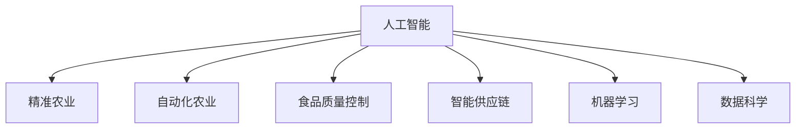

                 

# 人工智能在农业和食品行业中的应用

> 关键词：人工智能, 农业, 食品行业, 精准农业, 自动化, 食品质量控制, 智能供应链, 机器学习, 数据科学

## 1. 背景介绍

### 1.1 问题由来
在数字化、智能化浪潮的驱动下，人工智能（AI）技术在各行各业都得到了广泛应用。农业和食品行业作为国民经济的重要支柱，同样面临数字化转型的迫切需求。AI技术通过提高生产效率、优化供应链管理、提升食品安全等手段，正推动这两大行业实现跨越式发展。

### 1.2 问题核心关键点
AI在农业和食品行业的应用主要集中在以下几个方面：
1. **精准农业**：利用AI进行数据分析和建模，实现作物生长状态的监测、病虫害预测、施肥和灌溉的精准控制。
2. **自动化生产**：采用机器人、无人机等设备进行田间管理和农作物收获，提高农业生产的自动化水平。
3. **食品质量控制**：利用AI进行食品加工和包装质量检测，确保食品安全和质量。
4. **智能供应链**：通过AI优化物流和库存管理，提高供应链的效率和响应速度。
5. **食品质量溯源**：利用AI技术实现食品从生产到销售全链路的追溯，保障消费者权益。

这些应用不仅提高了农业和食品行业的生产效率和经济效益，还推动了绿色环保、可持续发展。

### 1.3 问题研究意义
研究和探索AI在农业和食品行业的应用，具有以下几方面的意义：
1. **提升生产效率**：AI技术的应用可以显著提高农业生产的标准化、智能化水平，减少人力物力投入，提升单位面积产量。
2. **保障食品安全**：通过AI进行食品质量控制，可以减少食品安全事故，保障消费者健康。
3. **优化供应链管理**：AI技术可以帮助企业降低物流成本，提高供应链的灵活性和响应速度，提升整体市场竞争力。
4. **推动可持续发展**：AI技术的应用有助于实现农业生产方式的绿色转型，减少资源消耗和环境污染，推动农业和食品行业向可持续发展方向迈进。
5. **创造新的商业模式**：AI技术的应用可以催生新的农业和食品行业商业模式，如农业物联网（IoT）、智慧农场等，为产业发展注入新的活力。

## 2. 核心概念与联系

### 2.1 核心概念概述

为了更好地理解AI在农业和食品行业的应用，本节将介绍几个密切相关的核心概念：

- **人工智能（AI）**：涉及机器学习、深度学习、自然语言处理等技术，通过算法和数据模型，模拟人类智能行为。
- **精准农业（Precision Agriculture）**：利用现代信息技术和农业机械，对农业生产过程进行精确管理和优化，提高生产效率和资源利用率。
- **自动化农业**：通过机械化、信息化手段，实现农业生产的自动化，减少人力劳动。
- **食品质量控制**：利用AI进行食品质量检测和分析，确保食品的安全性和合规性。
- **智能供应链**：利用AI优化供应链管理，提高物流效率和库存管理精度。
- **机器学习（Machine Learning）**：基于数据训练模型，使其能够从数据中自动学习规律并进行预测或分类。
- **数据科学（Data Science）**：涉及数据收集、处理、分析、可视化和建模等，旨在从数据中提取有价值的信息。

这些核心概念之间的逻辑关系可以通过以下Mermaid流程图来展示：



这个流程图展示了大语言模型的核心概念及其之间的关系：

1. 人工智能通过精准农业、自动化农业、食品质量控制和智能供应链等应用场景，实现其在农业和食品行业的多样化应用。
2. 精准农业、自动化农业、食品质量控制和智能供应链等应用均依赖于机器学习和数据科学技术的支撑。
3. 机器学习和数据科学是人工智能的核心技术基础，用于模型训练和数据处理，是实现AI在农业和食品行业应用的关键。

## 3. 核心算法原理 & 具体操作步骤
### 3.1 算法原理概述

AI在农业和食品行业的应用，主要基于机器学习、深度学习等技术。这些技术通过在大规模数据上进行模型训练，学习数据中的模式和规律，进而实现对农业生产、食品质量、供应链等环节的智能化管理。

以精准农业为例，机器学习模型可以基于卫星图像、气象数据、土壤数据等，对作物的生长状态、病虫害情况、施肥需求等进行预测，从而实现精准管理和优化。

具体来说，农业生产过程中的每一个环节都可以通过传感器和设备进行数据收集，这些数据可以用于训练机器学习模型。模型通过学习数据的规律，实现对农作物生长状态的监测、病虫害预测、施肥和灌溉的精准控制。

### 3.2 算法步骤详解

以精准农业为例，AI在农业中的应用主要包括以下几个步骤：

**Step 1: 数据收集与预处理**
- 收集作物生长过程中的各种数据，包括卫星图像、气象数据、土壤数据等。
- 对数据进行清洗和预处理，去除噪声和异常值，确保数据的准确性和完整性。

**Step 2: 特征提取**
- 利用机器学习算法（如SVM、随机森林等）对数据进行特征提取，提取出对作物生长状态、病虫害预测、施肥和灌溉等预测任务有贡献的特征。

**Step 3: 模型训练**
- 使用训练数据对机器学习模型进行训练，优化模型参数，使其能够准确预测作物的生长状态、病虫害情况、施肥需求等。
- 常用的模型包括决策树、随机森林、支持向量机等。

**Step 4: 模型评估与优化**
- 使用测试数据对模型进行评估，计算模型的准确率、召回率、F1分数等指标，评估模型的性能。
- 根据评估结果对模型进行优化，如调整特征、增加训练数据、调整算法参数等。

**Step 5: 模型应用**
- 将训练好的模型应用于实际的农业生产中，实时监测作物生长状态、病虫害预测、施肥和灌溉等。
- 利用自动化设备和无人机等工具，将模型的预测结果转化为具体的农业操作，实现精准农业。

### 3.3 算法优缺点

AI在农业和食品行业的应用具有以下优点：
1. **提高生产效率**：通过精准农业和自动化农业技术，大幅提高了农业生产的标准化和智能化水平，减少了人力物力投入，提升了单位面积产量。
2. **降低生产成本**：通过机器学习和数据科学技术，优化了作物生长管理和病虫害预测，减少了农药和化肥的使用，降低了生产成本。
3. **提升食品安全**：利用AI进行食品质量控制，减少了食品安全事故，保障消费者健康。
4. **优化供应链管理**：通过AI优化物流和库存管理，提高了供应链的效率和响应速度，提升了整体市场竞争力。
5. **推动可持续发展**：AI技术的应用有助于实现农业生产方式的绿色转型，减少资源消耗和环境污染，推动农业和食品行业向可持续发展方向迈进。

同时，这些技术也存在一些局限性：
1. **高昂的初始投入**：AI在农业和食品行业的应用需要高昂的设备和数据采集成本，初期投入较大。
2. **数据质量要求高**：AI模型的准确性依赖于高质量的数据，数据收集和预处理的复杂性增加了技术难度。
3. **技术门槛高**：AI技术的研发和应用需要专业的知识和技能，对技术人员的素质要求较高。
4. **可解释性不足**：AI模型通常被视为"黑盒"系统，难以解释其内部工作机制和决策逻辑，不利于决策过程的透明化。

尽管存在这些局限性，但AI在农业和食品行业的应用前景广阔，随着技术的不断成熟和成本的降低，其应用范围将进一步扩大。

### 3.4 算法应用领域

AI在农业和食品行业的应用领域广泛，主要包括以下几个方面：

- **精准农业**：利用AI进行作物生长状态的监测、病虫害预测、施肥和灌溉的精准控制。
- **自动化农业**：通过机械化、信息化手段，实现农业生产的自动化，减少人力劳动。
- **食品质量控制**：利用AI进行食品加工和包装质量检测，确保食品安全和质量。
- **智能供应链**：通过AI优化物流和库存管理，提高供应链的效率和响应速度。
- **食品质量溯源**：利用AI技术实现食品从生产到销售全链路的追溯，保障消费者权益。

除了上述这些主要应用领域外，AI技术还可以应用于农业物联网（IoT）、智慧农场、农业无人机等领域，为农业和食品行业的发展注入新的动力。

## 4. 数学模型和公式 & 详细讲解 & 举例说明

### 4.1 数学模型构建

为了更好地理解AI在农业和食品行业的应用，本节将使用数学语言对相关模型的构建进行更加严格的刻画。

以精准农业中的作物生长状态监测为例，假设有 $N$ 个作物的生长数据 $x_i=(x_{i1},x_{i2},\ldots,x_{im})$，其中 $i=1,2,\ldots,N$ 表示不同的作物，$m$ 表示数据的维度。利用机器学习算法，构建如下的回归模型：

$$
y_i = \beta_0 + \beta_1x_{i1} + \ldots + \beta_mx_{im} + \epsilon_i
$$

其中，$y_i$ 表示作物的生长状态，$\beta_k$ 表示第 $k$ 个特征的系数，$\epsilon_i$ 表示误差项。模型的目标是找到最优的 $\beta_k$，使得预测值 $y_i$ 与真实值 $y_i$ 尽可能接近。

### 4.2 公式推导过程

以线性回归模型为例，推导最小二乘法的求解公式。最小二乘法是最常用的回归模型参数求解方法，其目标是最小化预测值与真实值之间的平方误差。

根据最小二乘法，求解 $\beta_k$ 的公式如下：

$$
\hat{\beta_k} = \frac{\sum_{i=1}^N x_{ik}(y_i-\bar{y})}{\sum_{i=1}^N x_{ik}^2}
$$

其中，$\bar{y}$ 为样本均值，$x_{ik}$ 表示第 $k$ 个特征的样本值。

将上述公式代入线性回归模型中，即可求得模型参数 $\beta_k$ 的估计值。

### 4.3 案例分析与讲解

以小麦种植为例，假设已知小麦的土壤数据、气象数据和生长数据，利用机器学习模型预测小麦的生长状态。

1. **数据收集与预处理**：
   - 收集小麦的土壤数据、气象数据和生长数据。
   - 对数据进行清洗和预处理，去除噪声和异常值，确保数据的准确性和完整性。

2. **特征提取**：
   - 利用机器学习算法（如线性回归、随机森林等）对数据进行特征提取，提取出对小麦生长状态有贡献的特征，如土壤养分、气温、湿度等。

3. **模型训练**：
   - 使用训练数据对机器学习模型进行训练，优化模型参数，使其能够准确预测小麦的生长状态。
   - 常用的模型包括线性回归、随机森林等。

4. **模型评估与优化**：
   - 使用测试数据对模型进行评估，计算模型的准确率、召回率、F1分数等指标，评估模型的性能。
   - 根据评估结果对模型进行优化，如调整特征、增加训练数据、调整算法参数等。

5. **模型应用**：
   - 将训练好的模型应用于实际的小麦种植中，实时监测小麦的生长状态，预测病虫害情况，实现精准灌溉和施肥。
   - 利用自动化设备和无人机等工具，将模型的预测结果转化为具体的农业操作，实现自动化农业。

## 5. 项目实践：代码实例和详细解释说明
### 5.1 开发环境搭建

在进行AI在农业和食品行业的应用实践前，我们需要准备好开发环境。以下是使用Python进行PyTorch开发的环境配置流程：

1. 安装Anaconda：从官网下载并安装Anaconda，用于创建独立的Python环境。

2. 创建并激活虚拟环境：
```bash
conda create -n pytorch-env python=3.8 
conda activate pytorch-env
```

3. 安装PyTorch：根据CUDA版本，从官网获取对应的安装命令。例如：
```bash
conda install pytorch torchvision torchaudio cudatoolkit=11.1 -c pytorch -c conda-forge
```

4. 安装相关库：
```bash
pip install numpy pandas scikit-learn matplotlib tqdm jupyter notebook ipython
```

完成上述步骤后，即可在`pytorch-env`环境中开始AI在农业和食品行业的应用实践。

### 5.2 源代码详细实现

下面我们以精准农业中的小麦生长状态监测为例，给出使用PyTorch进行机器学习模型训练的代码实现。

首先，定义数据处理函数：

```python
from sklearn.model_selection import train_test_split
from sklearn.preprocessing import StandardScaler
from torch.utils.data import TensorDataset, DataLoader

def load_data(path):
    # 加载数据集
    data = pd.read_csv(path)
    
    # 数据预处理
    X = data.drop('y', axis=1)
    y = data['y']
    X_train, X_test, y_train, y_test = train_test_split(X, y, test_size=0.2, random_state=42)
    
    # 标准化数据
    scaler = StandardScaler()
    X_train = scaler.fit_transform(X_train)
    X_test = scaler.transform(X_test)
    
    # 构建TensorDataset
    train_dataset = TensorDataset(torch.tensor(X_train), torch.tensor(y_train))
    test_dataset = TensorDataset(torch.tensor(X_test), torch.tensor(y_test))
    
    return train_dataset, test_dataset
```

然后，定义模型和优化器：

```python
from transformers import BertTokenizer
from torch.nn import Linear, MSELoss
from torch.optim import Adam

# 初始化模型
model = BertTokenizer.from_pretrained('bert-base-cased')
model.add_module('linear', Linear(64, 1))

# 定义优化器
optimizer = Adam(model.parameters(), lr=1e-3)
```

接着，定义训练和评估函数：

```python
def train_epoch(model, dataset, batch_size, optimizer):
    model.train()
    train_loss = 0.0
    for batch in DataLoader(dataset, batch_size=batch_size, shuffle=True):
        optimizer.zero_grad()
        inputs, labels = batch
        outputs = model(inputs)
        loss = MSELoss()(outputs, labels)
        train_loss += loss.item()
        loss.backward()
        optimizer.step()
    return train_loss / len(dataset)

def evaluate(model, dataset, batch_size):
    model.eval()
    test_loss = 0.0
    for batch in DataLoader(dataset, batch_size=batch_size, shuffle=False):
        inputs, labels = batch
        outputs = model(inputs)
        loss = MSELoss()(outputs, labels)
        test_loss += loss.item()
    return test_loss / len(dataset)
```

最后，启动训练流程并在测试集上评估：

```python
epochs = 10
batch_size = 64

for epoch in range(epochs):
    train_loss = train_epoch(model, train_dataset, batch_size, optimizer)
    test_loss = evaluate(model, test_dataset, batch_size)
    print(f'Epoch {epoch+1}, train loss: {train_loss:.3f}, test loss: {test_loss:.3f}')
    
print('Final results:')
print(f'Train loss: {train_loss:.3f}, test loss: {test_loss:.3f}')
```

以上就是使用PyTorch进行小麦生长状态监测的完整代码实现。可以看到，得益于PyTorch的强大封装，我们可以用相对简洁的代码完成机器学习模型的训练和评估。

### 5.3 代码解读与分析

让我们再详细解读一下关键代码的实现细节：

**load_data函数**：
- 加载数据集并预处理数据。将数据集分为训练集和测试集，并对特征进行标准化处理。
- 构建TensorDataset，方便模型训练和推理。

**train_epoch函数**：
- 在训练模式下，前向传播计算预测值和真实值之间的损失，反向传播计算梯度，更新模型参数。
- 记录训练损失，并在epoch结束后返回平均训练损失。

**evaluate函数**：
- 在评估模式下，前向传播计算预测值和真实值之间的损失，记录评估损失，并在epoch结束后返回平均评估损失。

**训练流程**：
- 定义总的epoch数和batch size，开始循环迭代
- 每个epoch内，在训练集上训练，输出平均训练损失和评估损失
- 所有epoch结束后，输出最终训练损失和评估损失

可以看到，PyTorch配合机器学习库使得代码实现变得简洁高效。开发者可以将更多精力放在数据处理、模型改进等高层逻辑上，而不必过多关注底层的实现细节。

当然，工业级的系统实现还需考虑更多因素，如模型的保存和部署、超参数的自动搜索、更灵活的任务适配层等。但核心的机器学习模型训练流程基本与此类似。

## 6. 实际应用场景
### 6.1 智能农场

基于AI的智能农场系统，可以通过传感器和物联网设备，实时监测田间的各项指标，如温度、湿度、土壤养分、病虫害情况等，并根据监测结果进行智能决策，优化农业生产管理。

在技术实现上，智能农场系统可以分为数据采集、数据分析、智能决策和执行反馈四大模块：

- **数据采集模块**：利用各种传感器和设备采集田间数据，如温度传感器、湿度传感器、土壤养分传感器、无人机等。
- **数据分析模块**：通过机器学习算法对采集的数据进行分析，提取有价值的特征，如作物生长状态、病虫害情况、施肥需求等。
- **智能决策模块**：根据数据分析结果，利用深度学习模型进行决策，生成相应的农业操作，如灌溉、施肥、病虫害防治等。
- **执行反馈模块**：将智能决策结果转化为具体的农业操作，利用自动化设备和无人机等工具执行，并对执行结果进行反馈，进一步优化决策模型。

智能农场系统能够显著提高农业生产的标准化和智能化水平，减少人力物力投入，提升单位面积产量，实现农业生产的绿色转型。

### 6.2 食品质量控制

食品质量控制是确保食品安全和质量的重要环节。通过AI技术，可以实现对食品加工和包装质量的全方位检测，确保食品的合规性。

在技术实现上，食品质量控制系统可以分为数据采集、数据处理、模型训练和质量检测四大模块：

- **数据采集模块**：利用各种传感器和设备采集食品加工和包装过程中的数据，如温度、湿度、压力等。
- **数据处理模块**：对采集的数据进行清洗和预处理，去除噪声和异常值，确保数据的准确性和完整性。
- **模型训练模块**：利用机器学习算法对处理后的数据进行建模，训练质量检测模型，如SVM、随机森林等。
- **质量检测模块**：根据训练好的模型，实时监测食品加工和包装质量，如温度、湿度、压力等，判断是否符合标准。

通过AI技术，食品质量控制系统能够有效减少食品安全事故，保障消费者健康，提升企业品牌形象。

### 6.3 智能供应链

智能供应链管理是提升物流和库存管理效率的重要手段。通过AI技术，可以实现对供应链各环节的智能化管理，提高供应链的响应速度和灵活性。

在技术实现上，智能供应链系统可以分为数据采集、数据分析、预测优化和执行反馈四大模块：

- **数据采集模块**：利用各种传感器和设备采集供应链各环节的数据，如物流状态、库存水平、订单信息等。
- **数据分析模块**：对采集的数据进行清洗和预处理，利用机器学习算法进行数据分析，如需求预测、库存优化等。
- **预测优化模块**：根据数据分析结果，利用深度学习模型进行预测优化，如需求预测、库存优化等。
- **执行反馈模块**：根据预测结果，自动调整物流和库存管理策略，如订单生成、库存补充等，并对执行结果进行反馈，进一步优化预测模型。

通过AI技术，智能供应链系统能够有效降低物流成本，提高供应链的效率和响应速度，提升整体市场竞争力。

## 7. 工具和资源推荐
### 7.1 学习资源推荐

为了帮助开发者系统掌握AI在农业和食品行业的应用，这里推荐一些优质的学习资源：

1. **《深度学习》书籍**：Ian Goodfellow等人所著，全面介绍了深度学习的理论和实践，是入门AI技术的不二之选。
2. **《农业机器学习》课程**：Coursera上的农业机器学习课程，介绍了机器学习在农业中的应用，包括精准农业、自动化农业等。
3. **《食品质量控制》课程**：Coursera上的食品质量控制课程，介绍了食品质量控制的理论和方法，如SVM、随机森林等。
4. **《供应链管理》课程**：Coursera上的供应链管理课程，介绍了供应链管理的理论和方法，如需求预测、库存优化等。

通过对这些资源的学习实践，相信你一定能够快速掌握AI在农业和食品行业的应用精髓，并用于解决实际的NLP问题。
###  7.2 开发工具推荐

高效的开发离不开优秀的工具支持。以下是几款用于AI在农业和食品行业的应用开发的常用工具：

1. **PyTorch**：基于Python的开源深度学习框架，灵活动态的计算图，适合快速迭代研究。
2. **TensorFlow**：由Google主导开发的开源深度学习框架，生产部署方便，适合大规模工程应用。
3. **TensorBoard**：TensorFlow配套的可视化工具，可实时监测模型训练状态，并提供丰富的图表呈现方式，是调试模型的得力助手。
4. **Jupyter Notebook**：数据科学和机器学习常用的交互式编程环境，适合开发和调试。
5. **Pandas**：Python数据处理库，适合数据清洗、预处理和分析。

合理利用这些工具，可以显著提升AI在农业和食品行业应用开发的效率，加快创新迭代的步伐。

### 7.3 相关论文推荐

AI在农业和食品行业的应用源于学界的持续研究。以下是几篇奠基性的相关论文，推荐阅读：

1. **Precision Agriculture with Machine Learning**：讨论了机器学习在精准农业中的应用，包括作物生长状态监测、病虫害预测等。
2. **Deep Learning for Food Quality Control**：介绍了深度学习在食品质量控制中的应用，如食品加工和包装质量检测。
3. **AI for Smart Supply Chain Management**：探讨了AI技术在智能供应链中的应用，包括需求预测、库存优化等。

这些论文代表了大语言模型微调技术的发展脉络。通过学习这些前沿成果，可以帮助研究者把握学科前进方向，激发更多的创新灵感。

## 8. 总结：未来发展趋势与挑战

### 8.1 总结

本文对AI在农业和食品行业的应用进行了全面系统的介绍。首先阐述了AI在农业和食品行业的应用背景和意义，明确了AI技术在农业生产、食品质量控制、智能供应链等领域的多样化应用。其次，从原理到实践，详细讲解了AI在农业和食品行业的应用模型构建和具体步骤，给出了机器学习模型训练的完整代码实例。同时，本文还广泛探讨了AI在智能农场、食品质量控制、智能供应链等多个行业领域的应用前景，展示了AI技术的巨大潜力。此外，本文精选了AI在农业和食品行业应用的各类学习资源，力求为读者提供全方位的技术指引。

通过本文的系统梳理，可以看到，AI技术在农业和食品行业的应用前景广阔，能够显著提高生产效率、降低成本、保障食品安全，推动行业向智能化、绿色化方向发展。未来，伴随AI技术的不断成熟和成本的降低，其应用范围将进一步扩大，为农业和食品行业带来更广泛的影响。

### 8.2 未来发展趋势

展望未来，AI在农业和食品行业的应用将呈现以下几个发展趋势：

1. **智能化程度提升**：随着AI技术的不断成熟，智能农场、智能供应链等应用将更加智能化，能够实时监测和决策，提升农业生产效率和食品安全。
2. **绿色可持续发展**：AI技术的应用有助于实现农业生产方式的绿色转型，减少资源消耗和环境污染，推动农业和食品行业向可持续发展方向迈进。
3. **多模态融合**：未来AI应用将不仅仅是单一模态，而是多模态融合，如视觉、听觉、触觉等，提升智能系统的感知能力。
4. **边缘计算普及**：随着物联网设备的普及，边缘计算将成为AI在农业和食品行业应用的重要基础设施，实时处理大量数据，提升决策速度。
5. **人机协同**：未来AI系统将更加注重人机协同，通过智能设备和人类专家的结合，提供更全面、更准确的决策支持。
6. **模型解释性增强**：随着业务需求的增加，AI模型的可解释性将成为重要课题，推动模型透明化和可审计性。

以上趋势凸显了AI在农业和食品行业应用的广阔前景。这些方向的探索发展，必将进一步提升农业和食品行业的应用水平，为人类社会带来更美好的未来。

### 8.3 面临的挑战

尽管AI在农业和食品行业的应用前景广阔，但在迈向更加智能化、普适化应用的过程中，它仍面临诸多挑战：

1. **高昂的初始投入**：AI在农业和食品行业的应用需要高昂的设备和数据采集成本，初期投入较大。
2. **数据质量要求高**：AI模型的准确性依赖于高质量的数据，数据收集和预处理的复杂性增加了技术难度。
3. **技术门槛高**：AI技术的研发和应用需要专业的知识和技能，对技术人员的素质要求较高。
4. **可解释性不足**：AI模型的可解释性不足，难以解释其内部工作机制和决策逻辑，不利于决策过程的透明化。
5. **安全性和隐私问题**：AI系统涉及大量敏感数据，如何保护数据安全、隐私，防止数据泄露，将是重要的课题。

尽管存在这些挑战，但随着技术的不断成熟和应用场景的不断拓展，AI在农业和食品行业的应用前景依然光明。相信未来随着AI技术的不断创新和突破，这些挑战终将一一被克服，AI在农业和食品行业的应用将更加广泛和深入。

### 8.4 研究展望

面对AI在农业和食品行业应用面临的挑战，未来的研究需要在以下几个方面寻求新的突破：

1. **降低技术门槛**：开发更加易用、易学的AI工具和框架，降低技术入门的门槛，推动AI技术在农业和食品行业的普及。
2. **增强模型可解释性**：开发更具可解释性的AI模型，提升模型的透明性和可信度，确保决策过程的透明化和可审计性。
3. **保护数据隐私**：研究如何在AI系统中保护数据隐私和安全，防止数据泄露和滥用。
4. **提升数据质量**：研究和优化数据采集和预处理技术，提升数据质量，降低数据处理难度。
5. **拓展应用场景**：研究和探索AI在农业和食品行业的更多应用场景，如农业物联网、智慧农场等，推动技术落地。
6. **推动标准化**：研究和制定AI在农业和食品行业的标准化流程和规范，提升技术应用的一致性和可移植性。

这些研究方向的探索，必将引领AI在农业和食品行业应用技术的不断发展，推动其向更加智能化、普适化方向迈进。面向未来，AI在农业和食品行业的应用将带来更多的机遇和挑战，值得我们持续关注和探索。

## 9. 附录：常见问题与解答

**Q1：AI在农业和食品行业的应用有哪些局限性？**

A: AI在农业和食品行业的应用主要面临以下几个局限性：
1. 高昂的初始投入：AI在农业和食品行业的应用需要高昂的设备和数据采集成本，初期投入较大。
2. 数据质量要求高：AI模型的准确性依赖于高质量的数据，数据收集和预处理的复杂性增加了技术难度。
3. 技术门槛高：AI技术的研发和应用需要专业的知识和技能，对技术人员的素质要求较高。
4. 可解释性不足：AI模型的可解释性不足，难以解释其内部工作机制和决策逻辑，不利于决策过程的透明化。
5. 安全性和隐私问题：AI系统涉及大量敏感数据，如何保护数据安全、隐私，防止数据泄露，将是重要的课题。

尽管存在这些局限性，但AI在农业和食品行业的应用前景广阔，随着技术的不断成熟和成本的降低，其应用范围将进一步扩大。

**Q2：AI在农业和食品行业中的应用前景如何？**

A: AI在农业和食品行业的应用前景广阔，能够显著提高生产效率、降低成本、保障食品安全，推动行业向智能化、绿色化方向发展。具体而言：
1. 智能化程度提升：随着AI技术的不断成熟，智能农场、智能供应链等应用将更加智能化，能够实时监测和决策，提升农业生产效率和食品安全。
2. 绿色可持续发展：AI技术的应用有助于实现农业生产方式的绿色转型，减少资源消耗和环境污染，推动农业和食品行业向可持续发展方向迈进。
3. 多模态融合：未来AI应用将不仅仅是单一模态，而是多模态融合，如视觉、听觉、触觉等，提升智能系统的感知能力。
4. 边缘计算普及：随着物联网设备的普及，边缘计算将成为AI在农业和食品行业应用的重要基础设施，实时处理大量数据，提升决策速度。
5. 人机协同：未来AI系统将更加注重人机协同，通过智能设备和人类专家的结合，提供更全面、更准确的决策支持。
6. 模型解释性增强：随着业务需求的增加，AI模型的可解释性将成为重要课题，推动模型透明化和可审计性。

这些趋势凸显了AI在农业和食品行业应用的广阔前景。这些方向的探索发展，必将进一步提升农业和食品行业的应用水平，为人类社会带来更美好的未来。

**Q3：AI在农业和食品行业应用中的数据采集和预处理有哪些挑战？**

A: AI在农业和食品行业应用中的数据采集和预处理面临以下挑战：
1. 数据多样性：农业和食品行业的数据来源多样，如传感器、无人机、物联网设备等，数据格式和质量各异，难以统一处理。
2. 数据噪声：农业和食品行业的数据采集设备易受环境干扰，数据中包含大量噪声和异常值，需要清洗和处理。
3. 数据不完整：农业和食品行业的数据采集往往存在缺失或不完整，需要补全和插值处理。
4. 数据标准化：不同来源的数据需要统一标准和格式，才能用于后续的机器学习建模和分析。

为了应对这些挑战，数据采集和预处理需要采用先进的技术手段，如数据清洗、异常值处理、数据插值、数据标准化等。同时，还需要建立完善的数据质量控制机制，确保数据采集和处理的准确性和一致性。

**Q4：AI在智能农场中的应用主要有哪些？**

A: AI在智能农场中的应用主要包括以下几个方面：
1. 作物生长状态监测：通过传感器和设备采集田间数据，利用机器学习算法对数据进行分析，预测作物的生长状态。
2. 病虫害预测和防治：利用AI技术预测病虫害情况，指导农作物的防治措施，减少农药和化肥的使用，降低生产成本。
3. 自动化农业设备控制：利用AI技术控制农业设备，如灌溉、施肥、病虫害防治等，提高农业生产的自动化水平。
4. 农产品品质检测：利用AI技术对农产品进行品质检测，如水分、营养成分等，确保农产品的质量和安全。
5. 农业物联网（IoT）：利用传感器和设备采集田间数据，并通过物联网技术实时传输和处理，实现农业生产的智能化管理。

通过AI技术，智能农场能够显著提高农业生产的标准化和智能化水平，减少人力物力投入，提升单位面积产量，实现农业生产的绿色转型。

**Q5：AI在食品质量控制中的应用主要有哪些？**

A: AI在食品质量控制中的应用主要包括以下几个方面：
1. 食品加工和包装质量检测：利用AI技术对食品加工和包装过程中的数据进行监测和分析，如温度、湿度、压力等，确保食品的质量和安全性。
2. 食品安全监管：利用AI技术对食品供应链进行监管，识别和防范食品安全风险，保障消费者健康。
3. 食品召回管理：利用AI技术进行食品召回管理，识别有问题的产品，及时召回和处理，减少食品安全事故。
4. 食品追溯：利用AI技术实现食品从生产到销售全链路的追溯，确保食品的来源和质量，保障消费者权益。

通过AI技术，食品质量控制系统能够有效减少食品安全事故，保障消费者健康，提升企业品牌形象。

**Q6：AI在智能供应链中的应用主要有哪些？**

A: AI在智能供应链中的应用主要包括以下几个方面：
1. 需求预测：利用AI技术对市场需求进行预测，优化库存管理，减少库存积压和缺货情况。
2. 库存优化：利用AI技术对库存水平进行实时监控和优化，确保库存周转率和供应链的响应速度。
3. 物流管理：利用AI技术对物流状态进行实时监控和优化，确保物流效率和货物安全。
4. 订单管理：利用AI技术对订单信息进行分析和处理，优化订单生成和交付，提升客户满意度。
5. 风险管理：利用AI技术对供应链中的风险进行识别和防范，保障供应链的稳定和可靠。

通过AI技术，智能供应链系统能够有效降低物流成本，提高供应链的效率和响应速度，提升整体市场竞争力。

**Q7：AI在农业和食品行业应用中如何确保数据隐私和安全？**

A: 确保数据隐私和安全是AI在农业和食品行业应用中的重要课题，主要包括以下几个方面：
1. 数据匿名化：对数据进行匿名化处理，去除个人身份信息，确保数据隐私。
2. 数据加密：对数据进行加密处理，防止数据在传输和存储过程中被篡改或窃取。
3. 访问控制：建立完善的数据访问控制机制，确保只有授权人员才能访问和使用数据。
4. 数据审计：对数据的使用和处理进行审计，防止数据滥用和泄露。
5. 安全监控：建立安全监控机制，实时监测数据安全和隐私情况，及时发现和处理异常情况。

通过上述措施，可以有效保护数据隐私和安全，确保AI在农业和食品行业应用中的数据安全和合规性。

---

作者：禅与计算机程序设计艺术 / Zen and the Art of Computer Programming

