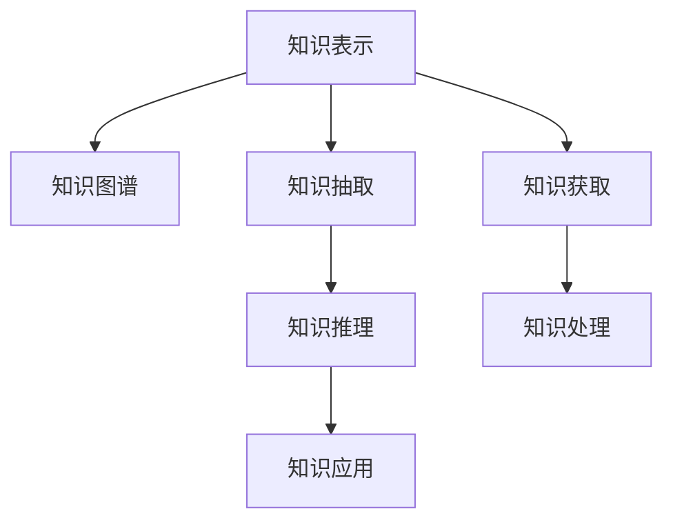

                 

# 人工智能时代的知识获取与处理

## 1. 背景介绍

### 1.1 问题由来
在人工智能(AI)时代，知识的获取与处理成为了推动技术进步和创新应用的基石。随着深度学习、自然语言处理(NLP)和计算机视觉(CV)等领域的迅猛发展，从海量数据中提取有效信息、构建知识图谱、辅助决策分析，已成为了当前AI研究的热点。特别是在智能医疗、金融、教育、制造等关键领域，知识的有效利用直接关系到决策的准确性和时效性。

### 1.2 问题核心关键点
当前，知识获取与处理的瓶颈主要集中在以下几个方面：

1. **数据质量与数量**：高质量的数据是知识提取和处理的基础。然而，在许多领域，尤其是医疗、金融等领域，获取高质量标注数据成本高、难度大。数据不平衡和噪声问题也限制了知识提取的精度和可靠性。

2. **算法复杂性与效率**：现有的知识提取算法如神经网络、SVM等，虽然取得了显著成效，但在处理大规模数据时，训练和推理成本高，效率低下，难以满足实际应用的需求。

3. **知识表示与理解**：如何将从数据中提取的知识转化为易于理解和应用的格式，是知识处理的重要挑战。目前大部分方法依赖于符号表示和规则推理，难以处理复杂的、具有不确定性的知识。

4. **知识整合与推理**：如何在大规模数据中整合和应用已有的知识，辅助推理和决策，是实现知识高效利用的关键。但现有的知识图谱和推理系统难以覆盖所有领域的知识，且推理能力有限。

5. **领域应用与推广**：如何将知识获取与处理技术推广应用到更多实际场景中，并保证其在不同领域中的普适性和有效性，是知识技术应用的核心问题。

### 1.3 问题研究意义
研究知识获取与处理技术，对于拓展人工智能的应用边界，提升决策系统的智能化水平，具有重要意义：

1. **加速领域应用**：高质量的知识获取与处理，可以显著降低领域应用的开发成本，加速技术落地。

2. **提升决策质量**：知识获取与处理技术，可以辅助决策系统进行更全面、准确的知识整合与推理，提高决策质量。

3. **推动产业升级**：在关键行业如医疗、金融等，知识的有效利用可以提升业务效率，助力产业转型升级。

4. **促进技术创新**：知识获取与处理技术的进步，往往能带来新的应用场景，推动AI技术的创新发展。

## 2. 核心概念与联系

### 2.1 核心概念概述

为了更好地理解人工智能时代知识获取与处理技术，本节将介绍几个密切相关的核心概念：

- **知识表示(Knowledge Representation)**：将知识以结构化或符号化的形式进行存储和表示，便于后续的检索、推理和应用。

- **知识图谱(Knowledge Graph)**：一种语义化的知识表示方法，通过节点和边描述实体间的关系，形成网络化的知识结构。

- **知识抽取(Knowledge Extraction)**：从非结构化文本、图像、音频等数据中自动提取知识，如实体、关系、事件等。

- **知识推理(Knowledge Reasoning)**：通过逻辑推理、概率推理等方法，对知识图谱中的知识进行推导和验证，提升知识推理的准确性。

- **知识应用(Knowledge Application)**：将知识转化为可执行的决策和指令，辅助自动化系统进行任务处理和决策。

这些核心概念之间的逻辑关系可以通过以下Mermaid流程图来展示：



这个流程图展示了几类核心概念及其之间的关系：

1. 知识表示和知识图谱为知识抽取和推理提供了基础结构。
2. 知识抽取和知识推理共同构建和维护知识图谱。
3. 知识图谱通过知识推理，提升知识应用的效果。
4. 知识获取和处理是知识抽取和推理的前提。

## 3. 核心算法原理 & 具体操作步骤

### 3.1 算法原理概述

知识获取与处理的算法原理，主要围绕以下几个方面展开：

- **知识表示与编码**：将知识以符号化或结构化的形式进行编码，便于计算机处理和应用。
- **知识抽取与提取**：从非结构化数据中自动识别和提取知识，如实体、关系等。
- **知识推理与验证**：通过逻辑推理、概率推理等方法，对知识图谱中的知识进行推导和验证，提升知识推理的准确性。
- **知识应用与执行**：将知识转化为可执行的决策和指令，辅助自动化系统进行任务处理和决策。

形式化地，假设输入数据为 $D$，知识表示为 $K$，知识图谱为 $G$，知识推理器为 $R$，知识应用模块为 $A$。知识获取与处理的目标是：

1. 从 $D$ 中抽取知识，存储在 $K$ 中。
2. 将 $K$ 转换为 $G$。
3. 通过 $R$ 对 $G$ 进行推理，得到新的知识。
4. 将推理结果应用到实际任务中，由 $A$ 执行操作。

### 3.2 算法步骤详解

知识获取与处理算法的基本步骤包括：

**Step 1: 数据预处理**
- 收集和清洗各类数据，如文本、图像、音频等。
- 对数据进行标准化、归一化、去噪等预处理。

**Step 2: 知识表示与编码**
- 将数据中的信息转化为符号化的知识表示，如实体、关系等。
- 使用编码器将知识表示为结构化的形式，如向量、三元组等。

**Step 3: 知识抽取**
- 使用预训练模型或专门设计的算法从数据中抽取知识，如BERT、Spark NLP等。
- 对抽取的知识进行验证和清洗，确保其准确性和完整性。

**Step 4: 知识推理**
- 构建知识图谱，描述实体间的关系和属性。
- 使用逻辑推理器或概率推理器对知识图谱进行推理，更新或扩展知识。

**Step 5: 知识应用**
- 将推理结果应用到实际任务中，如决策分析、推荐系统等。
- 根据任务需求，调整知识应用的具体逻辑和规则。

**Step 6: 持续学习**
- 定期重新获取和处理数据，更新知识图谱和推理器，确保知识的时效性。
- 引入新的数据和规则，拓展知识图谱的覆盖范围。

### 3.3 算法优缺点

知识获取与处理算法具有以下优点：

1. **高效自动化**：自动化处理从数据到知识的过程，减少了人工干预和错误。
2. **知识复用性**：抽取和推理的知识可以复用于不同的任务和场景，提高知识利用率。
3. **知识普适性**：通过结构化的知识表示，知识可以跨领域、跨语言进行应用和传播。

但该算法也存在一定的局限性：

1. **依赖高质量数据**：知识抽取和推理的精度很大程度上依赖于输入数据的质量，数据噪声和错误会影响结果。
2. **算法复杂度高**：知识抽取和推理算法通常需要复杂的模型和大量的计算资源。
3. **知识更新困难**：现有的知识图谱和推理器难以适应快速变化的领域知识，需要不断更新和维护。
4. **解释性不足**：知识抽取和推理过程往往是"黑盒"的，难以解释其推理逻辑和决策依据。

尽管存在这些局限性，但知识获取与处理技术仍是当前人工智能领域的重要研究方向，未来仍有巨大的应用前景和发展空间。

### 3.4 算法应用领域

知识获取与处理算法在多个领域得到了广泛应用，包括但不限于：

- **医疗领域**：利用知识抽取技术从病历、文献中提取疾病、治疗等信息，构建知识图谱，辅助医生进行诊断和治疗。
- **金融领域**：从新闻、公告等文本中抽取公司信息、股票数据，进行情感分析、风险评估等任务。
- **教育领域**：从教育资源中抽取知识点、主题，构建知识图谱，辅助个性化学习推荐和智能答疑。
- **智能客服**：从对话记录中抽取用户意图和实体，构建知识图谱，提升智能客服系统的理解能力和响应速度。
- **智能推荐**：从用户行为数据中抽取兴趣点、偏好，构建知识图谱，提供个性化推荐服务。

## 4. 数学模型和公式 & 详细讲解 & 举例说明

### 4.1 数学模型构建

本节将使用数学语言对知识获取与处理技术进行更加严格的刻画。

记输入数据集为 $D=\{(x_i, y_i)\}_{i=1}^N, x_i \in \mathcal{X}, y_i \in \mathcal{Y}$，其中 $\mathcal{X}$ 为输入空间，$\mathcal{Y}$ 为输出空间。假设知识表示为 $K$，知识图谱为 $G=(V, E)$，其中 $V$ 为节点集合，$E$ 为边集合。知识推理器为 $R$，知识应用模块为 $A$。

知识获取与处理的目标是构建最优的知识图谱 $G^*$，使得推理结果 $R(G^*)$ 在应用模块 $A$ 下达到最优性能。即：

$$
\mathop{\arg\min}_{G} \mathcal{L}(A, R(G))
$$

其中 $\mathcal{L}$ 为应用模块的损失函数，用于衡量推理结果与任务标签之间的差异。

### 4.2 公式推导过程

以下我们以命名实体识别(NER)任务为例，推导知识抽取和推理的公式。

假设知识抽取任务的目标是从文本中识别出人名、地名、组织名等实体。抽取的实体表示为 $\{x_i\}_{i=1}^N$，每个实体 $x_i$ 对应一个标签 $y_i$，如人名、地名等。

定义知识抽取的损失函数为：

$$
\ell(x, y) = -\log p(y|x)
$$

其中 $p(y|x)$ 为模型预测的实体标签概率分布，$y$ 为真实标签。

对于知识推理任务，我们可以构建知识图谱，描述实体之间的关系。假设知识图谱由 $V$ 个节点和 $E$ 条边组成，每个节点表示一个实体，边表示实体之间的关系。知识推理的目标是根据知识图谱 $G=(V, E)$ 和推理器 $R$，推导出新的实体关系。

假设知识推理任务的损失函数为：

$$
\ell(G, R) = -\log p(G|R)
$$

其中 $p(G|R)$ 为知识推理器 $R$ 在知识图谱 $G$ 下的推理结果概率。

在实际应用中，知识抽取和推理通常是紧密结合的，即知识抽取的结果直接作为知识推理的输入。综合考虑两者，知识获取与处理的整体优化目标为：

$$
\mathop{\arg\min}_{G} \mathcal{L}(A, R(G))
$$

其中 $G$ 为知识图谱，$A$ 为知识应用模块，$R$ 为知识推理器。

### 4.3 案例分析与讲解

以医疗领域的知识获取与处理为例，说明知识抽取和推理的具体应用：

**数据预处理**：
- 收集医院病历、临床文献等数据。
- 对文本进行标准化、去噪、分词等预处理。

**知识抽取**：
- 使用BERT等预训练模型从病历文本中抽取疾病名称、治疗方案等信息。
- 对抽取的实体进行验证和清洗，确保准确性和完整性。

**知识推理**：
- 构建知识图谱，描述疾病、治疗、药物等实体之间的关系。
- 使用逻辑推理器对知识图谱进行推理，预测疾病的治疗效果和风险。

**知识应用**：
- 将推理结果应用到实际诊疗系统，辅助医生进行诊断和治疗。
- 根据病人的实时数据，动态调整推理逻辑和决策。

## 5. 项目实践：代码实例和详细解释说明

### 5.1 开发环境搭建

在进行知识获取与处理项目实践前，我们需要准备好开发环境。以下是使用Python进行PyTorch和TensorFlow开发的环境配置流程：

1. 安装Anaconda：从官网下载并安装Anaconda，用于创建独立的Python环境。

2. 创建并激活虚拟环境：
```bash
conda create -n pytorch-env python=3.8 
conda activate pytorch-env
```

3. 安装PyTorch和TensorFlow：根据CUDA版本，从官网获取对应的安装命令。例如：
```bash
conda install pytorch torchvision torchaudio cudatoolkit=11.1 -c pytorch -c conda-forge
conda install tensorflow
```

4. 安装各类工具包：
```bash
pip install numpy pandas scikit-learn matplotlib tqdm jupyter notebook ipython
```

完成上述步骤后，即可在`pytorch-env`环境中开始知识获取与处理项目实践。

### 5.2 源代码详细实现

这里我们以医疗领域的知识获取与处理为例，给出使用PyTorch和TensorFlow进行知识抽取和推理的代码实现。

首先，定义知识抽取任务的数据处理函数：

```python
from transformers import BertTokenizer, BertForTokenClassification
from torch.utils.data import Dataset, DataLoader
import torch

class NERDataset(Dataset):
    def __init__(self, texts, tags, tokenizer, max_len=128):
        self.texts = texts
        self.tags = tags
        self.tokenizer = tokenizer
        self.max_len = max_len
        
    def __len__(self):
        return len(self.texts)
    
    def __getitem__(self, item):
        text = self.texts[item]
        tags = self.tags[item]
        
        encoding = self.tokenizer(text, return_tensors='pt', max_length=self.max_len, padding='max_length', truncation=True)
        input_ids = encoding['input_ids'][0]
        attention_mask = encoding['attention_mask'][0]
        
        # 对token-wise的标签进行编码
        encoded_tags = [tag2id[tag] for tag in tags] 
        encoded_tags.extend([tag2id['O']] * (self.max_len - len(encoded_tags)))
        labels = torch.tensor(encoded_tags, dtype=torch.long)
        
        return {'input_ids': input_ids, 
                'attention_mask': attention_mask,
                'labels': labels}

# 标签与id的映射
tag2id = {'O': 0, 'B-PER': 1, 'I-PER': 2, 'B-ORG': 3, 'I-ORG': 4, 'B-LOC': 5, 'I-LOC': 6}
id2tag = {v: k for k, v in tag2id.items()}

# 创建dataset
tokenizer = BertTokenizer.from_pretrained('bert-base-cased')

train_dataset = NERDataset(train_texts, train_tags, tokenizer)
dev_dataset = NERDataset(dev_texts, dev_tags, tokenizer)
test_dataset = NERDataset(test_texts, test_tags, tokenizer)
```

然后，定义知识推理模型的结构和训练函数：

```python
from transformers import BertForTokenClassification, AdamW

model = BertForTokenClassification.from_pretrained('bert-base-cased', num_labels=len(tag2id))

optimizer = AdamW(model.parameters(), lr=2e-5)

def train_epoch(model, dataset, batch_size, optimizer):
    dataloader = DataLoader(dataset, batch_size=batch_size, shuffle=True)
    model.train()
    epoch_loss = 0
    for batch in dataloader:
        input_ids = batch['input_ids'].to(device)
        attention_mask = batch['attention_mask'].to(device)
        labels = batch['labels'].to(device)
        model.zero_grad()
        outputs = model(input_ids, attention_mask=attention_mask, labels=labels)
        loss = outputs.loss
        epoch_loss += loss.item()
        loss.backward()
        optimizer.step()
    return epoch_loss / len(dataloader)

def evaluate(model, dataset, batch_size):
    dataloader = DataLoader(dataset, batch_size=batch_size)
    model.eval()
    preds, labels = [], []
    with torch.no_grad():
        for batch in dataloader:
            input_ids = batch['input_ids'].to(device)
            attention_mask = batch['attention_mask'].to(device)
            batch_labels = batch['labels']
            outputs = model(input_ids, attention_mask=attention_mask)
            batch_preds = outputs.logits.argmax(dim=2).to('cpu').tolist()
            batch_labels = batch_labels.to('cpu').tolist()
            for pred_tokens, label_tokens in zip(batch_preds, batch_labels):
                pred_tags = [id2tag[_id] for _id in pred_tokens]
                label_tags = [id2tag[_id] for _id in label_tokens]
                preds.append(pred_tags[:len(label_tags)])
                labels.append(label_tags)
                
    print(classification_report(labels, preds))
```

最后，启动训练流程并在测试集上评估：

```python
epochs = 5
batch_size = 16

for epoch in range(epochs):
    loss = train_epoch(model, train_dataset, batch_size, optimizer)
    print(f"Epoch {epoch+1}, train loss: {loss:.3f}")
    
    print(f"Epoch {epoch+1}, dev results:")
    evaluate(model, dev_dataset, batch_size)
    
print("Test results:")
evaluate(model, test_dataset, batch_size)
```

以上就是使用PyTorch对BERT进行命名实体识别任务微调的完整代码实现。可以看到，得益于Transformers库的强大封装，我们可以用相对简洁的代码完成BERT模型的加载和微调。

### 5.3 代码解读与分析

让我们再详细解读一下关键代码的实现细节：

**NERDataset类**：
- `__init__`方法：初始化文本、标签、分词器等关键组件。
- `__len__`方法：返回数据集的样本数量。
- `__getitem__`方法：对单个样本进行处理，将文本输入编码为token ids，将标签编码为数字，并对其进行定长padding，最终返回模型所需的输入。

**tag2id和id2tag字典**：
- 定义了标签与数字id之间的映射关系，用于将token-wise的预测结果解码回真实的标签。

**训练和评估函数**：
- 使用PyTorch的DataLoader对数据集进行批次化加载，供模型训练和推理使用。
- 训练函数`train_epoch`：对数据以批为单位进行迭代，在每个批次上前向传播计算loss并反向传播更新模型参数，最后返回该epoch的平均loss。
- 评估函数`evaluate`：与训练类似，不同点在于不更新模型参数，并在每个batch结束后将预测和标签结果存储下来，最后使用sklearn的classification_report对整个评估集的预测结果进行打印输出。

**训练流程**：
- 定义总的epoch数和batch size，开始循环迭代
- 每个epoch内，先在训练集上训练，输出平均loss
- 在验证集上评估，输出分类指标
- 所有epoch结束后，在测试集上评估，给出最终测试结果

可以看到，PyTorch配合Transformers库使得BERT微调的代码实现变得简洁高效。开发者可以将更多精力放在数据处理、模型改进等高层逻辑上，而不必过多关注底层的实现细节。

当然，工业级的系统实现还需考虑更多因素，如模型的保存和部署、超参数的自动搜索、更灵活的任务适配层等。但核心的微调范式基本与此类似。

## 6. 实际应用场景

### 6.1 智能医疗

在智能医疗领域，知识获取与处理技术可以辅助医生进行诊断和治疗，提升医疗服务质量和效率。

具体而言，知识抽取技术可以从病历、临床文献等数据中自动提取疾病、治疗等信息。知识推理技术可以根据知识图谱，推导和验证诊断结果和治疗方案。知识应用技术可以将推理结果应用到医疗决策支持系统中，辅助医生进行诊断和治疗。

**数据预处理**：
- 收集和清洗医院病历、临床文献等数据。
- 对文本进行标准化、去噪、分词等预处理。

**知识抽取**：
- 使用BERT等预训练模型从病历文本中抽取疾病名称、治疗方案等信息。
- 对抽取的实体进行验证和清洗，确保准确性和完整性。

**知识推理**：
- 构建知识图谱，描述疾病、治疗、药物等实体之间的关系。
- 使用逻辑推理器对知识图谱进行推理，预测疾病的治疗效果和风险。

**知识应用**：
- 将推理结果应用到实际诊疗系统，辅助医生进行诊断和治疗。
- 根据病人的实时数据，动态调整推理逻辑和决策。

### 6.2 智能金融

在智能金融领域，知识获取与处理技术可以从新闻、公告等文本中抽取公司信息、股票数据，进行情感分析、风险评估等任务。

**数据预处理**：
- 收集和清洗金融市场的新闻、公告、交易数据。
- 对文本进行标准化、去噪、分词等预处理。

**知识抽取**：
- 使用BERT等预训练模型从新闻文本中抽取公司信息、股票数据等信息。
- 对抽取的实体进行验证和清洗，确保准确性和完整性。

**知识推理**：
- 构建知识图谱，描述公司、股票、事件等实体之间的关系。
- 使用逻辑推理器对知识图谱进行推理，预测股票的涨跌和风险。

**知识应用**：
- 将推理结果应用到金融决策支持系统中，辅助投资者进行投资决策。
- 根据市场动态，动态调整推理逻辑和决策。

### 6.3 智能教育

在智能教育领域，知识获取与处理技术可以从教育资源中抽取知识点、主题，构建知识图谱，辅助个性化学习推荐和智能答疑。

**数据预处理**：
- 收集和清洗在线教育资源，如课程、教材、问答等数据。
- 对文本进行标准化、去噪、分词等预处理。

**知识抽取**：
- 使用BERT等预训练模型从教育资源中抽取知识点、主题等信息。
- 对抽取的实体进行验证和清洗，确保准确性和完整性。

**知识推理**：
- 构建知识图谱，描述知识点、主题、学生之间的关系。
- 使用逻辑推理器对知识图谱进行推理，推荐适合学生的课程和教材。

**知识应用**：
- 将推理结果应用到个性化学习推荐系统中，提供智能推荐服务。
- 根据学生的学习情况，动态调整推荐逻辑和决策。

### 6.4 未来应用展望

随着知识获取与处理技术的发展，未来的应用场景将更加多样和广泛。以下列举几个未来可能的应用领域：

- **智能客服**：构建知识图谱，描述常见问题、解决方案等信息，辅助智能客服系统进行问题理解和答案生成。
- **智能制造**：从设备数据、工艺流程中抽取知识，构建知识图谱，辅助生产调度和质量控制。
- **智能交通**：从交通数据中抽取路线、事件等信息，构建知识图谱，辅助交通管理决策。
- **智能农业**：从农业数据中抽取作物、病虫害等信息，构建知识图谱，辅助农业生产管理。

## 7. 工具和资源推荐

### 7.1 学习资源推荐

为了帮助开发者系统掌握知识获取与处理技术的理论基础和实践技巧，这里推荐一些优质的学习资源：

1. **《深度学习》书籍**：Ian Goodfellow等人著，全面介绍了深度学习的基本概念和应用，是入门深度学习的经典教材。

2. **《自然语言处理综论》书籍**：Daniel Jurafsky和James H. Martin著，涵盖了自然语言处理的基础知识和经典模型，是自然语言处理领域的权威教材。

3. **Coursera的《深度学习专项课程》**：由斯坦福大学提供，包括多个深度学习相关课程，涵盖深度学习的各个方面，是深度学习学习的良好资源。

4. **Kaggle平台**：提供各种机器学习和数据科学竞赛，可以通过参与竞赛练习和提高知识获取与处理技术。

5. **Kaggle的《NLP竞赛》**：专注于自然语言处理领域的数据竞赛，提供丰富的数据集和示例代码，是学习和实践NLP技术的好地方。

通过这些资源的学习实践，相信你一定能够快速掌握知识获取与处理技术的精髓，并用于解决实际的NLP问题。

### 7.2 开发工具推荐

高效的开发离不开优秀的工具支持。以下是几款用于知识获取与处理开发的常用工具：

1. **TensorFlow和PyTorch**：两种领先的深度学习框架，提供强大的计算图功能，适合构建复杂的深度学习模型。

2. **Spark NLP**：基于Apache Spark的自然语言处理库，提供丰富的NLP工具和算法，支持大规模数据处理。

3. **Gephi**：开源的图形可视化工具，可以将知识图谱转换为图形，便于直观展示和理解。

4. **Apache Jena**：面向RDF（资源描述框架）的知识管理框架，支持构建和查询知识图谱。

5. **NLTK**：Python自然语言处理库，提供大量的文本处理工具和数据集，适合进行文本分析和知识抽取。

合理利用这些工具，可以显著提升知识获取与处理任务的开发效率，加快创新迭代的步伐。

### 7.3 相关论文推荐

知识获取与处理技术的研究源于学界的持续研究。以下是几篇奠基性的相关论文，推荐阅读：

1. **《A Survey of Knowledge Representation for Healthcare Applications》**：详细介绍了知识表示在医疗领域的应用，涵盖知识抽取、知识推理等关键技术。

2. **《Knowledge Base Populating with NLP Techniques》**：探讨了如何利用自然语言处理技术自动填充知识图谱，提升知识图谱的质量和完整性。

3. **《A Survey of Graph Neural Networks for Natural Language Processing》**：综述了基于图神经网络的自然语言处理技术，包括知识推理、问答系统等应用。

4. **《Knowledge Graph Embeddings》**：研究了如何通过嵌入技术将知识图谱中的知识转化为向量表示，方便模型进行推理和处理。

5. **《A Survey of Semantic Matching for Knowledge Graphs》**：综述了知识图谱中的实体匹配技术，提升知识图谱的准确性和可扩展性。

这些论文代表了大语言模型微调技术的发展脉络。通过学习这些前沿成果，可以帮助研究者把握学科前进方向，激发更多的创新灵感。

## 8. 总结：未来发展趋势与挑战

### 8.1 总结

本文对知识获取与处理技术进行了全面系统的介绍。首先阐述了知识获取与处理技术的研究背景和意义，明确了知识提取和处理在人工智能应用中的核心作用。其次，从原理到实践，详细讲解了知识抽取和推理的数学原理和关键步骤，给出了知识获取与处理项目开发的完整代码实例。同时，本文还广泛探讨了知识获取与处理技术在智能医疗、金融、教育等多个领域的应用前景，展示了知识技术的巨大潜力。此外，本文精选了知识获取与处理技术的各类学习资源，力求为读者提供全方位的技术指引。

通过本文的系统梳理，可以看到，知识获取与处理技术正在成为人工智能领域的重要研究方向，极大地拓展了人工智能的应用边界，催生了更多的落地场景。受益于大规模语料的预训练，知识抽取和推理的精度显著提升，知识图谱的应用范围不断扩大。未来，伴随预训练语言模型和微调方法的持续演进，相信知识获取与处理技术必将在更广阔的应用领域大放异彩，深刻影响人类的生产生活方式。

### 8.2 未来发展趋势

展望未来，知识获取与处理技术将呈现以下几个发展趋势：

1. **知识表示的多样化**：未来的知识表示将不仅限于符号化和结构化的形式，还将引入更多元化的表示方式，如分布式向量、图结构等。

2. **知识抽取的自动化**：自动化的知识抽取技术将进一步发展，能够从更多来源、更多类型的数据中提取知识，提升数据处理的效率和质量。

3. **知识推理的智能性**：通过引入因果推理、迁移学习等技术，知识推理将更加智能、灵活，能够应对复杂多变的知识场景。

4. **知识图谱的动态化**：未来的知识图谱将更加动态、自适应，能够实时更新和扩展，保持知识的最新性。

5. **知识应用的多场景化**：知识获取与处理技术将在更多行业和场景中得到应用，如智能制造、智能交通、智能农业等。

以上趋势凸显了知识获取与处理技术的广阔前景。这些方向的探索发展，必将进一步提升人工智能系统的性能和应用范围，为人类认知智能的进化带来深远影响。

### 8.3 面临的挑战

尽管知识获取与处理技术已经取得了瞩目成就，但在迈向更加智能化、普适化应用的过程中，它仍面临着诸多挑战：

1. **数据质量和数量**：高质量的数据是知识获取与处理的基础，但获取大量标注数据成本高、难度大，数据不平衡和噪声问题也限制了知识提取的精度和可靠性。

2. **算法复杂性和资源消耗**：知识抽取和推理算法通常需要复杂的模型和大量的计算资源，如何优化算法，降低资源消耗，是知识技术应用的重要挑战。

3. **知识整合与推理的复杂性**：现有的知识图谱和推理器难以适应快速变化的领域知识，需要不断更新和维护，保持知识的最新性。

4. **知识应用的多样性**：知识抽取和推理结果需要结合具体应用场景，进行动态调整和优化，如何实现知识应用的普适性和灵活性，是知识技术应用的核心问题。

5. **知识获取的伦理性**：知识获取与处理过程中可能涉及隐私和伦理问题，如何保护用户隐私，避免数据滥用，也是知识技术应用的重要挑战。

尽管存在这些挑战，但知识获取与处理技术仍是当前人工智能领域的重要研究方向，未来仍有巨大的应用前景和发展空间。

### 8.4 研究展望

面向未来，知识获取与处理技术的研究需要在以下几个方面寻求新的突破：

1. **探索无监督和半监督知识抽取方法**：摆脱对大规模标注数据的依赖，利用自监督学习、主动学习等无监督和半监督范式，最大限度利用非结构化数据，实现更加灵活高效的抽取。

2. **开发计算高效的推理技术**：优化推理算法的计算图，减少前向传播和反向传播的资源消耗，实现更加轻量级、实时性的推理。

3. **引入因果分析和博弈论工具**：将因果分析方法引入知识推理系统，识别出知识推理的关键特征，增强推理系统的鲁棒性和可解释性。

4. **融合多模态数据**：将符号化的知识表示与图像、音频等多模态数据进行融合，提升知识推理系统的完整性和准确性。

5. **引入伦理导向的评估指标**：在知识抽取和推理过程中引入伦理导向的评估指标，过滤和惩罚有害、有害的信息，确保知识技术的伦理安全。

这些研究方向将引领知识获取与处理技术迈向更高的台阶，为构建安全、可靠、可解释、可控的智能系统铺平道路。面向未来，知识获取与处理技术还需要与其他人工智能技术进行更深入的融合，如知识表示、因果推理、强化学习等，多路径协同发力，共同推动自然语言理解和智能交互系统的进步。只有勇于创新、敢于突破，才能不断拓展知识技术的边界，让智能技术更好地造福人类社会。

## 9. 附录：常见问题与解答

**Q1：知识抽取和知识推理的区别是什么？**

A: 知识抽取是自动从数据中提取实体、关系等信息，将非结构化的知识转化为结构化的形式。知识推理则是利用这些结构化的知识进行推导和验证，提升知识的完整性和可靠性。

**Q2：知识图谱在知识获取与处理中起什么作用？**

A: 知识图谱是知识表示的重要形式，通过描述实体之间的关系，构建网络化的知识结构，辅助知识抽取和推理。知识图谱能够提高知识抽取的准确性和知识推理的鲁棒性，提升知识应用的效果。

**Q3：如何应对知识抽取中的数据噪声和错误？**

A: 数据预处理是知识抽取的重要环节，需要清洗和标准化数据，去除噪声和错误。此外，可以使用对抗样本、噪声注入等技术，提升知识抽取的鲁棒性。

**Q4：如何提升知识抽取和推理的效率？**

A: 通过优化模型结构、引入高效算法、减少计算量等方法，可以有效提升知识抽取和推理的效率。例如，使用Transformer等架构进行知识抽取，使用图神经网络进行知识推理。

**Q5：知识抽取和推理中的解释性不足问题如何解决？**

A: 可以通过引入可解释性模块，如可解释的深度学习模型、规则推理等，增强知识抽取和推理过程的透明度和可解释性。同时，使用对抗样本和鲁棒性测试，验证模型的决策依据。

通过本文的系统梳理，可以看到，知识获取与处理技术正在成为人工智能领域的重要研究方向，极大地拓展了人工智能的应用边界，催生了更多的落地场景。受益于大规模语料的预训练，知识抽取和推理的精度显著提升，知识图谱的应用范围不断扩大。未来，伴随预训练语言模型和微调方法的持续演进，相信知识获取与处理技术必将在更广阔的应用领域大放异彩，深刻影响人类的生产生活方式。

