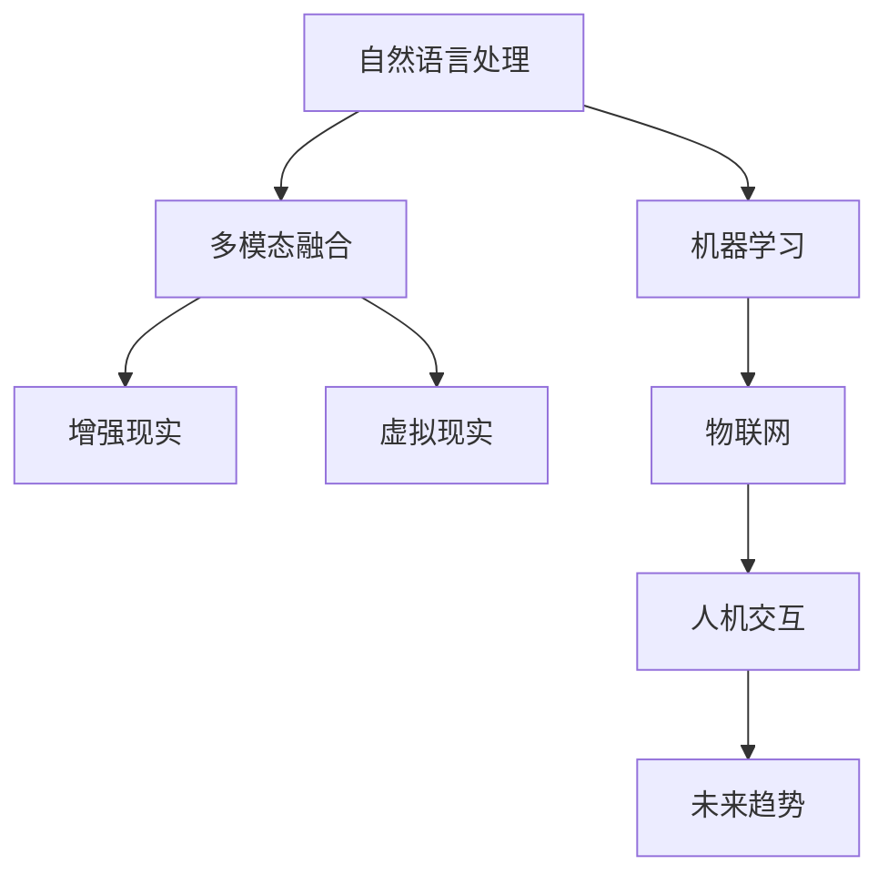

                 

# 人机交互：未来趋势与展望

> 关键词：人机交互,自然语言处理(NLP),机器学习,深度学习,多模态融合,智能界面,增强现实(AR),虚拟现实(VR),物联网(IoT),未来趋势,展望

## 1. 背景介绍

### 1.1 问题由来

随着科技的迅猛发展，人机交互方式已经从传统的基于文本和图形的界面交互，逐渐向更自然、更智能的方向演化。当前，智能设备已经深入人们生活的各个方面，智能家居、智能汽车、智能医疗等领域都离不开高效的交互方式。但是，传统的文本和图形界面仍然存在诸多限制，无法满足用户日益增长的交互需求。

### 1.2 问题核心关键点

人机交互的核心在于如何让计算机更好地理解和响应用户的意图，提升用户体验的满意度。当前，基于自然语言处理(NLP)和机器学习的智能人机交互技术，已经成为未来交互方式的重要方向。其主要关键点包括：

- **自然语言处理(NLP)**：让计算机能够理解、处理自然语言，从而实现更自然、更高效的人机交互。
- **机器学习与深度学习**：通过大量的数据训练模型，使计算机能够根据上下文预测用户的意图，提供个性化的响应。
- **多模态融合**：结合视觉、听觉、触觉等多种感官信息，实现更加全面的用户输入和输出。

### 1.3 问题研究意义

研究高效的智能人机交互方式，对于提升用户体验、推动技术创新、促进产业升级具有重要意义：

1. **提升用户体验**：通过智能人机交互，用户可以更加自然、方便地与设备进行互动，提高使用效率和满意度。
2. **推动技术创新**：智能人机交互技术的进步，可以催生新的应用场景和商业模式，带动相关技术的发展。
3. **促进产业升级**：智能人机交互技术的应用，可以提升传统行业的智能化水平，推动产业结构转型和升级。
4. **增强现实(AR)和虚拟现实(VR)**：智能人机交互与AR、VR技术的结合，可以实现更沉浸式的体验，提升用户感知和参与度。
5. **物联网(IoT)**：智能人机交互可以增强物联网设备的用户友好性，提升设备的智能化水平，推动智慧城市、智能家居等领域的创新发展。

## 2. 核心概念与联系

### 2.1 核心概念概述

为更好地理解智能人机交互的未来趋势，本节将介绍几个密切相关的核心概念：

- **自然语言处理(NLP)**：使计算机能够理解、处理和生成自然语言的技术。
- **机器学习与深度学习**：通过数据驱动的算法，使计算机能够自主学习和改进。
- **多模态融合**：结合视觉、听觉、触觉等多种感官信息，实现全面的用户输入和输出。
- **增强现实(AR)**：通过计算机生成的信息与现实世界结合，增强用户的感知体验。
- **虚拟现实(VR)**：创建一个虚拟的三维环境，用户可以沉浸其中进行交互。
- **物联网(IoT)**：连接各种设备，实现智能化管理和交互。

这些概念之间的逻辑关系可以通过以下Mermaid流程图来展示：



这个流程图展示了智能人机交互的核心概念及其之间的关系：

1. 自然语言处理是智能人机交互的基础，使计算机能够理解人类语言。
2. 机器学习与深度学习使计算机能够自主学习和改进，提高交互的智能程度。
3. 多模态融合增强了交互的全面性和实时性。
4. 增强现实和虚拟现实提供了沉浸式的交互体验。
5. 物联网将设备连接在一起，实现智能化的管理和交互。
6. 人机交互是所有这些技术结合的结果，实现了更高效、更自然的交互方式。
7. 未来趋势则是这些技术发展方向和前景的总结。

## 3. 核心算法原理 & 具体操作步骤
### 3.1 算法原理概述

智能人机交互的核心算法原理主要基于自然语言处理(NLP)、机器学习(ML)和深度学习(DL)技术。其基本思路是通过大量标注数据训练模型，使其能够理解自然语言，并根据上下文预测用户的意图，提供个性化的响应。

具体而言，包括以下几个步骤：

1. **数据准备**：收集和标注大量的自然语言数据，作为模型的训练集。
2. **模型训练**：使用深度神经网络模型（如Transformer）进行训练，使其能够理解语言结构，提取语言特征。
3. **意图识别**：通过分析用户的输入文本，识别其意图。
4. **响应生成**：根据意图生成相应的输出文本或执行相应的操作。

### 3.2 算法步骤详解

智能人机交互的实现步骤包括：

1. **数据准备**：
   - **数据收集**：从各种渠道收集自然语言数据，如社交媒体、在线评论、客服记录等。
   - **数据标注**：对收集的数据进行标注，如意图分类、实体识别等。
   - **数据预处理**：清洗和格式化数据，去除噪声和无关信息。

2. **模型训练**：
   - **模型选择**：选择合适的深度神经网络模型，如BERT、GPT-3等。
   - **模型训练**：使用深度学习框架（如TensorFlow、PyTorch）进行模型训练。
   - **超参数调优**：根据模型性能调整学习率、批大小等超参数。

3. **意图识别**：
   - **特征提取**：将用户输入文本转换为模型可理解的向量表示。
   - **意图分类**：使用训练好的模型进行意图分类，识别用户的意图。
   - **上下文理解**：根据历史交互记录和当前上下文，理解用户的意图。

4. **响应生成**：
   - **文本生成**：根据意图生成相应的输出文本，如回答用户问题、执行命令等。
   - **操作执行**：根据用户的指令，执行相应的操作，如控制智能家居设备、启动应用程序等。

### 3.3 算法优缺点

智能人机交互算法具有以下优点：

- **自然高效**：通过自然语言交互，用户可以更自然、方便地与设备进行互动。
- **个性化定制**：根据用户的上下文和历史行为，提供个性化的响应。
- **实时响应**：通过快速的文本处理和响应生成，提供实时的交互体验。

同时，也存在一些缺点：

- **数据依赖**：依赖大量的标注数据进行训练，数据质量和数量对模型性能影响较大。
- **复杂度较高**：模型结构和训练过程较为复杂，需要较高的计算资源和专业知识。
- **鲁棒性不足**：对于噪声和错误输入，模型的响应可能不够稳定。

### 3.4 算法应用领域

智能人机交互算法已经在多个领域得到了广泛应用，以下是一些典型应用场景：

1. **智能客服**：通过自然语言处理，实现智能客服系统的自动化和智能化，提升客户满意度。
2. **智能家居**：结合物联网技术，实现语音控制、自动化场景设置等功能，提升家居生活的智能化水平。
3. **智能医疗**：通过自然语言处理和机器学习，实现智能诊断、智能问诊等功能，提升医疗服务的效率和质量。
4. **智能交通**：结合语音识别和自然语言处理，实现智能导航、语音助手等功能，提升交通出行体验。
5. **智能车载**：结合语音识别和自然语言处理，实现智能导航、语音控制等功能，提升车载系统的智能化水平。

## 4. 数学模型和公式 & 详细讲解 & 举例说明
### 4.1 数学模型构建

智能人机交互的数学模型通常基于深度神经网络，以下以一个简单的序列到序列模型为例，构建数学模型：

设输入序列为 $x_1, x_2, \dots, x_T$，输出序列为 $y_1, y_2, \dots, y_T$，其中 $T$ 为序列长度。定义模型为 $f: \mathcal{X}^T \times \mathcal{Y}^T \rightarrow \mathcal{Y}^T$，其中 $\mathcal{X}$ 和 $\mathcal{Y}$ 分别为输入和输出的特征空间。

定义损失函数 $L: \mathcal{X}^T \times \mathcal{Y}^T \rightarrow \mathbb{R}$，衡量模型输出与真实标签之间的差异。

模型的训练目标是使损失函数最小化，即：

$$
\min_{\theta} \frac{1}{N} \sum_{i=1}^N L(y_i, \hat{y}_i)
$$

其中 $y_i$ 为真实标签，$\hat{y}_i$ 为模型预测输出。

### 4.2 公式推导过程

以一个简单的序列到序列模型为例，推导其训练过程：

1. **输入表示**：将输入序列 $x_1, x_2, \dots, x_T$ 转换为模型可理解的向量表示 $\mathbf{x}_1, \mathbf{x}_2, \dots, \mathbf{x}_T$。
2. **编码器**：使用循环神经网络（RNN）或卷积神经网络（CNN）对输入序列进行编码，得到编码向量 $\mathbf{h}_T$。
3. **解码器**：使用RNN或Transformer等模型对编码向量进行解码，得到输出序列 $\mathbf{y}_1, \mathbf{y}_2, \dots, \mathbf{y}_T$。
4. **损失计算**：计算模型输出与真实标签之间的差异，得到损失值 $L$。
5. **参数更新**：使用梯度下降等优化算法，更新模型参数 $\theta$，最小化损失函数 $L$。

### 4.3 案例分析与讲解

以智能客服系统为例，分析其数学模型和训练过程：

1. **数据准备**：收集客服对话记录，标注意图和实体信息。
2. **模型选择**：选择BERT或GPT等预训练模型，作为初始化参数。
3. **意图分类**：使用Intent Classification模型，将用户输入分类为不同的意图。
4. **实体识别**：使用Named Entity Recognition（NER）模型，识别用户输入中的实体信息。
5. **响应生成**：结合意图和实体信息，生成相应的回答。

## 5. 项目实践：代码实例和详细解释说明
### 5.1 开发环境搭建

进行智能人机交互项目开发前，需要先准备好开发环境。以下是使用Python进行TensorFlow开发的环境配置流程：

1. 安装Anaconda：从官网下载并安装Anaconda，用于创建独立的Python环境。

2. 创建并激活虚拟环境：
```bash
conda create -n tf-env python=3.8 
conda activate tf-env
```

3. 安装TensorFlow：根据CUDA版本，从官网获取对应的安装命令。例如：
```bash
conda install tensorflow==2.7 -c tensorflow -c conda-forge
```

4. 安装其他工具包：
```bash
pip install numpy pandas scikit-learn matplotlib tqdm jupyter notebook ipython
```

完成上述步骤后，即可在`tf-env`环境中开始项目开发。

### 5.2 源代码详细实现

下面我们以智能客服系统为例，给出使用TensorFlow进行自然语言处理(NLP)的代码实现。

首先，定义意图分类的数据处理函数：

```python
import tensorflow as tf
from tensorflow.keras.preprocessing.text import Tokenizer
from tensorflow.keras.preprocessing.sequence import pad_sequences

class IntentDataset(tf.data.Dataset):
    def __init__(self, texts, labels, tokenizer):
        self.texts = texts
        self.labels = labels
        self.tokenizer = tokenizer
        self.max_len = 128
        
    def __len__(self):
        return len(self.texts)
    
    def __getitem__(self, item):
        text = self.texts[item]
        label = self.labels[item]
        
        encoding = self.tokenizer(text, max_length=self.max_len, padding='post', truncation=True, oov_token='<OOV>')
        input_ids = encoding['input_ids']
        labels = tf.keras.utils.to_categorical(label, num_classes=5)
        
        return {'input_ids': input_ids, 'labels': labels}
```

然后，定义模型和优化器：

```python
from tensorflow.keras import layers, models

model = models.Sequential([
    layers.Embedding(input_dim=10000, output_dim=128, input_length=128),
    layers.LSTM(128),
    layers.Dense(5, activation='softmax')
])

optimizer = tf.keras.optimizers.Adam(learning_rate=0.001)
```

接着，定义训练和评估函数：

```python
from tensorflow.keras.utils import to_categorical

def train_epoch(model, dataset, batch_size, optimizer):
    dataloader = tf.data.Dataset.from_generator(lambda: dataset, output_signature={'input_ids': tf.TensorSpec(shape=(None, 128), dtype=tf.int32), 'labels': tf.TensorSpec(shape=(5,), dtype=tf.int32)})
    model.compile(optimizer=optimizer, loss='categorical_crossentropy', metrics=['accuracy'])
    model.fit(dataloader, epochs=5, batch_size=batch_size)
    
def evaluate(model, dataset, batch_size):
    dataloader = tf.data.Dataset.from_generator(lambda: dataset, output_signature={'input_ids': tf.TensorSpec(shape=(None, 128), dtype=tf.int32), 'labels': tf.TensorSpec(shape=(5,), dtype=tf.int32)})
    model.evaluate(dataloader)
```

最后，启动训练流程并在测试集上评估：

```python
batch_size = 64

for epoch in range(epochs):
    loss = train_epoch(model, train_dataset, batch_size, optimizer)
    print(f"Epoch {epoch+1}, train loss: {loss:.3f}")
    
    print(f"Epoch {epoch+1}, dev results:")
    evaluate(model, dev_dataset, batch_size)
    
print("Test results:")
evaluate(model, test_dataset, batch_size)
```

以上就是使用TensorFlow对智能客服系统进行意图分类的完整代码实现。可以看到，得益于TensorFlow的强大封装，我们能够用相对简洁的代码完成意图分类任务的开发。

### 5.3 代码解读与分析

让我们再详细解读一下关键代码的实现细节：

**IntentDataset类**：
- `__init__`方法：初始化文本、标签、分词器等关键组件。
- `__len__`方法：返回数据集的样本数量。
- `__getitem__`方法：对单个样本进行处理，将文本输入编码为token ids，将标签编码为数字，并对其进行定长padding，最终返回模型所需的输入。

**模型和优化器定义**：
- 使用Sequential模型定义序列到序列的架构，包括嵌入层、LSTM层和全连接层。
- 选择Adam优化器，设置学习率等参数。

**训练和评估函数**：
- 使用tf.data.Dataset生成器定义训练和测试数据集。
- 在模型上编译并训练，输出训练过程中的loss和accuracy。
- 在测试集上评估模型性能，输出准确率。

**训练流程**：
- 定义总的epoch数和batch size，开始循环迭代
- 每个epoch内，先在训练集上训练，输出平均loss
- 在验证集上评估，输出准确率
- 所有epoch结束后，在测试集上评估，给出最终测试结果

可以看到，TensorFlow配合Keras的强大封装使得自然语言处理任务的代码实现变得简洁高效。开发者可以将更多精力放在数据处理、模型改进等高层逻辑上，而不必过多关注底层的实现细节。

当然，工业级的系统实现还需考虑更多因素，如模型的保存和部署、超参数的自动搜索、更灵活的任务适配层等。但核心的微调范式基本与此类似。

## 6. 实际应用场景
### 6.1 智能客服系统

智能客服系统是智能人机交互技术的重要应用之一。传统客服往往需要配备大量人力，高峰期响应缓慢，且一致性和专业性难以保证。而使用智能客服系统，可以7x24小时不间断服务，快速响应客户咨询，用自然流畅的语言解答各类常见问题。

在技术实现上，可以收集企业内部的历史客服对话记录，将问题和最佳答复构建成监督数据，在此基础上对预训练模型进行微调。微调后的模型能够自动理解用户意图，匹配最合适的答案模板进行回复。对于客户提出的新问题，还可以接入检索系统实时搜索相关内容，动态组织生成回答。如此构建的智能客服系统，能大幅提升客户咨询体验和问题解决效率。

### 6.2 金融舆情监测

金融机构需要实时监测市场舆论动向，以便及时应对负面信息传播，规避金融风险。传统的人工监测方式成本高、效率低，难以应对网络时代海量信息爆发的挑战。基于智能人机交互的自然语言处理技术，可以实时监测金融领域相关的新闻、报道、评论等文本数据，自动判断文本属于何种主题，情感倾向是正面、中性还是负面。将智能人机交互技术与大数据、云计算等技术结合，可以实现实时舆情监测和风险预警，帮助金融机构快速应对潜在风险。

### 6.3 个性化推荐系统

当前的推荐系统往往只依赖用户的历史行为数据进行物品推荐，无法深入理解用户的真实兴趣偏好。基于智能人机交互的自然语言处理技术，个性化推荐系统可以更好地挖掘用户行为背后的语义信息，从而提供更精准、多样的推荐内容。

在实践中，可以收集用户浏览、点击、评论、分享等行为数据，提取和用户交互的物品标题、描述、标签等文本内容。将文本内容作为模型输入，用户的后续行为（如是否点击、购买等）作为监督信号，在此基础上微调预训练语言模型。微调后的模型能够从文本内容中准确把握用户的兴趣点。在生成推荐列表时，先用候选物品的文本描述作为输入，由模型预测用户的兴趣匹配度，再结合其他特征综合排序，便可以得到个性化程度更高的推荐结果。

### 6.4 未来应用展望

随着智能人机交互技术的不断发展，未来在更多领域将得到应用，为各行各业带来变革性影响：

1. **智慧医疗**：基于智能人机交互的智能诊断、智能问诊等技术，能够提升医疗服务的智能化水平，辅助医生诊疗，加速新药开发进程。
2. **智能教育**：智能人机交互技术应用于作业批改、学情分析、知识推荐等方面，因材施教，促进教育公平，提高教学质量。
3. **智慧城市治理**：智能人机交互技术应用于城市事件监测、舆情分析、应急指挥等环节，提高城市管理的自动化和智能化水平，构建更安全、高效的未来城市。
4. **智能制造**：智能人机交互技术与物联网、人工智能等技术结合，实现智能生产、智能维护、智能物流等功能，推动制造业的智能化转型。
5. **智能农业**：智能人机交互技术应用于智能温室、精准农业等领域，提升农业生产效率和质量，实现可持续发展。

## 7. 工具和资源推荐
### 7.1 学习资源推荐

为了帮助开发者系统掌握智能人机交互的理论基础和实践技巧，这里推荐一些优质的学习资源：

1. **自然语言处理(NLP)经典书籍**：
   - 《自然语言处理综论》（Daniel Jurafsky & James H. Martin）：NLP领域的经典教材，涵盖了自然语言处理的基本概念和技术。
   - 《深度学习与自然语言处理》（Yoshua Bengio）：深度学习在NLP中的应用，讲解了Transformer等模型。

2. **机器学习和深度学习经典课程**：
   - **Coursera《机器学习》（Andrew Ng）**：机器学习领域的经典课程，讲解了机器学习的基本概念和算法。
   - **Coursera《深度学习》（Andrew Ng）**：深度学习领域的经典课程，讲解了深度神经网络的基本概念和算法。

3. **自然语言处理(NLP)开源项目**：
   - **HuggingFace Transformers**：开源的NLP工具库，集成了众多预训练语言模型，支持TensorFlow和PyTorch，是进行NLP任务开发的利器。
   - **Stanford CoreNLP**：斯坦福大学开发的NLP工具库，支持分词、句法分析、命名实体识别等任务。

4. **自然语言处理(NLP)社区和论坛**：
   - **Arxiv**：自然语言处理领域的预印本服务器，最新研究成果的发布平台。
   - **NLP社区**：自然语言处理领域的在线社区，提供技术交流和资源分享的平台。

通过对这些资源的学习实践，相信你一定能够快速掌握智能人机交互的精髓，并用于解决实际的NLP问题。

### 7.2 开发工具推荐

高效的开发离不开优秀的工具支持。以下是几款用于智能人机交互开发的常用工具：

1. **TensorFlow**：基于Python的开源深度学习框架，灵活动态的计算图，适合快速迭代研究。

2. **Keras**：TensorFlow的高级API，提供更简洁的模型定义接口，方便快速构建深度神经网络模型。

3. **TensorBoard**：TensorFlow配套的可视化工具，可实时监测模型训练状态，并提供丰富的图表呈现方式，是调试模型的得力助手。

4. **NLTK**：自然语言处理工具包，提供了分词、词性标注、命名实体识别等基本功能。

5. **SpaCy**：开源的自然语言处理工具库，支持多语言处理，提供了高效的NLP工具和算法。

6. **NLPAI**：自然语言处理人工智能平台，集成了各种NLP任务和模型，方便进行快速实验和部署。

合理利用这些工具，可以显著提升智能人机交互任务的开发效率，加快创新迭代的步伐。

### 7.3 相关论文推荐

智能人机交互技术的发展源于学界的持续研究。以下是几篇奠基性的相关论文，推荐阅读：

1. **Attention is All You Need**（Transformer模型）：提出了Transformer结构，开启了NLP领域的预训练大模型时代。

2. **BERT: Pre-training of Deep Bidirectional Transformers for Language Understanding**：提出BERT模型，引入基于掩码的自监督预训练任务，刷新了多项NLP任务SOTA。

3. **BERT-Base Unified Model**：结合BERT和GPT-2，提出统一模型，进一步提升了NLP任务的性能。

4. **GPT-3**：提出了GPT-3模型，在GPT-2的基础上进行了大规模预训练，取得了更强大的零样本和少样本学习能力。

5. **T5-Base Unified Model**：结合BERT和T5，提出统一模型，在NLP任务上取得了更好的效果。

这些论文代表了大语言模型和微调技术的发展脉络。通过学习这些前沿成果，可以帮助研究者把握学科前进方向，激发更多的创新灵感。

## 8. 总结：未来发展趋势与挑战

### 8.1 总结

本文对智能人机交互技术的发展趋势进行了全面系统的介绍。首先阐述了智能人机交互技术的研究背景和意义，明确了自然语言处理、机器学习与深度学习、多模态融合等核心概念。其次，从原理到实践，详细讲解了智能人机交互的数学模型和算法步骤，给出了代码实现和详细解释。同时，本文还探讨了智能人机交互技术在智能客服、金融舆情监测、个性化推荐等多个行业领域的应用前景，展示了智能人机交互技术的广阔前景。最后，推荐了相关的学习资源、开发工具和论文，帮助开发者系统掌握智能人机交互的理论基础和实践技巧。

通过本文的系统梳理，可以看到，智能人机交互技术在未来的发展中，将在多个领域带来革命性影响。结合自然语言处理、机器学习与深度学习、多模态融合等技术，智能人机交互将变得更加智能、自然、高效。面向未来，智能人机交互技术的应用将更加广泛，为用户带来更加便捷、智能的交互体验，推动各行各业向智能化、自动化方向迈进。

### 8.2 未来发展趋势

展望未来，智能人机交互技术将呈现以下几个发展趋势：

1. **多模态融合**：结合视觉、听觉、触觉等多种感官信息，实现全面的用户输入和输出，提升交互的自然性和沉浸感。
2. **增强现实(AR)和虚拟现实(VR)**：智能人机交互技术与AR、VR技术的结合，将带来更加沉浸式的交互体验，改变人类的感知和认知方式。
3. **物联网(IoT)**：智能人机交互技术与物联网技术的结合，将实现智能化的管理和交互，提升设备的使用效率和智能化水平。
4. **跨领域应用**：智能人机交互技术将广泛应用于智慧医疗、智能制造、智能农业等多个领域，推动各行业的数字化转型。
5. **个性化定制**：基于用户的历史行为和上下文信息，提供个性化的交互体验，提升用户的满意度和忠诚度。
6. **安全性和隐私保护**：智能人机交互技术需要考虑用户的隐私和安全问题，通过加密、去标识化等技术，保障用户数据的安全。

### 8.3 面临的挑战

尽管智能人机交互技术已经取得了瞩目成就，但在迈向更加智能化、普适化应用的过程中，它仍面临着诸多挑战：

1. **数据隐私和安全**：智能人机交互需要大量用户数据进行训练，如何保护用户隐私和数据安全是一个重要问题。
2. **计算资源消耗**：大规模深度学习模型的计算资源消耗较大，如何优化模型结构和训练过程，提高效率是一个重要问题。
3. **模型鲁棒性**：智能人机交互模型在面对噪声和错误输入时，其响应可能不够稳定，如何提高模型的鲁棒性是一个重要问题。
4. **技术标准化**：智能人机交互技术的标准和规范尚未统一，不同平台和设备之间的互操作性较差，如何实现技术标准化是一个重要问题。
5. **用户接受度**：智能人机交互技术需要用户接受和适应，如何提高用户接受度和满意度是一个重要问题。

### 8.4 研究展望

面对智能人机交互技术面临的诸多挑战，未来的研究需要在以下几个方面寻求新的突破：

1. **数据隐私和安全技术**：研究更加安全、隐私保护的数据收集和处理技术，保护用户隐私，确保数据安全。
2. **模型优化和高效计算**：研究高效计算模型和优化算法，提高模型效率和鲁棒性，降低计算资源消耗。
3. **跨平台互操作性**：研究智能人机交互技术的标准化和互操作性，实现不同平台和设备之间的无缝对接。
4. **用户友好性**：研究提升用户接受度和满意度的技术，提高用户对智能人机交互技术的信任和依赖。
5. **多领域应用推广**：研究智能人机交互技术在不同领域的应用，推动各行业的数字化转型和智能化发展。

这些研究方向的探索，必将引领智能人机交互技术迈向更高的台阶，为构建安全、可靠、可解释、可控的智能系统铺平道路。面向未来，智能人机交互技术还需要与其他人工智能技术进行更深入的融合，如知识表示、因果推理、强化学习等，多路径协同发力，共同推动自然语言理解和智能交互系统的进步。只有勇于创新、敢于突破，才能不断拓展智能人机交互的边界，让智能技术更好地造福人类社会。

## 9. 附录：常见问题与解答

**Q1：智能人机交互的数学模型是什么？**

A: 智能人机交互的数学模型通常基于深度神经网络，其基本思路是通过大量标注数据训练模型，使其能够理解自然语言，并根据上下文预测用户的意图，提供个性化的响应。

**Q2：智能人机交互需要哪些技术？**

A: 智能人机交互需要以下关键技术：
1. 自然语言处理(NLP)：使计算机能够理解、处理和生成自然语言。
2. 机器学习与深度学习：通过大量的数据训练模型，使计算机能够自主学习和改进。
3. 多模态融合：结合视觉、听觉、触觉等多种感官信息，实现全面的用户输入和输出。

**Q3：智能人机交互的应用场景有哪些？**

A: 智能人机交互已经在多个领域得到应用，以下是一些典型应用场景：
1. 智能客服：通过自然语言处理，实现智能客服系统的自动化和智能化，提升客户满意度。
2. 金融舆情监测：实时监测金融领域相关的新闻、报道、评论等文本数据，自动判断文本主题和情感倾向，帮助金融机构快速应对潜在风险。
3. 个性化推荐：结合自然语言处理和深度学习，根据用户的历史行为和上下文信息，提供个性化的推荐内容，提升用户的满意度和忠诚度。
4. 智慧医疗：基于智能人机交互的自然语言处理技术，提升医疗服务的智能化水平，辅助医生诊疗，加速新药开发进程。
5. 智能制造：结合自然语言处理和物联网技术，实现智能生产、智能维护、智能物流等功能，推动制造业的智能化转型。

**Q4：智能人机交互的挑战有哪些？**

A: 智能人机交互面临以下挑战：
1. 数据隐私和安全：智能人机交互需要大量用户数据进行训练，如何保护用户隐私和数据安全是一个重要问题。
2. 计算资源消耗：大规模深度学习模型的计算资源消耗较大，如何优化模型结构和训练过程，提高效率是一个重要问题。
3. 模型鲁棒性：智能人机交互模型在面对噪声和错误输入时，其响应可能不够稳定，如何提高模型的鲁棒性是一个重要问题。
4. 技术标准化：智能人机交互技术的标准和规范尚未统一，不同平台和设备之间的互操作性较差，如何实现技术标准化是一个重要问题。
5. 用户接受度：智能人机交互技术需要用户接受和适应，如何提高用户接受度和满意度是一个重要问题。

**Q5：智能人机交互的未来趋势是什么？**

A: 智能人机交互的未来趋势包括：
1. 多模态融合：结合视觉、听觉、触觉等多种感官信息，实现全面的用户输入和输出，提升交互的自然性和沉浸感。
2. 增强现实(AR)和虚拟现实(VR)：智能人机交互技术与AR、VR技术的结合，将带来更加沉浸式的交互体验，改变人类的感知和认知方式。
3. 物联网(IoT)：智能人机交互技术与物联网技术的结合，将实现智能化的管理和交互，提升设备的使用效率和智能化水平。
4. 跨领域应用推广：智能人机交互技术在不同领域的应用，推动各行业的数字化转型和智能化发展。

**Q6：智能人机交互的优化方法有哪些？**

A: 智能人机交互的优化方法包括：
1. 数据隐私和安全技术：研究更加安全、隐私保护的数据收集和处理技术，保护用户隐私，确保数据安全。
2. 模型优化和高效计算：研究高效计算模型和优化算法，提高模型效率和鲁棒性，降低计算资源消耗。
3. 跨平台互操作性：研究智能人机交互技术的标准化和互操作性，实现不同平台和设备之间的无缝对接。
4. 用户友好性：研究提升用户接受度和满意度的技术，提高用户对智能人机交互技术的信任和依赖。
5. 多领域应用推广：研究智能人机交互技术在不同领域的应用，推动各行业的数字化转型和智能化发展。

**Q7：智能人机交互的挑战和解决方案是什么？**

A: 智能人机交互面临以下挑战：
1. 数据隐私和安全：智能人机交互需要大量用户数据进行训练，如何保护用户隐私和数据安全是一个重要问题。
2. 计算资源消耗：大规模深度学习模型的计算资源消耗较大，如何优化模型结构和训练过程，提高效率是一个重要问题。
3. 模型鲁棒性：智能人机交互模型在面对噪声和错误输入时，其响应可能不够稳定，如何提高模型的鲁棒性是一个重要问题。
4. 技术标准化：智能人机交互技术的标准和规范尚未统一，不同平台和设备之间的互操作性较差，如何实现技术标准化是一个重要问题。
5. 用户接受度：智能人机交互技术需要用户接受和适应，如何提高用户接受度和满意度是一个重要问题。

智能人机交互的解决方案包括：
1. 数据隐私和安全技术：研究更加安全、隐私保护的数据收集和处理技术，保护用户隐私，确保数据安全。
2. 模型优化和高效计算：研究高效计算模型和优化算法，提高模型效率和鲁棒性，降低计算资源消耗。
3. 跨平台互操作性：研究智能人机交互技术的标准化和互操作性，实现不同平台和设备之间的无缝对接。
4. 用户友好性：研究提升用户接受度和满意度的技术，提高用户对智能人机交互技术的信任和依赖。
5. 多领域应用推广：研究智能人机交互技术在不同领域的应用，推动各行业的数字化转型和智能化发展。

**Q8：智能人机交互的最新研究进展是什么？**

A: 智能人机交互的最新研究进展包括：
1. 深度学习模型的优化：研究更加高效、鲁棒的深度学习模型，提高模型性能和稳定性。
2. 自然语言处理的提升：研究更加精确的自然语言处理技术，提升模型对自然语言的理解和生成能力。
3. 多模态融合技术的发展：研究结合视觉、听觉、触觉等多种感官信息的多模态融合技术，提升交互的自然性和沉浸感。
4. 增强现实(AR)和虚拟现实(VR)技术的进步：研究AR、VR技术在智能人机交互中的应用，提升交互的沉浸感和互动性。
5. 物联网(IoT)技术的集成：研究物联网技术在智能人机交互中的应用，提升设备的智能化水平和用户体验。
6. 数据隐私和安全技术的研究：研究更加安全、隐私保护的数据收集和处理技术，确保用户数据的安全。

这些最新研究进展将进一步推动智能人机交互技术的发展，提升交互的自然性和智能化水平，为用户提供更好的体验。

---

作者：禅与计算机程序设计艺术 / Zen and the Art of Computer Programming

