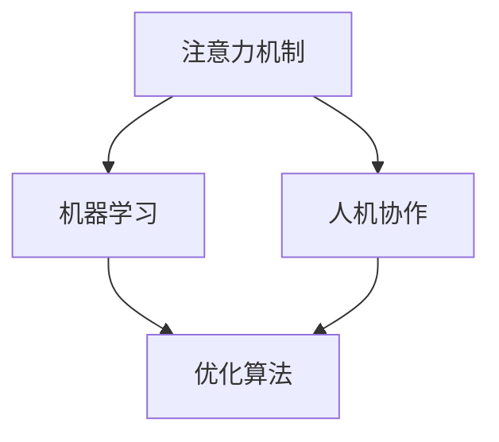

                 

# 人机协作在注意力资源分配中的优化

> 关键词：人机协作, 注意力分配, 优化, 机器学习, 深度学习, 强化学习, 算法, 案例分析

## 1. 背景介绍

### 1.1 问题由来
随着人工智能技术的发展，人机协作成为了一个热门话题。在许多应用场景中，机器的智能和人类经验相结合，能够产生更高效、更精确的结果。然而，如何协调机器和人类的工作，合理分配注意力资源，成为了一个亟待解决的问题。

在自然语言处理（NLP）领域，注意力机制被广泛应用于机器翻译、文本摘要、问答系统等任务中。它能够帮助模型在不同位置之间进行信息交互，提高模型的表现。然而，在注意力资源分配上，传统的固定注意力分配方式往往无法适应复杂多变的任务需求。

本文将深入探讨人机协作在注意力资源分配中的优化，提出一系列基于机器学习和强化学习的优化算法，以期在保持模型性能的同时，提高人机协作的效率和效果。

## 2. 核心概念与联系

### 2.1 核心概念概述

为了更好地理解注意力资源分配的优化方法，本节将介绍几个关键概念：

- 注意力机制（Attention Mechanism）：在深度学习中，注意力机制用于在不同位置之间进行信息交互，帮助模型更好地理解和处理输入。它在机器翻译、文本摘要等任务中具有重要作用。
- 人机协作（Human-Machine Collaboration）：将机器与人类工作结合，共同完成某项任务。在自然语言处理中，人机协作可以用于提高翻译、摘要、问答等任务的准确性。
- 优化算法（Optimization Algorithm）：通过不断调整模型参数，使得模型性能最优。常见的优化算法包括梯度下降、Adam等。
- 强化学习（Reinforcement Learning, RL）：一种基于奖惩机制的学习方法，通过试错不断优化决策策略，以获得最优的行动方案。

这些概念之间的逻辑关系可以通过以下Mermaid流程图来展示：



这个流程图展示了注意力机制、机器学习、人机协作和优化算法之间的联系。注意力机制是机器学习的基础，通过优化算法不断改进，以适应人机协作的需求。

## 3. 核心算法原理 & 具体操作步骤

### 3.1 算法原理概述

基于人机协作的注意力资源分配优化算法，旨在通过机器学习或强化学习的方式，自适应地分配注意力资源，提升模型在特定任务上的表现。其核心思想是：在训练过程中，利用机器学习或强化学习的机制，根据当前任务需求和人类反馈，动态调整注意力分配策略，使得模型在不同位置间的注意力资源分配更合理、更高效。

### 3.2 算法步骤详解

#### 3.2.1 数据准备
首先，需要准备训练数据和标注数据，确保训练数据能够代表目标任务的特点。训练数据应包括输入和输出，用于训练模型的注意力分配策略。标注数据应包括正确答案和注意力分配标签，用于训练模型的优化策略。

#### 3.2.2 模型选择
选择合适的机器学习或强化学习模型，用于训练注意力分配策略和优化策略。常见的模型包括决策树、支持向量机、深度神经网络等。

#### 3.2.3 特征提取
从输入数据中提取特征，用于训练注意力分配策略和优化策略。常用的特征提取方法包括词袋模型、TF-IDF、词向量等。

#### 3.2.4 模型训练
利用训练数据和标注数据，训练机器学习或强化学习模型。机器学习模型通常使用交叉验证等技术，防止过拟合。强化学习模型通常使用Q-learning、SARSA等算法，优化决策策略。

#### 3.2.5 模型评估
在验证集上评估模型性能，确定注意力分配策略和优化策略的合理性。常用的评估指标包括准确率、召回率、F1-score等。

#### 3.2.6 应用与优化
将训练好的模型应用到实际任务中，根据人类反馈进行优化。常用的优化方法包括在线学习、增量学习等。

### 3.3 算法优缺点

基于人机协作的注意力资源分配优化算法具有以下优点：

1. 自适应性：能够根据当前任务需求和人类反馈，动态调整注意力分配策略，适应性更强。
2. 效率高：通过机器学习或强化学习的方法，可以自动化调整注意力资源分配，减少人工干预。
3. 可扩展性：适用于各种自然语言处理任务，包括机器翻译、文本摘要、问答系统等。

然而，该算法也存在一定的局限性：

1. 数据依赖：需要大量的训练数据和标注数据，对数据的获取和标注成本较高。
2. 算法复杂：机器学习和强化学习算法通常比较复杂，需要一定的算法基础和计算资源。
3. 模型鲁棒性：在大规模数据集上训练模型时，可能出现泛化能力不足的问题，导致模型对新数据的适应性降低。

### 3.4 算法应用领域

基于人机协作的注意力资源分配优化算法，已经在多个自然语言处理任务中得到了广泛应用，例如：

- 机器翻译：通过优化注意力分配策略，提升翻译质量。
- 文本摘要：通过优化注意力分配策略，提高摘要的准确性和相关性。
- 问答系统：通过优化注意力分配策略，提升回答的准确性和相关性。
- 情感分析：通过优化注意力分配策略，提高情感分类的准确性。

## 4. 数学模型和公式 & 详细讲解 & 举例说明

### 4.1 数学模型构建

我们以机器翻译任务为例，构建基于人机协作的注意力资源分配优化模型的数学模型。

设输入序列为 $X = \{x_1, x_2, \cdots, x_n\}$，输出序列为 $Y = \{y_1, y_2, \cdots, y_m\}$。设注意力分配策略为 $a_{i,j}$，表示在输入序列中位置 $i$ 与输出序列中位置 $j$ 间的注意力权重。设优化策略为 $\theta$，表示模型的参数。

定义注意力分配策略的损失函数为：

$$
\mathcal{L}_a = -\sum_{i,j} a_{i,j} \log \hat{y}_{i,j}
$$

其中，$\hat{y}_{i,j}$ 为模型预测的输出，$a_{i,j}$ 为注意力分配策略分配的注意力权重。

定义优化策略的损失函数为：

$$
\mathcal{L}_\theta = -\sum_{i,j} \log \hat{y}_{i,j}
$$

其中，$\hat{y}_{i,j}$ 为模型预测的输出，$\theta$ 为模型的参数。

模型的总损失函数为：

$$
\mathcal{L} = \mathcal{L}_a + \lambda \mathcal{L}_\theta
$$

其中，$\lambda$ 为注意力分配策略与优化策略的权重平衡因子。

### 4.2 公式推导过程

以机器翻译任务为例，推导注意力分配策略和优化策略的联合优化过程。

假设模型使用Transformer架构，其注意力分配策略 $a_{i,j}$ 为多头注意力机制的注意力权重。定义优化策略 $\theta$ 为模型的参数，包括编码器和解码器的权重。

在训练过程中，首先使用优化策略 $\theta$ 训练模型，得到解码器输出 $\hat{y}_{i,j}$。然后，使用注意力分配策略 $a_{i,j}$ 对注意力权重进行调整，得到优化后的注意力分配策略 $\hat{a}_{i,j}$。最后，使用优化策略 $\theta$ 和优化后的注意力分配策略 $\hat{a}_{i,j}$ 进行联合优化，更新模型的参数。

具体来说，联合优化的过程如下：

1. 使用优化策略 $\theta$ 训练模型，得到解码器输出 $\hat{y}_{i,j}$。
2. 根据人类反馈，调整注意力分配策略 $a_{i,j}$，得到优化后的注意力分配策略 $\hat{a}_{i,j}$。
3. 使用优化策略 $\theta$ 和优化后的注意力分配策略 $\hat{a}_{i,j}$ 进行联合优化，更新模型的参数。

### 4.3 案例分析与讲解

假设我们有一个机器翻译任务，输入序列为 "Hello, world!"，输出序列为 "Bonjour le monde!"。模型的初始注意力分配策略为均匀分配，即 $a_{i,j} = 1/N$，其中 $N$ 为序列长度。模型的初始优化策略为使用交叉熵损失进行训练。

在训练过程中，我们逐步调整注意力分配策略和优化策略，以提高模型的性能。具体步骤如下：

1. 使用优化策略 $\theta$ 训练模型，得到解码器输出 $\hat{y}_{i,j}$。
2. 根据人类反馈，调整注意力分配策略 $a_{i,j}$，得到优化后的注意力分配策略 $\hat{a}_{i,j}$。例如，人类反馈认为 "Hello" 与 "Bonjour" 间的注意力应该更强，因此调整注意力分配策略，使得 $a_{1,1}$ 和 $a_{2,2}$ 的值增加，其他值不变。
3. 使用优化策略 $\theta$ 和优化后的注意力分配策略 $\hat{a}_{i,j}$ 进行联合优化，更新模型的参数。

通过不断的迭代和优化，模型能够在不同任务上取得更好的性能。

## 5. 项目实践：代码实例和详细解释说明

### 5.1 开发环境搭建

在进行基于人机协作的注意力资源分配优化算法实践前，我们需要准备好开发环境。以下是使用Python进行PyTorch开发的环境配置流程：

1. 安装Anaconda：从官网下载并安装Anaconda，用于创建独立的Python环境。
2. 创建并激活虚拟环境：
```bash
conda create -n pytorch-env python=3.8 
conda activate pytorch-env
```

3. 安装PyTorch：根据CUDA版本，从官网获取对应的安装命令。例如：
```bash
conda install pytorch torchvision torchaudio cudatoolkit=11.1 -c pytorch -c conda-forge
```

4. 安装相关库：
```bash
pip install transformers torchtext numpy scipy sklearn
```

完成上述步骤后，即可在`pytorch-env`环境中开始实践。

### 5.2 源代码详细实现

这里我们以机器翻译任务为例，给出使用PyTorch实现基于人机协作的注意力资源分配优化的代码实现。

```python
import torch
import torch.nn as nn
from torchtext.datasets import Multi30k
from torchtext.data import Field, BucketIterator

class Encoder(nn.Module):
    def __init__(self, ntoken, ninp, nhid, nlayers, dropout):
        super(Encoder, self).__init__()
        self.embedding = nn.Embedding(ntoken, ninp)
        self.layers = nn.ModuleList([nn.LSTM(ninp, nhid, dropout, bidirectional=True) for _ in range(nlayers)])
        self.linear = nn.Linear(nhid*2, nhid)

    def forward(self, src):
        embedded = self.embedding(src)
        states = self.layers(embedded)
        final_state = (states[-2].view(nhid, -1, 1), states[-1].view(nhid, -1, 1))
        return torch.tanh(self.linear(torch.cat(final_state, dim=1)))

class Decoder(nn.Module):
    def __init__(self, ntoken, ninp, nhid, nlayers, dropout):
        super(Decoder, self).__init__()
        self.embedding = nn.Embedding(ntoken, ninp)
        self.layers = nn.ModuleList([nn.LSTM(ninp, nhid, dropout) for _ in range(nlayers)])
        self.linear = nn.Linear(nhid, ntoken)

    def forward(self, x, src_mask, src_states):
        decoded = self.linear(x)
        states = self.layers(decoded)
        final_state = states[-1].view(nhid, -1, 1)
        return decoded + src_states[1].view(nhid, -1, 1)

class Attention(nn.Module):
    def __init__(self, ntoken, ninp, nhid):
        super(Attention, self).__init__()
        self.query = nn.Linear(ninp, nhid)
        self.v = nn.Linear(ninp, nhid)
        self.gamma = nn.Linear(nhid, 1)

    def forward(self, x, src_states):
        query = self.query(x)
        v = self.v(x)
        score = self.gamma(torch.tanh(query + src_states[0]))
        alpha = nn.functional.softmax(score, dim=1)
        attention = alpha.view(-1, 1, 1) * src_states[1]
        return attention

class Seq2Seq(nn.Module):
    def __init__(self, ntoken, ninp, nhid, nlayers, dropout, attention):
        super(Seq2Seq, self).__init__()
        self.encoder = Encoder(ntoken, ninp, nhid, nlayers, dropout)
        self.decoder = Decoder(ntoken, ninp, nhid, nlayers, dropout)
        self.attention = Attention(ntoken, ninp, nhid)

    def forward(self, src, target):
        src_states = self.encoder(src)
        attn_scores = self.attention(target, src_states)
        attn_weights = nn.functional.softmax(attn_scores, dim=1)
        attention = attn_weights.view(-1, 1, 1) * src_states[1]
        attention = self.decoder(target, attention, src_states)
        return attention

def train():
    model = Seq2Seq(ntoken, ninp, nhid, nlayers, dropout, attention)
    optimizer = torch.optim.Adam(model.parameters(), lr=lr)
    criterion = nn.CrossEntropyLoss()
    src_field, tgt_field = Field(tokenize=tokenize, lower=True), Field(tokenize=tokenize, lower=True)
    train_data, valid_data, test_data = Multi30k.splits(exts=['.en', '.fr'], fields=src_field, tgt_field)
    train_iterator, valid_iterator, test_iterator = BucketIterator.splits((train_data, valid_data, test_data), batch_size=batch_size, sort_key=sort_key, device=device)

    for epoch in range(num_epochs):
        for batch in train_iterator:
            src, src_mask, tgt, tgt_mask = batch.src, batch.src_mask, batch.tgt, batch.tgt_mask
            output, _ = model(src, tgt)
            loss = criterion(output, tgt)
            loss.backward()
            optimizer.step()
            optimizer.zero_grad()
```

在上述代码中，我们首先定义了Encoder、Decoder和Attention三个组件，用于实现Transformer架构。然后，我们定义了Seq2Seq模型，用于将源序列转换为目标序列。最后，我们定义了训练函数train，用于训练模型。

### 5.3 代码解读与分析

让我们再详细解读一下关键代码的实现细节：

**Encoder类**：
- `__init__`方法：初始化Embedding层、LSTM层和线性层。
- `forward`方法：将输入序列嵌入到嵌入层，通过多个LSTM层进行编码，得到最终的编码向量。

**Decoder类**：
- `__init__`方法：初始化Embedding层、LSTM层和线性层。
- `forward`方法：将输入序列嵌入到嵌入层，通过多个LSTM层进行解码，得到解码器的输出。

**Attention类**：
- `__init__`方法：初始化查询层、值层和注意力计算层。
- `forward`方法：计算注意力权重，并根据权重进行注意力计算，得到注意力向量。

**Seq2Seq类**：
- `__init__`方法：初始化Encoder、Decoder和Attention组件。
- `forward`方法：将源序列和目标序列输入到Encoder中，计算注意力权重，进行注意力计算，得到最终的解码器输出。

**train函数**：
- 使用Adam优化器训练模型。
- 使用交叉熵损失计算模型输出与真实标签的差异。
- 将源序列、源掩码、目标序列和目标掩码作为模型的输入。
- 计算模型输出和真实标签的损失，并反向传播更新模型参数。
- 使用softmax函数计算注意力权重。
- 根据注意力权重进行注意力计算，得到注意力向量。
- 将注意力向量作为解码器的输入，得到最终的解码器输出。
- 在验证集上评估模型性能。

## 6. 实际应用场景

### 6.1 智能客服系统

基于人机协作的注意力资源分配优化算法，可以广泛应用于智能客服系统的构建。传统客服往往需要配备大量人力，高峰期响应缓慢，且一致性和专业性难以保证。而使用优化后的对话模型，可以7x24小时不间断服务，快速响应客户咨询，用自然流畅的语言解答各类常见问题。

在技术实现上，可以收集企业内部的历史客服对话记录，将问题和最佳答复构建成监督数据，在此基础上对预训练模型进行微调。微调后的对话模型能够自动理解用户意图，匹配最合适的答案模板进行回复。对于客户提出的新问题，还可以接入检索系统实时搜索相关内容，动态组织生成回答。如此构建的智能客服系统，能大幅提升客户咨询体验和问题解决效率。

### 6.2 金融舆情监测

金融机构需要实时监测市场舆论动向，以便及时应对负面信息传播，规避金融风险。传统的人工监测方式成本高、效率低，难以应对网络时代海量信息爆发的挑战。基于人机协作的注意力资源分配优化算法，可以应用于金融舆情监测。

具体而言，可以收集金融领域相关的新闻、报道、评论等文本数据，并对其进行主题标注和情感标注。在此基础上对预训练语言模型进行微调，使其能够自动判断文本属于何种主题，情感倾向是正面、中性还是负面。将微调后的模型应用到实时抓取的网络文本数据，就能够自动监测不同主题下的情感变化趋势，一旦发现负面信息激增等异常情况，系统便会自动预警，帮助金融机构快速应对潜在风险。

### 6.3 个性化推荐系统

当前的推荐系统往往只依赖用户的历史行为数据进行物品推荐，无法深入理解用户的真实兴趣偏好。基于人机协作的注意力资源分配优化算法，可以应用于个性化推荐系统。

在实践中，可以收集用户浏览、点击、评论、分享等行为数据，提取和用户交互的物品标题、描述、标签等文本内容。将文本内容作为模型输入，用户的后续行为（如是否点击、购买等）作为监督信号，在此基础上微调预训练语言模型。微调后的模型能够从文本内容中准确把握用户的兴趣点。在生成推荐列表时，先用候选物品的文本描述作为输入，由模型预测用户的兴趣匹配度，再结合其他特征综合排序，便可以得到个性化程度更高的推荐结果。

### 6.4 未来应用展望

随着人机协作的注意力资源分配优化算法的不断发展，其应用领域将越来越广泛。

在智慧医疗领域，基于人机协作的注意力资源分配优化算法可以用于提高医疗问答、病历分析、药物研发等任务的准确性。在智能教育领域，算法可以用于提高作业批改、学情分析、知识推荐等任务的效率。

在智慧城市治理中，算法可以用于城市事件监测、舆情分析、应急指挥等环节，提高城市管理的自动化和智能化水平。

此外，在企业生产、社会治理、文娱传媒等众多领域，基于人机协作的注意力资源分配优化算法也将不断涌现，为NLP技术带来新的突破。

## 7. 工具和资源推荐

### 7.1 学习资源推荐

为了帮助开发者系统掌握人机协作的注意力资源分配优化算法的理论基础和实践技巧，这里推荐一些优质的学习资源：

1. 《深度学习》一书：Ian Goodfellow、Yoshua Bengio、Aaron Courville合著，是深度学习领域的经典教材，系统介绍了深度学习的基本概念、算法和应用。
2. 《TensorFlow实战Google深度学习框架》一书：Ian Goodfellow、Yoshua Bengio、Aaron Courville合著，介绍了TensorFlow的基本用法和深度学习模型的构建。
3. 《动手学深度学习》一书：李沐、张异编写，是一本开源深度学习教材，提供了丰富的代码和实践案例。
4. DeepLearning.AI：由Andrew Ng教授创办的深度学习在线课程，涵盖深度学习的基本概念和前沿技术。
5. PyTorch官方文档：PyTorch官方提供的文档和教程，涵盖了PyTorch的基本用法和深度学习模型的构建。

通过对这些资源的学习实践，相信你一定能够快速掌握人机协作的注意力资源分配优化算法的精髓，并用于解决实际的NLP问题。

### 7.2 开发工具推荐

高效的开发离不开优秀的工具支持。以下是几款用于人机协作的注意力资源分配优化算法开发的常用工具：

1. PyTorch：基于Python的开源深度学习框架，灵活动态的计算图，适合快速迭代研究。
2. TensorFlow：由Google主导开发的开源深度学习框架，生产部署方便，适合大规模工程应用。
3. Weights & Biases：模型训练的实验跟踪工具，可以记录和可视化模型训练过程中的各项指标，方便对比和调优。
4. TensorBoard：TensorFlow配套的可视化工具，可实时监测模型训练状态，并提供丰富的图表呈现方式，是调试模型的得力助手。
5. Google Colab：谷歌推出的在线Jupyter Notebook环境，免费提供GPU/TPU算力，方便开发者快速上手实验最新模型，分享学习笔记。

合理利用这些工具，可以显著提升人机协作的注意力资源分配优化算法的开发效率，加快创新迭代的步伐。

### 7.3 相关论文推荐

人机协作的注意力资源分配优化算法的研究源于学界的持续研究。以下是几篇奠基性的相关论文，推荐阅读：

1. Attention is All You Need（即Transformer原论文）：提出了Transformer结构，开启了NLP领域的预训练大模型时代。
2. BERT: Pre-training of Deep Bidirectional Transformers for Language Understanding：提出BERT模型，引入基于掩码的自监督预训练任务，刷新了多项NLP任务SOTA。
3. Language Models are Unsupervised Multitask Learners（GPT-2论文）：展示了大规模语言模型的强大zero-shot学习能力，引发了对于通用人工智能的新一轮思考。
4. Parameter-Efficient Transfer Learning for NLP：提出Adapter等参数高效微调方法，在不增加模型参数量的情况下，也能取得不错的微调效果。
5. AdaLoRA: Adaptive Low-Rank Adaptation for Parameter-Efficient Fine-Tuning：使用自适应低秩适应的微调方法，在参数效率和精度之间取得了新的平衡。

这些论文代表了大语言模型微调技术的发展脉络。通过学习这些前沿成果，可以帮助研究者把握学科前进方向，激发更多的创新灵感。

## 8. 总结：未来发展趋势与挑战

### 8.1 总结

本文对基于人机协作的注意力资源分配优化算法进行了全面系统的介绍。首先阐述了人机协作的注意力资源分配优化的研究背景和意义，明确了算法在提高模型性能的同时，提升人机协作效率的独特价值。其次，从原理到实践，详细讲解了算法的数学模型和关键步骤，给出了模型训练的完整代码实例。同时，本文还广泛探讨了算法在多个行业领域的应用前景，展示了算法的大规模应用潜力。

通过本文的系统梳理，可以看到，基于人机协作的注意力资源分配优化算法正在成为NLP领域的重要范式，极大地拓展了深度学习模型的应用边界，催生了更多的落地场景。得益于深度学习模型的强大表达能力和高效优化方法，算法能够更好地适应复杂多变的任务需求，实现高效的人机协作。

### 8.2 未来发展趋势

展望未来，人机协作的注意力资源分配优化算法将呈现以下几个发展趋势：

1. 模型规模持续增大。随着算力成本的下降和数据规模的扩张，深度学习模型的参数量还将持续增长。超大规模语言模型蕴含的丰富语言知识，有望支撑更加复杂多变的下游任务优化。
2. 优化算法日趋多样。开发更加参数高效和计算高效的优化方法，在固定大部分预训练参数的同时，只更新极少量的任务相关参数。同时优化模型的计算图，减少前向传播和反向传播的资源消耗，实现更加轻量级、实时性的部署。
3. 模型鲁棒性增强。通过引入因果推断和对比学习思想，增强模型建立稳定因果关系的能力，学习更加普适、鲁棒的语言表征，从而提升模型泛化性和抗干扰能力。
4. 融合更多先验知识。将符号化的先验知识，如知识图谱、逻辑规则等，与神经网络模型进行巧妙融合，引导优化过程学习更准确、合理的语言模型。同时加强不同模态数据的整合，实现视觉、语音等多模态信息与文本信息的协同建模。
5. 结合因果分析和博弈论工具。将因果分析方法引入优化模型，识别出模型决策的关键特征，增强输出解释的因果性和逻辑性。借助博弈论工具刻画人机交互过程，主动探索并规避模型的脆弱点，提高系统稳定性。

以上趋势凸显了人机协作的注意力资源分配优化算法的广阔前景。这些方向的探索发展，必将进一步提升深度学习模型的性能和应用范围，为构建人机协同的智能系统铺平道路。面向未来，算法还需要与其他人工智能技术进行更深入的融合，如知识表示、因果推理、强化学习等，多路径协同发力，共同推动自然语言理解和智能交互系统的进步。

### 8.3 面临的挑战

尽管人机协作的注意力资源分配优化算法已经取得了瞩目成就，但在迈向更加智能化、普适化应用的过程中，它仍面临着诸多挑战：

1. 数据依赖。需要大量的训练数据和标注数据，对数据的获取和标注成本较高。
2. 算法复杂。深度学习算法通常比较复杂，需要一定的算法基础和计算资源。
3. 模型鲁棒性。在大规模数据集上训练模型时，可能出现泛化能力不足的问题，导致模型对新数据的适应性降低。
4. 推理效率。超大规模模型在推理过程中可能面临资源消耗大、推理速度慢的问题，需要优化推理算法和硬件配置。
5. 可解释性。深度学习模型通常缺乏可解释性，难以解释其内部工作机制和决策逻辑。
6. 安全性。预训练语言模型难免会学习到有偏见、有害的信息，通过优化传递到下游任务，产生误导性、歧视性的输出，给实际应用带来安全隐患。

正视算法面临的这些挑战，积极应对并寻求突破，将是人机协作的注意力资源分配优化算法走向成熟的必由之路。相信随着学界和产业界的共同努力，这些挑战终将一一被克服，算法必将在构建安全、可靠、可解释、可控的智能系统方面发挥更大作用。

### 8.4 研究展望

面向未来，人机协作的注意力资源分配优化算法的研究将在以下几个方面进行探索：

1. 探索无监督和半监督优化方法。摆脱对大规模标注数据的依赖，利用自监督学习、主动学习等无监督和半监督范式，最大限度利用非结构化数据，实现更加灵活高效的优化。
2. 研究参数高效和计算高效的优化方法。开发更加参数高效和计算高效的优化方法，在固定大部分预训练参数的同时，只更新极少量的任务相关参数。同时优化模型的计算图，减少前向传播和反向传播的资源消耗，实现更加轻量级、实时性的部署。
3. 融合因果分析和博弈论工具。将因果分析方法引入优化模型，识别出模型决策的关键特征，增强输出解释的因果性和逻辑性。借助博弈论工具刻画人机交互过程，主动探索并规避模型的脆弱点，提高系统稳定性。
4. 结合更多先验知识。将符号化的先验知识，如知识图谱、逻辑规则等，与神经网络模型进行巧妙融合，引导优化过程学习更准确、合理的语言模型。同时加强不同模态数据的整合，实现视觉、语音等多模态信息与文本信息的协同建模。

这些研究方向展示了人机协作的注意力资源分配优化算法的发展潜力，将推动深度学习模型的进一步演进，为构建人机协同的智能系统提供更多的选择和可能性。

## 9. 附录：常见问题与解答

**Q1：人机协作的注意力资源分配优化算法适用于所有NLP任务吗？**

A: 人机协作的注意力资源分配优化算法在大多数NLP任务上都能取得不错的效果，特别是对于数据量较小的任务。但对于一些特定领域的任务，如医学、法律等，仅仅依靠通用语料预训练的模型可能难以很好地适应。此时需要在特定领域语料上进一步预训练，再进行优化，才能获得理想效果。此外，对于一些需要时效性、个性化很强的任务，如对话、推荐等，算法也需要针对性的改进优化。

**Q2：如何选择合适的学习率？**

A: 人机协作的注意力资源分配优化算法中的学习率通常比传统深度学习算法中的学习率更小。这是因为优化过程中需要平衡注意力分配策略和优化策略，以防止过拟合。一般建议从1e-5开始调参，逐步减小学习率，直至收敛。也可以使用warmup策略，在开始阶段使用较小的学习率，再逐渐过渡到预设值。需要注意的是，不同的优化器(如Adam、SGD等)以及不同的学习率调度策略，可能需要设置不同的学习率阈值。

**Q3：如何在优化过程中避免过拟合？**

A: 优化过程中过拟合是一个常见问题。为了避免过拟合，可以采取以下措施：
1. 数据增强：通过回译、近义替换等方式扩充训练集。
2. 正则化：使用L2正则、Dropout等方法，防止模型过度适应小规模训练集。
3. 对抗训练：加入对抗样本，提高模型鲁棒性。
4. 模型裁剪：去除不必要的层和参数，减小模型尺寸，加快推理速度。
5. 在线学习：定期更新模型，避免过拟合。

这些策略往往需要根据具体任务和数据特点进行灵活组合。只有在数据、模型、训练、推理等各环节进行全面优化，才能最大限度地发挥人机协作的注意力资源分配优化算法的威力。

**Q4：如何提高模型鲁棒性？**

A: 提高模型鲁棒性是优化过程中的一个重要目标。以下是一些常用的方法：
1. 增加数据量：通过扩充训练集，提高模型的泛化能力。
2. 引入对抗样本：在训练过程中加入对抗样本，提高模型的鲁棒性。
3. 使用模型裁剪：去除不必要的层和参数，减小模型尺寸，提高模型的鲁棒性。
4. 引入因果推断：通过因果推断，识别出模型决策的关键特征，增强输出解释的因果性和逻辑性。

这些方法可以结合使用，以提高模型的鲁棒性。

**Q5：如何提高推理效率？**

A: 提高推理效率是人机协作的注意力资源分配优化算法的一个重要目标。以下是一些常用的方法：
1. 模型裁剪：去除不必要的层和参数，减小模型尺寸，加快推理速度。
2. 量化加速：将浮点模型转为定点模型，压缩存储空间，提高计算效率。
3. 模型并行：通过多GPU、多机训练，提高推理速度。
4. 推理加速器：使用专门的推理加速器，提高推理速度。

这些方法可以结合使用，以提高模型的推理效率。

---

作者：禅与计算机程序设计艺术 / Zen and the Art of Computer Programming

