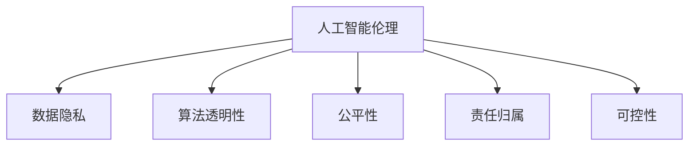

                 

# 人机协作：伦理规范与准则

> 关键词：人机协作,人工智能伦理,数据隐私,算法透明性,伦理规范,准则框架

## 1. 背景介绍

### 1.1 问题由来
人工智能(AI)技术正以前所未有的速度和规模进入社会的各个领域，与人机协作息息相关。从智能助理到自动驾驶，从医疗诊断到金融决策，人工智能的广泛应用带来了巨大的经济和社会效益。然而，随着AI技术的不断成熟，伦理问题也逐渐显现出来，迫切需要制定一套系统的伦理规范和准则，以指导AI的发展和应用。

### 1.2 问题核心关键点
目前，人工智能伦理问题的核心关键点主要包括以下几个方面：

- **数据隐私**：在AI训练和应用过程中，如何保护个人数据的隐私和安全。
- **算法透明性**：AI模型的决策过程是否透明，能否向用户解释其工作机制。
- **公平性**：AI系统是否公平，能否避免歧视和偏见。
- **责任归属**：在AI系统发生错误或违规行为时，责任应由谁承担。
- **可控性**：用户或监管机构是否能够控制和干预AI的行为。

本文将重点探讨如何通过制定伦理规范和准则，解决这些关键问题，确保AI技术的发展和应用始终符合伦理道德的要求。

## 2. 核心概念与联系

### 2.1 核心概念概述

为更好地理解人机协作中的伦理规范和准则，本节将介绍几个密切相关的核心概念：

- **人工智能伦理(Ethics of AI)**：指在AI发展过程中需要遵循的伦理原则和规范，旨在平衡技术进步与道德价值。
- **数据隐私(Privacy)**：指在数据收集、存储、处理和使用过程中，保护个人隐私和信息安全。
- **算法透明性(Algorithmic Transparency)**：指AI模型的决策过程是否透明，用户能否理解和解释其工作机制。
- **公平性(Fairness)**：指AI系统是否公平，能否避免歧视和偏见，提供公正的服务。
- **责任归属(Liability)**：指在AI系统发生错误或违规行为时，责任应由谁承担，如何界定。
- **可控性(Controllability)**：指用户或监管机构是否能够控制和干预AI的行为，保障系统的安全稳定。

这些核心概念之间的逻辑关系可以通过以下Mermaid流程图来展示：



这个流程图展示了一些核心概念及其之间的关系：

1. 人工智能伦理是人机协作的总体原则，影响其他各个方面。
2. 数据隐私和算法透明性是伦理规范的具体要求，保证数据的合法使用和算法的公正性。
3. 公平性和责任归属涉及AI系统如何影响社会，需要建立明确的伦理标准和责任体系。
4. 可控性保证AI系统能够被用户和监管机构有效管理和监督。

## 3. 核心算法原理 & 具体操作步骤
### 3.1 算法原理概述

人机协作中的伦理规范和准则主要通过算法和机制来实现。本文将从以下几个方面探讨核心算法原理：

- **数据隐私保护算法**：如何在数据收集、存储和使用过程中，确保个人隐私和信息安全。
- **算法透明性增强算法**：如何设计透明性高的算法，使用户能够理解和解释AI决策过程。
- **公平性算法**：如何设计公平的AI系统，避免歧视和偏见。
- **责任归属机制**：如何在AI系统发生错误或违规行为时，界定责任。
- **可控性增强算法**：如何设计可控性强的AI系统，让用户和监管机构能够干预和管理。

### 3.2 算法步骤详解

以下是详细的操作步骤，具体说明如何通过算法实现人机协作中的伦理规范和准则：

**步骤1: 制定伦理规范和准则**

1. 定义伦理规范和准则的基本框架，明确AI系统的总体目标和价值导向。
2. 对数据隐私、算法透明性、公平性、责任归属和可控性等方面，制定具体要求和标准。

**步骤2: 设计数据隐私保护算法**

1. 数据匿名化：通过数据脱敏、伪装等技术，确保数据在处理和共享时，个人隐私不被泄露。
2. 差分隐私：在数据查询和分析过程中，引入噪声干扰，保护个体数据的安全性。
3. 联邦学习：在分布式环境中，通过多方协作学习，避免数据的集中存储和传输。

**步骤3: 设计算法透明性增强算法**

1. 可解释AI(Explainable AI)：通过模型解释技术，使用户能够理解AI决策过程的依据。
2. 模型可视化：通过可视化工具，展示AI模型的内部结构和工作原理。
3. 模型注释：在模型训练和部署过程中，添加注释和文档，解释关键参数和决策逻辑。

**步骤4: 设计公平性算法**

1. 数据平衡处理：通过重新采样、加权等技术，确保训练数据集中的各类样本数量平衡。
2. 偏见检测和修正：检测和消除模型中的歧视和偏见，优化模型决策过程。
3. 多样化数据集：使用多样化的数据集训练模型，提高模型的泛化能力。

**步骤5: 设计责任归属机制**

1. 责任链追溯：建立责任链条，从输入数据到模型输出，追溯AI决策的各个环节。
2. 责任划分规则：根据模型错误和违规行为的不同类型，明确责任归属。
3. 责任保险：为高风险AI系统提供责任保险，分散风险。

**步骤6: 设计可控性增强算法**

1. 用户干预接口：设计用户友好的干预接口，使用户能够直接控制和调整AI系统。
2. 监管接口：提供监管机构和法律人员的访问接口，实现对AI系统的实时监控和管理。
3. 系统安全设计：加强系统安全设计，防止恶意攻击和非法操作。

### 3.3 算法优缺点

基于算法的伦理规范和准则有以下优点：

1. **系统化和规范化**：通过算法实现伦理规范和准则，使得伦理问题得到系统化的处理和规范化管理。
2. **技术可行性高**：算法技术成熟度较高，易于实现和应用。
3. **动态调整**：算法可以根据数据和环境的变化，进行动态调整和优化。

同时，这些算法也存在一定的局限性：

1. **实施成本高**：算法设计和实施可能需要较高的技术投入和资源配置。
2. **模型复杂性**：算法模型可能较为复杂，理解和使用难度较大。
3. **效果依赖数据**：算法的有效性依赖于数据的质量和多样性，数据不足或偏差可能导致问题。

## 4. 数学模型和公式 & 详细讲解  
### 4.1 数学模型构建

本节将使用数学语言对人机协作中的伦理规范和准则进行更加严格的刻画。

假设AI系统接收输入数据 $x$，输出结果 $y$，目标是设计一个模型 $f(x) = y$，使得 $f(x)$ 满足伦理规范和准则的要求。

**数据隐私保护**：
- 数据匿名化算法：$P: D \rightarrow \tilde{D}$
- 差分隐私算法：$Q: D \rightarrow D'$
- 联邦学习算法：$L: D \rightarrow D_{aggregated}$

其中 $D$ 表示原始数据集，$\tilde{D}$ 表示匿名化后的数据集，$D'$ 表示差分隐私后的数据集，$D_{aggregated}$ 表示多方协作学习后的聚合数据集。

**算法透明性增强**：
- 可解释AI模型：$f: x \rightarrow y$
- 模型可视化算法：$V: f \rightarrow F$
- 模型注释算法：$C: f \rightarrow A$

其中 $F$ 表示模型内部的决策图，$A$ 表示模型的参数注释和文档。

**公平性算法**：
- 数据平衡处理算法：$B: D \rightarrow D_{balanced}$
- 偏见检测算法：$P: D_{balanced} \rightarrow P_{detected}$
- 偏见修正算法：$C: P_{detected} \rightarrow P_{corrected}$

其中 $D_{balanced}$ 表示平衡处理后的数据集，$P_{detected}$ 表示检测到的偏见，$P_{corrected}$ 表示修正后的无偏见数据集。

**责任归属机制**：
- 责任链追溯算法：$R: D \rightarrow R_{traced}$
- 责任划分规则算法：$H: R_{traced} \rightarrow H_{decided}$
- 责任保险算法：$I: H_{decided} \rightarrow I_{insured}$

其中 $R_{traced}$ 表示责任链追溯结果，$H_{decided}$ 表示责任归属决策，$I_{insured}$ 表示责任保险赔付结果。

**可控性增强算法**：
- 用户干预接口设计算法：$I: f \rightarrow I_{user}$
- 监管接口设计算法：$I: f \rightarrow I_{regulator}$
- 系统安全设计算法：$S: f \rightarrow S_{secure}$

其中 $I_{user}$ 表示用户干预接口，$I_{regulator}$ 表示监管接口，$S_{secure}$ 表示系统安全设计。

### 4.2 公式推导过程

以下我们以数据隐私保护算法中的差分隐私为例，推导其数学模型和推导过程。

假设原始数据集为 $D$，其中包含 $n$ 个样本，每个样本包含 $d$ 个特征。在差分隐私算法中，我们通过引入噪声 $\epsilon$ 来保护数据隐私，其中 $\epsilon$ 表示隐私预算。

**差分隐私模型**：
- 计算任意两个相邻样本 $x_i$ 和 $x_{i+1}$ 的L2范数差异：$\Delta = ||x_i - x_{i+1}||_2$
- 引入Laplace分布噪声：$N \sim Laplace(\Delta, \epsilon)$
- 保护隐私的数据查询结果：$Y = f(D) + N$

其中 $f$ 表示数据查询函数，$N$ 表示噪声向量，$Y$ 表示差分隐私保护后的查询结果。

**推导过程**：
- 对 $D$ 中的每个样本 $x_i$，计算其L2范数差异 $\Delta$。
- 对每个样本 $x_i$，生成Laplace分布噪声 $N_i \sim Laplace(\Delta, \epsilon)$。
- 对每个样本 $x_i$，计算差分隐私保护后的查询结果 $Y_i = f(x_i) + N_i$。
- 汇总所有样本的查询结果，得到差分隐私保护后的数据集 $Y$。

通过差分隐私算法，我们在保留数据查询结果准确性的同时，增加了隐私保护的强度，从而有效保护了个人隐私。

## 5. 项目实践：代码实例和详细解释说明
### 5.1 开发环境搭建

在进行伦理规范和准则的实践前，我们需要准备好开发环境。以下是使用Python进行TensorFlow开发的环境配置流程：

1. 安装Anaconda：从官网下载并安装Anaconda，用于创建独立的Python环境。

2. 创建并激活虚拟环境：
```bash
conda create -n tf-env python=3.8 
conda activate tf-env
```

3. 安装TensorFlow：根据CUDA版本，从官网获取对应的安装命令。例如：
```bash
conda install tensorflow tensorflow-gpu -c conda-forge
```

4. 安装TensorBoard：
```bash
pip install tensorboard
```

5. 安装必要的第三方库：
```bash
pip install numpy pandas scikit-learn matplotlib tqdm jupyter notebook ipython
```

完成上述步骤后，即可在`tf-env`环境中开始伦理规范和准则的实践。

### 5.2 源代码详细实现

下面我们以差分隐私保护算法为例，给出使用TensorFlow实现的数据隐私保护代码实现。

首先，定义差分隐私函数：

```python
import tensorflow as tf
import numpy as np

def differential_privacy(data, epsilon):
    # 计算数据中每个样本的L2范数差异
    delta = np.linalg.norm(data[:,1] - data[:,0], axis=1)
    # 生成Laplace分布噪声
    noise = tf.random.normal([len(data), 1], stddev=1.0/epsilon, dtype=tf.float32)
    # 差分隐私保护后的数据
    protected_data = data + noise
    return protected_data
```

然后，加载数据并应用差分隐私保护：

```python
# 加载原始数据集
data = np.loadtxt('data.txt', delimiter=',')

# 应用差分隐私保护
epsilon = 0.1
protected_data = differential_privacy(data, epsilon)

# 打印保护后的数据
print(protected_data)
```

最后，启动TensorBoard，可视化差分隐私保护过程：

```bash
tensorboard --logdir=logs
```

打开浏览器，访问`http://localhost:6006`，查看差分隐私保护的可视化效果。

### 5.3 代码解读与分析

让我们再详细解读一下关键代码的实现细节：

**differential_privacy函数**：
- `delta`变量：计算每个样本的L2范数差异，用于生成Laplace噪声。
- `noise`变量：使用TensorFlow的随机噪声函数生成Laplace分布噪声，其中`stddev`参数设置为$1.0/\epsilon$，以控制噪声的强度。
- `protected_data`变量：将原始数据和噪声向量相加，得到差分隐私保护后的数据。

**TensorBoard可视化**：
- 通过TensorBoard的可视化工具，可以实时监测差分隐私保护过程中噪声的生成和数据的变化，确保保护效果。
- TensorBoard可以生成各种图表，包括噪声分布、数据变化、隐私预算消耗等，帮助用户和开发者理解和调整算法参数。

通过TensorFlow的代码实现，我们展示了差分隐私保护算法的具体步骤和实现细节。在实践中，开发者可以根据具体场景和需求，灵活调整参数和优化算法，提升数据隐私保护的效果。

## 6. 实际应用场景
### 6.1 智能医疗

在智能医疗领域，患者数据隐私保护至关重要。通过差分隐私保护算法，医疗机构可以在保证数据隐私的前提下，利用患者数据进行分析和研究，提高医疗诊断和治疗的准确性。

具体而言，医疗数据集可以包含患者的病情、治疗记录、基因信息等敏感信息。通过差分隐私保护，医疗数据可以在不泄露个体隐私的前提下，用于模型训练和分析。例如，使用差分隐私保护的病历数据，训练医疗诊断模型，可以提供更准确的疾病预测和治疗方案，同时也保护了患者的隐私权益。

### 6.2 金融风控

在金融风控领域，数据隐私保护同样重要。金融机构需要收集大量的用户交易数据，以进行风险评估和信用评估。然而，这些数据中可能包含用户的敏感信息，如账户余额、交易记录等。通过差分隐私保护算法，金融机构可以在确保数据隐私的前提下，进行风险评估和信用评分。

具体而言，金融机构可以使用差分隐私保护算法，对用户交易数据进行去标识化处理，保留数据的统计特性。然后，使用去标识化后的数据进行模型训练，生成风险评估和信用评分结果。这样，既能保护用户隐私，又能提高金融服务的质量和效率。

### 6.3 社交媒体

在社交媒体平台，用户的言论和行为数据包含大量敏感信息。通过差分隐私保护算法，平台可以在保护用户隐私的前提下，进行数据挖掘和分析，优化用户推荐和广告投放。

具体而言，社交媒体平台可以收集用户的点赞、评论、分享等行为数据，使用差分隐私保护算法进行去标识化处理。然后，使用去标识化后的数据进行模型训练，生成用户兴趣模型和推荐结果。这样，既能保护用户隐私，又能提高推荐的个性化和准确性。

## 7. 工具和资源推荐
### 7.1 学习资源推荐

为了帮助开发者系统掌握人机协作中的伦理规范和准则的理论基础和实践技巧，这里推荐一些优质的学习资源：

1. **《人工智能伦理》系列博文**：由人工智能伦理领域的专家撰写，深入浅出地介绍了AI伦理的基本概念、主要问题和解决方案。

2. **《数据隐私保护》课程**：各大在线教育平台提供的专项课程，涵盖数据隐私保护的基本原理、关键技术和实际应用。

3. **《算法透明性》书籍**：介绍如何设计和实现透明性高的AI算法，帮助开发者理解和解释AI决策过程。

4. **《公平性算法》课程**：介绍如何设计公平的AI算法，避免歧视和偏见，提供公正的服务。

5. **《责任归属机制》论文**：研究如何界定AI系统中的责任归属，提供可行的法律和伦理框架。

6. **《可控性增强算法》书籍**：介绍如何设计可控性强的AI系统，保障用户和监管机构对AI系统的控制和管理。

通过对这些资源的学习实践，相信你一定能够快速掌握人机协作中的伦理规范和准则的精髓，并用于解决实际的AI问题。

### 7.2 开发工具推荐

高效的开发离不开优秀的工具支持。以下是几款用于人机协作中的伦理规范和准则开发的常用工具：

1. **TensorFlow**：开源深度学习框架，支持分布式计算和模型优化，适用于大规模数据分析和模型训练。

2. **PyTorch**：开源深度学习框架，灵活的动态图设计，适合快速迭代和研究。

3. **TensorBoard**：TensorFlow配套的可视化工具，可以实时监测模型训练状态，并提供丰富的图表呈现方式。

4. **Weights & Biases**：模型训练的实验跟踪工具，可以记录和可视化模型训练过程中的各项指标，方便对比和调优。

5. **Jupyter Notebook**：开源的交互式笔记本，支持Python代码的编写、执行和分享，方便开发者进行学习和交流。

合理利用这些工具，可以显著提升人机协作中的伦理规范和准则的开发效率，加快创新迭代的步伐。

### 7.3 相关论文推荐

人机协作中的伦理规范和准则的发展源于学界的持续研究。以下是几篇奠基性的相关论文，推荐阅读：

1. **《人工智能伦理》**：探讨AI伦理的基本原则和实际应用，帮助开发者理解伦理规范和准则的必要性和重要性。

2. **《数据隐私保护》**：研究如何保护数据隐私，确保数据的合法使用和安全性。

3. **《算法透明性》**：介绍透明性高的AI算法设计，帮助开发者设计和实现可解释的AI系统。

4. **《公平性算法》**：研究如何设计公平的AI算法，避免歧视和偏见，提供公正的服务。

5. **《责任归属机制》**：探讨AI系统中的责任归属问题，提供可行的法律和伦理框架。

6. **《可控性增强算法》**：介绍如何设计可控性强的AI系统，保障用户和监管机构对AI系统的控制和管理。

这些论文代表了大规模AI伦理问题的研究脉络。通过学习这些前沿成果，可以帮助研究者把握学科前进方向，激发更多的创新灵感。

## 8. 总结：未来发展趋势与挑战
### 8.1 总结

本文对人机协作中的伦理规范和准则进行了全面系统的介绍。首先阐述了数据隐私、算法透明性、公平性、责任归属和可控性等方面的核心概念和重要性。其次，从原理到实践，详细讲解了人机协作中的伦理规范和准则的实现方法和步骤，给出了具体代码实例和详细解释。同时，本文还探讨了这些伦理规范和准则在智能医疗、金融风控、社交媒体等领域的实际应用场景，展示了伦理规范和准则的广泛价值。

通过本文的系统梳理，可以看到，人机协作中的伦理规范和准则对于AI技术的安全、可靠、可解释和可控具有重要的指导意义。这些规范和准则将帮助开发者在技术开发和应用过程中，始终遵循伦理道德的要求，构建负责任的AI系统。

### 8.2 未来发展趋势

展望未来，人机协作中的伦理规范和准则将呈现以下几个发展趋势：

1. **法律规范的完善**：随着AI技术的普及，各国政府和法律机构将逐步完善AI伦理相关的法律法规，明确伦理规范的边界和要求。

2. **国际标准的统一**：各国将逐步统一AI伦理规范和准则的标准，促进国际合作和互操作性。

3. **多模态数据的整合**：随着AI技术的发展，未来的伦理规范和准则将涵盖更多模态的数据，如视觉、语音、传感器等，形成全面、系统的规范体系。

4. **人工智能治理体系的建立**：通过伦理规范和准则，建立科学、合理、公正的AI治理体系，保障AI技术健康、可持续的发展。

5. **伦理技术的研发**：未来的AI系统将更加注重伦理技术的研发，如差分隐私、可解释AI等，提升AI系统的公平性、透明性和安全性。

这些趋势凸显了伦理规范和准则的重要性，为人机协作中的AI系统提供了更全面的指导和保障。

### 8.3 面临的挑战

尽管人机协作中的伦理规范和准则已经取得了一定的进展，但在迈向更加智能化、普适化应用的过程中，仍面临诸多挑战：

1. **伦理规范的适用性**：不同领域的AI系统需要遵循不同的伦理规范，如何在各个领域内制定合适的规范，是一大难题。

2. **伦理规范的实施难度**：伦理规范和准则的实施需要大量的技术支持和资源配置，实施难度较大。

3. **伦理规范的动态调整**：随着数据和环境的不断变化，伦理规范和准则需要动态调整和优化，确保其时效性和适用性。

4. **伦理规范的一致性**：不同机构和组织之间的伦理规范和准则可能存在差异，如何协调一致性，形成统一的规范体系，是一大挑战。

5. **伦理规范的透明度**：伦理规范和准则的制定和实施过程需要透明、公开，便于社会监督和审查。

6. **伦理规范的普适性**：不同国家和地区的文化和法律体系不同，如何在全球范围内推广普适性的伦理规范，是一大难题。

这些挑战需要多方协同努力，才能克服，为人机协作中的AI系统提供更加全面、公正、透明的伦理保障。

### 8.4 研究展望

面向未来，人机协作中的伦理规范和准则的研究需要在以下几个方面寻求新的突破：

1. **跨学科交叉研究**：结合伦理、法律、社会学等多学科知识，构建更加全面、系统的伦理规范和准则。

2. **国际合作与交流**：加强国际合作与交流，借鉴和学习各国的经验和方法，形成统一的伦理规范和准则。

3. **技术创新与优化**：不断创新和优化伦理规范和准则的技术实现，如差分隐私、可解释AI等，提升伦理规范和准则的效果和适用性。

4. **伦理技术与AI系统的融合**：将伦理技术与AI系统进行深度融合，提升AI系统的公平性、透明性和安全性。

5. **伦理教育与培训**：加强对开发者的伦理教育和培训，提升其伦理意识和责任感，确保AI系统始终符合伦理规范和准则的要求。

这些研究方向和创新思路，必将引领人机协作中的AI伦理问题迈向新的高度，为构建更加公正、透明、可信的AI系统提供坚实的保障。

## 9. 附录：常见问题与解答
----------------------------------------------------------------

**Q1：人机协作中的伦理规范和准则是否适用于所有AI系统？**

A: 人机协作中的伦理规范和准则适用于大部分AI系统，特别是涉及敏感数据、高风险决策的AI系统。对于特定领域内的AI系统，需要根据具体情况制定相应的伦理规范和准则。

**Q2：如何确保数据隐私保护算法的有效性？**

A: 数据隐私保护算法的有效性依赖于算法的参数和数据的特点。可以通过调整算法的参数、增加数据的多样性和代表性、引入差分隐私等方法，提高数据隐私保护的效果。

**Q3：如何设计公平性算法？**

A: 设计公平性算法需要综合考虑数据平衡、偏见检测和修正等多个环节。通过数据平衡处理、偏见检测和修正等技术，确保AI系统在各个群体之间提供公平的服务。

**Q4：如何在AI系统发生错误或违规行为时，界定责任？**

A: 在AI系统发生错误或违规行为时，需要建立明确的责任链条，从数据输入到模型输出，追溯各个环节的责任。同时，根据责任链条的证据，界定责任归属，确保责任的清晰和可追溯性。

**Q5：如何设计可控性增强算法？**

A: 设计可控性增强算法需要综合考虑用户干预接口、监管接口和安全设计等多个方面。通过设计友好的用户干预接口、提供监管接口、加强系统安全设计，确保用户和监管机构能够控制和干预AI系统。

---

作者：禅与计算机程序设计艺术 / Zen and the Art of Computer Programming

