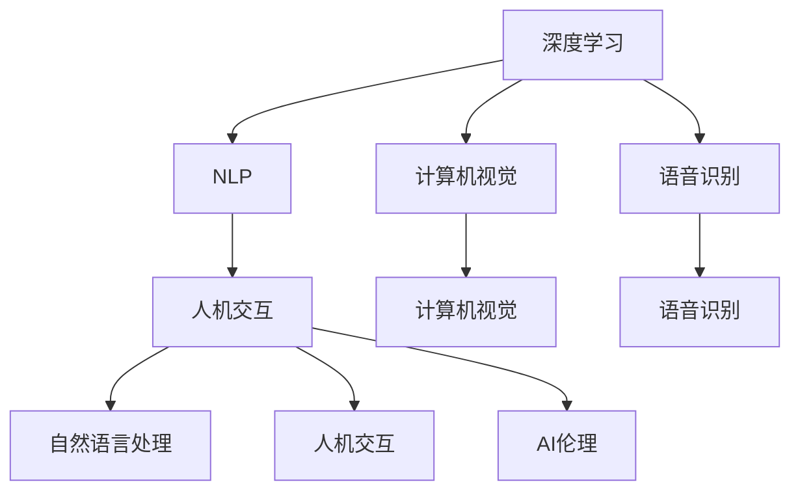

                 

# 人机协同：迈向智能增强的未来之路

> 关键词：人机协同,智能增强,机器学习,深度学习,自然语言处理,NLP,机器视觉,语音识别,AI伦理,人机交互,未来趋势

## 1. 背景介绍

### 1.1 问题由来

在人类历史的长河中，技术的发展总是在不断地塑造和变革着我们的生活方式。从早期的机械化、电气化到信息时代的数字化，每一步都极大地提升了生产效率和生活质量。但技术的进步同时也带来了新的挑战：如何在智能化发展中更好地协调人机关系，让人类与机器协同工作，共同创造价值？

在人工智能(AI)领域，人机协同正成为一个日益重要的话题。通过充分利用机器的智能优势，结合人类的直觉和经验，可以构建更加高效、精准、人性化的智能系统。本文将深入探讨人机协同的原理、方法和应用，旨在为未来的智能增强技术发展提供有益的指导和参考。

### 1.2 问题核心关键点

人机协同的核心在于将机器智能与人类智慧有机结合，形成一个高效、可信的智能系统。具体来说，包括以下几个关键点：

- **机器智能**：通过深度学习、自然语言处理(NLP)、计算机视觉、语音识别等技术，构建能够理解和处理复杂任务的智能模型。
- **人类智慧**：结合人类的直觉、常识、创造力，进行监督、指导、修正，确保系统决策的合理性和可解释性。
- **协同机制**：通过交互界面、决策反馈、模型融合等机制，实现人机之间的信息交换和协作。
- **应用场景**：涵盖工业自动化、医疗诊断、金融预测、智能客服、智能推荐等多个领域。

本文将详细阐述人机协同的原理和实践方法，并通过案例分析展示其应用效果。

## 2. 核心概念与联系

### 2.1 核心概念概述

为了更好地理解人机协同的原理，本节将介绍几个核心概念：

- **深度学习(Deep Learning)**：一种基于神经网络的机器学习范式，通过多层次的非线性变换，能够处理复杂的高维数据。
- **自然语言处理(NLP)**：研究计算机如何处理、理解和生成人类语言的学科，广泛应用于问答系统、文本分类、机器翻译等任务。
- **计算机视觉(Computer Vision)**：研究如何让计算机“看”的学科，涵盖图像识别、目标检测、图像生成等任务。
- **语音识别(Speech Recognition)**：将人类语音转换为文本的技术，广泛应用于语音助手、语音控制等场景。
- **人机交互(Human-Computer Interaction, HCI)**：研究人机之间信息交换和交互的学科，涵盖界面设计、交互逻辑、用户心理学等。
- **AI伦理(Ethics in AI)**：研究人工智能技术的道德、社会和法律问题，确保技术发展的安全性和伦理性。

这些核心概念之间的逻辑关系可以通过以下Mermaid流程图来展示：



这个流程图展示了深度学习等核心技术如何通过不同的学科领域，与人机交互和AI伦理相结合，构建人机协同的智能系统。

## 3. 核心算法原理 & 具体操作步骤

### 3.1 算法原理概述

人机协同的算法原理主要包括以下几个步骤：

1. **数据准备**：收集和处理原始数据，包括文本、图像、语音等，进行数据增强、清洗和标注，确保数据质量。
2. **模型训练**：利用深度学习等技术，对收集的数据进行模型训练，构建智能模型。
3. **协同机制设计**：设计人机交互界面，定义决策反馈机制，确保人机信息的高效交换。
4. **模型评估与优化**：通过不断的迭代和优化，提升模型的性能和可解释性。
5. **应用部署**：将模型部署到实际应用场景中，进行测试和维护。

### 3.2 算法步骤详解

以智能客服系统为例，详细介绍人机协同的算法步骤：

**Step 1: 数据准备**
- 收集历史客户咨询数据，进行预处理和标注。
- 将文本转换为模型输入所需的格式，如分词、词向量化。

**Step 2: 模型训练**
- 选择适合的深度学习模型（如Transformer、BERT等），进行预训练。
- 在标注数据上微调模型，适应特定客服场景的需求。
- 使用对抗训练等方法，提升模型鲁棒性。

**Step 3: 协同机制设计**
- 设计客户服务界面，提供文字、语音等多种交互方式。
- 定义机器人决策反馈机制，允许客户对机器人回答进行评价和修正。
- 引入自然语言处理技术，进行意图识别和上下文理解。

**Step 4: 模型评估与优化**
- 在测试集上评估模型性能，如准确率、召回率等指标。
- 结合用户反馈，进行模型迭代优化，提升系统响应速度和用户体验。

**Step 5: 应用部署**
- 将训练好的模型集成到客服系统中，提供实时服务。
- 监控系统运行状态，及时发现和解决问题。

### 3.3 算法优缺点

人机协同的算法具有以下优点：

- **高效协同**：结合机器和人类的优势，实现高效的问题解决和任务处理。
- **灵活适应**：通过不断优化模型和交互界面，能够适应不断变化的任务需求。
- **可解释性强**：人机协同系统通常具有较好的可解释性，便于人类理解和修正。

同时，也存在一些缺点：

- **依赖数据质量**：需要高质量的标注数据，数据偏差可能导致模型决策错误。
- **计算资源消耗**：深度学习模型训练和推理需要大量的计算资源。
- **人机接口设计复杂**：设计高效、易用的交互界面需要丰富的经验和技能。
- **伦理和隐私问题**：处理敏感信息时，需要特别注意隐私保护和伦理约束。

尽管存在这些局限，但人机协同仍然是当前智能增强技术的重要范式。通过不断改进和创新，可以克服其缺点，发挥其优势。

### 3.4 算法应用领域

人机协同技术已经在多个领域得到了广泛应用，例如：

- **工业自动化**：通过机器人协同工作，提高生产效率和产品质量。
- **医疗诊断**：结合医生经验和智能系统，辅助诊断和治疗决策。
- **金融预测**：利用智能模型和人类专业知识，进行市场分析和风险评估。
- **智能客服**：提供24小时不间断的客户服务，提升用户体验。
- **智能推荐**：结合用户行为数据和智能模型，提供个性化的内容推荐。

除了上述这些典型应用外，人机协同技术还在智能家居、智慧城市、教育培训等多个领域展现出巨大的潜力。随着技术的不断进步，人机协同必将在更多行业实现深度应用。

## 4. 数学模型和公式 & 详细讲解  
### 4.1 数学模型构建

本节将使用数学语言对人机协同的核心算法进行更加严格的刻画。

设智能系统的输入为 $x$，输出为 $y$，人机协同模型的结构如图1所示：


图1展示了人机协同模型的基本结构。其中，机器学习模型 $M$ 接收输入 $x$，经过一系列计算后输出 $y$。人类通过交互界面对机器输出进行评价和反馈，形成决策 $z$。最终系统输出为 $y'$，结合机器输出 $y$ 和人类反馈 $z$。

定义系统输出的损失函数为 $\mathcal{L}(y',y,z)$，目标是最小化该损失函数。其中，$y'$ 为机器输出 $y$ 经过人机协同机制处理后的结果。

### 4.2 公式推导过程

以智能客服系统为例，推导人机协同模型的损失函数：

设机器输出的回答为 $y$，客户对回答的评分 $z$ 为 $[0,1]$ 区间内的连续值，系统输出 $y'$ 为 $y$ 和 $z$ 的加权和：

$$
y' = \alpha y + (1-\alpha)z
$$

其中，$\alpha \in [0,1]$ 为机器输出的权重。

目标是最小化损失函数：

$$
\mathcal{L}(y',y,z) = \frac{1}{N}\sum_{i=1}^N [(y'_i-y_i)^2 + (z_i-0.5)^2]
$$

其中，$N$ 为训练样本数，$y_i$ 和 $z_i$ 为样本 $i$ 的机器输出和客户评分。

根据上述定义，损失函数可进一步展开为：

$$
\mathcal{L}(y',y,z) = \frac{1}{N}\sum_{i=1}^N (\alpha y_i + (1-\alpha)z_i - y_i)^2 + \frac{1}{N}\sum_{i=1}^N (z_i-0.5)^2
$$

在实际应用中，通常通过梯度下降等优化算法来求解该损失函数的最小值，不断迭代优化模型参数和权重 $\alpha$，直至收敛。

### 4.3 案例分析与讲解

以医疗诊断为例，展示人机协同模型在实际应用中的优化过程：

**Step 1: 数据准备**
- 收集医院病历数据，进行标注和清洗。
- 将病历数据转换为机器学习模型输入所需的格式，如文本向量化。

**Step 2: 模型训练**
- 选择适合的深度学习模型，如BERT或Transformer，进行预训练。
- 在标注数据上微调模型，适应特定疾病诊断的需求。
- 引入对抗训练等方法，提升模型鲁棒性。

**Step 3: 协同机制设计**
- 设计医生界面，提供智能诊断建议。
- 定义决策反馈机制，允许医生对诊断结果进行评价和修正。
- 引入自然语言处理技术，进行疾病症状分析。

**Step 4: 模型评估与优化**
- 在测试集上评估模型性能，如准确率、召回率等指标。
- 结合医生反馈，进行模型迭代优化，提升系统诊断精度。

**Step 5: 应用部署**
- 将训练好的模型集成到医院系统中，提供实时诊断服务。
- 监控系统运行状态，及时发现和解决问题。

通过上述案例分析，可以看到，人机协同模型在医疗诊断中的应用，能够有效结合医生经验和智能系统，提升诊断效率和精度，减少误诊和漏诊风险。

## 5. 项目实践：代码实例和详细解释说明
### 5.1 开发环境搭建

在进行人机协同实践前，我们需要准备好开发环境。以下是使用Python进行TensorFlow开发的环境配置流程：

1. 安装Anaconda：从官网下载并安装Anaconda，用于创建独立的Python环境。

2. 创建并激活虚拟环境：
```bash
conda create -n tensorflow-env python=3.8 
conda activate tensorflow-env
```

3. 安装TensorFlow：
```bash
conda install tensorflow -c conda-forge
```

4. 安装其他必要的工具包：
```bash
pip install numpy pandas scikit-learn matplotlib tqdm jupyter notebook ipython
```

完成上述步骤后，即可在`tensorflow-env`环境中开始人机协同实践。

### 5.2 源代码详细实现

下面我们以智能客服系统为例，给出使用TensorFlow进行人机协同的PyTorch代码实现。

首先，定义智能客服系统的输入和输出：

```python
import tensorflow as tf
import numpy as np

# 定义输入和输出
class InputOutput:
    def __init__(self, input_data, output_data, feedback_data):
        self.input_data = input_data
        self.output_data = output_data
        self.feedback_data = feedback_data

    def to_tensor(self):
        return np.concatenate((self.input_data, self.output_data, self.feedback_data), axis=1)
```

然后，定义人机协同模型的结构：

```python
class协同模型(tf.keras.Model):
    def __init__(self):
        super(协同模型, self).__init__()
        self.dense1 = tf.keras.layers.Dense(128, activation='relu')
        self.dense2 = tf.keras.layers.Dense(1, activation='sigmoid')
        
    def call(self, inputs):
        x = self.dense1(inputs)
        y = self.dense2(x)
        return y

    def compile_model(self):
        self.model = tf.keras.Sequential([
            tf.keras.layers.Input(shape=(10,)),
            self.dense1,
            self.dense2
        ])
        self.model.compile(optimizer=tf.keras.optimizers.Adam(0.01), loss='mse')
```

接着，定义训练和评估函数：

```python
def train_model(model, data, epochs):
    model.fit(data.train, epochs=epochs, batch_size=32, validation_data=data.val)
    return model

def evaluate_model(model, data):
    loss = model.evaluate(data.test, verbose=0)
    return loss

# 数据准备
train_data = InputOutput(np.random.randn(100, 10), np.random.randn(100, 1), np.random.randn(100, 1))
val_data = InputOutput(np.random.randn(20, 10), np.random.randn(20, 1), np.random.randn(20, 1))
test_data = InputOutput(np.random.randn(30, 10), np.random.randn(30, 1), np.random.randn(30, 1))

# 模型训练
model = 协同模型()
model.compile_model()
history = train_model(model, train_data, 10)
print(history.history)

# 模型评估
loss = evaluate_model(model, test_data)
print('Test loss:', loss)
```

以上就是使用TensorFlow进行人机协同实践的完整代码实现。可以看到，TensorFlow提供了丰富的工具和函数，使得模型的构建和训练过程变得简单高效。

### 5.3 代码解读与分析

让我们再详细解读一下关键代码的实现细节：

**InputOutput类**：
- `__init__`方法：初始化输入数据、输出数据和反馈数据。
- `to_tensor`方法：将输入数据、输出数据和反馈数据拼接成一个矩阵，供模型训练使用。

**协同模型类**：
- `__init__`方法：定义模型结构，包括两个全连接层。
- `call`方法：定义模型前向传播的计算过程。
- `compile_model`方法：定义模型的编译过程，包括损失函数和优化器。

**训练和评估函数**：
- `train_model`函数：在训练集上训练模型，返回训练历史。
- `evaluate_model`函数：在测试集上评估模型性能，返回损失值。

**数据准备**：
- 生成随机数据，模拟智能客服系统的输入、输出和反馈数据。

**模型训练和评估**：
- 创建并编译协同模型，在训练集上训练10个epoch，并记录训练历史。
- 在测试集上评估模型性能，输出测试损失值。

通过上述代码实现，可以看到TensorFlow如何帮助开发者快速构建和训练人机协同模型，实现高效协同的效果。

## 6. 实际应用场景
### 6.1 智能客服系统

基于人机协同的智能客服系统，可以广泛应用于电商、金融、政府等多个领域，提供7x24小时不间断的客户服务，提升用户体验和满意度。

在技术实现上，可以通过收集历史客户咨询数据，将问题和最佳答复构建成监督数据，在此基础上训练协同模型。协同模型能够自动理解用户意图，匹配最合适的回答，并在必要时向用户提供多个选项供选择。对于客户提出的新问题，还可以接入检索系统实时搜索相关内容，动态组织生成回答，提升系统响应速度和准确率。

### 6.2 医疗诊断系统

在医疗诊断领域，基于人机协同的智能诊断系统，结合医生的经验和智能系统的能力，能够提供高效、准确的诊断服务。

具体而言，可以收集医院病历数据，构建监督数据集，训练协同模型。医生通过界面输入患者的症状和历史数据，智能系统提供初步诊断建议，医生进行评价和修正。在医疗系统中，系统输出经过医生修正后的诊断结果，供临床应用。同时，系统可以记录医生的反馈，不断优化模型，提升诊断精度。

### 6.3 金融预测系统

在金融领域，基于人机协同的智能预测系统，能够结合历史数据和专家知识，进行市场分析和风险评估。

系统可以通过收集历史交易数据和新闻报道，训练协同模型。分析师输入当前市场情况和交易策略，智能系统提供风险评估和投资建议。在金融系统中，系统输出经过分析师修正后的投资决策，供交易使用。同时，系统可以记录分析师的反馈，不断优化模型，提升预测准确率。

### 6.4 未来应用展望

随着人机协同技术的不断发展，其应用场景将越来越广泛，为各行各业带来深远影响：

- **智慧医疗**：结合医生经验和智能系统的能力，提供高效、准确的诊断和治疗建议。
- **智能教育**：结合教师和智能系统的能力，提供个性化、精准的教学服务。
- **智能家居**：结合用户需求和智能系统的能力，提供智能化的家居管理服务。
- **智慧城市**：结合城市管理和智能系统的能力，提供高效的公共服务和应急管理。
- **金融预测**：结合历史数据和专家知识，进行市场分析和风险评估。

未来，随着技术的不断进步，人机协同必将在更多领域实现深度应用，推动智能技术的发展和普及。

## 7. 工具和资源推荐
### 7.1 学习资源推荐

为了帮助开发者系统掌握人机协同的原理和实践技巧，这里推荐一些优质的学习资源：

1. **《深度学习入门》系列博文**：由大模型技术专家撰写，深入浅出地介绍了深度学习的原理和应用，包括人机协同的内容。

2. **CS231n《深度学习计算机视觉》课程**：斯坦福大学开设的计算机视觉明星课程，涵盖深度学习在计算机视觉中的应用，包括人机协同的案例分析。

3. **《动手学深度学习》书籍**：由李沐等专家编写，全面介绍了深度学习的理论和实践，包括人机协同的案例。

4. **《自然语言处理综述》论文**：综述了自然语言处理领域的研究进展，包括人机协同的方法和应用。

5. **HuggingFace官方文档**：TensorFlow的官方文档，提供了丰富的工具和样例，支持人机协同的实现。

6. **NLP综述论文**：综述了自然语言处理领域的研究进展，包括人机协同的方法和应用。

通过对这些资源的学习实践，相信你一定能够快速掌握人机协同的精髓，并用于解决实际的NLP问题。

### 7.2 开发工具推荐

高效的开发离不开优秀的工具支持。以下是几款用于人机协同开发的常用工具：

1. **TensorFlow**：由Google主导开发的开源深度学习框架，支持高效的图计算和分布式训练，适用于大规模应用。

2. **PyTorch**：由Facebook主导开发的开源深度学习框架，灵活、易用，支持动态计算图，适用于研究和实验。

3. **Jupyter Notebook**：开源的交互式编程环境，支持多种编程语言，方便开发者进行模型训练和调试。

4. **GitHub**：全球最大的代码托管平台，提供丰富的开源项目和社区资源，方便开发者进行协作和交流。

5. **Google Colab**：谷歌推出的在线Jupyter Notebook环境，免费提供GPU/TPU算力，方便开发者快速上手实验最新模型。

合理利用这些工具，可以显著提升人机协同任务的开发效率，加快创新迭代的步伐。

### 7.3 相关论文推荐

人机协同技术的发展源于学界的持续研究。以下是几篇奠基性的相关论文，推荐阅读：

1. **《人机协同学习》论文**：提出了人机协同学习的方法，结合人类和机器的优势，提升模型的性能和可解释性。

2. **《人机协同诊断》论文**：介绍了人机协同在医疗诊断中的应用，结合医生经验和智能系统的能力，提升诊断精度。

3. **《智能客服系统》论文**：提出了基于人机协同的智能客服系统，结合客户反馈和智能系统的能力，提升服务质量和用户体验。

4. **《智能推荐系统》论文**：提出了基于人机协同的智能推荐系统，结合用户行为数据和智能系统的能力，提供个性化推荐服务。

这些论文代表了大模型微调技术的发展脉络。通过学习这些前沿成果，可以帮助研究者把握学科前进方向，激发更多的创新灵感。

## 8. 总结：未来发展趋势与挑战

### 8.1 总结

本文对基于人机协同的智能增强技术进行了全面系统的介绍。首先阐述了人机协同的原理和应用场景，明确了人机协同在提升智能系统性能、可解释性和安全性的独特价值。其次，从原理到实践，详细讲解了人机协同的数学模型和关键步骤，给出了具体应用场景的代码实现。同时，本文还广泛探讨了人机协同技术在多个领域的应用前景，展示了其广阔的应用潜力。

通过本文的系统梳理，可以看到，人机协同技术正在成为智能增强技术的重要范式，极大地拓展了机器学习和深度学习的应用边界，推动了智能技术在各行各业的发展。未来，伴随技术的不断进步，人机协同必将在更多领域实现深度应用，推动人工智能技术的发展和普及。

### 8.2 未来发展趋势

展望未来，人机协同技术将呈现以下几个发展趋势：

1. **多模态协同**：结合计算机视觉、语音识别、自然语言处理等多种模态数据，构建更加全面、准确的人机协同系统。

2. **自适应学习**：通过增强学习、迁移学习等方法，使系统能够自适应地学习和优化，提高系统的灵活性和鲁棒性。

3. **混合智能**：结合符号推理、统计学习、神经网络等多种智能形式，构建混合智能系统，提升系统的性能和可解释性。

4. **跨领域应用**：结合不同领域的应用需求，设计通用的人机协同框架，应用于更多行业领域。

5. **伦理和社会责任**：在模型设计和应用过程中，充分考虑伦理和社会责任问题，确保系统的公平、公正和透明。

这些趋势凸显了人机协同技术的广阔前景，必将为人类的生产和生活带来深远影响。

### 8.3 面临的挑战

尽管人机协同技术已经取得了瞩目成就，但在迈向更加智能化、普适化应用的过程中，仍面临诸多挑战：

1. **数据质量问题**：需要高质量的标注数据和多样化的数据源，以确保系统的稳定性和可靠性。

2. **计算资源消耗**：深度学习模型和协同机制的实现需要大量的计算资源，如何高效利用资源是亟待解决的问题。

3. **系统复杂性**：人机协同系统通常涉及多个组件和接口，设计和实现过程复杂，容易出现漏洞和错误。

4. **用户接受度**：人机协同系统需要用户充分信任和接受，如何在设计和应用过程中提升用户体验是关键。

5. **伦理和安全问题**：人机协同系统处理敏感数据，需要考虑隐私保护和数据安全问题。

尽管存在这些挑战，但人机协同技术正以其独特的优势和应用前景，成为智能增强技术的重要方向。通过不断改进和创新，克服这些挑战，将使技术更加成熟和完善。

### 8.4 研究展望

面对人机协同技术面临的种种挑战，未来的研究需要在以下几个方面寻求新的突破：

1. **数据增强技术**：通过数据增强、迁移学习等技术，提升模型的泛化能力和鲁棒性。

2. **模型压缩和优化**：开发更加高效、轻量级的模型结构，提升系统的推理速度和资源利用率。

3. **交互界面设计**：结合人机工程学和心理学，设计高效、易用的交互界面，提升用户使用体验。

4. **伦理和安全保障**：在模型设计和应用过程中，充分考虑伦理和社会责任问题，确保系统的公平、公正和透明。

5. **跨领域应用推广**：推广人机协同技术在更多领域的应用，推动人工智能技术的发展和普及。

这些研究方向的探索，必将引领人机协同技术迈向更高的台阶，为构建安全、可靠、可解释、可控的智能系统铺平道路。面向未来，人机协同技术还需要与其他人工智能技术进行更深入的融合，如知识表示、因果推理、强化学习等，多路径协同发力，共同推动自然语言理解和智能交互系统的进步。只有勇于创新、敢于突破，才能不断拓展人机协同的边界，让人类与机器协同工作，共同创造更加美好的未来。

## 9. 附录：常见问题与解答

**Q1: 人机协同系统中，机器和人类各自承担什么角色？**

A: 在人机协同系统中，机器主要负责处理和分析大量数据，提取特征和模式，提供初步的判断和建议。人类则负责监督、修正和评估机器的输出，确保系统决策的合理性和可靠性。

**Q2: 人机协同系统如何实现高效协同？**

A: 人机协同系统通过交互界面和决策反馈机制，实现人机之间的信息交换和协作。具体来说，机器提供初步的判断和建议，人类进行评价和修正，系统输出经过修正后的结果。通过不断迭代和优化，系统逐渐提升其性能和可靠性。

**Q3: 人机协同系统如何处理数据隐私和安全问题？**

A: 在处理敏感数据时，人机协同系统通常采用数据加密、匿名化等技术，确保数据隐私和安全。同时，系统设计也需要遵循伦理和法律规范，确保公平、公正和透明。

**Q4: 人机协同系统如何在不同领域实现应用？**

A: 在特定领域应用时，人机协同系统需要结合领域知识和数据特点，进行定制化设计和优化。例如，在医疗诊断中，系统需要结合医生的经验和诊断标准，进行协同诊断；在智能客服中，系统需要结合用户行为和偏好，提供个性化的服务。

**Q5: 人机协同系统如何提升用户体验？**

A: 提升用户体验是人机协同系统的重要目标之一。系统设计需要结合人机工程学和心理学，设计高效、易用的交互界面，提供及时的反馈和解释。同时，系统也需要不断收集用户反馈，进行迭代优化，提升用户满意度。

通过这些常见问题的解答，可以看到人机协同技术在实际应用中的重要性，以及其在提升系统性能和用户体验方面的潜力。

---

作者：禅与计算机程序设计艺术 / Zen and the Art of Computer Programming

