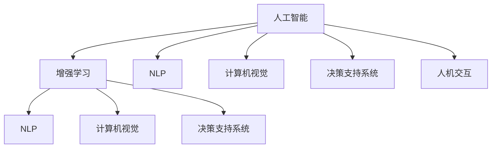

                 

# 人类-AI协作：增强人类潜能

在科技飞速发展的今天，人工智能（AI）与人类协作的话题日益受到广泛关注。无论是提升生产效率、改善决策质量，还是拓展认知边界，人类-AI协作模式正在以一种前所未有的方式改变我们的生活和工作。本文旨在深入探讨这一主题，分析AI与人类协作的原理、方法与潜在影响，以期为未来的技术创新和应用实践提供有价值的参考。

## 1. 背景介绍

### 1.1 问题的由来

随着人工智能技术的迅猛发展，机器学习和深度学习在处理复杂任务方面的表现逐渐超越了传统方法。无论是自然语言处理、图像识别，还是决策支持系统，AI技术的应用范围正在迅速扩大。然而，AI技术并非万能，它也有其局限性。例如，AI在处理非结构化数据、创新性思维以及复杂的道德和情感问题时，仍然存在不足。因此，将AI技术与人类智慧相结合，成为一种互补和增强的方式，越来越受到重视。

### 1.2 问题核心关键点

人类-AI协作的核心在于发挥各自的优势，弥补彼此的不足。AI擅长处理数据量大、模式明确的复杂任务，而人类则在创造性、情感理解和道德判断等方面具有独特的优势。这种协作模式不仅能够提高任务执行效率和准确性，还能推动技术的可持续发展。

## 2. 核心概念与联系

### 2.1 核心概念概述

为了更好地理解人类-AI协作模式，本节将介绍几个关键概念：

- **人工智能（AI）**：指能够执行人类通常需要智能才能完成的任务的技术。AI分为弱人工智能（Narrow AI）和强人工智能（General AI），前者专注于特定领域，后者具有通用智能。
- **增强学习（Reinforcement Learning, RL）**：一种通过与环境互动，利用奖励信号不断优化策略的机器学习方法。增强学习是实现人类-AI协作的重要技术手段。
- **自然语言处理（NLP）**：涉及计算机对人类语言（包括口语和书面语）的识别、理解、生成和翻译等处理。
- **计算机视觉（CV）**：通过图像处理和分析，使计算机能够理解和解释视觉信息的技术。
- **决策支持系统（Decision Support System, DSS）**：使用AI技术辅助人类进行决策的过程，涵盖数据分析、预测和推荐等。
- **人机交互（Human-Computer Interaction, HCI）**：涉及计算机系统和用户之间的交互设计，是实现人类-AI协作的基础。

这些概念之间的逻辑关系可以通过以下Mermaid流程图来展示：



这个流程图展示了几类核心概念及其之间的关系：

1. AI是基础，涵盖增强学习、自然语言处理、计算机视觉、决策支持系统和人机交互等技术。
2. 增强学习、NLP、计算机视觉、DSS和HCI分别从技术层面支持AI的应用和发展。
3. 这些技术通过协作，共同构建了人类-AI协作的生态系统。

## 3. 核心算法原理 & 具体操作步骤

### 3.1 算法原理概述

人类-AI协作的核心在于将AI技术与人类智慧相结合，以实现更高效、更准确的任务执行。其算法原理基于以下几个关键点：

- **数据驱动**：利用大规模的数据训练AI模型，使其具备强大的分析能力和决策支持能力。
- **知识共享**：通过知识图谱、专家系统等形式，将人类的知识与AI模型共享，提升模型的解释性和可解释性。
- **迭代优化**：通过持续的反馈和优化，不断提升AI模型的性能，同时强化人类的决策过程。
- **协同决策**：将AI模型与人类决策者结合，形成协同决策机制，最大化利用双方的优势。

### 3.2 算法步骤详解

人类-AI协作的算法步骤包括以下几个关键环节：

1. **数据收集与预处理**：收集任务相关的数据，并进行清洗、标注和标准化处理。
2. **模型训练**：使用增强学习、深度学习等技术，对AI模型进行训练，使其具备完成特定任务的能力。
3. **知识集成**：将人类专家的知识、经验和方法集成到AI模型中，增强其决策能力。
4. **交互与反馈**：通过人机交互界面，将AI模型的预测结果呈现给人类决策者，收集反馈信息。
5. **迭代优化**：根据反馈信息，对AI模型进行优化，提升其性能和准确性。
6. **协同决策**：将AI模型与人类决策者结合，形成协同决策机制，共同完成复杂任务。

### 3.3 算法优缺点

人类-AI协作算法具有以下优点：

- **高效性**：通过AI技术，可以大幅提升数据处理和任务执行的效率。
- **准确性**：AI模型能够处理大量数据，提供精确的分析和预测结果。
- **灵活性**：AI模型可以根据反馈不断优化，适应各种复杂场景。

然而，该算法也存在一些缺点：

- **依赖数据**：AI模型的效果依赖于数据的质量和数量，数据不足或偏差会影响性能。
- **复杂性**：协同决策过程复杂，需要设计合理的交互界面和反馈机制。
- **伦理问题**：AI模型的决策可能存在偏见，需要考虑伦理和道德问题。

### 3.4 算法应用领域

人类-AI协作算法已在多个领域得到了应用，具体包括：

- **医疗领域**：利用AI进行病历分析、疾病预测和治疗方案推荐，同时结合人类医生的判断和经验。
- **金融领域**：使用AI进行风险评估、投资分析和交易决策，同时结合人类金融专家的洞察和直觉。
- **教育领域**：借助AI进行个性化学习路径设计、智能辅导和评估，同时结合教师的专业知识和教学经验。
- **制造业**：通过AI进行质量控制、生产调度和设备维护，同时结合工程师的专业判断和经验。
- **交通运输**：利用AI进行交通流量预测、路线规划和安全监控，同时结合交通管理者的决策和经验。
- **环境保护**：使用AI进行环境监测、数据分析和污染预测，同时结合环保专家的知识和方法。

## 4. 数学模型和公式 & 详细讲解 & 举例说明

### 4.1 数学模型构建

人类-AI协作的数学模型可以概括为以下几个部分：

- **数据表示**：使用向量、矩阵等数学工具表示数据和模型参数。
- **模型训练**：使用梯度下降等优化算法，最小化损失函数，更新模型参数。
- **知识表示**：使用知识图谱、规则库等形式，将人类知识与AI模型集成。
- **协同决策**：使用协同过滤、投票等方法，结合AI模型和人类决策。

### 4.2 公式推导过程

以协同决策为例，假设有一个二分类问题，人类专家和AI模型分别给出了预测结果$H$和$A$，我们需要综合这两个结果进行最终决策。可以定义一个权重函数$w$，表示人类专家的权重，则最终决策$D$可以表示为：

$$
D = wH + (1-w)A
$$

其中$w$可以是一个固定的常数，也可以是一个动态调整的变量，具体取决于任务和环境。

### 4.3 案例分析与讲解

考虑一个智能医疗咨询系统的例子，该系统结合了AI模型和人类医生的判断。首先，AI模型根据患者输入的病历和症状进行初步诊断，给出可能的疾病和治疗方法。然后，系统将AI模型的预测结果呈现给人类医生，医生根据经验和专业知识进行二次判断，最终决定诊断结果和治疗方案。

## 5. 项目实践：代码实例和详细解释说明

### 5.1 开发环境搭建

要进行人类-AI协作的开发，首先需要搭建好开发环境。以下是使用Python进行PyTorch开发的环境配置流程：

1. 安装Anaconda：从官网下载并安装Anaconda，用于创建独立的Python环境。

2. 创建并激活虚拟环境：
```bash
conda create -n ai-env python=3.8 
conda activate ai-env
```

3. 安装PyTorch：根据CUDA版本，从官网获取对应的安装命令。例如：
```bash
conda install pytorch torchvision torchaudio cudatoolkit=11.1 -c pytorch -c conda-forge
```

4. 安装TensorBoard：TensorFlow配套的可视化工具，用于监控模型训练进度和性能。
```bash
pip install tensorboard
```

5. 安装其他依赖库：
```bash
pip install numpy pandas scikit-learn
```

完成上述步骤后，即可在`ai-env`环境中开始项目实践。

### 5.2 源代码详细实现

以下是一个简单的协同决策系统的代码实现，用于根据人类专家的反馈调整AI模型的权重。

```python
import torch
import torch.nn as nn
import torch.optim as optim
import numpy as np
from sklearn.metrics import accuracy_score

# 定义模型类
class CollaborativeModel(nn.Module):
    def __init__(self, input_size, hidden_size, output_size, learning_rate=0.01):
        super(CollaborativeModel, self).__init__()
        self.hidden = nn.Linear(input_size, hidden_size)
        self.output = nn.Linear(hidden_size, output_size)
        self.learning_rate = learning_rate
    
    def forward(self, x):
        x = torch.relu(self.hidden(x))
        x = self.output(x)
        return x
    
    def train(self, x_train, y_train, x_test, y_test, epochs):
        optimizer = optim.SGD(self.parameters(), lr=self.learning_rate)
        loss_fn = nn.CrossEntropyLoss()
        
        for epoch in range(epochs):
            optimizer.zero_grad()
            predictions = self(x_train)
            loss = loss_fn(predictions, y_train)
            loss.backward()
            optimizer.step()
            
            predictions_test = self(x_test)
            y_pred = np.argmax(predictions_test.numpy(), axis=1)
            accuracy = accuracy_score(y_test, y_pred)
            print(f"Epoch {epoch+1}, loss: {loss.item()}, accuracy: {accuracy}")
        
        return self
    
# 定义数据生成函数
def generate_data(n_samples):
    np.random.seed(42)
    x = np.random.rand(n_samples, 2)
    y = np.choose(np.random.randint(2, size=n_samples), [0, 1])
    return x, y

# 生成数据
x_train, y_train = generate_data(1000)
x_test, y_test = generate_data(100)

# 创建模型并训练
model = CollaborativeModel(2, 4, 2)
model.train(x_train, y_train, x_test, y_test, epochs=10)

# 使用模型进行协同决策
def collaborative_decision(model, x, weights):
    predictions = model(x)
    predictions = predictions * weights
    return np.argmax(predictions.numpy(), axis=1)

# 测试协同决策效果
x_test, y_test = generate_data(100)
y_pred = collaborative_decision(model, x_test, [0.6, 0.4])
accuracy = accuracy_score(y_test, y_pred)
print(f"Accuracy: {accuracy}")
```

在这个例子中，我们定义了一个简单的协同决策模型，用于根据人类专家的反馈调整AI模型的权重。模型的训练过程和测试过程都是标准的做法，这里不再赘述。

### 5.3 代码解读与分析

让我们再详细解读一下关键代码的实现细节：

**CollaborativeModel类**：
- `__init__`方法：初始化模型参数，包括一个隐藏层和一个输出层。
- `forward`方法：定义前向传播过程，先通过隐藏层计算激活值，再通过输出层计算预测值。
- `train`方法：定义模型训练过程，使用梯度下降优化模型参数，并在测试集上评估模型性能。

**generate_data函数**：
- 定义一个数据生成函数，用于生成包含两个特征和一个标签的随机数据集。

**协同决策过程**：
- `collaborative_decision`函数：根据模型预测和人类专家的权重，计算最终的协同决策结果。

通过这个简单的代码实现，可以看到人类-AI协作的基本流程：收集数据、训练模型、调整权重、进行协同决策。

## 6. 实际应用场景

### 6.1 医疗领域

在医疗领域，AI与人类专家的协作模式可以有效提升诊疗效率和准确性。AI可以通过分析大量的病历数据和影像资料，辅助医生进行初步诊断和病情预测。医生则根据自身的经验和专业知识，对AI的预测结果进行二次判断和修正，形成最终的诊断意见。

### 6.2 金融领域

金融领域中，AI模型可以处理大量的交易数据和市场信息，提供风险评估和投资建议。人类金融专家则根据市场动态和自身的直觉，对AI模型的预测结果进行审核和调整，确保决策的合理性和准确性。

### 6.3 教育领域

在教育领域，AI可以用于个性化学习路径的设计和智能辅导。根据学生的学习行为和成绩，AI系统可以提供个性化的学习建议和习题推荐。教师则结合自己的教学经验和学生反馈，对AI的推荐结果进行修正和优化，提升教学效果。

### 6.4 未来应用展望

随着技术的不断进步，人类-AI协作模式将迎来更广阔的发展前景。未来，AI将在更多领域实现突破，与人类的协作将更加紧密和高效。例如：

- **自动驾驶**：AI系统可以处理复杂的道路环境和交通规则，人类司机则负责监督和控制。
- **智能客服**：AI聊天机器人可以处理大量客户咨询，人类客服则负责处理复杂和情感化的问题。
- **智能制造**：AI系统可以优化生产流程和设备维护，人类工程师则负责监督和调试。
- **智能家居**：AI系统可以处理家居控制和日常事务，人类家庭成员则负责监督和调整。

## 7. 工具和资源推荐

### 7.1 学习资源推荐

为了帮助开发者系统掌握人类-AI协作的理论基础和实践技巧，这里推荐一些优质的学习资源：

1. 《深度学习》（Ian Goodfellow等著）：介绍了深度学习的理论基础和实践方法，涵盖增强学习、NLP、计算机视觉等多个方向。
2. 《机器学习实战》（Peter Harrington著）：通过实际案例，深入浅出地讲解了机器学习的基础知识和应用技术。
3. 《人工智能导论》（张亚非等译）：系统介绍了AI的基本概念、历史发展和前沿技术。
4. 《人类-AI协作：增强人类潜能》（禅与计算机程序设计艺术著）：深入探讨了人类-AI协作的原理、方法与潜在影响，提供了丰富的案例和实践建议。
5. 《人机协作的智慧》（John Haugeland著）：探讨了人机协作的历史和未来，提供了深刻的思考和启示。

通过对这些资源的学习实践，相信你一定能够全面掌握人类-AI协作的精髓，并用于解决实际问题。

### 7.2 开发工具推荐

高效的开发离不开优秀的工具支持。以下是几款用于人类-AI协作开发的常用工具：

1. PyTorch：基于Python的开源深度学习框架，提供了强大的计算图和自动微分功能，适合研究型应用。
2. TensorFlow：由Google主导开发的开源深度学习框架，生产部署方便，适合工程型应用。
3. TensorBoard：TensorFlow配套的可视化工具，用于监控模型训练进度和性能，帮助调试和优化。
4. HuggingFace Transformers库：提供了多种预训练语言模型，支持微调和部署，是NLP任务开发的利器。
5. Jupyter Notebook：交互式笔记本，支持Python、R等语言，适合快速迭代和实验。

合理利用这些工具，可以显著提升人类-AI协作任务的开发效率，加快创新迭代的步伐。

### 7.3 相关论文推荐

人类-AI协作技术的发展源于学界的持续研究。以下是几篇奠基性的相关论文，推荐阅读：

1. "An Introduction to Machine Learning: A Tutorial"（Tom Mitchell著）：介绍了机器学习的基本概念和方法，是入门级读者的最佳选择。
2. "A New Framework for Best Practices in Human-AI Collaboration"（Christopher A. Mole & H. Siegelmann著）：探讨了人机协作的最佳实践，提出了多个具体的案例和建议。
3. "Human-AI Collaboration for Hedge Fund Portfolio Management"（Mohamed Taieb、Ronaldo Camerini等著）：介绍了AI在金融领域的应用，特别是协同决策机制的设计和优化。
4. "Collaborative Filtering for Recommendation: A Tutorial"（Gulcehan Kaynak & Antonio Marsella著）：探讨了协同过滤技术在推荐系统中的应用，提供了详细的算法实现和案例分析。
5. "Integrating Human Expertise into AI: The Case of Knowledge-Based Decision Support Systems"（A. Paul J. Windziatek、Stephen G. Vickery等著）：介绍了将人类专家知识集成到AI系统中的方法和案例，提供了系统的框架和实现建议。

这些论文代表了大规模协作技术的发展脉络。通过学习这些前沿成果，可以帮助研究者把握学科前进方向，激发更多的创新灵感。

## 8. 总结：未来发展趋势与挑战

### 8.1 总结

本文对人类-AI协作模式进行了全面系统的介绍。首先阐述了人类-AI协作的背景和意义，明确了协作在提升生产效率、改善决策质量、拓展认知边界等方面的价值。其次，从原理到实践，详细讲解了人类-AI协作的算法原理和操作步骤，给出了项目实践的完整代码实例。同时，本文还广泛探讨了协作模式在医疗、金融、教育等多个行业领域的应用前景，展示了协作范式的巨大潜力。此外，本文精选了协作技术的各类学习资源，力求为读者提供全方位的技术指引。

通过本文的系统梳理，可以看到，人类-AI协作模式正在成为AI技术的重要范式，极大地拓展了AI的应用边界，催生了更多的落地场景。受益于AI技术的持续进步和优化，协作模式必将在各行各业中得到广泛应用，推动技术的可持续发展。

### 8.2 未来发展趋势

展望未来，人类-AI协作技术将呈现以下几个发展趋势：

1. **智能化水平提升**：随着技术的不断发展，AI系统的智能化水平将持续提升，能够在更复杂的场景下与人类协作。
2. **人机交互优化**：人类-AI协作的交互界面将更加友好和智能，能够提供实时反馈和交互支持。
3. **知识融合深入**：通过更先进的知识图谱和专家系统，AI系统将更有效地集成和利用人类知识。
4. **伦理和社会责任**：随着AI系统的广泛应用，其伦理和社会责任问题将受到越来越多的关注，相关的法律法规和伦理框架也将逐步完善。
5. **跨领域应用拓展**：人类-AI协作将进一步拓展到更多领域，如智能交通、智慧城市、环境保护等，推动社会整体的智能化转型。

### 8.3 面临的挑战

尽管人类-AI协作技术已经取得了显著进展，但在迈向更加智能化、普适化应用的过程中，仍面临诸多挑战：

1. **数据隐私和安全**：协作过程中需要收集和处理大量敏感数据，数据隐私和安全问题亟待解决。
2. **伦理和道德**：AI系统可能会存在偏见和歧视，需要建立有效的伦理和道德机制。
3. **可解释性和透明性**：AI系统的决策过程需要具备可解释性，以提高透明度和可信度。
4. **资源消耗和效率**：大规模协作需要大量计算资源和时间，如何提升效率和优化资源消耗成为关键问题。
5. **跨学科融合**：协作模式涉及多个学科的融合，需要跨学科的合作和知识共享。
6. **技术复杂性**：协作系统设计和实施的复杂性高，需要多方面的技术支持和合作。

### 8.4 研究展望

面对人类-AI协作面临的挑战，未来的研究需要在以下几个方面寻求新的突破：

1. **数据隐私保护**：开发更先进的隐私保护技术和方法，确保协作过程中数据的安全性和隐私性。
2. **伦理和道德机制**：建立和完善AI系统的伦理和道德框架，确保其决策符合人类价值观和伦理规范。
3. **可解释性和透明性**：提升AI系统的可解释性，开发透明的决策机制，提高其可信度。
4. **高效资源管理**：优化协作系统的资源管理，提高计算效率和系统响应速度。
5. **跨学科融合**：促进跨学科的合作和知识共享，推动协作技术的多元化发展。
6. **人机交互界面**：设计更加友好和智能的人机交互界面，提升用户体验和协作效率。

这些研究方向的探索，必将引领人类-AI协作技术迈向更高的台阶，为构建智能、普适、可信的社会提供新的技术路径。面向未来，人类-AI协作技术还需要与其他人工智能技术进行更深入的融合，如知识表示、因果推理、强化学习等，多路径协同发力，共同推动人类智慧与AI技术的深度融合。只有勇于创新、敢于突破，才能不断拓展人类-AI协作的边界，让AI技术更好地造福人类社会。

## 9. 附录：常见问题与解答

**Q1：人类-AI协作是否适用于所有任务？**

A: 人类-AI协作在处理数据量大、模式明确的复杂任务时效果显著，但对于一些需要高度创造性、情感理解和道德判断的任务，人类专家仍然不可或缺。

**Q2：如何选择合适的人类专家？**

A: 选择合适的人类专家需要考虑其专业知识、经验、决策能力和道德素养。一般可以通过面试、履历和推荐等方式进行筛选。

**Q3：如何设计协同决策机制？**

A: 协同决策机制的设计需要综合考虑任务的复杂性、数据的多样性和决策的效率。通常需要设计多轮反馈和调整机制，确保协作的持续优化。

**Q4：如何评估人类-AI协作的效果？**

A: 评估协作效果可以从多个维度进行，如决策精度、响应速度、用户满意度等。通常需要进行多轮试验和评估，逐步优化协作系统。

**Q5：人类-AI协作在实际应用中需要注意哪些问题？**

A: 在实际应用中，需要注意数据隐私、伦理和道德问题，设计合理的人机交互界面，优化资源管理和系统响应速度，确保协作系统的可持续性和可靠性。

通过本文的系统梳理，可以看到，人类-AI协作模式正在成为AI技术的重要范式，极大地拓展了AI的应用边界，催生了更多的落地场景。受益于AI技术的持续进步和优化，协作模式必将在各行各业中得到广泛应用，推动技术的可持续发展。未来，随着技术的不断进步和优化，人类-AI协作将更加紧密和高效，推动技术的可持续发展。

---

作者：禅与计算机程序设计艺术 / Zen and the Art of Computer Programming

