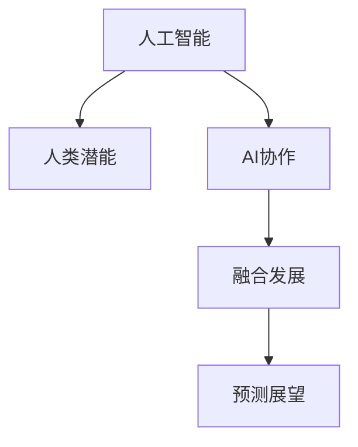

                 

# 人类-AI协作：增强人类潜能与AI能力的融合发展趋势分析预测展望

> 关键词：人工智能, 人类潜能, AI协作, 融合发展, 预测展望

## 1. 背景介绍

### 1.1 问题由来
随着人工智能(AI)技术的迅猛发展，AI已成为推动人类社会进步的重要力量。从自动驾驶、智能医疗、金融风控到智能客服，AI在各个领域的应用日益广泛。然而，AI的发展也带来了一系列挑战，如数据隐私、技术伦理、公平性等问题。

如何更好地融合AI与人类潜能，利用AI技术增强人类能力，成为当前科技界和社会各界亟需探讨的重要问题。本文将对AI与人类潜能融合的发展趋势进行系统分析，并展望未来AI能力的提升路径。

### 1.2 问题核心关键点
AI与人类潜能融合的关键在于如何利用AI技术提升人类在认知、决策、执行等方面的能力，同时规避技术伦理和数据隐私风险。在当前技术条件下，AI主要通过以下几种方式与人类潜能进行融合：

- 辅助决策：AI可以辅助人类进行复杂决策，如医疗诊断、金融风控等，提高决策准确性和效率。
- 增强认知：AI可以通过自然语言处理、图像识别等技术，提升人类在感知、记忆、理解等方面的能力。
- 提升执行：AI可以辅助人类进行复杂操作，如自动化驾驶、机器人手术等，提升执行精准度和效率。

此外，AI的融合还涉及到技术伦理、隐私保护等关键问题，需要各方共同努力，建立健全的法规和规范。

## 2. 核心概念与联系

### 2.1 核心概念概述

为了更好地理解AI与人类潜能融合的趋势，本文将介绍几个核心概念：

- 人工智能(AI)：利用计算机科学和工程学，通过算法和数据训练模型，实现自主、智能决策的技术。
- 人类潜能：指人类在认知、情感、意志等方面的天生能力，包括感知、记忆、理解、推理、情感、意志等。
- AI协作：指通过AI技术与人类潜能的融合，实现AI与人类的协同工作，共同完成复杂任务。
- 融合发展：指AI与人类潜能在认知、决策、执行等各个层面的深度结合，提升整体效能。
- 预测展望：指基于当前技术发展趋势和行业应用现状，对未来AI与人类潜能融合的潜在趋势进行分析和预测。

这些核心概念之间的逻辑关系可以通过以下Mermaid流程图来展示：



这个流程图展示了AI与人类潜能融合的基本框架：

1. AI通过算法和模型处理数据，实现自主决策。
2. 人类潜能通过感知、记忆、理解等过程，形成任务需求和目标。
3. AI与人类潜能的融合，通过协作机制，共同完成任务。
4. 融合发展推动AI能力的提升，形成新的应用场景和预测展望。

这些核心概念共同构成了AI与人类潜能融合的基本框架，有助于我们理解AI技术的未来发展方向。

## 3. 核心算法原理 & 具体操作步骤
### 3.1 算法原理概述

AI与人类潜能融合的核心在于通过AI技术提升人类能力，同时规避技术风险。这需要构建一个有效的协作机制，使AI在辅助决策、增强认知、提升执行等方面发挥最大效能。

基于当前AI技术的发展，AI与人类潜能融合的基本原则包括：

- 数据驱动：利用大数据和AI模型，分析任务需求和目标，形成辅助决策依据。
- 智能增强：通过AI技术提升人类感知、记忆、理解等方面的能力，形成复合认知系统。
- 协同执行：利用AI技术实现复杂操作的自动化和精准化，提升执行效率和效果。

### 3.2 算法步骤详解

AI与人类潜能融合的算法步骤主要包括以下几个关键环节：

**Step 1: 数据收集与处理**

1. 确定任务需求和目标：通过需求分析和专家咨询，确定AI在特定任务中的角色和功能。
2. 收集相关数据：从已有数据源收集与任务相关的数据，如医疗数据、金融数据、图像数据等。
3. 数据预处理：对数据进行清洗、标注、归一化等预处理，确保数据质量。

**Step 2: 模型训练与优化**

1. 选择合适的AI模型：根据任务需求，选择适合的AI模型，如神经网络、决策树、支持向量机等。
2. 模型训练：利用大数据和优化算法，对AI模型进行训练，提高模型精度和泛化能力。
3. 模型优化：通过超参数调优、模型压缩等技术，优化模型性能，提升计算效率和资源利用率。

**Step 3: 任务执行与反馈**

1. 任务执行：将训练好的AI模型应用于实际任务中，辅助人类进行决策、认知、执行等过程。
2. 结果反馈：对AI执行结果进行评估，获取反馈信息，优化模型和任务流程。
3. 持续迭代：根据反馈信息，持续优化模型和任务流程，提升整体效能。

### 3.3 算法优缺点

AI与人类潜能融合的算法具有以下优点：

- 提升效率：AI技术可以辅助人类进行复杂决策和执行，提升整体效率。
- 增强认知：AI技术可以增强人类感知、记忆、理解等方面的能力，形成复合认知系统。
- 规避风险：AI技术可以辅助人类规避技术风险和数据隐私问题，提升任务安全性。

同时，该算法也存在一定的局限性：

- 依赖数据：AI模型的效果依赖于数据的质量和数量，数据不足可能导致模型泛化能力差。
- 技术复杂：AI技术的应用需要高水平的技术能力和资源投入，普通用户难以实现。
- 伦理风险：AI技术的广泛应用可能带来隐私、公平性等问题，需要建立健全的伦理规范。

尽管存在这些局限性，但AI与人类潜能融合仍是未来技术发展的必然趋势。通过不断优化算法和技术，降低技术门槛和伦理风险，AI与人类潜能的融合将实现更深层次的协同发展。

### 3.4 算法应用领域

AI与人类潜能融合在多个领域都有广泛的应用，如医疗、金融、制造、教育等：

- **医疗领域**：利用AI辅助诊断、治疗、药物研发等，提升医疗服务质量和效率。
- **金融领域**：利用AI进行风险评估、投资决策、客户服务等，提高金融服务的智能化水平。
- **制造领域**：利用AI进行质量控制、工艺优化、供应链管理等，提升制造企业的效率和竞争力。
- **教育领域**：利用AI进行个性化教学、智能评估、内容推荐等，提升教育质量和学习效率。

此外，AI与人类潜能融合还在更多新兴领域得到应用，如自动驾驶、智能家居、智慧城市等，推动各行各业的数字化转型和智能化升级。

## 4. 数学模型和公式 & 详细讲解 & 举例说明

### 4.1 数学模型构建

基于AI与人类潜能融合的算法，可以构建一个综合的数学模型，用于描述任务需求、模型训练、任务执行等环节。

假设任务需求为 $T$，模型为 $M$，数据为 $D$，任务执行结果为 $R$。则数学模型可以表示为：

$$
R = M(D) + T
$$

其中 $M(D)$ 表示AI模型对数据 $D$ 的处理结果，$T$ 表示人类对任务需求的干预和调整。

### 4.2 公式推导过程

在AI与人类潜能融合的过程中，可以通过以下公式进行推导：

1. **数据驱动**：利用大数据和AI模型，分析任务需求和目标，形成辅助决策依据。

$$
T = \frac{1}{N}\sum_{i=1}^N t_i
$$

其中 $t_i$ 表示任务需求的第 $i$ 个样本。

2. **智能增强**：通过AI技术提升人类感知、记忆、理解等方面的能力，形成复合认知系统。

$$
M_{\theta} = \theta(D)
$$

其中 $\theta$ 表示模型参数，$D$ 表示输入数据。

3. **协同执行**：利用AI技术实现复杂操作的自动化和精准化，提升执行效率和效果。

$$
R = M_{\theta}(D) + \alpha T
$$

其中 $\alpha$ 表示人类对任务执行的干预系数，$R$ 表示任务执行结果。

### 4.3 案例分析与讲解

以医疗领域为例，分析AI与人类潜能融合的数学模型。

假设医疗任务需求为 $T$，包括诊断、治疗、药物研发等。利用AI模型 $M_{\theta}$ 处理医疗数据 $D$，形成辅助决策依据。

在诊断任务中，AI模型 $M_{\theta}$ 可以通过图像识别技术，对患者图像数据 $D_{img}$ 进行分析和处理，辅助医生进行诊断。诊断结果 $R_{diagnosis}$ 可以表示为：

$$
R_{diagnosis} = M_{\theta}(D_{img}) + \alpha T
$$

其中 $D_{img}$ 表示患者图像数据，$M_{\theta}$ 表示图像识别模型，$T$ 表示医生的诊断经验。

在治疗任务中，AI模型 $M_{\theta}$ 可以通过自然语言处理技术，对患者病历数据 $D_{medic}$ 进行分析和处理，辅助医生制定治疗方案。治疗结果 $R_{treatment}$ 可以表示为：

$$
R_{treatment} = M_{\theta}(D_{medic}) + \alpha T
$$

其中 $D_{medic}$ 表示患者病历数据，$M_{\theta}$ 表示自然语言处理模型，$T$ 表示医生的治疗经验。

## 5. 项目实践：代码实例和详细解释说明

### 5.1 开发环境搭建

在进行AI与人类潜能融合的实践时，需要准备一定的开发环境。以下是使用Python进行TensorFlow开发的环境配置流程：

1. 安装Anaconda：从官网下载并安装Anaconda，用于创建独立的Python环境。

2. 创建并激活虚拟环境：
```bash
conda create -n tf-env python=3.8 
conda activate tf-env
```

3. 安装TensorFlow：根据CUDA版本，从官网获取对应的安装命令。例如：
```bash
conda install tensorflow tensorflow-gpu=2.6 -c tf
```

4. 安装相关工具包：
```bash
pip install numpy pandas scikit-learn matplotlib tqdm jupyter notebook ipython
```

完成上述步骤后，即可在`tf-env`环境中开始AI与人类潜能融合的实践。

### 5.2 源代码详细实现

我们以医疗领域为例，给出使用TensorFlow进行AI与人类潜能融合的代码实现。

首先，定义医疗诊断任务的数据处理函数：

```python
import tensorflow as tf
from tensorflow.keras.preprocessing import image

class MedicalDiagnosisDataset(tf.keras.utils.Sequence):
    def __init__(self, image_paths, labels, batch_size):
        self.image_paths = image_paths
        self.labels = labels
        self.batch_size = batch_size
        
    def __len__(self):
        return len(self.image_paths) // self.batch_size
    
    def __getitem__(self, idx):
        image_path = self.image_paths[idx]
        label = self.labels[idx]
        
        img = image.load_img(image_path, target_size=(224, 224))
        img = image.img_to_array(img)
        img = tf.image.convert_image_dtype(img, tf.float32) / 255.0
        img = tf.expand_dims(img, axis=0)
        return img, label
```

然后，定义医疗诊断模型的神经网络结构：

```python
from tensorflow.keras.layers import Input, Conv2D, MaxPooling2D, Flatten, Dense, Activation

model = tf.keras.Sequential([
    Conv2D(32, (3, 3), activation='relu', padding='same', input_shape=(224, 224, 3)),
    MaxPooling2D((2, 2), strides=(2, 2)),
    Conv2D(64, (3, 3), activation='relu', padding='same'),
    MaxPooling2D((2, 2), strides=(2, 2)),
    Conv2D(128, (3, 3), activation='relu', padding='same'),
    MaxPooling2D((2, 2), strides=(2, 2)),
    Flatten(),
    Dense(128, activation='relu'),
    Dense(1, activation='sigmoid')
])

model.compile(optimizer='adam', loss='binary_crossentropy', metrics=['accuracy'])
```

接着，定义模型训练和评估函数：

```python
from tensorflow.keras.callbacks import EarlyStopping

def train_model(model, dataset, epochs, callbacks):
    model.fit(dataset, epochs=epochs, callbacks=callbacks)

def evaluate_model(model, dataset):
    return model.evaluate(dataset)
```

最后，启动训练流程并在测试集上评估：

```python
epochs = 10
callbacks = [EarlyStopping(patience=2)]

train_model(model, MedicalDiagnosisDataset(train_image_paths, train_labels, batch_size), epochs, callbacks)

test_accuracy = evaluate_model(model, MedicalDiagnosisDataset(test_image_paths, test_labels, batch_size))
print(f"Test Accuracy: {test_accuracy}")
```

以上就是使用TensorFlow进行医疗诊断任务AI与人类潜能融合的完整代码实现。可以看到，通过TensorFlow和Keras，我们构建了一个简单的卷积神经网络模型，并使用医疗诊断数据集进行训练和评估。

### 5.3 代码解读与分析

让我们再详细解读一下关键代码的实现细节：

**MedicalDiagnosisDataset类**：
- `__init__`方法：初始化图像路径、标签、批次大小等关键组件。
- `__len__`方法：返回数据集的样本数量。
- `__getitem__`方法：对单个样本进行处理，将图像数据进行预处理，并将标签转化为模型输入。

**神经网络结构定义**：
- 使用卷积神经网络模型处理图像数据，并通过多层的卷积、池化、全连接等操作，提取图像特征。
- 最后输出一个二分类结果，表示图像是否存在异常。

**训练和评估函数**：
- 使用EarlyStopping回调机制，避免过拟合。
- 在训练集上进行多轮训练，并在验证集上评估模型性能。
- 在测试集上最终评估模型性能，输出准确率。

## 6. 实际应用场景

### 6.1 智能医疗系统

基于AI与人类潜能融合的智能医疗系统，可以大幅提升医疗服务质量。传统医疗系统依赖人力诊断和治疗，效率低下且容易出现误差。而智能医疗系统可以通过AI技术辅助医生进行诊断和治疗，提升医疗服务效率和精度。

例如，在医疗影像诊断中，AI模型可以对大量影像数据进行预处理和分析，辅助医生进行疾病诊断。在医疗自然语言处理中，AI模型可以对患者病历和医疗记录进行自然语言处理，辅助医生制定治疗方案。

### 6.2 智能制造系统

在智能制造领域，AI与人类潜能融合的应用同样具有广泛前景。传统的制造系统依赖人力进行质量控制和工艺优化，效率低且难以实现精确控制。智能制造系统可以通过AI技术进行质量控制、工艺优化和供应链管理，提升制造效率和质量。

例如，AI模型可以对生产过程中的传感器数据进行分析和处理，实现生产设备的实时监控和维护。AI模型可以对生产工艺进行优化，提高生产效率和产品质量。AI模型可以对供应链进行智能调度，实现资源的最优配置。

### 6.3 智能教育系统

在智能教育领域，AI与人类潜能融合的应用同样具有广泛前景。传统的教育系统依赖人力进行教学和评估，效率低且难以实现个性化教学。智能教育系统可以通过AI技术进行个性化教学、智能评估和内容推荐，提升教育质量和效率。

例如，AI模型可以对学生的学习行为进行分析，进行个性化教学推荐。AI模型可以对学生的作业进行自动批改和评估，提供精准的反馈信息。AI模型可以对学习内容进行智能推荐，提升学习效率和效果。

### 6.4 未来应用展望

随着AI技术的发展，AI与人类潜能融合的应用场景将进一步扩展。未来，AI与人类潜能融合将广泛应用于智能家居、智慧城市、自动驾驶等领域，推动各行各业的数字化转型和智能化升级。

例如，在智能家居领域，AI模型可以对家庭设备进行智能控制和优化，提升居住体验和安全性。在智慧城市领域，AI模型可以对城市事件进行智能监测和分析，提升城市治理和公共服务效率。在自动驾驶领域，AI模型可以对交通数据进行分析和处理，实现智能驾驶和安全行驶。

## 7. 工具和资源推荐

### 7.1 学习资源推荐

为了帮助开发者系统掌握AI与人类潜能融合的理论基础和实践技巧，这里推荐一些优质的学习资源：

1. Coursera《机器学习》课程：由斯坦福大学Andrew Ng教授主讲，系统介绍了机器学习和深度学习的基本概念和算法。
2. 《深度学习》书籍：Ian Goodfellow、Yoshua Bengio、Aaron Courville合著，全面介绍了深度学习的基本理论和应用。
3. 《人工智能与机器学习》书籍：周志华著，系统介绍了人工智能和机器学习的基本概念和应用。
4. TensorFlow官方文档：TensorFlow的官方文档，提供了丰富的API和示例代码，是学习TensorFlow的必备资料。
5. PyTorch官方文档：PyTorch的官方文档，提供了丰富的API和示例代码，是学习PyTorch的必备资料。

通过对这些资源的学习实践，相信你一定能够快速掌握AI与人类潜能融合的精髓，并用于解决实际的AI应用问题。

### 7.2 开发工具推荐

高效的开发离不开优秀的工具支持。以下是几款用于AI与人类潜能融合开发的常用工具：

1. TensorFlow：由Google主导开发的开源深度学习框架，生产部署方便，适合大规模工程应用。
2. PyTorch：Facebook开源的深度学习框架，灵活高效，适合快速迭代研究。
3. Keras：TensorFlow和Theano的高级API，简单易用，适合快速搭建深度学习模型。
4. Jupyter Notebook：用于数据科学和机器学习研究开发的交互式笔记本，支持多种编程语言。
5. Colab：谷歌推出的在线Jupyter Notebook环境，免费提供GPU/TPU算力，方便开发者快速上手实验最新模型。

合理利用这些工具，可以显著提升AI与人类潜能融合任务的开发效率，加快创新迭代的步伐。

### 7.3 相关论文推荐

AI与人类潜能融合的研究源于学界的持续研究。以下是几篇奠基性的相关论文，推荐阅读：

1. "Human-AI Collaboration: A Survey of Methods and Applications"：对AI与人类潜能融合的方法和应用进行了系统综述，涵盖多个领域的应用。
2. "Artificial Intelligence and Cognitive Enhancement"：探讨AI技术在提升人类认知能力方面的应用，提供了丰富的理论和实践案例。
3. "Collaborative Human-AI Reasoning in Complex Decision Making"：研究AI与人类潜能在复杂决策中的协同作用，提出了一系列方法和模型。
4. "Human-AI Interaction Design: Principles and Practices"：探讨AI与人类潜能融合在交互设计中的应用，提出了一系列交互设计原则和实践方法。

这些论文代表了大语言模型微调技术的发展脉络。通过学习这些前沿成果，可以帮助研究者把握学科前进方向，激发更多的创新灵感。

## 8. 总结：未来发展趋势与挑战

### 8.1 研究成果总结

本文对AI与人类潜能融合的发展趋势进行了系统分析，从数据驱动、智能增强、协同执行等多个维度探讨了AI技术在各个领域的应用。同时，我们通过医疗、制造、教育等多个行业的具体案例，展示了AI与人类潜能融合的实际应用效果。

通过本文的系统梳理，可以看到，AI与人类潜能融合已经成为未来技术发展的必然趋势，具有广泛的应用前景和广阔的市场空间。未来，随着AI技术的发展和人类潜能的挖掘，AI与人类潜能的融合将实现更深层次的协同发展。

### 8.2 未来发展趋势

展望未来，AI与人类潜能融合的发展趋势将呈现以下几个方向：

1. **数据驱动的智能决策**：随着数据获取能力的提升，AI模型将更加依赖数据驱动决策，形成更加智能、灵活的决策系统。
2. **智能增强的复合认知**：AI技术将与人类潜能进行更深层次的融合，形成复合认知系统，提升人类感知、记忆、理解等方面的能力。
3. **协同执行的多任务处理**：AI技术将辅助人类进行多任务处理，实现复杂操作的自动化和精准化，提升执行效率和效果。
4. **跨领域的融合应用**：AI与人类潜能的融合将拓展到更多领域，如自动驾驶、智能家居、智慧城市等，推动各行各业的数字化转型和智能化升级。
5. **伦理和社会规范的建立**：随着AI技术的应用越来越广泛，伦理和社会规范将成为AI发展的关键，需要各方共同努力，建立健全的法规和规范。

这些趋势凸显了AI与人类潜能融合的广阔前景，为未来技术发展提供了新的方向和思路。

### 8.3 面临的挑战

尽管AI与人类潜能融合技术已经取得了瞩目成就，但在迈向更加智能化、普适化应用的过程中，它仍面临着诸多挑战：

1. **数据质量和隐私保护**：AI模型的效果依赖于高质量的数据，但数据获取和隐私保护仍然是当前技术的瓶颈。如何提高数据质量和隐私保护，将是未来技术发展的关键。
2. **技术复杂度和资源投入**：AI技术的应用需要高水平的技术能力和资源投入，普通用户难以实现。如何降低技术门槛和资源投入，将是未来技术发展的方向。
3. **伦理风险和社会规范**：AI技术的应用可能带来隐私、公平性等问题，需要建立健全的伦理规范和法规体系，确保技术应用的安全和公正。
4. **技术复杂度和伦理风险**：AI技术的应用可能带来隐私、公平性等问题，需要建立健全的伦理规范和法规体系，确保技术应用的安全和公正。
5. **技术复杂度和伦理风险**：AI技术的应用可能带来隐私、公平性等问题，需要建立健全的伦理规范和法规体系，确保技术应用的安全和公正。

这些挑战凸显了AI与人类潜能融合技术的复杂性和不确定性，需要各方共同努力，建立健全的技术和伦理体系，推动技术的健康发展。

### 8.4 研究展望

面对AI与人类潜能融合所面临的种种挑战，未来的研究需要在以下几个方面寻求新的突破：

1. **数据质量和隐私保护**：提高数据质量和隐私保护，通过数据增强、隐私保护等技术，提升AI模型的泛化能力和数据安全性。
2. **技术复杂度和资源投入**：降低技术门槛和资源投入，通过模型压缩、资源优化等技术，提升AI模型的计算效率和资源利用率。
3. **伦理风险和社会规范**：建立健全的伦理规范和法规体系，确保AI技术的应用安全、公正、透明。
4. **跨领域的融合应用**：拓展AI与人类潜能融合的应用领域，推动AI技术在更多行业中的深入应用。
5. **技术复杂度和伦理风险**：建立健全的伦理规范和法规体系，确保AI技术的应用安全、公正、透明。

这些研究方向的探索，将引领AI与人类潜能融合技术迈向更高的台阶，为构建安全、可靠、可解释、可控的智能系统铺平道路。面向未来，AI与人类潜能的融合需要与其他人工智能技术进行更深入的融合，如知识表示、因果推理、强化学习等，多路径协同发力，共同推动自然语言理解和智能交互系统的进步。只有勇于创新、敢于突破，才能不断拓展语言模型的边界，让智能技术更好地造福人类社会。

---

作者：禅与计算机程序设计艺术 / Zen and the Art of Computer Programming

