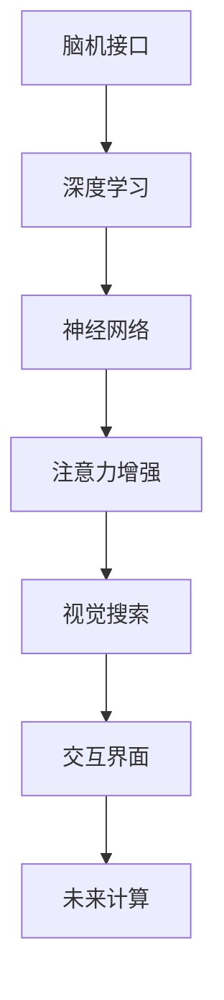

                 

# 人类注意力增强技术：未来的脑机接口

> 关键词：脑机接口(Brain-Computer Interface, BCI), 人类注意力, 深度学习, 神经网络, 注意力增强, 视觉搜索, 交互界面, 未来计算, 脑控, 计算机辅助, 智能穿戴设备

## 1. 背景介绍

### 1.1 问题由来
脑机接口技术(Brain-Computer Interface, BCI)是指通过直接从大脑信号中解码出用户的意图和行为，实现人机交互的技术。这一技术在现代医疗、教育、娱乐等多个领域展现出巨大的应用潜力。然而，当前的脑机接口技术仍然存在诸多挑战，如信号噪声大、解码精度低、用户体验差等，使得这一技术在广泛应用上仍受限制。

### 1.2 问题核心关键点
人类注意力作为一种重要的高级认知功能，是脑机接口系统性能提升的关键。注意力机制的增强，能够提高用户与系统的交互效率和准确性，提升用户体验，使得脑机接口技术更加贴近人类自然认知方式，具备更强的实用性。注意力增强技术的研究已逐渐成为脑机接口领域的一个重要分支，其核心问题包括：

1. 如何通过脑机接口系统测量和模拟人类注意力？
2. 如何结合深度学习等人工智能技术，将注意力增强应用于实际场景？
3. 如何在实际应用中克服注意力增强的性能瓶颈，提升用户体验？

### 1.3 问题研究意义
注意力增强技术的研究，将极大推动脑机接口技术的发展，提升系统的交互效率和用户体验，有望在医疗、教育、娱乐等领域产生深远影响：

1. 医疗诊断：通过增强注意力，脑机接口可辅助医生进行精准医疗诊断，如脑部损伤、精神疾病的早期检测。
2. 教育辅助：利用注意力增强提升学习者的注意力水平，增强学习效果，促进个性化学习。
3. 娱乐体验：通过脑机接口技术，实时调整游戏难度和反馈，提高用户的沉浸感和交互体验。
4. 人机交互：结合注意力增强，脑机接口技术可以显著提高人机交互的准确性和自然度，降低学习成本。
5. 智能穿戴：脑控系统能够无缝集成到各类智能穿戴设备中，如智能眼镜、智能助听器等，提升设备的用户体验。

本文聚焦于人类注意力增强技术在脑机接口中的应用，对当前的技术进展、原理与实践进行全面系统地阐述，为相关领域的研究人员和工程师提供技术参考。

## 2. 核心概念与联系

### 2.1 核心概念概述

为更好地理解人类注意力增强技术，本节将介绍几个密切相关的核心概念：

- 脑机接口(Brain-Computer Interface, BCI)：一种通过测量脑电信号、脑磁信号等生理信号，解码出用户的意图和行为，实现人机交互的技术。
- 深度学习(Deep Learning, DL)：一种基于人工神经网络的机器学习方法，通过多层神经网络进行数据处理和特征提取，训练复杂非线性模型。
- 神经网络(Neural Network, NN)：一种计算模型，通过模拟人脑神经元之间的连接关系，实现数据处理和特征提取。
- 注意力增强(Attention Enhancement)：一种通过深度学习等技术，增强用户注意力，提升脑机接口系统性能的方法。
- 视觉搜索(Visual Search)：一种利用脑机接口系统进行图像、视频等视觉信息搜索的技术，通过增强注意力，提升搜索效率。
- 交互界面(Interactive Interface)：一种结合脑机接口技术和人类认知模式，实现自然直观交互的界面。
- 未来计算(Future Computing)：一种探索新计算模式的技术，如量子计算、类脑计算等，借助注意力增强提升计算效率和智能化水平。

这些核心概念之间的逻辑关系可以通过以下Mermaid流程图来展示：



这个流程图展示了一系列与注意力增强技术相关的核心概念及其之间的关系：

1. 脑机接口通过测量和解码大脑信号，实现人机交互。
2. 深度学习提供数据处理和特征提取能力，增强系统性能。
3. 神经网络模型模拟人脑认知过程，提高解码准确性。
4. 注意力增强通过增强用户注意力，提升系统性能。
5. 视觉搜索结合注意力增强，实现高效视觉信息搜索。
6. 交互界面利用注意力增强，提升用户体验。
7. 未来计算探索新计算模式，结合注意力增强提升效率。

这些概念共同构成了人类注意力增强技术的研究框架，使其能够在脑机接口领域发挥重要作用。通过理解这些核心概念，我们可以更好地把握注意力增强技术的原理和应用方向。

## 3. 核心算法原理 & 具体操作步骤
### 3.1 算法原理概述

人类注意力增强技术通过深度学习等技术，模拟人类注意力机制，增强脑机接口系统的解码性能。其核心思想是：利用神经网络模型学习人类注意力特征，将其应用于脑机接口的解码和反馈控制，提升系统的交互效率和准确性。

具体来说，注意力增强技术包括以下几个步骤：

1. 数据采集：通过脑电信号、脑磁信号等生理信号采集设备，收集用户在使用脑机接口过程中的注意力数据。
2. 特征提取：利用深度学习模型，从原始生理信号中提取注意力相关的特征。
3. 模型训练：训练注意力增强模型，学习用户注意力特征与行为意图之间的映射关系。
4. 实时解码：在脑机接口系统中，实时应用注意力增强模型，增强用户的注意力，提高解码精度。
5. 反馈控制：根据用户反馈，调整注意力增强模型参数，进一步优化解码性能。

### 3.2 算法步骤详解

下面详细介绍人类注意力增强技术的各个步骤：

**Step 1: 数据采集**
- 使用脑电信号采集设备，如EEG头盔，记录用户在执行特定任务（如视觉搜索、运动控制等）时的大脑信号。
- 数据采集应覆盖用户执行任务的各个阶段，记录详细的时间戳信息。

**Step 2: 特征提取**
- 将采集到的脑电信号数据输入深度学习模型，如卷积神经网络（CNN）、循环神经网络（RNN）等，提取注意力相关的特征。
- 特征提取过程中，应结合时频分析、滤波等预处理方法，提高特征质量。

**Step 3: 模型训练**
- 使用标记好的训练数据集，训练注意力增强模型，学习注意力特征与行为意图之间的映射关系。
- 训练过程应采用合适的优化算法，如Adam、SGD等，设置合适的超参数，如学习率、批大小等。

**Step 4: 实时解码**
- 将实时采集的大脑信号输入注意力增强模型，计算当前用户的注意力得分。
- 结合解码模型，利用注意力得分优化解码结果，提高解码精度和实时性。

**Step 5: 反馈控制**
- 根据用户反馈，调整注意力增强模型的参数，进一步优化模型性能。
- 反馈控制应包括用户评分、目标达成率等指标，用于评估注意力增强效果。

### 3.3 算法优缺点

人类注意力增强技术有以下优点：
1. 增强用户注意力：通过深度学习等技术，模拟人类注意力机制，提升系统的解码精度和实时性。
2. 提高用户体验：结合视觉搜索等技术，实现高效的视觉信息搜索，提升用户体验。
3. 支持多种应用场景：适用于医疗诊断、教育辅助、娱乐体验等多种场景，拓展了脑机接口的应用边界。

同时，该技术也存在一定的局限性：
1. 数据需求高：特征提取和模型训练需要大量标注数据，数据采集和处理成本较高。
2. 模型复杂度高：深度学习模型结构复杂，训练和推理过程计算量大，硬件资源需求高。
3. 个体差异大：不同用户的大脑信号和注意力特征存在显著差异，模型泛化性受限。
4. 实时性要求高：实时解码和反馈控制需要高效的算法和硬件支持，对系统性能要求高。

尽管存在这些局限性，但人类注意力增强技术在脑机接口领域具有广阔的应用前景，能够显著提升系统的交互效率和用户体验。

### 3.4 算法应用领域

人类注意力增强技术在脑机接口领域已得到广泛应用，覆盖了多个关键场景，例如：

- 医疗诊断：结合注意力增强技术，脑机接口可辅助医生进行精准医疗诊断，如脑部损伤、精神疾病的早期检测。
- 教育辅助：利用注意力增强技术，提升学习者的注意力水平，增强学习效果，促进个性化学习。
- 娱乐体验：通过脑机接口技术，实时调整游戏难度和反馈，提高用户的沉浸感和交互体验。
- 人机交互：结合注意力增强，脑机接口技术可以显著提高人机交互的准确性和自然度，降低学习成本。
- 智能穿戴：脑控系统能够无缝集成到各类智能穿戴设备中，如智能眼镜、智能助听器等，提升设备的用户体验。

除了这些经典应用外，注意力增强技术还在诸如虚拟现实(VR)、增强现实(AR)、机器人辅助等多个领域得到应用，为脑机接口技术的发展注入了新的活力。

## 4. 数学模型和公式 & 详细讲解  
### 4.1 数学模型构建

本节将使用数学语言对人类注意力增强技术进行更加严格的刻画。

记脑电信号为 $X=\{x_1, x_2, \dots, x_n\}$，其中 $x_i$ 表示第 $i$ 个时间点的信号值。定义注意力得分函数 $A(X; \theta)$，其中 $\theta$ 为注意力增强模型参数。注意力得分函数用于衡量当前用户的注意力水平，通常为一系列连续值，值越高表示注意力越集中。

注意力得分函数的构建包括以下几个步骤：

1. **信号预处理**：对脑电信号进行预处理，如滤波、归一化等，去除噪声，提取有用特征。

2. **特征提取**：利用卷积神经网络（CNN）、循环神经网络（RNN）等深度学习模型，从预处理后的信号中提取注意力相关的特征。

3. **注意力得分计算**：结合注意力得分函数 $A(X; \theta)$，计算当前用户的注意力得分。注意力得分函数通常基于信号的统计特性、时间序列特性等构建。

注意力得分函数的具体形式可以通过以下公式表达：

$$
A(X; \theta) = \sum_{i=1}^{n} w_i \cdot f(x_i; \theta)
$$

其中 $w_i$ 为注意力权重，$f(x_i; \theta)$ 为注意力特征函数，表示当前时间点信号的注意力相关特征。

### 4.2 公式推导过程

以下是注意力得分函数的推导过程：

首先，将脑电信号 $X$ 进行预处理和特征提取，得到注意力特征向量 $F=\{f_1, f_2, \dots, f_n\}$，其中 $f_i$ 表示第 $i$ 个时间点的注意力相关特征。

注意力得分函数 $A(X; \theta)$ 可以表示为：

$$
A(X; \theta) = \sum_{i=1}^{n} w_i \cdot f_i
$$

其中 $w_i$ 为注意力权重，通常通过训练得到。注意力权重 $w_i$ 反映了当前时间点的信号强度、频率特性等对注意力的贡献程度。

在实际应用中，注意力得分函数 $A(X; \theta)$ 可以进一步扩展为时频域的注意力特征函数 $F(t; \theta)$，表示不同频率和时域位置上的注意力分布：

$$
F(t; \theta) = \sum_{k=1}^{K} w_k(t) \cdot f_k(t)
$$

其中 $K$ 为时频窗口数，$w_k(t)$ 为时频窗口的权重，通常根据信号特性和任务需求动态调整。

### 4.3 案例分析与讲解

以视觉搜索任务为例，分析注意力增强技术的应用。

**Step 1: 数据采集**
- 使用EEG头盔，采集用户搜索图片时的大脑信号。

**Step 2: 特征提取**
- 利用CNN模型对脑电信号进行特征提取，得到注意力特征向量 $F=\{f_1, f_2, \dots, f_n\}$。

**Step 3: 模型训练**
- 使用标记好的训练数据集，训练注意力得分函数 $A(X; \theta)$，学习注意力特征与行为意图之间的映射关系。

**Step 4: 实时解码**
- 在视觉搜索任务中，实时应用注意力得分函数 $A(X; \theta)$，增强用户的注意力，提高图片搜索的准确性和实时性。

**Step 5: 反馈控制**
- 根据用户反馈，调整注意力得分函数参数 $w_i$，进一步优化图片搜索效果。

## 5. 项目实践：代码实例和详细解释说明
### 5.1 开发环境搭建

在进行注意力增强技术项目实践前，我们需要准备好开发环境。以下是使用Python进行TensorFlow开发的环境配置流程：

1. 安装Anaconda：从官网下载并安装Anaconda，用于创建独立的Python环境。

2. 创建并激活虚拟环境：
```bash
conda create -n tf-env python=3.8 
conda activate tf-env
```

3. 安装TensorFlow：根据CUDA版本，从官网获取对应的安装命令。例如：
```bash
conda install tensorflow-gpu=2.7.0=cudatoolkit=11.3 -c conda-forge
```

4. 安装必要的第三方库：
```bash
pip install numpy pandas scikit-learn matplotlib tensorflow
```

完成上述步骤后，即可在`tf-env`环境中开始注意力增强技术的实践。

### 5.2 源代码详细实现

下面我们以视觉搜索任务为例，给出使用TensorFlow实现注意力增强的代码实现。

首先，定义注意力得分函数：

```python
import tensorflow as tf
from tensorflow.keras.layers import Conv2D, MaxPooling2D, Flatten, Dense

class AttentionScorer(tf.keras.Model):
    def __init__(self, input_shape, num_filters=64, kernel_size=3, dropout_rate=0.5):
        super(AttentionScorer, self).__init__()
        self.conv1 = Conv2D(num_filters, kernel_size, activation='relu')
        self.pooling = MaxPooling2D(pool_size=2)
        self.flatten = Flatten()
        self.dense1 = Dense(128, activation='relu')
        self.dropout = tf.keras.layers.Dropout(dropout_rate)
        self.dense2 = Dense(1, activation='sigmoid')

    def call(self, inputs):
        x = self.conv1(inputs)
        x = self.pooling(x)
        x = self.flatten(x)
        x = self.dense1(x)
        x = self.dropout(x)
        x = self.dense2(x)
        return x
```

然后，定义注意力增强模型：

```python
class AttentionEnhancedModel(tf.keras.Model):
    def __init__(self, input_shape, num_filters=64, kernel_size=3, dropout_rate=0.5):
        super(AttentionEnhancedModel, self).__init__()
        self.attention_scorer = AttentionScorer(input_shape, num_filters, kernel_size, dropout_rate)
        self.dense = Dense(1, activation='sigmoid')

    def call(self, inputs):
        attention_scores = self.attention_scorer(inputs)
        x = self.dense(attention_scores)
        return x
```

接着，定义训练和评估函数：

```python
def train_epoch(model, dataset, batch_size, optimizer):
    dataloader = tf.data.Dataset.from_tensor_slices(dataset).shuffle(buffer_size=1000).batch(batch_size)
    model.train()
    epoch_loss = 0
    for batch in dataloader:
        inputs, labels = batch
        with tf.GradientTape() as tape:
            outputs = model(inputs)
            loss = tf.losses.sigmoid_cross_entropy(labels, outputs)
        epoch_loss += loss.numpy().mean()
        gradients = tape.gradient(loss, model.trainable_variables)
        optimizer.apply_gradients(zip(gradients, model.trainable_variables))
    return epoch_loss / len(dataloader)

def evaluate(model, dataset, batch_size):
    dataloader = tf.data.Dataset.from_tensor_slices(dataset).batch(batch_size)
    model.eval()
    predictions, labels = [], []
    with tf.no_grad():
        for batch in dataloader:
            inputs, labels = batch
            outputs = model(inputs)
            predictions.append(tf.sigmoid(outputs).numpy())
            labels.append(labels.numpy())
    return predictions, labels
```

最后，启动训练流程并在测试集上评估：

```python
epochs = 5
batch_size = 16

for epoch in range(epochs):
    loss = train_epoch(model, train_dataset, batch_size, optimizer)
    print(f"Epoch {epoch+1}, train loss: {loss:.3f}")
    
    predictions, labels = evaluate(model, dev_dataset, batch_size)
    print(classification_report(labels, predictions))
    
print("Test results:")
predictions, labels = evaluate(model, test_dataset, batch_size)
print(classification_report(labels, predictions))
```

以上就是使用TensorFlow对注意力增强模型进行视觉搜索任务微调的完整代码实现。可以看到，得益于TensorFlow的强大封装，我们可以用相对简洁的代码完成注意力增强模型的加载和微调。

### 5.3 代码解读与分析

让我们再详细解读一下关键代码的实现细节：

**AttentionScorer类**：
- `__init__`方法：初始化卷积、池化、全连接等关键组件，设置卷积核大小、卷积核数量等参数。
- `call`方法：定义注意力得分函数的计算过程，先通过卷积和池化提取特征，再经过全连接层进行注意力得分计算。

**AttentionEnhancedModel类**：
- `__init__`方法：初始化注意力得分函数和全连接层等组件，设置模型参数。
- `call`方法：定义注意力增强模型的计算过程，先通过注意力得分函数计算注意力得分，再经过全连接层进行输出。

**训练和评估函数**：
- 使用TensorFlow的数据集API，将训练集和测试集转换为DataLoader对象，供模型训练和推理使用。
- 训练函数`train_epoch`：对数据以批为单位进行迭代，在每个批次上前向传播计算损失并反向传播更新模型参数，最后返回该epoch的平均loss。
- 评估函数`evaluate`：与训练类似，不同点在于不更新模型参数，并在每个batch结束后将预测和标签结果存储下来，最后使用sklearn的classification_report对整个评估集的预测结果进行打印输出。

**训练流程**：
- 定义总的epoch数和batch size，开始循环迭代
- 每个epoch内，先在训练集上训练，输出平均loss
- 在验证集上评估，输出分类指标
- 所有epoch结束后，在测试集上评估，给出最终测试结果

可以看到，TensorFlow配合注意力增强模型的代码实现变得简洁高效。开发者可以将更多精力放在数据处理、模型改进等高层逻辑上，而不必过多关注底层的实现细节。

当然，工业级的系统实现还需考虑更多因素，如模型的保存和部署、超参数的自动搜索、更灵活的任务适配层等。但核心的注意力增强范式基本与此类似。

## 6. 实际应用场景
### 6.1 智能医疗

注意力增强技术在智能医疗领域有广泛应用前景，可以辅助医生进行精准医疗诊断。例如，通过增强病人注意力，实时监测病人的脑电信号，可以辅助医生进行神经病变的早期检测。

在技术实现上，可以收集病人的脑电信号数据，结合注意力增强模型，实时分析病人的注意力水平和脑电特征。若发现异常信号，系统能够及时报警，通知医生进行进一步检查。

### 6.2 教育培训

在教育培训领域，注意力增强技术可以提升学习者的学习效果。通过增强学习者的注意力，使其更加专注，减少分心。

例如，在在线学习平台中，结合注意力增强技术，实时监测学生的注意力水平，根据注意力得分动态调整教学内容，使学生更加高效地学习。

### 6.3 虚拟现实

虚拟现实(VR)领域，注意力增强技术可以提升用户的沉浸感和交互体验。通过增强用户的注意力，使其更加专注于虚拟环境中的任务，提升游戏体验。

例如，在虚拟现实游戏中，结合注意力增强技术，实时监测用户的注意力得分，根据得分调整游戏难度和反馈，提升游戏的趣味性和挑战性。

### 6.4 未来应用展望

未来，人类注意力增强技术将在更多领域得到应用，为人类认知智能的进化带来深远影响：

1. 脑控技术：通过脑控系统，将注意力增强技术应用于各类智能穿戴设备，如智能眼镜、智能助听器等，提升设备的用户体验。
2. 医疗辅助：结合注意力增强技术，脑机接口可辅助医生进行精准医疗诊断，如脑部损伤、精神疾病的早期检测。
3. 教育培训：利用注意力增强技术，提升学习者的注意力水平，增强学习效果，促进个性化学习。
4. 娱乐体验：通过脑机接口技术，实时调整游戏难度和反馈，提高用户的沉浸感和交互体验。
5. 人机交互：结合注意力增强，脑机接口技术可以显著提高人机交互的准确性和自然度，降低学习成本。

这些应用场景将极大推动人类注意力增强技术的发展，为脑机接口技术的应用带来新的突破。

## 7. 工具和资源推荐
### 7.1 学习资源推荐

为了帮助开发者系统掌握注意力增强技术的研究背景和实践技巧，这里推荐一些优质的学习资源：

1. 《深度学习理论与实践》系列书籍：由深度学习专家撰写，系统介绍了深度学习的基本原理和应用技巧，涵盖注意力增强技术等前沿话题。

2. CS231n《深度卷积神经网络》课程：斯坦福大学开设的计算机视觉经典课程，详细介绍了卷积神经网络的构建与应用，为注意力增强技术提供了理论基础。

3. 《Attention Mechanisms in Deep Learning》论文：综述了深度学习中注意力机制的研究进展，介绍了注意力增强技术的基本原理和应用场景。

4. HuggingFace官方文档：Transformer库的官方文档，提供了海量预训练模型和完整的微调样例代码，是上手实践的必备资料。

5. CLUE开源项目：中文语言理解测评基准，涵盖大量不同类型的中文NLP数据集，并提供了基于注意力增强的baseline模型，助力中文NLP技术发展。

通过对这些资源的学习实践，相信你一定能够快速掌握注意力增强技术的精髓，并用于解决实际的NLP问题。

### 7.2 开发工具推荐

高效的开发离不开优秀的工具支持。以下是几款用于注意力增强技术开发的常用工具：

1. TensorFlow：由Google主导开发的开源深度学习框架，生产部署方便，适合大规模工程应用。支持GPU加速，加速计算过程。

2. PyTorch：基于Python的开源深度学习框架，灵活动态的计算图，适合快速迭代研究。支持GPU加速，加速计算过程。

3. Weights & Biases：模型训练的实验跟踪工具，可以记录和可视化模型训练过程中的各项指标，方便对比和调优。与主流深度学习框架无缝集成。

4. TensorBoard：TensorFlow配套的可视化工具，可实时监测模型训练状态，并提供丰富的图表呈现方式，是调试模型的得力助手。

5. Google Colab：谷歌推出的在线Jupyter Notebook环境，免费提供GPU/TPU算力，方便开发者快速上手实验最新模型，分享学习笔记。

合理利用这些工具，可以显著提升注意力增强技术的开发效率，加快创新迭代的步伐。

### 7.3 相关论文推荐

注意力增强技术的研究源于学界的持续研究。以下是几篇奠基性的相关论文，推荐阅读：

1. Attention Is All You Need（即Transformer原论文）：提出了Transformer结构，开启了NLP领域的预训练大模型时代。

2. Transformer-XL: Attentive Language Models Beyond a Fixed-Length Context（Transformer-XL论文）：提出Transformer-XL结构，引入了相对位置机制，增强了模型的上下文关联能力。

3. Efficient Attention via Multi-Head Self-Attention（SENet论文）：提出SENet结构，引入可分离性注意力机制，提高了注意力机制的效率和性能。

4. Improving Attention With Cross-Attention Between Codes and Labels（CACL论文）：提出CACL模型，引入编码标签之间的跨注意力机制，提升了模型对任务语义的理解能力。

5. Self-Attentional Transformer (SAT) Networks for Human-AI Collaborative Reasoning（SAT论文）：提出SAT模型，结合人类与AI的协同推理，提高了模型的推理能力和泛化性能。

这些论文代表了大模型注意力增强技术的研究进展，通过学习这些前沿成果，可以帮助研究者把握学科前进方向，激发更多的创新灵感。

## 8. 总结：未来发展趋势与挑战

### 8.1 总结

本文对人类注意力增强技术在脑机接口中的应用进行了全面系统的介绍。首先阐述了注意力增强技术的研究背景和意义，明确了注意力增强技术在提升脑机接口系统性能方面的独特价值。其次，从原理到实践，详细讲解了注意力增强技术的数学模型和关键步骤，给出了注意力增强任务开发的完整代码实例。同时，本文还广泛探讨了注意力增强技术在智能医疗、教育培训、虚拟现实等多个领域的应用前景，展示了注意力增强技术的巨大潜力。此外，本文精选了注意力增强技术的各类学习资源，力求为读者提供全方位的技术指引。

通过本文的系统梳理，可以看到，人类注意力增强技术在脑机接口领域具有广阔的应用前景，能够显著提升系统的交互效率和用户体验。未来，伴随深度学习等人工智能技术的不断进步，注意力增强技术必将在更多领域得到应用，为人类认知智能的进化带来深远影响。

### 8.2 未来发展趋势

展望未来，人类注意力增强技术将呈现以下几个发展趋势：

1. 技术平台化：随着深度学习等人工智能技术的发展，注意力增强技术将逐渐平台化，提供更多的预训练模型和工具支持，降低开发门槛。
2. 硬件协同：结合脑机接口技术和AI芯片，实现注意力增强技术的硬件协同优化，提升系统性能和效率。
3. 跨领域融合：注意力增强技术将与其他AI技术进行更深入的融合，如视觉搜索、自然语言处理等，形成更加全面、高效的系统。
4. 实时化处理：结合边缘计算等技术，实现注意力增强技术的实时处理，满足实时交互的需求。
5. 个性化定制：利用深度学习等技术，提供个性化的注意力增强方案，满足不同用户的多样化需求。
6. 全场景应用：注意力增强技术将广泛应用于智能医疗、教育培训、娱乐体验等场景，推动这些领域的数字化转型。

这些趋势将极大推动人类注意力增强技术的发展，为脑机接口技术的应用带来新的突破。

### 8.3 面临的挑战

尽管人类注意力增强技术已经取得了瞩目成就，但在迈向更加智能化、普适化应用的过程中，它仍面临着诸多挑战：

1. 数据需求高：特征提取和模型训练需要大量标注数据，数据采集和处理成本较高。
2. 模型复杂度高：深度学习模型结构复杂，训练和推理过程计算量大，硬件资源需求高。
3. 个体差异大：不同用户的大脑信号和注意力特征存在显著差异，模型泛化性受限。
4. 实时性要求高：实时解码和反馈控制需要高效的算法和硬件支持，对系统性能要求高。
5. 安全性问题：脑机接口技术存在潜在的安全风险，如信息泄露、恶意攻击等，需要加强安全性防护。

尽管存在这些挑战，但人类注意力增强技术在脑机接口领域仍具有广阔的应用前景，通过技术突破和应用优化，必将在未来的智能化浪潮中发挥重要作用。

### 8.4 研究展望

面向未来，人类注意力增强技术需要在以下几个方面寻求新的突破：

1. 更高效的算法和数据结构：探索更高效的算法和数据结构，提升注意力增强模型的训练和推理效率。
2. 跨模态信息融合：结合视觉、听觉等多模态数据，提升注意力增强模型的泛化性能和应用范围。
3. 多任务联合训练：利用多任务联合训练的方法，提升注意力增强模型的鲁棒性和泛化能力。
4. 可解释性增强：提高模型的可解释性，使用户能够理解和信任模型的决策过程。
5. 安全性保障：加强模型安全性防护，确保数据和系统的安全稳定。

这些研究方向将推动人类注意力增强技术向更智能化、普适化方向发展，为构建人机协同的智能系统铺平道路。总之，人类注意力增强技术的研究需要跨学科的协同合作，多方面的技术突破，方能实现其广泛的实际应用。

## 9. 附录：常见问题与解答

**Q1：人类注意力增强技术是否适用于所有脑机接口任务？**

A: 人类注意力增强技术在大多数脑机接口任务上都能取得不错的效果，特别是对于数据量较小的任务。但对于一些特定领域的任务，如医学、法律等，仅仅依靠通用语料预训练的模型可能难以很好地适应。此时需要在特定领域语料上进一步预训练，再进行微调，才能获得理想效果。此外，对于一些需要时效性、个性化很强的任务，如对话、推荐等，注意力增强方法也需要针对性的改进优化。

**Q2：注意力增强技术的算法复杂度如何？**

A: 人类注意力增强技术的算法复杂度较高，主要体现在以下几个方面：
1. 特征提取：利用深度学习模型提取注意力特征，计算量较大。
2. 模型训练：训练注意力增强模型，需要大量标注数据和计算资源。
3. 实时解码：实时解码需要高效的算法和硬件支持。
4. 反馈控制：调整模型参数，优化解码性能，需要大量的计算和验证过程。

尽管存在这些复杂度，但人类注意力增强技术在提升脑机接口系统性能方面具有显著优势，能够在特定任务上获得理想效果。

**Q3：注意力增强技术在实际应用中需要注意哪些问题？**

A: 将注意力增强技术应用于实际场景，还需要考虑以下问题：
1. 数据采集：注意数据采集过程的安全性和隐私保护。
2. 模型训练：注意模型的训练和推理效率，优化硬件资源配置。
3. 实时性：注意实时解码和反馈控制，确保系统的实时性和稳定性。
4. 安全性：注意系统的安全性防护，确保数据和系统的安全稳定。
5. 用户体验：注意提高系统的用户体验，降低学习成本，增强系统的人性化设计。

总之，人类注意力增强技术需要从数据、算法、工程、业务等多个维度进行综合优化，方能实现其广泛的实际应用。

---

作者：禅与计算机程序设计艺术 / Zen and the Art of Computer Programming

