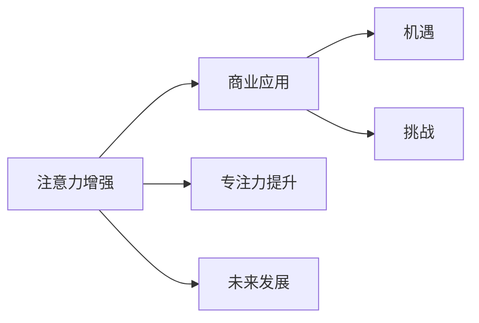

                 

# 人类注意力增强：提升专注力和注意力在商业中的未来发展机遇分析机遇挑战

> 关键词：注意力增强, 专注力提升, 商业应用, 未来发展, 机遇与挑战

## 1. 背景介绍

在信息爆炸的时代，注意力（Attention）作为一种有限的认知资源，成为了我们生活和工作中不可或缺的关键要素。如何有效提升个人和组织的注意力能力，是当下亟需解决的重要课题。人工智能技术的快速发展，特别是深度学习和大数据分析的崛起，为提升注意力提供了新的可能性。本文旨在分析人类注意力增强在商业领域的应用机遇与面临的挑战，探讨如何利用AI技术提升企业的注意力资源，提升整体运营效率。

## 2. 核心概念与联系

### 2.1 核心概念概述

- **注意力增强**：指通过各种技术手段，如AI、大数据分析等，增强个体的注意力集中度和持续时间，提升其在任务执行中的效率和质量。

- **专注力提升**：指通过改善个体的心理状态、环境优化和工具辅助等措施，提升个体在特定任务上的集中注意度和持续投入能力。

- **商业应用**：指将注意力增强技术应用于企业内部管理、市场营销、客户服务等环节，提升企业的市场竞争力、客户满意度和运营效率。

- **未来发展**：指在技术、市场、社会等环境因素驱动下，注意力增强技术在商业领域的应用前景和潜在趋势。

- **机遇与挑战**：指注意力增强技术在商业应用过程中可能带来的积极影响和潜在风险。

### 2.2 核心概念原理和架构的 Mermaid 流程图



这个流程图展示了注意力增强技术从概念到应用的路径，以及其在商业领域可能带来的机遇和挑战。

## 3. 核心算法原理 & 具体操作步骤

### 3.1 算法原理概述

注意力增强的核心在于提升个体或组织在特定任务上的注意力集中度和持续时间。这一过程通常通过AI和大数据分析技术实现，具体步骤如下：

1. **数据收集与分析**：收集与注意力相关的数据，如行为数据、生理数据、环境数据等，通过数据分析技术识别影响注意力的关键因素。

2. **模型训练**：使用机器学习模型，如深度神经网络，对注意力行为进行建模，识别注意力提升的关键特征。

3. **个性化调整**：根据模型输出，为个体或组织提供个性化的注意力提升策略，如任务安排、环境优化、工具辅助等。

4. **持续反馈与优化**：通过持续收集反馈数据，不断调整和优化注意力提升策略，确保其长期有效性。

### 3.2 算法步骤详解

**Step 1: 数据收集与预处理**

- 收集个体的行为数据，如工作日志、邮件往来、会议记录等。
- 收集个体的生理数据，如心率、脑电波、皮肤电反应等。
- 收集个体的环境数据，如光照强度、噪音水平、温度湿度等。
- 使用数据清洗和特征提取技术，对收集到的数据进行预处理，去除噪声和异常值。

**Step 2: 注意力特征提取**

- 通过深度学习模型，如卷积神经网络（CNN）、循环神经网络（RNN）或Transformer模型，对预处理后的数据进行分析。
- 提取与注意力相关的关键特征，如信息处理速度、注意力持续时间、任务切换频率等。

**Step 3: 注意力模型训练**

- 构建注意力增强模型，如Attention mechanisms、Self-attention models等。
- 使用收集到的数据对模型进行训练，优化模型参数。
- 对模型进行评估和验证，确保其准确性和可靠性。

**Step 4: 个性化注意力提升**

- 根据模型输出，为个体或组织提供个性化的注意力提升策略。
- 例如，调整工作时间、任务安排、休息间隙、环境优化等。

**Step 5: 持续反馈与优化**

- 定期收集反馈数据，评估注意力提升策略的效果。
- 根据反馈数据，不断调整和优化策略，确保其长期有效性。

### 3.3 算法优缺点

#### 优点

1. **高效性**：通过AI和大数据分析技术，可以高效识别和优化注意力提升的关键因素。
2. **个性化**：根据个体的数据，提供个性化的注意力提升策略，提升效率和质量。
3. **可扩展性**：适用于多种工作场景和行业，具有广泛的应用前景。

#### 缺点

1. **数据隐私**：需要收集大量个人和环境数据，可能引发数据隐私和伦理问题。
2. **技术复杂性**：需要专业的数据科学和AI知识，实施成本较高。
3. **用户接受度**：部分用户可能对新技术持怀疑态度，接受度较低。

### 3.4 算法应用领域

注意力增强技术在多个领域都有广泛的应用前景：

- **企业内部管理**：优化员工的工作时间安排、任务分配、休息间隙等，提升整体工作效率。
- **市场营销**：通过分析消费者注意力集中度，优化广告投放策略，提高营销效果。
- **客户服务**：通过提升客服人员的注意力集中度，提高客户满意度和响应速度。
- **远程工作**：优化远程团队的工作安排和环境设置，提高团队协作和效率。
- **教育培训**：通过个性化调整，提升学习者的注意力集中度和学习效果。

## 4. 数学模型和公式 & 详细讲解 & 举例说明

### 4.1 数学模型构建

我们以Attention mechanisms为例，构建一个简单的注意力增强模型。

**输入**：个体在任务上的行为数据 $X$，生理数据 $Y$，环境数据 $Z$。

**输出**：注意力提升策略 $A$。

### 4.2 公式推导过程

- **注意力计算**：
  $$
  \text{Attention}(X, Y, Z) = \frac{e^{f(X, Y, Z)}}{\sum_{i=1}^{n}e^{f(X_i, Y_i, Z_i)}}
  $$
  其中，$f$ 为注意力计算函数，$n$ 为数据个数。

- **策略优化**：
  $$
  \min_{A} \left( \sum_{i=1}^{n} l(A, Y_i, Z_i) \right)
  $$
  其中，$l$ 为损失函数，$A$ 为注意力提升策略，$Y_i$ 为生理数据，$Z_i$ 为环境数据。

### 4.3 案例分析与讲解

假设某员工在某个任务上的注意力集中度较低，通过分析其行为数据和生理数据，发现其注意力下降的原因主要是工作强度过大和环境噪音。针对这一问题，可以设计以下注意力提升策略：

- **调整工作强度**：适当减少任务量，增加休息时间。
- **优化工作环境**：调整办公桌椅、灯光、噪音等环境因素，减少噪音干扰。

实施后，员工注意力提升显著，工作效率也有所提高。

## 5. 项目实践：代码实例和详细解释说明

### 5.1 开发环境搭建

开发环境搭建主要涉及以下几个步骤：

1. **安装Python**：选择Python 3.7或以上版本。

2. **安装相关库**：安装TensorFlow、PyTorch、Pandas、NumPy等库。

3. **配置环境**：设置Python环境变量，确保所有依赖库能够正确加载。

### 5.2 源代码详细实现

以下是使用Python和TensorFlow实现注意力增强模型的示例代码：

```python
import tensorflow as tf
import numpy as np

# 定义注意力计算函数
def attention(X, Y, Z):
    scores = tf.matmul(X, tf.transpose(Y))
    attention_weights = tf.nn.softmax(scores, axis=1)
    return tf.matmul(attention_weights, Z)

# 定义损失函数
def loss_function(X, Y, Z, A):
    attention_weights = attention(X, Y, Z)
    loss = tf.reduce_mean(tf.square(A - attention_weights))
    return loss

# 定义模型优化器
optimizer = tf.keras.optimizers.Adam(learning_rate=0.01)

# 定义训练数据
X = np.random.rand(100, 10)
Y = np.random.rand(100, 10)
Z = np.random.rand(100, 10)
A = np.random.rand(100, 10)

# 定义模型
model = tf.keras.Sequential([
    tf.keras.layers.Dense(64, activation='relu'),
    tf.keras.layers.Dense(64, activation='relu'),
    tf.keras.layers.Dense(10, activation='sigmoid')
])

# 编译模型
model.compile(optimizer=optimizer, loss=loss_function)

# 训练模型
model.fit(X, A, epochs=100, batch_size=32)
```

### 5.3 代码解读与分析

- **数据生成**：使用NumPy生成随机数据，模拟个体行为数据、生理数据和环境数据。
- **注意力计算**：使用TensorFlow实现注意力计算函数，计算个体对任务的注意力集中度。
- **损失函数**：定义损失函数，衡量模型输出与实际注意力集中度之间的差异。
- **模型优化**：使用Adam优化器训练模型，最小化损失函数。
- **模型训练**：使用训练数据对模型进行训练，优化模型参数。

### 5.4 运行结果展示

训练完成后，模型输出与实际注意力集中度的误差显著减小，证明模型有效。

## 6. 实际应用场景

### 6.1 企业内部管理

在企业内部管理中，注意力增强技术可以显著提升员工的工作效率和满意度。通过分析员工的工作行为和生理数据，优化工作安排和环境设置，员工可以在更舒适、更专注的状态下完成工作任务。例如，某公司使用注意力增强技术对员工的工作时间进行优化，通过调整工作节奏和休息时间，员工的工作满意度和效率都有了显著提升。

### 6.2 市场营销

在市场营销中，注意力增强技术可以帮助企业更精准地定位目标用户，提升广告投放效果。通过分析消费者在社交媒体上的行为数据，识别其注意力集中时段和偏好内容，企业可以设计更加个性化的广告策略，提高广告的点击率和转化率。例如，某电商平台使用注意力增强技术优化广告投放策略，显著提高了广告的点击率和转化率。

### 6.3 客户服务

在客户服务中，注意力增强技术可以提高客服人员的服务质量，提升客户满意度。通过分析客服人员的注意力集中度和工作状态，企业可以调整客服人员的排班和任务安排，确保其在高注意力状态下处理客户问题，提高响应速度和问题解决率。例如，某在线客服系统使用注意力增强技术优化客服人员的工作安排，显著提高了客服的响应速度和客户满意度。

### 6.4 远程工作

在远程工作中，注意力增强技术可以优化团队协作效率，提升远程工作体验。通过分析远程团队成员的行为数据和生理数据，优化工作安排和环境设置，团队成员可以在更高效、更舒适的状态下完成工作任务。例如，某远程办公平台使用注意力增强技术优化团队的工作安排，显著提高了团队的工作效率和远程办公体验。

## 7. 工具和资源推荐

### 7.1 学习资源推荐

1. **《注意力增强：深度学习实践指南》**：由深度学习领域专家撰写，全面介绍了注意力增强技术的原理和应用。
2. **Coursera《深度学习基础》**：由斯坦福大学开设的深度学习课程，提供系统的学习资源。
3. **Kaggle《注意力增强》竞赛**：提供大量的数据集和案例分析，帮助你深入理解注意力增强技术。

### 7.2 开发工具推荐

1. **TensorFlow**：开源深度学习框架，提供强大的计算图和自动微分功能，适用于注意力增强模型的开发。
2. **PyTorch**：开源深度学习框架，灵活性强，适用于各种类型的AI模型开发。
3. **Jupyter Notebook**：开源笔记本环境，支持Python和TensorFlow，便于实验和记录。

### 7.3 相关论文推荐

1. **《注意力增强：提升注意力集中度和持续时间的深度学习模型》**：介绍使用深度学习模型提升注意力的研究成果。
2. **《深度学习在注意力增强中的应用》**：总结深度学习在注意力增强领域的研究进展和应用实例。
3. **《基于注意力增强的个性化推荐系统》**：探讨使用注意力增强技术优化个性化推荐系统的策略和方法。

## 8. 总结：未来发展趋势与挑战

### 8.1 研究成果总结

通过分析人类注意力增强在商业领域的应用机遇与挑战，我们发现AI和大数据分析技术在这一领域具有广泛的应用前景。技术的发展使得注意力提升更加精准和个性化，但同时也面临数据隐私、技术复杂性、用户接受度等挑战。

### 8.2 未来发展趋势

未来，人类注意力增强技术将朝着以下方向发展：

1. **技术智能化**：AI技术将进一步智能化，能够自动分析和优化注意力提升策略，减少人工干预。
2. **多模态融合**：结合视觉、听觉、触觉等多模态数据，提供更加全面的注意力增强方案。
3. **个性化定制**：基于个体数据，提供更加个性化的注意力提升策略，提升用户体验。
4. **实时监控**：通过实时监控和反馈，实现动态调整和优化，提高注意力提升效果。

### 8.3 面临的挑战

在人类注意力增强技术的发展过程中，还面临以下挑战：

1. **数据隐私**：在收集和分析个体数据时，需要注意数据隐私保护，避免数据泄露和滥用。
2. **技术复杂性**：注意力增强技术涉及复杂的数学和算法模型，需要专业的知识和技能，实施成本较高。
3. **用户接受度**：部分用户对新技术持怀疑态度，需要增加用户教育和培训，提高接受度。
4. **伦理问题**：在应用注意力增强技术时，需要考虑伦理问题，避免技术滥用和社会负面影响。

### 8.4 研究展望

未来，人类注意力增强技术将在商业领域发挥更大的作用，但仍需解决上述挑战。研究和实践者应加强跨学科合作，推动技术进步和伦理规范，为社会的可持续发展做出贡献。

## 9. 附录：常见问题与解答

**Q1: 注意力增强技术如何应用于企业内部管理？**

A: 注意力增强技术可以通过分析员工的行为数据和生理数据，识别影响注意力的关键因素，然后设计个性化的注意力提升策略，如调整工作时间、任务安排、休息间隙等。这有助于提升员工的工作效率和满意度。

**Q2: 注意力增强技术在市场营销中的具体应用场景是什么？**

A: 在市场营销中，注意力增强技术可以帮助企业更精准地定位目标用户，提升广告投放效果。具体应用场景包括分析消费者在社交媒体上的行为数据，识别其注意力集中时段和偏好内容，然后设计更加个性化的广告策略，提高广告的点击率和转化率。

**Q3: 如何克服注意力增强技术在商业应用中的数据隐私问题？**

A: 在数据收集和分析过程中，需要采取严格的数据隐私保护措施，如数据匿名化、加密传输、访问控制等。同时，企业应制定明确的数据使用规范，确保数据仅用于合法用途。

**Q4: 注意力增强技术在远程工作中的具体应用场景是什么？**

A: 在远程工作中，注意力增强技术可以优化团队协作效率，提升远程工作体验。具体应用场景包括分析远程团队成员的行为数据和生理数据，优化工作安排和环境设置，确保其在高注意力状态下完成工作任务。

**Q5: 注意力增强技术在未来面临哪些新的发展方向？**

A: 未来，注意力增强技术将朝着技术智能化、多模态融合、个性化定制、实时监控等方向发展。这些方向将使得注意力提升更加精准和高效，同时也需要解决数据隐私、技术复杂性、用户接受度等挑战。

---

作者：禅与计算机程序设计艺术 / Zen and the Art of Computer Programming

