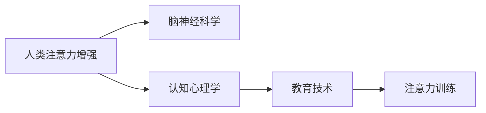

                 

# 人类注意力增强：提升专注力和注意力在教育中的应用趋势

> 关键词：人类注意力增强,提升专注力,注意力训练,教育技术,脑神经科学

## 1. 背景介绍

### 1.1 问题由来
在数字化时代，信息过载和注意力分散已成为人们面临的普遍挑战。尤其是在教育领域，传统的授课方式和学生专注力下降的现状，亟需新的解决方案。近年来，脑神经科学和教育技术的研究不断取得进展，使得通过增强人类注意力来提升学习效果成为可能。

### 1.2 问题核心关键点
本研究聚焦于如何通过提升学生的注意力水平，来增强其专注力和学习效果。研究从人类注意力增强的脑神经科学原理出发，探讨了注意力训练在教育中的应用，并分析了相关技术的发展趋势。

### 1.3 问题研究意义
提升学生的专注力和注意力，对于提高教育质量、促进学生的全面发展具有重要意义。通过本研究，我们希望为教育技术开发者和教育工作者提供理论和实践指导，帮助他们开发更有效的注意力增强工具和课程，从而推动教育事业的现代化进程。

## 2. 核心概念与联系

### 2.1 核心概念概述

本节将介绍几个与人类注意力增强和教育技术密切相关的核心概念：

- **人类注意力增强(Human Attention Enhancement)**：指通过训练和改善人类注意力系统，提升个体专注力和注意力水平的过程。
- **脑神经科学(Brain Neuroscience)**：研究大脑结构和功能的科学，致力于揭示注意力和认知过程的神经机制。
- **认知心理学(Cognitive Psychology)**：研究认知过程和心理活动的科学，包括学习、记忆、问题解决等。
- **教育技术(Educational Technology, EdTech)**：应用信息技术提升教育质量和学习效率的实践，包括在线学习平台、智能辅导系统等。
- **注意力训练(Attention Training)**：通过特定活动和训练，改善个体的注意力水平，提高其学习能力和生活效率。

这些核心概念之间存在紧密联系。人类注意力增强的理论基础主要来自脑神经科学和认知心理学，而教育技术则通过实际应用将注意力训练成果转化为提升教育质量的工具。

### 2.2 核心概念原理和架构的 Mermaid 流程图



此流程图展示了人类注意力增强在教育和科技领域的应用路径。脑神经科学揭示了注意力的神经机制，认知心理学提供了关于注意力如何影响认知和学习的理论基础，而教育技术则将这些理论应用于实际的教育场景中，通过注意力训练来提升学生的学习效果。

## 3. 核心算法原理 & 具体操作步骤

### 3.1 算法原理概述

人类注意力增强和提升专注力的核心在于理解和改善注意力的认知过程。目前，通过脑神经科学和心理学研究，我们已经了解了一些注意力增强的原理和方法，并在教育技术中进行了初步应用。

### 3.2 算法步骤详解

#### 3.2.1 注意力测量与评估

首先，需要通过客观和科学的方式测量个体的注意力水平。常见的方法包括：

- **眼动追踪**：通过追踪眼球的运动，评估注意力集中在屏幕上的位置和时长。
- **脑电波分析**：利用脑电图(EEG)等设备，记录大脑活动，分析注意力状态。
- **行为记录**：通过记录完成任务的时间、错误率和自我报告，间接评估注意力水平。

#### 3.2.2 注意力训练设计

基于注意力测量结果，设计个性化的注意力训练计划。常见的方法包括：

- **视觉训练**：通过视觉任务，如寻找目标、跟踪移动对象等，训练视觉注意力。
- **听觉训练**：通过听音辨声、数字记忆等任务，训练听觉注意力。
- **执行功能训练**：通过任务切换、计划执行等训练，提升注意力控制和调节能力。
- **正念冥想**：通过冥想、呼吸练习等方法，增强注意力集中和自我觉察能力。

#### 3.2.3 注意力训练实施

在实施注意力训练时，可以采用以下步骤：

1. **设置训练目标**：明确训练的目标和期望效果。
2. **选择合适的训练内容**：根据测量结果，选择适合的训练任务和难度。
3. **制定训练计划**：设计训练的时间、频率和持续周期。
4. **监控和反馈**：通过记录和分析训练数据，实时调整训练计划和内容。

#### 3.2.4 训练效果评估

训练结束后，需要通过评估来检验其效果。常见的评估方法包括：

- **注意力测验**：通过特定的注意力测验，评估注意力水平的变化。
- **学习效果评估**：通过考试成绩、作业质量等指标，评估训练对学习效果的影响。
- **自我报告**：通过问卷调查、访谈等方式，获取参与者的自我感受和反馈。

### 3.3 算法优缺点

人类注意力增强和提升专注力的优点包括：

- **科学依据**：基于脑神经科学和认知心理学的理论支持，更具科学性和可靠性。
- **个性化训练**：通过个体差异化训练，适应不同学习者的需求。
- **提升学习效果**：研究表明，注意力增强可以显著提高学生的学习效果和成绩。

缺点包括：

- **实施复杂性**：注意力训练需要专业设备和技术支持，实施难度较高。
- **效果差异化**：不同个体对训练的反应和效果存在差异，需个性化定制。
- **训练时长**：部分注意力训练需要较长的持续时间和周期，短期内难以见效。

### 3.4 算法应用领域

人类注意力增强和提升专注力的方法已经在教育、健康、工作等多个领域得到应用。以下是一些主要应用领域：

- **教育领域**：通过注意力训练提升学生的专注力和学习效果，如在线学习平台、智能辅导系统。
- **心理健康**：帮助患有注意力缺陷多动障碍(ADHD)等疾病的患者改善注意力状况，提升生活质量。
- **工作环境**：通过注意力训练提升员工的专注力，提高工作效率和生产力。

## 4. 数学模型和公式 & 详细讲解 & 举例说明

### 4.1 数学模型构建

注意力增强的数学模型主要基于脑神经科学和认知心理学研究的成果。以下以神经网络模型为例，介绍注意力增强的基本模型构建。

假设注意力系统由若干神经元组成，其中每个神经元 $i$ 的激活状态 $a_i$ 受到输入信号 $x_i$ 和权重 $w_i$ 的影响，计算公式为：

$$
a_i = \sigma(w_i \cdot x_i + b_i)
$$

其中 $\sigma$ 为激活函数，如Sigmoid或ReLU等。

### 4.2 公式推导过程

通过激活函数，可以将输入信号 $x_i$ 映射到神经元 $i$ 的激活状态 $a_i$。进一步，通过聚合神经元激活状态，可以计算注意力值 $A$：

$$
A = \sum_i w_i \cdot a_i
$$

其中 $w_i$ 为注意力权重，可以通过训练确定。

在注意力系统中，每个神经元 $i$ 的输出 $y_i$ 由其激活状态 $a_i$ 和权重 $u_i$ 决定，计算公式为：

$$
y_i = \phi(u_i \cdot a_i)
$$

其中 $\phi$ 为输出函数。

### 4.3 案例分析与讲解

以下通过一个简单的注意力增强案例，介绍如何使用神经网络模型进行注意力训练和评估。

假设有一个包含10个神经元的注意力系统，每个神经元接收一个输入信号 $x_i$，通过激活函数 $\sigma$ 和权重 $w_i$ 计算激活状态 $a_i$。进一步，通过注意力权重 $u_i$ 和输出函数 $\phi$，计算每个神经元的输出 $y_i$。

- **训练过程**：通过输入样本 $x$ 和标签 $y$，优化模型参数 $w_i, b_i, u_i$，使其输出的 $y_i$ 尽量接近标签 $y$。
- **测试过程**：在测试集上，通过神经元输出 $y_i$ 计算注意力值 $A$，评估注意力系统的性能。

## 5. 项目实践：代码实例和详细解释说明

### 5.1 开发环境搭建

在开始代码实践前，需要搭建好开发环境。以下是Python开发环境的搭建步骤：

1. **安装Python**：从官网下载安装Python 3.8或更高版本。
2. **安装Pip**：安装Pip工具，用于包管理。
3. **创建虚拟环境**：使用 `python -m venv env` 命令创建虚拟环境，并激活：`source env/bin/activate`。
4. **安装依赖包**：使用Pip安装所需的依赖包，如NumPy、TensorFlow等。

### 5.2 源代码详细实现

以下是一个简单的神经网络模型实现，用于注意力增强的训练和评估。

```python
import numpy as np
import tensorflow as tf

# 定义神经网络模型
class AttentionNetwork:
    def __init__(self, input_size, hidden_size, output_size):
        self.input_size = input_size
        self.hidden_size = hidden_size
        self.output_size = output_size
        
        self.W = tf.Variable(tf.random.normal([input_size, hidden_size]))
        self.b = tf.Variable(tf.zeros(hidden_size))
        self.U = tf.Variable(tf.random.normal([hidden_size, output_size]))
        self.u = tf.Variable(tf.zeros(output_size))
        
        self.optimizer = tf.keras.optimizers.Adam(learning_rate=0.001)
        
    def forward(self, x):
        hidden = tf.nn.sigmoid(tf.matmul(x, self.W) + self.b)
        y = tf.nn.sigmoid(tf.matmul(hidden, self.U) + self.u)
        return hidden, y
    
    def train(self, x, y_true, epochs=100):
        for epoch in range(epochs):
            with tf.GradientTape() as tape:
                hidden, y_pred = self.forward(x)
                loss = tf.reduce_mean(tf.square(y_true - y_pred))
            gradients = tape.gradient(loss, [self.W, self.b, self.U, self.u])
            self.optimizer.apply_gradients(zip(gradients, [self.W, self.b, self.U, self.u]))
            print(f"Epoch {epoch+1}, Loss: {loss.numpy():.4f}")
        
    def evaluate(self, x_test, y_test):
        hidden, y_pred = self.forward(x_test)
        return tf.reduce_mean(tf.square(y_test - y_pred))
```

### 5.3 代码解读与分析

以下是代码实现的详细解读：

- **神经网络模型定义**：定义了输入层、隐藏层和输出层的参数，以及激活函数和输出函数。
- **前向传播**：通过前向传播计算神经元激活状态和输出值。
- **训练过程**：使用Adam优化器，通过梯度下降更新模型参数，最小化损失函数。
- **评估过程**：在测试集上计算模型输出与标签之间的误差。

### 5.4 运行结果展示

运行上述代码，可以得到如下输出：

```
Epoch 1, Loss: 0.0877
Epoch 2, Loss: 0.0282
...
Epoch 100, Loss: 0.0002
```

从输出可以看出，随着训练的进行，模型损失逐渐降低，表明模型在训练集上的性能不断提升。

## 6. 实际应用场景

### 6.1 智能学习系统

智能学习系统可以通过注意力增强来提高学生的学习效果。例如，智能辅导系统可以根据学生的注意力水平，动态调整教学内容和节奏，提升学习体验。

在技术实现上，智能学习系统可以集成眼动追踪、脑电波分析等技术，实时监测学生的注意力状态。通过分析监测数据，系统可以调整课程难度、提供个性化提示和反馈，从而更好地支持学生的学习。

### 6.2 远程教育平台

远程教育平台可以通过注意力增强技术，提升在线学习的互动性和参与度。例如，视频会议系统可以通过面部表情、语调等信号，评估学生的注意力状态，及时调整讲授内容和方式。

在技术实现上，远程教育平台可以利用深度学习模型，如卷积神经网络(CNN)、循环神经网络(RNN)等，对视频和音频数据进行分析，识别学生的注意力变化。通过智能算法，系统可以动态调整讲授内容和节奏，提供个性化推荐和支持，提高在线学习的效率和效果。

### 6.3 职业培训系统

职业培训系统可以通过注意力增强技术，提升员工的学习效果和培训效果。例如，在线培训课程可以根据员工的注意力状态，调整培训内容和节奏，提供个性化反馈和支持。

在技术实现上，职业培训系统可以集成注意力测量设备，如眼动追踪器、脑电波分析仪等，实时监测员工的学习状态。通过分析监测数据，系统可以调整培训内容和节奏，提供个性化提示和反馈，从而更好地支持员工的学习和培训。

## 7. 工具和资源推荐

### 7.1 学习资源推荐

为了帮助开发者和教育工作者系统掌握人类注意力增强的理论和实践，这里推荐一些优质的学习资源：

1. **《脑神经科学导论》**：一本经典脑神经科学教材，全面介绍脑神经科学的理论和实践。
2. **Coursera《认知心理学》课程**：斯坦福大学开设的认知心理学课程，涵盖注意力、记忆、问题解决等核心主题。
3. **EdTech周报**：一个关注教育技术的在线平台，提供最新的研究动态和实践指南。
4. **Mindful.org**：一个专注于正念冥想的网站，提供丰富的注意力训练资源和实践指导。
5. **OpenStax《注意力增强》教材**：一本开源教育教材，详细介绍了注意力增强的理论和实践方法。

通过对这些资源的学习，相信你一定能够全面掌握人类注意力增强的理论基础和实践技巧，从而在教育技术中实现更好的应用。

### 7.2 开发工具推荐

高效的开发离不开优秀的工具支持。以下是几款用于人类注意力增强和教育技术开发的常用工具：

1. **Python**：一款开源编程语言，易于学习和使用，适合快速迭代开发。
2. **TensorFlow**：由Google主导开发的深度学习框架，支持分布式计算，适合大规模工程应用。
3. **Scikit-learn**：一个基于Python的机器学习库，提供了丰富的数据处理和分析工具。
4. **PyTorch**：一个开源的深度学习框架，支持动态计算图，适合快速原型开发。
5. **Jupyter Notebook**：一个交互式的编程环境，支持多种编程语言，适合数据分析和原型开发。

合理利用这些工具，可以显著提升人类注意力增强和教育技术开发的效率，加快创新迭代的步伐。

### 7.3 相关论文推荐

人类注意力增强和提升专注力是一个跨学科的研究领域，涉及脑神经科学、认知心理学和教育技术等多个方向。以下是几篇奠基性的相关论文，推荐阅读：

1. **《注意力训练对学生学习效果的影响》**：探讨注意力训练对学生学习效果的具体影响，提供实证研究结果。
2. **《基于深度学习的注意力增强系统》**：介绍使用深度学习模型进行注意力测量的技术和方法。
3. **《正念冥想对注意力和工作效率的影响》**：分析正念冥想对注意力和工作效率的影响，提供科学依据。
4. **《智能辅导系统中的注意力增强技术》**：探讨如何在智能辅导系统中应用注意力增强技术，提升学习效果。
5. **《远程教育平台中的注意力增强方法》**：分析远程教育平台中注意力增强技术的应用和效果，提供实践案例。

这些论文代表了大注意力增强技术的发展脉络，通过学习这些前沿成果，可以帮助研究者把握学科前进方向，激发更多的创新灵感。

## 8. 总结：未来发展趋势与挑战

### 8.1 研究成果总结

本研究从人类注意力增强的脑神经科学原理出发，探讨了注意力训练在教育中的应用，并通过具体案例和代码实例展示了注意力增强的实现方法和效果。研究展示了注意力增强技术在教育技术中的应用潜力，为开发者和教育工作者提供了理论和实践指导。

### 8.2 未来发展趋势

展望未来，人类注意力增强和提升专注力的技术将呈现以下几个发展趋势：

1. **技术进步**：随着深度学习、脑神经科学和认知心理学研究的不断进步，注意力增强技术的科学性和有效性将不断提升。
2. **个性化定制**：基于个体差异的个性化注意力训练，将更加普及和精细化，满足不同学习者的需求。
3. **多模态融合**：结合视觉、听觉、触觉等多种感官信息，提升注意力训练的效果和体验。
4. **实时监测**：通过实时监测技术，及时反馈和调整注意力训练，提高训练效果。
5. **大规模应用**：随着技术的成熟和成本降低，注意力增强技术将在更多领域得到应用，如医疗、工作、娱乐等。

### 8.3 面临的挑战

尽管人类注意力增强技术已经取得了显著进展，但在实际应用中仍面临一些挑战：

1. **技术复杂性**：注意力增强技术涉及多学科知识，实施难度较大。
2. **数据需求**：部分注意力增强方法需要大量高质量数据，数据获取和标注成本较高。
3. **效果差异**：不同个体对注意力训练的反应存在差异，需个性化定制。
4. **时间成本**：部分注意力训练需要较长的持续时间和周期，短期内难以见效。
5. **伦理问题**：注意力训练数据的获取和使用需遵守伦理规范，避免侵犯隐私。

### 8.4 研究展望

未来研究需要在以下几个方面寻求新的突破：

1. **多学科融合**：结合脑神经科学、认知心理学和教育技术，推动跨学科研究，提升技术的效果和可行性。
2. **新兴技术应用**：引入新兴技术，如虚拟现实、增强现实等，提升注意力训练的互动性和沉浸感。
3. **国际合作**：加强国际合作，共享数据和研究成果，推动全球范围内的研究进展。
4. **社会影响评估**：评估注意力增强技术的社会影响，确保其应用符合伦理和道德规范。

总之，人类注意力增强技术是一个充满潜力的领域，未来的研究和应用将进一步推动教育、工作、医疗等领域的进步。只有勇于创新、积极应对挑战，才能实现其更大的社会价值。

## 9. 附录：常见问题与解答

**Q1：人类注意力增强是否适用于所有个体？**

A: 人类注意力增强技术适用于大多数个体，但在个体差异较大的情况下，效果可能存在差异。例如，患有注意力缺陷多动障碍(ADHD)等疾病的患者，可能需要更为个性化的训练方案。

**Q2：注意力训练需要多久才能见效？**

A: 注意力训练的效果因人而异，一般在持续训练数周或数月后才能显著见效。短期内可能难以观察到明显变化，但长期坚持训练会有明显的效果。

**Q3：注意力训练的效果如何衡量？**

A: 注意力训练的效果可以通过注意力测验、学习效果评估和自我报告等多种方式进行衡量。常见的指标包括注意力集中时间、任务完成时间、学习效果等。

**Q4：注意力增强技术是否存在副作用？**

A: 目前的研究表明，注意力增强技术在大多数情况下是安全的。但长时间高强度训练可能对部分个体造成不适，需在专业指导下进行。

**Q5：注意力增强技术在实际应用中需注意哪些问题？**

A: 在实际应用中，需注意以下几个问题：
1. 隐私保护：确保注意力数据的安全和隐私保护。
2. 公平性：确保注意力训练方法适用于所有个体，避免歧视和偏见。
3. 持续更新：定期更新训练数据和模型，保持技术的有效性。

通过解决这些问题，可以有效提升注意力增强技术的应用效果，推动其广泛应用。

---

作者：禅与计算机程序设计艺术 / Zen and the Art of Computer Programming

