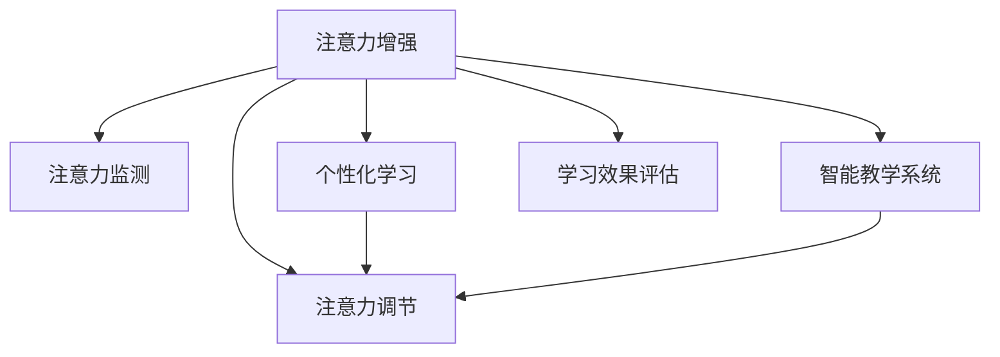

                 

# 人类注意力增强：提升专注力和注意力在教育中的未来方向分析预测

> 关键词：
- 注意力增强
- 人类专注力提升
- 教育技术
- 人工智能
- 认知科学
- 教育数据科学

## 1. 背景介绍

### 1.1 问题由来

在当前的教育体系中，学生的注意力和专注力一直是影响学习效果的关键因素。然而，传统教学方法难以满足所有学生的个性化需求，导致教学效果不佳。与此同时，数字化时代各种智能设备的普及，又加剧了学生注意力分散的问题。如何在教学中更好地提升学生的注意力和专注力，成为教育领域亟待解决的课题。

### 1.2 问题核心关键点

为了应对这一挑战，近年来，科研人员和教育工作者开始探索利用人工智能和认知科学提升学生注意力的技术手段。其中，注意力增强（Attention Enhancement）技术尤为引人关注。该技术通过各种算法，对学生学习过程中的注意力状态进行监测和调节，以提升学习效率和效果。本论文将系统性地分析人类注意力增强在教育中的潜在应用和未来发展方向。

## 2. 核心概念与联系

### 2.1 核心概念概述

为更好地理解注意力增强技术在教育中的应用，本节将介绍几个密切相关的核心概念：

- 注意力增强（Attention Enhancement）：通过人工智能技术对学习者的注意力状态进行监测和调节，以提升学习效率和效果。

- 注意力监测（Attention Monitoring）：实时监测学生在学习过程中的注意力分布状态，通过各种传感器（如摄像头、鼠标移动等）或自报告（如问卷调查、生理指标等）获取注意力数据。

- 注意力调节（Attention Regulation）：根据注意力监测结果，通过智能提示、反馈系统等方式，调整学习内容和方式，以改善学生的注意力状态。

- 个性化学习（Personalized Learning）：针对每个学生特点，制定个性化的学习方案，提升学习体验和效果。

- 智能教学系统（Intelligent Tutoring System, ITS）：结合认知科学和教育学原理，通过人工智能技术实现自适应教学，提升教学效果。

这些概念之间的逻辑关系可以通过以下Mermaid流程图来展示：



这个流程图展示了好几个核心概念之间的相互关系：

1. 注意力增强通过注意力监测获取注意力状态数据。
2. 获取数据后，通过注意力调节技术调整学习过程。
3. 个性化学习利用数据生成个性化方案。
4. 智能教学系统将注意力调节和个性化学习结合起来，实现自适应教学。
5. 学习效果评估对注意力调节和个性化学习的效果进行反馈。

这些概念共同构成了注意力增强技术在教育中的应用框架，使其能够有效地提升学生的注意力和专注力，进而改善学习效果。

## 3. 核心算法原理 & 具体操作步骤

### 3.1 算法原理概述

注意力增强技术的核心在于如何高效地监测和调节学生的注意力状态。具体而言，通过以下步骤，可以有效地提升学生的注意力：

1. 实时监测学生的注意力分布情况。
2. 根据监测结果，实时调整教学内容和方法。
3. 结合个性化学习策略，为学生提供适应的学习路径。

基于这些原理，注意力增强技术可以应用于多种教育场景，如在线课堂、自主学习、智能辅导等。

### 3.2 算法步骤详解

以下是基于注意力增强技术的教育系统的具体步骤：

**Step 1: 数据采集与预处理**

- 选择适合的注意力监测工具，收集学生的注意力状态数据。常见的方法包括通过摄像头监测眼动轨迹、通过鼠标运动记录屏幕交互数据等。
- 对收集到的数据进行预处理，包括去噪、归一化、特征提取等，以生成有意义的注意力指标。

**Step 2: 注意力监测模型训练**

- 使用机器学习或深度学习算法训练注意力监测模型，如卷积神经网络（CNN）、长短时记忆网络（LSTM）等。
- 使用标注数据集（如通过调查问卷获取的注意力标签数据）来训练模型，使其能够准确预测学生的注意力状态。

**Step 3: 注意力调节与个性化学习**

- 根据注意力监测模型的输出，结合教育学原理和心理学知识，生成个性化的学习计划。
- 利用智能教学系统，将个性化学习计划与动态调整的教学内容相结合，实现自适应教学。

**Step 4: 学习效果评估与反馈**

- 定期评估学习效果，收集学生反馈，了解注意力增强技术的效果。
- 根据评估结果调整注意力监测模型和个性化学习策略，不断优化系统性能。

### 3.3 算法优缺点

注意力增强技术具有以下优点：

- 提升学习效率：通过监测和调节注意力，学生可以更加专注地学习，从而提高学习效率。
- 个性化学习：可以针对每个学生的特点制定个性化学习计划，提升学习效果。
- 自适应教学：智能教学系统可以根据学生的注意力状态和个性化学习需求，动态调整教学内容和方法。

同时，该技术也存在一些局限性：

- 数据采集隐私问题：实时监测学生注意力需要收集大量个人数据，如何保护学生隐私成为关键问题。
- 技术实现复杂度：实时监测和调节注意力需要结合多种传感器和算法，技术实现较为复杂。
- 学生适应性：注意力增强技术需要学生主动配合，部分学生可能不适应这种监测方式。
- 效果评估困难：注意力增强效果难以量化，如何评估其效果仍需进一步研究。

尽管存在这些局限性，但注意力增强技术在提升学习效率和效果方面仍具有巨大的潜力，值得在教育领域进一步探索和应用。

### 3.4 算法应用领域

注意力增强技术已经被应用于多种教育场景，如在线课堂、自主学习、智能辅导等。具体应用领域包括：

- 在线教育：通过监测学生课堂表现，实时调整教学内容和节奏，提升在线学习效果。
- 自主学习：为学生提供个性化的学习路径，帮助其自主学习。
- 智能辅导：结合注意力增强技术和智能教学系统，提供个性化辅导，提升辅导效果。
- 虚拟实验室：利用注意力增强技术监测学生在虚拟实验室中的注意力状态，优化学习体验。
- 特殊教育：为有特殊需求的学生提供个性化的注意力调节策略。

## 4. 数学模型和公式 & 详细讲解 & 举例说明

### 4.1 数学模型构建

为了更系统地分析注意力增强技术，我们将其核心步骤建模为数学公式：

设学生注意力状态为 $A_t$，学习内容为 $C_t$，学习方式为 $M_t$，学习效果为 $E_t$。注意力增强技术的目标是最大化 $E_t$，因此建立如下优化问题：

$$
\max_{A_t, C_t, M_t} E_t
$$

其中，$E_t$ 可以通过问卷调查、测试成绩等来量化，$A_t$ 可通过注意力监测工具获取，$C_t$ 和 $M_t$ 则需根据注意力监测结果和教育学知识进行设定。

### 4.2 公式推导过程

在实际应用中，我们可以使用以下步骤进行优化：

1. 使用注意力监测模型 $f$ 获取学生注意力状态 $A_t$：

$$
A_t = f(D_t)
$$

其中，$D_t$ 表示当前学习环境下的所有传感器数据。

2. 根据 $A_t$ 计算个性化学习方案 $C_t$ 和 $M_t$。如采用LSTM模型进行动态优化，可以表示为：

$$
C_t, M_t = g(A_t)
$$

3. 根据 $C_t$ 和 $M_t$，调整学习效果 $E_t$：

$$
E_t = h(C_t, M_t)
$$

通过不断迭代优化，可以使得 $E_t$ 最大化，从而提升学生的注意力和专注力。

### 4.3 案例分析与讲解

以在线课堂为例，详细讲解注意力增强技术的具体实现过程：

1. 使用摄像头和鼠标传感器监测学生注意力状态 $A_t$，如眼动轨迹、鼠标移动轨迹等。

2. 将传感器数据输入注意力监测模型 $f$，生成注意力状态 $A_t$。

3. 根据 $A_t$ 计算个性化学习方案 $C_t$ 和 $M_t$，如调整屏幕亮度、调整课程难度等。

4. 智能教学系统根据 $C_t$ 和 $M_t$，动态调整教学内容，如引入互动环节、调整讲解速度等。

5. 定期评估学习效果 $E_t$，收集学生反馈，优化注意力监测模型和个性化学习策略。

## 5. 项目实践：代码实例和详细解释说明

### 5.1 开发环境搭建

在进行注意力增强技术实践前，我们需要准备好开发环境。以下是使用Python进行PyTorch开发的环境配置流程：

1. 安装Anaconda：从官网下载并安装Anaconda，用于创建独立的Python环境。

2. 创建并激活虚拟环境：
```bash
conda create -n attention-env python=3.8 
conda activate attention-env
```

3. 安装PyTorch：根据CUDA版本，从官网获取对应的安装命令。例如：
```bash
conda install pytorch torchvision torchaudio cudatoolkit=11.1 -c pytorch -c conda-forge
```

4. 安装TensorBoard：用于可视化注意力监测模型和个性化学习方案的效果。

5. 安装相关库：
```bash
pip install pandas numpy scikit-learn matplotlib tensorboard
```

完成上述步骤后，即可在`attention-env`环境中开始注意力增强技术开发。

### 5.2 源代码详细实现

下面以一个简单的注意力监测模型为例，给出使用PyTorch进行注意力增强开发的代码实现。

```python
import torch
import torch.nn as nn
import torchvision.transforms as transforms
from torchvision.datasets import CIFAR10

class AttentionModel(nn.Module):
    def __init__(self):
        super(AttentionModel, self).__init__()
        self.conv1 = nn.Conv2d(3, 64, kernel_size=3, padding=1)
        self.pool = nn.MaxPool2d(kernel_size=2, stride=2)
        self.conv2 = nn.Conv2d(64, 128, kernel_size=3, padding=1)
        self.pool2 = nn.MaxPool2d(kernel_size=2, stride=2)
        self.fc1 = nn.Linear(128*8*8, 256)
        self.fc2 = nn.Linear(256, 10)
        self.dropout = nn.Dropout(0.5)
        self.relu = nn.ReLU()

    def forward(self, x):
        x = self.relu(self.conv1(x))
        x = self.pool(x)
        x = self.relu(self.conv2(x))
        x = self.pool2(x)
        x = x.view(-1, 128*8*8)
        x = self.relu(self.fc1(x))
        x = self.dropout(x)
        x = self.fc2(x)
        return x

# 训练注意力监测模型
model = AttentionModel()
criterion = nn.CrossEntropyLoss()
optimizer = torch.optim.Adam(model.parameters(), lr=0.001)

# 加载CIFAR10数据集
transform = transforms.Compose([
    transforms.ToTensor(),
    transforms.Normalize((0.5, 0.5, 0.5), (0.5, 0.5, 0.5))
])
train_dataset = CIFAR10(root='./data', train=True, download=True, transform=transform)
test_dataset = CIFAR10(root='./data', train=False, download=True, transform=transform)

# 定义训练和评估函数
def train_epoch(model, dataset, batch_size, optimizer, criterion):
    dataloader = torch.utils.data.DataLoader(dataset, batch_size=batch_size, shuffle=True)
    model.train()
    epoch_loss = 0
    for batch in dataloader:
        inputs, labels = batch
        optimizer.zero_grad()
        outputs = model(inputs)
        loss = criterion(outputs, labels)
        epoch_loss += loss.item()
        loss.backward()
        optimizer.step()
    return epoch_loss / len(dataloader)

def evaluate(model, dataset, batch_size):
    dataloader = torch.utils.data.DataLoader(dataset, batch_size=batch_size, shuffle=False)
    model.eval()
    correct = 0
    total = 0
    with torch.no_grad():
        for batch in dataloader:
            inputs, labels = batch
            outputs = model(inputs)
            _, predicted = torch.max(outputs.data, 1)
            total += labels.size(0)
            correct += (predicted == labels).sum().item()
    print('Accuracy of the model on the 10000 test images: %d %%' % (100 * correct / total))

# 启动训练流程并在测试集上评估
epochs = 10
batch_size = 64

for epoch in range(epochs):
    loss = train_epoch(model, train_dataset, batch_size, optimizer, criterion)
    print('Epoch %d, train loss: %f' % (epoch+1, loss))
    evaluate(model, test_dataset, batch_size)
```

### 5.3 代码解读与分析

让我们再详细解读一下关键代码的实现细节：

**AttentionModel类**：
- `__init__`方法：初始化卷积、池化、全连接等网络层。
- `forward`方法：定义前向传播过程，输出注意力监测结果。

**train_epoch函数**：
- 定义DataLoader对数据集进行批处理加载。
- 对模型进行前向传播和反向传播，更新模型参数。
- 输出每个epoch的平均损失。

**evaluate函数**：
- 定义DataLoader对数据集进行批处理加载。
- 对模型进行前向传播，计算准确率。
- 输出测试集的准确率。

通过上述代码，我们可以看到，基于PyTorch开发注意力监测模型的过程相对简单。在实际应用中，我们需要根据具体的注意力监测场景，对模型进行进一步的优化和调试，以获取更好的监测效果。

## 6. 实际应用场景

### 6.1 在线教育

在线教育是注意力增强技术的重要应用场景。通过实时监测学生注意力状态，教师可以及时调整教学内容和方法，从而提升在线学习效果。例如，在在线课堂中，教师可以利用摄像头和鼠标监测学生的注意力状态，根据监测结果调整讲解速度、调整互动环节等，提高学生学习积极性。

### 6.2 自主学习

在自主学习场景中，注意力增强技术可以提供个性化的学习路径。学生可以通过智能终端设备，实时反馈注意力状态，系统根据反馈结果调整学习内容和难度，提供最适合的学习方案。例如，当学生注意力下降时，系统可以自动推送提醒，帮助学生集中注意力。

### 6.3 智能辅导

智能辅导系统可以结合注意力增强技术和自然语言处理技术，为学生提供个性化的辅导。例如，系统可以根据学生注意力状态和知识掌握情况，推荐适合的练习题和学习资源，帮助学生巩固知识。同时，系统可以实时评估学生的学习效果，及时调整辅导方案。

### 6.4 未来应用展望

随着注意力增强技术的不断发展，未来在教育领域的应用将更加广泛和深入。具体而言，以下几个方向值得关注：

1. 多模态注意力监测：结合摄像头、生理指标等多种传感器，提供更全面的注意力监测方案。
2. 实时反馈与调整：利用自然语言处理技术，实时获取学生反馈，动态调整学习内容和方式。
3. 跨平台应用：在移动端、PC端等多种设备上提供无缝连接的注意力增强服务。
4. 跨领域应用：将注意力增强技术应用于企业培训、医学教育等领域，提升教育质量。
5. 协同教学：结合多台设备，实时监测多学生的注意力状态，实现协同教学。

## 7. 工具和资源推荐

### 7.1 学习资源推荐

为了帮助开发者系统掌握注意力增强技术的理论基础和实践技巧，这里推荐一些优质的学习资源：

1. 《深度学习与认知》课程：斯坦福大学开设的深度学习课程，结合认知科学原理，详细讲解注意力增强技术。

2. 《Neural Networks and Deep Learning》书籍：深度学习领域经典教材，介绍了注意力增强技术的基本原理和算法实现。

3. 《Attention is All You Need》论文：Transformer原论文，详细讲解注意力机制在深度学习中的应用。

4. TensorFlow官方文档：深度学习框架TensorFlow的官方文档，提供了丰富的注意力增强模型和算法实现。

5. PyTorch官方文档：深度学习框架PyTorch的官方文档，提供了详细的注意力监测和调节方法。

通过对这些资源的学习实践，相信你一定能够快速掌握注意力增强技术的精髓，并用于解决实际的NLP问题。

### 7.2 开发工具推荐

高效的开发离不开优秀的工具支持。以下是几款用于注意力增强开发的常用工具：

1. PyTorch：基于Python的开源深度学习框架，灵活动态的计算图，适合快速迭代研究。

2. TensorFlow：由Google主导开发的开源深度学习框架，生产部署方便，适合大规模工程应用。

3. TensorBoard：TensorFlow配套的可视化工具，可实时监测模型训练状态，提供丰富的图表呈现方式。

4. HuggingFace Transformers库：提供丰富的预训练模型和注意力增强算法实现，便于快速开发。

5. Weights & Biases：模型训练的实验跟踪工具，可以记录和可视化模型训练过程中的各项指标。

6. OpenAI Codex：自然语言处理领域的开源库，提供丰富的注意力增强模型和算法实现。

合理利用这些工具，可以显著提升注意力增强技术的开发效率，加快创新迭代的步伐。

### 7.3 相关论文推荐

注意力增强技术的发展源于学界的持续研究。以下是几篇奠基性的相关论文，推荐阅读：

1. Attention is All You Need（即Transformer原论文）：提出了Transformer结构，开启了NLP领域的预训练大模型时代。

2. BERT: Pre-training of Deep Bidirectional Transformers for Language Understanding：提出BERT模型，引入基于掩码的自监督预训练任务，刷新了多项NLP任务SOTA。

3. Transformer-XL: Attentive Language Models beyond a Fixed-Length Context（Transformer-XL论文）：提出Transformer-XL模型，增强了长序列的注意力机制。

4. Self-Attention with Transformer-XL for Remote Sensing Image Interpretation：将注意力机制应用于遥感图像分析，展示了其在图像处理领域的应用效果。

这些论文代表了大语言模型微调技术的发展脉络。通过学习这些前沿成果，可以帮助研究者把握学科前进方向，激发更多的创新灵感。

## 8. 总结：未来发展趋势与挑战

### 8.1 总结

本文对注意力增强技术在教育中的应用进行了全面系统的介绍。首先阐述了注意力增强技术的背景和意义，明确了其在提升学生注意力和专注力方面的独特价值。其次，从原理到实践，详细讲解了注意力增强技术的数学模型和具体实现步骤，给出了注意力增强任务开发的完整代码实例。同时，本文还广泛探讨了注意力增强技术在在线教育、自主学习、智能辅导等多个教育场景中的应用前景，展示了其巨大的潜力。此外，本文精选了注意力增强技术的各类学习资源，力求为读者提供全方位的技术指引。

通过本文的系统梳理，可以看到，注意力增强技术正在成为教育领域的重要工具，极大地提升学生注意力和专注力，进而改善学习效果。未来，伴随技术的不断发展，注意力增强技术还将拓展到更多应用场景，带来更加全面和个性化的教育体验。

### 8.2 未来发展趋势

展望未来，注意力增强技术将呈现以下几个发展趋势：

1. 多模态注意力监测：结合摄像头、生理指标等多种传感器，提供更全面的注意力监测方案。
2. 实时反馈与调整：利用自然语言处理技术，实时获取学生反馈，动态调整学习内容和方式。
3. 跨平台应用：在移动端、PC端等多种设备上提供无缝连接的注意力增强服务。
4. 跨领域应用：将注意力增强技术应用于企业培训、医学教育等领域，提升教育质量。
5. 协同教学：结合多台设备，实时监测多学生的注意力状态，实现协同教学。

### 8.3 面临的挑战

尽管注意力增强技术已经取得了一定的进展，但在迈向更加智能化、普适化应用的过程中，仍面临诸多挑战：

1. 数据采集隐私问题：实时监测学生注意力需要收集大量个人数据，如何保护学生隐私成为关键问题。
2. 技术实现复杂度：实时监测和调节注意力需要结合多种传感器和算法，技术实现较为复杂。
3. 学生适应性：注意力增强技术需要学生主动配合，部分学生可能不适应这种监测方式。
4. 效果评估困难：注意力增强效果难以量化，如何评估其效果仍需进一步研究。

尽管存在这些挑战，但注意力增强技术在提升学习效率和效果方面仍具有巨大的潜力，值得在教育领域进一步探索和应用。

### 8.4 研究展望

未来的研究需要在以下几个方面寻求新的突破：

1. 探索无监督和半监督注意力监测方法：摆脱对大规模标注数据的依赖，利用自监督学习、主动学习等无监督和半监督范式，最大限度利用非结构化数据，实现更加灵活高效的注意力监测。

2. 研究参数高效和计算高效的注意力调节范式：开发更加参数高效的注意力调节方法，在固定大部分预训练参数的同时，只更新极少量的任务相关参数。同时优化注意力调节模型的计算图，减少前向传播和反向传播的资源消耗，实现更加轻量级、实时性的部署。

3. 结合因果分析和博弈论工具：将因果分析方法引入注意力调节模型，识别出模型决策的关键特征，增强输出解释的因果性和逻辑性。借助博弈论工具刻画人机交互过程，主动探索并规避模型的脆弱点，提高系统稳定性。

4. 纳入伦理道德约束：在模型训练目标中引入伦理导向的评估指标，过滤和惩罚有偏见、有害的输出倾向。同时加强人工干预和审核，建立模型行为的监管机制，确保输出符合人类价值观和伦理道德。

这些研究方向将进一步推动注意力增强技术在教育领域的广泛应用，为构建安全、可靠、可解释、可控的智能教育系统铺平道路。

## 9. 附录：常见问题与解答

**Q1：注意力增强技术是否适用于所有教育场景？**

A: 注意力增强技术在大多数教育场景中都能取得不错的效果，特别是对于注意力容易分散的学生。但对于一些特殊场景，如极端低年龄段儿童、特殊教育需求的学生等，可能还需要结合其他技术手段，进行综合应用。

**Q2：注意力增强技术如何与其他教育技术结合？**

A: 注意力增强技术可以与其他教育技术如自适应学习、智能辅导、个性化推荐等结合，提升教育效果。例如，结合自适应学习系统，可以为学生提供动态调整的学习路径，提升学习体验。结合智能辅导系统，可以为学生提供个性化辅导，提升辅导效果。结合个性化推荐系统，可以为学生推荐最适合的学习资源，提升学习效果。

**Q3：注意力增强技术的效果如何评估？**

A: 注意力增强技术的效果可以通过多种方式进行评估。例如，可以通过问卷调查、学习效果评估等方式，了解学生对注意力增强技术的反馈。同时，可以采用注意力监测模型的准确率、学生的学习效果等指标进行量化评估。

**Q4：注意力增强技术在实际应用中需要注意哪些问题？**

A: 在实际应用中，需要注意以下几个问题：

1. 数据隐私保护：在监测学生注意力时，需要严格保护学生隐私，避免数据泄露。

2. 技术实现复杂度：需要结合多种传感器和算法，技术实现较为复杂。

3. 学生适应性：部分学生可能不适应这种监测方式，需要进行适当的培训和引导。

4. 效果评估：注意力增强效果难以量化，需要综合考虑多个指标进行评估。

**Q5：注意力增强技术未来有哪些可能的发展方向？**

A: 未来，注意力增强技术的发展方向包括：

1. 多模态注意力监测：结合摄像头、生理指标等多种传感器，提供更全面的注意力监测方案。

2. 实时反馈与调整：利用自然语言处理技术，实时获取学生反馈，动态调整学习内容和方式。

3. 跨平台应用：在移动端、PC端等多种设备上提供无缝连接的注意力增强服务。

4. 跨领域应用：将注意力增强技术应用于企业培训、医学教育等领域，提升教育质量。

5. 协同教学：结合多台设备，实时监测多学生的注意力状态，实现协同教学。

综上所述，注意力增强技术在教育领域有着广泛的应用前景。未来，随着技术的不断发展和完善，其应用范围将更加广泛，为构建更加智能、个性化的教育系统提供有力支持。

