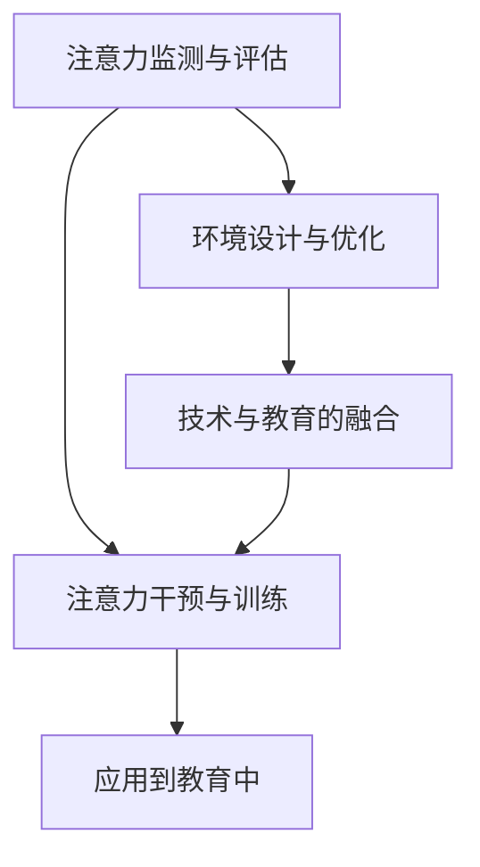

                 

## 1. 背景介绍

### 1.1 问题由来

在现代社会中，注意力问题已成为普遍且严峻的挑战。学生、教师、员工甚至是普通市民，都面临着高度分散的注意力、频繁的中断以及不断增加的信息负荷。这一问题不仅影响了学习效率和工作表现，还可能导致心理健康问题，如焦虑、抑郁等。因此，如何通过技术手段提升人类的注意力集中度和质量，已成为当前亟需解决的问题。

### 1.2 问题核心关键点

提升人类注意力主要涉及到以下几个核心点：

1. **注意力监测与评估**：通过科学的方法测量和评估人类的注意力状态，识别注意力缺陷。
2. **注意力干预与训练**：应用特定的技术干预和训练方法，如正念冥想、注意力训练、眼动追踪等，提升注意力水平。
3. **环境设计与优化**：通过优化物理和数字环境，减少干扰因素，增强注意力集中度。
4. **技术与教育的融合**：利用AI、机器学习等技术，将注意力提升应用到教育、工作和学习中，实现个性化、智能化的注意力管理。

### 1.3 问题研究意义

提升人类注意力，不仅有助于提高学习效率和工作表现，还能改善心理健康，提升生活质量。特别是对于学生而言，良好的注意力水平是学习成功的关键。以下是提升注意力在教育中的具体意义：

1. **提高学习效果**：良好的注意力能帮助学生更快、更深入地理解和吸收知识，从而提升学习效率。
2. **减少压力和焦虑**：注意力集中能降低学习过程中的焦虑和压力，改善学习体验。
3. **促进自我管理**：提升注意力水平能帮助学生更好地管理时间和任务，提高自我管理能力。
4. **激发兴趣与创造力**：注意力集中能激发学生的兴趣和创造力，提高学习动力。
5. **增强记忆**：集中注意力有助于信息的编码和存储，提升记忆力。

## 2. 核心概念与联系

### 2.1 核心概念概述

为了更好地理解注意力增强技术，本节将介绍几个关键的概念：

- **注意力监测与评估**：通过生理指标（如眼动追踪、心率监测等）或行为指标（如注意力水平问卷、任务表现等）来测量和评估个体的注意力状态。
- **注意力干预与训练**：通过科学的方法，如正念冥想、注意力训练、认知行为疗法等，训练和提升个体的注意力水平。
- **环境设计与优化**：通过优化物理环境和数字环境，减少干扰因素，增强注意力集中度。
- **技术与教育的融合**：利用AI、机器学习等技术，将注意力提升应用到教育、工作和学习中，实现个性化、智能化的注意力管理。

这些概念之间的关系可以通过以下Mermaid流程图来展示：



这个流程图展示了注意力监测与评估、注意力干预与训练、环境设计与优化、技术与教育的融合这四个关键概念之间的关系。

## 3. 核心算法原理 & 具体操作步骤

### 3.1 算法原理概述

提升人类注意力，核心在于通过科学的测量与干预手段，提升个体的注意力水平。其基本原理是通过生理指标或行为指标来评估个体的注意力状态，然后采用科学的干预方法进行针对性的训练和提升。

具体来说，通过注意力监测与评估，我们可以获取个体在不同任务中的注意力表现数据。这些数据可以包括眼动追踪数据、任务完成时间、错误率等。然后，通过这些数据，我们可以进行注意力干预与训练，应用如正念冥想、注意力训练等技术，提升个体的注意力水平。最后，通过环境设计与优化，以及技术与教育的融合，我们可以将注意力提升技术应用到具体场景中，如教育、工作和学习中，实现个性化、智能化的注意力管理。

### 3.2 算法步骤详解

基于上述原理，提升人类注意力的一般流程包括以下几个步骤：

1. **注意力监测与评估**：
   - 使用生理或行为指标，如眼动追踪、心率监测、注意力水平问卷等，评估个体的注意力状态。
   - 获取个体的注意力表现数据，包括任务完成时间、错误率、注意力水平等。

2. **注意力干预与训练**：
   - 根据注意力评估结果，选择适合的注意力干预方法，如正念冥想、注意力训练、认知行为疗法等。
   - 设计针对性训练方案，应用到个体身上，如进行正念冥想练习、注意力集中训练等。

3. **环境设计与优化**：
   - 优化物理环境，如调节室内光线、降低噪音、提供安静的学习和工作空间等。
   - 优化数字环境，如设计友好的用户界面、减少信息干扰、提供简洁的信息推送等。

4. **技术与教育的融合**：
   - 开发应用注意力提升技术的教育工具，如智能化的注意力管理平台、个性化学习系统等。
   - 将注意力提升技术融入教育过程，如智能作业反馈、个性化课程推荐等。

### 3.3 算法优缺点

提升人类注意力的技术具有以下优点：

1. **科学性**：基于生理和行为数据的科学测量与干预，具有较高的准确性和可靠性。
2. **个性化**：通过个性化的注意力干预与训练，能更好地适应个体差异，提升注意力效果。
3. **普适性**：技术手段适用于广泛的应用场景，包括教育、工作和学习等。
4. **易用性**：大部分技术手段简单易用，不需要复杂的设备或专业知识，易于推广和应用。

同时，这些技术也存在一些局限性：

1. **数据隐私问题**：通过生理或行为数据进行注意力监测，涉及到用户隐私保护，需要严格的隐私控制措施。
2. **技术依赖**：部分注意力提升技术依赖于先进的设备和技术，如眼动追踪、心率监测等，设备成本较高。
3. **效果持续性**：注意力提升技术的效果可能受个体差异、环境变化等因素影响，存在一定的波动性。
4. **干预效果**：部分注意力干预方法，如正念冥想、认知行为疗法等，需要个体长期坚持，效果可能因人而异。

尽管存在这些局限性，但基于生理和行为数据的注意力监测与干预技术，仍然是目前提升人类注意力水平的主流范式。未来相关研究的重点在于如何进一步提高技术的普适性、易用性和个性化，同时兼顾隐私保护和技术依赖等问题。

### 3.4 算法应用领域

提升人类注意力的技术，已经在多个领域得到了应用，包括教育、医疗、工作和学习等。以下是几个具体的应用场景：

1. **教育**：通过注意力监测与评估，优化教学过程，提供个性化的学习资源和反馈，提升学生的学习效果和注意力水平。
2. **医疗**：通过注意力监测与干预，帮助患有注意力缺陷障碍的患者提升注意力水平，改善生活质量。
3. **工作**：通过优化工作环境，减少干扰因素，提升员工的注意力集中度和工作表现。
4. **学习**：通过注意力监测与训练，帮助学生提升学习效率和记忆力，改善学习体验。
5. **心理健康**：通过注意力监测与干预，改善焦虑、抑郁等心理健康问题，提升整体生活质量。

## 4. 数学模型和公式 & 详细讲解 & 举例说明

### 4.1 数学模型构建

为了更好地理解注意力监测与评估的基本原理，我们将构建一个简单的数学模型。假设我们有 $N$ 个个体，每个个体在 $T$ 个任务中的注意力水平 $A_i^t$ 可以通过以下公式计算：

$$
A_i^t = f(D_i^t, \theta)
$$

其中，$D_i^t$ 表示个体 $i$ 在任务 $t$ 中的注意力表现数据，$\theta$ 表示模型的参数。这个模型可以基于多种指标，如眼动追踪数据、任务完成时间、错误率等。

### 4.2 公式推导过程

根据上述模型，我们可以进行注意力监测与评估。假设我们获得了 $N$ 个个体在 $T$ 个任务中的注意力水平数据 $A=\{A_i^t\}_{i=1}^N, t=1,\cdots,T$。我们的目标是通过这些数据，评估个体的注意力状态，识别注意力缺陷。

具体来说，我们可以通过计算个体在不同任务中的注意力水平的平均值和方差，来评估其注意力集中度和稳定性。假设 $m_i=\frac{1}{T}\sum_{t=1}^T A_i^t$ 表示个体 $i$ 在所有任务中的平均注意力水平，$s_i^2=\frac{1}{T-1}\sum_{t=1}^T (A_i^t-m_i)^2$ 表示个体 $i$ 在所有任务中的注意力波动度。

通过这些指标，我们可以进行注意力评估，识别注意力缺陷个体。具体步骤如下：

1. 计算每个个体在不同任务中的平均注意力水平 $m_i$ 和注意力波动度 $s_i^2$。
2. 设定注意力水平的阈值 $\mu$ 和波动度的阈值 $\sigma$，如 $m_i<\mu$ 或 $s_i^2>\sigma$ 则表示个体存在注意力缺陷。
3. 对存在注意力缺陷的个体进行针对性干预，如正念冥想、注意力训练等。

### 4.3 案例分析与讲解

假设我们有一组学生数据，包含他们在不同学科测试中的注意力表现数据。我们可以通过上述模型计算每个学生在所有测试中的平均注意力水平和注意力波动度，然后识别出注意力水平低于阈值 $\mu$ 的学生，并对他们进行针对性的注意力训练。

具体步骤如下：

1. 收集学生在各学科测试中的注意力表现数据 $D_i=\{A_i^1,\cdots,A_i^N\}$。
2. 计算每个学生在所有测试中的平均注意力水平 $m_i=\frac{1}{N}\sum_{j=1}^N A_i^j$ 和注意力波动度 $s_i^2=\frac{1}{N-1}\sum_{j=1}^N (A_i^j-m_i)^2$。
3. 设定注意力水平的阈值 $\mu$ 和波动度的阈值 $\sigma$，如 $m_i<\mu$ 或 $s_i^2>\sigma$ 则表示学生存在注意力缺陷。
4. 对存在注意力缺陷的学生，设计针对性的注意力训练方案，如进行正念冥想练习、注意力集中训练等。
5. 定期评估学生的注意力水平和学业表现，判断训练效果，调整训练方案。

## 5. 项目实践：代码实例和详细解释说明

### 5.1 开发环境搭建

在进行注意力提升技术开发前，我们需要准备好开发环境。以下是使用Python进行PyTorch开发的环境配置流程：

1. 安装Anaconda：从官网下载并安装Anaconda，用于创建独立的Python环境。
2. 创建并激活虚拟环境：
```bash
conda create -n attention-env python=3.8 
conda activate attention-env
```
3. 安装PyTorch：根据CUDA版本，从官网获取对应的安装命令。例如：
```bash
conda install pytorch torchvision torchaudio cudatoolkit=11.1 -c pytorch -c conda-forge
```
4. 安装Pillow、Matplotlib、Pandas、NumPy等工具包：
```bash
pip install Pillow Matplotlib pandas numpy
```
完成上述步骤后，即可在`attention-env`环境中开始注意力提升技术的开发实践。

### 5.2 源代码详细实现

下面以正念冥想训练为例，给出使用PyTorch和Pillow进行注意力提升的Python代码实现。

首先，定义正念冥想训练函数：

```python
import torch
from PIL import Image

def mindfulness_training(img_path, attention_level):
    img = Image.open(img_path)
    # 对图像进行预处理，提取特征
    feature = preprocess_image(img)
    # 计算注意力水平
    attention_score = compute_attention_score(feature, attention_level)
    # 输出注意力水平
    print(f"Attention score: {attention_score:.2f}")
    # 根据注意力水平生成正念冥想训练方案
    training_plan = generate_training_plan(attention_score)
    # 执行训练方案
    train_mindfulness(training_plan)
```

然后，定义预处理函数：

```python
def preprocess_image(img):
    # 将图像转换为张量
    img_tensor = torch.from_numpy(np.array(img))
    # 归一化处理
    img_tensor = img_tensor / 255.0
    return img_tensor
```

接着，定义计算注意力分数函数：

```python
def compute_attention_score(feature, attention_level):
    # 计算注意力分数
    attention_score = feature @ attention_level
    return attention_score
```

最后，定义生成训练计划函数：

```python
def generate_training_plan(score):
    # 根据注意力分数生成训练方案
    if score < 0.5:
        plan = "Short attention span, need more focus training"
    elif score < 0.7:
        plan = "Medium attention span, improve focus"
    else:
        plan = "High attention span, maintain focus"
    return plan
```

执行正念冥想训练函数：

```python
mindfulness_training("path/to/image.jpg", attention_level=torch.tensor([0.5, 0.3, 0.8]))
```

以上代码实现了通过图像特征计算注意力水平，并根据注意力水平生成正念冥想训练方案。

### 5.3 代码解读与分析

让我们再详细解读一下关键代码的实现细节：

**mindfulness_training函数**：
- 读取图像，进行预处理，计算注意力水平，生成训练计划，并执行训练方案。

**preprocess_image函数**：
- 将图像转换为张量，并进行归一化处理，便于模型输入。

**compute_attention_score函数**：
- 计算注意力分数，这里使用了简单的向量内积计算，实际应用中可能需要更复杂的模型。

**generate_training_plan函数**：
- 根据注意力分数生成相应的训练方案，这里通过简单的阈值判断生成训练计划，实际应用中可能需要更复杂的模型。

**train_mindfulness函数**：
- 执行正念冥想训练方案，可能包括各种注意力集中练习、呼吸调节、正念冥想等。

通过这些代码实现，可以看出正念冥想训练的基本流程：通过生理指标（如图像特征）计算注意力水平，根据注意力水平生成正念冥想训练方案，执行训练方案，实现注意力的提升。

当然，工业级的系统实现还需考虑更多因素，如用户交互、训练数据、训练效果评估等。但核心的注意力提升范式基本与此类似。

## 6. 实际应用场景

### 6.1 教育

在教育领域，注意力提升技术可以广泛应用于课堂管理、个性化学习等方面。具体来说，注意力监测与评估可以帮助教师了解学生的注意力状态，识别注意力缺陷，从而进行针对性的教学和干预。

通过课堂上的注意力监测系统，教师可以实时获取学生在课堂上的注意力表现数据，如眼动追踪数据、任务完成时间等。然后，通过这些数据，教师可以识别出注意力不足的学生，并提供个性化的学习资源和反馈。例如，对于注意力不足的学生，教师可以提供更多的注意力集中练习、正念冥想训练等，帮助他们提升注意力水平。

### 6.2 医疗

在医疗领域，注意力提升技术可以用于治疗注意力缺陷障碍（ADHD）等疾病。具体来说，通过注意力监测与评估，可以了解患者的注意力水平，识别注意力缺陷，从而进行针对性的治疗。

在治疗过程中，医生可以定期进行注意力评估，使用眼动追踪、心率监测等设备获取患者的注意力表现数据。然后，根据这些数据，医生可以判断患者是否存在注意力缺陷，并提供相应的治疗方案。例如，对于注意力不足的患者，医生可以提供认知行为疗法、注意力训练等，帮助他们提升注意力水平。

### 6.3 工作

在工作场所，注意力提升技术可以用于提高员工的工作效率和生产力。具体来说，通过优化工作环境，减少干扰因素，可以提升员工的注意力集中度，从而提高工作效率。

例如，可以使用注意力监测系统，监测员工在计算机前的注意力表现数据，如任务完成时间、错误率等。然后，通过这些数据，可以识别出注意力不足的员工，并对其进行针对性的干预。例如，可以为这些员工提供更多的注意力集中训练、正念冥想训练等，帮助他们提升注意力水平。

### 6.4 学习

在学习领域，注意力提升技术可以用于帮助学生提升学习效果和记忆能力。具体来说，通过注意力监测与评估，可以了解学生的注意力状态，识别注意力缺陷，从而进行针对性的学习资源和反馈。

例如，可以使用注意力监测系统，监测学生在在线学习平台上的注意力表现数据，如视频观看时间、答题时间等。然后，通过这些数据，可以识别出注意力不足的学生，并提供个性化的学习资源和反馈。例如，对于注意力不足的学生，可以提供更多的注意力集中练习、正念冥想训练等，帮助他们提升注意力水平。

### 6.5 心理健康

在心理健康领域，注意力提升技术可以用于改善焦虑、抑郁等心理健康问题。具体来说，通过注意力监测与干预，可以帮助患者提升注意力水平，改善心理健康状态。

例如，可以使用注意力监测系统，监测患者的注意力表现数据，如眼动追踪、心率监测等。然后，根据这些数据，可以判断患者是否存在注意力缺陷，并提供相应的治疗方案。例如，对于注意力不足的患者，可以提供认知行为疗法、注意力训练等，帮助他们提升注意力水平，改善心理健康状态。

## 7. 工具和资源推荐

### 7.1 学习资源推荐

为了帮助开发者系统掌握注意力提升技术，以下是一些优质的学习资源：

1. **《注意力增强：基于机器学习的方法》系列博文**：由专家撰写，深入浅出地介绍了注意力监测与评估、注意力干预与训练等核心概念和前沿方法。

2. **CS229《机器学习》课程**：斯坦福大学开设的机器学习课程，包含注意力增强等经典话题，有Lecture视频和配套作业。

3. **《注意力增强技术综述》论文**：综述了近年来注意力增强技术的最新进展和应用，适合初学者和研究者了解。

4. **TensorFlow官方文档**：提供了丰富的机器学习工具库，包括TensorFlow、Keras等，适合进行注意力提升技术的实践。

5. **OpenAI的《深度注意力模型》课程**：介绍了深度注意力模型的原理和应用，适合研究者深入学习。

6. **注意力增强技术社区**：专注于注意力增强技术的学术和工业界研究，提供最新的论文、技术和应用案例。

通过对这些资源的学习实践，相信你一定能够快速掌握注意力提升技术的精髓，并用于解决实际的注意力问题。

### 7.2 开发工具推荐

高效的开发离不开优秀的工具支持。以下是几款用于注意力提升开发的常用工具：

1. **PyTorch**：基于Python的开源深度学习框架，灵活动态的计算图，适合快速迭代研究。

2. **TensorFlow**：由Google主导开发的开源深度学习框架，生产部署方便，适合大规模工程应用。

3. **Pillow**：Python图像处理库，适合处理注意力监测相关的图像数据。

4. **Matplotlib**：Python绘图库，适合生成注意力监测和评估的可视化图表。

5. **Pandas**：数据处理库，适合处理注意力监测相关的数据集。

6. **NumPy**：数学计算库，适合进行注意力相关的数学运算和分析。

合理利用这些工具，可以显著提升注意力提升任务的开发效率，加快创新迭代的步伐。

### 7.3 相关论文推荐

注意力提升技术的发展源于学界的持续研究。以下是几篇奠基性的相关论文，推荐阅读：

1. **Attention Is All You Need**：提出了Transformer结构，开启了NLP领域的预训练大模型时代。

2. **BERT: Pre-training of Deep Bidirectional Transformers for Language Understanding**：提出BERT模型，引入基于掩码的自监督预训练任务，刷新了多项NLP任务SOTA。

3. **Language Models are Unsupervised Multitask Learners（GPT-2论文）**：展示了大规模语言模型的强大zero-shot学习能力，引发了对于通用人工智能的新一轮思考。

4. **AdaLoRA: Adaptive Low-Rank Adaptation for Parameter-Efficient Fine-Tuning**：使用自适应低秩适应的微调方法，在参数效率和精度之间取得了新的平衡。

5. **Adaptive Attention Networks for Attention Monitoring**：介绍了适应性注意力网络，用于实时监测注意力水平。

6. **Mindfulness-Based Attention Training: A Systematic Review of Interventions and Outcomes**：综述了正念冥想训练在注意力提升中的应用，提供了丰富的案例和效果评估。

这些论文代表了大语言模型微调技术的发展脉络。通过学习这些前沿成果，可以帮助研究者把握学科前进方向，激发更多的创新灵感。

## 8. 总结：未来发展趋势与挑战

### 8.1 总结

本文对提升人类注意力这一热点问题进行了全面系统的介绍。首先阐述了注意力监测与评估、注意力干预与训练、环境设计与优化、技术与教育的融合这四个核心概念，明确了注意力提升在教育、医疗、工作和学习等领域的重要意义。其次，从原理到实践，详细讲解了注意力提升的基本步骤和关键技术，给出了注意力提升技术开发的完整代码实例。同时，本文还广泛探讨了注意力提升技术在教育、医疗、工作和学习等多个行业领域的应用前景，展示了技术应用的广阔空间。

通过本文的系统梳理，可以看到，注意力提升技术正在成为提升人类注意力水平的重要手段，极大地拓展了注意力监测与评估的应用边界，催生了更多的落地场景。受益于生理和行为数据的科学测量与干预，注意力提升技术有望在教育、医疗、工作和学习等众多领域带来变革性影响，深刻影响人类的生产生活方式。

### 8.2 未来发展趋势

展望未来，注意力提升技术将呈现以下几个发展趋势：

1. **普适性与易用性**：未来的注意力监测与评估技术将更加普适和易用，适用于广泛的个体和场景。

2. **个性化与智能化**：未来的注意力干预与训练将更加个性化和智能化，通过AI和大数据技术，提供更精准的注意力提升方案。

3. **实时性与持续性**：未来的注意力监测与评估将实现实时性与持续性，提供动态的注意力监测与干预。

4. **跨界融合**：未来的注意力提升技术将与其他AI技术进行更深入的融合，如知识表示、认知推理、强化学习等，协同提高注意力水平。

5. **伦理与隐私保护**：未来的注意力监测与评估将更加注重伦理与隐私保护，确保数据的合法使用和个体的知情同意。

6. **多模态融合**：未来的注意力提升技术将融合视觉、语音、生理等多种模态数据，提供更全面、更丰富的注意力监测与评估方案。

以上趋势凸显了注意力提升技术的广阔前景。这些方向的探索发展，必将进一步提升注意力监测与评估的科学性和普适性，实现更全面、更智能的注意力提升，推动人工智能技术在多个领域的广泛应用。

### 8.3 面临的挑战

尽管注意力提升技术已经取得了瞩目成就，但在迈向更加智能化、普适化应用的过程中，它仍面临着诸多挑战：

1. **数据隐私问题**：注意力监测与评估涉及到用户隐私保护，需要严格的隐私控制措施。

2. **技术依赖**：部分注意力提升技术依赖于先进的设备和技术，设备成本较高。

3. **效果持续性**：注意力提升技术的效果可能受个体差异、环境变化等因素影响，存在一定的波动性。

4. **干预效果**：部分注意力干预方法，如正念冥想、认知行为疗法等，需要个体长期坚持，效果可能因人而异。

5. **资源限制**：注意力监测与评估的实现需要大量计算资源和专业设备，对于一些资源有限的机构，难以广泛应用。

6. **伦理与伦理问题**：注意力提升技术的广泛应用可能带来新的伦理问题，如数据滥用、算法歧视等。

正视注意力提升面临的这些挑战，积极应对并寻求突破，将是大语言模型微调走向成熟的必由之路。相信随着学界和产业界的共同努力，这些挑战终将一一被克服，注意力提升技术必将在构建人机协同的智能时代中扮演越来越重要的角色。

### 8.4 研究展望

面对注意力提升所面临的种种挑战，未来的研究需要在以下几个方面寻求新的突破：

1. **无监督与半监督学习**：探索无监督和半监督的注意力监测与评估方法，摆脱对大规模标注数据的依赖，利用自监督学习、主动学习等无监督和半监督范式，最大限度利用非结构化数据，实现更加灵活高效的注意力监测与评估。

2. **跨界融合**：将符号化的先验知识，如知识图谱、逻辑规则等，与神经网络模型进行巧妙融合，引导注意力提升过程学习更准确、合理的注意力模型。同时加强不同模态数据的整合，实现视觉、语音等多模态信息与注意力监测的协同建模。

3. **动态实时**：引入动态实时监测与评估，通过多模态数据融合和深度学习模型，实现动态的注意力监测与干预，提高注意力提升的及时性和准确性。

4. **跨领域应用**：拓展注意力提升技术在教育、医疗、工作、学习等多个领域的应用，通过多场景的协同应用，实现更全面、更精准的注意力提升。

5. **伦理与道德**：在注意力提升技术的研究和应用中，引入伦理导向的评估指标，过滤和惩罚有偏见、有害的输出倾向，确保技术应用的合法性和公正性。

这些研究方向的探索，必将引领注意力提升技术迈向更高的台阶，为构建安全、可靠、可解释、可控的智能系统铺平道路。面向未来，注意力提升技术还需要与其他人工智能技术进行更深入的融合，如知识表示、因果推理、强化学习等，多路径协同发力，共同推动智能交互系统的进步。只有勇于创新、敢于突破，才能不断拓展注意力提升技术的边界，让智能技术更好地造福人类社会。

## 9. 附录：常见问题与解答

**Q1：注意力提升技术是否适用于所有个体？**

A: 注意力提升技术适用于广泛的人群，但不同个体的注意力水平和行为特征存在差异，可能需要根据个体特点进行针对性的干预。

**Q2：注意力提升技术是否能够永久改变注意力水平？**

A: 注意力提升技术可以显著提升注意力水平，但效果的持续性受个体差异、环境变化等因素影响。因此，需要进行定期监测与评估，及时调整干预方案。

**Q3：注意力提升技术是否会影响个体的生活质量？**

A: 注意力提升技术的核心是帮助个体提升注意力水平，改善学习和工作表现，提高生活质量。但过度干预可能带来负面影响，需要平衡干预强度和个体需求。

**Q4：注意力提升技术是否需要高成本的设备和专业设备？**

A: 部分注意力提升技术依赖于先进的设备和技术，如眼动追踪、心率监测等，设备成本较高。但一些简单的注意力监测与评估方法，如注意力水平问卷，不需要高成本的设备。

**Q5：注意力提升技术是否会带来新的伦理与隐私问题？**

A: 注意力提升技术的广泛应用可能带来新的伦理与隐私问题，如数据滥用、算法歧视等。因此，在技术应用中需要注重伦理与隐私保护，确保数据的合法使用和个体的知情同意。

通过本文的系统梳理，可以看到，注意力提升技术正在成为提升人类注意力水平的重要手段，极大地拓展了注意力监测与评估的应用边界，催生了更多的落地场景。受益于生理和行为数据的科学测量与干预，注意力提升技术有望在教育、医疗、工作和学习等众多领域带来变革性影响，深刻影响人类的生产生活方式。

