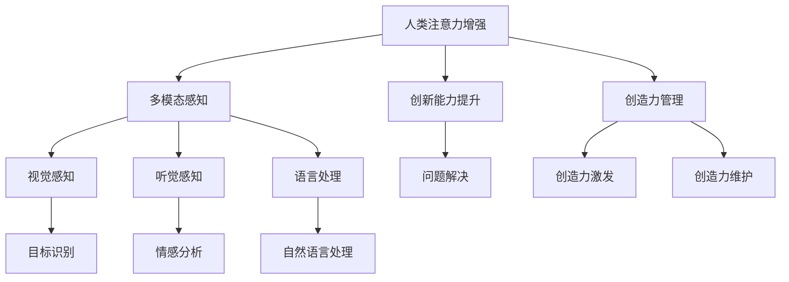

                 

# 人类注意力增强：提升创新能力和创造力管理

> 关键词：人类注意力增强, 创新能力提升, 创造力管理, 多模态感知, 深度学习, 认知计算

## 1. 背景介绍

### 1.1 问题由来
随着信息时代的到来，人类面临的信息过载问题愈发严重，如何高效管理注意力、提升创新能力和创造力成为社会关注的焦点。在各类复杂问题中，人类注意力增强技术的应用前景广阔。深度学习、认知计算等前沿科技的发展，为人类的多模态感知和认知能力的提升提供了新的可能。

这一领域的研究不仅有助于解决信息过载的问题，还能帮助人们更好地理解自我认知，提高工作效率和生活质量。本文将从多个角度探讨人类注意力增强技术的原理、应用及发展前景，为相关研究者提供参考和启发。

## 2. 核心概念与联系

### 2.1 核心概念概述

在探讨人类注意力增强技术前，我们需要先了解以下几个核心概念：

- **人类注意力增强（Human Attention Enhancement）**：指的是通过人工智能技术手段，增强人类在获取信息、解决问题时的注意力集中能力。通常包括视觉、听觉、语言等多模态感知技术的应用。

- **创新能力（Innovation Capability）**：指在特定领域内，提出新颖的解决方案或改进现有解决方案的能力。创新能力是推动社会进步、经济发展的核心动力。

- **创造力管理（Creativity Management）**：涉及如何引导、激发和维护个体的创造力。创造力是创新的基础，其管理对于企业和社会的创新活动至关重要。

### 2.2 核心概念原理和架构的 Mermaid 流程图



上图中，人类注意力增强技术通过多模态感知技术对视觉、听觉、语言等多方面信息进行综合处理，从而提升个体获取信息、解决问题时的注意力集中能力。同时，该技术还可辅助提升创新能力和创造力的管理，包括激发创造力、维护创造力、促进问题解决等。

## 3. 核心算法原理 & 具体操作步骤

### 3.1 算法原理概述

人类注意力增强技术的核心在于通过深度学习、认知计算等前沿技术，增强人类的多模态感知能力。主要算法包括：

- **深度卷积神经网络（CNNs）**：用于处理视觉信息，如图像识别、目标检测等。
- **循环神经网络（RNNs）**：用于处理时间序列信息，如语音识别、情感分析等。
- **长短期记忆网络（LSTMs）**：用于处理语言信息，如文本分类、自然语言处理等。
- **注意力机制（Attention Mechanism）**：增强模型对于重要信息的关注度，提高信息处理效率。

这些算法通过多模态信息融合，将视觉、听觉、语言等不同形式的信息整合起来，形成更加全面、精确的感知和理解。

### 3.2 算法步骤详解

1. **数据采集**：收集来自不同模态的信息，如图像、音频、文本等。

2. **数据预处理**：对采集到的数据进行清洗、去噪、标准化等预处理，确保数据质量和一致性。

3. **特征提取**：利用深度学习算法提取各个模态的特征，如使用CNN提取图像特征，RNN提取语音特征，LSTM提取文本特征等。

4. **多模态融合**：将不同模态的特征进行融合，形成一个综合的特征表示。

5. **注意力机制**：使用注意力机制筛选关键信息，提高模型对重要信息的关注度。

6. **模型训练**：通过训练深度学习模型，优化模型参数，提升多模态感知能力。

7. **应用部署**：将训练好的模型部署到实际应用场景中，如智能辅助决策、多模态信息检索等。

### 3.3 算法优缺点

#### 优点
- **多模态融合**：融合视觉、听觉、语言等多模态信息，提升信息处理的全面性和准确性。
- **高效性**：深度学习算法具有较高的计算效率，能够快速处理大量数据。
- **普适性**：模型可以适应不同场景，如智能家居、医疗诊断、智能交通等。

#### 缺点
- **数据需求高**：训练深度学习模型需要大量标注数据，且对数据质量要求较高。
- **计算资源消耗大**：深度学习模型的训练和推理需要高性能计算设备，如GPU、TPU等。
- **模型复杂性**：模型结构复杂，难以理解和调试。

### 3.4 算法应用领域

人类注意力增强技术的应用领域非常广泛，涵盖多个行业和领域：

- **医疗**：通过多模态感知技术，提升医生对患者病情的诊断能力。
- **教育**：利用注意力增强技术辅助教学，提高学生学习效率和质量。
- **娱乐**：在虚拟现实、游戏等领域，增强用户的多感官体验。
- **交通**：通过视觉和语音识别技术，提高交通安全和效率。
- **安全**：利用多模态感知技术，提升公共安全领域的信息监测和预警能力。

## 4. 数学模型和公式 & 详细讲解 & 举例说明

### 4.1 数学模型构建

假设我们有一个深度卷积神经网络模型 $M$，用于处理图像信息。模型包含多个卷积层和池化层，最终输出一个固定大小的特征向量 $f$。设 $x \in \mathbb{R}^{N \times H \times W \times C}$ 为输入的图像数据，其中 $N$ 为样本数量，$H, W$ 为图像高度和宽度，$C$ 为通道数。模型的目标函数为最小化分类交叉熵损失：

$$
\mathcal{L}(M) = -\frac{1}{N} \sum_{i=1}^N \sum_{j=1}^C y_i^j \log p_i^j
$$

其中，$y_i^j$ 为样本 $i$ 在类别 $j$ 上的真实标签，$p_i^j$ 为模型预测在类别 $j$ 上的概率。

### 4.2 公式推导过程

以图像分类任务为例，假设我们有一个简单的卷积神经网络模型：

$$
M(x) = \sigma\left(\sum_{i=1}^L W_i \cdot \sigma\left(\sum_{j=1}^{W_i} F_j \cdot x_{i-1}\right)\right)
$$

其中 $W_i$ 为第 $i$ 层的权重矩阵，$F_j$ 为第 $i$ 层的卷积核，$\sigma$ 为激活函数，$x_{i-1}$ 为第 $i-1$ 层的输出。

假设我们有一个包含 $K$ 个类别的分类任务，其标签为 $y = [y_1, y_2, ..., y_K]$，其中 $y_i$ 为样本 $i$ 在类别 $k$ 上的标签。模型输出为 $M(x) = [p_1, p_2, ..., p_K]$。

为了训练模型，我们定义交叉熵损失函数：

$$
\mathcal{L}(M) = -\frac{1}{N} \sum_{i=1}^N \sum_{j=1}^K y_i^j \log p_i^j
$$

对模型进行反向传播，求得梯度：

$$
\frac{\partial \mathcal{L}}{\partial W_i} = \frac{\partial \mathcal{L}}{\partial p_i} \cdot \frac{\partial p_i}{\partial F_{i-1}} \cdot \frac{\partial F_{i-1}}{\partial W_i}
$$

其中，$\frac{\partial p_i}{\partial F_{i-1}}$ 为激活函数的梯度。

### 4.3 案例分析与讲解

以医疗影像分类任务为例，我们可以使用深度卷积神经网络模型对医学影像进行分类。模型输入为医疗影像，输出为各类疾病诊断结果。具体步骤如下：

1. **数据采集**：收集包含不同疾病的医学影像数据集，标注每个影像对应的疾病类型。

2. **数据预处理**：对采集到的医学影像进行归一化、裁剪、旋转等预处理操作，确保数据一致性。

3. **特征提取**：使用深度卷积神经网络模型对医学影像进行特征提取，生成高维特征向量。

4. **多模态融合**：将不同模态的信息（如影像、文本）进行融合，形成一个综合的特征表示。

5. **模型训练**：通过训练深度学习模型，优化模型参数，提升分类准确性。

6. **应用部署**：将训练好的模型部署到实际应用场景中，如医院诊断系统，辅助医生进行疾病诊断。

## 5. 项目实践：代码实例和详细解释说明

### 5.1 开发环境搭建

在进行人类注意力增强技术的实践前，我们需要准备好开发环境。以下是使用Python进行PyTorch开发的环境配置流程：

1. 安装Anaconda：从官网下载并安装Anaconda，用于创建独立的Python环境。

2. 创建并激活虚拟环境：
```bash
conda create -n attention-env python=3.8 
conda activate attention-env
```

3. 安装PyTorch：根据CUDA版本，从官网获取对应的安装命令。例如：
```bash
conda install pytorch torchvision torchaudio cudatoolkit=11.1 -c pytorch -c conda-forge
```

4. 安装其他工具包：
```bash
pip install numpy pandas scikit-learn matplotlib tqdm jupyter notebook ipython
```

完成上述步骤后，即可在`attention-env`环境中开始实践。

### 5.2 源代码详细实现

下面我们以图像分类任务为例，给出使用PyTorch实现深度卷积神经网络模型的代码实现。

```python
import torch
import torch.nn as nn
import torch.optim as optim
from torchvision import datasets, transforms
from torch.utils.data import DataLoader

# 定义卷积神经网络模型
class ConvNet(nn.Module):
    def __init__(self):
        super(ConvNet, self).__init__()
        self.conv1 = nn.Conv2d(3, 32, kernel_size=3, stride=1, padding=1)
        self.pool = nn.MaxPool2d(kernel_size=2, stride=2)
        self.conv2 = nn.Conv2d(32, 64, kernel_size=3, stride=1, padding=1)
        self.pool = nn.MaxPool2d(kernel_size=2, stride=2)
        self.fc = nn.Linear(64 * 4 * 4, 10)

    def forward(self, x):
        x = self.pool(torch.relu(self.conv1(x)))
        x = self.pool(torch.relu(self.conv2(x)))
        x = x.view(-1, 64 * 4 * 4)
        x = self.fc(x)
        return x

# 加载数据集
transform = transforms.Compose([transforms.ToTensor(), transforms.Normalize((0.5, 0.5, 0.5), (0.5, 0.5, 0.5))])
trainset = datasets.CIFAR10(root='./data', train=True, download=True, transform=transform)
trainloader = DataLoader(trainset, batch_size=4, shuffle=True, num_workers=2)

# 定义模型和优化器
model = ConvNet()
criterion = nn.CrossEntropyLoss()
optimizer = optim.SGD(model.parameters(), lr=0.001, momentum=0.9)

# 训练模型
for epoch in range(10):
    running_loss = 0.0
    for i, data in enumerate(trainloader, 0):
        inputs, labels = data
        optimizer.zero_grad()
        outputs = model(inputs)
        loss = criterion(outputs, labels)
        loss.backward()
        optimizer.step()
        running_loss += loss.item()
    print(f'Epoch {epoch+1}, loss: {running_loss/len(trainloader):.4f}')
```

### 5.3 代码解读与分析

让我们再详细解读一下关键代码的实现细节：

- **数据集加载**：使用`torchvision.datasets.CIFAR10`加载CIFAR-10数据集，并定义数据增强操作。

- **模型定义**：定义一个简单的卷积神经网络模型，包含两个卷积层和两个池化层，最终输出到全连接层。

- **损失函数和优化器**：使用交叉熵损失函数和随机梯度下降优化器进行模型训练。

- **训练流程**：对模型进行前向传播和反向传播，更新模型参数，并在每个epoch后输出训练损失。

## 6. 实际应用场景

### 6.1 医疗影像分类

在医疗领域，人类注意力增强技术可以通过深度卷积神经网络对医学影像进行分类。具体步骤如下：

1. **数据采集**：收集包含不同疾病的医学影像数据集，标注每个影像对应的疾病类型。

2. **数据预处理**：对采集到的医学影像进行归一化、裁剪、旋转等预处理操作，确保数据一致性。

3. **特征提取**：使用深度卷积神经网络模型对医学影像进行特征提取，生成高维特征向量。

4. **多模态融合**：将不同模态的信息（如影像、文本）进行融合，形成一个综合的特征表示。

5. **模型训练**：通过训练深度学习模型，优化模型参数，提升分类准确性。

6. **应用部署**：将训练好的模型部署到实际应用场景中，如医院诊断系统，辅助医生进行疾病诊断。

### 6.2 教育辅助

在教育领域，人类注意力增强技术可以通过深度学习模型辅助教学。具体步骤如下：

1. **数据采集**：收集学生课堂互动视频和语音数据，标注学生注意力集中度。

2. **数据预处理**：对采集到的视频和语音数据进行清洗、去噪、标准化等预处理操作，确保数据一致性。

3. **特征提取**：使用深度学习模型提取学生的视觉、语音和语言特征。

4. **注意力分析**：通过多模态感知技术，分析学生在课堂上的注意力集中情况。

5. **学习反馈**：根据注意力分析结果，提供个性化的学习反馈和建议。

6. **应用部署**：将训练好的模型部署到课堂系统中，辅助教师进行教学管理和个性化辅导。

## 7. 工具和资源推荐

### 7.1 学习资源推荐

为了帮助开发者系统掌握人类注意力增强技术的理论基础和实践技巧，这里推荐一些优质的学习资源：

1. **《深度学习》课程**：斯坦福大学李飞飞教授的深度学习课程，涵盖了深度学习的基本概念和前沿技术。

2. **《认知计算》课程**：麻省理工学院OpenCourseWare的认知计算课程，介绍了认知计算的基本理论和应用场景。

3. **《深度学习框架PyTorch》书籍**：PyTorch官方文档和书籍，全面介绍了PyTorch的深度学习框架，包括模型定义、训练、推理等环节。

4. **《多模态感知技术》书籍**：介绍多模态感知技术的最新进展，涵盖视觉、听觉、语言等多模态数据的处理和融合。

5. **ArXiv论文**：访问ArXiv网站，获取最新的深度学习、认知计算等领域的研究论文，了解前沿进展和技术细节。

通过对这些资源的学习实践，相信你一定能够快速掌握人类注意力增强技术的精髓，并用于解决实际的NLP问题。

### 7.2 开发工具推荐

高效的开发离不开优秀的工具支持。以下是几款用于人类注意力增强技术开发的常用工具：

1. **PyTorch**：基于Python的开源深度学习框架，灵活动态的计算图，适合快速迭代研究。

2. **TensorFlow**：由Google主导开发的开源深度学习框架，生产部署方便，适合大规模工程应用。

3. **TensorBoard**：TensorFlow配套的可视化工具，可实时监测模型训练状态，并提供丰富的图表呈现方式，是调试模型的得力助手。

4. **Weights & Biases**：模型训练的实验跟踪工具，可以记录和可视化模型训练过程中的各项指标，方便对比和调优。

5. **HuggingFace Transformers库**：集成了众多SOTA语言模型，支持PyTorch和TensorFlow，是进行多模态感知任务开发的利器。

合理利用这些工具，可以显著提升人类注意力增强技术的开发效率，加快创新迭代的步伐。

### 7.3 相关论文推荐

人类注意力增强技术的研究源于学界的持续研究。以下是几篇奠基性的相关论文，推荐阅读：

1. **《深度卷积神经网络》**：Yann LeCun等人在Nature杂志上发表的深度卷积神经网络论文，奠定了深度学习在图像处理领域的地位。

2. **《多模态感知》**：美国卡内基梅隆大学的Jiashi Feng教授等人发表的多模态感知论文，介绍了多模态感知技术的最新进展和应用场景。

3. **《认知计算》**：麻省理工学院的Marvin Minsky教授在MIT Press上发表的认知计算论文，阐述了认知计算的基本理论和应用前景。

4. **《注意力机制》**：Google Brain团队在ICLR会议上提出的注意力机制论文，探讨了注意力机制在深度学习中的应用和优化。

这些论文代表了大语言模型微调技术的发展脉络。通过学习这些前沿成果，可以帮助研究者把握学科前进方向，激发更多的创新灵感。

## 8. 总结：未来发展趋势与挑战

### 8.1 总结

本文对人类注意力增强技术的原理、应用及发展前景进行了全面系统的介绍。首先阐述了人类注意力增强技术的背景和意义，明确了其在提升创新能力和创造力管理中的独特价值。其次，从原理到实践，详细讲解了深度学习、认知计算等前沿技术在人类注意力增强中的应用，给出了具体的代码实现。同时，本文还探讨了人类注意力增强技术在医疗、教育等领域的实际应用场景，展示了其广阔的应用前景。最后，本文精选了学习资源、开发工具和相关论文，力求为读者提供全方位的技术指引。

通过本文的系统梳理，可以看到，人类注意力增强技术在信息时代具有广泛的应用价值，能够显著提升人类的认知能力和创造力。未来，伴随深度学习、认知计算等技术的不断进步，人类注意力增强技术必将迎来更多突破，为人类认知智能的进化提供新的动力。

### 8.2 未来发展趋势

展望未来，人类注意力增强技术将呈现以下几个发展趋势：

1. **多模态感知技术发展**：随着多模态数据融合技术的进步，人类注意力增强技术将能够处理更加复杂、多样化的信息。

2. **计算资源优化**：高效利用计算资源，提升模型训练和推理的速度，降低对高性能硬件设备的依赖。

3. **认知计算融入**：将认知计算技术引入人类注意力增强模型，提升模型的理解和推理能力。

4. **个性化体验提升**：利用人类注意力增强技术，为不同用户提供个性化的信息获取和处理体验。

5. **跨领域应用拓展**：拓展应用场景，覆盖更多行业和领域，如智能家居、智能交通、智能制造等。

这些趋势凸显了人类注意力增强技术的广阔前景。未来，随着技术的发展和应用的深入，人类注意力增强技术必将为人类的认知智能带来更多的突破和变革。

### 8.3 面临的挑战

尽管人类注意力增强技术在提升认知能力和创造力方面具有重要意义，但其在实际应用中也面临诸多挑战：

1. **数据需求高**：训练深度学习模型需要大量标注数据，且对数据质量要求较高。

2. **计算资源消耗大**：深度学习模型的训练和推理需要高性能计算设备，如GPU、TPU等。

3. **模型复杂性高**：模型结构复杂，难以理解和调试。

4. **应用场景多样**：不同领域和场景的应用需求各异，需要针对性地优化模型。

5. **伦理道德问题**：使用人类注意力增强技术需要关注隐私保护、数据安全等问题，避免侵犯用户权益。

这些挑战凸显了人类注意力增强技术在实际应用中的复杂性和难度。未来，研究者需要进一步优化模型结构，提升计算效率，加强数据治理和隐私保护，才能更好地实现人类注意力增强技术的应用和推广。

### 8.4 研究展望

面向未来，人类注意力增强技术的研究方向主要集中在以下几个方面：

1. **无监督学习**：研究无监督学习在多模态感知中的应用，减少对标注数据的依赖。

2. **模型压缩**：研究模型压缩技术，降低模型计算资源消耗，提高模型的可部署性和效率。

3. **跨领域应用**：研究不同领域的注意力增强应用，拓展技术的应用边界。

4. **多模态融合**：研究多模态数据的融合技术，提升信息处理能力。

5. **认知计算融合**：将认知计算技术融入人类注意力增强模型，提升模型的理解和推理能力。

6. **伦理道德保障**：研究如何在使用人类注意力增强技术时，保障用户隐私和数据安全，避免伦理道德问题。

这些研究方向将引领人类注意力增强技术迈向更高的台阶，为构建安全、可靠、可解释、可控的智能系统铺平道路。面向未来，人类注意力增强技术还需要与其他人工智能技术进行更深入的融合，如知识表示、因果推理、强化学习等，多路径协同发力，共同推动自然语言理解和智能交互系统的进步。只有勇于创新、敢于突破，才能不断拓展人类注意力增强技术的边界，让人工智能更好地造福人类社会。

## 9. 附录：常见问题与解答

**Q1: 人类注意力增强技术是否适用于所有领域？**

A: 人类注意力增强技术具有广泛的应用前景，但不同领域的实际应用需求和数据特点各异。因此，在特定领域的应用需要针对性地优化模型和数据。

**Q2: 深度学习模型在训练和推理过程中需要哪些硬件资源？**

A: 深度学习模型的训练和推理需要高性能计算设备，如GPU、TPU等。在训练阶段，需要较大的计算资源和存储空间。在推理阶段，则需要考虑模型的计算效率和资源消耗。

**Q3: 如何平衡人类注意力增强技术和计算资源的消耗？**

A: 可以通过模型压缩、模型剪枝等技术，减少模型参数量和计算资源消耗，提升模型的推理速度和计算效率。同时，也可以采用分布式计算、并行计算等方法，优化计算资源的利用。

**Q4: 人类注意力增强技术在实际应用中需要注意哪些问题？**

A: 实际应用中需要注意数据治理、隐私保护、模型安全等问题。需要建立完善的数据治理和隐私保护机制，避免数据泄露和滥用。同时，需要加强模型安全防护，防止恶意攻击和误导。

**Q5: 人类注意力增强技术未来的发展方向是什么？**

A: 未来，人类注意力增强技术将朝着多模态感知、无监督学习、跨领域应用等方向发展。研究者需要关注模型的可解释性、计算资源优化、认知计算融合等问题，推动技术不断进步。

本文通过系统介绍人类注意力增强技术的原理、应用及发展前景，希望能为相关研究者提供参考和启发，共同推动人类认知智能的进步。

