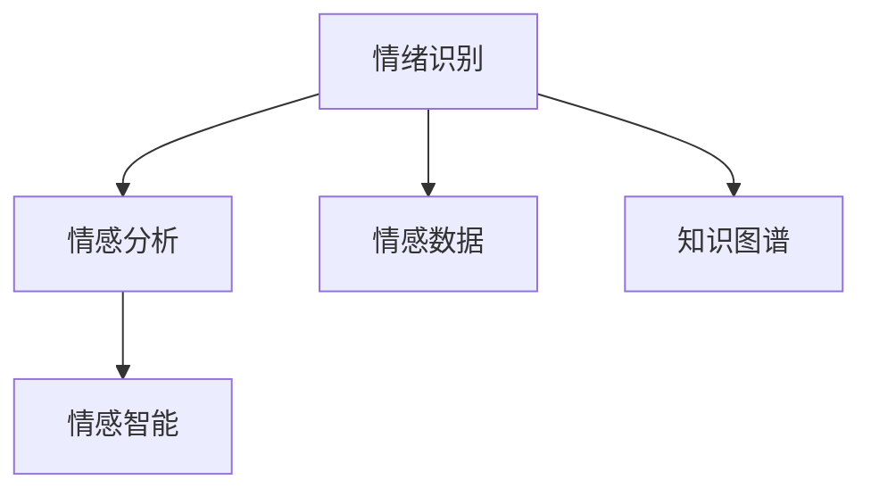

                 

# 人类的知识与情感：理解情绪的力量

> 关键词：情绪计算,情感分析,情感识别,情感数据,知识图谱,情感智能

## 1. 背景介绍

### 1.1 问题由来

人类社会始终面临着如何更好地理解、管理和利用情感的问题。随着信息技术的发展，情感计算、情感分析等技术逐渐受到广泛关注，成为人工智能、心理学、神经科学等多学科交叉的重要方向。情感计算的核心在于识别和理解人类的情感状态，从而提高人机交互的自然性和有效性，增强智能系统的理解力和适应力。

在实际应用中，情感计算被广泛应用于医疗健康、社交媒体、客户服务、市场预测、智能安防等多个领域。例如，在医疗领域，情感识别可以帮助医生诊断情感相关的疾病；在客户服务中，情感分析可以指导客服策略，提升用户体验；在市场预测中，情感数据可以洞察消费者情绪变化，指导产品设计和营销策略。

近年来，随着深度学习和大数据技术的进步，情感计算技术取得了显著进展。特别是通过深度学习模型的广泛应用，情感识别和情感分析的准确度不断提升，情感计算的落地应用变得日益成熟。本文将详细探讨基于深度学习模型的情感计算原理和应用实践，为读者提供全面、深刻的理解和思考。

## 2. 核心概念与联系

### 2.1 核心概念概述

本节将介绍几个与情感计算紧密相关的核心概念，包括情绪识别、情感分析、情感数据等，并展示它们之间的联系：

- **情绪识别（Emotion Recognition）**：指通过计算机视觉、语音识别、自然语言处理等技术，自动分析和识别人类的情感状态。情绪识别通常分为面部表情识别、语音情绪识别和文本情绪识别三类。
- **情感分析（Sentiment Analysis）**：指通过文本、图像、视频等多模态数据，分析并理解人类情感的倾向性，如正面、负面、中性等。情感分析主要应用于文本和图像情感识别，是情绪计算的基础。
- **情感数据（Emotion Data）**：指用于情感计算的各类数据，包括文本、图像、视频、语音等。情感数据的质量和多样性直接影响情感计算模型的性能。
- **知识图谱（Knowledge Graph）**：指通过语义网络技术，将知识以图形化方式组织和呈现，便于机器理解和推理。知识图谱与情感计算结合，可以增强情感理解的多维度和复杂性。
- **情感智能（Emotion Intelligence）**：指计算机系统理解、生成和表达人类情感的能力。情感智能不仅关注情感识别和情感分析，更强调情感理解和情感推理，是情感计算的终极目标。

这些概念之间的联系可以通过以下Mermaid流程图来展示：



这个流程图展示了情感计算的主要组成和联系：情绪识别是情感分析的基础，情感数据为情绪识别和情感分析提供数据支撑，知识图谱增强情感理解的深度和广度，而情感智能则是情感计算的最终目标和应用体现。

## 3. 核心算法原理 & 具体操作步骤
### 3.1 算法原理概述

基于深度学习模型的情感计算，通常通过两个步骤实现：首先是情绪识别或情感分析，其次是情感推理和表达。情感推理和表达建立在深度学习模型的基础上，通过对大量标注数据进行训练，模型能够自动提取和识别人类情感的特征，进而进行情感理解、生成和表达。

深度学习模型通常采用神经网络结构，包括卷积神经网络（CNN）、循环神经网络（RNN）、长短期记忆网络（LSTM）、门控循环单元（GRU）、Transformer等。这些模型通过反向传播算法，不断优化网络参数，最小化预测误差，从而提高情感识别的准确度和鲁棒性。

### 3.2 算法步骤详解

基于深度学习模型的情感计算通常包含以下几个关键步骤：

**Step 1: 数据准备与预处理**
- 收集用于训练和测试的情感数据，确保数据的质量和多样性。
- 对数据进行清洗、标注和划分，分为训练集、验证集和测试集。
- 对文本数据进行分词、词性标注、去除停用词等预处理。
- 对图像数据进行归一化、裁剪、灰度化等预处理。

**Step 2: 特征提取与编码**
- 对预处理后的数据进行特征提取，将其转化为模型能够接受的格式。
- 对文本数据使用嵌入层（如Word2Vec、GloVe等）将单词转化为向量表示。
- 对图像数据使用卷积层（如ResNet、Inception等）提取图像特征。
- 对语音数据使用MFCC等技术提取特征。

**Step 3: 模型训练与优化**
- 选择合适的深度学习模型，如CNN、RNN、Transformer等，进行初始化。
- 使用训练集数据，通过反向传播算法更新模型参数。
- 使用验证集数据评估模型性能，防止过拟合。
- 选择合适的优化算法，如Adam、SGD等，设置合适的学习率。
- 应用正则化技术，如L2正则、Dropout等，提高模型鲁棒性。

**Step 4: 情感推理与表达**
- 使用训练好的模型，对新的数据进行情感推理，判断其情感状态。
- 使用生成模型（如GAN、VAE等）生成情感表达，如情感文本、语音、图像等。

**Step 5: 应用部署与评估**
- 将训练好的模型部署到实际应用中，如客户服务系统、智能安防系统等。
- 在实际应用中收集用户反馈，进行模型评估和优化。
- 持续收集情感数据，定期更新和微调模型，保持其性能。

### 3.3 算法优缺点

基于深度学习模型的情感计算具有以下优点：

1. **自动化处理**：深度学习模型能够自动处理大规模数据，提高情感计算的效率。
2. **高精度**：深度学习模型通过大量标注数据的训练，具有较高的情感识别准确度。
3. **多模态融合**：深度学习模型能够同时处理文本、图像、语音等多种模态数据，增强情感理解的全面性。
4. **鲁棒性强**：深度学习模型能够有效处理噪音和干扰，提高情感识别的鲁棒性。

但该方法也存在一些缺点：

1. **数据依赖性高**：情感计算的效果很大程度上依赖于标注数据的质量和数量，获取高质量标注数据的成本较高。
2. **模型复杂度高**：深度学习模型通常结构复杂，参数量巨大，需要较大的计算资源和存储空间。
3. **可解释性不足**：深度学习模型被认为是“黑盒”系统，其内部工作机制难以解释，缺乏可解释性。
4. **模型训练时间长**：深度学习模型训练过程通常耗时较长，需要较长的计算时间和资源。

尽管存在这些局限性，但基于深度学习模型的情感计算仍然是情感计算领域的主流方法，具有广泛的应用前景。未来相关研究的重点在于如何进一步降低对标注数据的依赖，提高模型的效率和可解释性，同时兼顾多模态数据的融合和情感推理的准确性。

### 3.4 算法应用领域

基于深度学习模型的情感计算在多个领域得到了广泛应用，例如：

- **医疗健康**：情感识别可以帮助医生诊断情感相关的疾病，如抑郁症、焦虑症等。
- **客户服务**：情感分析可以指导客服策略，提升用户体验，如自动回复、情感感知等。
- **市场预测**：情感数据可以洞察消费者情绪变化，指导产品设计和营销策略。
- **智能安防**：情感识别可以用于监控系统，识别异常行为和潜在威胁。
- **社交媒体**：情感分析可以自动监测和分析用户情感变化，辅助舆情管理。
- **娱乐媒体**：情感识别可以用于游戏、电影、音乐等娱乐产品，增强用户体验。

这些应用领域展示了情感计算的广泛价值，也体现了深度学习模型在情感计算中的重要地位。随着深度学习技术的发展，情感计算的应用场景将不断扩展，进一步推动人工智能技术的发展和应用。

## 4. 数学模型和公式 & 详细讲解 & 举例说明

### 4.1 数学模型构建

基于深度学习模型的情感计算，其核心数学模型通常包括卷积神经网络（CNN）、循环神经网络（RNN）、长短期记忆网络（LSTM）、门控循环单元（GRU）等。以下以CNN模型为例，介绍情感识别的数学模型构建过程。

假设输入的文本数据为 $x = (x_1, x_2, ..., x_n)$，其中 $x_i$ 表示第 $i$ 个单词的向量表示。模型的输出为情感分类标签 $y \in \{0, 1, 2, ..., K\}$，其中 $K$ 表示情感类别数。

定义卷积层 $\mathcal{C}$，计算公式如下：

$$
\mathcal{C}(x) = \left\{\begin{aligned}
& \max_{0 \leq i \leq n-h+1, j \leq k-h+1} \left[ \sum_{i,j} W_{f_i,j}x_{i,j} + b_{f_i,j} \right], \text{ if } k = h \\
& \max_{0 \leq i \leq n-h+1, j \leq k-h+1} \left[ \sum_{i,j} W_{f_i,j}x_{i,j} + b_{f_i,j} \right], \text{ else }
\end{aligned}\right.
$$

其中，$h$ 为卷积核的大小，$k$ 为特征图的大小，$W$ 和 $b$ 分别为卷积核的权重和偏置。

定义池化层 $\mathcal{P}$，计算公式如下：

$$
\mathcal{P}(x) = \max_{0 \leq i \leq n-h+1, j \leq k-h+1} \left[ \sum_{i,j} W_{f_i,j}x_{i,j} + b_{f_i,j} \right]
$$

其中，$h$ 和 $k$ 分别为池化核的大小和特征图的大小，$W$ 和 $b$ 分别为池化核的权重和偏置。

定义全连接层 $\mathcal{F}$，计算公式如下：

$$
\mathcal{F}(x) = \sigma(\sum_{i=1}^m W_i x_i + b_i)
$$

其中，$x_i$ 为第 $i$ 个特征，$W_i$ 和 $b_i$ 分别为全连接层的权重和偏置，$\sigma$ 为激活函数（如ReLU、Sigmoid等）。

定义softmax层 $\mathcal{S}$，计算公式如下：

$$
\mathcal{S}(x) = \left[ \frac{e^{x_i}}{\sum_{j=1}^K e^{x_j}} \right]_{i=1}^K
$$

其中，$x_i$ 为第 $i$ 个全连接层的输出，$K$ 为情感类别数。

### 4.2 公式推导过程

以下我们以CNN模型为例，推导情感识别的损失函数及其梯度的计算公式。

假设模型在输入 $x$ 上的输出为 $\hat{y} = \mathcal{S}(\mathcal{F}(\mathcal{P}(\mathcal{C}(x))))$，其中 $y \in \{0, 1, 2, ..., K\}$。定义模型在样本 $(x,y)$ 上的损失函数为 $\ell(\hat{y},y)$，则情感识别的经验风险为：

$$
\mathcal{L} = \frac{1}{N} \sum_{i=1}^N \ell(\hat{y},y)
$$

其中 $N$ 为样本数量。

假设使用交叉熵损失函数，则 $\ell(\hat{y},y)$ 的计算公式为：

$$
\ell(\hat{y},y) = -y \log \hat{y} + (1-y) \log (1-\hat{y})
$$

将 $\ell(\hat{y},y)$ 代入 $\mathcal{L}$，得：

$$
\mathcal{L} = -\frac{1}{N} \sum_{i=1}^N [y_i \log \hat{y}_i + (1-y_i) \log (1-\hat{y}_i)]
$$

根据链式法则，损失函数对模型参数 $\theta$ 的梯度为：

$$
\frac{\partial \mathcal{L}}{\partial \theta} = -\frac{1}{N} \sum_{i=1}^N \left[ \frac{\partial \ell(\hat{y},y)}{\partial \hat{y}} \frac{\partial \hat{y}}{\partial \theta} \right]
$$

其中，$\frac{\partial \ell(\hat{y},y)}{\partial \hat{y}}$ 为损失函数对输出 $\hat{y}$ 的梯度，$\frac{\partial \hat{y}}{\partial \theta}$ 为模型输出对参数 $\theta$ 的梯度。

通过反向传播算法，可以高效计算 $\frac{\partial \ell(\hat{y},y)}{\partial \hat{y}}$ 和 $\frac{\partial \hat{y}}{\partial \theta}$，从而完成模型的迭代优化。重复上述过程直至收敛，最终得到适应情感计算任务的最优模型参数 $\theta^*$。

### 4.3 案例分析与讲解

以下以一个简单的情感分类任务为例，展示基于CNN模型的情感识别过程。

假设我们使用一个包含 $n$ 个单词的情感文本数据集，每个单词用词向量表示。我们定义一个包含 $m$ 个卷积核的卷积层，每个卷积核大小为 $h$，步长为 $1$。卷积层的输出通过最大池化层取最大值，然后通过全连接层进行分类。假设我们使用了softmax层作为输出层，共包含 $K$ 个情感类别。

首先，将文本数据 $x$ 输入卷积层 $\mathcal{C}$，计算卷积核的输出：

$$
\mathcal{C}(x) = \left\{\begin{aligned}
& \max_{0 \leq i \leq n-h+1, j \leq k-h+1} \left[ \sum_{i,j} W_{f_i,j}x_{i,j} + b_{f_i,j} \right], \text{ if } k = h \\
& \max_{0 \leq i \leq n-h+1, j \leq k-h+1} \left[ \sum_{i,j} W_{f_i,j}x_{i,j} + b_{f_i,j} \right], \text{ else }
\end{aligned}\right.
$$

其中，$W_{f_i,j}$ 和 $b_{f_i,j}$ 分别为第 $i$ 个卷积核在第 $j$ 个位置上的权重和偏置。

然后，将卷积层的输出输入最大池化层 $\mathcal{P}$，计算池化核的输出：

$$
\mathcal{P}(\mathcal{C}(x)) = \max_{0 \leq i \leq n-h+1, j \leq k-h+1} \left[ \sum_{i,j} W_{f_i,j}x_{i,j} + b_{f_i,j} \right]
$$

其中，$W_{f_i,j}$ 和 $b_{f_i,j}$ 分别为第 $i$ 个池化核在第 $j$ 个位置上的权重和偏置。

接着，将池化层的输出输入全连接层 $\mathcal{F}$，计算全连接层的输出：

$$
\mathcal{F}(\mathcal{P}(\mathcal{C}(x))) = \sigma(\sum_{i=1}^m W_i x_i + b_i)
$$

其中，$x_i$ 为第 $i$ 个特征，$W_i$ 和 $b_i$ 分别为全连接层的权重和偏置，$\sigma$ 为激活函数（如ReLU、Sigmoid等）。

最后，将全连接层的输出输入softmax层 $\mathcal{S}$，计算分类输出：

$$
\mathcal{S}(\mathcal{F}(\mathcal{P}(\mathcal{C}(x)))) = \left[ \frac{e^{x_i}}{\sum_{j=1}^K e^{x_j}} \right]_{i=1}^K
$$

其中，$x_i$ 为第 $i$ 个全连接层的输出，$K$ 为情感类别数。

通过上述计算，我们得到了模型在输入 $x$ 上的分类输出 $\hat{y}$。定义损失函数 $\ell(\hat{y},y)$ 为交叉熵损失函数，则模型的经验风险为：

$$
\mathcal{L} = -\frac{1}{N} \sum_{i=1}^N [y_i \log \hat{y}_i + (1-y_i) \log (1-\hat{y}_i)]
$$

通过反向传播算法，计算损失函数对模型参数 $\theta$ 的梯度，使用优化算法（如Adam、SGD等）更新模型参数，最小化损失函数，直至收敛。

## 5. 项目实践：代码实例和详细解释说明
### 5.1 开发环境搭建

在进行情感计算项目开发前，我们需要准备好开发环境。以下是使用Python进行TensorFlow开发的环境配置流程：

1. 安装Anaconda：从官网下载并安装Anaconda，用于创建独立的Python环境。

2. 创建并激活虚拟环境：
```bash
conda create -n tf-env python=3.8 
conda activate tf-env
```

3. 安装TensorFlow：根据CUDA版本，从官网获取对应的安装命令。例如：
```bash
conda install tensorflow -c pytorch -c conda-forge
```

4. 安装各类工具包：
```bash
pip install numpy pandas scikit-learn matplotlib tqdm jupyter notebook ipython
```

完成上述步骤后，即可在`tf-env`环境中开始情感计算项目开发。

### 5.2 源代码详细实现

下面我们以文本情感分类任务为例，给出使用TensorFlow进行情感计算的PyTorch代码实现。

首先，定义情感分类模型的类：

```python
import tensorflow as tf

class SentimentClassifier(tf.keras.Model):
    def __init__(self, input_dim, output_dim, num_filters=100, filter_size=5, kernel_size=4):
        super(SentimentClassifier, self).__init__()
        self.embedding = tf.keras.layers.Embedding(input_dim, 128)
        self.conv1 = tf.keras.layers.Conv1D(num_filters, filter_size, activation='relu')
        self.pool1 = tf.keras.layers.MaxPooling1D(pool_size=kernel_size, strides=1)
        self.conv2 = tf.keras.layers.Conv1D(num_filters, filter_size, activation='relu')
        self.pool2 = tf.keras.layers.MaxPooling1D(pool_size=kernel_size, strides=1)
        self.flatten = tf.keras.layers.Flatten()
        self.dense1 = tf.keras.layers.Dense(128, activation='relu')
        self.dense2 = tf.keras.layers.Dense(output_dim, activation='softmax')

    def call(self, x):
        x = self.embedding(x)
        x = self.conv1(x)
        x = self.pool1(x)
        x = self.conv2(x)
        x = self.pool2(x)
        x = self.flatten(x)
        x = self.dense1(x)
        x = self.dense2(x)
        return x
```

然后，定义数据加载函数和预处理函数：

```python
def load_data(file_path, batch_size=32, maxlen=128):
    data = tf.data.TextLineDataset(file_path).shuffle(buffer_size=1024).batch(batch_size).prefetch(buffer_size=1024)
    return data

def preprocess(text, tokenizer):
    tokenized_text = tokenizer.tokenize(text)
    encoded_text = tokenizer.encode(tokenized_text)
    padded_text = tf.keras.preprocessing.sequence.pad_sequences(encoded_text, maxlen=maxlen)
    return padded_text
```

接着，定义模型训练函数：

```python
def train(model, train_data, val_data, epochs=10, learning_rate=0.001):
    model.compile(optimizer=tf.keras.optimizers.Adam(learning_rate), loss='categorical_crossentropy', metrics=['accuracy'])
    history = model.fit(train_data, epochs=epochs, validation_data=val_data)
    return history
```

最后，启动训练流程并在测试集上评估：

```python
train_data = load_data('train.txt', batch_size=32, maxlen=128)
val_data = load_data('val.txt', batch_size=32, maxlen=128)
test_data = load_data('test.txt', batch_size=32, maxlen=128)

tokenizer = tf.keras.preprocessing.text.Tokenizer(num_words=10000)
tokenizer.fit_on_texts(train_data)

model = SentimentClassifier(input_dim=len(tokenizer.word_index) + 1, output_dim=3)
history = train(model, train_data, val_data, epochs=10, learning_rate=0.001)

test_data = preprocess(test_data, tokenizer)
test_labels = load_data('test_labels.txt', batch_size=32, maxlen=128)
test_labels = tokenizer.texts_to_sequences(test_labels)
test_labels = tf.keras.preprocessing.sequence.pad_sequences(test_labels, maxlen=128)

model.evaluate(test_data, test_labels)
```

以上就是使用TensorFlow对情感分类任务进行模型训练和评估的完整代码实现。可以看到，TensorFlow配合Keras框架使得情感计算的开发变得更加简洁高效。

### 5.3 代码解读与分析

让我们再详细解读一下关键代码的实现细节：

**SentimentClassifier类**：
- `__init__`方法：定义模型结构，包括嵌入层、卷积层、池化层、全连接层和输出层。
- `call`方法：定义模型前向传播的计算过程，从输入文本到输出预测的概率分布。

**load_data函数**：
- 加载文本数据，并进行分批次加载和预处理。

**preprocess函数**：
- 将文本数据进行分词和编码，并进行填充处理。

**train函数**：
- 定义模型优化器和损失函数，进行模型训练和评估，并返回训练历史记录。

**启动训练流程**：
- 加载训练集、验证集和测试集，并进行预处理。
- 定义Tokenizer，将文本数据转化为模型能够接受的格式。
- 实例化SentimentClassifier模型，进行模型训练。
- 在测试集上评估模型性能。

通过这些代码，可以看到，TensorFlow提供了强大的模型定义和训练功能，能够快速搭建和优化情感计算模型，同时兼容多种深度学习框架。

当然，工业级的系统实现还需考虑更多因素，如模型的保存和部署、超参数的自动搜索、更加灵活的任务适配层等。但核心的情感计算范式基本与此类似。

## 6. 实际应用场景
### 6.1 智能客服系统

基于情感计算的智能客服系统可以显著提升客户服务体验。传统客服系统往往依赖人工干预，响应速度慢且效率低下。而通过情感计算，系统可以自动识别客户情绪，生成适当的回复，快速响应用户需求，提升用户体验。

在技术实现上，可以收集客户与客服系统的互动记录，通过情感识别和情感分析，判断客户的情绪状态，自动匹配最合适的回答模板。对于客户提出的新问题，还可以通过检索系统实时搜索相关内容，动态组织生成回答。如此构建的智能客服系统，能大幅提升客户咨询体验和问题解决效率。

### 6.2 医疗健康

情感计算在医疗健康领域也有广泛应用。通过情感识别技术，医疗系统可以自动分析患者的情绪状态，如抑郁、焦虑等，提供及时的心理干预和治疗建议。例如，在智能问诊系统中，情感识别可以帮助医生判断患者的情绪状态，指导治疗方案的调整。

此外，情感计算还可以用于心理健康监测，通过分析用户的社交媒体、短信等数据，及时发现情绪异常，提供心理支持和干预。例如，对于长期抑郁的病人，情感计算系统可以及时提醒医生，避免病情恶化。

### 6.3 智能安防

情感计算在智能安防中也具有重要应用。通过情感识别技术，监控系统可以自动识别异常行为，如暴力、恐怖袭击等，及时发出警报。例如，在机场、火车站等公共场所，情感计算系统可以分析人群情绪，识别潜在的危险行为，提升安全防范能力。

此外，情感计算还可以用于情感驱动的无人机监控系统，通过分析无人机的拍摄视频，实时识别和跟踪异常行为，增强安防监控效果。例如，在无人驾驶领域，情感计算可以帮助自动驾驶车辆识别驾驶员的情绪状态，及时调整行驶策略，保障行车安全。

### 6.4 未来应用展望

随着情感计算技术的不断进步，未来情感计算的应用前景将更加广阔。以下是几个可能的发展方向：

1. **多模态融合**：情感计算不仅限于文本和语音数据，还可以扩展到图像、视频、行为等多模态数据的融合。通过多模态信息的整合，情感计算系统将能够更全面、准确地理解人类情感。

2. **情感推理**：情感计算不仅限于情感识别和情感分析，还可以通过因果推断和自然推理，理解情感背后的原因和动机，增强情感推理的深度和广度。例如，通过情感推理，情感计算系统可以自动分析用户的情绪变化，预测未来的行为趋势。

3. **情感生成**：情感计算不仅限于情感识别和情感分析，还可以通过生成模型（如GAN、VAE等）生成情感文本、情感视频等，增强情感计算的表达能力。例如，通过情感生成，情感计算系统可以自动生成用户反馈，提升用户体验。

4. **情感智能**：情感计算的终极目标是构建情感智能系统，即具备人类情感理解、生成和表达能力的智能系统。未来的情感计算技术将更加注重情感智能的研究，推动情感计算技术向更深层次发展。

## 7. 工具和资源推荐
### 7.1 学习资源推荐

为了帮助开发者系统掌握情感计算的理论基础和实践技巧，这里推荐一些优质的学习资源：

1. **《情感计算与人工智能》**：一本书籍，全面介绍了情感计算的基本概念、理论和方法，是情感计算领域的重要入门书籍。

2. **CS223《情感计算与人工智能》课程**：斯坦福大学开设的情感计算课程，详细讲解了情感计算的基本理论和算法。

3. **《深度学习理论与实践》**：一本书籍，介绍了深度学习的基本原理和实践方法，包含情感计算的相关内容。

4. **Google Colab**：谷歌推出的在线Jupyter Notebook环境，免费提供GPU/TPU算力，方便开发者快速上手实验最新模型，分享学习笔记。

5. **Kaggle**：一个数据科学竞赛平台，提供了大量的情感计算数据集和竞赛，可以锻炼情感计算的实践能力。

通过对这些资源的学习实践，相信你一定能够快速掌握情感计算的精髓，并用于解决实际的情感识别和情感分析问题。

### 7.2 开发工具推荐

高效的开发离不开优秀的工具支持。以下是几款用于情感计算开发的常用工具：

1. **TensorFlow**：谷歌开发的深度学习框架，支持多平台部署，适合大规模工程应用。

2. **Keras**：谷歌开源的深度学习框架，提供了丰富的预训练模型和工具，适合快速原型开发。

3. **PyTorch**：Facebook开源的深度学习框架，灵活的动态计算图，适合研究和快速迭代。

4. **TensorBoard**：TensorFlow配套的可视化工具，可实时监测模型训练状态，并提供丰富的图表呈现方式。

5. **Jupyter Notebook**：一个交互式的开发环境，支持Python、R等多种编程语言，适合数据科学和机器学习实践。

6. **Weights & Biases**：模型训练的实验跟踪工具，可以记录和可视化模型训练过程中的各项指标，方便对比和调优。

合理利用这些工具，可以显著提升情感计算项目的开发效率，加快创新迭代的步伐。

### 7.3 相关论文推荐

情感计算技术的发展离不开学界的持续研究。以下是几篇奠基性的相关论文，推荐阅读：

1. **《情感计算：一种新的计算学科》**：一篇综述性论文，全面介绍了情感计算的基本概念和应用场景。

2. **《基于深度学习的情感分类研究》**：一篇研究论文，介绍了深度学习在情感分类任务中的应用方法和结果。

3. **《情感计算与人工智能》**：一本书籍，详细介绍了情感计算的理论基础和实践方法。

4. **《情感计算的多模态融合方法》**：一篇研究论文，介绍了多模态融合在情感计算中的应用方法和效果。

5. **《情感计算的情感推理研究》**：一篇研究论文，介绍了情感推理在情感计算中的应用方法和结果。

这些论文代表了大情感计算的发展脉络，通过学习这些前沿成果，可以帮助研究者把握学科前进方向，激发更多的创新灵感。

## 8. 总结：未来发展趋势与挑战

### 8.1 总结

本文对基于深度学习模型的情感计算原理和应用实践进行了全面系统的介绍。首先阐述了情感计算的核心概念及其在多个领域的应用，明确了情感计算对提升人机交互自然性和有效性的重要性。其次，从原理到实践，详细讲解了情感识别的数学模型构建和训练过程，给出了情感计算任务开发的完整代码实例。同时，本文还探讨了情感计算的未来发展趋势和应用前景，展示了情感计算的广泛价值。

通过本文的系统梳理，可以看到，基于深度学习模型的情感计算正在成为情感计算领域的重要范式，极大地拓展了情感计算的应用边界，催生了更多的落地场景。情感计算不仅限于情感识别和情感分析，还涵盖情感推理和情感表达，为人类情感的理解、生成和表达提供了新的技术手段。相信随着深度学习技术的发展，情感计算的应用场景将不断扩展，进一步推动人工智能技术的发展和应用。

### 8.2 未来发展趋势

展望未来，情感计算技术将呈现以下几个发展趋势：

1. **多模态融合**：情感计算将更多地融合多模态数据，如文本、图像、语音等，提升情感理解的全面性和准确性。

2. **情感推理**：情感计算将更加注重情感推理的研究，通过因果推断和自然推理，理解情感背后的原因和动机，增强情感推理的深度和广度。

3. **情感生成**：情感计算将更多地应用于情感生成，通过生成模型（如GAN、VAE等）生成情感文本、情感视频等，增强情感计算的表达能力。

4. **情感智能**：情感计算的终极目标是构建情感智能系统，即具备人类情感理解、生成和表达能力的智能系统。未来的情感计算技术将更加注重情感智能的研究，推动情感计算技术向更深层次发展。

以上趋势凸显了情感计算技术的广阔前景。这些方向的探索发展，必将进一步提升情感计算的性能和应用范围，为人类认知智能的进化带来深远影响。

### 8.3 面临的挑战

尽管情感计算技术已经取得了显著进展，但在迈向更加智能化、普适化应用的过程中，它仍面临诸多挑战：

1. **标注成本高**：情感计算的效果很大程度上依赖于标注数据的质量和数量，获取高质量标注数据的成本较高。

2. **模型复杂度高**：情感计算模型通常结构复杂，参数量巨大，需要较大的计算资源和存储空间。

3. **可解释性不足**：情感计算模型被认为是“黑盒”系统，其内部工作机制难以解释，缺乏可解释性。

4. **模型训练时间长**：情感计算模型训练过程通常耗时较长，需要较长的计算时间和资源。

尽管存在这些局限性，但基于深度学习模型的情感计算仍然是情感计算领域的主流方法，具有广泛的应用前景。未来相关研究的重点在于如何进一步降低对标注数据的依赖，提高模型的效率和可解释性，同时兼顾多模态数据的融合和情感推理的准确性。

### 8.4 研究展望

面对情感计算所面临的挑战，未来的研究需要在以下几个方面寻求新的突破：

1. **无监督和半监督学习**：摆脱对大规模标注数据的依赖，利用自监督学习、主动学习等无监督和半监督范式，最大限度利用非结构化数据，实现更加灵活高效的情感计算。

2. **参数高效和计算高效**：开发更加参数高效的情感计算方法，在固定大部分预训练参数的同时，只更新极少量的任务相关参数。同时优化情感计算模型的计算图，减少前向传播和反向传播的资源消耗，实现更加轻量级、实时性的部署。

3. **因果推断和自然推理**：通过引入因果推断和自然推理思想，增强情感计算建立稳定因果关系的能力，学习更加普适、鲁棒的语言表征，从而提升模型泛化性和抗干扰能力。

4. **知识图谱和专家知识**：将符号化的先验知识，如知识图谱、逻辑规则等，与神经网络模型进行巧妙融合，引导情感计算过程学习更准确、合理的语言模型。同时加强不同模态数据的整合，实现视觉、语音等多模态信息与文本信息的协同建模。

5. **伦理道德和安全**：在模型训练目标中引入伦理导向的评估指标，过滤和惩罚有偏见、有害的输出倾向。同时加强人工干预和审核，建立模型行为的监管机制，确保输出符合人类价值观和伦理道德。

这些研究方向的探索，必将引领情感计算技术迈向更高的台阶，为构建安全、可靠、可解释、可控的情感智能系统铺平道路。面向未来，情感计算技术还需要与其他人工智能技术进行更深入的融合，如知识表示、因果推理、强化学习等，多路径协同发力，共同推动情感计算技术的发展和应用。只有勇于创新、敢于突破，才能不断拓展情感计算的边界，让智能技术更好地造福人类社会。

## 9. 附录：常见问题与解答

**Q1：情感计算需要大量的标注数据，获取这些数据成本较高，如何解决这一问题？**

A: 获取高质量标注数据的成本确实较高，但以下几种方法可以帮助降低标注成本：
1. **半监督学习**：利用少量标注数据和大量未标注数据，进行半监督学习，提升模型的泛化能力。
2. **主动学习**：在标注数据不足的情况下，主动选择最有信息量的未标注样本进行标注，提高标注效率。
3. **无监督学习**：通过自监督学习任务，如缺失信息预测、异常检测等，利用未标注数据进行情感计算，降低对标注数据的依赖。

**Q2：情感计算模型通常是“黑盒”系统，缺乏可解释性，如何解决这一问题？**

A: 提高情感计算模型的可解释性需要多方面的努力：
1. **可视化技术**：利用可视化技术，如图像、图表等，帮助理解和解释模型的内部工作机制。
2. **特征分析**：通过特征分析，揭示模型在不同情感类别上的关键特征，提高模型的可解释性。
3. **因果推断**：引入因果推断技术，分析情感背后的原因和动机，增强模型的可解释性。
4. **逻辑规则**：将符号化的先验知识，如知识图谱、逻辑规则等，与神经网络模型进行融合，增强模型的可解释性。

**Q3：情感计算模型的训练时间长，如何解决这一问题？**

A: 提高情感计算模型的训练效率需要以下方法：
1. **模型裁剪**：通过模型裁剪技术，去除不必要的层和参数，减小模型尺寸，加快训练速度。
2. **量化加速**：将浮点模型转为定点模型，压缩存储空间，提高计算效率。
3. **混合精度训练**：使用混合精度训练技术，提高计算效率和模型精度。
4. **分布式训练**：利用分布式训练技术，加速模型训练过程。

这些方法可以有效降低情感计算模型的训练时间，提高模型的训练效率。

通过以上问题与解答，相信你对情感计算技术有了更深入的理解。希望本文能为你的情感计算实践提供有益的指导，帮助你在实际应用中取得更好的效果。

---

作者：禅与计算机程序设计艺术 / Zen and the Art of Computer Programming

