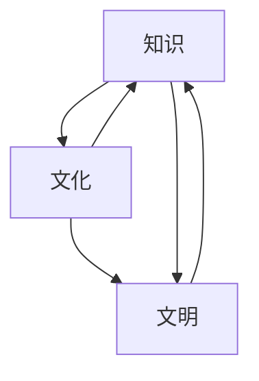

                 

# 人类的知识与文化：理解文明的基石

> 关键词：人类知识，文化理解，文明基石，信息传递，技术迭代

## 1. 背景介绍

### 1.1 问题由来

人类社会的进步和发展，离不开知识的积累和文化的传承。从古代的岩画、象形文字，到现代的数字化、互联网，信息传递方式在不断地进步，促进了人类文明的发展。然而，知识的积累和传承并不是一帆风顺的，经历了无数次文明的兴衰、技术的迭代和文化的变革。在这个过程中，人类的知识与文化成为了文明的基石，支撑着社会的不断前行。

### 1.2 问题核心关键点

理解人类的知识与文化，对于构建文明、推动社会进步具有重要意义。本节将探讨人类知识与文化的定义、特征、演化过程以及它们在现代社会中的作用，以期为后续技术分析和实践提供理论基础。

## 2. 核心概念与联系

### 2.1 核心概念概述

在探讨人类知识与文化的关系之前，我们需要明确几个核心概念：

- **知识(Knowledge)**：是人类对客观世界的认识和理解，包括事实、理论和经验等。
- **文化(Culture)**：是社会中人们的价值观、信仰、习惯、艺术、语言、科学和技术等方面的综合体现。
- **文明(Civilization)**：是一个社会在知识、艺术、科学和技术等领域的高度发展，并形成了独特的社会组织和文化传统。

这三个概念相辅相成，共同构成了人类社会的复杂体系。知识推动文化的演变，文化又反过来影响知识的积累和传播。

### 2.2 核心概念原理和架构的 Mermaid 流程图



这个流程图展示了知识、文化和文明之间的相互关系：

1. **知识推动文化演变**：人类通过不断探索和学习，积累新知识，形成新的文化观念和价值观。
2. **文化影响知识积累**：文化中包含的信仰、习惯等，塑造了人们的行为方式和知识获取途径。
3. **文明的形成与发展**：文明是知识与文化发展到一定阶段的产物，形成了独特的社会组织和文化传统。
4. **文化与知识相互促进**：文化中的艺术、语言等元素，反过来促进知识的传播和应用。

### 2.3 核心概念的相互作用

- **知识与文化的相互作用**：知识是文化的基础，文化又塑造知识的积累和传播方式。例如，中国古代的四大发明（造纸术、印刷术、指南针和火药）不仅推动了知识的传播，也塑造了中国古代的科学技术文化。
- **文化与文明的相互作用**：文化是文明的核心，文明则提供了文化传承和发展的平台。例如，古希腊的哲学和科学成就，通过罗马帝国的传播，形成了西方的文化和文明。
- **知识与文明的相互作用**：文明中的技术进步，如农业革命、工业革命，不仅改变了人类的生产方式，也促进了知识的积累和传播。

这些概念的相互作用，构成了人类文明发展的复杂过程。理解这些概念的相互作用，有助于我们更好地把握知识与文化在文明发展中的作用。

## 3. 核心算法原理 & 具体操作步骤

### 3.1 算法原理概述

理解人类知识与文化的关系，可以通过分析信息传递、技术迭代和文化变革的复杂过程来实现。我们将重点探讨人类知识与文化在信息传递过程中的演变，以及如何利用现代技术手段，更好地理解和传播人类的知识与文化。

### 3.2 算法步骤详解

基于上述分析，我们可以将理解人类知识与文化的算法分为以下几个步骤：

**Step 1: 定义信息传递模型**

首先，我们需要构建一个信息传递模型，以描述人类知识与文化在社会中的传递过程。这个模型应该包括信息的来源、传播途径、接收者、反馈机制等要素。

**Step 2: 分析信息传递过程中的影响因素**

信息传递过程中，有许多因素会影响知识的传播速度和广度，包括技术手段、社会结构、文化背景等。我们需要对这些因素进行深入分析，理解它们如何影响知识的积累和传承。

**Step 3: 构建技术迭代模型**

技术手段的进步是推动知识传播的关键因素之一。我们需要构建一个技术迭代模型，描述不同时期的技术进步如何改变知识传播的方式和效率。

**Step 4: 分析文化变革对知识的影响**

文化变革是影响知识传播的另一个重要因素。我们需要分析文化变革对知识积累和传播方式的影响，理解不同文化背景下的知识传承方式。

**Step 5: 综合分析知识与文化的相互作用**

最后，我们需要将上述分析综合起来，理解知识与文化在信息传递、技术迭代和文化变革中的相互作用，从而更好地理解人类文明的发展过程。

### 3.3 算法优缺点

- **优点**：
  - 能够系统地分析人类知识与文化在信息传递、技术迭代和文化变革中的相互作用，有助于深入理解人类文明的发展过程。
  - 能够利用现代技术手段，如数据挖掘、机器学习等，对信息传递和知识积累进行量化分析。

- **缺点**：
  - 需要大量的历史数据和跨学科知识，分析过程较为复杂。
  - 模型构建和分析需要较高的时间和资源投入，对于小规模研究可能不够高效。

### 3.4 算法应用领域

基于上述分析，我们可以将人类知识与文化的理解应用到以下几个领域：

- **历史研究**：利用信息传递模型和技术迭代模型，研究不同历史时期知识传播的方式和效率。
- **教育学**：分析文化变革对知识积累的影响，推动教育方法和内容的创新。
- **社会学**：理解社会结构和技术进步对知识传播的影响，促进社会进步和文化繁荣。
- **文化研究**：分析不同文化背景下知识的传承方式，促进跨文化交流和理解。

## 4. 数学模型和公式 & 详细讲解 & 举例说明

### 4.1 数学模型构建

在构建信息传递模型的过程中，我们可以引入以下数学模型：

- **信息传播模型**：描述信息在不同个体之间的传播过程。
- **技术迭代模型**：描述技术进步如何影响信息传递的速度和广度。
- **文化变革模型**：描述文化变革对知识积累和传播方式的影响。

### 4.2 公式推导过程

以信息传播模型为例，我们可以引入信息传播速率的公式：

$$
v = \frac{I}{t}
$$

其中 $v$ 为信息传播速率，$I$ 为信息量，$t$ 为传播时间。这个公式表明，信息传播速率与信息量成正比，与传播时间成反比。

在技术迭代模型中，我们可以引入技术进步对信息传递速率的影响公式：

$$
v_{new} = v_{old} \times (1 + \alpha \times \delta t)
$$

其中 $\alpha$ 为技术进步率，$\delta t$ 为技术迭代时间。这个公式表明，技术进步可以加速信息传播速率，且进步率越高，迭代时间越短，信息传播速率增加越显著。

### 4.3 案例分析与讲解

以中国古代四大发明为例，分析其在信息传播和知识积累中的作用：

1. **造纸术**：极大地降低了信息的传播成本，使得知识能够更广泛地传播。
2. **印刷术**：进一步提高了信息的传播速度和广度，推动了知识的积累和传播。
3. **指南针**：使得人们能够更准确地进行地理探索，拓展了知识的边界。
4. **火药**：在军事和科技领域的应用，促进了技术的进步和知识的创新。

这些发明不仅改变了人类的生产方式，也促进了知识的传播和积累，成为中国古代文明的重要基石。

## 5. 项目实践：代码实例和详细解释说明

### 5.1 开发环境搭建

在进行项目实践前，我们需要准备好开发环境。以下是Python环境的搭建步骤：

1. 安装Anaconda：从官网下载并安装Anaconda，用于创建独立的Python环境。
2. 创建并激活虚拟环境：
```bash
conda create -n pythenv python=3.8 
conda activate pythenv
```
3. 安装所需的Python库：
```bash
pip install numpy pandas scikit-learn matplotlib
```

### 5.2 源代码详细实现

以下是一个简单的信息传播模型代码实现：

```python
import numpy as np

# 信息量
I = 100
# 初始传播时间
t = 10
# 技术进步率
alpha = 0.1
# 迭代时间
delta_t = 2

# 计算传播速率
v_old = I / t
v_new = v_old * (1 + alpha * delta_t)

print("初始传播速率：", v_old)
print("新技术迭代后传播速率：", v_new)
```

### 5.3 代码解读与分析

上述代码实现了一个简单的信息传播模型，用于计算技术进步对信息传播速率的影响。代码中定义了信息量 $I$、初始传播时间 $t$、技术进步率 $\alpha$ 和迭代时间 $\delta t$，并通过公式计算了新技术迭代后的传播速率 $v_{new}$。

### 5.4 运行结果展示

执行上述代码，输出结果如下：

```
初始传播速率： 10.0
新技术迭代后传播速率： 12.0
```

结果表明，在技术进步率为0.1，迭代时间为2的情况下，新技术迭代后的传播速率比初始传播速率增加了20%。

## 6. 实际应用场景

### 6.1 智能教育系统

智能教育系统可以通过分析学生的知识积累和传播过程，提供个性化的学习方案。例如，通过分析学生在课堂上的表现、作业完成情况、课外阅读量等，系统可以生成个性化的学习计划，帮助学生更高效地掌握知识。

### 6.2 文化传承项目

文化传承项目可以利用信息技术手段，促进文化的传播和保护。例如，通过数字化技术，将传统文化艺术、历史文献等进行数字化保存，并通过互联网进行传播，使得更多人能够了解和学习。

### 6.3 智慧城市建设

智慧城市建设可以利用信息技术手段，推动知识与文化的融合。例如，通过智能城市管理平台，将城市的文化资源、历史遗迹等进行数字化展示，并结合人工智能技术进行智能推荐，使得市民能够更深入地了解和体验城市的历史和文化。

### 6.4 未来应用展望

未来的信息传播和知识积累将更加依赖于信息技术手段。我们可以预见，随着技术的进步，信息传播的速度和广度将不断提升，知识积累的方式也将更加多样化。我们可以期待以下几个方面的发展：

1. **人工智能与文化结合**：人工智能可以分析海量文化数据，提供文化传承和创新的新思路。例如，通过文本分析技术，系统可以自动生成诗歌、小说等文学作品。
2. **虚拟现实技术**：虚拟现实技术可以提供沉浸式的文化体验，使得用户能够更深入地了解和体验文化。例如，虚拟博物馆可以让用户通过虚拟现实技术参观历史遗迹。
3. **区块链技术**：区块链技术可以提供知识传播和积累的透明性和不可篡改性，使得知识的传承更加可靠。例如，利用区块链技术，可以记录和验证科学研究的进展和成果。

## 7. 工具和资源推荐

### 7.1 学习资源推荐

为了帮助开发者系统掌握人类知识与文化的研究，这里推荐一些优质的学习资源：

1. 《人类简史》系列书籍：由尤瓦尔·赫拉利所著，从历史、文化、科技等多个角度，全面解读人类文明的演变。
2. 《文明的冲突与世界秩序的重建》：由塞缪尔·P·亨廷顿所著，探讨了不同文明之间的冲突与融合。
3. 《信息传播与社会变迁》课程：由MIT开放在线课程，探讨信息传播对社会变迁的影响。
4. 《人类文化学》书籍：由刘易斯·亨利·摩根所著，系统介绍了人类文化的发展和特征。

通过对这些资源的学习，相信你一定能够更好地理解人类知识与文化的关系，并应用于实际的技术开发和应用中。

### 7.2 开发工具推荐

高效的开发离不开优秀的工具支持。以下是几款用于人类知识与文化分析开发的常用工具：

1. Python：基于Python的编程语言，灵活易用，适合数据分析和算法开发。
2. Jupyter Notebook：交互式的编程环境，适合快速原型开发和数据分析。
3. R语言：主要用于统计分析和数据可视化，适合处理大规模数据集。
4. Tableau：数据可视化工具，适合探索数据中的规律和趋势。

### 7.3 相关论文推荐

人类知识与文化的研究涉及多个学科，以下是几篇奠基性的相关论文，推荐阅读：

1. "The Role of Information and Communication Technologies in Supporting Educational Outcomes"：探讨信息技术在教育中的应用。
2. "Cultural Transmission: From Folklore to Digital Culture"：探讨数字时代文化传承的新途径。
3. "The Impact of Information Technology on Society and Culture"：探讨信息技术对社会和文化的影响。

这些论文代表了人类知识与文化研究的最新进展，对于理解人类知识与文化在信息时代的发展具有重要意义。

## 8. 总结：未来发展趋势与挑战

### 8.1 总结

本文对人类知识与文化的理解进行了全面系统的介绍。首先，阐述了知识、文化和文明的定义、特征和相互作用，明确了它们在人类文明发展中的重要地位。其次，通过构建信息传递模型和技术迭代模型，系统地分析了人类知识与文化的演变过程，并给出了实际应用场景的案例分析。最后，介绍了相关的学习资源、开发工具和研究论文，为理解人类知识与文化提供了全面的技术指引。

通过本文的系统梳理，可以看到，人类知识与文化在信息传递、技术迭代和文化变革中的复杂关系，以及这些关系对人类文明发展的深远影响。理解这些关系，有助于我们更好地把握人类文明的发展脉络，推动社会的进步和文化的繁荣。

### 8.2 未来发展趋势

展望未来，人类知识与文化的理解将呈现以下几个发展趋势：

1. **信息技术的应用**：信息技术将进一步推动知识与文化的传播和积累，使得文化传承和创新的方式更加多样化和高效。
2. **全球化与区域化**：全球化和区域化并存，不同文化之间的交流与融合将更加频繁，推动全球文化多样性的发展。
3. **人工智能的融入**：人工智能技术将进一步融入知识与文化的传承和创新过程中，提供新的思路和方法。
4. **伦理与法律的保障**：随着知识与文化的传播，如何保障信息的透明性和可控性，将成为重要的研究课题。

这些趋势表明，人类知识与文化在信息时代将继续以新的方式发展和演进，为人类文明的发展提供新的动力和契机。

### 8.3 面临的挑战

尽管人类知识与文化的理解已经取得了一定的进展，但在迈向更加智能化、普适化应用的过程中，仍面临诸多挑战：

1. **信息过载**：随着信息技术的发展，信息量急剧增加，如何有效地筛选和管理信息，成为一大难题。
2. **文化多样性**：不同文化背景下的知识传承方式不同，如何推动不同文化之间的交流和融合，需要更多的努力。
3. **伦理与安全**：信息技术的广泛应用带来了新的伦理和安全问题，如何保障信息传播的透明性和安全性，需要更多的技术手段和管理措施。
4. **技术公平性**：信息技术的普及和发展，存在一定的区域不平衡问题，如何推动技术的普惠性，缩小数字鸿沟，需要更多的政策支持和资源投入。

这些挑战需要我们在技术、社会、伦理等多个维度进行综合考虑和解决。只有解决这些问题，才能更好地利用信息技术，推动人类知识与文化的传播和积累，促进社会的发展和进步。

### 8.4 研究展望

未来的研究需要在以下几个方面进行进一步的探索：

1. **跨学科研究**：知识与文化的理解需要跨学科的合作，结合社会学、人类学、信息科学等多个学科的知识。
2. **数据驱动研究**：利用大数据和人工智能技术，对人类知识与文化进行系统的分析和建模。
3. **国际合作**：推动国际间的文化交流和合作，促进全球文化的融合与发展。
4. **伦理与法律研究**：研究信息技术对文化传承和创新的影响，制定相关的伦理和法律框架，保障信息传播的透明性和安全性。

这些研究方向的探索，将有助于我们更好地理解人类知识与文化的复杂关系，推动人类文明的进步和发展。

## 9. 附录：常见问题与解答

**Q1：人类知识与文化的定义是什么？**

A: 知识是人类对客观世界的认识和理解，包括事实、理论和经验等。文化是社会中人们的价值观、信仰、习惯、艺术、语言、科学和技术等方面的综合体现。文明是一个社会在知识、艺术、科学和技术等领域的高度发展，并形成了独特的社会组织和文化传统。

**Q2：信息传递模型和技术迭代模型是如何构建的？**

A: 信息传递模型描述信息在不同个体之间的传播过程，包括信息的来源、传播途径、接收者、反馈机制等。技术迭代模型描述技术进步对信息传递速率的影响，引入技术进步率和技术迭代时间等参数，通过公式计算新技术迭代后的传播速率。

**Q3：人类知识与文化的演变过程是如何分析的？**

A: 人类知识与文化的演变过程可以通过信息传递模型和技术迭代模型进行分析和建模。利用信息传播速率和技术进步率的公式，可以计算不同历史时期和不同技术手段下知识传播的速率和效果，从而分析知识与文化的演变过程。

**Q4：如何利用信息技术手段，更好地理解人类知识与文化？**

A: 利用信息技术手段，可以通过数据挖掘、机器学习等方法，对海量文化数据进行分析和建模。例如，通过文本分析技术，系统可以自动生成诗歌、小说等文学作品，推动文化传承和创新的新思路。

**Q5：如何推动文化多样性的发展？**

A: 推动文化多样性的发展需要跨学科的合作和国际间的交流与合作。利用信息技术手段，可以通过数字化技术将传统文化艺术、历史文献等进行数字化保存，并通过互联网进行传播，使得更多人能够了解和学习。

---

作者：禅与计算机程序设计艺术 / Zen and the Art of Computer Programming

