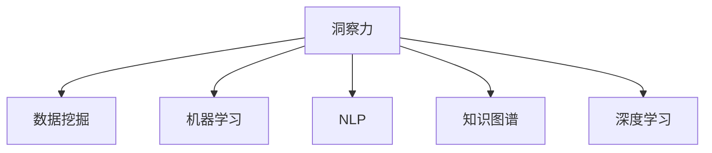

                 

# 人类知识的传承与发展：洞察力的重要作用

## 1. 背景介绍

### 1.1 问题由来

在人类文明发展的长河中，知识传承一直是推动社会进步的关键动力。无论是古代的口述传道、手抄书籍，还是现代的网络知识库、在线课程，知识传承的方式和技术都在不断演进。随着大数据、人工智能等技术的进步，人类的知识获取和处理能力正在经历前所未有的变革。在这一背景下，洞察力成为了连接人类知识传承与现代信息技术的新桥梁，为知识的深度挖掘和有效传承提供了新的可能性。

### 1.2 问题核心关键点

洞察力（Insight），指的是通过分析数据、理解信息，从中提取出有价值、可操作的洞见和结论的能力。在大数据和人工智能时代，洞察力不仅仅是一种直觉或预感，更是一种基于数据驱动的分析方法，可以广泛应用在市场分析、产品研发、客户服务等多个领域。

洞察力与人工智能技术的结合，为知识的传承与发展带来了新的思路和方法。通过数据挖掘、机器学习、自然语言处理等技术，可以从海量数据中提取出有价值的知识，为决策提供科学依据。同时，洞察力还可以辅助设计更加高效、合理的知识库和知识图谱，提升知识管理系统的智能化水平。

### 1.3 问题研究意义

洞察力的重要性在于其能够帮助我们从海量信息中提取精华，揭示深层次的模式和规律，指导实际应用。在知识传承和发展中，洞察力可以：

- 促进知识的深度挖掘：洞察力能够从大量文本、图像、音频等数据中提取有价值的知识，提升知识的深度和广度。
- 辅助决策和优化：洞察力通过数据分析和模型训练，可以为决策提供科学依据，优化知识管理系统的设计。
- 提升用户体验：洞察力可以通过对用户行为和偏好的分析，优化知识库的布局和呈现方式，提升用户获取知识的效率和满意度。

洞察力在知识传承和发展中的作用，不仅在于其作为工具和技术的功能，更在于其背后所承载的智慧和思考。通过洞察力的应用，我们可以更有效地继承和发扬人类文明的知识遗产，推动社会和科技的进步。

## 2. 核心概念与联系

### 2.1 核心概念概述

为更好地理解洞察力在知识传承和发展中的作用，本节将介绍几个密切相关的核心概念：

- **洞察力（Insight）**：指通过数据挖掘、分析，从中提取有价值、可操作的洞见和结论的能力。
- **数据挖掘（Data Mining）**：从大量数据中提取有用信息和知识的过程，通常包括分类、聚类、关联规则学习等技术。
- **机器学习（Machine Learning）**：通过算法模型从数据中学习规律，并用于预测、分类等任务。
- **自然语言处理（NLP）**：使计算机能够理解、处理和生成自然语言的技术，常用于信息抽取、情感分析等任务。
- **知识图谱（Knowledge Graph）**：表示实体及其关系的图形结构，用于知识表示和推理。
- **深度学习（Deep Learning）**：基于神经网络的机器学习方法，适用于处理复杂、高维度的数据。

这些核心概念之间的逻辑关系可以通过以下Mermaid流程图来展示：



这个流程图展示了大数据和人工智能技术在知识传承和发展中的作用：

1. 洞察力能够从数据挖掘中获得知识。
2. 机器学习通过学习数据中的规律，为洞察力提供科学依据。
3. NLP技术使计算机能够理解自然语言，提取有价值的信息。
4. 知识图谱帮助表示和推理知识，辅助洞察力的应用。
5. 深度学习在处理复杂数据时具有优势，为洞察力的实现提供技术支持。

## 3. 核心算法原理 & 具体操作步骤

### 3.1 算法原理概述

洞察力的提取与人工智能技术的结合，本质上是一种数据驱动的分析和推理过程。其核心思想是：通过算法模型对大量数据进行分析和处理，从中提取出有价值的知识洞见，辅助决策和优化。

### 3.2 算法步骤详解

基于洞察力的知识传承和发展，一般包括以下几个关键步骤：

**Step 1: 数据收集与预处理**
- 收集与知识传承相关的数据，如用户行为数据、产品评价、市场调研等。
- 对数据进行清洗、去重、归一化等预处理操作，确保数据质量和可用性。

**Step 2: 数据建模与分析**
- 选择合适的算法模型，如回归分析、聚类分析、分类模型等，对数据进行建模。
- 使用模型对数据进行分析，提取有价值的特征和规律。

**Step 3: 洞察力生成与评估**
- 通过分析结果生成洞察力报告，提供数据驱动的洞见和结论。
- 对洞察力报告进行评估，确保其准确性和可操作性。

**Step 4: 知识应用与优化**
- 将洞察力应用于知识库、决策系统、产品设计等场景中，辅助知识传承和发展。
- 定期对应用效果进行评估和优化，提升知识系统的智能化水平。

### 3.3 算法优缺点

基于洞察力的知识传承和发展方法，具有以下优点：
1. 数据驱动：通过算法模型从数据中提取洞见，减少人为偏见，提升决策的科学性。
2. 高效性：借助自动化算法，可以快速处理大量数据，提取出有价值的知识。
3. 泛化能力强：洞察力模型可以通过迁移学习，应用于不同的知识传承任务。
4. 灵活性：洞察力方法可以根据具体任务需求进行调整，适应多样化的知识传承场景。

同时，该方法也存在一定的局限性：
1. 依赖高质量数据：洞察力方法的效果高度依赖于数据的质量和数量。数据偏差或噪声可能会影响结果的准确性。
2. 模型复杂性：洞察力模型需要选择合适的算法和参数，设置不当可能导致过拟合或欠拟合。
3. 解释性不足：洞察力模型往往作为“黑盒”，缺乏对内部决策过程的解释。
4. 技术门槛高：洞察力方法需要一定的技术储备和算法设计能力，对普通用户有一定门槛。

尽管存在这些局限性，但就目前而言，基于洞察力的知识传承和发展方法仍是大数据和人工智能时代的核心范式。未来相关研究的主要方向在于如何进一步降低技术门槛，提高模型的解释性，同时兼顾高效性和灵活性。

### 3.4 算法应用领域

基于洞察力的知识传承和发展方法，已经在多个领域得到了应用，覆盖了知识管理、产品优化、市场分析等多个方面，例如：

- **知识管理**：通过分析员工的知识请求和贡献，优化知识库的布局和内容，提升知识共享效率。
- **产品优化**：利用用户行为数据，提取产品使用中的问题和建议，指导产品改进和迭代。
- **市场分析**：分析消费者评论和社交媒体数据，揭示市场趋势和用户偏好，辅助市场营销策略。
- **客户服务**：通过对客户反馈和行为数据的分析，优化客户服务流程，提升客户满意度。

除了上述这些经典应用外，洞察力还被创新性地应用到更多场景中，如智能推荐、舆情监测、供应链优化等，为知识传承和发展带来了全新的突破。随着算法和技术的不断进步，相信洞察力将在更广阔的应用领域发挥更大作用。

## 4. 数学模型和公式 & 详细讲解 & 举例说明

### 4.1 数学模型构建

本节将使用数学语言对基于洞察力的知识传承和发展过程进行更加严格的刻画。

假设我们有一组数据集 $D = \{(x_i, y_i)\}_{i=1}^N$，其中 $x_i$ 表示输入特征，$y_i$ 表示目标变量。我们使用线性回归模型对数据进行建模，模型参数为 $\theta$。目标是最小化预测误差 $\hat{y}_i$ 与真实值 $y_i$ 之间的平方误差，即：

$$
\min_{\theta} \sum_{i=1}^N (\hat{y}_i - y_i)^2
$$

其中 $\hat{y}_i = x_i^T \theta$ 为预测值。通过求解上述最小化问题，可以得到最优模型参数 $\theta^*$。

### 4.2 公式推导过程

以下是线性回归模型的推导过程：

1. 假设误差 $e_i = y_i - \hat{y}_i$，则最小化误差平方和可以表示为：

$$
\min_{\theta} \sum_{i=1}^N e_i^2
$$

2. 对误差平方和求导，并令导数为0：

$$
\frac{\partial}{\partial \theta} \sum_{i=1}^N e_i^2 = 0
$$

3. 展开导数，并简化，得到：

$$
\sum_{i=1}^N (2e_i \cdot \hat{y}_i) = \sum_{i=1}^N (2y_i \cdot \hat{y}_i) - 2\sum_{i=1}^N x_i \cdot y_i
$$

4. 进一步整理，得到：

$$
\theta^* = (X^TX)^{-1}X^Ty
$$

其中 $X = [x_1, x_2, ..., x_N]$ 为数据矩阵，$y = [y_1, y_2, ..., y_N]$ 为目标向量。

### 4.3 案例分析与讲解

以用户行为分析为例，展示基于线性回归的洞察力提取过程：

假设我们有一组用户行为数据，包括用户在电商平台上的浏览、点击、购买等行为。我们希望通过分析这些数据，预测用户的购买倾向。

首先，我们将用户行为数据进行处理，提取有用的特征，如用户浏览时间、点击次数、商品类别等。然后，使用线性回归模型对数据进行建模，得到预测模型 $\hat{y} = x^T \theta$，其中 $y$ 为用户的购买倾向，$x$ 为输入特征向量，$\theta$ 为模型参数。

通过最小化预测误差与真实购买倾向的平方和，我们可以求解得到最优模型参数 $\theta^*$。进而，对于新的用户行为数据 $x'$，我们可以使用该模型进行预测，得到用户购买倾向的洞察力洞见。

## 5. 项目实践：代码实例和详细解释说明

### 5.1 开发环境搭建

在进行洞察力实践前，我们需要准备好开发环境。以下是使用Python进行数据分析和机器学习的开发环境配置流程：

1. 安装Anaconda：从官网下载并安装Anaconda，用于创建独立的Python环境。

2. 创建并激活虚拟环境：
```bash
conda create -n insight-env python=3.8 
conda activate insight-env
```

3. 安装必要的工具包：
```bash
pip install pandas numpy scikit-learn matplotlib seaborn
```

4. 安装机器学习框架：
```bash
pip install scikit-learn
```

完成上述步骤后，即可在`insight-env`环境中开始洞察力实践。

### 5.2 源代码详细实现

我们以用户行为分析为例，展示使用Python进行线性回归的洞察力实践代码。

首先，导入必要的库：

```python
import pandas as pd
import numpy as np
from sklearn.linear_model import LinearRegression
import matplotlib.pyplot as plt
```

然后，读取数据集，进行预处理：

```python
df = pd.read_csv('user_behavior.csv')
# 提取有用的特征
features = df[['browsing_time', 'click_count', 'product_category']]
# 目标变量
target = df['purchase_tendency']
```

接下来，进行线性回归模型的训练：

```python
# 将数据转换为numpy数组
X = np.array(features)
y = np.array(target)

# 创建线性回归模型
model = LinearRegression()
# 训练模型
model.fit(X, y)
```

最后，使用模型进行预测：

```python
# 获取用户行为特征
new_data = np.array([[1, 10, 'clothing']])
# 使用模型进行预测
predictions = model.predict(new_data)

# 输出预测结果
print(predictions)
```

### 5.3 代码解读与分析

让我们再详细解读一下关键代码的实现细节：

**用户行为数据处理**：
- 通过`pd.read_csv`读取CSV格式的数据集，转换为Pandas DataFrame格式。
- 提取有用的特征，如用户浏览时间、点击次数、商品类别等，存储在`features`变量中。
- 将目标变量（用户的购买倾向）存储在`target`变量中。

**模型训练**：
- 使用`np.array`将数据转换为numpy数组，方便线性回归模型使用。
- 创建线性回归模型，并使用`fit`方法训练模型。

**模型预测**：
- 使用`np.array`将新的用户行为特征转换为numpy数组。
- 使用训练好的模型进行预测，得到用户的购买倾向洞察力洞见。

可以看到，Python的Scikit-learn库提供了一系列的机器学习模型和工具，使得洞察力的实现变得非常简单。开发者可以专注于数据处理和模型优化，而不必过多关注底层实现细节。

## 6. 实际应用场景

### 6.1 智能推荐系统

基于洞察力的推荐系统，可以更精确地了解用户需求，提升推荐内容的个性化和相关性。通过分析用户的历史行为数据，洞察力模型可以挖掘出用户偏好的物品特征，为推荐算法提供科学的依据。

在技术实现上，可以收集用户浏览、点击、评分等行为数据，提取有价值的特征，如用户兴趣、购买历史等。将用户行为数据作为输入，构建洞察力模型，得到用户兴趣和偏好的洞察力洞见。将洞察力应用于推荐算法中，可以更准确地预测用户未来的行为，生成个性化的推荐内容。

### 6.2 金融风险管理

在金融领域，洞察力可以帮助金融机构识别潜在的风险点，制定有效的风险管理策略。通过分析客户的交易行为、资产状况等数据，洞察力模型可以发现异常交易模式，预测潜在风险。

在实践应用中，可以收集客户的交易记录、资产配置、信用评分等数据，构建洞察力模型，提取客户的风险偏好和行为特征。将洞察力应用于风险评估和预警系统，可以及时发现和处理潜在的金融风险，保障金融系统的稳定运行。

### 6.3 智能客服系统

基于洞察力的智能客服系统，可以更智能地回答客户问题，提升客户服务体验。通过分析客户的查询历史和行为数据，洞察力模型可以识别出常见问题和趋势，优化知识库的布局和内容。

在技术实现上，可以收集客户的历史查询记录和行为数据，提取有用的特征，如查询频率、问题类型等。将用户数据作为输入，构建洞察力模型，得到常见问题和趋势的洞察力洞见。将洞察力应用于智能客服系统中，可以更准确地回答客户问题，提升客户服务效率和满意度。

### 6.4 未来应用展望

随着洞察力方法在知识传承和发展中的不断应用，未来将会出现更多创新场景，如智能健康管理、智能交通优化、智能供应链管理等。以下是对未来应用展望的几点建议：

1. **智能健康管理**：通过分析用户的健康数据和行为模式，洞察力模型可以帮助用户进行健康管理和疾病预防。例如，可以分析用户的运动数据、饮食习惯、睡眠质量等，提供个性化的健康建议。

2. **智能交通优化**：通过分析交通流量、路况数据、用户出行习惯等，洞察力模型可以优化交通流量和路线规划，提升交通系统的效率和安全性。例如，可以分析交通拥堵情况，预测流量高峰期，提前进行交通疏导。

3. **智能供应链管理**：通过分析供应链各环节的数据，洞察力模型可以优化供应链管理，降低运营成本，提升供应链效率。例如，可以分析库存数据、物流状况、供应商信息等，优化库存管理和物流路线，保障供应链的稳定性和效率。

## 7. 工具和资源推荐

### 7.1 学习资源推荐

为了帮助开发者系统掌握洞察力的理论基础和实践技巧，这里推荐一些优质的学习资源：

1. 《数据科学入门：基于Python的数据分析与机器学习》系列博文：由大数据和机器学习专家撰写，深入浅出地介绍了数据分析和机器学习的核心概念和技术。

2. CS229《机器学习》课程：斯坦福大学开设的机器学习明星课程，涵盖机器学习的基础理论、算法和应用，是入门机器学习的绝佳资源。

3. 《Python数据科学手册》书籍：全面介绍了Python在数据分析、机器学习、数据可视化等方面的应用，是学习Python数据科学的入门书籍。

4. Kaggle：一个数据科学竞赛平台，提供丰富的数据集和模型代码，可以用于实践和测试机器学习算法，提升洞察力应用能力。

5. Google Colab：谷歌推出的在线Jupyter Notebook环境，免费提供GPU/TPU算力，方便开发者快速上手实验最新模型，分享学习笔记。

通过对这些资源的学习实践，相信你一定能够快速掌握洞察力的精髓，并用于解决实际的NLP问题。

### 7.2 开发工具推荐

高效的开发离不开优秀的工具支持。以下是几款用于洞察力开发的工具：

1. Python：基于Python的开源编程语言，有丰富的第三方库支持，适用于数据分析、机器学习等任务。

2. Jupyter Notebook：一种交互式的编程环境，支持多语言编程和数据可视化，是数据分析和机器学习的常用工具。

3. Scikit-learn：Python机器学习库，提供各种机器学习算法和工具，支持数据预处理、模型训练和评估等。

4. Pandas：Python数据分析库，支持数据清洗、处理、分析等任务，是数据科学的基础库。

5. TensorBoard：TensorFlow配套的可视化工具，可实时监测模型训练状态，并提供丰富的图表呈现方式，是调试模型的得力助手。

合理利用这些工具，可以显著提升洞察力开发的效率，加快创新迭代的步伐。

### 7.3 相关论文推荐

洞察力方法的发展源于学界的持续研究。以下是几篇奠基性的相关论文，推荐阅读：

1. "Towards Explainable AI: Understanding and Interpreting AI Predictions"（Towards Explainable AI：理解与解读AI预测）：探讨了如何提高机器学习模型的可解释性，为洞察力的实现提供了理论基础。

2. "Deep Learning for Recommendation Systems"（深度学习在推荐系统中的应用）：介绍了深度学习在推荐系统中的应用，展示了如何通过深度学习模型提取用户偏好和行为洞见。

3. "Data Mining and Statistical Learning"（数据挖掘与统计学习）：介绍了数据挖掘和统计学习的基本概念和技术，是学习洞察力的必读书籍。

4. "Knowledge Graphs for Recommendation Systems"（知识图谱在推荐系统中的应用）：介绍了知识图谱在推荐系统中的应用，展示了如何将知识图谱与洞察力结合，提升推荐系统的性能。

这些论文代表了大数据和人工智能时代的知识传承和发展研究脉络，通过学习这些前沿成果，可以帮助研究者把握学科前进方向，激发更多的创新灵感。

## 8. 总结：未来发展趋势与挑战

### 8.1 总结

本文对基于洞察力的知识传承和发展方法进行了全面系统的介绍。首先阐述了洞察力在知识传承中的重要性和应用价值，明确了其作为数据驱动的分析和推理方法，能够有效提升知识管理的智能化水平。其次，从原理到实践，详细讲解了洞察力模型的构建过程和操作步骤，给出了基于Python的洞察力实践代码。同时，本文还广泛探讨了洞察力方法在智能推荐、金融风险管理、智能客服等多个行业领域的应用前景，展示了其广阔的应用空间。

通过本文的系统梳理，可以看到，基于洞察力的知识传承方法正在成为大数据和人工智能时代的核心范式，极大地提升了知识的深度挖掘和应用能力。未来，伴随数据、算法、工程、业务等多个维度协同发力，相信洞察力技术将在构建智能知识管理系统、优化产品和服务、提升用户体验等方面发挥更大作用。

### 8.2 未来发展趋势

展望未来，洞察力的应用前景将更加广阔，主要体现在以下几个方面：

1. **智能系统的普及**：随着洞察力方法在更多领域的应用，智能系统的普及将大幅提升。例如，智能推荐、智能客服、智能金融等领域将更广泛地采用洞察力技术，提升系统的智能化水平。

2. **数据驱动的决策**：洞察力方法将帮助企业、机构从数据中提取洞见，辅助决策和优化。在市场分析、产品设计、风险管理等多个领域，洞察力将成为决策科学的重要工具。

3. **跨领域融合**：洞察力方法将与更多领域的技术进行深度融合，如自然语言处理、计算机视觉、深度学习等。通过多模态数据的整合，洞察力技术将更加全面、高效。

4. **实时化应用**：洞察力技术将更注重实时化应用，如实时推荐、实时舆情分析等。实时数据处理和分析能力将进一步提升洞察力的应用效果。

5. **可解释性提升**：未来的洞察力技术将更加注重可解释性，通过模型解释和可视化技术，增强对洞察力输出结果的理解和信任。

6. **自动化和智能化**：未来的洞察力技术将更加自动化和智能化，减少人为干预，提升系统的可靠性和鲁棒性。

### 8.3 面临的挑战

尽管洞察力方法在知识传承和发展中展示了巨大的潜力，但在实际应用中，仍面临一些挑战：

1. **数据质量和完整性**：洞察力方法高度依赖于数据的质量和完整性，数据偏差或噪声可能会影响结果的准确性。

2. **模型复杂度**：洞察力模型的设计和训练需要一定的技术储备和经验积累，设置不当可能导致模型过拟合或欠拟合。

3. **技术门槛高**：洞察力方法涉及数据处理、算法设计和模型评估等环节，对普通用户有一定的技术门槛。

4. **解释性不足**：洞察力模型往往作为“黑盒”，缺乏对内部决策过程的解释。

5. **数据隐私和安全**：在应用洞察力技术时，需要考虑数据的隐私和安全问题，确保数据的使用合法合规。

6. **数据孤岛问题**：不同系统间的数据孤岛问题可能会影响洞察力模型的训练和应用，需要建立统一的数据标准和接口。

正视这些挑战，积极应对并寻求突破，将是大数据和人工智能时代洞察力技术发展的关键。相信随着学界和产业界的共同努力，洞察力技术必将在构建智能知识管理系统、优化产品和服务、提升用户体验等方面发挥更大作用。

### 8.4 研究展望

未来的洞察力技术需要不断突破和优化，主要方向包括：

1. **数据融合与整合**：探索更多领域的数据融合与整合方法，提升洞察力模型的泛化能力和应用效果。

2. **自动化与智能化**：开发更加自动化和智能化的洞察力技术，减少人为干预，提升系统的可靠性和鲁棒性。

3. **解释性与可解释性**：通过模型解释和可视化技术，增强对洞察力输出结果的理解和信任。

4. **跨领域应用**：将洞察力方法与更多领域的技术进行深度融合，如自然语言处理、计算机视觉、深度学习等，拓展应用场景。

5. **实时化应用**：注重实时化应用，提升洞察力技术的实时数据处理和分析能力。

6. **数据隐私与安全**：在应用洞察力技术时，注重数据隐私和安全问题，确保数据的使用合法合规。

7. **技术普及与教育**：推动洞察力技术的普及和教育，降低技术门槛，提升技术应用能力。

通过这些方向的探索发展，相信洞察力技术将在未来大放异彩，成为大数据和人工智能时代的核心技术，推动知识的传承与发展，为社会和科技的进步贡献力量。

## 9. 附录：常见问题与解答

**Q1: 如何提高洞察力模型的准确性？**

A: 提高洞察力模型的准确性，可以从以下几个方面入手：

1. 数据质量：确保数据的质量和完整性，减少数据偏差和噪声的影响。可以通过数据清洗、去重、归一化等预处理操作，提升数据质量。

2. 特征选择：选择合适的特征，提取有用的信息，减少特征冗余和噪音。可以通过特征工程、降维技术等方法，优化特征选择。

3. 模型选择：选择合适的算法模型，根据具体任务和数据特点进行优化。可以使用交叉验证、调参等方法，选择最优模型。

4. 数据增强：通过数据增强技术，增加数据多样性，提高模型的泛化能力。可以采用数据增强、合成数据等方法，提升模型的鲁棒性。

5. 模型集成：通过模型集成技术，将多个洞察力模型进行组合，提升整体性能。可以使用投票、堆叠等方法，进行模型集成。

6. 实时监控：定期监控模型的性能，及时发现和处理问题，优化模型参数和结构。

通过以上方法，可以显著提升洞察力模型的准确性和可靠性。

**Q2: 洞察力技术如何应用于产品设计？**

A: 洞察力技术可以广泛应用于产品设计，通过分析用户数据，提取用户需求和偏好，优化产品设计。具体步骤包括：

1. 数据收集：收集用户行为数据、产品使用数据等，建立洞察力模型所需的数据集。

2. 特征提取：提取有用的特征，如用户行为、产品使用情况、用户反馈等。

3. 洞察力建模：使用洞察力模型，分析数据，提取用户需求和偏好，生成洞察力洞见。

4. 产品优化：根据洞察力洞见，优化产品设计，提升用户体验和满意度。

5. 迭代改进：定期收集用户反馈，更新洞察力模型，持续优化产品设计。

通过以上步骤，可以有效地利用洞察力技术，优化产品设计，提升产品的市场竞争力和用户满意度。

**Q3: 洞察力技术如何应用于市场分析？**

A: 洞察力技术可以广泛应用于市场分析，通过分析市场数据，揭示市场趋势和用户偏好，辅助市场决策和优化。具体步骤包括：

1. 数据收集：收集市场数据，如用户行为数据、产品销售数据、市场调研数据等，建立洞察力模型所需的数据集。

2. 特征提取：提取有用的特征，如用户行为特征、市场特征、产品特征等。

3. 洞察力建模：使用洞察力模型，分析数据，提取市场趋势和用户偏好，生成洞察力洞见。

4. 市场决策：根据洞察力洞见，制定市场策略，优化产品定位和市场推广。

5. 市场监控：定期收集市场数据，更新洞察力模型，持续优化市场策略。

通过以上步骤，可以有效地利用洞察力技术，揭示市场趋势和用户偏好，辅助市场决策和优化，提升市场竞争力。

以上是本文的详细内容，希望对您有所帮助。

---

作者：禅与计算机程序设计艺术 / Zen and the Art of Computer Programming

