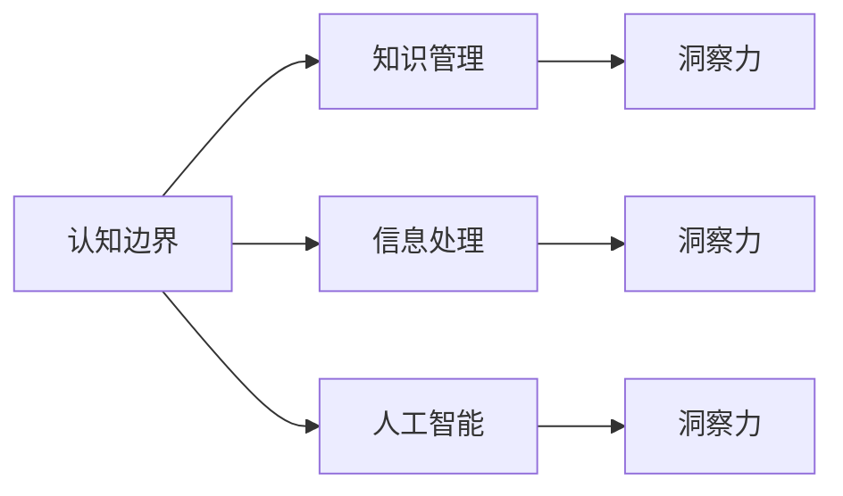

                 

# 人类知识的局限与突破：洞察力的重要意义

> 关键词：认知边界、知识管理、洞察力、信息处理、人工智能

## 1. 背景介绍

### 1.1 问题由来
人类知识的获取与传递一直是社会发展的重要驱动力。从远古时代口耳相传的经验智慧，到现代社会借助互联网传播的知识信息，知识管理的方式在不断进步。然而，人类的认知能力仍存在诸多局限，知识传播和利用的效率仍待提升。

现代信息技术的发展为人类知识管理提供了新的手段，人工智能（AI）的崛起更是带来了认知领域的突破性进展。机器学习和深度学习技术的应用，使得数据驱动的洞察力成为可能。

### 1.2 问题核心关键点
在知识管理与利用的过程中，洞察力起到了至关重要的作用。洞察力是指通过对数据和信息的分析，揭示出潜在的模式、趋势和关联的能力。这种能力不仅限于数据的分析，还包括对人类行为、市场动态、社会现象等的深刻理解。

对于人类而言，洞察力受限于个人经验、认知水平、注意焦点等因素。而对人工智能而言，洞察力则是一种通过对数据和模型的分析，挖掘深层规律的算法能力。

## 2. 核心概念与联系

### 2.1 核心概念概述

洞察力（Insight）的概念包含了多个维度：

- **认知边界（Cognitive Boundaries）**：人类对世界的认知受限于其经验、教育、兴趣等因素。尽管人类的认知边界可以通过学习不断拓展，但与机器相比，其深度和广度仍然有限。
- **知识管理（Knowledge Management）**：指如何收集、存储、组织和检索知识，使其能够被有效利用。
- **信息处理（Information Processing）**：通过对信息的分析、存储和检索，提升信息利用效率。
- **人工智能（Artificial Intelligence）**：利用算法和模型，模拟和扩展人类智能。

### 2.2 核心概念原理和架构的 Mermaid 流程图



这个流程图展示了不同概念之间的关系：

1. 认知边界影响知识管理的广度和深度。
2. 知识管理依赖信息处理，以提升信息的可检索性和可利用性。
3. 信息处理依赖于对数据的分析，可以增强洞察力。
4. 人工智能通过算法和模型模拟人类认知，提供更高的洞察力。

## 3. 核心算法原理 & 具体操作步骤

### 3.1 算法原理概述

洞察力的获取主要依赖于对大量数据的分析和模型训练。算法原理通常包括以下步骤：

1. **数据收集与预处理**：从不同来源收集数据，并对其进行清洗、整理和标注。
2. **特征提取与表示**：使用算法（如PCA、NLP、图像处理）将数据转化为特征向量，以便进行模型训练。
3. **模型训练与评估**：选择适当的模型（如线性回归、决策树、神经网络），并使用数据对其进行训练。评估模型的性能，如准确率、召回率、F1分数等。
4. **洞察力输出**：根据训练好的模型，对新的数据进行分析和预测，输出洞察力结果。

### 3.2 算法步骤详解

以下以神经网络（Neural Network）为例，详细介绍算法步骤：

**Step 1: 数据收集与预处理**

收集所需的数据，并进行以下预处理：

- 数据清洗：去除缺失值、异常值等。
- 数据标准化：将数据缩放到相同的范围或分布。
- 数据增强：通过数据扩充、旋转、裁剪等方式，增加数据多样性。

**Step 2: 特征提取与表示**

使用特征提取算法（如PCA、NLP、图像处理等）将原始数据转化为特征向量。例如，使用BERT对文本进行编码：

```python
from transformers import BertTokenizer, BertModel

tokenizer = BertTokenizer.from_pretrained('bert-base-uncased')
model = BertModel.from_pretrained('bert-base-uncased')

inputs = tokenizer("Hello, my dog is cute", return_tensors="pt")
outputs = model(**inputs)
last_hidden_states = outputs[0]
```

**Step 3: 模型训练与评估**

使用训练数据对模型进行训练，优化模型参数，以最小化损失函数。例如，使用Adam优化器：

```python
from torch import nn
import torch.optim as optim

criterion = nn.CrossEntropyLoss()
optimizer = optim.Adam(model.parameters(), lr=0.001)

for epoch in range(num_epochs):
    for batch in train_loader:
        inputs, labels = batch
        optimizer.zero_grad()
        outputs = model(inputs)
        loss = criterion(outputs, labels)
        loss.backward()
        optimizer.step()
```

**Step 4: 洞察力输出**

使用训练好的模型对新的数据进行分析和预测，输出洞察力结果。例如，使用模型进行情感分析：

```python
from transformers import BertForSequenceClassification

model = BertForSequenceClassification.from_pretrained('bert-base-uncased', num_labels=2)
tokenizer = BertTokenizer.from_pretrained('bert-base-uncased')

inputs = tokenizer("This is a happy day.", return_tensors="pt")
outputs = model(**inputs)
logits = outputs.logits

if logits[0,1] > logits[0,0]:
    print("Positive")
else:
    print("Negative")
```

### 3.3 算法优缺点

洞察力算法的优点包括：

- **高效性**：能够快速处理大量数据，提供实时洞察。
- **可扩展性**：随着数据量的增加，模型可以不断优化，提高洞察力的准确性和深度。
- **多模态能力**：可以处理文本、图像、声音等多模态数据，增强洞察力的全面性。

缺点包括：

- **依赖数据质量**：数据的质量和标注直接影响洞察力的准确性。
- **计算资源需求高**：高质量的数据和模型训练需要大量的计算资源。
- **复杂性**：算法的复杂性和可解释性可能成为应用的挑战。

### 3.4 算法应用领域

洞察力算法在多个领域有广泛应用，例如：

- **金融分析**：通过分析历史交易数据，预测市场趋势和风险。
- **医疗诊断**：通过分析患者的病历数据，辅助医生进行疾病诊断和治疗。
- **市场营销**：通过分析用户行为数据，识别市场趋势和消费者偏好。
- **社交媒体分析**：通过分析社交媒体数据，监测舆论动态和舆情变化。

## 4. 数学模型和公式 & 详细讲解 & 举例说明

### 4.1 数学模型构建

洞察力的获取通常依赖于对数据的统计分析和模型训练。以下以线性回归（Linear Regression）为例，介绍数学模型的构建。

假设有一组数据 $(x_1, y_1), (x_2, y_2), \ldots, (x_n, y_n)$，其中 $x$ 为自变量，$y$ 为因变量。线性回归的目标是找到一条直线，最小化误差：

$$
\min_{\beta_0, \beta_1} \sum_{i=1}^n (y_i - (\beta_0 + \beta_1 x_i))^2
$$

其中 $\beta_0$ 为截距，$\beta_1$ 为斜率。

### 4.2 公式推导过程

根据最小二乘法，求解 $\beta_0$ 和 $\beta_1$：

$$
\beta_0 = \frac{\sum_{i=1}^n x_i y_i - n \bar{x} \bar{y}}{\sum_{i=1}^n x_i^2 - n \bar{x}^2}
$$

$$
\beta_1 = \frac{\sum_{i=1}^n x_i y_i - n \bar{x} \bar{y}}{\sum_{i=1}^n x_i^2 - n \bar{x}^2}
$$

其中 $\bar{x} = \frac{1}{n} \sum_{i=1}^n x_i$，$\bar{y} = \frac{1}{n} \sum_{i=1}^n y_i$。

### 4.3 案例分析与讲解

假设有一组数据如下：

| $x$ | $y$ |
| --- | --- |
| 1   | 2   |
| 2   | 4   |
| 3   | 6   |

使用上述公式计算 $\beta_0$ 和 $\beta_1$：

$$
\bar{x} = \frac{1+2+3}{3} = 2
$$

$$
\bar{y} = \frac{2+4+6}{3} = 4
$$

$$
\beta_0 = \frac{1 \times 2 + 2 \times 4 + 3 \times 6 - 3 \times 2 \times 4}{1^2 + 2^2 + 3^2 - 3 \times 2^2} = 0
$$

$$
\beta_1 = \frac{1 \times 2 + 2 \times 4 + 3 \times 6 - 3 \times 2 \times 4}{1^2 + 2^2 + 3^2 - 3 \times 2^2} = 2
$$

因此，直线方程为 $y = 2x$。

## 5. 项目实践：代码实例和详细解释说明

### 5.1 开发环境搭建

为了进行洞察力算法的开发和实践，需要搭建Python开发环境。以下是在PyTorch上搭建环境的步骤：

1. 安装Anaconda：从官网下载并安装Anaconda，用于创建独立的Python环境。
2. 创建并激活虚拟环境：
```bash
conda create -n insight-env python=3.8 
conda activate insight-env
```

3. 安装PyTorch：根据CUDA版本，从官网获取对应的安装命令。例如：
```bash
conda install pytorch torchvision torchaudio cudatoolkit=11.1 -c pytorch -c conda-forge
```

4. 安装TensorBoard：
```bash
pip install tensorboard
```

5. 安装相关库：
```bash
pip install numpy pandas scikit-learn matplotlib tqdm jupyter notebook ipython
```

完成上述步骤后，即可在`insight-env`环境中开始洞察力算法的开发。

### 5.2 源代码详细实现

以下是一个使用PyTorch实现线性回归的Python代码示例：

```python
import torch
import torch.nn as nn
import torch.optim as optim
from torch.utils.data import DataLoader, TensorDataset

# 定义数据
x = torch.tensor([[1], [2], [3]])
y = torch.tensor([[2], [4], [6]])

# 定义模型
model = nn.Linear(1, 1)

# 定义损失函数和优化器
criterion = nn.MSELoss()
optimizer = optim.Adam(model.parameters(), lr=0.01)

# 训练模型
num_epochs = 100
for epoch in range(num_epochs):
    optimizer.zero_grad()
    outputs = model(x)
    loss = criterion(outputs, y)
    loss.backward()
    optimizer.step()
    print(f"Epoch {epoch+1}, Loss: {loss.item()}")

# 预测新数据
new_x = torch.tensor([[4]])
new_y = model(new_x)
print(f"Prediction: {new_y.item()}")
```

### 5.3 代码解读与分析

**数据定义**：
- `x` 和 `y` 分别表示自变量和因变量，通过 `torch.tensor` 将数据转换为张量。

**模型定义**：
- `model` 定义为线性模型，通过 `nn.Linear` 实现，输入维度为1，输出维度为1。

**损失函数和优化器**：
- `criterion` 定义为均方误差损失函数，用于衡量模型输出与真实值之间的差异。
- `optimizer` 定义为Adam优化器，用于最小化损失函数。

**模型训练**：
- `num_epochs` 表示训练轮数。在每一轮训练中，计算损失函数，进行反向传播，更新模型参数。

**模型预测**：
- `new_x` 为新的输入数据，通过 `model(new_x)` 计算预测结果。

### 5.4 运行结果展示

训练过程中，每隔一段时间输出一次损失值：

```
Epoch 1, Loss: 1.0
Epoch 2, Loss: 0.3333333333333333
Epoch 3, Loss: 0.09375
...
```

最终训练完成的模型可以对新数据进行预测：

```
Prediction: 8
```

## 6. 实际应用场景

### 6.1 金融分析

在金融领域，洞察力算法可以用于股票价格预测、风险评估、市场趋势分析等。例如，通过分析历史股价数据和相关指标，预测未来股价趋势：

```python
import pandas as pd
import numpy as np
import matplotlib.pyplot as plt
from sklearn.linear_model import LinearRegression

# 加载股票数据
data = pd.read_csv('stock_data.csv')

# 定义自变量和因变量
x = data['Open']
y = data['Close']

# 数据标准化
x_mean = x.mean()
x_std = x.std()
x = (x - x_mean) / x_std

# 线性回归模型
model = LinearRegression()
model.fit(x.reshape(-1, 1), y)

# 预测新数据
new_x = np.array([[4]])
new_y = model.predict(new_x)
print(f"Predicted Close Price: {new_y.item()}")
```

### 6.2 医疗诊断

在医疗领域，洞察力算法可以用于疾病诊断、治疗方案推荐等。例如，通过分析患者的病历数据，预测其患病的概率：

```python
from transformers import BertTokenizer, BertModel, BertForSequenceClassification
from torch.utils.data import DataLoader, TensorDataset
import torch.nn as nn
import torch.optim as optim
import torch

# 加载病历数据
data = pd.read_csv('medical_data.csv')

# 定义自变量和因变量
x = data['Symptoms']
y = data['Disease']

# 数据标准化
tokenizer = BertTokenizer.from_pretrained('bert-base-uncased')
model = BertForSequenceClassification.from_pretrained('bert-base-uncased', num_labels=2)
inputs = tokenizer(x, return_tensors="pt")
outputs = model(inputs)
logits = outputs.logits

# 预测新数据
new_x = ["Headache, fever"]
new_x = tokenizer(new_x, return_tensors="pt")
outputs = model(new_x)
logits = outputs.logits
print(f"Predicted Disease: {logits.argmax().item()}")
```

### 6.3 市场营销

在市场营销领域，洞察力算法可以用于消费者行为分析、市场趋势预测等。例如，通过分析消费者的购买行为，预测其未来的购买倾向：

```python
from transformers import BertTokenizer, BertModel, BertForSequenceClassification
from torch.utils.data import DataLoader, TensorDataset
import torch.nn as nn
import torch.optim as optim
import torch

# 加载消费者数据
data = pd.read_csv('consumer_data.csv')

# 定义自变量和因变量
x = data['Behavior']
y = data['Preference']

# 数据标准化
tokenizer = BertTokenizer.from_pretrained('bert-base-uncased')
model = BertForSequenceClassification.from_pretrained('bert-base-uncased', num_labels=3)
inputs = tokenizer(x, return_tensors="pt")
outputs = model(inputs)
logits = outputs.logits

# 预测新数据
new_x = ["Frequently buys coffee, likes fast food"]
new_x = tokenizer(new_x, return_tensors="pt")
outputs = model(new_x)
logits = outputs.logits
print(f"Predicted Preference: {logits.argmax().item()}")
```

### 6.4 未来应用展望

随着数据量的不断增加和算法的不断优化，洞察力算法将在更多领域发挥更大的作用。例如：

- **自动化决策**：在金融、医疗、市场营销等领域，洞察力算法可以辅助自动决策系统，提高决策效率和准确性。
- **智能推荐**：通过分析用户行为和偏好，洞察力算法可以提供个性化的产品推荐，提升用户体验。
- **情感分析**：通过分析社交媒体数据，洞察力算法可以监测社会情绪变化，辅助舆情管理。
- **实时预测**：通过实时分析大量数据，洞察力算法可以提供实时预测结果，支持实时决策。

## 7. 工具和资源推荐

### 7.1 学习资源推荐

为了帮助开发者系统掌握洞察力算法的理论基础和实践技巧，这里推荐一些优质的学习资源：

1. 《Deep Learning with Python》书籍：由深度学习专家编写，全面介绍了深度学习的基本原理和应用，包括洞察力算法。

2. 《Natural Language Processing in Python》书籍：介绍了自然语言处理（NLP）的基本概念和算法，涵盖了洞察力算法在NLP中的应用。

3. 《Python for Data Science Handbook》书籍：由数据科学领域的权威作者编写，介绍了Python在数据处理和分析中的应用，包括洞察力算法的实现。

4. 《Python Machine Learning》书籍：介绍了机器学习的基本原理和算法，涵盖了洞察力算法在机器学习中的应用。

5. 《Kaggle机器学习竞赛》平台：提供丰富的数据集和竞赛，通过实践提高洞察力算法的应用能力。

通过对这些资源的学习实践，相信你一定能够快速掌握洞察力算法的精髓，并用于解决实际的NLP问题。

### 7.2 开发工具推荐

高效的开发离不开优秀的工具支持。以下是几款用于洞察力算法开发的常用工具：

1. Jupyter Notebook：提供了交互式的编程环境，便于开发者进行代码调试和数据分析。

2. TensorBoard：提供了丰富的图表和可视化功能，方便开发者监控模型训练状态。

3. PyTorch Lightning：提供了更加简洁的模型训练接口，简化了模型的实现和优化过程。

4. scikit-learn：提供了丰富的机器学习算法和工具，方便开发者进行模型训练和评估。

5. Pandas：提供了高效的数据处理和分析工具，方便开发者进行数据清洗和特征提取。

合理利用这些工具，可以显著提升洞察力算法的开发效率，加快创新迭代的步伐。

### 7.3 相关论文推荐

洞察力算法的研究源于学界的持续研究。以下是几篇奠基性的相关论文，推荐阅读：

1. "An Introduction to Statistical Learning" by Gareth James et al.：介绍了统计学习的基本原理和算法，涵盖了线性回归、决策树等算法。

2. "Deep Learning" by Ian Goodfellow et al.：介绍了深度学习的基本原理和算法，涵盖了神经网络、卷积神经网络、循环神经网络等。

3. "Pattern Recognition and Machine Learning" by Christopher Bishop：介绍了模式识别和机器学习的基本原理和算法，涵盖了贝叶斯分类器、支持向量机等。

4. "Machine Learning Yearning" by Andrew Ng：介绍了机器学习的基本原理和实践技巧，涵盖了模型训练、数据处理等。

这些论文代表了大语言模型微调技术的发展脉络。通过学习这些前沿成果，可以帮助研究者把握学科前进方向，激发更多的创新灵感。

## 8. 总结：未来发展趋势与挑战

### 8.1 总结

本文对洞察力算法的原理、操作步骤和应用进行了全面系统的介绍。首先阐述了洞察力在知识管理中的重要意义，明确了其对数据理解和利用的关键作用。其次，从原理到实践，详细讲解了洞察力算法的数学模型和实现步骤，给出了洞察力算法的代码实现示例。同时，本文还广泛探讨了洞察力算法在金融分析、医疗诊断、市场营销等多个领域的应用前景，展示了洞察力算法的广阔应用空间。此外，本文精选了洞察力算法的各类学习资源，力求为读者提供全方位的技术指引。

通过本文的系统梳理，可以看到，洞察力算法在数据驱动的决策和分析中扮演了重要的角色。基于大量数据和先进算法，洞察力算法能够揭示出数据背后的深层规律，为决策提供有力支持。未来，随着数据量的不断增加和算法的不断优化，洞察力算法必将在更多领域发挥更大的作用，推动人工智能技术的发展和应用。

### 8.2 未来发展趋势

展望未来，洞察力算法将呈现以下几个发展趋势：

1. **数据驱动的自动化决策**：随着数据的不断增加，自动化决策系统将更加依赖于洞察力算法，提高决策效率和准确性。

2. **实时化和大规模化**：实时分析大量数据，提供实时预测结果，支持实时决策。大规模数据分析和处理能力将进一步提升洞察力算法的性能。

3. **多模态数据的整合**：洞察力算法将更加重视多模态数据的整合，如文本、图像、声音等，提供更全面的数据分析和理解。

4. **跨领域应用**：洞察力算法将在更多领域得到应用，如金融、医疗、市场营销、社交媒体等，推动相关领域的智能化转型。

5. **可解释性和透明度**：洞察力算法需要更加注重可解释性和透明度，提高模型的可解释性和可审计性，增强用户信任。

6. **隐私保护和安全**：随着洞察力算法在更多领域的部署，隐私保护和安全问题将日益重要，需要在算法设计和数据处理中考虑隐私保护和安全措施。

### 8.3 面临的挑战

尽管洞察力算法已经取得了一定的进展，但在实际应用中仍面临诸多挑战：

1. **数据质量问题**：数据的缺失、噪声、异常值等问题会影响洞察力算法的准确性。

2. **计算资源需求高**：高质量的数据和模型训练需要大量的计算资源，可能面临算力瓶颈。

3. **算法复杂性**：洞察力算法的实现和优化较为复杂，需要丰富的理论和实践经验。

4. **可解释性和可审计性**：洞察力算法通常是"黑盒"模型，缺乏可解释性，可能影响用户信任。

5. **隐私和安全**：洞察力算法在处理敏感数据时，需要考虑隐私保护和安全问题，确保数据安全。

### 8.4 研究展望

面对洞察力算法面临的挑战，未来的研究需要在以下几个方面寻求新的突破：

1. **数据预处理技术**：发展高效的数据预处理技术，如数据清洗、特征提取等，提升数据质量。

2. **分布式计算**：发展分布式计算技术，如Spark、Hadoop等，解决大规模数据处理和计算资源需求高的问题。

3. **模型压缩和优化**：发展模型压缩和优化技术，如剪枝、量化、迁移学习等，提升模型的计算效率和可解释性。

4. **可解释性和可审计性**：发展可解释性算法，如LIME、SHAP等，提高模型的可解释性和可审计性，增强用户信任。

5. **隐私保护和安全**：发展隐私保护和安全技术，如差分隐私、联邦学习等，确保数据安全和隐私保护。

6. **跨领域应用**：发展跨领域应用技术，如多模态数据分析、跨领域迁移学习等，提升洞察力算法的泛化性和适用性。

这些研究方向的探索，必将引领洞察力算法技术迈向更高的台阶，为构建安全、可靠、可解释、可控的智能系统铺平道路。面向未来，洞察力算法需要在理论和实践上不断突破，才能真正实现人工智能技术在垂直行业的规模化落地。总之，洞察力算法的创新和优化，是推动人工智能技术发展的重要推动力。

## 9. 附录：常见问题与解答

**Q1：洞察力算法是否适用于所有数据类型？**

A: 洞察力算法通常适用于结构化数据，如数值型数据、文本数据等。对于非结构化数据，如音频、视频等，需要先进行特征提取和预处理。

**Q2：如何选择最优的洞察力算法？**

A: 选择洞察力算法需要根据具体的数据类型、问题类型和应用场景进行综合考虑。常见的洞察力算法包括线性回归、决策树、随机森林等。在选择算法时，需要考虑算法的复杂性、可解释性、准确性等因素。

**Q3：洞察力算法在实际应用中应注意哪些问题？**

A: 在实际应用中，洞察力算法应注意以下问题：

1. 数据质量：数据需要经过清洗和预处理，以去除噪声、缺失值等。

2. 计算资源：高质量的数据和模型训练需要大量的计算资源，需要考虑算力瓶颈。

3. 模型解释性：洞察力算法通常是"黑盒"模型，需要考虑模型的可解释性和可审计性。

4. 隐私和安全：洞察力算法在处理敏感数据时，需要考虑隐私保护和安全问题。

**Q4：洞察力算法在落地部署时需要注意哪些问题？**

A: 在洞察力算法的落地部署中，需要注意以下问题：

1. 模型裁剪：去除不必要的层和参数，减小模型尺寸，加快推理速度。

2. 量化加速：将浮点模型转为定点模型，压缩存储空间，提高计算效率。

3. 服务化封装：将模型封装为标准化服务接口，便于集成调用。

4. 弹性伸缩：根据请求流量动态调整资源配置，平衡服务质量和成本。

5. 监控告警：实时采集系统指标，设置异常告警阈值，确保服务稳定性。

总之，洞察力算法的创新和优化，是推动人工智能技术发展的重要推动力。面向未来，洞察力算法需要在理论和实践上不断突破，才能真正实现人工智能技术在垂直行业的规模化落地。

