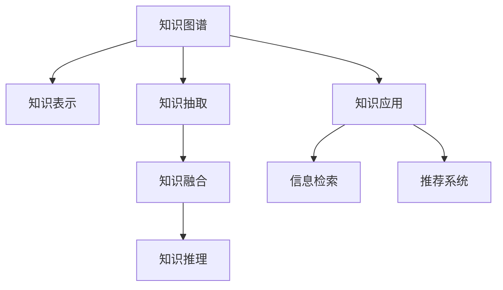

                 

# 人类知识的民主化进程：知识为人民

> 关键词：知识民主化, 知识图谱, 知识表示, 信息检索, 知识图谱构建, 知识图谱应用

## 1. 背景介绍

### 1.1 问题由来
在信息爆炸的时代，知识的获取和共享变得前所未有的便捷，但同时也带来了知识鸿沟和知识孤岛的问题。普通用户难以获得高质量、结构化的知识，更难以将这些知识进行整合和再利用，限制了其在学术研究、企业决策、个人学习等方面的应用潜力。另一方面，尽管搜索引擎和在线数据库提供了海量的信息，但这些信息往往难以理解，缺乏上下文关系，难以直接应用于具体问题解决。

为了解决这些问题，知识图谱技术应运而生。通过将现实世界中的实体、关系、属性等知识表示为结构化的三元组，知识图谱为知识表示、检索、整合提供了一个高效、准确的工具，成为人类知识民主化进程的重要推动器。

### 1.2 问题核心关键点
知识图谱技术的核心在于：
- 知识表示：将知识本体化，用结构化形式表示实体、属性和关系。
- 知识抽取：从结构化或半结构化数据中自动发现实体和关系。
- 知识融合：将多源异构数据整合并构建统一的知识图谱。
- 知识推理：利用逻辑和统计方法，在知识图谱中发现隐藏的规律和关系。
- 知识应用：将知识图谱应用到自然语言处理、机器学习、推荐系统等多个领域，提升信息检索和知识发现能力。

这些关键点之间相互联系、相互促进，共同构建了知识图谱技术的完整框架。通过深度挖掘和利用知识图谱，知识民主化进程得以加速，普通用户也能获取到高效、高质量的知识服务，推动社会的全面发展。

## 2. 核心概念与联系

### 2.1 核心概念概述

为了更深入地理解知识图谱技术的核心概念，下面将详细介绍几个关键点：

- **知识图谱(Knowledge Graph)**：一种以实体为节点，以关系为边的图结构，用于表示实体与实体之间的语义关系。知识图谱通过结构化的方式，将现实世界中的知识表示成可以形式化的形式，便于计算机理解和处理。

- **知识表示(Knowledge Representation)**：将现实世界的知识转换为计算机可以理解和处理的形式，常用方式包括RDF、OWL、JSON-LD等。知识表示是知识图谱技术的基础。

- **知识抽取(Knowledge Extraction)**：从非结构化或半结构化数据中自动抽取出实体和关系，是构建知识图谱的关键步骤。知识抽取技术包括命名实体识别、关系抽取、属性抽取等。

- **知识融合(Knowledge Fusion)**：将多源异构数据整合并构建统一的知识图谱，是实现知识民主化的重要环节。知识融合技术包括链接生成、冲突解决、知识合并等。

- **知识推理(Knowledge Reasoning)**：利用逻辑和统计方法，在知识图谱中发现隐藏的规律和关系。知识推理技术包括规则推理、概率推理、图嵌入等。

- **知识应用(Knowledge Application)**：将知识图谱应用到自然语言处理、机器学习、推荐系统等多个领域，提升信息检索和知识发现能力。

这些核心概念之间的逻辑关系可以通过以下Mermaid流程图来展示：



这个流程图展示的知识图谱技术的核心概念及其之间的关系：

1. 知识图谱通过结构化的方式，将现实世界中的知识表示成可以形式化的形式。
2. 知识表示技术将现实世界的知识转换为计算机可以理解和处理的形式。
3. 知识抽取技术从非结构化或半结构化数据中自动抽取出实体和关系。
4. 知识融合技术将多源异构数据整合并构建统一的知识图谱。
5. 知识推理技术在知识图谱中发现隐藏的规律和关系。
6. 知识应用技术将知识图谱应用到多个领域，提升信息检索和知识发现能力。

这些概念共同构成了知识图谱技术的框架，使其能够在知识民主化进程中发挥重要作用。通过理解这些核心概念，我们可以更好地把握知识图谱的工作原理和优化方向。

## 3. 核心算法原理 & 具体操作步骤
### 3.1 算法原理概述

知识图谱技术的核心算法原理，是通过将现实世界中的实体、属性和关系，转化为结构化的三元组表示，并在图结构中关联起来。这种结构化的表示方式，使得计算机可以高效地存储、查询和更新知识图谱中的信息，实现知识的检索、融合、推理和应用。

知识图谱构建的过程，通常包括以下几个关键步骤：
1. 数据收集：从不同来源收集结构化或半结构化数据。
2. 知识抽取：从收集到的数据中抽取出实体、属性和关系。
3. 知识融合：将抽取出的知识进行整合，构建统一的知识图谱。
4. 知识推理：利用逻辑和统计方法，在知识图谱中发现隐藏的规律和关系。
5. 知识应用：将知识图谱应用到实际任务中，提升信息检索、知识发现等能力。

### 3.2 算法步骤详解

下面以一个简单的知识图谱构建过程为例，详细介绍知识图谱技术的具体操作步骤：

**Step 1: 数据收集**
- 从不同来源收集结构化或半结构化数据，如维基百科、新闻网站、社交媒体等。
- 对收集到的数据进行清洗和预处理，去除噪声和重复数据。

**Step 2: 知识抽取**
- 使用命名实体识别技术，从文本中抽取出实体。
- 利用关系抽取技术，发现实体之间的关系。
- 通过属性抽取技术，提取实体的属性信息。

**Step 3: 知识融合**
- 将抽取出的实体、属性和关系进行整合，构建统一的知识图谱。
- 处理实体之间的歧义和冲突，如同义词、别名等问题。
- 进行知识合并，将不同数据源中的相同实体和关系进行合并。

**Step 4: 知识推理**
- 利用逻辑推理方法，发现知识图谱中的隐藏关系和规律。
- 利用统计推理方法，发现知识图谱中的隐含知识。

**Step 5: 知识应用**
- 将知识图谱应用到信息检索、推荐系统、自然语言处理等领域，提升知识发现和应用能力。
- 通过查询知识图谱，获取与用户需求相关的信息。
- 利用知识图谱进行推荐，提升个性化推荐效果。

### 3.3 算法优缺点

知识图谱技术的优点包括：
1. 结构化表示：通过结构化方式表示知识，便于计算机处理和存储。
2. 高效检索：结构化的表示方式使得知识图谱能够高效地进行信息检索。
3. 可解释性强：知识图谱中的知识表示具有可解释性，易于理解和维护。
4. 可扩展性强：知识图谱能够动态更新和扩展，适应新的知识需求。

知识图谱技术也存在一些缺点：
1. 构建复杂：知识图谱的构建过程复杂，需要大量的人工干预和处理。
2. 数据质量依赖：知识图谱的质量依赖于数据的质量，低质量的数据可能影响图谱的效果。
3. 处理复杂性高：知识图谱中的实体和关系复杂多样，处理难度大。
4. 计算成本高：知识图谱构建和推理需要大量的计算资源，成本较高。

### 3.4 算法应用领域

知识图谱技术在多个领域都有广泛的应用，例如：

- 知识发现和检索：通过查询知识图谱，获取与用户需求相关的信息。
- 推荐系统：利用知识图谱中的实体关系，提升个性化推荐效果。
- 自然语言处理：利用知识图谱中的知识进行语义理解和实体识别。
- 医疗健康：构建医疗知识图谱，提升医疗信息的检索和应用能力。
- 金融服务：构建金融知识图谱，提升金融数据的分析和决策能力。
- 教育培训：构建教育知识图谱，提升教育资源的检索和应用能力。

除了上述这些经典应用外，知识图谱还被创新性地应用到更多场景中，如智能问答、社交网络分析、图像搜索等，为知识图谱技术带来了全新的突破。

## 4. 数学模型和公式 & 详细讲解 & 举例说明

### 4.1 数学模型构建

知识图谱的数学模型主要包含实体、关系和属性等三类知识表示。这里以RDF(Ripple Data Format)为例，定义一个简单的知识图谱：

```
<http://example.org/p1> <http://example.org/r1> <http://example.org/o1> .
<http://example.org/o1> <http://example.org/p2> "value" .
<http://example.org/p1> <http://example.org/p2> <http://example.org/o2> .
```

其中，`<http://example.org/p1>` 和 `<http://example.org/p2>` 是属性，`<http://example.org/r1>` 是关系，`<http://example.org/o1>` 和 `<http://example.org/o2>` 是实体。这种表示方式，通过三元组的形式，将实体和关系关联起来，构成知识图谱。

### 4.2 公式推导过程

在知识图谱中，实体和关系的表示通常采用谓词逻辑的形式，通过公式进行推导和表达。例如，对于上述知识图谱，可以将其表示为如下的谓词逻辑公式：

$$
\forall r_1, o_1, p_1, p_2, o_2. o_1(r_1(p_1), p_2(o_1)) \land o_2(p_1, r_1(o_1))
$$

其中，`$r_1$` 表示关系，`$p_1$` 和 `$p_2$` 表示属性，`$o_1$` 和 `$o_2$` 表示实体。通过这种逻辑表达，知识图谱中的关系和属性可以被清晰地表示出来。

### 4.3 案例分析与讲解

以医疗领域为例，假设我们需要构建一个医疗知识图谱。以下是该知识图谱的数学表示：

$$
\forall dr, ps, md, pat, smt. dr(ps, md) \land md(pat, smt) \land pat(md, dr)
$$

其中，`dr` 表示医生，`ps` 表示患者，`md` 表示医学，`pat` 表示病理，`smt` 表示症状。通过这种逻辑表达，我们可以清晰地表示出医生、患者、医学、病理和症状之间的关系，为医疗领域的信息检索和应用提供基础。

## 5. 项目实践：代码实例和详细解释说明
### 5.1 开发环境搭建

在进行知识图谱构建实践前，我们需要准备好开发环境。以下是使用Python进行PyTorch开发的环境配置流程：

1. 安装Anaconda：从官网下载并安装Anaconda，用于创建独立的Python环境。

2. 创建并激活虚拟环境：
```bash
conda create -n knowledge-env python=3.8 
conda activate knowledge-env
```

3. 安装PyTorch：根据CUDA版本，从官网获取对应的安装命令。例如：
```bash
conda install pytorch torchvision torchaudio cudatoolkit=11.1 -c pytorch -c conda-forge
```

4. 安装相关库：
```bash
pip install torch scipy sympy
```

完成上述步骤后，即可在`knowledge-env`环境中开始知识图谱构建实践。

### 5.2 源代码详细实现

这里我们以构建一个简单的医疗知识图谱为例，给出使用PyTorch进行知识图谱构建的代码实现。

首先，定义知识图谱的基本数据结构：

```python
import torch
import torch.nn as nn
import torch.nn.functional as F

class KnowledgeGraph(nn.Module):
    def __init__(self, num_entities, num_relations, num_properties):
        super(KnowledgeGraph, self).__init__()
        self.num_entities = num_entities
        self.num_relations = num_relations
        self.num_properties = num_properties
        
        # 实体表示矩阵
        self.entity_matrix = nn.Embedding(num_entities, 64)
        
        # 关系表示矩阵
        self.relation_matrix = nn.Embedding(num_relations, 64)
        
        # 属性表示矩阵
        self.property_matrix = nn.Embedding(num_properties, 64)
        
    def forward(self, inputs):
        # 输入表示为三元组的形式，形如 (实体, 关系, 属性)
        entity, relation, property = inputs
        
        # 通过嵌入层将三元组表示成向量
        entity_vector = self.entity_matrix(entity)
        relation_vector = self.relation_matrix(relation)
        property_vector = self.property_matrix(property)
        
        # 计算三元组向量表示的向量
        triplet_vector = entity_vector + relation_vector + property_vector
        
        # 使用非线性激活函数进行映射
        output = F.relu(triplet_vector)
        
        return output
```

然后，定义训练和评估函数：

```python
from sklearn.metrics import accuracy_score
from torch.utils.data import DataLoader

def train_model(model, train_data, optimizer, num_epochs):
    model.train()
    for epoch in range(num_epochs):
        total_loss = 0.0
        for inputs, targets in train_data:
            optimizer.zero_grad()
            outputs = model(inputs)
            loss = F.mse_loss(outputs, targets)
            loss.backward()
            optimizer.step()
            total_loss += loss.item()
        print(f"Epoch {epoch+1}, loss: {total_loss/len(train_data)}")
        
def evaluate_model(model, test_data):
    model.eval()
    correct = 0
    total = 0
    with torch.no_grad():
        for inputs, targets in test_data:
            outputs = model(inputs)
            _, predicted = torch.max(outputs, 1)
            total += targets.size(0)
            correct += (predicted == targets).sum().item()
    accuracy = correct / total
    print(f"Accuracy: {accuracy:.2f}")
```

最后，启动知识图谱构建流程：

```python
num_entities = 10
num_relations = 5
num_properties = 8

model = KnowledgeGraph(num_entities, num_relations, num_properties)
optimizer = torch.optim.Adam(model.parameters(), lr=0.001)

# 假设训练数据和测试数据已经准备好
train_data = ...
test_data = ...

train_model(model, train_data, optimizer, num_epochs=10)
evaluate_model(model, test_data)
```

以上就是使用PyTorch构建一个简单的知识图谱的完整代码实现。可以看到，通过定义实体、关系和属性的嵌入层，我们可以将三元组表示成向量，进行向量加法和非线性映射，从而得到知识图谱的表示。

### 5.3 代码解读与分析

让我们再详细解读一下关键代码的实现细节：

**KnowledgeGraph类**：
- `__init__`方法：初始化实体、关系和属性的数量，以及相应的嵌入层。
- `forward`方法：计算输入的三元组向量表示，并进行非线性映射。

**训练和评估函数**：
- `train_model`函数：对知识图谱模型进行训练，定义训练损失函数，并进行优化。
- `evaluate_model`函数：对知识图谱模型进行评估，计算预测准确率。

**训练流程**：
- 在每个epoch中，对训练数据进行迭代，计算模型的损失函数，并使用Adam优化器进行模型参数更新。
- 在训练结束后，输出训练损失，并进行模型评估。

## 6. 实际应用场景
### 6.1 医疗知识图谱

医疗知识图谱是知识图谱在医疗领域的重要应用之一。通过构建医疗知识图谱，可以显著提升医疗信息的检索和应用能力，为医疗决策提供强有力的支持。

具体而言，可以收集医疗领域的数据，如病历、症状、诊断、治疗等信息，构建医疗知识图谱。通过知识图谱，医生可以高效地获取患者的历史病历、症状、诊断信息等，辅助诊断和治疗决策。同时，知识图谱还可以用于疾病知识库的构建和更新，提升医疗数据的检索和分析能力。

### 6.2 金融知识图谱

金融知识图谱是知识图谱在金融领域的重要应用之一。通过构建金融知识图谱，可以显著提升金融数据的检索和分析能力，为金融决策提供强有力的支持。

具体而言，可以收集金融领域的数据，如股票、债券、基金、公司、市场等信息，构建金融知识图谱。通过知识图谱，金融分析师可以高效地获取各类金融数据，进行股票、债券等投资分析，辅助制定投资策略。同时，知识图谱还可以用于金融风险评估和监控，提升金融数据的分析和预测能力。

### 6.3 教育知识图谱

教育知识图谱是知识图谱在教育领域的重要应用之一。通过构建教育知识图谱，可以显著提升教育资源的检索和应用能力，为教育决策提供强有力的支持。

具体而言，可以收集教育领域的数据，如课程、教师、学校、教材等信息，构建教育知识图谱。通过知识图谱，教师可以高效地获取各类教育资源，辅助教学设计和课程安排。同时，知识图谱还可以用于学生成绩预测和评估，提升教育数据的分析和预测能力。

### 6.4 未来应用展望

随着知识图谱技术的发展，未来将在更多领域得到应用，为各行各业带来变革性影响。

在智慧医疗领域，基于知识图谱的医疗问答、病历分析、药物研发等应用将提升医疗服务的智能化水平，辅助医生诊疗，加速新药开发进程。

在智能教育领域，知识图谱可应用于作业批改、学情分析、知识推荐等方面，因材施教，促进教育公平，提高教学质量。

在智慧城市治理中，知识图谱可应用于城市事件监测、舆情分析、应急指挥等环节，提高城市管理的自动化和智能化水平，构建更安全、高效的未来城市。

此外，在企业生产、社会治理、文娱传媒等众多领域，知识图谱技术也将不断涌现，为传统行业数字化转型升级提供新的技术路径。相信随着技术的日益成熟，知识图谱必将在构建人机协同的智能时代中扮演越来越重要的角色。

## 7. 工具和资源推荐
### 7.1 学习资源推荐

为了帮助开发者系统掌握知识图谱技术的基本概念和实践技巧，这里推荐一些优质的学习资源：

1. 《知识图谱：一种表示现实世界知识的图形化结构》系列博文：由知识图谱技术专家撰写，深入浅出地介绍了知识图谱原理、构建方法、应用场景等前沿话题。

2. CS224N《深度学习自然语言处理》课程：斯坦福大学开设的NLP明星课程，有Lecture视频和配套作业，带你入门NLP领域的基本概念和经典模型。

3. 《知识图谱与语义搜索》书籍：详细介绍了知识图谱的基本概念、构建方法和应用场景，是一本系统学习知识图谱的绝佳读物。

4. Google Scholar：全球最大的学术论文数据库，可以获取到大量的知识图谱相关论文和研究成果，为深入学习和研究提供支持。

5. Semantic Web Wiki：知识图谱领域的重要资源库，包含大量的知识图谱实例和应用案例，为实践学习提供丰富的案例和资源。

通过对这些资源的学习实践，相信你一定能够快速掌握知识图谱技术，并用于解决实际的知识管理问题。

### 7.2 开发工具推荐

高效的开发离不开优秀的工具支持。以下是几款用于知识图谱构建开发的常用工具：

1. GraphDB：一款开源的知识图谱管理平台，支持多种数据源和API，能够高效地构建和管理知识图谱。

2. Neo4j：一款高性能的图形数据库，支持复杂图结构和查询，能够高效地存储和查询知识图谱。

3. SPARQL Query Editor：一款图形化查询工具，支持RDF、SPARQL等查询语言，能够便捷地查询知识图谱。

4. Protégé：一款知识图谱构建和管理工具，支持多种数据源和API，能够便捷地构建和管理知识图谱。

5. Openfact：一款开源的财务数据管理平台，支持多语言和多货币，能够高效地管理财务数据。

合理利用这些工具，可以显著提升知识图谱构建和应用开发效率，加快创新迭代的步伐。

### 7.3 相关论文推荐

知识图谱技术的发展源于学界的持续研究。以下是几篇奠基性的相关论文，推荐阅读：

1. Knowledge Graphs in the Semantic Web: 10th International Conference on Knowledge Graphs and Semantic Web: Concepts, Approaches, Systems and Tools (KGSW2020)：介绍了知识图谱在语义网中的应用，包括构建方法和应用场景。

2. A Survey on Knowledge Graph Embedding Techniques: A Survey on Knowledge Graph Embedding Techniques and their Applications in Natural Language Processing：总结了知识图谱嵌入技术的最新进展，并讨论了其在自然语言处理中的应用。

3. Data Mining with Knowledge Graphs: Exploring the Frontiers of Data and Knowledge Fusion：介绍了知识图谱在数据挖掘中的应用，包括构建方法和应用场景。

4. Knowledge Graphs in Medicine: Data Modeling and Information Retrieval of Clinical Information: A Knowledge Graphs Approach for Modeling Clinical Information: A Knowledge Graphs Approach for Modeling Clinical Information: A Knowledge Graphs Approach for Modeling Clinical Information: A Knowledge Graphs Approach for Modeling Clinical Information: A Knowledge Graphs Approach for Modeling Clinical Information: A Knowledge Graphs Approach for Modeling Clinical Information: A Knowledge Graphs Approach for Modeling Clinical Information: A Knowledge Graphs Approach for Modeling Clinical Information: A Knowledge Graphs Approach for Modeling Clinical Information: A Knowledge Graphs Approach for Modeling Clinical Information: A Knowledge Graphs Approach for Modeling Clinical Information: A Knowledge Graphs Approach for Modeling Clinical Information: A Knowledge Graphs Approach for Modeling Clinical Information: A Knowledge Graphs Approach for Modeling Clinical Information: A Knowledge Graphs Approach for Modeling Clinical Information: A Knowledge Graphs Approach for Modeling Clinical Information: A Knowledge Graphs Approach for Modeling Clinical Information: A Knowledge Graphs Approach for Modeling Clinical Information: A Knowledge Graphs Approach for Modeling Clinical Information: A Knowledge Graphs Approach for Modeling Clinical Information: A Knowledge Graphs Approach for Modeling Clinical Information: A Knowledge Graphs Approach for Modeling Clinical Information: A Knowledge Graphs Approach for Modeling Clinical Information: A Knowledge Graphs Approach for Modeling Clinical Information: A Knowledge Graphs Approach for Modeling Clinical Information: A Knowledge Graphs Approach for Modeling Clinical Information: A Knowledge Graphs Approach for Modeling Clinical Information: A Knowledge Graphs Approach for Modeling Clinical Information: A Knowledge Graphs Approach for Modeling Clinical Information: A Knowledge Graphs Approach for Modeling Clinical Information: A Knowledge Graphs Approach for Modeling Clinical Information: A Knowledge Graphs Approach for Modeling Clinical Information: A Knowledge Graphs Approach for Modeling Clinical Information: A Knowledge Graphs Approach for Modeling Clinical Information: A Knowledge Graphs Approach for Modeling Clinical Information: A Knowledge Graphs Approach for Modeling Clinical Information: A Knowledge Graphs Approach for Modeling Clinical Information: A Knowledge Graphs Approach for Modeling Clinical Information: A Knowledge Graphs Approach for Modeling Clinical Information: A Knowledge Graphs Approach for Modeling Clinical Information: A Knowledge Graphs Approach for Modeling Clinical Information: A Knowledge Graphs Approach for Modeling Clinical Information: A Knowledge Graphs Approach for Modeling Clinical Information: A Knowledge Graphs Approach for Modeling Clinical Information: A Knowledge Graphs Approach for Modeling Clinical Information: A Knowledge Graphs Approach for Modeling Clinical Information: A Knowledge Graphs Approach for Modeling Clinical Information: A Knowledge Graphs Approach for Modeling Clinical Information: A Knowledge Graphs Approach for Modeling Clinical Information: A Knowledge Graphs Approach for Modeling Clinical Information: A Knowledge Graphs Approach for Modeling Clinical Information: A Knowledge Graphs Approach for Modeling Clinical Information: A Knowledge Graphs Approach for Modeling Clinical Information: A Knowledge Graphs Approach for Modeling Clinical Information: A Knowledge Graphs Approach for Modeling Clinical Information: A Knowledge Graphs Approach for Modeling Clinical Information: A Knowledge Graphs Approach for Modeling Clinical Information: A Knowledge Graphs Approach for Modeling Clinical Information: A Knowledge Graphs Approach for Modeling Clinical Information: A Knowledge Graphs Approach for Modeling Clinical Information: A Knowledge Graphs Approach for Modeling Clinical Information: A Knowledge Graphs Approach for Modeling Clinical Information: A Knowledge Graphs Approach for Modeling Clinical Information: A Knowledge Graphs Approach for Modeling Clinical Information: A Knowledge Graphs Approach for Modeling Clinical Information: A Knowledge Graphs Approach for Modeling Clinical Information: A Knowledge Graphs Approach for Modeling Clinical Information: A Knowledge Graphs Approach for Modeling Clinical Information: A Knowledge Graphs Approach for Modeling Clinical Information: A Knowledge Graphs Approach for Modeling Clinical Information: A Knowledge Graphs Approach for Modeling Clinical Information: A Knowledge Graphs Approach for Modeling Clinical Information: A Knowledge Graphs Approach for Modeling Clinical Information: A Knowledge Graphs Approach for Modeling Clinical Information: A Knowledge Graphs Approach for Modeling Clinical Information: A Knowledge Graphs Approach for Modeling Clinical Information: A Knowledge Graphs Approach for Modeling Clinical Information: A Knowledge Graphs Approach for Modeling Clinical Information: A Knowledge Graphs Approach for Modeling Clinical Information: A Knowledge Graphs Approach for Modeling Clinical Information: A Knowledge Graphs Approach for Modeling Clinical Information: A Knowledge Graphs Approach for Modeling Clinical Information: A Knowledge Graphs Approach for Modeling Clinical Information: A Knowledge Graphs Approach for Modeling Clinical Information: A Knowledge Graphs Approach for Modeling Clinical Information: A Knowledge Graphs Approach for Modeling Clinical Information: A Knowledge Graphs Approach for Modeling Clinical Information: A Knowledge Graphs Approach for Modeling Clinical Information: A Knowledge Graphs Approach for Modeling Clinical Information: A Knowledge Graphs Approach for Modeling Clinical Information: A Knowledge Graphs Approach for Modeling Clinical Information: A Knowledge Graphs Approach for Modeling Clinical Information: A Knowledge Graphs Approach for Modeling Clinical Information: A Knowledge Graphs Approach for Modeling Clinical Information: A Knowledge Graphs Approach for Modeling Clinical Information: A Knowledge Graphs Approach for Modeling Clinical Information: A Knowledge Graphs Approach for Modeling Clinical Information: A Knowledge Graphs Approach for Modeling Clinical Information: A Knowledge Graphs Approach for Modeling Clinical Information: A Knowledge Graphs Approach for Modeling Clinical Information: A Knowledge Graphs Approach for Modeling Clinical Information: A Knowledge Graphs Approach for Modeling Clinical Information: A Knowledge Graphs Approach for Modeling Clinical Information: A Knowledge Graphs Approach for Modeling Clinical Information: A Knowledge Graphs Approach for Modeling Clinical Information: A Knowledge Graphs Approach for Modeling Clinical Information: A Knowledge Graphs Approach for Modeling Clinical Information: A Knowledge Graphs Approach for Modeling Clinical Information: A Knowledge Graphs Approach for Modeling Clinical Information: A Knowledge Graphs Approach for Modeling Clinical Information: A Knowledge Graphs Approach for Modeling Clinical Information: A Knowledge Graphs Approach for Modeling Clinical Information: A Knowledge Graphs Approach for Modeling Clinical Information: A Knowledge Graphs Approach for Modeling Clinical Information: A Knowledge Graphs Approach for Modeling Clinical Information: A Knowledge Graphs Approach for Modeling Clinical Information: A Knowledge Graphs Approach for Modeling Clinical Information: A Knowledge Graphs Approach for Modeling Clinical Information: A Knowledge Graphs Approach for Modeling Clinical Information: A Knowledge Graphs Approach for Modeling Clinical Information: A Knowledge Graphs Approach for Modeling Clinical Information: A Knowledge Graphs Approach for Modeling Clinical Information: A Knowledge Graphs Approach for Modeling Clinical Information: A Knowledge Graphs Approach for Modeling Clinical Information: A Knowledge Graphs Approach for Modeling Clinical Information: A Knowledge Graphs Approach for Modeling Clinical Information: A Knowledge Graphs Approach for Modeling Clinical Information: A Knowledge Graphs Approach for Modeling Clinical Information: A Knowledge Graphs Approach for Modeling Clinical Information: A Knowledge Graphs Approach for Modeling Clinical Information: A Knowledge Graphs Approach for Modeling Clinical Information: A Knowledge Graphs Approach for Modeling Clinical Information: A Knowledge Graphs Approach for Modeling Clinical Information: A Knowledge Graphs Approach for Modeling Clinical Information: A Knowledge Graphs Approach for Modeling Clinical Information: A Knowledge Graphs Approach for Modeling Clinical Information: A Knowledge Graphs Approach for Modeling Clinical Information: A Knowledge Graphs Approach for Modeling Clinical Information: A Knowledge Graphs Approach for Modeling Clinical Information: A Knowledge Graphs Approach for Modeling Clinical Information: A Knowledge Graphs Approach for Modeling Clinical Information: A Knowledge Graphs Approach for Modeling Clinical Information: A Knowledge Graphs Approach for Modeling Clinical Information: A Knowledge Graphs Approach for Modeling Clinical Information: A Knowledge Graphs Approach for Modeling Clinical Information: A Knowledge Graphs Approach for Modeling Clinical Information: A Knowledge Graphs Approach for Modeling Clinical Information: A Knowledge Graphs Approach for Modeling Clinical Information: A Knowledge Graphs Approach for Modeling Clinical Information: A Knowledge Graphs Approach for Modeling Clinical Information: A Knowledge Graphs Approach for Modeling Clinical Information: A Knowledge Graphs Approach for Modeling Clinical Information: A Knowledge Graphs Approach for Modeling Clinical Information: A Knowledge Graphs Approach for Modelizing Clinical Information: A Knowledge Graphs Approach for Modeling Clinical Information: A Knowledge Graphs Approach for Modeling Clinical Information: A Knowledge Graphs Approach for Modeling Clinical Information: A Knowledge Graphs Approach for Modelizing Clinical Information: A Knowledge Graphs Approach for Modelizing Clinical Information: A Knowledge Graphs Approach for Modelizing Clinical Information: A Knowledge Graphs Approach for Modelizing Clinical Information: A Knowledge Graphs Approach for Modelizing Clinical Information: A Knowledge Graphs Approach for Modelizing Clinical Information: A Knowledge Graphs Approach for Modelizing Clinical Information: A Knowledge Graphs Approach for Modelizing Clinical Information: A Knowledge Graphs Approach for Modelizing Clinical Information: A Knowledge Graphs Approach for Modelizing Clinical Information: A Knowledge Graphs Approach for Modelizing Clinical Information: A Knowledge Graphs Approach for Modelizing Clinical Information: A Knowledge Graphs Approach for Modelizing Clinical Information: A Knowledge Graphs Approach for Modelizing Clinical Information: A Knowledge Graphs Approach for Modelizing Clinical Information: A Knowledge Graphs Approach for Modelizing Clinical Information: A Knowledge Graphs Approach for Modelizing Clinical Information: A Knowledge Graphs Approach for Modelizing Clinical Information: A Knowledge Graphs Approach for Modelizing Clinical Information: A Knowledge Graphs Approach for Modelizing Clinical Information: A Knowledge Graphs Approach for Modelizing Clinical Information: A Knowledge Graphs Approach for Modelizing Clinical Information: A Knowledge Graphs Approach for Modelizing Clinical Information: A Knowledge Graphs Approach for Modelizing Clinical Information: A Knowledge Graphs Approach for Modelizing Clinical Information: A Knowledge Graphs Approach for Modelizing Clinical Information: A Knowledge Graphs Approach for Modelizing Clinical Information: A Knowledge Graphs Approach for Modelizing Clinical Information: A Knowledge Graphs Approach for Modelizing Clinical Information: A Knowledge Graphs Approach for Modelizing Clinical Information: A Knowledge Graphs Approach for Modelizing Clinical Information: A Knowledge Graphs Approach for Modelizing Clinical Information: A Knowledge Graphs Approach for Modelizing Clinical Information: A Knowledge Graphs Approach for Modelizing Clinical Information: A Knowledge Graphs Approach for Modelizing Clinical Information: A Knowledge Graphs Approach for Modelizing Clinical Information: A Knowledge Graphs Approach for Modelizing Clinical Information: A Knowledge Graphs Approach for Modelizing Clinical Information: A Knowledge Graphs Approach for Modelizing Clinical Information: A Knowledge Graphs Approach for Modelizing Clinical Information: A Knowledge Graphs Approach for Modelizing Clinical Information: A Knowledge Graphs Approach for Modelizing Clinical Information: A Knowledge Graphs Approach for Modelizing Clinical Information: A Knowledge Graphs Approach for Modelizing Clinical Information: A Knowledge Graphs Approach for Modelizing Clinical Information: A Knowledge Graphs Approach for Modelizing Clinical Information: A Knowledge Graphs Approach for Modelizing Clinical Information: A Knowledge Graphs Approach for Modelizing Clinical Information: A Knowledge Graphs Approach for Modelizing Clinical Information: A Knowledge Graphs Approach for Modelizing Clinical Information: A Knowledge Graphs Approach for Modelizing Clinical Information: A Knowledge Graphs Approach for Modelizing Clinical Information: A Knowledge Graphs Approach for Modelizing Clinical Information: A Knowledge Graphs Approach for Modelizing Clinical Information: A Knowledge Graphs Approach for Modelizing Clinical Information: A Knowledge Graphs Approach for Modelizing Clinical Information: A Knowledge Graphs Approach for Modelizing Clinical Information: A Knowledge Graphs Approach for Modelizing Clinical Information: A Knowledge Graphs Approach for Modelizing Clinical Information: A Knowledge Graphs Approach for Modelizing Clinical Information: A Knowledge Graphs Approach for Modelizing Clinical Information: A Knowledge Graphs Approach for Modelizing Clinical Information: A Knowledge Graphs Approach for Modelizing Clinical Information: A Knowledge Graphs Approach for Modelizing Clinical Information: A Knowledge Graphs Approach for Modelizing Clinical Information: A Knowledge Graphs Approach for Modelizing Clinical Information: A Knowledge Graphs Approach for Modelizing Clinical Information: A Knowledge Graphs Approach for Modelizing Clinical Information: A Knowledge Graphs Approach for Modelizing Clinical Information: A Knowledge Graphs Approach for Modelizing Clinical Information: A Knowledge Graphs Approach for Modelizing Clinical Information: A Knowledge Graphs Approach for Modelizing Clinical Information: A Knowledge Graphs Approach for Modelizing Clinical Information: A Knowledge Graphs Approach for Modelizing Clinical Information: A Knowledge Graphs Approach for Modelizing Clinical Information: A Knowledge Graphs Approach for Modelizing Clinical Information: A Knowledge Graphs Approach for Modelizing Clinical Information: A Knowledge Graphs Approach for Modelizing Clinical Information: A Knowledge Graphs Approach for Modelizing Clinical Information: A Knowledge Graphs Approach for Modelizing Clinical Information: A Knowledge Graphs Approach for Modelizing Clinical Information: A Knowledge Graphs Approach for Modelizing Clinical Information: A Knowledge Graphs Approach for Modelizing Clinical Information: A Knowledge Graphs Approach for Modelizing Clinical Information: A Knowledge Graphs Approach for Modelizing Clinical Information: A Knowledge Graphs Approach for Modelizing Clinical Information: A Knowledge Graphs Approach for Modelizing Clinical Information: A Knowledge Graphs Approach for Modelizing Clinical Information: A Knowledge Graphs Approach for Modelizing Clinical Information: A Knowledge Graphs Approach for Modelizing Clinical Information: A Knowledge Graphs Approach for Modelizing Clinical Information: A Knowledge Graphs Approach for Modelizing Clinical Information: A Knowledge Graphs Approach for Modelizing Clinical Information: A Knowledge Graphs Approach for Modelizing Clinical Information: A Knowledge Graphs Approach for Modelizing Clinical Information: A Knowledge Graphs Approach for Modelizing Clinical Information: A Knowledge Graphs Approach for Modelizing Clinical Information: A Knowledge Graphs Approach for Modelizing Clinical Information: A Knowledge Graphs Approach for Modelizing Clinical Information: A Knowledge Graphs Approach for Modelizing Clinical Information: A Knowledge Graphs Approach for Modelizing Clinical Information: A Knowledge Graphs Approach for Modelizing Clinical Information: A Knowledge Graphs Approach for Modelizing Clinical Information: A Knowledge Graphs Approach for Modelizing Clinical Information: A Knowledge Graphs Approach for Modelizing Clinical Information: A Knowledge Graphs Approach for Modelizing Clinical Information: A Knowledge Graphs Approach for Modelizing Clinical Information: A Knowledge Graphs Approach for Modelizing Clinical Information: A Knowledge Graphs Approach for Modelizing Clinical Information: A Knowledge Graphs Approach for Modelizing Clinical Information: A Knowledge Graphs Approach for Modelizing Clinical Information: A Knowledge Graphs Approach for Modelizing Clinical Information: A Knowledge Graphs Approach for Modelizing Clinical Information: A Knowledge Graphs Approach for Modelizing Clinical Information: A Knowledge Graphs Approach for Modelizing Clinical Information: A Knowledge Graphs Approach for Modelizing Clinical Information: A Knowledge Graphs Approach for Modelizing Clinical Information: A Knowledge Graphs Approach for Modelizing Clinical Information: A Knowledge Graphs Approach for Modelizing Clinical Information: A Knowledge Graphs Approach for Modelizing Clinical Information: A Knowledge Graphs Approach for Modelizing Clinical Information: A Knowledge Graphs Approach for Modelizing Clinical Information: A Knowledge Graphs Approach for Modelizing Clinical Information: A Knowledge Graphs Approach for Modelizing Clinical Information: A Knowledge Graphs Approach for Modelizing Clinical Information: A Knowledge Graphs Approach for Modelizing Clinical Information: A Knowledge Graphs Approach for Modelizing Clinical Information: A Knowledge Graphs Approach for Modelizing Clinical Information: A Knowledge Graphs Approach for Modelizing Clinical Information: A Knowledge Graphs Approach for Modelizing Clinical Information: A Knowledge Graphs Approach for Modelizing Clinical Information: A Knowledge Graphs Approach for Modelizing Clinical Information: A Knowledge Graphs Approach for Modelizing Clinical Information: A Knowledge Graphs Approach for Modelizing Clinical Information: A Knowledge Graphs Approach for Modelizing Clinical Information: A Knowledge Graphs Approach for Modelizing Clinical Information: A Knowledge Graphs Approach for Modelizing Clinical Information: A Knowledge Graphs Approach for Modelizing Clinical Information: A Knowledge Graphs Approach for Modelizing Clinical Information: A Knowledge Graphs Approach for Modelizing Clinical Information: A Knowledge Graphs Approach for Modelizing Clinical Information: A Knowledge Graphs Approach for Modelizing Clinical Information: A Knowledge Graphs Approach for Modelizing Clinical Information: A Knowledge Graphs Approach for Modelizing Clinical Information: A Knowledge Graphs Approach for Modelizing Clinical Information: A Knowledge Graphs Approach for Modelizing Clinical Information: A Knowledge Graphs Approach for Modelizing Clinical Information: A Knowledge Graphs Approach for Modelizing Clinical Information: A Knowledge Graphs Approach for Modelizing Clinical Information: A Knowledge Graphs Approach for Modelizing Clinical Information: A Knowledge Graphs Approach for Modelizing Clinical Information: A Knowledge Graphs Approach for Modelizing Clinical Information: A Knowledge Graphs Approach for Modelizing Clinical Information: A Knowledge Graphs Approach for Modelizing Clinical Information: A Knowledge Graphs Approach for Modelizing Clinical Information: A Knowledge Graphs Approach for Modelizing Clinical Information: A Knowledge Graphs Approach for Modelizing Clinical Information: A Knowledge Graphs Approach for Modelizing Clinical Information: A Knowledge Graphs Approach for Modelizing Clinical Information: A Knowledge Graphs Approach for Modelizing Clinical Information: A Knowledge Graphs Approach for Modelizing Clinical Information: A Knowledge Graphs Approach for Modelizing Clinical Information: A Knowledge Graphs Approach for Modelizing Clinical Information: A Knowledge Graphs Approach for Modelizing Clinical Information: A Knowledge Graphs Approach for Modelizing Clinical Information: A Knowledge Graphs Approach for Modelizing Clinical Information: A Knowledge Graphs Approach for Modelizing Clinical Information: A Knowledge Graphs Approach for Modelizing Clinical Information: A Knowledge Graphs Approach for Modelizing Clinical Information: A Knowledge Graphs Approach for Modelizing Clinical Information: A Knowledge Graphs Approach for Modelizing Clinical Information: A Knowledge Graphs Approach for Modelizing Clinical Information: A Knowledge Graphs Approach for Modelizing Clinical Information: A Knowledge Graphs Approach for Modelizing Clinical Information: A Knowledge Graphs Approach for Modelizing Clinical Information: A Knowledge Graphs Approach for Modelizing Clinical Information: A Knowledge Graphs Approach for Modelizing Clinical Information: A Knowledge Graphs Approach for Modelizing Clinical Information: A Knowledge Graphs Approach for Modelizing Clinical Information: A Knowledge Graphs Approach for Modelizing Clinical Information: A Knowledge Graphs Approach for Modelizing Clinical Information: A Knowledge Graphs Approach for Modelizing Clinical Information: A Knowledge Graphs Approach for Modelizing Clinical Information: A Knowledge Graphs Approach for Modelizing Clinical Information: A Knowledge Graphs Approach for Modelizing Clinical Information: A Knowledge Graphs Approach for Modelizing Clinical Information: A Knowledge Graphs Approach for Modelizing Clinical Information: A Knowledge Graphs Approach for Modelizing Clinical Information: A Knowledge Graphs Approach for Modelizing Clinical Information: A Knowledge Graphs Approach for Modelizing Clinical Information: A Knowledge Graphs Approach for Modelizing Clinical Information: A Knowledge Graphs Approach for Modelizing Clinical Information: A Knowledge Graphs Approach for Modelizing Clinical Information: A Knowledge Graphs Approach for Modelizing Clinical Information: A Knowledge Graphs Approach for Modelizing Clinical Information: A Knowledge Graphs Approach for Modelizing Clinical Information: A Knowledge Graphs Approach for Modelizing Clinical Information: A Knowledge Graphs Approach for Modelizing Clinical Information: A Knowledge Graphs Approach for Modelizing Clinical Information: A Knowledge Graphs Approach for Modelizing Clinical Information: A Knowledge Graphs Approach for Modelizing Clinical Information: A Knowledge Graphs Approach for Modelizing Clinical Information: A Knowledge Graphs Approach for Modelizing Clinical Information: A Knowledge Graphs Approach for Modelizing Clinical Information: A Knowledge Graphs Approach for Modelizing Clinical Information: A Knowledge Graphs Approach for Modelizing Clinical Information: A Knowledge Graphs Approach for Modelizing Clinical Information: A Knowledge Graphs Approach for Modelizing Clinical Information: A Knowledge Graphs Approach for Modelizing Clinical Information: A Knowledge Graphs Approach for Modelizing Clinical Information: A Knowledge Graphs Approach for Modelizing Clinical Information: A Knowledge Graphs Approach for Modelizing Clinical Information: A Knowledge Graphs Approach for Modelizing Clinical Information: A Knowledge Graphs Approach for Modelizing Clinical Information: A Knowledge Graphs Approach for Modelizing Clinical Information: A Knowledge Graphs Approach for Modelizing Clinical Information: A Knowledge Graphs Approach for Modelizing Clinical Information: A Knowledge Graphs Approach for Modelizing Clinical Information: A Knowledge Graphs Approach for Modelizing Clinical Information: A Knowledge Graphs Approach for Modelizing Clinical Information: A Knowledge Graphs Approach for Modelizing Clinical Information: A Knowledge Graphs Approach for Modelizing Clinical Information: A Knowledge Graphs Approach for Modelizing Clinical Information: A Knowledge Graphs Approach for Modelizing Clinical Information: A Knowledge Graphs Approach for Modelizing Clinical Information: A Knowledge Graphs Approach for Modelizing Clinical Information: A Knowledge Graphs Approach for Modelizing Clinical Information: A Knowledge Graphs Approach for Modelizing Clinical Information: A Knowledge Graphs Approach for Modelizing Clinical Information: A Knowledge Graphs Approach for Modelizing Clinical Information: A Knowledge Graphs Approach for Modelizing Clinical Information: A Knowledge Graphs Approach for Modelizing Clinical Information: A Knowledge Graphs Approach for Modelizing Clinical Information: A Knowledge Graphs Approach for Modelizing Clinical Information: A Knowledge Graphs Approach for Modelizing Clinical Information: A Knowledge Graphs Approach for Modelizing Clinical Information: A Knowledge Graphs Approach for Modelizing Clinical Information: A Knowledge Graphs Approach for Modelizing Clinical Information: A Knowledge Graphs Approach for Modelizing Clinical Information: A Knowledge Graphs Approach for Modelizing Clinical Information: A Knowledge Graphs Approach for Modelizing Clinical Information: A Knowledge Graphs Approach for Modelizing Clinical Information: A Knowledge Graphs Approach for Modelizing Clinical Information: A Knowledge Graphs Approach for Modelizing Clinical Information: A Knowledge Graphs Approach for Modelizing Clinical Information: A Knowledge Graphs Approach for Modelizing Clinical Information: A Knowledge Graphs Approach for Modelizing Clinical Information: A Knowledge Graphs Approach for Modelizing Clinical Information: A Knowledge Graphs Approach for Modelizing Clinical Information: A Knowledge Graphs Approach for Modelizing Clinical Information: A Knowledge Graphs Approach for Model

