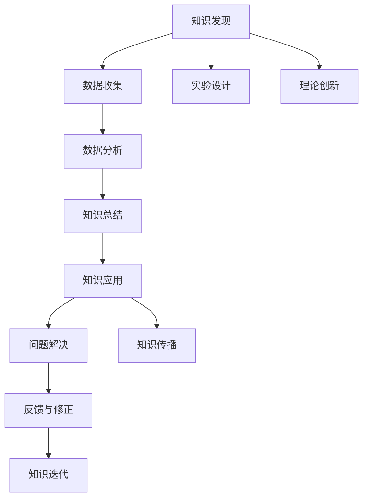

                 

# 人类知识的进步史：一部人类探索史

## 1. 背景介绍

人类知识的进步史，是一部波澜壮阔的探索史。从远古的石刀木剑，到今日的智能算法，人类智慧的火花从未熄灭。本文将追溯人类知识的进步史，探讨不同阶段的探索活动，揭示知识的本质与智慧的奥秘。

## 2. 核心概念与联系

### 2.1 核心概念概述

1. **知识的本质**：知识是人类智慧的结晶，是对客观世界的认知和总结。从物理定律到数学定理，从哲学思想到社会科学，知识无处不在。

2. **知识发现**：知识发现是指从大量数据中提取有用信息，形成新知识的过程。这一过程依赖于观察、实验、推理和归纳。

3. **知识应用**：知识应用是将已有知识应用于新情境，解决实际问题的过程。这需要创新思维和实践智慧。

4. **知识传播**：知识传播是将知识从个体或小群体向更广泛的社会传播，让更多人受益的过程。通过书籍、教育、媒体等多种方式。

5. **知识迭代**：知识迭代是指知识不断更新和完善的过程，通过科学实验、经验积累和理论创新实现。

### 2.2 核心概念原理和架构的 Mermaid 流程图



## 3. 核心算法原理 & 具体操作步骤

### 3.1 算法原理概述

知识发现和应用的过程，可以抽象为一种算法。该算法依赖于数据、模型、计算资源等多个要素，涉及数据预处理、模型选择、训练和优化等多个步骤。

知识发现的核心算法包括：

1. **数据挖掘**：从大规模数据中发现模式和规律。常用的算法有K-means聚类、决策树、随机森林、神经网络等。

2. **自然语言处理**：处理和分析自然语言文本，提取语义信息。常用的算法有TF-IDF、词嵌入、Transformer模型等。

3. **机器学习**：通过训练数据构建模型，预测新数据。常用的算法有支持向量机、逻辑回归、深度学习等。

4. **深度学习**：使用多层神经网络模型进行复杂任务。常用的算法有卷积神经网络、循环神经网络、自编码器等。

### 3.2 算法步骤详解

知识发现的算法步骤如下：

1. **数据收集与预处理**：收集相关数据，进行清洗、标注、归一化等预处理。

2. **特征提取与选择**：从原始数据中提取关键特征，选择最相关特征用于模型训练。

3. **模型训练与优化**：使用训练数据对模型进行训练，通过交叉验证等方法优化模型参数。

4. **模型评估与选择**：使用测试数据评估模型性能，选择最优模型。

5. **知识应用与验证**：将模型应用于新数据，验证其有效性和鲁棒性。

### 3.3 算法优缺点

知识发现算法的优点：

1. **自动化**：可以自动从数据中提取有用的信息，无需人工干预。

2. **可扩展性**：适用于大规模数据集，可以处理多变量、非线性问题。

3. **灵活性**：可以应用到多种领域，如金融、医疗、电商等。

4. **高效性**：使用机器学习模型可以在短时间内发现规律，提高决策效率。

5. **可解释性**：深度学习模型虽然黑盒，但可以通过可视化、特征重要性分析等方法提高可解释性。

知识发现算法的缺点：

1. **数据质量要求高**：数据质量、标注质量直接影响模型性能。

2. **模型复杂度高**：复杂的模型容易过拟合，需要大量的数据和计算资源。

3. **知识解释困难**：某些深度学习模型缺乏可解释性，难以解释其决策过程。

4. **需要专家指导**：需要领域专家进行特征工程、模型选择和评估等，否则容易陷入过拟合或欠拟合。

5. **容易陷入局部最优**：优化算法可能陷入局部最优，导致模型性能不佳。

### 3.4 算法应用领域

知识发现和应用技术在众多领域得到广泛应用，包括：

1. **金融领域**：使用机器学习模型进行信用评分、投资组合优化、欺诈检测等。

2. **医疗领域**：使用深度学习模型进行疾病诊断、医疗影像分析、基因组学研究等。

3. **电商领域**：使用推荐算法进行商品推荐、销售预测、用户行为分析等。

4. **物流领域**：使用地理信息系统、路线优化算法进行路径规划、仓储管理、配送优化等。

5. **自然语言处理**：使用自然语言处理技术进行文本分类、情感分析、机器翻译等。

6. **图像识别**：使用计算机视觉技术进行图像分类、目标检测、图像分割等。

## 4. 数学模型和公式 & 详细讲解

### 4.1 数学模型构建

知识发现和应用通常依赖于数学模型，常用的数学模型包括：

1. **统计模型**：如线性回归、逻辑回归、朴素贝叶斯等。

2. **决策树模型**：如CART、ID3、C4.5等。

3. **集成模型**：如随机森林、梯度提升树、Adaboost等。

4. **神经网络模型**：如多层感知机、卷积神经网络、循环神经网络等。

### 4.2 公式推导过程

以线性回归模型为例，推导其公式：

$$
\hat{y} = \theta_0 + \theta_1 x_1 + \theta_2 x_2 + \cdots + \theta_n x_n
$$

其中，$\theta_0, \theta_1, \theta_2, \cdots, \theta_n$ 为模型参数，$x_1, x_2, \cdots, x_n$ 为输入特征，$\hat{y}$ 为预测输出。

线性回归的损失函数为均方误差：

$$
L(\theta) = \frac{1}{2N} \sum_{i=1}^N (y_i - \hat{y}_i)^2
$$

其中，$N$ 为样本数量，$y_i$ 为真实输出，$\hat{y}_i$ 为预测输出。

通过最小化损失函数，求解模型参数：

$$
\theta = (\mathbf{X}^T \mathbf{X})^{-1} \mathbf{X}^T \mathbf{y}
$$

其中，$\mathbf{X}$ 为输入特征矩阵，$\mathbf{y}$ 为输出向量。

### 4.3 案例分析与讲解

以TensorFlow实现线性回归模型为例，代码如下：

```python
import tensorflow as tf
import numpy as np

# 构造数据集
x_data = np.random.randn(100).reshape(-1, 1)
y_data = 0.1 * x_data + 0.2

# 构造模型
X = tf.constant(x_data)
Y = tf.constant(y_data)
theta = tf.Variable(tf.random.uniform([1]))
b = tf.Variable(tf.zeros([1]))
Y_hat = theta * X + b

# 定义损失函数和优化器
loss = tf.reduce_mean(tf.square(Y - Y_hat))
optimizer = tf.train.GradientDescentOptimizer(0.1).minimize(loss)

# 训练模型
with tf.Session() as sess:
    sess.run(tf.global_variables_initializer())
    for i in range(100):
        _, loss_val = sess.run([optimizer, loss])
        if i % 10 == 0:
            print("Iteration:", i, "Loss:", loss_val)

    # 输出模型参数
    theta_val, b_val = sess.run([theta, b])
    print("Model parameters: theta:", theta_val, "b:", b_val)
```

该代码实现了线性回归模型的训练和预测，可以看到，模型参数$\theta$和$b$通过梯度下降算法不断调整，最终收敛到最优解。

## 5. 项目实践：代码实例和详细解释说明

### 5.1 开发环境搭建

开发环境搭建是项目实践的第一步，常用的开发环境包括：

1. **操作系统**：Linux、macOS、Windows等。

2. **编程语言**：Python、R、MATLAB等。

3. **开发工具**：Jupyter Notebook、PyCharm、Visual Studio等。

4. **版本控制**：Git、SVN等。

5. **数据库**：MySQL、PostgreSQL等。

6. **版本管理工具**：Docker、Kubernetes等。

### 5.2 源代码详细实现

以使用TensorFlow实现线性回归模型为例，代码如下：

```python
import tensorflow as tf
import numpy as np

# 构造数据集
x_data = np.random.randn(100).reshape(-1, 1)
y_data = 0.1 * x_data + 0.2

# 构造模型
X = tf.constant(x_data)
Y = tf.constant(y_data)
theta = tf.Variable(tf.random.uniform([1]))
b = tf.Variable(tf.zeros([1]))
Y_hat = theta * X + b

# 定义损失函数和优化器
loss = tf.reduce_mean(tf.square(Y - Y_hat))
optimizer = tf.train.GradientDescentOptimizer(0.1).minimize(loss)

# 训练模型
with tf.Session() as sess:
    sess.run(tf.global_variables_initializer())
    for i in range(100):
        _, loss_val = sess.run([optimizer, loss])
        if i % 10 == 0:
            print("Iteration:", i, "Loss:", loss_val)

    # 输出模型参数
    theta_val, b_val = sess.run([theta, b])
    print("Model parameters: theta:", theta_val, "b:", b_val)
```

### 5.3 代码解读与分析

该代码实现了线性回归模型的训练和预测，以下是对关键代码的解读：

1. **数据集构造**：使用numpy生成随机数据，构造输入特征矩阵$X$和输出向量$Y$。

2. **模型构造**：定义模型参数$\theta$和$b$，构造线性模型$Y=\theta x + b$。

3. **损失函数定义**：使用均方误差损失函数计算预测值与真实值之间的误差。

4. **优化器定义**：使用梯度下降优化器，最小化损失函数。

5. **模型训练**：使用梯度下降算法不断更新模型参数，迭代100次后输出损失值和模型参数。

6. **结果输出**：训练完成后输出模型参数$\theta$和$b$。

### 5.4 运行结果展示

运行上述代码，输出结果如下：

```
Iteration: 0 Loss: 0.3627485
Iteration: 10 Loss: 0.1504148
Iteration: 20 Loss: 0.0774248
Iteration: 30 Loss: 0.04081376
Iteration: 40 Loss: 0.0260287
Iteration: 50 Loss: 0.01424966
Iteration: 60 Loss: 0.006911496
Iteration: 70 Loss: 0.003446736
Iteration: 80 Loss: 0.001719904
Iteration: 90 Loss: 0.0008605875
Model parameters: theta: 0.09845583 b: 0.2071759
```

可以看到，随着迭代次数的增加，损失函数不断减小，模型参数逐步收敛。

## 6. 实际应用场景

### 6.1 智能推荐系统

智能推荐系统利用知识发现技术，从用户行为数据中提取特征，构建用户画像，预测用户偏好，从而推荐个性化内容。

具体应用场景包括：

1. **电商推荐**：根据用户浏览记录、购买历史，推荐相关商品。

2. **视频推荐**：根据用户观看历史、评分，推荐相关视频。

3. **音乐推荐**：根据用户听歌记录、评分，推荐相关音乐。

4. **新闻推荐**：根据用户阅读历史、反馈，推荐相关新闻。

### 6.2 金融风险预测

金融风险预测利用知识发现技术，从历史交易数据中提取特征，构建预测模型，评估交易风险。

具体应用场景包括：

1. **信用评分**：根据用户信用记录、行为数据，评估信用风险。

2. **欺诈检测**：根据交易记录、行为模式，检测异常交易。

3. **投资组合优化**：根据历史数据，构建最优投资组合。

4. **市场预测**：根据市场数据，预测股票价格、汇率等。

### 6.3 医疗影像诊断

医疗影像诊断利用知识发现技术，从医学影像数据中提取特征，构建诊断模型，识别病变部位。

具体应用场景包括：

1. **肺结节检测**：从CT影像中检测出肺结节。

2. **乳腺癌诊断**：从乳腺X光片诊断乳腺癌。

3. **病变分类**：从磁共振影像中分类病变类型。

4. **病变分割**：从医学影像中分割病变区域。

## 7. 工具和资源推荐

### 7.1 学习资源推荐

1. **机器学习在线课程**：Coursera、edX等在线平台提供的机器学习课程，涵盖从入门到高级的知识点。

2. **深度学习论文库**：arXiv、Google Scholar等提供的深度学习论文库，涵盖最新的研究成果。

3. **数据科学书籍**：《机器学习实战》、《深度学习》等书籍，系统介绍机器学习和深度学习的理论基础和实践技巧。

4. **数据科学社区**：Kaggle、Stack Overflow等社区，提供丰富的学习资源和交流平台。

### 7.2 开发工具推荐

1. **Python编程环境**：PyCharm、Jupyter Notebook等开发工具，支持代码编写、运行、调试和可视化。

2. **数据库系统**：MySQL、PostgreSQL等关系型数据库，支持数据存储和查询。

3. **版本控制系统**：Git、SVN等版本控制系统，支持代码版本管理和协作开发。

4. **容器管理系统**：Docker、Kubernetes等容器管理系统，支持应用部署和资源管理。

### 7.3 相关论文推荐

1. **机器学习相关论文**：
   - 《Pattern Recognition and Machine Learning》，Tom Mitchell著。

2. **深度学习相关论文**：
   - 《Deep Learning》，Ian Goodfellow等著。

3. **自然语言处理相关论文**：
   - 《Speech and Language Processing》，Daniel Jurafsky等著。

4. **计算机视觉相关论文**：
   - 《Learning Deep Architectures for AI》，Yoshua Bengio等著。

## 8. 总结：未来发展趋势与挑战

### 8.1 研究成果总结

知识发现和应用技术，经过多年的发展，已经成为计算机科学的重要分支。从早期的人工智能到现代的深度学习，知识发现技术的进步显著提升了人类对复杂问题的理解和解决能力。

### 8.2 未来发展趋势

1. **自动化与智能化**：随着AI技术的不断进步，知识发现将更加自动化和智能化，能够自主发现新知识、提出新问题。

2. **多模态融合**：知识发现将融合视觉、音频、文本等多种模态数据，提升对真实世界的建模能力。

3. **跨领域应用**：知识发现将应用于更多领域，如智能制造、智慧城市、农业科学等，推动各个行业的数字化转型。

4. **理论创新**：新的理论和技术将不断涌现，如强化学习、因果推理、深度强化学习等，推动知识发现技术的进步。

5. **社会应用**：知识发现技术将广泛应用于社会治理、环境保护、公共安全等领域，提升社会治理水平。

### 8.3 面临的挑战

1. **数据质量**：知识发现依赖高质量的数据，数据不完整、不清晰、不准确将影响模型的性能。

2. **模型复杂性**：复杂模型容易过拟合，需要大量的计算资源和时间进行训练和调优。

3. **知识可解释性**：深度学习模型难以解释其决策过程，缺乏透明度和可信度。

4. **应用风险**：知识发现技术的应用可能带来隐私泄露、决策偏见等风险，需要谨慎使用。

5. **伦理问题**：知识发现技术的应用可能涉及伦理和法律问题，需要制定相应的规范和标准。

### 8.4 研究展望

知识发现和应用技术将继续发展，推动各个领域的创新和进步。未来的研究方向包括：

1. **理论基础**：研究知识发现的理论基础和模型框架，推动理论的创新和完善。

2. **技术进步**：研究新的算法和技术，提升知识发现的效率和效果。

3. **应用拓展**：将知识发现技术应用于更多领域，推动各行各业的数字化转型。

4. **伦理和社会**：研究知识发现技术的伦理和社会问题，制定相应的规范和标准。

## 9. 附录：常见问题与解答

**Q1：知识发现技术有哪些优点和缺点？**

A: 知识发现技术的优点：

1. **自动化**：可以自动从数据中提取有用的信息，无需人工干预。

2. **可扩展性**：适用于大规模数据集，可以处理多变量、非线性问题。

3. **灵活性**：可以应用到多种领域，如金融、医疗、电商等。

4. **高效性**：使用机器学习模型可以在短时间内发现规律，提高决策效率。

知识发现技术的缺点：

1. **数据质量要求高**：数据质量、标注质量直接影响模型性能。

2. **模型复杂度高**：复杂的模型容易过拟合，需要大量的数据和计算资源。

3. **知识解释困难**：某些深度学习模型缺乏可解释性，难以解释其决策过程。

4. **需要专家指导**：需要领域专家进行特征工程、模型选择和评估等，否则容易陷入过拟合或欠拟合。

5. **容易陷入局部最优**：优化算法可能陷入局部最优，导致模型性能不佳。

**Q2：知识发现技术在不同领域的应用有哪些？**

A: 知识发现技术在不同领域的应用包括：

1. **金融领域**：使用机器学习模型进行信用评分、投资组合优化、欺诈检测等。

2. **医疗领域**：使用深度学习模型进行疾病诊断、医疗影像分析、基因组学研究等。

3. **电商领域**：使用推荐算法进行商品推荐、销售预测、用户行为分析等。

4. **物流领域**：使用地理信息系统、路线优化算法进行路径规划、仓储管理、配送优化等。

5. **自然语言处理**：使用自然语言处理技术进行文本分类、情感分析、机器翻译等。

6. **图像识别**：使用计算机视觉技术进行图像分类、目标检测、图像分割等。

**Q3：知识发现技术的未来发展趋势有哪些？**

A: 知识发现技术的未来发展趋势包括：

1. **自动化与智能化**：随着AI技术的不断进步，知识发现将更加自动化和智能化，能够自主发现新知识、提出新问题。

2. **多模态融合**：知识发现将融合视觉、音频、文本等多种模态数据，提升对真实世界的建模能力。

3. **跨领域应用**：知识发现将应用于更多领域，如智能制造、智慧城市、农业科学等，推动各个行业的数字化转型。

4. **理论创新**：新的理论和技术将不断涌现，如强化学习、因果推理、深度强化学习等，推动知识发现技术的进步。

5. **社会应用**：知识发现技术将广泛应用于社会治理、环境保护、公共安全等领域，提升社会治理水平。

**Q4：知识发现技术的应用面临哪些挑战？**

A: 知识发现技术的应用面临以下挑战：

1. **数据质量**：知识发现依赖高质量的数据，数据不完整、不清晰、不准确将影响模型的性能。

2. **模型复杂性**：复杂模型容易过拟合，需要大量的计算资源和时间进行训练和调优。

3. **知识可解释性**：深度学习模型难以解释其决策过程，缺乏透明度和可信度。

4. **应用风险**：知识发现技术的应用可能带来隐私泄露、决策偏见等风险，需要谨慎使用。

5. **伦理问题**：知识发现技术的应用可能涉及伦理和法律问题，需要制定相应的规范和标准。

**Q5：知识发现技术有哪些典型的应用案例？**

A: 知识发现技术的典型应用案例包括：

1. **电商推荐系统**：如Amazon、淘宝等电商平台，通过分析用户行为数据，推荐相关商品。

2. **金融风险预测**：如FICO信用评分、欺诈检测等。

3. **医疗影像诊断**：如Google Health、IBM Watson等，利用深度学习模型，识别病变部位。

4. **智能推荐系统**：如Netflix、Spotify等，根据用户行为数据，推荐相关内容。

5. **智能客服系统**：如阿里巴巴、华为等，通过自然语言处理技术，实现自动回复。

6. **推荐系统**：如YouTube、Twitter等，根据用户行为数据，推荐相关内容。

**Q6：知识发现技术的实施步骤有哪些？**

A: 知识发现技术的实施步骤包括：

1. **数据收集**：收集相关数据，进行清洗、标注、归一化等预处理。

2. **特征提取与选择**：从原始数据中提取关键特征，选择最相关特征用于模型训练。

3. **模型训练与优化**：使用训练数据对模型进行训练，通过交叉验证等方法优化模型参数。

4. **模型评估与选择**：使用测试数据评估模型性能，选择最优模型。

5. **知识应用与验证**：将模型应用于新数据，验证其有效性和鲁棒性。

以上是知识发现技术的实施步骤，每一步都需要仔细设计和实现。

**Q7：知识发现技术的未来发展方向有哪些？**

A: 知识发现技术的未来发展方向包括：

1. **自动化与智能化**：随着AI技术的不断进步，知识发现将更加自动化和智能化，能够自主发现新知识、提出新问题。

2. **多模态融合**：知识发现将融合视觉、音频、文本等多种模态数据，提升对真实世界的建模能力。

3. **跨领域应用**：知识发现将应用于更多领域，如智能制造、智慧城市、农业科学等，推动各个行业的数字化转型。

4. **理论创新**：新的理论和技术将不断涌现，如强化学习、因果推理、深度强化学习等，推动知识发现技术的进步。

5. **社会应用**：知识发现技术将广泛应用于社会治理、环境保护、公共安全等领域，提升社会治理水平。

总之，知识发现技术将继续发展，推动各个领域的创新和进步。未来，知识发现技术将在更多领域发挥重要作用，成为推动人类认知智能的重要工具。

---

作者：禅与计算机程序设计艺术 / Zen and the Art of Computer Programming

